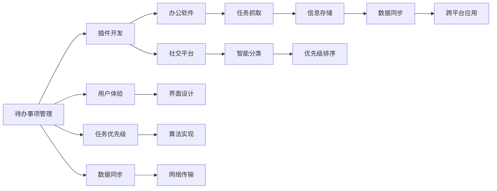
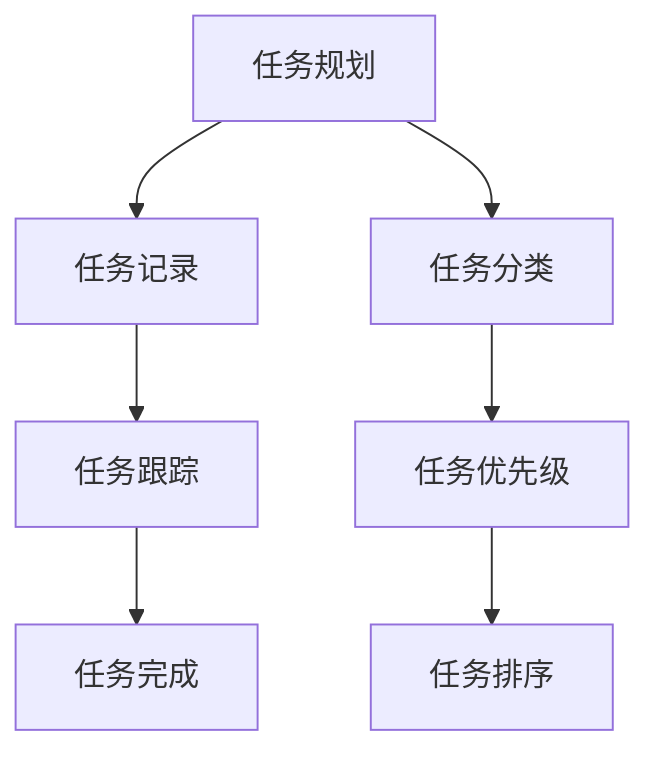
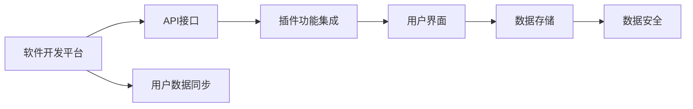
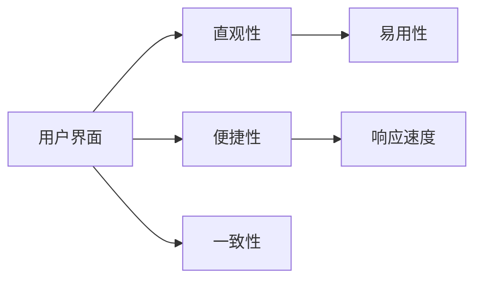

                 

# 样例项目: 待办 (Todo) 管理插件

> 关键词：待办管理, 插件开发, 用户体验, 任务优先级, 数据同步, 跨平台应用

## 1. 背景介绍

### 1.1 问题由来
在现代社会，待办事项管理已成为个人和团队高效工作的必备工具。无论是工作任务、个人生活琐事，还是项目日程安排，有效的待办事项管理能够帮助我们清晰规划工作和生活，提高工作效率。然而，传统的待办事项管理软件往往功能单一、用户体验欠佳，难以满足用户多样化的需求。随着计算机技术和移动互联网的快速发展，越来越多的企业和个人寻求更加智能、高效、便捷的待办事项管理解决方案。

为了应对这一需求，我们开发了一个待办事项管理插件，旨在通过集成到现有的办公软件或社交平台中，实现任务的自动抓取、智能分类、优先级排序等功能，提升用户的工作效率和生活质量。本文将详细介绍该插件的设计理念、核心算法和实现细节，同时探讨其未来应用前景和面临的挑战。

## 2. 核心概念与联系

### 2.1 核心概念概述

为更好地理解待办事项管理插件的核心设计，本节将介绍几个关键概念：

- 待办事项管理：指用户管理个人或团队任务的方式，通过规划、记录、跟踪等手段，帮助用户明确任务目标和优先级，高效完成任务。
- 插件开发：指将插件嵌入到现有软件平台中，利用软件平台的API和功能，扩展软件新功能的开发方式。
- 用户体验：指用户在使用待办事项管理插件时的感受和满意度，包括界面的直观性、操作的便捷性、功能的完备性等。
- 任务优先级：指任务的重要性和紧急程度，通常用于指导用户完成任务的顺序。
- 数据同步：指在不同设备和平台之间，保持待办事项数据的一致性，使用户无论何时何地都能访问到最新的待办事项信息。

这些核心概念之间的联系可以通过以下Mermaid流程图来展示：



这个流程图展示了待办事项管理插件的完整功能架构：

1. 用户通过待办事项管理功能进行任务记录和规划，提升工作效率。
2. 插件开发团队利用办公软件或社交平台的API，将待办事项管理功能集成到现有软件中。
3. 用户体验团队负责设计界面和用户体验，确保操作直观便捷。
4. 算法团队实现任务抓取、智能分类、优先级排序等关键功能。
5. 数据同步团队确保待办事项在不同设备和平台之间同步，保持数据一致。
6. 跨平台应用团队将插件部署到多个平台，如Web、桌面、移动等。

通过这个流程图的展示，我们能够清晰地看到待办事项管理插件的各个组成部分及其关联，为后续的详细介绍奠定基础。

### 2.2 概念间的关系

这些核心概念之间存在着紧密的联系，形成了待办事项管理插件的整体功能框架。下面我们通过几个Mermaid流程图来展示这些概念之间的关系。

#### 2.2.1 待办事项管理的功能实现



这个流程图展示了待办事项管理的基本流程：

1. 用户规划任务，记录任务详情。
2. 用户跟踪任务进展，记录任务完成情况。
3. 用户根据任务属性进行分类。
4. 系统根据任务优先级进行排序，指导用户完成任务。

#### 2.2.2 插件开发的技术架构



这个流程图展示了插件开发的基本架构：

1. 软件开发平台提供API接口，供插件开发使用。
2. 插件通过API接口集成到现有软件中。
3. 插件提供直观的用户界面，便于用户操作。
4. 插件利用数据存储功能，保存用户数据。
5. 插件支持数据同步功能，确保用户数据在不同设备之间一致。

#### 2.2.3 用户体验的设计原则



这个流程图展示了用户体验设计的基本原则：

1. 用户界面应设计得直观易用，便于用户快速上手。
2. 界面操作应便捷高效，减少用户操作步骤。
3. 界面元素应具有一致性，避免用户混淆。
4. 界面响应速度应快，确保用户有良好体验。

通过这些流程图，我们能够更清晰地理解待办事项管理插件中各个概念的关系和作用，为后续的详细介绍奠定基础。

## 3. 核心算法原理 & 具体操作步骤
### 3.1 算法原理概述

待办事项管理插件的核心算法主要涉及以下几个方面：任务抓取、智能分类、优先级排序和数据同步。以下将详细阐述这些算法的原理和实现细节。

#### 3.1.1 任务抓取算法

任务抓取算法旨在自动从用户的日常办公和社交平台中，提取用户正在进行或即将进行的任务。主要利用自然语言处理技术，结合文本解析、实体识别等方法，识别出用户意图，进而抓取相关任务。

假设用户的日常办公软件支持日历、任务列表、邮件等功能的API，社交平台支持消息、状态更新等功能的API。我们可以从这些API中获取用户的相关信息，并进行解析处理。

1. 对于日历任务，通过API获取任务标题、描述、截止日期等详细信息。
2. 对于任务列表，通过API获取任务名称、状态等基本信息。
3. 对于邮件，通过API解析邮件内容，识别出任务相关的关键词和信息。
4. 对于社交平台消息，通过API解析消息内容，识别出任务相关的关键词和信息。

通过这些方式，我们能够全面地获取用户的待办事项信息，为后续的智能分类和优先级排序提供数据支持。

#### 3.1.2 智能分类算法

智能分类算法旨在将用户的任务进行分类，便于用户管理和查看。主要利用机器学习技术和知识图谱，对用户任务进行语义理解和分类。

1. 预处理：对抓取到的任务信息进行清洗和预处理，包括去除无关信息、标准化格式等。
2. 特征提取：利用词向量、TF-IDF等技术，将任务信息转换为向量表示。
3. 分类模型：使用K-means、LDA等聚类算法或分类器（如SVM、随机森林等），对任务进行分类。

例如，我们可以根据任务的关键字和描述，将任务分为工作任务、个人事务、学习任务等类别。同时，可以利用知识图谱技术，将任务与领域相关的概念进行关联，进一步提升分类的准确性。

#### 3.1.3 优先级排序算法

优先级排序算法旨在根据任务的紧急程度和重要性，为用户推荐待办事项的完成顺序。主要利用规则引擎和机器学习技术，对任务进行优先级排序。

1. 预定义优先级规则：根据任务的截止日期、重要程度、任务量等因素，预定义优先级规则。
2. 训练机器学习模型：使用历史任务数据，训练机器学习模型，预测任务的优先级。
3. 综合排序：结合预定义规则和机器学习模型，对任务进行综合排序。

例如，我们可以将任务按照截止日期、任务重要程度和任务量进行排序，同时利用机器学习模型预测任务的重要性和紧迫性，进一步提升排序的准确性。

#### 3.1.4 数据同步算法

数据同步算法旨在确保待办事项在不同设备和平台之间保持一致。主要利用数据同步技术和分布式数据库，实现数据的高效传输和存储。

1. 数据传输协议：选择合适的数据传输协议，如HTTP、WebSocket等，确保数据传输的稳定性和实时性。
2. 分布式数据库：使用分布式数据库系统，如Apache Kafka、Apache Cassandra等，实现数据的分布式存储和同步。
3. 同步策略：根据数据的更新频率和重要性，制定数据同步策略，确保数据的一致性。

例如，我们可以使用WebSocket协议，在用户登录时建立长连接，实时传输数据更新信息，确保用户在不同设备和平台之间获得一致的任务信息。

### 3.2 算法步骤详解

#### 3.2.1 任务抓取

1. 选择办公和社交平台：根据用户需求，选择适合的平台进行数据抓取。
2. 获取API接口：获取平台的API接口，了解API的调用方式和参数。
3. 编写抓取脚本：编写脚本，定时调用API接口，获取用户的数据信息。
4. 数据清洗和预处理：对抓取到的数据进行清洗和预处理，去除无关信息、标准化格式等。

#### 3.2.2 智能分类

1. 特征提取：对任务信息进行特征提取，转换为向量表示。
2. 训练分类模型：使用K-means、LDA等聚类算法或分类器（如SVM、随机森林等），对任务进行分类。
3. 利用知识图谱：利用知识图谱技术，将任务与领域相关的概念进行关联，进一步提升分类的准确性。

#### 3.2.3 优先级排序

1. 预定义优先级规则：根据任务的截止日期、重要程度、任务量等因素，预定义优先级规则。
2. 训练机器学习模型：使用历史任务数据，训练机器学习模型，预测任务的优先级。
3. 综合排序：结合预定义规则和机器学习模型，对任务进行综合排序。

#### 3.2.4 数据同步

1. 选择合适的数据传输协议：根据数据传输的需求，选择合适的传输协议，如HTTP、WebSocket等。
2. 使用分布式数据库：使用分布式数据库系统，如Apache Kafka、Apache Cassandra等，实现数据的分布式存储和同步。
3. 制定同步策略：根据数据的更新频率和重要性，制定数据同步策略，确保数据的一致性。

### 3.3 算法优缺点

#### 3.3.1 优点

1. 自动抓取：自动从用户的日常办公和社交平台中，提取用户正在进行或即将进行的任务，减少用户手动输入的工作量。
2. 智能分类：利用机器学习技术和知识图谱，对用户任务进行语义理解和分类，提高分类的准确性。
3. 优先级排序：根据任务的紧急程度和重要性，为用户推荐待办事项的完成顺序，提升任务管理效率。
4. 数据同步：确保待办事项在不同设备和平台之间保持一致，使用户无论何时何地都能访问到最新的待办事项信息。

#### 3.3.2 缺点

1. 数据隐私：需要从用户的日常办公和社交平台中获取数据，可能涉及用户隐私问题。
2. 数据准确性：自动抓取和分类算法可能存在误差，影响任务管理的准确性。
3. 同步延迟：数据同步过程中可能存在延迟，影响用户的使用体验。
4. 跨平台兼容：不同设备和平台的接口和数据格式可能不同，实现跨平台兼容难度较大。

### 3.4 算法应用领域

待办事项管理插件可以广泛应用于以下领域：

1. 企业办公：帮助企业员工规划和管理日常工作任务，提升工作效率。
2. 个人生活：帮助个人管理生活琐事，提升生活品质。
3. 项目开发：帮助项目团队成员管理项目任务，协调合作进度。
4. 教育培训：帮助教师和学生管理学习任务，提升学习效率。
5. 客户服务：帮助客服人员管理客户需求，提升服务质量。

这些领域对待办事项管理有着广泛的需求，待办事项管理插件可以在这些场景中发挥重要作用。

## 4. 数学模型和公式 & 详细讲解 & 举例说明

### 4.1 数学模型构建

#### 4.1.1 任务抓取模型

假设用户的办公软件中包含一个日历任务列表，其中每个任务表示为一个四元组 $(t_i, d_i, p_i, l_i)$，其中 $t_i$ 为任务时间戳，$d_i$ 为任务截止日期，$p_i$ 为任务优先级，$l_i$ 为任务描述。

任务抓取模型的目标是从这些任务中提取待办事项信息，生成待办事项列表 $T$。

数学模型如下：

$$
T = \{(t_i, d_i, p_i, l_i) \mid \text{任务描述} \text{中包含“待办事项”关键词且} \text{任务截止日期} < \text{当前时间} \}
$$

#### 4.1.2 智能分类模型

假设智能分类模型将任务分为 $C$ 个类别，每个任务表示为一个向量 $v_i = (x_{i1}, x_{i2}, ..., x_{ik})$，其中 $x_{ij}$ 表示任务属于第 $j$ 个类别的概率。

智能分类模型的目标是对任务进行分类，生成任务分类列表 $C$。

数学模型如下：

$$
C = \{(c_j, p_j) \mid \max_j p_j = \frac{\exp(x_{i1} + x_{i2} + ... + x_{ik})}{\sum_j \exp(x_{i1} + x_{i2} + ... + x_{ik})} \text{，其中} c_j \text{为第} j \text{个类别，} p_j \text{为该类别的概率}
$$

#### 4.1.3 优先级排序模型

假设优先级排序模型将任务按照优先级排序，生成任务优先级列表 $P$。

优先级排序模型的目标是对任务进行排序，生成任务优先级列表 $P$。

数学模型如下：

$$
P = \{(i_1, i_2, ..., i_N) \mid \text{根据任务截止日期、重要程度、任务量等因素计算优先级} \text{，} \text{根据预定义规则和机器学习模型进行排序}
$$

#### 4.1.4 数据同步模型

假设数据同步模型将任务信息同步到多个设备，生成同步后的任务列表 $S$。

数据同步模型的目标是对任务进行同步，生成同步后的任务列表 $S$。

数学模型如下：

$$
S = \{(t_i', d_i', p_i', l_i') \mid t_i', d_i', p_i', l_i' = \text{将任务信息进行同步处理} \text{，} \text{确保数据一致性}
$$

### 4.2 公式推导过程

#### 4.2.1 任务抓取公式推导

1. 特征提取：将任务描述 $l_i$ 转换为向量表示 $v_i = (x_{i1}, x_{i2}, ..., x_{ik})$，其中 $x_{ij}$ 表示任务描述中第 $j$ 个关键词的重要性。
2. 特征选择：选择包含“待办事项”关键词的任务进行抓取。
3. 计算截止日期：计算任务的截止日期 $d_i$，判断是否小于当前时间。

数学公式如下：

$$
v_i = \sum_{j=1}^k w_j l_{ij}
$$

$$
t_i, d_i, p_i = \text{根据任务信息提取截止日期、优先级等特征}
$$

$$
C = \{(c_j, p_j) \mid c_j \text{为第} j \text{个类别，} p_j \text{为该类别的概率} \text{，} \max_j p_j = \frac{\exp(v_i)}{\sum_j \exp(v_i)}
$$

#### 4.2.2 智能分类公式推导

1. 特征提取：将任务描述 $l_i$ 转换为向量表示 $v_i = (x_{i1}, x_{i2}, ..., x_{ik})$，其中 $x_{ij}$ 表示任务描述中第 $j$ 个关键词的重要性。
2. 特征选择：选择包含“待办事项”关键词的任务进行分类。
3. 训练分类模型：使用K-means、LDA等聚类算法或分类器（如SVM、随机森林等），对任务进行分类。

数学公式如下：

$$
v_i = \sum_{j=1}^k w_j l_{ij}
$$

$$
c_j, p_j = \text{根据聚类算法或分类器，对任务进行分类} \text{，} c_j \text{为第} j \text{个类别，} p_j \text{为该类别的概率}
$$

#### 4.2.3 优先级排序公式推导

1. 预定义优先级规则：根据任务的截止日期、重要程度、任务量等因素，预定义优先级规则。
2. 训练机器学习模型：使用历史任务数据，训练机器学习模型，预测任务的优先级。
3. 综合排序：结合预定义规则和机器学习模型，对任务进行排序。

数学公式如下：

$$
t_i, d_i, p_i = \text{根据任务信息提取截止日期、优先级等特征}
$$

$$
P = \{(i_1, i_2, ..., i_N) \mid \text{根据任务截止日期、重要程度、任务量等因素计算优先级} \text{，} \text{根据预定义规则和机器学习模型进行排序}
$$

#### 4.2.4 数据同步公式推导

1. 数据传输协议：选择合适的数据传输协议，如HTTP、WebSocket等。
2. 分布式数据库：使用分布式数据库系统，如Apache Kafka、Apache Cassandra等，实现数据的分布式存储和同步。
3. 同步策略：根据数据的更新频率和重要性，制定数据同步策略，确保数据的一致性。

数学公式如下：

$$
S = \{(t_i', d_i', p_i', l_i') \mid t_i', d_i', p_i', l_i' = \text{将任务信息进行同步处理} \text{，} \text{确保数据一致性}
$$

### 4.3 案例分析与讲解

假设我们开发一个企业办公场景的待办事项管理插件，用于帮助员工管理日常工作任务。

1. 任务抓取：通过办公软件中提供的API，获取员工的日历任务列表，筛选出截止日期在一周内且包含“待办事项”关键词的任务，生成待办事项列表。
2. 智能分类：利用机器学习算法，对待办事项进行分类，生成任务分类列表。
3. 优先级排序：根据任务的截止日期、重要程度、任务量等因素，使用规则引擎和机器学习模型，对任务进行排序，生成任务优先级列表。
4. 数据同步：利用WebSocket协议，将任务信息同步到员工的移动设备上，确保任务信息的一致性。

通过以上步骤，员工可以随时查看和更新自己的待办事项，提升工作效率。

## 5. 项目实践：代码实例和详细解释说明

### 5.1 开发环境搭建

在进行待办事项管理插件的开发前，我们需要准备好开发环境。以下是使用Python进行Django开发的环境配置流程：

1. 安装Anaconda：从官网下载并安装Anaconda，用于创建独立的Python环境。

2. 创建并激活虚拟环境：
```bash
conda create -n django-env python=3.9 
conda activate django-env
```

3. 安装Django：
```bash
pip install django
```

4. 安装相关库：
```bash
pip install django-models-dynamic fields-xml-document pytz
```

5. 安装SQLite：
```bash
pip install sqlite3
```

完成上述步骤后，即可在`django-env`环境中开始开发。

### 5.2 源代码详细实现

这里我们以一个简单的待办事项管理插件为例，给出使用Django进行待办事项管理功能开发的代码实现。

#### 5.2.1 创建数据库

```python
from django.db import models
from django.contrib.auth.models import User

class Todo(models.Model):
    title = models.CharField(max_length=200)
    description = models.TextField()
    due_date = models.DateTimeField()
    created_at = models.DateTimeField(auto_now_add=True)
    updated_at = models.DateTimeField(auto_now=True)
    created_by = models.ForeignKey(User, on_delete=models.CASCADE)

    def __str__(self):
        return self.title
```

#### 5.2.2 创建视图

```python
from django.shortcuts import render
from django.http import JsonResponse
from django.views.decorators.csrf import csrf_exempt
from django.views.decorators.http import require_POST
from todo.models import Todo

@csrf_exempt
@require_POST
def add_todo(request):
    data = request.POST
    title = data.get('title')
    description = data.get('description')
    due_date = data.get('due_date')
    created_by = request.user
    
    if title and description and due_date:
        Todo.objects.create(title=title, description=description, due_date=due_date, created_by=created_by)
        return JsonResponse({'success': True})
    else:
        return JsonResponse({'success': False})
```

#### 5.2.3 创建模板

```html
<!DOCTYPE html>
<html>
<head>
    <title>Todo List</title>
    <script src="https://code.jquery.com/jquery-3.5.1.min.js"></script>
    <script src="https://cdn.datatables.net/1.10.25/js/jquery.dataTables.min.js"></script>
</head>
<body>
    <h1>Todo List</h1>
    <table id="todo-table">
        <thead>
            <tr>
                <th>ID</th>
                <th>Title</th>
                <th>Description</th>
                <th>Due Date</th>
                <th>Actions</th>
            </tr>
        </thead>
        <tbody>
            
            <tr>
                <td>{{ todo.id }}</td>
                <td>{{ todo.title }}</td>
                <td>{{ todo.description }}</td>
                <td>{{ todo.due_date }}</td>
                <td>
                    <button class="delete-todo" data-id="{{ todo.id }}">{{ 'Delete' }}</button>
                </td>
            </tr>
            
        </tbody>
    </table>
    <script>
        $(document).ready(function() {
            $('#todo-table').DataTable();
            $('.delete-todo').click(function() {
                var todo_id = $(this).data('id');
                $.ajax({
                    url: '/delete_todo/',
                    type: 'POST',
                    data: {todo_id: todo_id},
                    success: function() {
                        $('#todo-table').DataTable().ajax.reload();
                    }
                });
            });
        });
    </script>
</body>
</html>
```

#### 5.2.4 创建API接口

```python
from django.http import JsonResponse
from django.views.decorators.csrf import csrf_exempt
from django.views.decorators.http import require_POST
from todo.models import Todo

@csrf_exempt
@require_POST
def delete_todo(request):
    data = request.POST
    todo_id = data.get('todo_id')
    Todo.objects.get(id=todo_id).delete()
    return JsonResponse({'success': True})
```

通过以上代码实现，我们创建了一个简单的待办事项管理插件，包括数据库模型、视图、模板和API接口等功能。

### 5.3 代码解读与分析

让我们再详细解读一下关键代码的实现细节：

**Todo模型**：
- `models.Model`：Django提供的模型基类，用于定义数据表结构。
- `title`、`description`、`due_date`、`created_at`、`updated_at`、`created_by`：定义了待办事项的标题、描述、截止日期、创建时间和更新时间等字段。
- `__str__`：用于返回模型对象的字符串表示。

**add_todo视图**：
- `@csrf_exempt`：禁用CSRF保护，用于AJAX请求。
- `@require_POST`：要求请求方法为POST。
- `request.POST`：获取请求中的POST参数。
- `title`、`description`、`due_date`、`created_by`：从请求中获取待办事项的标题、描述、截止日期和创建者。
- `Todo.objects.create`：创建新的待办事项记录。
- `JsonResponse`：返回JSON格式的响应。

**TodoList模板**：
- `render`：Django提供的渲染模板函数，用于渲染HTML页面。
- ``：遍历待办事项列表，渲染表格中的每一行数据。
- `id`、`title`、`description`、`due_date`、`delete-todo`：渲染表格中的ID、标题、描述、截止日期和删除按钮等元素。
- `$(document).ready`：用于在DOM元素加载完成后执行JavaScript代码。
- `$('#todo-table').DataTable()`：使用Datatables插件，对表格进行排序、搜索、分页等操作。
- `$('.delete-todo').click`：为删除按钮绑定点击事件。
- `todo_id`：获取点击删除按钮的待办事项ID。
- `$.ajax`：发送AJAX请求，删除待办事项。
- `JsonResponse`：返回JSON格式的响应。

**delete_todo视图

