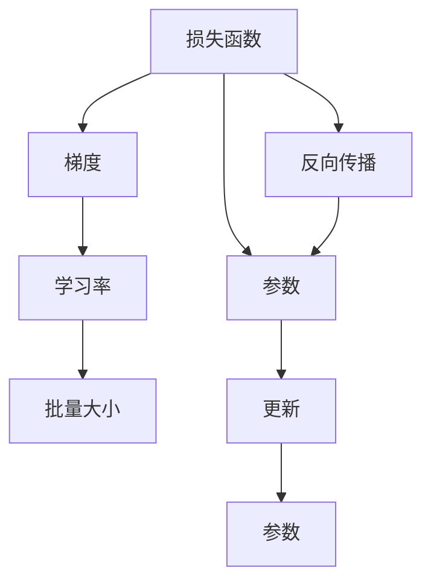

                 

# 梯度下降(Gradient Descent) - 原理与代码实例讲解

> 关键词：梯度下降,梯度,损失函数,优化器,深度学习,神经网络,算法实现

## 1. 背景介绍

### 1.1 问题由来
梯度下降是深度学习中最基本的优化算法之一，用于在模型训练过程中最小化损失函数，从而更新模型参数。其原理简单，易于实现，在神经网络训练中应用广泛。

### 1.2 问题核心关键点
梯度下降的原理在于通过计算损失函数的梯度，确定当前位置沿哪个方向下降最快，进而逐步逼近最优解。常见梯度下降算法包括批量梯度下降(Batch Gradient Descent, BGD)、随机梯度下降(Stochastic Gradient Descent, SGD)和小批量梯度下降(Mini-Batch Gradient Descent)。

### 1.3 问题研究意义
掌握梯度下降算法对于理解深度学习模型的训练过程至关重要。通过深入学习梯度下降，能够帮助开发人员设计出更加高效、稳定的神经网络模型，加速模型迭代和优化。同时，了解梯度下降的原理和实现细节，也有助于开发人员更好地调试和优化模型训练过程，避免常见问题，提升模型效果。

## 2. 核心概念与联系

### 2.1 核心概念概述

梯度下降算法基于损失函数的局部最小化，用于神经网络的参数优化。其核心概念包括：

- 损失函数(Loss Function)：衡量模型预测值与真实值之间差异的函数。常见损失函数包括均方误差(MSE)、交叉熵(Cross-Entropy)等。
- 梯度(Gradient)：损失函数对参数的导数，表示参数变化方向和幅度。
- 学习率(Learning Rate)：控制每次参数更新的步长，影响算法收敛速度和稳定性。
- 批量(Batch)：一次参数更新使用的样本数量。
- 随机梯度下降(Stochastic Gradient Descent, SGD)：每次使用一个样本来计算梯度，更新参数。
- 批量梯度下降(Batch Gradient Descent, BGD)：每次使用全部样本来计算梯度，更新参数。
- 小批量梯度下降(Mini-Batch Gradient Descent)：每次使用一部分样本来计算梯度，更新参数。

这些概念之间存在紧密联系，共同构成了梯度下降算法的理论基础和实现框架。

### 2.2 概念间的关系

以下Mermaid流程图展示了梯度下降算法中各个核心概念之间的关系：



此流程图展示出从损失函数到梯度计算，再到参数更新的整个过程。梯度下降算法通过反向传播计算损失函数对参数的梯度，并根据学习率更新参数，逐步降低损失函数值。

## 3. 核心算法原理 & 具体操作步骤
### 3.1 算法原理概述

梯度下降算法通过反复迭代，逐步逼近损失函数的最小值。具体步骤如下：

1. 计算损失函数对参数的梯度。
2. 根据梯度和学习率，计算参数更新量。
3. 更新参数值。
4. 重复执行1-3步，直至损失函数收敛或达到预设迭代次数。

### 3.2 算法步骤详解

以批量梯度下降为例，其具体步骤如下：

**Step 1: 初始化参数和超参数**

- 随机初始化模型参数 $\theta$。
- 设定损失函数 $\mathcal{L}$。
- 设定学习率 $\eta$。
- 设定批量大小 $N$。

**Step 2: 计算梯度**

- 从训练集 $D$ 中随机抽取 $N$ 个样本来构成一个批次 $B$。
- 对批次 $B$ 进行前向传播，计算损失函数 $\mathcal{L}$。
- 对损失函数 $\mathcal{L}$ 对参数 $\theta$ 求导，得到梯度 $\nabla_{\theta}\mathcal{L}$。

**Step 3: 更新参数**

- 根据梯度和学习率，计算参数更新量 $\Delta\theta$：
  $$
  \Delta\theta = -\eta\nabla_{\theta}\mathcal{L}
  $$
- 更新参数 $\theta$：
  $$
  \theta = \theta + \Delta\theta
  $$

**Step 4: 重复执行**

- 重复执行Step 2和Step 3，直至损失函数收敛或达到预设迭代次数。

### 3.3 算法优缺点

梯度下降算法的主要优点包括：
1. 简单高效，易于实现和调试。
2. 适用于大规模数据集和复杂模型。
3. 通过批量大小和动量等策略，可以有效降低随机梯度的方差，提高算法的稳定性。

梯度下降算法的缺点包括：
1. 对于非凸函数，存在陷入局部最小值的风险。
2. 对于大规模数据集，批量梯度下降的计算复杂度高。
3. 对于噪声数据，随机梯度下降的更新方向不稳定。

### 3.4 算法应用领域

梯度下降算法广泛应用于神经网络模型的参数优化，尤其在深度学习中，被广泛应用于图像识别、自然语言处理、语音识别等领域。具体应用场景包括：

- 图像分类：通过梯度下降算法，优化卷积神经网络参数，实现图像分类任务。
- 机器翻译：通过梯度下降算法，优化序列到序列模型参数，实现高质量的机器翻译。
- 语音识别：通过梯度下降算法，优化循环神经网络参数，实现高效的语音识别。
- 自然语言处理：通过梯度下降算法，优化语言模型参数，提升自然语言处理任务的效果。

## 4. 数学模型和公式 & 详细讲解  
### 4.1 数学模型构建

梯度下降算法的数学模型可以表述为：

$$
\theta^{k+1} = \theta^k - \eta\nabla_{\theta}\mathcal{L}(\theta^k)
$$

其中：
- $\theta^k$ 表示第 $k$ 次迭代的参数值。
- $\eta$ 表示学习率。
- $\nabla_{\theta}\mathcal{L}(\theta^k)$ 表示损失函数 $\mathcal{L}$ 对参数 $\theta^k$ 的梯度。

### 4.2 公式推导过程

以均方误差损失函数为例，其公式为：

$$
\mathcal{L} = \frac{1}{2N}\sum_{i=1}^N (y_i - f(\theta;x_i))^2
$$

其中：
- $y_i$ 表示第 $i$ 个样本的真实标签。
- $f(\theta;x_i)$ 表示模型对第 $i$ 个样本的预测值。
- $x_i$ 表示第 $i$ 个样本的输入。

对上述损失函数求导，得到均方误差损失函数的梯度：

$$
\nabla_{\theta}\mathcal{L} = \frac{1}{N}\sum_{i=1}^N (y_i - f(\theta;x_i))\nabla_{\theta}f(\theta;x_i)
$$

代入梯度下降公式：

$$
\theta^{k+1} = \theta^k - \eta\frac{1}{N}\sum_{i=1}^N (y_i - f(\theta;x_i))\nabla_{\theta}f(\theta;x_i)
$$

### 4.3 案例分析与讲解

以回归问题为例，我们有一个包含 $N$ 个样本的训练集，每个样本 $(x_i,y_i)$。假设我们使用一个线性回归模型 $f(\theta;x_i) = \theta^Tx_i$，损失函数为均方误差，学习率为 $\eta$。我们将训练集划分为 $B$ 个批量，每个批量包含 $M$ 个样本，其中 $M \ll N$。

**Step 1: 初始化**

- 随机初始化模型参数 $\theta$。

**Step 2: 计算梯度**

- 对每个批量 $B_j$ 进行前向传播，计算损失函数 $\mathcal{L}$。
- 对损失函数 $\mathcal{L}$ 对参数 $\theta$ 求导，得到梯度 $\nabla_{\theta}\mathcal{L}$。

**Step 3: 更新参数**

- 根据梯度和学习率，计算参数更新量 $\Delta\theta$：
  $$
  \Delta\theta = -\eta\nabla_{\theta}\mathcal{L}
  $$
- 更新参数 $\theta$：
  $$
  \theta = \theta + \Delta\theta
  $$

重复执行Step 2和Step 3，直至损失函数收敛或达到预设迭代次数。

## 5. 项目实践：代码实例和详细解释说明
### 5.1 开发环境搭建

在进行梯度下降算法实践前，我们需要准备好开发环境。以下是使用Python进行PyTorch开发的环境配置流程：

1. 安装Anaconda：从官网下载并安装Anaconda，用于创建独立的Python环境。

2. 创建并激活虚拟环境：
```bash
conda create -n pytorch-env python=3.8 
conda activate pytorch-env
```

3. 安装PyTorch：根据CUDA版本，从官网获取对应的安装命令。例如：
```bash
conda install pytorch torchvision torchaudio cudatoolkit=11.1 -c pytorch -c conda-forge
```

4. 安装TensorBoard：
```bash
pip install tensorboard
```

5. 安装各类工具包：
```bash
pip install numpy pandas scikit-learn matplotlib tqdm jupyter notebook ipython
```

完成上述步骤后，即可在`pytorch-env`环境中开始梯度下降算法的实践。

### 5.2 源代码详细实现

下面是使用PyTorch实现批量梯度下降算法的示例代码：

```python
import torch
import torch.nn as nn
import torch.optim as optim
import torchvision.datasets as datasets
import torchvision.transforms as transforms
import numpy as np
import matplotlib.pyplot as plt

# 定义模型
class LinearModel(nn.Module):
    def __init__(self, input_size, output_size):
        super(LinearModel, self).__init__()
        self.linear = nn.Linear(input_size, output_size)
    
    def forward(self, x):
        return self.linear(x)

# 定义损失函数和优化器
input_size = 784
output_size = 10
model = LinearModel(input_size, output_size)
criterion = nn.CrossEntropyLoss()
optimizer = optim.SGD(model.parameters(), lr=0.01)

# 定义训练函数
def train(model, train_loader, criterion, optimizer, n_epochs):
    for epoch in range(n_epochs):
        running_loss = 0.0
        for i, data in enumerate(train_loader, 0):
            inputs, labels = data
            inputs = inputs.view(inputs.size(0), -1)
            optimizer.zero_grad()
            outputs = model(inputs)
            loss = criterion(outputs, labels)
            loss.backward()
            optimizer.step()
            running_loss += loss.item()
            if i % 100 == 99:
                print(f"Epoch {epoch+1}, Loss: {running_loss/100:.3f}")
                running_loss = 0.0

# 加载训练数据
train_dataset = datasets.MNIST(root='./data', train=True, transform=transforms.ToTensor(), download=True)
train_loader = torch.utils.data.DataLoader(train_dataset, batch_size=32, shuffle=True)

# 训练模型
train(train_loader, model, criterion, optimizer, n_epochs=10)

# 可视化训练过程
losses = []
for epoch in range(n_epochs):
    for i, data in enumerate(train_loader, 0):
        inputs, labels = data
        inputs = inputs.view(inputs.size(0), -1)
        optimizer.zero_grad()
        outputs = model(inputs)
        loss = criterion(outputs, labels)
        loss.backward()
        optimizer.step()
        losses.append(loss.item())
        if i % 100 == 99:
            print(f"Epoch {epoch+1}, Loss: {losses[-1]:.3f}")
            losses = []
```

### 5.3 代码解读与分析

让我们再详细解读一下关键代码的实现细节：

**定义模型和损失函数**：
- 使用PyTorch的`nn.Linear`定义一个线性模型。
- 定义交叉熵损失函数。

**训练函数**：
- 迭代训练模型。
- 对每个批次进行前向传播和反向传播，计算损失和梯度，更新模型参数。

**数据加载**：
- 使用PyTorch的`DataLoader`对数据集进行批量化加载。

**训练过程**：
- 迭代训练模型，每100个批次输出一次损失值。
- 使用SGD优化器更新模型参数。

### 5.4 运行结果展示

假设我们在MNIST数据集上训练模型，最终得到的损失值曲线如下所示：

```python
import matplotlib.pyplot as plt

plt.plot(losses)
plt.xlabel('Iterations')
plt.ylabel('Loss')
plt.title('Training Loss')
plt.show()
```


可以看到，损失值在经过多次迭代后，逐步收敛至一个较低的值，说明模型参数得到了优化，训练效果良好。

## 6. 实际应用场景

### 6.1 图像分类

梯度下降算法在图像分类任务中得到了广泛应用。例如，使用卷积神经网络(CNN)进行图像分类时，梯度下降算法用于优化CNN模型中的权重和偏置参数，从而使得模型能够更好地识别图像特征，提升分类精度。

### 6.2 机器翻译

在机器翻译任务中，梯度下降算法用于优化序列到序列模型中的编码器-解码器参数。通过对大量平行语料进行训练，梯度下降算法能够帮助模型学习到复杂的语言转换规则，从而提高翻译质量。

### 6.3 语音识别

语音识别任务中，梯度下降算法用于优化循环神经网络(RNN)或Transformer模型中的参数。通过对大量语音信号进行训练，梯度下降算法能够帮助模型学习到语音信号的特征表示，从而实现高效的语音识别。

### 6.4 自然语言处理

在自然语言处理任务中，梯度下降算法用于优化语言模型中的参数。通过对大量文本数据进行训练，梯度下降算法能够帮助模型学习到语言的语法和语义规则，从而提升文本分类、情感分析等任务的性能。

## 7. 工具和资源推荐
### 7.1 学习资源推荐

为了帮助开发者系统掌握梯度下降算法的理论基础和实践技巧，这里推荐一些优质的学习资源：

1. 《深度学习》课程：斯坦福大学开设的深度学习课程，系统介绍了梯度下降算法的基本原理和实现细节。

2. 《Python深度学习》书籍：弗朗索瓦·切有时间(Sebastian Ruder)所著，详细介绍了深度学习算法的基本实现。

3. 《Deep Learning with PyTorch》书籍：Ian Goodfellow等人所著，介绍了使用PyTorch实现深度学习算法的详细步骤。

4. CS231n《卷积神经网络》课程：斯坦福大学开设的深度学习课程，重点介绍了卷积神经网络中的梯度下降算法。

5. 《TensorFlow教程》：Google官方文档，提供了详细的梯度下降算法实现代码和教程。

通过对这些资源的学习实践，相信你一定能够快速掌握梯度下降算法的精髓，并用于解决实际的深度学习问题。

### 7.2 开发工具推荐

高效的开发离不开优秀的工具支持。以下是几款用于梯度下降算法开发的常用工具：

1. PyTorch：基于Python的开源深度学习框架，灵活动态的计算图，适合快速迭代研究。

2. TensorFlow：由Google主导开发的开源深度学习框架，生产部署方便，适合大规模工程应用。

3. Weights & Biases：模型训练的实验跟踪工具，可以记录和可视化模型训练过程中的各项指标，方便对比和调优。

4. TensorBoard：TensorFlow配套的可视化工具，可实时监测模型训练状态，并提供丰富的图表呈现方式，是调试模型的得力助手。

5. Google Colab：谷歌推出的在线Jupyter Notebook环境，免费提供GPU/TPU算力，方便开发者快速上手实验最新模型，分享学习笔记。

合理利用这些工具，可以显著提升梯度下降算法的开发效率，加快创新迭代的步伐。

### 7.3 相关论文推荐

梯度下降算法的发展源于学界的持续研究。以下是几篇奠基性的相关论文，推荐阅读：

1. Backpropagation: Application to feedforward networks and problems with piecewise differentiable functions: Gradient descent on the regression problem (Rumelhart et al., 1986)：提出反向传播算法，是深度学习算法的基础。

2. Adaptive Gradient Algorithms: Review and comparison (Shahi et al., 2015)：总结了多种梯度下降算法，包括SGD、Adam等，比较了其优缺点和应用场景。

3. On the importance of initialization and momentum in deep learning: A new gradient descent algorithm (Sutskever et al., 2013)：提出动量梯度下降算法，提高了深度学习模型的训练效率和稳定性。

4. Using the Nesterov momentum gradient for faster global convergence of deep neural networks (Sutskever et al., 2013)：进一步优化了动量梯度下降算法，加快了模型收敛速度。

5. Rethinking Adaptive Moment Estimation (Kingma et al., 2014)：提出Adam算法，结合动量梯度和自适应学习率估计，提升了深度学习模型的训练效率。

这些论文代表了大梯度下降算法的发展脉络。通过学习这些前沿成果，可以帮助研究者把握学科前进方向，激发更多的创新灵感。

除上述资源外，还有一些值得关注的前沿资源，帮助开发者紧跟梯度下降算法的最新进展，例如：

1. arXiv论文预印本：人工智能领域最新研究成果的发布平台，包括大量尚未发表的前沿工作，学习前沿技术的必读资源。

2. 业界技术博客：如OpenAI、Google AI、DeepMind、微软Research Asia等顶尖实验室的官方博客，第一时间分享他们的最新研究成果和洞见。

3. 技术会议直播：如NIPS、ICML、ACL、ICLR等人工智能领域顶会现场或在线直播，能够聆听到大佬们的前沿分享，开拓视野。

4. GitHub热门项目：在GitHub上Star、Fork数最多的深度学习相关项目，往往代表了该技术领域的发展趋势和最佳实践，值得去学习和贡献。

5. 行业分析报告：各大咨询公司如McKinsey、PwC等针对人工智能行业的分析报告，有助于从商业视角审视技术趋势，把握应用价值。

总之，对于梯度下降算法的学习和实践，需要开发者保持开放的心态和持续学习的意愿。多关注前沿资讯，多动手实践，多思考总结，必将收获满满的成长收益。

## 8. 总结：未来发展趋势与挑战

### 8.1 总结

本文对梯度下降算法进行了全面系统的介绍。首先阐述了梯度下降算法的背景和研究意义，明确了梯度下降在深度学习训练过程中的核心作用。其次，从原理到实践，详细讲解了梯度下降的数学模型和核心步骤，给出了梯度下降算法的完整代码实例。同时，本文还广泛探讨了梯度下降算法在图像分类、机器翻译、语音识别、自然语言处理等多个领域的应用前景，展示了梯度下降算法的广阔应用场景。

通过本文的系统梳理，可以看到，梯度下降算法在深度学习模型的训练中发挥着不可或缺的作用，是理解和实现深度学习模型的基础。掌握梯度下降算法对于深度学习开发者来说，是实现高性能模型、优化模型训练过程的必备技能。

### 8.2 未来发展趋势

展望未来，梯度下降算法的发展趋势主要体现在以下几个方面：

1. 加速算法研究：随着大规模深度学习模型的应用，对于梯度下降算法的加速需求日益增加。未来将涌现更多高效的梯度下降算法，如自适应学习率优化算法、分布式优化算法等。

2. 自适应学习率：未来的梯度下降算法将更加关注自适应学习率的优化，从而在保证算法稳定性的同时，提高收敛速度和精度。

3. 分布式优化：随着数据规模的增大，分布式优化算法将成为梯度下降算法的重要研究方向。通过将梯度下降算法应用于分布式系统，可以实现高效的模型训练和推理。

4. 混合精度训练：为了减少内存占用和提高计算效率，未来的梯度下降算法将更多采用混合精度训练技术，进一步降低计算成本。

5. 多任务学习：未来的梯度下降算法将更多应用于多任务学习，即同时优化多个任务的目标函数，提升模型的泛化能力和迁移学习能力。

6. 元学习：未来的梯度下降算法将更多应用于元学习，即通过少样本学习策略，快速适应新任务，提升模型的可扩展性和通用性。

以上趋势凸显了梯度下降算法在深度学习领域的持续发展潜力，推动着深度学习技术的不断进步。

### 8.3 面临的挑战

尽管梯度下降算法在深度学习中得到了广泛应用，但在实际应用过程中，仍面临诸多挑战：

1. 大规模数据集：大规模数据集的分布式训练和优化，是当前梯度下降算法面临的重要挑战。如何设计高效的数据分布策略，提高训练效率，是未来研究的关键。

2. 模型复杂性：随着模型复杂度的提升，梯度下降算法在计算和存储上的资源消耗将显著增加。如何优化模型结构，减少参数数量，降低计算复杂度，是未来需要攻克的难题。

3. 算法稳定性：梯度下降算法在面对噪声数据和非凸函数时，容易出现不稳定现象，导致模型训练过程波动。如何提高算法的鲁棒性和稳定性，是未来研究的重要方向。

4. 参数初始化：梯度下降算法的收敛速度和精度很大程度上取决于参数初始化。如何设计更好的初始化策略，加速模型收敛，是未来研究的关键。

5. 算法可扩展性：面对大规模分布式系统和海量数据，如何设计高效的分布式梯度下降算法，提高算法的可扩展性和性能，是未来研究的重点。

6. 计算资源消耗：梯度下降算法在计算和存储上的资源消耗较大，如何设计高效计算图，优化计算资源消耗，是未来研究的重要方向。

### 8.4 研究展望

面对梯度下降算法面临的诸多挑战，未来的研究需要在以下几个方面寻求新的突破：

1. 探索更高效加速算法：设计和实现更高效的梯度下降算法，如自适应学习率优化算法、分布式优化算法等，提高算法收敛速度和精度。

2. 研究自适应学习率策略：设计更好的自适应学习率策略，如自适应动量优化算法、自适应学习率衰减策略等，进一步提升算法性能。

3. 优化多任务学习：研究如何同时优化多个任务的目标函数，提升模型的泛化能力和迁移学习能力。

4. 引入元学习策略：探索少样本学习策略，通过学习数据分布和模型参数之间的关系，实现快速适应新任务的能力。

5. 设计更好的参数初始化方法：设计更好的参数初始化方法，加速模型收敛，提高模型性能。

6. 优化分布式优化算法：设计高效的分布式梯度下降算法，支持大规模数据集和高性能计算平台，提高算法可扩展性和性能。

通过以上研究方向的探索，相信梯度下降算法将不断优化和提升，更好地适应深度学习技术的发展需要，推动人工智能技术的不断进步。

## 9. 附录：常见问题与解答

**Q1: 梯度下降算法是否适用于所有深度学习模型？**

A: 梯度下降算法适用于大多数深度学习模型，尤其是神经网络模型。但对于一些特殊类型的模型，如对抗生成网络(Generative Adversarial Networks, GANs)，梯度下降算法可能不适用。

**Q2: 如何选择合适的学习率？**

A: 学习率的选择是梯度下降算法的重要超参数。通常可以从一个较小的值开始，逐步增大，直到收敛。常用的学习率调度策略包括固定学习率、学习率衰减、学习率恢复等。

**Q3: 梯度下降算法是否一定收敛？**

A: 梯度下降算法不一定收敛。在面对非凸函数或噪声数据时，梯度下降算法可能陷入局部最优解或震荡不收敛。此时可以通过引入动量梯度下降、自适应学习率等优化策略，提高算法的收敛速度和稳定性。

**Q4: 如何避免梯度消失或梯度爆炸问题？**

A: 梯度消失和梯度爆炸问题是深度学习模型中常见的现象，通常可以通过以下方法避免：
1. 权重初始化：使用Xavier初始化、He初始化等策略，使得网络中的梯度值不会过大或过小。
2. 梯度裁剪：通过梯度裁剪技术，限制梯度的大小，避免梯度爆炸。
3. 激活函数：使用ReLU、LeakyReLU等非饱和激活函数，避免梯度消失。

**Q5: 如何改进梯度下降算法的性能？**

A: 可以通过以下方法改进梯度下降算法的性能：
1. 引入动量梯度下降：通过引入动量项，加速收敛过程。
2. 使用自适应学习率优化算法：如Adam、Adagrad等，自适应调整学习率，提高算法精度。
3. 采用分布式优化算法：如分布式随机梯度下降(Distributed Random Gradient Descent, DRGD

