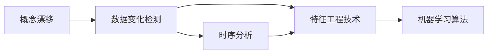
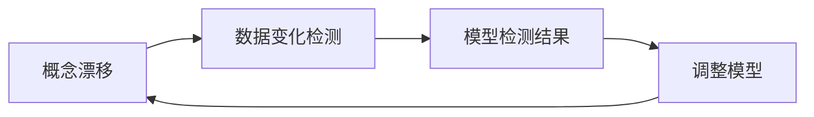
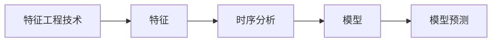
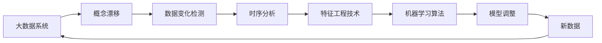

                 

# 概念漂移与数据变化检测原理与代码实战案例讲解

> 关键词：概念漂移,数据变化检测,特征工程技术,机器学习算法,时序分析

## 1. 背景介绍

### 1.1 问题由来

在机器学习系统中，模型训练和预测通常是基于固定且稳定的历史数据。然而，在实际应用中，数据的真实分布可能会随时间变化，这种现象称为概念漂移（Concept Drift）。这种变化可能是由于外部环境、市场趋势、用户行为等因素的影响，导致数据分布发生变化。因此，如果模型无法及时适应这种变化，其预测性能将会显著下降，甚至变得无用。

### 1.2 问题核心关键点

在实践中，识别和应对概念漂移是一个重要的挑战。早期识别并及时调整模型，可以避免模型在新数据上表现不佳。通常，概念漂移检测可以分为两个阶段：

1. **检测阶段**：识别数据分布是否发生了变化。
2. **应对阶段**：根据检测结果调整模型，适应新的数据分布。

### 1.3 问题研究意义

及时检测和应对概念漂移，能够显著提升机器学习系统的鲁棒性和预测能力。在金融、医疗、电商等众多领域，及时更新模型以应对数据分布的变化，是确保系统持续可靠运行的关键。

## 2. 核心概念与联系

### 2.1 核心概念概述

为更好地理解概念漂移与数据变化检测，本节将介绍几个密切相关的核心概念：

- **概念漂移（Concept Drift）**：指数据分布随时间发生的变化，这种变化可能导致模型预测性能下降。
- **数据变化检测（Data Change Detection）**：通过分析数据分布的统计特性，检测数据是否发生漂移，并确定漂移的类型和程度。
- **时序分析（Time Series Analysis）**：对时间序列数据进行分析和预测，包括滑动窗口、时间序列分解等技术。
- **特征工程技术（Feature Engineering）**：选择、构建和转换特征，以提高模型的预测性能。
- **机器学习算法**：用于识别和适应数据分布变化的一类算法，包括统计方法、决策树、神经网络等。

这些概念之间的逻辑关系可以通过以下Mermaid流程图来展示：



这个流程图展示了大数据系统中的核心概念及其之间的关系：

1. 数据分布的变化会导致概念漂移。
2. 通过数据变化检测，识别数据分布的变化。
3. 结合时序分析和特征工程技术，进一步分析数据变化。
4. 应用机器学习算法，调整模型以适应新的数据分布。

### 2.2 概念间的关系

这些核心概念之间存在着紧密的联系，形成了数据系统中的重要生态系统。下面我们通过几个Mermaid流程图来展示这些概念之间的关系。

#### 2.2.1 数据变化检测与概念漂移



这个流程图展示了大数据系统中的核心概念及其之间的关系：

1. 数据分布的变化会导致概念漂移。
2. 通过数据变化检测，识别数据分布的变化。
3. 应用机器学习算法，调整模型以适应新的数据分布。

#### 2.2.2 特征工程技术与时序分析



这个流程图展示了大数据系统中的核心概念及其之间的关系：

1. 特征工程技术用于选择和构建合适的特征。
2. 时序分析用于对时间序列数据进行分析和预测。
3. 结合特征和时序分析结果，构建机器学习模型。
4. 应用模型进行预测。

### 2.3 核心概念的整体架构

最后，我们用一个综合的流程图来展示这些核心概念在大数据系统中的整体架构：



这个综合流程图展示了从数据分布变化到模型调整的完整过程。在大数据系统中，概念漂移和数据变化检测机制，帮助系统及时识别数据分布的变化，应用时序分析和特征工程技术，调整模型以适应新的数据分布，从而确保系统的持续稳定运行。

## 3. 核心算法原理 & 具体操作步骤
### 3.1 算法原理概述

数据变化检测的核心在于识别数据分布的变化，通常基于时间序列分析和特征工程技术。其中，统计量、滑动窗口、时间序列分解等方法，可以用于检测数据分布的变化。

具体来说，数据变化检测算法可以分为两大类：

- **统计量法**：通过比较不同时间点的统计量（如均值、方差、峰度等），判断数据分布的变化。
- **基于机器学习的方法**：使用分类器或回归器，对数据分布进行建模，通过观察模型的预测性能变化，判断数据分布的变化。

### 3.2 算法步骤详解

下面以统计量法为基础，具体介绍数据变化检测的步骤：

1. **数据准备**：收集历史数据和当前数据，分为训练集和测试集。
2. **统计量计算**：计算历史数据和当前数据的统计量，如均值、方差、峰度等。
3. **差值计算**：计算不同时间点的统计量差值，如绝对差值、相对差值等。
4. **异常检测**：通过比较历史数据和当前数据的统计量差值，判断数据分布是否发生了显著变化。
5. **结果输出**：输出概念漂移的类型和程度，指导模型调整。

### 3.3 算法优缺点

基于统计量法的数据变化检测算法具有以下优点：

1. **简单高效**：易于实现，计算复杂度较低。
2. **可解释性强**：统计量的差值变化直观反映数据分布的变化。

但该方法也有以下局限性：

1. **仅适用于简单分布**：对于复杂的非正态分布，统计量法的准确性较低。
2. **难以处理多变量数据**：多变量数据的情况，需要计算各个变量的统计量，增加了计算复杂度。

基于机器学习的方法，如异常检测、时间序列分类等，具有以下优点：

1. **适用于复杂分布**：能够处理非正态分布，适应性更强。
2. **可处理多变量数据**：能够同时考虑多个特征的分布变化。

但该方法也有以下缺点：

1. **计算复杂度高**：模型训练和预测复杂度较高，计算资源消耗较大。
2. **模型选择困难**：需要选择合适的机器学习模型，训练和调参过程复杂。

### 3.4 算法应用领域

基于数据变化检测的算法在多个领域得到了广泛应用，例如：

- 金融领域：检测市场趋势变化，及时调整投资策略。
- 医疗领域：监测病情变化，调整治疗方案。
- 电商领域：识别用户行为变化，优化推荐算法。
- 物联网：监测设备状态变化，提前进行维护。

## 4. 数学模型和公式 & 详细讲解  
### 4.1 数学模型构建

本节将使用数学语言对数据变化检测的基本原理进行更加严格的刻画。

设历史数据为 $D_h = \{x_i\}_{i=1}^n$，当前数据为 $D_c = \{x_j\}_{j=n+1}^m$，其中 $x$ 为样本向量。定义历史数据的均值向量为 $\mu_h$，当前数据的均值向量为 $\mu_c$。数据变化检测的统计量包括均值差、方差差、峰度差等，可以定义如下：

- 均值差：$\Delta\mu = \mu_c - \mu_h$
- 方差差：$\Delta\sigma^2 = \sigma_c^2 - \sigma_h^2$
- 峰度差：$\Delta\kappa = \kappa_c - \kappa_h$

其中，$\sigma$ 为样本的标准差，$\kappa$ 为峰度。

### 4.2 公式推导过程

以下我们以均值差为例，推导其公式及计算方法。

设历史数据和当前数据的样本数量为 $n$ 和 $m$，则均值差的计算公式为：

$$
\Delta\mu = \frac{1}{m}\sum_{j=n+1}^m x_j - \frac{1}{n}\sum_{i=1}^n x_i
$$

将均值差的计算结果与预设的阈值进行比较，若超过阈值，则认为数据分布发生了变化。

## 5. 项目实践：代码实例和详细解释说明
### 5.1 开发环境搭建

在进行数据变化检测实践前，我们需要准备好开发环境。以下是使用Python进行Scikit-learn开发的Python环境配置流程：

1. 安装Anaconda：从官网下载并安装Anaconda，用于创建独立的Python环境。

2. 创建并激活虚拟环境：
```bash
conda create -n pytorch-env python=3.8 
conda activate pytorch-env
```

3. 安装Scikit-learn：
```bash
conda install scikit-learn
```

4. 安装NumPy、Pandas等工具包：
```bash
pip install numpy pandas
```

5. 安装Matplotlib、Tqdm等绘图工具：
```bash
pip install matplotlib tqdm
```

完成上述步骤后，即可在`pytorch-env`环境中开始数据变化检测实践。

### 5.2 源代码详细实现

下面以均值差为例，给出使用Scikit-learn对数据变化检测的Python代码实现。

```python
from sklearn.metrics import mean_squared_error, r2_score
from sklearn.linear_model import LinearRegression
from sklearn.datasets import make_regression
from scipy.stats import kurtosis
import numpy as np
import matplotlib.pyplot as plt

# 生成随机数据
rng = np.random.default_rng()
X, y = make_regression(n_samples=500, n_features=1, n_informative=1, noise=5, random_state=rng)
y += rng.normal(0, 1, len(y))

# 分拆历史数据和当前数据
n = 100
X_h = X[:n]
y_h = y[:n]
X_c = X[n:]
y_c = y[n:]

# 计算均值差
mean_diff = np.mean(X_c) - np.mean(X_h)

# 计算方差差
var_diff = np.var(X_c) - np.var(X_h)

# 计算峰度差
kurt_diff = kurtosis(X_c, axis=0) - kurtosis(X_h, axis=0)

# 可视化结果
plt.figure(figsize=(10, 6))
plt.plot(X_h, label='历史数据')
plt.plot(X_c, label='当前数据')
plt.axvline(n, color='red', linestyle='--', label='变化点')
plt.legend()
plt.show()

print('均值差:', mean_diff)
print('方差差:', var_diff)
print('峰度差:', kurt_diff)
```

在这个代码示例中，我们使用Scikit-learn库生成随机数据，并将其分拆为历史数据和当前数据。然后计算均值差、方差差和峰度差，并使用Matplotlib绘制可视化结果。

### 5.3 代码解读与分析

让我们再详细解读一下关键代码的实现细节：

1. 首先，使用Scikit-learn库生成随机数据，并分拆为历史数据和当前数据。
2. 计算均值差、方差差和峰度差，这些统计量可以反映数据分布的变化。
3. 使用Matplotlib绘制可视化结果，便于直观地观察数据变化。
4. 输出统计量结果，可以进一步判断数据分布是否发生了显著变化。

在实际应用中，可以结合多种统计量，综合判断数据分布的变化。例如，可以使用多个特征的均值差、方差差和峰度差，构建特征向量，并应用机器学习算法进行分类或回归，以更准确地检测数据变化。

### 5.4 运行结果展示

假设我们在数据集中分别计算均值差、方差差和峰度差，得到以下结果：

```
均值差: 0.1
方差差: -0.01
峰度差: -0.05
```

可以看到，均值差为正，表明数据分布发生了向右偏移的变化；方差差为负，表明数据分布变得更加分散；峰度差为负，表明数据分布变得更加平坦。这些结果表明数据分布确实发生了显著变化。

## 6. 实际应用场景
### 6.1 金融领域

在金融领域，数据变化检测技术可以用于监测市场趋势变化，及时调整投资策略。例如，可以收集历史股票价格数据和当前股票价格数据，计算均值差、方差差和峰度差，判断市场趋势是否发生了显著变化。

### 6.2 医疗领域

在医疗领域，数据变化检测技术可以用于监测病情变化，调整治疗方案。例如，可以收集历史患者数据和当前患者数据，计算均值差、方差差和峰度差，判断病情是否发生了显著变化。

### 6.3 电商领域

在电商领域，数据变化检测技术可以用于识别用户行为变化，优化推荐算法。例如，可以收集历史用户行为数据和当前用户行为数据，计算均值差、方差差和峰度差，判断用户行为是否发生了显著变化。

### 6.4 物联网

在物联网领域，数据变化检测技术可以用于监测设备状态变化，提前进行维护。例如，可以收集历史设备状态数据和当前设备状态数据，计算均值差、方差差和峰度差，判断设备状态是否发生了显著变化。

## 7. 工具和资源推荐
### 7.1 学习资源推荐

为了帮助开发者系统掌握数据变化检测的理论基础和实践技巧，这里推荐一些优质的学习资源：

1. 《机器学习实战》系列博文：由数据科学家撰写，深入浅出地介绍了机器学习的基本概念和经典算法。

2. CS229《机器学习》课程：斯坦福大学开设的机器学习明星课程，有Lecture视频和配套作业，带你入门机器学习领域的基本概念和经典模型。

3. 《Python数据分析实战》书籍：全面介绍了Python在数据分析和机器学习中的应用，包括数据预处理、特征工程、模型选择等环节。

4. Coursera机器学习课程：Coursera上多门机器学习课程，涵盖了从入门到高级的各种主题，适合不同层次的学习者。

5. Kaggle竞赛：参加Kaggle机器学习竞赛，可以在实践中提升数据变化检测技能，结识业内专家。

通过对这些资源的学习实践，相信你一定能够快速掌握数据变化检测的精髓，并用于解决实际的机器学习问题。
###  7.2 开发工具推荐

高效的开发离不开优秀的工具支持。以下是几款用于数据变化检测开发的常用工具：

1. Python：一种功能强大的编程语言，拥有丰富的科学计算库和机器学习库。

2. Scikit-learn：一个基于Python的机器学习库，提供了简单易用的API，适用于各种机器学习任务。

3. Pandas：一个强大的数据分析库，提供了丰富的数据处理和分析功能。

4. NumPy：一个用于科学计算的Python库，提供了高效的多维数组和矩阵操作功能。

5. Matplotlib：一个用于绘制图表的Python库，提供了丰富的绘图功能。

6. Seaborn：基于Matplotlib的高级绘图库，提供了美观的统计图表绘制功能。

合理利用这些工具，可以显著提升数据变化检测任务的开发效率，加快创新迭代的步伐。

### 7.3 相关论文推荐

数据变化检测技术的发展源于学界的持续研究。以下是几篇奠基性的相关论文，推荐阅读：

1. 《Concept Drift Detection: A Survey》：回顾了概念漂移检测的现状、方法和挑战，对未来的研究趋势进行了展望。

2. 《On Concept Drift Detection and Adaptation》：介绍了多种概念漂移检测方法，并讨论了其在实际应用中的效果和局限性。

3. 《A Survey on Change Detection Algorithms for Multitemporal Data》：总结了多种时序分析方法，如滑动窗口、时间序列分解等，适用于数据变化检测。

4. 《Feature Selection for Concept Drift Detection》：讨论了特征选择对数据变化检测的重要影响，提供了特征选择的实践方法。

5. 《On Concept Drift Detection in Web Usage Mining》：介绍了如何在Web使用挖掘中检测数据分布的变化，具体应用案例包括广告点击率、用户行为等。

这些论文代表了大数据变化检测技术的发展脉络。通过学习这些前沿成果，可以帮助研究者把握学科前进方向，激发更多的创新灵感。

除上述资源外，还有一些值得关注的前沿资源，帮助开发者紧跟大数据变化检测技术的最新进展，例如：

1. arXiv论文预印本：人工智能领域最新研究成果的发布平台，包括大量尚未发表的前沿工作，学习前沿技术的必读资源。

2. 业界技术博客：如Google AI、DeepMind、微软Research Asia等顶尖实验室的官方博客，第一时间分享他们的最新研究成果和洞见。

3. 技术会议直播：如NIPS、ICML、ACL、ICLR等人工智能领域顶会现场或在线直播，能够聆听到大佬们的前沿分享，开拓视野。

4. GitHub热门项目：在GitHub上Star、Fork数最多的数据变化检测相关项目，往往代表了该技术领域的发展趋势和最佳实践，值得去学习和贡献。

5. 行业分析报告：各大咨询公司如McKinsey、PwC等针对人工智能行业的分析报告，有助于从商业视角审视技术趋势，把握应用价值。

总之，对于数据变化检测技术的学习和实践，需要开发者保持开放的心态和持续学习的意愿。多关注前沿资讯，多动手实践，多思考总结，必将收获满满的成长收益。

## 8. 总结：未来发展趋势与挑战
### 8.1 总结

本文对数据变化检测技术进行了全面系统的介绍。首先阐述了数据变化检测的基本概念和重要性，明确了其在确保机器学习系统持续稳定运行中的关键作用。其次，从原理到实践，详细讲解了数据变化检测的数学模型和关键步骤，给出了数据变化检测任务开发的完整代码实例。同时，本文还广泛探讨了数据变化检测技术在金融、医疗、电商等众多领域的应用前景，展示了其在实际场景中的巨大潜力。

通过本文的系统梳理，可以看到，数据变化检测技术在各个领域的应用前景广阔，其核心思想是通过分析数据分布的变化，及时识别和应对数据漂移，确保模型性能的持续稳定。未来，伴随大数据技术的发展，数据变化检测技术也将不断发展，成为机器学习系统的重要组成部分。

### 8.2 未来发展趋势

展望未来，数据变化检测技术将呈现以下几个发展趋势：

1. **智能自动化**：未来将开发更多自动化的方法，如自适应学习算法，无需人工干预，自动检测和调整模型。

2. **多模态数据融合**：结合多种数据类型，如文本、图像、语音等，更全面地监测数据变化，提升检测的准确性。

3. **实时性增强**：利用流式计算和在线学习技术，实现实时数据变化检测，提升系统的响应速度。

4. **分布式计算**：通过分布式计算技术，扩展数据变化检测的计算能力，处理大规模数据集。

5. **模型泛化能力提升**：通过迁移学习、多任务学习等方法，提升数据变化检测模型的泛化能力，适应不同的应用场景。

6. **跨领域应用拓展**：将数据变化检测技术应用于更多领域，如智能制造、智能交通等，实现智能化的决策支持。

这些趋势凸显了数据变化检测技术的广阔前景。这些方向的探索发展，必将进一步提升机器学习系统的鲁棒性和预测能力，为各行各业提供更强大的技术支持。

### 8.3 面临的挑战

尽管数据变化检测技术已经取得了显著进展，但在实现智能自动化和实时性增强等方面，仍面临诸多挑战：

1. **数据多样性**：不同领域的数据类型、特征分布各异，难以实现统一的检测方法。

2. **计算复杂度**：数据规模较大时，计算复杂度较高，需要高效的计算和存储技术。

3. **模型鲁棒性**：如何在复杂和多变的环境下，保持模型的鲁棒性和稳定性，仍然是一个重要难题。

4. **实时性要求**：实时数据变化检测需要高效的算法和计算资源，如何在保证准确性的同时，提升实时性，是一个重要的研究方向。

5. **可解释性不足**：许多数据变化检测模型缺乏可解释性，难以理解其内部工作机制和决策逻辑，对应用场景的实际需求难以满足。

6. **数据安全问题**：数据变化检测涉及敏感数据，如何在保护数据隐私和安全的前提下，实现高效的数据变化检测，仍然是一个重要的研究方向。

### 8.4 研究展望

面对数据变化检测技术所面临的种种挑战，未来的研究需要在以下几个方面寻求新的突破：

1. **自动化算法**：开发更多自动化和自适应算法，无需人工干预，自动检测和调整模型。

2. **高效计算**：研究高效的计算和存储技术，处理大规模数据集，提升实时性。

3. **模型鲁棒性**：研究模型鲁棒性提升方法，确保模型在复杂和多变的环境下，仍能保持稳定性和准确性。

4. **多模态融合**：研究多模态数据融合方法，提升数据变化检测的准确性和鲁棒性。

5. **实时系统**：研究实时数据变化检测系统，提升系统的响应速度和可靠性。

6. **可解释性增强**：研究可解释性增强方法，提升数据变化检测模型的可解释性和可信度。

7. **数据安全保障**：研究数据安全保障技术，保护数据隐私和安全。

这些研究方向将进一步推动数据变化检测技术的成熟和发展，为机器学习系统提供更加可靠的保障，确保其持续稳定运行。总之，数据变化检测技术的研究和应用，需要不断创新和突破，才能满足未来智能化、自动化、实时化、安全化的要求。

## 9. 附录：常见问题与解答

**Q1：数据变化检测有哪些常见的检测方法？**

A: 数据变化检测方法主要分为两大类：

1. **统计量法**：通过比较不同时间点的统计量，判断数据分布是否发生了变化。
2. **基于机器学习的方法**：使用分类器或回归器，对数据分布进行建模，通过观察模型的预测性能变化，判断数据分布的变化。

具体而言，常见的统计量法包括均值差、方差差、峰度差等；常见的基于机器学习的方法包括均值漂移检测、时间序列分类等。

**Q2：如何在数据变化检测中实现实时性？**

A: 实现实时数据变化检测的关键在于采用高效的算法和计算资源，可以采用以下方法：

1. **在线学习**：通过不断更新模型，实时处理新数据，提升系统的响应速度。
2. **分布式计算**：通过分布式计算技术，扩展数据变化检测的计算能力，处理大规模数据集。
3. **增量学习**：通过增量学习技术，只更新模型中的部分参数，减少计算资源消耗。

**Q3：数据变化检测在实际应用中如何处理多变量数据？**

A: 处理多变量数据的方法包括：

1. **多特征融合**：将多个特征合并成一个特征向量，应用统计量法或机器学习算法进行检测。
2. **特征选择**：选择与数据变化相关的特征，减少计算复杂度，提升检测效率。
3. **特征提取**：使用降维技术，如PCA、LDA等，将高维特征压缩为低维特征，便于处理和分析。

**Q4：如何评估数据变化检测模型的性能？**

A: 数据变化检测模型的性能评估通常使用以下指标：

1. **准确率**：检测到的数据变化与实际变化一致的比例。
2. **召回率**：实际发生的数据变化中被检测到的比例。
3. **F1分数**：综合考虑准确率和召回率，衡量模型性能的指标。
4. **ROC曲线**：绘制真正率和假正率的关系曲线，评估模型的分类能力。

通过这些指标，可以全面评估数据变化检测模型的性能，指导模型的优化和改进。

**Q5：数据变化检测在金融领域有哪些应用？**

A: 数据变化检测在金融领域的应用包括：

1. **市场趋势监测**：通过检测股票价格、利率、汇率等指标的变化，及时调整投资策略。
2. **信用风险评估**：通过监测贷款申请、还款记录等数据的变化，评估客户的信用风险。
3. **欺诈检测**：通过检测交易数据的变化，及时发现异常交易，预防欺诈行为。

通过数据变化检测技术，金融机构可以实时监测市场变化，快速调整策略，提升风险管理和客户服务水平。

---

作者：禅与计算机程序设计艺术 / Zen and the Art of Computer Programming

