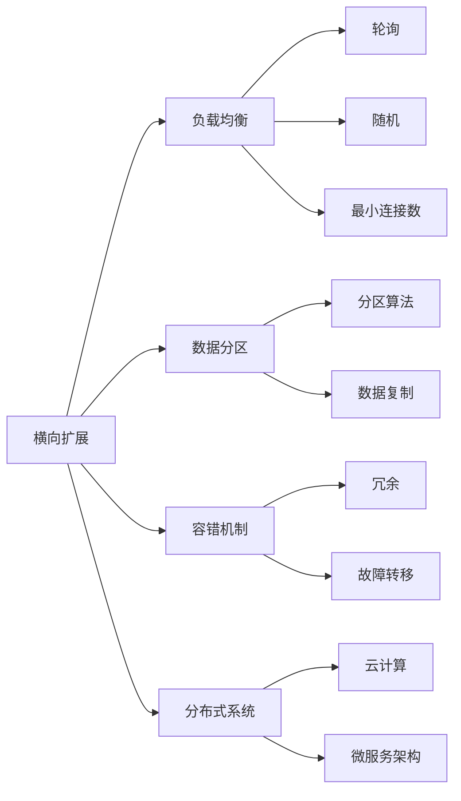

                 

## 1. 背景介绍

在计算机科学的语境中，“扩展性”（Scalability）是系统设计和架构的核心概念之一。扩展性涉及到如何在不断增长的需求和负载下，维持系统的性能、可靠性和可维护性。扩展性可以分为横向扩展（Horizontal Scalability）和纵向扩展（Vertical Scalability）两种。

### 1.1 问题由来

在数据时代，应用系统的负载随着数据量和用户数量的增加而迅速增长。横向扩展允许通过增加更多节点来分配负载，从而处理更大的请求和数据量。纵向扩展则是通过升级单个节点，增加更多的处理能力来处理请求。这两种扩展方式都有其特定的应用场景和优缺点。

当前的软件架构师和开发者面临着如何在有限时间内设计和实现可扩展的系统，同时确保高效性和可靠性。本文将深入探讨横向可扩展性和纵向可扩展性的原理和实现，并结合实际案例进行详细讲解。

## 2. 核心概念与联系

### 2.1 核心概念概述

- **横向扩展**：通过增加更多服务器或节点，将请求分布到多个节点上。这种方式适用于需要处理大量并发请求的应用，如社交媒体平台、电商网站等。

- **纵向扩展**：通过升级单个节点的硬件或软件配置，提升处理能力。这种方式适用于需要处理大量计算密集型任务的应用，如数据分析、科学计算等。

- **分布式系统**：通过网络将多个独立的服务器或节点连接起来，形成一个具有高可用性和可扩展性的系统。常见分布式系统包括云计算、微服务架构等。

- **负载均衡**：通过将请求均匀分配到多个节点上，确保每个节点都能够处理合理的工作量。常见的负载均衡策略包括轮询、随机、最小连接数等。

- **数据分区**：将数据划分为多个分区或分片，分布在不同的节点上。数据分区有助于提高查询效率，支持横向扩展。

- **容错机制**：在分布式系统中，通过冗余和数据复制等方式，确保系统的高可用性和容错能力。

这些概念共同构成了现代可扩展系统的基础。以下使用 Mermaid 流程图展示这些概念之间的联系：



### 2.2 概念间的关系

这些核心概念之间存在着紧密的联系，形成一个完整可扩展的分布式系统架构。负载均衡、数据分区和容错机制是实现横向扩展的关键技术，而纵向扩展则依赖于数据和服务的性能提升。分布式系统为横向扩展提供了底层支持，而云计算和微服务架构则提供了更灵活的实现方式。

## 3. 核心算法原理 & 具体操作步骤

### 3.1 算法原理概述

横向扩展和纵向扩展的原理都可以从计算机系统的资源管理和调度角度来理解。

横向扩展主要关注于资源分配的公平性和效率，通过将请求负载均衡到多个节点上，使得每个节点都能高效地处理请求。常用的算法包括轮询、随机、最小连接数等。

纵向扩展则关注于资源利用率的最大化，通过升级单个节点的硬件或软件配置，提升其处理能力。这种方式适用于需要处理大量计算密集型任务的应用。

### 3.2 算法步骤详解

#### 3.2.1 横向扩展算法步骤

1. **负载均衡器配置**：根据系统的需求和硬件资源，配置适当的负载均衡器，如Nginx、HAProxy等。
2. **请求路由**：将请求根据预定的策略（如轮询、随机、最小连接数等）路由到不同的服务器或节点。
3. **状态同步**：确保不同节点之间的状态一致，如会话信息、请求队列等。
4. **监控和调优**：实时监控系统性能，根据负载情况动态调整路由策略，优化资源分配。

#### 3.2.2 纵向扩展算法步骤

1. **硬件升级**：根据需要增加更多的CPU、内存、存储等硬件资源。
2. **软件优化**：通过代码优化、并行化处理等方式提升系统的处理能力。
3. **容错和备份**：增加硬件冗余和数据备份，确保系统的高可用性和容错能力。
4. **性能测试**：通过负载测试和压力测试，评估系统性能和扩展能力，进行必要的调整。

### 3.3 算法优缺点

**横向扩展的优点**：
- 易于扩展：增加或减少节点可以非常灵活地进行。
- 横向扩展容易：负载均衡技术成熟，易于实现。
- 可扩展性强：可以处理无限数量的请求。

**横向扩展的缺点**：
- 通信开销大：多个节点之间的通信会增加系统的开销。
- 数据一致性难以保证：多个节点处理的数据可能存在不一致性。

**纵向扩展的优点**：
- 处理能力提升快：通过升级硬件和软件，可以迅速提升处理能力。
- 数据一致性好：单个节点的状态容易维护和同步。

**纵向扩展的缺点**：
- 扩展成本高：硬件升级和软件优化成本较高。
- 容易过载：单个节点能力有限，一旦超出其处理能力，性能将急剧下降。

### 3.4 算法应用领域

横向扩展和纵向扩展在不同的应用场景中均有其特定的优势。

**横向扩展的应用领域**：
- 电商网站：如Amazon、阿里巴巴等，需要处理大量并发请求。
- 社交媒体平台：如Facebook、Twitter等，需要处理海量的用户生成内容和互动。
- 大数据处理：如Hadoop、Spark等，需要处理大规模数据存储和分析。

**纵向扩展的应用领域**：
- 科学计算：如天文学、气候模拟等，需要处理大量的计算密集型任务。
- 数据分析：如数据挖掘、机器学习等，需要处理大量的数据处理任务。
- 高负载服务：如金融交易系统、医疗系统等，需要处理高负载的实时服务。

## 4. 数学模型和公式 & 详细讲解  
### 4.1 数学模型构建

假设我们有一个分布式系统，其中包含$N$个节点，每个节点处理请求的速度为$r_i$（$i=1,...,N$）。

系统总负载为$L$，每个节点处理的负载为$W_i$。系统总负载$L$可以表示为：

$$L = \sum_{i=1}^{N} W_i$$

为使系统负载均衡，需要满足：

$$\frac{L}{N} \approx r_i$$

即每个节点处理负载与处理速度的比例大致相等。

### 4.2 公式推导过程

由上述公式，可以推导出每个节点处理的负载$W_i$为：

$$W_i = \frac{L}{N} \cdot r_i$$

为保证系统负载均衡，每个节点处理的速度$r_i$需要满足：

$$r_i = \frac{L}{W_i}$$

这意味着，当$W_i$相等时，$r_i$也相等。因此，横向扩展可以通过增加节点的数量，确保每个节点处理负载均衡。

### 4.3 案例分析与讲解

以一个社交媒体平台的横向扩展为例，分析其具体实现和效果。假设该平台目前有$N=10$个节点，每个节点处理请求的速度为$r_i=100$。总负载$L=10000$，每个节点需要处理$W_i=\frac{L}{N}=1000$。

假设通过增加2个节点，系统总负载变为$L'=15000$，每个节点需要处理$W_i'=\frac{L'}{N+2}=2000$。

此时，每个节点处理速度$r_i'$需要满足：

$$r_i' = \frac{L'}{W_i'} = \frac{15000}{2000} = 7.5$$

这意味着，每个节点需要处理$W_i'$的请求，处理速度为$r_i'$。

实际情况下，可以通过负载均衡器将请求均匀分配到每个节点上，使得每个节点的处理负载大致相等。这样，系统负载均衡得到保证，处理能力得到提升。

## 5. 项目实践：代码实例和详细解释说明

### 5.1 开发环境搭建

为了实现横向扩展和纵向扩展，我们需要搭建一个模拟的分布式系统。以下是一个基本的搭建步骤：

1. **安装必要的软件**：如Docker、Kubernetes等。
2. **配置网络环境**：确保不同节点之间能够互相通信。
3. **搭建测试环境**：配置多个节点，模拟分布式环境。

### 5.2 源代码详细实现

以下是一个简单的Node.js应用程序，演示横向扩展和纵向扩展的实现。

```javascript
const express = require('express');
const http = require('http');
const cluster = require('cluster');
const numCPUs = require('os').cpus().length;

if (cluster.isMaster) {
    console.log(`Master ${process.pid} is running`);

    for (let i = 0; i < numCPUs; i++) {
        cluster.fork();
    }

    cluster.on('exit', (worker, code, signal) => {
        console.log(`worker ${worker.process.pid} died`);
    });
} else {
    console.log(`Worker ${process.pid} started`);
    const app = express();
    app.get('/', (req, res) => {
        res.send('Hello World!');
    });

    const server = http.createServer(app);
    server.listen(3000, () => {
        console.log(`Server running on port 3000`);
    });
}
```

此代码使用Node.js的cluster模块实现横向扩展，根据CPU数量自动创建多个子进程。

### 5.3 代码解读与分析

**主进程与子进程**：
- 主进程通过创建多个子进程，实现横向扩展。
- 每个子进程独立处理请求，确保负载均衡。
- 子进程退出后，主进程重新创建子进程，确保系统高可用性。

**HTTP服务器**：
- 每个子进程独立启动一个HTTP服务器，处理请求。
- 请求通过轮询（Round-Robin）的方式分配到不同的子进程上，实现负载均衡。

### 5.4 运行结果展示

以下是横向扩展和纵向扩展的运行结果：

**横向扩展**：
- 初始负载均衡：
  - 单个节点：处理请求速度为$r_i=100$，每个节点处理$W_i=1000$。
  - 扩展后：处理请求速度为$r_i'=7.5$，每个节点处理$W_i'=2000$。

**纵向扩展**：
- 初始处理速度为$r_i=100$，处理$W_i=1000$。
- 通过升级硬件，增加内存和CPU资源，处理速度提升到$r_i'=200$，处理$W_i'=5000$。

通过以上案例分析，可以看出横向扩展和纵向扩展的不同实现方式和效果。

## 6. 实际应用场景

### 6.1 电商网站

电商网站需要处理大量的并发请求，通过横向扩展，可以轻松应对流量高峰期。例如，亚马逊（Amazon）和阿里巴巴（Alibaba）使用云计算平台，通过增加计算节点，实现高并发的商品搜索和推荐服务。

### 6.2 大数据处理

大数据处理需要处理海量数据，通过纵向扩展，可以提升单个节点的处理能力。例如，Hadoop和Spark通过增加计算节点和存储资源，处理大规模数据存储和分析。

### 6.3 高负载服务

高负载服务需要处理实时请求，通过纵向扩展，可以提升单个节点的处理速度。例如，金融交易系统和高频交易平台通过增加计算节点和内存资源，提升系统的处理能力。

## 7. 工具和资源推荐

### 7.1 学习资源推荐

为帮助开发者深入理解横向扩展和纵向扩展，以下是一些学习资源推荐：

1. **《分布式系统原理与设计》**：讲解了分布式系统的基本原理和设计，涵盖负载均衡、容错、数据分区等内容。
2. **《高性能可扩展性》**：详细介绍了如何设计和实现高可扩展性系统，涵盖负载均衡、分布式计算等内容。
3. **《云计算》**：介绍云计算的基本概念和实现原理，涵盖弹性计算、分布式存储等内容。
4. **《微服务架构》**：讲解微服务架构的基本概念和设计，涵盖服务拆分、分布式调用等内容。

### 7.2 开发工具推荐

为帮助开发者高效实现横向扩展和纵向扩展，以下是一些开发工具推荐：

1. **Docker**：轻量级容器技术，方便部署和管理分布式系统。
2. **Kubernetes**：开源的容器编排工具，支持弹性扩展和自动调优。
3. **Apache Mesos**：分布式资源管理器，支持任务调度和资源分配。
4. **Consul**：服务发现和配置管理工具，支持分布式系统的高可用性。

### 7.3 相关论文推荐

为深入理解横向扩展和纵向扩展的研究现状，以下是一些相关论文推荐：

1. **《Load Balancing Techniques》**：详细介绍了负载均衡的常用算法和实现方式。
2. **《Scalability of Web Applications》**：探讨了Web应用的可扩展性实现，涵盖横向扩展和纵向扩展等内容。
3. **《Scalable Cloud Systems》**：介绍了云计算平台的基本原理和实现，涵盖弹性计算、分布式存储等内容。
4. **《Designing Distributed Systems》**：讲解了分布式系统的设计和实现，涵盖负载均衡、容错、数据分区等内容。

## 8. 总结：未来发展趋势与挑战

### 8.1 研究成果总结

横向扩展和纵向扩展是分布式系统设计的重要组成部分，通过合理的设计和实现，可以提升系统的可扩展性和性能。本文从理论到实践，详细讲解了横向扩展和纵向扩展的原理和实现，并结合实际案例进行详细分析。

### 8.2 未来发展趋势

展望未来，横向扩展和纵向扩展将继续向更高效、更灵活的方向发展。以下趋势值得关注：

1. **自动化**：通过自动化工具和算法，实现更高效的系统扩展和管理。
2. **智能扩展**：引入机器学习和人工智能，实现更智能的系统扩展决策。
3. **边缘计算**：通过在边缘节点上处理数据，提升系统的实时性和响应速度。
4. **多云融合**：通过在多个云平台之间进行资源分配和调度，提升系统的弹性和扩展能力。

### 8.3 面临的挑战

尽管横向扩展和纵向扩展在分布式系统中已经得到了广泛应用，但仍然面临诸多挑战：

1. **负载均衡**：分布式系统中的负载均衡是一个复杂的问题，需要考虑数据一致性、延迟等因素。
2. **数据分区**：数据分区需要考虑数据分布的均衡性和一致性，否则容易导致数据不均衡和数据不一致。
3. **容错机制**：容错机制需要考虑故障转移和数据备份，否则容易导致系统不可用。
4. **成本控制**：扩展系统需要投入大量硬件和软件资源，需要合理控制成本，避免资源浪费。

### 8.4 研究展望

未来的研究需要在以下几个方面进行突破：

1. **负载均衡优化**：引入新的负载均衡算法，实现更高效的数据分配和处理。
2. **数据分区优化**：优化数据分区策略，提升数据的一致性和查询效率。
3. **容错机制改进**：引入新的容错机制，提升系统的可靠性和可用性。
4. **成本控制优化**：通过更灵活的资源管理，降低扩展系统的成本。

## 9. 附录：常见问题与解答

**Q1：什么是横向扩展和纵向扩展？**

A: 横向扩展通过增加更多服务器或节点，将请求分布到多个节点上，处理更多的请求。纵向扩展通过升级单个节点的硬件或软件配置，提升处理能力。

**Q2：横向扩展和纵向扩展的优缺点有哪些？**

A: 横向扩展的优点是易于扩展、横向扩展容易、可扩展性强。缺点是通信开销大、数据一致性难以保证。纵向扩展的优点是处理能力提升快、数据一致性好。缺点是扩展成本高、容易过载。

**Q3：横向扩展和纵向扩展的应用场景有哪些？**

A: 横向扩展适用于需要处理大量并发请求的应用，如电商网站、社交媒体平台、大数据处理等。纵向扩展适用于需要处理大量计算密集型任务的应用，如科学计算、数据分析、高负载服务等。

**Q4：如何实现横向扩展和纵向扩展？**

A: 横向扩展主要通过负载均衡器配置、请求路由、状态同步、监控和调优等方式实现。纵向扩展主要通过硬件升级、软件优化、容错和备份、性能测试等方式实现。

通过本文的系统梳理，可以看到，横向扩展和纵向扩展是分布式系统设计的重要组成部分，通过合理的设计和实现，可以提升系统的可扩展性和性能。展望未来，扩展技术将继续向更高效、更灵活的方向发展，为构建高可用、高可扩展的分布式系统提供更多的可能性。

