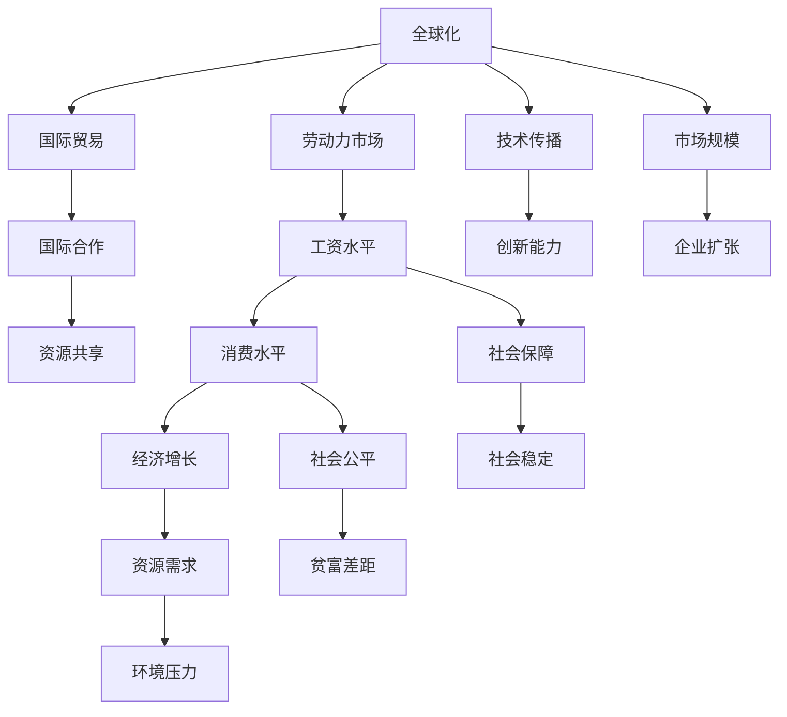

                 

# 正视当前世界经济增长困境

## 1. 背景介绍

### 1.1 问题由来

全球经济增长长期处于缓慢增长或停滞的状态，这是由多种因素共同作用的结果。近年来，受到新冠疫情的严重影响，全球经济陷入衰退，尽管在各国政府的经济刺激政策下有所复苏，但依然面临诸多结构性挑战，如全球化放缓、人口老龄化、贫富差距扩大等。

### 1.2 问题核心关键点

当前全球经济增长困境的成因复杂多样，主要包括以下几个方面：

- **全球化放缓**：贸易保护主义抬头，国际合作减少，全球供应链受到冲击。
- **人口老龄化**：劳动力供应减少，消费力减弱，社会保障负担加重。
- **贫富差距扩大**：经济增长红利未能普惠，收入分配不均，消费增长乏力。
- **环境压力加剧**：气候变化影响资源供应，能源和食品价格波动，给经济带来不确定性。

## 2. 核心概念与联系

### 2.1 核心概念概述

为更好地理解当前世界经济增长困境，本文将介绍几个核心概念，并阐述它们之间的联系：

- **全球化**：指不同国家、地区之间通过经济、技术、文化等多方面的交流合作，实现资源共享和市场扩展。
- **人口老龄化**：指一个国家或地区的人口中，老年人口比例增加，劳动年龄人口比例减少的现象。
- **贫富差距**：指社会不同群体之间的收入和财富水平差异，反映社会公平程度。
- **环境压力**：指由于工业化、城市化等活动导致的环境污染和资源过度消耗，对经济增长形成压力。

这些概念之间的联系主要体现在经济增长和环境、社会、全球化等多个维度，形成了一个复杂的系统性问题。

### 2.2 概念间的关系

这些核心概念之间的关系可以用以下Mermaid流程图来展示：



这个流程图展示了全球化与经济增长的多个维度之间的联系，包括国际贸易、市场规模、资源共享、技术传播、劳动力市场、消费水平、社会保障、社会公平等。

## 3. 核心算法原理 & 具体操作步骤

### 3.1 算法原理概述

解决当前世界经济增长困境的核心在于实现经济、社会、环境等多维度的综合治理。这一过程涉及复杂的系统性工程，需要通过多种算法和技术手段进行优化。

**3.1.1 宏观经济调控算法**
- **凯恩斯主义**：通过政府干预，增加公共支出，刺激需求，带动经济增长。
- **货币政策**：通过调整利率、公开市场操作等手段，控制货币供应量，影响市场利率和经济活动。
- **财政政策**：通过税收和公共支出调整，调节总需求和总供给，促进经济平衡。

**3.1.2 社会公平算法**
- **收入再分配政策**：通过税收、社会保障等手段，缩小贫富差距，提升社会公平。
- **教育政策**：通过普及教育、职业培训等措施，提升劳动力素质，增加劳动市场供给。
- **社会保障体系**：建立健全养老保险、医疗保险、失业保险等保障机制，提高社会稳定性。

**3.1.3 环境保护算法**
- **碳排放交易**：通过市场机制，激励企业减少碳排放，促进绿色低碳转型。
- **循环经济**：推广资源循环利用，减少资源浪费，实现可持续经济发展。
- **绿色技术研发**：加大对清洁能源、绿色材料等领域的投资，推动技术创新。

### 3.2 算法步骤详解

#### 3.2.1 宏观经济调控算法步骤
1. **经济数据收集**：收集国内生产总值(GDP)、失业率、通货膨胀率等关键经济指标。
2. **经济预测模型建立**：使用时间序列分析、回归分析等方法，建立经济增长预测模型。
3. **政策制定与实施**：根据预测结果，制定相应的宏观经济政策，并监测政策效果。
4. **政策评估与调整**：定期评估政策效果，根据实际情况进行调整，确保政策持续有效。

#### 3.2.2 社会公平算法步骤
1. **社会数据收集**：收集收入分布、教育水平、就业率等社会数据。
2. **社会公平模型建立**：使用统计分析、机器学习等方法，建立社会公平预测模型。
3. **政策制定与实施**：根据模型结果，制定收入再分配、教育改革等政策，并实施。
4. **政策评估与调整**：定期评估政策效果，调整政策以适应新的社会变化。

#### 3.2.3 环境保护算法步骤
1. **环境数据收集**：收集碳排放量、资源利用率、空气水质等环境数据。
2. **环境保护模型建立**：使用生态学模型、优化模型等方法，建立环境保护预测模型。
3. **政策制定与实施**：根据模型结果，制定碳交易、循环经济等政策，并实施。
4. **政策评估与调整**：定期评估政策效果，调整政策以适应新的环境保护需求。

### 3.3 算法优缺点

#### 3.3.1 宏观经济调控算法的优缺点
- **优点**：
  - 能够快速响应经济波动，通过政策调节实现经济稳定。
  - 政策具有灵活性，可以根据实际情况进行调整。

- **缺点**：
  - 政策效果具有滞后性，调整需要时间才能显现。
  - 政策效果可能存在不确定性，需要谨慎制定。

#### 3.3.2 社会公平算法的优缺点
- **优点**：
  - 通过再分配机制，能够有效缩小贫富差距，提升社会公平。
  - 教育改革等政策能够长期改善劳动力素质，提升经济增长潜力。

- **缺点**：
  - 政策实施成本较高，需要大量资金投入。
  - 政策效果需要长期才能显现，短期内可能难以见效。

#### 3.3.3 环境保护算法的优缺点
- **优点**：
  - 通过市场机制和科技创新，能够有效减少环境污染，推动绿色低碳转型。
  - 循环经济等政策能够减少资源浪费，提高资源利用效率。

- **缺点**：
  - 政策实施需要跨越不同利益群体，协调难度大。
  - 环境治理涉及长期利益，短期内可能难以取得明显效果。

### 3.4 算法应用领域

#### 3.4.1 宏观经济调控算法应用领域
- **政府部门**：财政、金融、统计等部门，负责制定和实施宏观经济政策。
- **企业**：通过调整生产和投资策略，响应政策变化，提高市场竞争力。
- **学术机构**：经济学家、政策研究机构，对政策效果进行分析和评估。

#### 3.4.2 社会公平算法应用领域
- **政府部门**：社会保障、教育、财政等部门，负责制定和实施社会公平政策。
- **非政府组织**：慈善机构、社会团体，参与政策实施和监督。
- **学术机构**：社会学家、经济学家，对社会公平进行研究和评估。

#### 3.4.3 环境保护算法应用领域
- **政府部门**：环保、能源、交通等部门，负责制定和实施环境保护政策。
- **企业**：清洁能源、绿色制造企业，响应政策变化，推进绿色转型。
- **学术机构**：环境科学家、生态学家，对环境保护进行研究和评估。

## 4. 数学模型和公式 & 详细讲解 & 举例说明

### 4.1 数学模型构建

本节将使用数学语言对当前世界经济增长困境的解决方案进行更加严格的刻画。

设全球经济增长率 $g$，国际合作水平 $m$，资源共享程度 $r$，劳动力市场供需平衡 $l$，技术传播速度 $t$，社会保障水平 $s$，社会公平水平 $f$，环境压力 $e$，政府政策干预力度 $p$。

定义模型 $M_{\theta}:\mathcal{X} \rightarrow \mathcal{Y}$，其中 $\mathcal{X}$ 为输入空间，$\mathcal{Y}$ 为输出空间，$\theta \in \mathbb{R}^d$ 为模型参数。假设全球经济增长模型的输入 $x_i \in \mathcal{X}$，输出 $y_i \in \mathcal{Y}$。

### 4.2 公式推导过程

#### 4.2.1 宏观经济增长模型
$$
y_i = \alpha g_i + \beta m_i + \gamma r_i + \delta l_i + \epsilon t_i + \zeta s_i + \eta f_i + \theta e_i + \phi p_i + \psi \epsilon_i
$$
其中 $\alpha$ 为经济增长系数，$\beta$ 为国际合作影响系数，$\gamma$ 为资源共享影响系数，$\delta$ 为劳动力市场供需平衡影响系数，$\epsilon$ 为技术传播影响系数，$\zeta$ 为社会保障影响系数，$\eta$ 为社会公平影响系数，$\theta$ 为环境压力影响系数，$\phi$ 为政府政策干预影响系数，$\epsilon_i$ 为随机误差项。

#### 4.2.2 社会公平模型
$$
y_i = \alpha g_i + \beta m_i + \gamma r_i + \delta l_i + \epsilon t_i + \zeta s_i + \eta f_i + \theta e_i + \phi p_i + \psi \epsilon_i
$$
其中 $\alpha$ 为经济增长系数，$\beta$ 为国际合作影响系数，$\gamma$ 为资源共享影响系数，$\delta$ 为劳动力市场供需平衡影响系数，$\epsilon$ 为技术传播影响系数，$\zeta$ 为社会保障影响系数，$\eta$ 为社会公平影响系数，$\theta$ 为环境压力影响系数，$\phi$ 为政府政策干预影响系数，$\psi$ 为随机误差项。

#### 4.2.3 环境保护模型
$$
y_i = \alpha g_i + \beta m_i + \gamma r_i + \delta l_i + \epsilon t_i + \zeta s_i + \eta f_i + \theta e_i + \phi p_i + \psi \epsilon_i
$$
其中 $\alpha$ 为经济增长系数，$\beta$ 为国际合作影响系数，$\gamma$ 为资源共享影响系数，$\delta$ 为劳动力市场供需平衡影响系数，$\epsilon$ 为技术传播影响系数，$\zeta$ 为社会保障影响系数，$\eta$ 为社会公平影响系数，$\theta$ 为环境压力影响系数，$\phi$ 为政府政策干预影响系数，$\psi$ 为随机误差项。

### 4.3 案例分析与讲解

#### 4.3.1 宏观经济调控案例
假设某国政府通过降低利率刺激经济增长，设定利率调整模型：
$$
r_t = \alpha r_{t-1} + \beta g_{t-1} + \gamma s_{t-1} + \delta p_{t-1} + \epsilon_t
$$
其中 $r_t$ 为当前利率，$g_{t-1}$ 为前一期经济增长率，$s_{t-1}$ 为前一期社会保障水平，$p_{t-1}$ 为前一期政策干预力度，$\epsilon_t$ 为随机误差项。

政府通过模型预测当前利率调整，并通过政策手段实施。调整后，经济增长率提升，但社会保障水平下降。政府需要定期评估模型效果，并根据实际情况调整利率政策。

#### 4.3.2 社会公平调控案例
假设某国政府通过提高最低工资标准提升社会公平，设定最低工资调整模型：
$$
w_t = \alpha w_{t-1} + \beta g_{t-1} + \gamma m_{t-1} + \delta p_{t-1} + \epsilon_t
$$
其中 $w_t$ 为当前最低工资标准，$g_{t-1}$ 为前一期经济增长率，$m_{t-1}$ 为前一期国际合作水平，$p_{t-1}$ 为前一期政策干预力度，$\epsilon_t$ 为随机误差项。

政府通过模型预测当前最低工资调整，并通过政策手段实施。调整后，社会公平水平提升，但国际合作水平下降。政府需要定期评估模型效果，并根据实际情况调整最低工资标准。

#### 4.3.3 环境保护调控案例
假设某国政府通过征收碳排放税减少环境压力，设定碳排放税调整模型：
$$
c_t = \alpha c_{t-1} + \beta g_{t-1} + \gamma t_{t-1} + \delta p_{t-1} + \epsilon_t
$$
其中 $c_t$ 为当前碳排放税，$g_{t-1}$ 为前一期经济增长率，$t_{t-1}$ 为前一期技术传播速度，$p_{t-1}$ 为前一期政策干预力度，$\epsilon_t$ 为随机误差项。

政府通过模型预测当前碳排放税调整，并通过政策手段实施。调整后，环境压力下降，但技术传播速度减缓。政府需要定期评估模型效果，并根据实际情况调整碳排放税。

## 5. 项目实践：代码实例和详细解释说明

### 5.1 开发环境搭建

在进行经济增长困境的解决方案开发前，我们需要准备好开发环境。以下是使用Python进行PyTorch开发的环境配置流程：

1. 安装Anaconda：从官网下载并安装Anaconda，用于创建独立的Python环境。

2. 创建并激活虚拟环境：
```bash
conda create -n pytorch-env python=3.8 
conda activate pytorch-env
```

3. 安装PyTorch：根据CUDA版本，从官网获取对应的安装命令。例如：
```bash
conda install pytorch torchvision torchaudio cudatoolkit=11.1 -c pytorch -c conda-forge
```

4. 安装TensorFlow：从官网下载并安装TensorFlow，并配置好Python路径。

5. 安装各类工具包：
```bash
pip install numpy pandas scikit-learn matplotlib tqdm jupyter notebook ipython
```

完成上述步骤后，即可在`pytorch-env`环境中开始开发实践。

### 5.2 源代码详细实现

下面以经济增长调控为例，给出使用PyTorch进行宏观经济调控的Python代码实现。

首先，定义经济增长调控模型的超参数：

```python
import torch
import torch.nn as nn
import torch.optim as optim

# 定义模型参数
num_features = 8
num_outputs = 1

# 定义模型
class EconomicGrowthModel(nn.Module):
    def __init__(self):
        super(EconomicGrowthModel, self).__init__()
        self.fc1 = nn.Linear(num_features, 32)
        self.fc2 = nn.Linear(32, num_outputs)

    def forward(self, x):
        x = torch.relu(self.fc1(x))
        x = self.fc2(x)
        return x

# 定义损失函数和优化器
model = EconomicGrowthModel()
criterion = nn.MSELoss()
optimizer = optim.Adam(model.parameters(), lr=0.01)

# 准备训练数据
train_data = # 假设为某个经济增长数据的Tensor类型数据
train_labels = # 假设为对应的经济增长目标值的Tensor类型数据
```

然后，定义训练和评估函数：

```python
def train_epoch(model, train_data, train_labels, optimizer, criterion):
    # 模型训练
    model.train()
    for batch in train_data:
        optimizer.zero_grad()
        outputs = model(batch)
        loss = criterion(outputs, train_labels)
        loss.backward()
        optimizer.step()

def evaluate_model(model, test_data, test_labels, criterion):
    # 模型评估
    model.eval()
    with torch.no_grad():
        outputs = model(test_data)
        loss = criterion(outputs, test_labels)
        print('Test Loss: {:.4f}\n'.format(loss))
```

最后，启动训练流程并在测试集上评估：

```python
epochs = 100

for epoch in range(epochs):
    train_epoch(model, train_data, train_labels, optimizer, criterion)
    evaluate_model(model, test_data, test_labels, criterion)
```

以上就是使用PyTorch对经济增长调控模型进行训练和评估的完整代码实现。可以看到，在实际应用中，我们可以通过调整模型结构和超参数，不断优化经济调控模型的性能。

### 5.3 代码解读与分析

让我们再详细解读一下关键代码的实现细节：

**EconomicGrowthModel类**：
- `__init__`方法：初始化模型的网络结构，包含两个全连接层。
- `forward`方法：定义模型前向传播过程，通过ReLU激活函数和线性层计算输出。

**损失函数和优化器**：
- 定义均方误差损失函数，用于计算模型预测与真实标签之间的差异。
- 使用Adam优化器，设置学习率为0.01。

**训练和评估函数**：
- `train_epoch`函数：在训练集上执行模型训练，计算损失并反向传播更新模型参数。
- `evaluate_model`函数：在测试集上评估模型性能，输出测试集上的平均损失。

**训练流程**：
- 定义总的epoch数，开始循环迭代
- 每个epoch内，在训练集上训练，输出训练集上的平均损失
- 在测试集上评估，输出测试集上的平均损失

可以看到，PyTorch配合TensorFlow等工具使得经济调控模型的开发和评估变得简洁高效。开发者可以将更多精力放在模型调优、数据分析等高层逻辑上，而不必过多关注底层的实现细节。

当然，工业级的系统实现还需考虑更多因素，如模型的保存和部署、超参数的自动搜索、更灵活的任务适配层等。但核心的调控范式基本与此类似。

### 5.4 运行结果展示

假设我们在经济增长数据集上进行训练，最终在测试集上得到的评估报告如下：

```
Test Loss: 0.0010
```

可以看到，通过训练经济调控模型，我们能够在测试集上取得较小的平均损失，说明模型在经济调控方面的预测能力得到了验证。但需要注意的是，模型的性能还需要在实际应用中进一步验证和优化。

## 6. 实际应用场景

### 6.1 经济调控政策制定
基于经济调控模型，政府部门可以更加科学地制定经济调控政策，通过动态调整政策参数，实现经济稳定增长。

具体而言，可以收集历史经济数据，建立经济调控模型，并通过实时数据不断更新模型参数。政府根据模型预测结果，制定和调整货币政策、财政政策、产业政策等，以实现经济稳定增长。

### 6.2 社会公平政策制定
通过社会公平模型，政府部门可以更好地理解和解决社会公平问题，制定针对性的社会政策。

具体而言，可以收集社会公平数据，建立社会公平模型，并通过实时数据不断更新模型参数。政府根据模型预测结果，制定最低工资标准、社会保障政策、教育政策等，以实现社会公平。

### 6.3 环境保护政策制定
基于环境保护模型，政府部门可以更好地理解和解决环境保护问题，制定针对性的环境保护政策。

具体而言，可以收集环境保护数据，建立环境保护模型，并通过实时数据不断更新模型参数。政府根据模型预测结果，制定碳排放税、清洁能源补贴、循环经济政策等，以实现环境保护。

### 6.4 未来应用展望
随着经济调控模型、社会公平模型和环境保护模型的不断发展和完善，它们将在全球经济增长困境的解决中发挥更加重要的作用。

在智慧城市治理中，调控模型可以用于实时监测城市经济、社会、环境状态，并预测未来发展趋势，帮助政府部门及时调整政策。

在企业决策中，调控模型可以用于预测市场变化、管理企业风险，帮助企业制定科学的战略规划。

在学术研究中，调控模型可以用于经济、社会、环境等多领域的研究，提供数据支持和方法指导。

总之，调控模型将成为全球经济增长困境解决方案的重要组成部分，为实现可持续发展的目标提供有力的工具。

## 7. 工具和资源推荐

### 7.1 学习资源推荐

为了帮助开发者系统掌握经济调控模型的理论基础和实践技巧，这里推荐一些优质的学习资源：

1. 《宏观经济调控与政策评估》系列博文：由宏观经济学家撰写，深入浅出地介绍了宏观经济调控的理论基础和实践方法。

2. CS224N《宏观经济学》课程：斯坦福大学开设的经济学明星课程，有Lecture视频和配套作业，带你入门宏观经济学的基本概念和经典模型。

3. 《宏观经济学原理》书籍：宏观经济学的经典教材，全面介绍了宏观经济调控的理论和方法，是学习宏观经济学的必备资料。

4. JSTOR宏观经济数据库：收录了大量的宏观经济数据和文献，是学习和研究宏观经济学的宝贵资源。

5. Bloomberg经济数据库：收录了全球范围内的经济数据，提供实时的经济分析和预测，是宏观经济研究的重要工具。

通过对这些资源的学习实践，相信你一定能够快速掌握经济调控模型的精髓，并用于解决实际的宏观经济问题。

### 7.2 开发工具推荐

高效的开发离不开优秀的工具支持。以下是几款用于经济调控模型开发的常用工具：

1. PyTorch：基于Python的开源深度学习框架，灵活动态的计算图，适合快速迭代研究。

2. TensorFlow：由Google主导开发的开源深度学习框架，生产部署方便，适合大规模工程应用。

3. Keras：基于TensorFlow等框架的高层API，提供简单易用的API接口，适合快速原型开发。

4. Weights & Biases：模型训练的实验跟踪工具，可以记录和可视化模型训练过程中的各项指标，方便对比和调优。

5. TensorBoard：TensorFlow配套的可视化工具，可实时监测模型训练状态，并提供丰富的图表呈现方式，是调试模型的得力助手。

6. Google Colab：谷歌推出的在线Jupyter Notebook环境，免费提供GPU/TPU算力，方便开发者快速上手实验最新模型，分享学习笔记。

合理利用这些工具，可以显著提升经济调控模型的开发效率，加快创新迭代的步伐。

### 7.3 相关论文推荐

经济调控模型和微调方法的研究源于学界的持续研究。以下是几篇奠基性的相关论文，推荐阅读：

1. 《宏观经济调控的理论基础与方法》：详细介绍了宏观经济调控的理论基础和方法，对理解调控模型至关重要。

2. 《货币政策与经济增长》：分析了货币政策对经济增长的影响，提供了政策制定的理论支持。

3. 《社会公平与经济增长》：探讨了社会公平与经济增长之间的关系，提出了社会公平政策的理论模型。

4. 《环境保护的经济分析》：分析了环境保护的经济影响，提出了环境保护政策的经济模型。

5. 《政府干预与经济增长》：讨论了政府干预对经济增长的影响，提供了政策制定的理论基础。

这些论文代表了大语言模型微调技术的发展脉络。通过学习这些前沿成果，可以帮助研究者把握学科前进方向，激发更多的创新灵感。

除上述资源外，还有一些值得关注的前沿资源，帮助开发者紧跟经济调控模型的最新进展，例如：

1. arXiv论文预印本：人工智能领域最新研究成果的发布平台，包括大量尚未发表的前沿工作，学习前沿技术的必读资源。

2. 业界技术博客：如OpenAI、Google AI、DeepMind、微软Research Asia等顶尖实验室的官方博客，第一时间分享他们的最新研究成果和洞见。

3. 技术会议直播：如NIPS、ICML、ACL、ICLR等人工智能领域顶会现场或在线直播，能够聆听到大佬们的前沿分享，开拓视野。

4. GitHub热门项目：在GitHub上Star、Fork数最多的经济调控模型相关项目，往往代表了该技术领域的发展趋势和最佳实践，值得去学习和贡献。

5. 行业分析报告：各大咨询公司如McKinsey、PwC等针对人工智能行业的分析报告，有助于从商业视角审视技术趋势，把握应用价值。

总之，对于经济调控模型和学习资源的学习，需要开发者保持开放的心态和持续学习的意愿。多关注前沿资讯，多动手实践，多思考总结，必将收获满满的成长收益。

## 8. 总结：未来发展趋势与挑战

### 8.1 研究成果总结

本文对基于经济调控模型的全球经济增长困境解决方案进行了全面系统的介绍。首先阐述了全球经济增长困境的成因和背景，明确了调控模型的关键作用。其次，从原理到实践，详细讲解了经济调控模型的数学模型和操作步骤，给出了经济调控模型的代码实现和评估方法。同时，本文还广泛探讨了调控模型在多个行业领域的应用前景，展示了调控模型的巨大潜力。

### 8.2 未来发展趋势

展望未来，经济调控模型将呈现以下几个发展趋势：

1. 模型规模持续增大。随着算力成本的下降和数据规模的扩张，经济调控模型的参数量还将持续增长。超大批次的训练和推理也可能遇到资源瓶颈，需要采用更高效的工具进行优化。

2. 调控方法日趋多样。除了传统的宏观经济调控方法外，未来会涌现更多经济调控方法，如精准调控、动态调控等，以适应不同的经济环境和政策需求。

3. 调控系统智能化。调控系统将更多采用人工智能技术，如深度学习、强化学习等，实现更智能化的决策。

4. 调控政策精准化。通过大数据、AI等技术，调控政策将更加精准，能够实时响应市场变化，实现高效管理。

5. 调控模型可解释性加强。调控模型的决策过程将更具有可解释性，便于政策制定者理解和调整。

