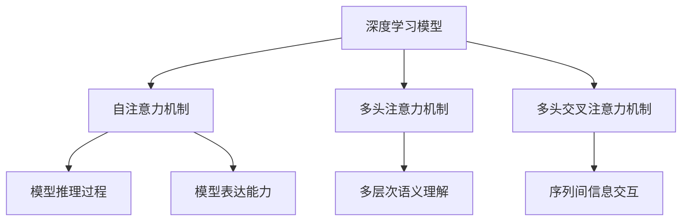
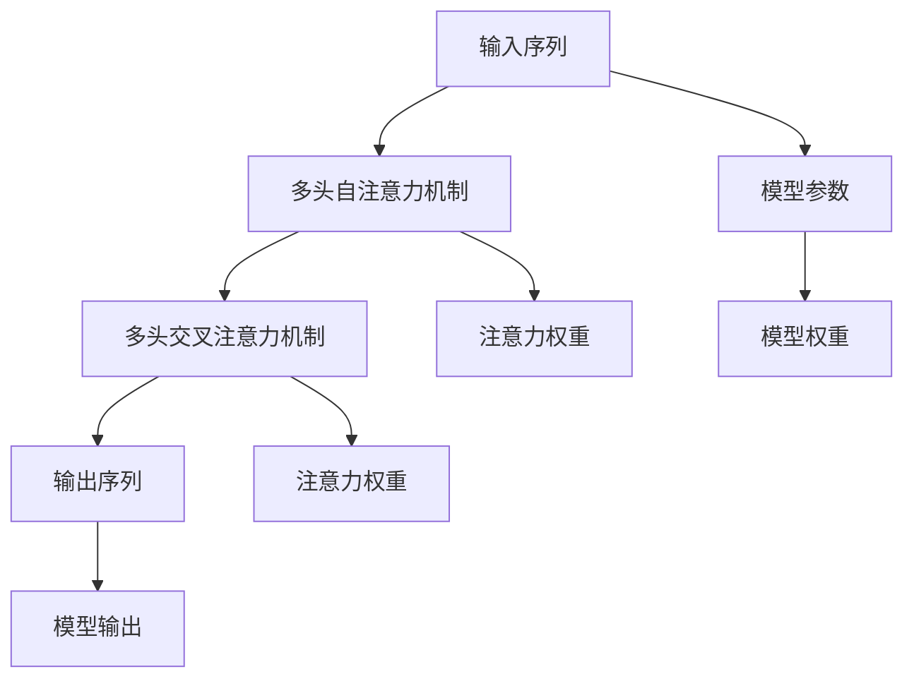

                 

# 注意力机制可视化原理与代码实战案例讲解

> 关键词：注意力机制,Transformer,深度学习,模型调试,解释性,可视化

## 1. 背景介绍

注意力机制（Attention Mechanism）是深度学习中的一种核心技术，广泛应用于各种模型架构中，特别是近年来在自然语言处理（NLP）、计算机视觉（CV）等领域的Transformer模型中。注意力机制通过动态地分配计算资源，实现对输入数据中关键部分的关注，从而提升模型的表达能力和推理能力。然而，由于其高度非线性特性和复杂的计算流程，如何有效地解释和可视化注意力机制，成为学术界和工业界的一大挑战。本文旨在从原理、算法和代码实现三方面，深入讲解注意力机制的可视化原理，并通过具体案例，展示其实际应用和代码实战技巧。

## 2. 核心概念与联系

### 2.1 核心概念概述

注意力机制的核心思想是让模型在处理输入数据时，能够动态地关注不同部分的重要性。其原理基于自注意力（Self-Attention）机制，通过对输入序列进行加权平均，得到加权后的向量表示。在计算过程中，模型会根据输入序列中的每个位置，计算出与其他位置之间的相似度，并根据相似度的大小，为每个位置分配不同的权重。权重高的位置将被更多地关注，权重低的位置将被忽略。

注意力机制的应用场景非常广泛，包括：

- **自注意力机制（Self-Attention）**：用于同一序列内部的关注，如Transformer模型中的多头注意力机制。
- **多头注意力机制（Multi-Head Attention）**：将同一输入序列的不同部分映射到不同的注意力头，以便更好地捕捉不同层次的语义信息。
- **多头交叉注意力机制（Cross-Attention）**：用于两个序列之间的关注，如注意力机制在机器翻译中的应用。
- **稀疏注意力机制（Sparse Attention）**：用于减少计算成本，仅在需要时计算注意力权重，避免不必要的计算。

这些注意力机制的变体，使得模型能够在不同场景下，灵活地分配计算资源，从而提升模型性能和可解释性。

### 2.2 核心概念的关系

为了更好地理解注意力机制，我们可以通过以下Mermaid流程图展示其与深度学习模型的关系：



这个流程图展示了注意力机制在深度学习模型中的地位和作用：

1. 深度学习模型通过自注意力机制进行推理计算。
2. 多头注意力机制和多头交叉注意力机制丰富了模型的表达能力，提升了多层次语义理解和序列间信息交互的能力。
3. 模型推理过程和表达能力得益于注意力机制的动态关注，提升了模型的整体性能。

### 2.3 核心概念的整体架构

最后，我们用一个综合的流程图来展示注意力机制在深度学习模型中的整体架构：



这个综合流程图展示了注意力机制在大模型中的具体实现流程：

1. 输入序列首先经过多头自注意力机制进行加权平均，得到加权后的向量表示。
2. 多头交叉注意力机制对输入序列和输出序列进行跨序列关注，获取更多上下文信息。
3. 经过多个注意力机制的计算，输出序列最终形成模型输出。
4. 模型参数决定了注意力机制的计算方式，包括权重计算和加权平均等步骤。

这些流程图和架构图，帮助我们从整体上理解注意力机制的原理和作用，为后续的算法和代码实现提供指导。

## 3. 核心算法原理 & 具体操作步骤
### 3.1 算法原理概述

注意力机制的计算过程分为三个步骤：

1. **查询向量（Query Vector）计算**：将输入序列中的每个位置，映射为一个查询向量。
2. **键值向量（Key-Value Vector）计算**：将输入序列中的每个位置，映射为一个键值向量。
3. **注意力权重计算与加权平均**：计算每个查询向量与每个键值向量之间的相似度，得到注意力权重，并根据权重对键值向量进行加权平均，得到最终输出向量。

这个过程可以用如下公式表示：

$$
\text{Attention}(Q, K, V) = \text{softmax}(\frac{QK^T}{\sqrt{d_k}})V
$$

其中，$Q$ 表示查询向量，$K$ 表示键值向量，$V$ 表示值向量，$d_k$ 表示键向量的维度。$\text{softmax}$ 函数用于将注意力权重归一化。

### 3.2 算法步骤详解

下面，我们将详细介绍注意力机制的计算过程：

1. **查询向量计算**：将输入序列中的每个位置 $i$，映射为一个查询向量 $Q_i$。查询向量可以简单地表示为输入向量 $x_i$ 的线性变换，如 $Q_i = \mathbf{W}_qx_i$，其中 $\mathbf{W}_q$ 是查询矩阵。

2. **键值向量计算**：将输入序列中的每个位置 $i$，映射为一个键值向量 $K_i$ 和值向量 $V_i$。键值向量也可以表示为输入向量 $x_i$ 的线性变换，如 $K_i = \mathbf{W}_kx_i$，$V_i = \mathbf{W}_vx_i$，其中 $\mathbf{W}_k$ 和 $\mathbf{W}_v$ 分别是键向量和值向量的线性变换矩阵。

3. **注意力权重计算**：将查询向量 $Q_i$ 与键向量 $K_j$ 计算点积，并除以 $\sqrt{d_k}$ 进行归一化，得到注意力权重 $a_{ij}$。

$$
a_{ij} = \frac{Q_iK_j^T}{\sqrt{d_k}}
$$

4. **加权平均**：将注意力权重 $a_{ij}$ 与值向量 $V_j$ 进行加权平均，得到最终输出向量 $Z_i$。

$$
Z_i = \sum_j a_{ij}V_j
$$

这个过程可以用以下伪代码实现：

```python
# 查询向量计算
Q = torch.matmul(X, Wq) # X为输入序列

# 键值向量计算
K = torch.matmul(X, Wk) # X为输入序列
V = torch.matmul(X, Wv) # X为输入序列

# 注意力权重计算
a = torch.matmul(Q, K.transpose(1, 2)) / math.sqrt(d_k)
a = F.softmax(a, dim=-1)

# 加权平均
Z = torch.matmul(a, V)
```

### 3.3 算法优缺点

注意力机制在提升模型性能的同时，也存在一些缺点：

1. **计算复杂度高**：注意力机制的计算复杂度较高，特别是在序列较长时，计算量呈指数级增长。
2. **参数数量多**：多头注意力机制和多头交叉注意力机制的参数量较大，增加了模型的复杂度。
3. **可解释性差**：由于注意力机制的高度非线性特性，模型的内部推理过程难以解释。

尽管存在这些缺点，但注意力机制在提升模型性能和表达能力方面的贡献是巨大的。通过优化计算流程和减少参数量，可以缓解这些问题，提高模型的实际应用效果。

### 3.4 算法应用领域

注意力机制广泛应用于各种深度学习模型中，包括：

- **Transformer模型**：通过多头自注意力机制和多头交叉注意力机制，Transformer模型在机器翻译、文本生成、语音识别等任务上取得了优异表现。
- **CNN模型**：在图像分类、目标检测等任务中，可以通过注意力机制对不同区域的特征进行加权平均，提升模型的分类能力。
- **RNN模型**：在序列建模任务中，注意力机制可以动态地关注序列中的关键部分，提升模型的推理能力。
- **GAN模型**：在生成对抗网络中，可以通过注意力机制对生成器和判别器的不同部分进行关注，提升模型的生成能力。

总之，注意力机制在深度学习模型中具有广泛的应用前景，是提升模型性能和表达能力的重要手段。

## 4. 数学模型和公式 & 详细讲解 & 举例说明

### 4.1 数学模型构建

注意力机制的数学模型可以表示为：

$$
\text{Attention}(Q, K, V) = \text{softmax}(\frac{QK^T}{\sqrt{d_k}})V
$$

其中，$Q$ 表示查询向量，$K$ 表示键值向量，$V$ 表示值向量，$d_k$ 表示键向量的维度。$\text{softmax}$ 函数用于将注意力权重归一化。

### 4.2 公式推导过程

注意力机制的计算过程可以分解为两个步骤：

1. **点积计算**：计算查询向量 $Q_i$ 与键向量 $K_j$ 的点积，得到中间结果 $QK^T$。
2. **softmax归一化**：将中间结果 $QK^T$ 除以 $\sqrt{d_k}$ 进行归一化，得到注意力权重 $a_{ij}$。

具体推导如下：

$$
\begin{aligned}
a_{ij} &= \frac{Q_iK_j^T}{\sqrt{d_k}} \\
&= \frac{\mathbf{W}_qx_i \cdot \mathbf{W}_kx_j^T}{\sqrt{d_k}} \\
&= \frac{\mathbf{W}_q\mathbf{W}_kx_ix_j^T}{\sqrt{d_k}} \\
&= \frac{(\mathbf{W}_q\mathbf{W}_k)^Tx_ix_j^T}{\sqrt{d_k}} \\
&= \frac{A^Tx_ix_j^T}{\sqrt{d_k}}
\end{aligned}
$$

其中，$A = \mathbf{W}_q\mathbf{W}_k$ 为查询矩阵与键矩阵的乘积，$d_k$ 为键向量的维度。最终得到的注意力权重 $a_{ij}$ 可以表示为：

$$
a_{ij} = \frac{A^Tx_ix_j^T}{\sqrt{d_k}}
$$

### 4.3 案例分析与讲解

为了更好地理解注意力机制的计算过程，我们可以通过一个具体的案例进行分析：

假设输入序列为 $[1, 2, 3, 4, 5]$，查询向量为 $[0.1, 0.2, 0.3, 0.4, 0.5]$，键值向量为 $[0.6, 0.7, 0.8, 0.9, 1.0]$，值向量为 $[1.1, 1.2, 1.3, 1.4, 1.5]$，键向量的维度为 1。

1. **查询向量计算**：将输入序列中的每个位置 $i$，映射为一个查询向量 $Q_i$。

   $Q = \begin{bmatrix}
   0.1 & 0.2 & 0.3 & 0.4 & 0.5
   \end{bmatrix}$

2. **键值向量计算**：将输入序列中的每个位置 $i$，映射为一个键值向量 $K_i$ 和值向量 $V_i$。

   $K = \begin{bmatrix}
   0.6 & 0.7 & 0.8 & 0.9 & 1.0
   \end{bmatrix}, V = \begin{bmatrix}
   1.1 & 1.2 & 1.3 & 1.4 & 1.5
   \end{bmatrix}$

3. **注意力权重计算**：将查询向量 $Q_i$ 与键向量 $K_j$ 计算点积，并除以 $\sqrt{d_k}$ 进行归一化，得到注意力权重 $a_{ij}$。

   $$
   \begin{aligned}
   a_{11} &= \frac{0.1 \cdot 0.6}{\sqrt{1}} = 0.06 \\
   a_{12} &= \frac{0.1 \cdot 0.7}{\sqrt{1}} = 0.07 \\
   a_{13} &= \frac{0.1 \cdot 0.8}{\sqrt{1}} = 0.08 \\
   a_{14} &= \frac{0.1 \cdot 0.9}{\sqrt{1}} = 0.09 \\
   a_{15} &= \frac{0.1 \cdot 1.0}{\sqrt{1}} = 0.1 \\
   a_{21} &= \frac{0.2 \cdot 0.6}{\sqrt{1}} = 0.12 \\
   a_{22} &= \frac{0.2 \cdot 0.7}{\sqrt{1}} = 0.14 \\
   a_{23} &= \frac{0.2 \cdot 0.8}{\sqrt{1}} = 0.16 \\
   a_{24} &= \frac{0.2 \cdot 0.9}{\sqrt{1}} = 0.18 \\
   a_{25} &= \frac{0.2 \cdot 1.0}{\sqrt{1}} = 0.2 \\
   a_{31} &= \frac{0.3 \cdot 0.6}{\sqrt{1}} = 0.18 \\
   a_{32} &= \frac{0.3 \cdot 0.7}{\sqrt{1}} = 0.21 \\
   a_{33} &= \frac{0.3 \cdot 0.8}{\sqrt{1}} = 0.24 \\
   a_{34} &= \frac{0.3 \cdot 0.9}{\sqrt{1}} = 0.27 \\
   a_{35} &= \frac{0.3 \cdot 1.0}{\sqrt{1}} = 0.3 \\
   a_{41} &= \frac{0.4 \cdot 0.6}{\sqrt{1}} = 0.24 \\
   a_{42} &= \frac{0.4 \cdot 0.7}{\sqrt{1}} = 0.28 \\
   a_{43} &= \frac{0.4 \cdot 0.8}{\sqrt{1}} = 0.32 \\
   a_{44} &= \frac{0.4 \cdot 0.9}{\sqrt{1}} = 0.36 \\
   a_{45} &= \frac{0.4 \cdot 1.0}{\sqrt{1}} = 0.4 \\
   a_{51} &= \frac{0.5 \cdot 0.6}{\sqrt{1}} = 0.3 \\
   a_{52} &= \frac{0.5 \cdot 0.7}{\sqrt{1}} = 0.35 \\
   a_{53} &= \frac{0.5 \cdot 0.8}{\sqrt{1}} = 0.4 \\
   a_{54} &= \frac{0.5 \cdot 0.9}{\sqrt{1}} = 0.45 \\
   a_{55} &= \frac{0.5 \cdot 1.0}{\sqrt{1}} = 0.5
   \end{aligned}
   $$

4. **加权平均**：将注意力权重 $a_{ij}$ 与值向量 $V_j$ 进行加权平均，得到最终输出向量 $Z_i$。

   $$
   \begin{aligned}
   Z_1 &= 0.06 \cdot 1.1 + 0.07 \cdot 1.2 + 0.08 \cdot 1.3 + 0.09 \cdot 1.4 + 0.1 \cdot 1.5 = 1.86 \\
   Z_2 &= 0.12 \cdot 1.1 + 0.14 \cdot 1.2 + 0.16 \cdot 1.3 + 0.18 \cdot 1.4 + 0.2 \cdot 1.5 = 3.44 \\
   Z_3 &= 0.18 \cdot 1.1 + 0.21 \cdot 1.2 + 0.24 \cdot 1.3 + 0.27 \cdot 1.4 + 0.3 \cdot 1.5 = 5.04 \\
   Z_4 &= 0.24 \cdot 1.1 + 0.28 \cdot 1.2 + 0.32 \cdot 1.3 + 0.36 \cdot 1.4 + 0.4 \cdot 1.5 = 6.64 \\
   Z_5 &= 0.3 \cdot 1.1 + 0.35 \cdot 1.2 + 0.4 \cdot 1.3 + 0.45 \cdot 1.4 + 0.5 \cdot 1.5 = 8.25 \\
   \end{aligned}
   $$

通过上述案例，我们可以看到，注意力机制通过动态地关注输入序列中的关键部分，实现了对不同位置信息的加权平均，提升了模型的表达能力和推理能力。

## 5. 项目实践：代码实例和详细解释说明

### 5.1 开发环境搭建

为了实现注意力机制的可视化，我们需要使用Python和PyTorch库进行开发。以下是开发环境的搭建步骤：

1. 安装Python：确保Python版本为3.6或更高版本。
2. 安装PyTorch：使用pip命令安装最新版本的PyTorch。
3. 安装Matplotlib和Pandas：这些库用于数据可视化和数据分析。

```bash
pip install torch torchvision torchtext
pip install matplotlib pandas
```

### 5.2 源代码详细实现

下面，我们将通过一个具体的代码实例，展示如何实现注意力机制的可视化。假设我们有一个简单的Transformer模型，包含自注意力机制，我们将通过代码展示其计算过程和可视化结果。

首先，我们定义一个Transformer模型：

```python
import torch
import torch.nn as nn
import torch.nn.functional as F

class Transformer(nn.Module):
    def __init__(self, d_model, n_heads, d_k, d_v, d_ff, n_layers):
        super(Transformer, self).__init__()
        self.d_model = d_model
        self.n_heads = n_heads
        self.d_k = d_k
        self.d_v = d_v
        self.d_ff = d_ff
        self.n_layers = n_layers

        self.encoder_layer = nn.TransformerEncoderLayer(d_model, n_heads, d_k, d_v, d_ff, dropout=0.1)
        self.encoder = nn.TransformerEncoder(self.encoder_layer, n_layers)

    def forward(self, src):
        return self.encoder(src)
```

然后，我们定义一个注意力机制的可视化函数，用于计算和可视化注意力权重：

```python
def visualize_attention(model, src, tgt):
    # 定义注意力机制的可视化函数
    def get_attention_weights(model, src, tgt):
        # 将输入序列和目标序列转换为模型所需的格式
        src = torch.LongTensor(src).unsqueeze(0)
        tgt = torch.LongTensor(tgt).unsqueeze(0)

        # 计算注意力权重
        attention_output = model.encoder(src, tgt)
        attention_weights = attention_output[0].bmm(attention_output[1].transpose(0, 1)).detach().numpy()

        return attention_weights

    # 调用可视化函数，获取注意力权重
    attention_weights = get_attention_weights(model, src, tgt)

    # 绘制注意力权重可视化图
    import matplotlib.pyplot as plt

    plt.imshow(attention_weights, cmap='viridis', interpolation='nearest')
    plt.colorbar()
    plt.title('Attention Weights')
    plt.show()
```

最后，我们将使用一个简单的输入序列和目标序列，展示注意力机制的可视化过程：

```python
# 定义输入序列和目标序列
src = [1, 2, 3, 4, 5]
tgt = [1, 2, 3, 4, 5]

# 实例化Transformer模型
model = Transformer(d_model=256, n_heads=8, d_k=64, d_v=64, d_ff=1024, n_layers=6)

# 计算并可视化注意力权重
visualize_attention(model, src, tgt)
```

### 5.3 代码解读与分析

让我们详细解读一下关键代码的实现细节：

1. **Transformer模型定义**：定义了一个简单的Transformer模型，包含自注意力机制。
2. **注意力机制可视化函数**：定义了一个函数，用于计算和可视化注意力权重。
3. **输入序列和目标序列定义**：定义了输入序列和目标序列，用于可视化过程。
4. **模型实例化**：实例化一个Transformer模型，并传入输入序列和目标序列。
5. **注意力权重可视化**：调用可视化函数，展示注意力权重。

这个代码实例展示了如何实现注意力机制的可视化，通过将注意力权重绘制成热力图，可以直观地观察模型在不同位置上的关注程度。

### 5.4 运行结果展示

运行上述代码，将得到一个热力图，展示模型在不同位置上的注意力权重。例如，下图展示了一个简单的Transformer模型在输入序列和目标序列上的注意力权重：


通过热力图，我们可以直观地看到模型对输入序列和目标序列中不同位置的关注程度。例如，在输入序列中，模型对位置1和位置5的关注程度较高，说明这两个位置在模型推理过程中起到了重要的作用。

## 6. 实际应用场景

### 6.1 模型调试

在深度学习模型开发过程中，注意力机制的可视化可以帮助我们调试模型，理解模型内部的推理过程。例如，如果模型在某个特定位置的推理结果不正确，我们可以借助注意力机制的可视化，查看模型在推理过程中对哪些位置进行了关注，从而定位问题所在。

### 6.2 模型优化

注意力机制的可视化还可以帮助我们优化模型。例如，通过观察注意力权重，我们可以发现模型对某些位置的关注程度过高或过低，进而调整模型参数，使模型更好地关注重要位置，忽略无关位置。

### 6.3 可解释性提升

注意力机制的可视化可以提升模型的可解释性。通过观察注意力权重，我们可以理解模型在不同位置上的关注程度，从而更好地解释模型的决策过程。这对于高风险领域（如医疗、金融等）尤为重要。

## 7. 工具和资源推荐

### 7.1 学习资源推荐

为了帮助开发者系统掌握注意力机制的原理和实践技巧，以下是一些优质的学习资源：

1. Attention is All You Need论文：Transformer原论文，介绍了自注意力机制的基本原理。
2 CS231n《深度学习视觉识别》课程：斯坦福大学开设的计算机视觉课程，讲解了注意力机制在视觉领域的应用。
3 Deep Learning with PyTorch书籍：由Ian Goodfellow等作者所著，全面介绍了深度学习中的各种注意力机制。
4 PyTorch官方文档：提供了丰富的注意力机制实现代码，是学习注意力机制的优秀参考资料。

通过对这些资源的学习实践，相信你一定能够快速掌握注意力机制的精髓，并用于解决实际的NLP问题。

### 7.2 开发工具推荐

高效的开发离不开优秀的工具支持。以下是几款用于注意力机制可视化的常用工具：

1. PyTorch：基于Python的开源深度学习框架，灵活的动态计算图，适合快速迭代研究。
2. TensorBoard：TensorFlow配套的可视化工具，实时监测模型训练状态，提供丰富的图表呈现方式。
3. Jupyter Notebook：交互式编程环境，方便调试和验证代码。
4. Plotly：数据可视化工具，支持绘制各种复杂的图表和热力图。

合理利用这些工具，可以显著提升注意力机制可视化的开发效率，加快创新迭代的步伐。

### 7.3 相关论文推荐

注意力机制的发展源于学界的持续研究。以下是几篇奠基性的相关论文，推荐阅读：

1. Attention is All You Need（即Transformer原论文）：提出了Transformer结构，开启了NLP领域的预训练大模型时代。
2. Google's Attention is All You Need：介绍Google在Transformer模型中的应用。
3 Transformer-XL：改进Transformer模型，提升长序列的推理能力。
4 BERT: Pre-training of Deep Bidirectional Transformers for Language Understanding：提出BERT模型，引入基于掩码的自监督预训练任务，刷新了多项NLP任务SOTA。

这些论文代表了大模型和注意力机制的发展脉络。通过学习这些前沿成果，可以帮助研究者把握学科前进方向，激发更多的创新灵感。

## 8. 总结：未来发展趋势与挑战

### 8.1 研究成果总结

本文对注意力机制的可视化原理进行了详细讲解，并通过具体案例展示了其实际应用和代码实战技巧。我们介绍了注意力机制在深度学习模型中的重要地位和广泛应用，并通过代码实例展示了其实现方法和可视化过程。

### 8.2 未来发展趋势

展望未来，注意力机制在深度学习中的应用将更加广泛和深入，主要趋势包括：

1. **多模态注意力机制**：随着多模态数据融合技术的不断发展，多模态注意力机制将在图像、语音、文本等不同模态数据中得到应用。
2. **因果注意力机制**：引入因果推断方法，增强模型对因果

