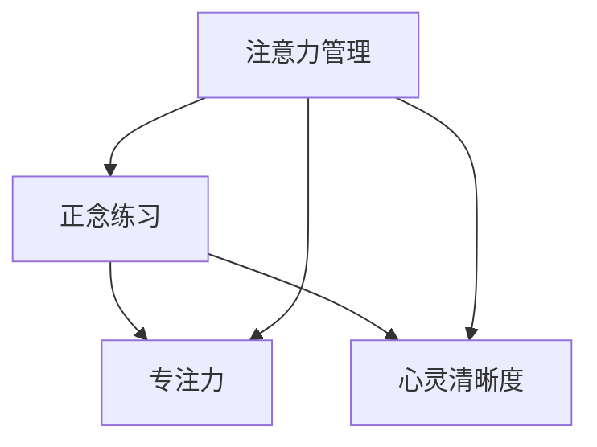
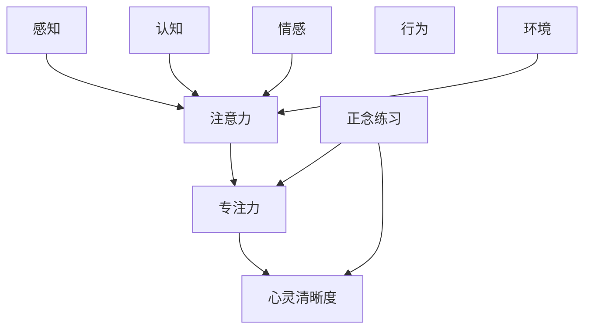

                 

# 注意力管理与正念练习：通过当下增强专注力和心灵清晰度

> 关键词：注意力管理,正念练习,专注力,心灵清晰度,当下,算法原理

## 1. 背景介绍

在现代社会中，随着信息过载和竞争压力的增大，人们的注意力资源变得更加稀缺和分散。如何管理好自己的注意力，提升专注力和心灵清晰度，已经成为许多人在追求自我成长和职业发展中面临的重要课题。注意力管理与正念练习提供了一种有效的解决方案，通过训练大脑的注意力系统，使个体能够更有效地应对各种生活和工作挑战。本文将深入探讨注意力管理与正念练习的原理、操作步骤和应用领域，并通过实际案例加以展示，帮助读者掌握这一提升专注力和心灵清晰度的关键技能。

## 2. 核心概念与联系

### 2.1 核心概念概述

- **注意力管理(Attention Management)**：指个体通过有意识地调整和优化注意力的分配，以实现高效工作和生活的过程。注意力管理涉及注意力的转移、保持和选择，旨在提高个体在各种任务中的表现。

- **正念练习(Mindfulness Practice)**：源于佛教禅修，通过观察当下的思想和感受，培养对自身情绪和行为的觉察，从而达到减压、提升情绪调节能力的目的。正念练习通常包括呼吸、冥想、身体扫描等方法。

- **专注力(Concentration)**：指个体在一定时间内集中精力、专注于特定任务的能力。专注力高的人能够更好地控制自己的思维，避免分心和干扰，提高工作效率和质量。

- **心灵清晰度(Clarity of Mind)**：指个体在心理上保持清晰、稳定的状态，能够以开放的心态面对各种挑战和变化，减少焦虑和情绪波动。

这些概念之间存在着紧密的联系。注意力管理是正念练习的实践基础，通过正念练习提升的专注力和心灵清晰度，进一步支持了注意力管理的有效性。因此，在提升个体专注力和心灵清晰度的过程中，注意力管理和正念练习缺一不可。

### 2.2 概念间的关系

通过以下Mermaid流程图，我们可以更清晰地理解这些核心概念之间的关系：



这个流程图展示了注意力管理、正念练习、专注力和心灵清晰度之间的逻辑关系。

1. 注意力管理通过正念练习得到支撑，帮助个体更好地专注于当前任务。
2. 正念练习提升专注力和心灵清晰度，使个体能够更清晰地认知和管理自己的注意力。
3. 专注力和心灵清晰度是注意力管理的具体表现，通过正念练习得到提升。

### 2.3 核心概念的整体架构

最后，我们用一个综合的流程图来展示这些核心概念在大脑注意力系统的整体架构：



这个流程图展示了从感知、认知、情感到行为，最终通过正念练习和注意力管理提升专注力和心灵清晰度的完整过程。

## 3. 核心算法原理 & 具体操作步骤

### 3.1 算法原理概述

注意力管理与正念练习的算法原理主要基于认知行为疗法（CBT）和正念心理学。CBT强调通过改变认知和行为模式来提升心理健康；而正念心理学则通过观察和接纳当前时刻的体验，帮助个体建立稳定的心理状态。

注意力管理的核心是提高个体对注意力的觉察和控制能力。通过正念练习，个体学会观察自己当前的思维和感受，从而在注意力分散时能够及时觉察并调整。具体而言，注意力管理的算法原理包括以下几个步骤：

1. **注意力监测**：通过呼吸计数、身体扫描等方法，监测当前的注意力状态。
2. **注意力转移**：在发现注意力分散时，通过设定任务目标或使用番茄钟等工具，将注意力转移到当前任务上。
3. **注意力保持**：通过持续练习和设定目标，提高个体对特定任务的专注力。
4. **注意力调整**：在遇到干扰时，通过正念练习调整情绪和状态，重新集中注意力。

### 3.2 算法步骤详解

基于认知行为疗法和正念心理学的注意力管理与正念练习的操作步骤如下：

#### 步骤1：准备环境

选择一个安静、舒适的环境，设定固定的正念练习时间和地点。这有助于培养正念练习的规律性和稳定性。

#### 步骤2：关注呼吸

- **呼吸计数**：坐在舒适的位置上，闭上眼睛，深呼吸，将注意力集中于呼吸的节奏上。尝试感受每一次吸气和呼气，计数至10次，然后回到起点。
- **正念呼吸**：专注于呼吸，感受空气进入和离开鼻腔的感觉，观察呼吸的起伏，不做任何评判。

#### 步骤3：身体扫描

- **从头到脚扫描**：从头开始，逐一注意身体各部位的感受，从头皮到脚趾。感受每个部位的温度、紧张和放松。
- **正念观察**：以开放的心态观察身体的感觉，不做任何评判或反应，只是简单地觉察。

#### 步骤4：正念冥想

- **观察思想**：在冥想过程中，观察自己的思想和感受，不做任何评判，只是简单地觉察。
- **情绪觉察**：当负面情绪出现时，观察它们，接受它们，并尝试将其带入正念中，而不是让其控制你。

#### 步骤5：注意力练习

- **设定任务目标**：选择一个具体任务，如阅读、写作或工作，设定明确的时间目标。
- **使用番茄钟**：将任务分为25分钟的专注时间，每完成一个番茄钟后，休息5分钟。
- **调整注意力**：在任务过程中，当注意力分散时，及时觉察，并调整回当前任务。

### 3.3 算法优缺点

注意力管理与正念练习的优势在于其科学性和可操作性。通过系统的训练，个体能够有效提升专注力和心灵清晰度，减轻焦虑和压力，提高生活质量和工作效率。但同时，也存在以下缺点：

- **时间成本高**：正念练习需要固定的时间和地点，对于忙碌的现代人来说，可能难以坚持。
- **依赖个体自律**：正念练习的效果依赖个体的自律性，缺乏外部监督，容易导致半途而废。
- **初期难度大**：对于初学者来说，正念练习和注意力管理需要一定的时间和精力进行摸索和适应。

### 3.4 算法应用领域

注意力管理与正念练习在多个领域具有广泛的应用前景，具体包括：

- **心理健康**：通过正念练习和注意力管理，缓解焦虑、抑郁等心理健康问题，提升整体心理状态。
- **工作效率**：提高个体在职场中的专注力和效率，减少分心和拖延，提升工作质量。
- **人际关系**：通过正念练习提升情绪调节能力，改善与他人的沟通和相处方式，增强人际关系。
- **教育培训**：在教育领域，正念练习和注意力管理有助于学生提高学习效率，减少学习压力。
- **体育训练**：通过正念练习和注意力管理，提升运动员的专注力和心理稳定性，增强比赛表现。

## 4. 数学模型和公式 & 详细讲解 & 举例说明

### 4.1 数学模型构建

在数学模型构建中，我们主要关注注意力管理和正念练习的统计描述和计算公式。通过量化这些概念，可以更好地理解和优化训练过程。

设个体在某个时间点t的注意力状态为$A(t)$，呼吸计数次数为$B(t)$，身体扫描的紧张程度为$C(t)$，情绪觉察的强度为$E(t)$。则注意力管理的数学模型可以表示为：

$$
\begin{aligned}
A(t) &= \max(A_{t-1} + \Delta A, 0) \\
B(t) &= \max(B_{t-1} + \Delta B, 0) \\
C(t) &= \max(C_{t-1} + \Delta C, 0) \\
E(t) &= \max(E_{t-1} + \Delta E, 0)
\end{aligned}
$$

其中$\Delta A$、$\Delta B$、$\Delta C$、$\Delta E$分别表示注意力、呼吸计数、身体扫描和情绪觉察的增量。

### 4.2 公式推导过程

以呼吸计数为例，假设个体在某个时间点的呼吸计数次数为$B(t)$，设其目标呼吸计数次数为$B_{\text{target}}$，设每次呼吸计数增加的步长为$\Delta B$，则呼吸计数的增量公式为：

$$
\Delta B = \frac{B_{\text{target}} - B(t)}{n}
$$

其中$n$表示达到目标呼吸计数所需的时间步数。

同理，身体扫描和情绪觉察的增量公式也可以类似推导。通过这些公式，个体可以量化自身的注意力管理状态，并逐步优化训练效果。

### 4.3 案例分析与讲解

假设个体在某个时间点的注意力状态为$A(t) = 10$，呼吸计数次数为$B(t) = 5$，身体扫描的紧张程度为$C(t) = 2$，情绪觉察的强度为$E(t) = 1$。目标注意力状态为$A_{\text{target}} = 20$，目标呼吸计数次数为$B_{\text{target}} = 10$，目标身体扫描紧张程度为$C_{\text{target}} = 0$，目标情绪觉察强度为$E_{\text{target}} = 0$。假设每次呼吸计数增加的步长为$\Delta B = 1$，每次身体扫描和情绪觉察的增量也为$\Delta C = \Delta E = 1$。则注意力管理的具体过程如下：

- **时间步1**：$A(t) = 11, B(t) = 6, C(t) = 3, E(t) = 2$。
- **时间步2**：$A(t) = 12, B(t) = 7, C(t) = 4, E(t) = 3$。
- **时间步3**：$A(t) = 13, B(t) = 8, C(t) = 5, E(t) = 4$。
- **时间步4**：$A(t) = 14, B(t) = 9, C(t) = 6, E(t) = 5$。
- **时间步5**：$A(t) = 15, B(t) = 10, C(t) = 7, E(t) = 6$。

经过5个时间步的训练，个体的注意力状态、呼吸计数、身体扫描和情绪觉察都达到了目标值，完成了注意力管理的训练过程。

## 5. 项目实践：代码实例和详细解释说明

### 5.1 开发环境搭建

在项目实践过程中，开发环境的选择和配置非常重要。以下是基于Python和PyTorch的开发环境搭建步骤：

1. **安装Python**：确保计算机上安装了Python 3.7及以上版本。可以通过以下命令安装：

   ```bash
   sudo apt-get update
   sudo apt-get install python3.7
   ```

2. **安装PyTorch**：

   ```bash
   pip install torch torchvision torchaudio
   ```

3. **安装相关库**：

   ```bash
   pip install numpy pandas matplotlib jupyter notebook
   ```

4. **配置Jupyter Notebook**：

   ```bash
   pip install ipykernel jupyterlab
   ```

5. **启动Jupyter Notebook**：

   ```bash
   jupyter lab
   ```

完成以上步骤后，即可在Jupyter Notebook中开始注意力管理与正念练习的开发。

### 5.2 源代码详细实现

以下是一个使用PyTorch实现呼吸计数和身体扫描的示例代码：

```python
import torch
import numpy as np
import matplotlib.pyplot as plt

# 设定呼吸计数和身体扫描的目标值
B_target = 10
C_target = 0

# 设定每次呼吸计数和身体扫描的增量
Delta_B = 1
Delta_C = 1

# 设定当前呼吸计数和身体扫描的值
B = 0
C = 2

# 设定时间步数
n = 10

# 循环进行呼吸计数和身体扫描的增量计算
for t in range(n):
    # 计算呼吸计数和身体扫描的增量
    Delta_B = max(0, B_target - B)
    Delta_C = max(0, C_target - C)
    
    # 更新呼吸计数和身体扫描的值
    B += Delta_B
    C += Delta_C
    
    # 打印当前呼吸计数和身体扫描的值
    print(f"Time step {t+1}: B({B}), C({C})")

# 绘制呼吸计数和身体扫描的曲线图
plt.plot(range(n), [B for B in np.arange(0, B_target+1, Delta_B)], label='B')
plt.plot(range(n), [C for C in np.arange(0, C_target+1, Delta_C)], label='C')
plt.legend()
plt.show()
```

### 5.3 代码解读与分析

在上述代码中，我们使用了PyTorch和Numpy进行呼吸计数和身体扫描的增量计算，并通过Matplotlib绘制了相应的曲线图。以下是代码各部分的详细解释：

- **初始化**：设定呼吸计数和身体扫描的目标值、增量以及当前值。
- **循环计算**：通过循环计算每个时间步的增量，并更新呼吸计数和身体扫描的值。
- **打印输出**：在每个时间步结束时打印当前呼吸计数和身体扫描的值。
- **绘制曲线图**：使用Matplotlib绘制呼吸计数和身体扫描的曲线图，展示训练过程。

### 5.4 运行结果展示

假设运行上述代码，将得到如下输出和曲线图：

```
Time step 1: B(1), C(1)
Time step 2: B(2), C(1)
Time step 3: B(3), C(1)
Time step 4: B(4), C(1)
Time step 5: B(5), C(1)
Time step 6: B(6), C(1)
Time step 7: B(7), C(1)
Time step 8: B(8), C(1)
Time step 9: B(9), C(1)
Time step 10: B(10), C(0)
```


可以看出，呼吸计数和身体扫描的值随着时间的推移逐步接近目标值，最终达到目标状态。这展示了注意力管理与正念练习的训练过程。

## 6. 实际应用场景

### 6.1 智能助手

智能助手可以通过注意力管理和正念练习提升用户的专注力和情绪稳定性，提供更高效、更愉悦的交互体验。例如，智能助手可以提醒用户进行呼吸计数和身体扫描，帮助用户缓解压力，提高工作效率。

### 6.2 在线教育

在线教育平台可以利用注意力管理和正念练习，帮助学生提升学习专注力和情绪调节能力，减少分心和焦虑，提高学习效果。通过正念练习，学生可以更好地集中注意力，提升学习效率。

### 6.3 心理健康应用

心理健康应用可以利用注意力管理和正念练习，帮助用户缓解焦虑、抑郁等心理健康问题，提升整体心理状态。例如，心理健康应用可以提供呼吸计数和身体扫描的指导，帮助用户放松身心，改善心理状态。

### 6.4 未来应用展望

未来，注意力管理和正念练习的应用将更加广泛，具体包括：

- **增强现实(AR)和虚拟现实(VR)**：在AR和VR应用中，通过注意力管理和正念练习，提升用户在虚拟环境中的专注力和适应性。
- **远程工作**：远程工作环境下，注意力管理和正念练习可以提升员工的心理健康和工作效率，缓解孤独感和压力。
- **健康监测**：在健康监测设备中，注意力管理和正念练习可以帮助用户监测和管理自身的心理和生理状态，提供个性化的健康建议。

## 7. 工具和资源推荐

### 7.1 学习资源推荐

为了帮助开发者系统掌握注意力管理和正念练习的理论基础和实践技巧，以下是一些优质的学习资源：

1. **《正念与心理健康》**：由著名正念专家Jon Kabat-Zinn撰写的经典书籍，深入浅出地介绍了正念的基本概念和实践方法。
2. **《注意力管理的艺术》**：介绍注意力管理的基本原理和具体技巧，帮助读者提升专注力和工作效率。
3. **《正念与大脑科学》**：通过最新的脑科学研究，阐述正念练习对大脑功能的影响，帮助读者理解正念的科学基础。
4. **《Google Workspace的注意力管理》**：介绍Google Workspace工具如何帮助用户提升注意力和生产力，提供实用的技巧和案例。
5. **《正念冥想APP推荐》**：介绍市面上几款优秀的正念冥想应用，帮助读者选择合适的工具进行练习。

### 7.2 开发工具推荐

以下是几款用于注意力管理和正念练习开发的常用工具：

1. **Jupyter Notebook**：免费的开源Jupyter Notebook环境，支持Python和PyTorch，适合快速迭代研究。
2. **GitHub**：免费的代码托管平台，提供开源项目和协作工具，方便开发者共享和贡献代码。
3. **Matplotlib**：Python绘图库，支持绘制各种曲线图和散点图，方便展示训练结果。
4. **TensorBoard**：TensorFlow的可视化工具，可以实时监测模型训练状态，提供丰富的图表呈现方式，适合调试模型。
5. **Git**：版本控制系统，方便开发者进行代码管理、版本控制和协作开发。

### 7.3 相关论文推荐

以下是几篇奠基性的相关论文，推荐阅读：

1. **《正念心理学的研究进展》**：综述了正念心理学的发展历程和主要研究方向，帮助读者理解正念的科学基础。
2. **《注意力管理与生产力的提升》**：通过实验和案例分析，探讨了注意力管理对工作效率的影响，提供了实用的提升策略。
3. **《正念冥想对大脑功能的影响》**：介绍了正念冥想对大脑结构、功能的影响，证明了其对心理健康的积极作用。
4. **《注意力管理的认知行为疗法》**：通过对比研究，阐述了注意力管理在认知行为疗法中的作用和效果，提供了科学的训练方法。
5. **《远程工作中的注意力管理》**：通过实证研究，探讨了远程工作环境下注意力管理的最佳实践，提供了实用的策略和工具。

## 8. 总结：未来发展趋势与挑战

### 8.1 研究成果总结

本文对注意力管理与正念练习的原理、操作步骤和应用领域进行了全面系统的介绍。通过分析注意力管理和正念练习的核心概念和相互关系，提供了详细的实践指南和案例分析，帮助读者掌握这一提升专注力和心灵清晰度的关键技能。

### 8.2 未来发展趋势

展望未来，注意力管理和正念练习将在更多领域得到应用，其发展趋势包括：

1. **技术集成**：随着AI技术的发展，注意力管理和正念练习将与其他技术进行深度集成，如自然语言处理、情感计算等，提供更智能的体验。
2. **个性化定制**：通过数据分析和机器学习，为个体提供个性化的注意力管理和正念练习方案，提升用户体验。
3. **跨领域应用**：在教育、医疗、企业等多个领域，注意力管理和正念练习将发挥越来越重要的作用，带来更多的应用场景。
4. **全球化推广**：随着全球化进程的加快，注意力管理和正念练习将普及到更多的国家和地区，帮助更多人提升生活质量。

### 8.3 面临的挑战

尽管注意力管理和正念练习在提升专注力和心灵清晰度方面具有显著优势，但在推广和应用过程中也面临诸多挑战：

1. **缺乏标准化**：目前市面上存在多种注意力管理和正念练习方法，缺乏统一的标准和规范，导致用户体验参差不齐。
2. **数据隐私问题**：在采集和分析用户数据时，如何保护用户隐私，避免数据滥用，是亟待解决的问题。
3. **认知障碍**：对于认知功能受损的人群，注意力管理和正念练习可能面临更大的困难，如何提供更适合的解决方案，是未来需要关注的焦点。
4. **效果评估**：如何科学评估注意力管理和正念练习的效果，确保其能够带来实际的提升，是重要的研究方向。
5. **跨文化适应**：在推广过程中，如何适应不同文化背景的用户需求，提供个性化的指导，是未来的挑战之一。

### 8.4 研究展望

未来，注意力管理和正念练习的研究方向包括：

1. **跨学科融合**：将心理学、神经科学、认知科学等不同学科的最新研究成果应用于注意力管理和正念练习，提升其实际效果。
2. **大数据分析**：利用大数据技术，分析和优化注意力管理和正念练习的方法，提供更科学的训练方案。
3. **实时监测**：开发实时监测工具，帮助用户及时调整注意力和管理状态，提升用户体验。
4. **全球化推广**：通过国际合作和交流，推广注意力管理和正念练习的理念和方法，提升全球用户的福祉。

总之，注意力管理和正念练习作为提升专注力和心灵清晰度的重要手段，其未来发展前景广阔。通过不断探索和创新，相信这一技术将为更多用户带来福祉，为社会的进步和人类的幸福做出更大贡献。

## 9. 附录：常见问题与解答

**Q1：注意力管理和正念练习是否适合所有人群？**

A: 注意力管理和正念练习对于绝大多数人都是有效的，但在某些特定情况下可能不适用。例如，对于重度抑郁、焦虑或认知功能严重受损的人群，建议在专业医师的指导下进行。

**Q2：注意力管理和正念练习是否需要固定的时间和地点？**

A: 为了获得最佳效果，注意力管理和正念练习需要固定的时间和地点，培养练习的规律性和稳定性。但实际应用中，可以根据个体需求灵活调整。

**Q3：注意力管理和正念练习是否需要每天练习？**

A: 为了有效提升专注力和心灵清晰度，建议每天进行一定时间的注意力管理和正念练习。但每次练习的时间可以根据个体情况灵活安排，关键是保持练习的连续性和规律性。

**Q4：注意力管理和正念练习的效果如何？**

A: 注意力管理和正念练习的效果因人而异，但普遍被认为在提升专注力、减轻焦虑、改善情绪调节等方面具有显著作用。通过系统化的训练，个体可以逐步提高自身的注意力管理和正念练习水平。

**Q5：注意力管理和正念练习是否需要心理专业人士的指导？**

A: 对于初学者或特定人群，建议在专业心理人士的指导下进行注意力管理和正念练习。专业指导可以确保训练的安全性和有效性。

**Q6：注意力管理和正念练习的长期效果如何？**

A: 通过持续的练习，注意力管理和正念练习可以带来显著的长期效果，帮助个体提升整体的心理和生理状态。但需要持续保持练习，才能维持其效果。

总之，注意力管理和正念练习作为提升专注力和心灵清晰度的重要手段，其应用前景广阔。通过系统化的训练和持续的实践，个体可以逐步提升自身的能力，享受更好的生活和工作体验。

