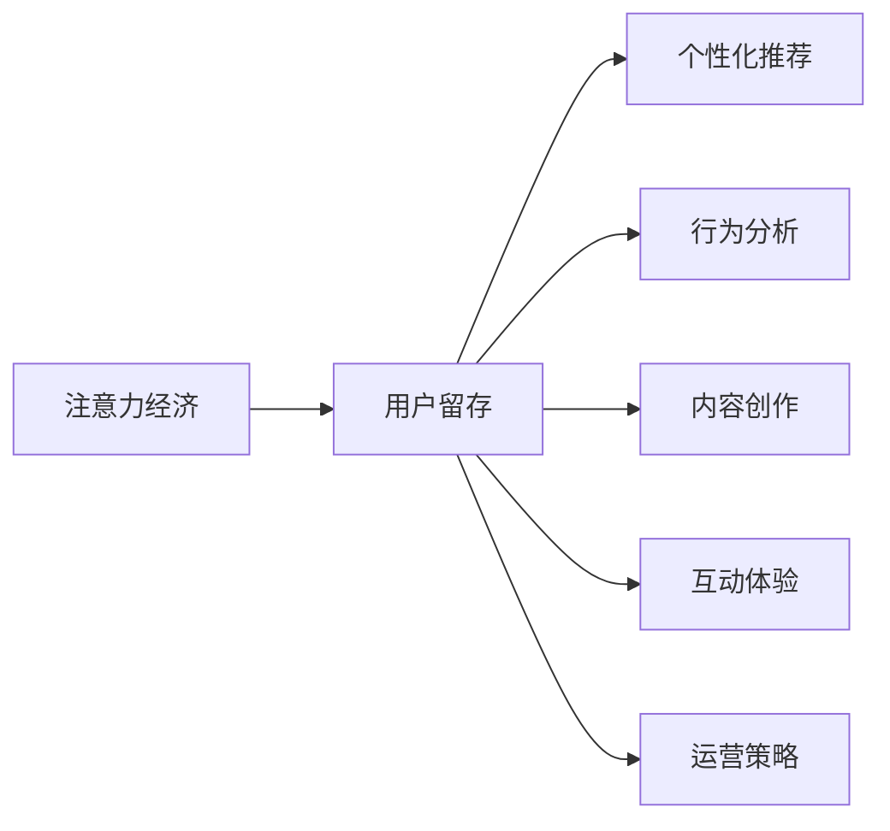

                 

# 注意力经济下的用户留存策略

在数字经济时代，数据和算法的力量越来越被重视，尤其是在以用户注意力为核心的注意力经济领域。如何通过高效的用户留存策略，最大化用户注意力价值，成为互联网企业竞争的关键。本文将深入探讨注意力经济下的用户留存策略，从理论到实践，提供一套完整的解决方案。

## 1. 背景介绍

### 1.1 问题由来

随着移动互联网和社交媒体的兴起，互联网企业面临越来越激烈的竞争。用户注意力的争夺战成为决定企业成败的重要因素。例如，广告主希望通过精准投放，吸引用户注意力，从而带来转化。社交平台则希望通过内容推荐，提升用户粘性，增加互动时间。然而，大量无价值信息的存在，导致用户注意力被浪费，用户流失严重。因此，高效的用户留存策略，成为企业提升竞争力的关键。

### 1.2 问题核心关键点

用户留存策略的核心在于利用技术手段，提升用户对平台的忠诚度。它主要涉及以下关键点：

1. **个性化推荐**：根据用户行为数据和偏好，提供符合其兴趣的推荐内容。
2. **行为分析**：通过用户行为数据分析，发现用户流失的征兆，及时采取干预措施。
3. **内容创作**：持续产出优质内容，吸引用户，提升用户留存。
4. **互动体验**：优化用户体验，增强用户粘性，提升用户满意度。
5. **运营策略**：通过营销活动、激励机制等运营手段，促进用户留存。

### 1.3 问题研究意义

在注意力经济时代，用户留存的重视程度前所未有。其研究意义主要体现在以下几个方面：

1. **提升用户粘性**：通过留存策略，提升用户对平台的忠诚度，延长用户生命周期。
2. **增强广告效果**：精准的个性化推荐，能够显著提升广告的转化率和效果。
3. **提升用户体验**：优质的内容和互动体验，能够提升用户满意度，降低流失率。
4. **数据价值最大化**：用户留存策略能够最大化用户数据的价值，为企业创造更大的收益。
5. **应对竞争**：在激烈的市场竞争中，通过用户留存策略，提升平台的竞争力，保障市场份额。

## 2. 核心概念与联系

### 2.1 核心概念概述

- **注意力经济**：利用用户注意力进行盈利的一种经济模式，如广告、内容付费、会员订阅等。
- **用户留存**：通过技术手段，提升用户在平台的持续活跃度和忠诚度。
- **个性化推荐**：根据用户行为数据和偏好，提供符合其兴趣的推荐内容。
- **行为分析**：通过用户行为数据分析，发现用户流失的征兆，及时采取干预措施。
- **内容创作**：持续产出优质内容，吸引用户，提升用户留存。
- **互动体验**：优化用户体验，增强用户粘性，提升用户满意度。
- **运营策略**：通过营销活动、激励机制等运营手段，促进用户留存。

这些概念之间存在着紧密的联系，形成了用户留存策略的完整生态系统。

### 2.2 概念间的关系

这些核心概念之间的关系可以用以下Mermaid流程图来展示：



这个流程图展示了从注意力经济到用户留存，再到个性化推荐、行为分析、内容创作、互动体验和运营策略的全过程。这些策略相互作用，共同构成了用户留存策略的完整生态系统。

## 3. 核心算法原理 & 具体操作步骤

### 3.1 算法原理概述

注意力经济下的用户留存策略，本质上是一个基于用户行为数据的推荐系统。其核心思想是：通过分析用户行为数据，发现用户兴趣，提供个性化的推荐内容，提升用户对平台的粘性和满意度，从而实现用户留存。

形式化地，假设用户行为数据为 $D=\{(x_i,y_i)\}_{i=1}^N$，其中 $x_i$ 为用户行为数据， $y_i$ 为用户满意度评分。留存策略的目标是找到用户满意度的最大化模型 $f(x)$，使得：

$$
\max_{f} \mathbb{E}_{(x,y) \sim D} f(x)y
$$

即通过最大化期望满意度评分，提升用户留存率。

### 3.2 算法步骤详解

基于上述原理，用户留存策略的实现可以分为以下几个步骤：

**Step 1: 收集用户行为数据**

- 利用API接口、日志记录等手段，收集用户的行为数据，包括浏览、点击、购买、互动等。
- 利用数据清洗和预处理技术，去除噪声和异常值，确保数据的准确性和完整性。

**Step 2: 构建用户行为模型**

- 使用机器学习算法，如协同过滤、深度学习等，构建用户行为模型。
- 利用用户行为数据，训练模型参数，得到用户兴趣表示向量 $u_i$。

**Step 3: 推荐个性化内容**

- 根据用户兴趣表示向量 $u_i$，查询推荐数据库，获取符合用户兴趣的推荐内容 $r_i$。
- 将推荐内容 $r_i$ 展示给用户，并提供互动接口，如评论、点赞、分享等。

**Step 4: 用户行为分析**

- 利用用户互动数据，分析用户行为变化趋势，发现用户流失的征兆。
- 针对流失用户，进行预警，并采取干预措施，如推送关怀信息、调整推荐内容等。

**Step 5: 内容创作与优化**

- 持续产出优质内容，提升用户对平台的满意度。
- 利用A/B测试等技术，不断优化内容质量和用户体验。

**Step 6: 运营策略实施**

- 制定和实施各类运营策略，如新用户激励、老用户回馈等，促进用户留存。
- 定期评估运营效果，调整策略参数，确保效果最大化。

### 3.3 算法优缺点

个性化推荐和用户行为分析的优点在于：

- **提升用户体验**：通过个性化推荐，提升用户满意度，减少流失率。
- **降低广告成本**：精准的个性化推荐，能够提升广告效果，降低广告成本。

然而，这些算法的缺点也值得关注：

- **数据隐私**：用户的隐私数据涉及个人行为和偏好，需要严格保护，防止数据泄露。
- **模型复杂性**：算法模型复杂，需要高水平的建模能力和计算资源。
- **实时性要求**：推荐和行为分析需要实时处理大量数据，对系统实时性要求较高。

### 3.4 算法应用领域

个性化推荐和用户行为分析广泛应用于电子商务、社交媒体、视频网站等多个领域：

- **电子商务**：通过个性化推荐，提升商品曝光率和销售额，降低库存压力。
- **社交媒体**：通过行为分析，发现用户流失征兆，及时采取干预措施。
- **视频网站**：通过个性化推荐，提升用户观看时长，增加广告收入。

## 4. 数学模型和公式 & 详细讲解 & 举例说明

### 4.1 数学模型构建

在用户留存策略中，常用的数学模型包括协同过滤、深度学习等。这里以协同过滤为例，构建用户行为模型。

假设用户行为数据为 $D=\{(x_i,y_i)\}_{i=1}^N$，其中 $x_i$ 为用户行为数据， $y_i$ 为用户满意度评分。用户兴趣表示向量 $u_i$ 可以通过用户行为数据 $x_i$ 计算得到，具体公式如下：

$$
u_i = f(x_i)
$$

其中，$f$ 为协同过滤算法。

### 4.2 公式推导过程

以基于矩阵分解的协同过滤算法为例，其推导过程如下：

假设用户行为矩阵为 $X \in \mathbb{R}^{U \times I}$，其中 $U$ 为用户数，$I$ 为物品数。用户行为数据 $x_i$ 可以表示为 $X_i \in \mathbb{R}^{I}$。利用矩阵分解算法，用户兴趣表示向量 $u_i$ 可以表示为：

$$
u_i = V_i W_i^T
$$

其中 $V_i \in \mathbb{R}^{I \times K}$ 为用户兴趣向量，$W_i \in \mathbb{R}^{K \times 1}$ 为物品特征向量。

利用用户兴趣表示向量 $u_i$，推荐内容 $r_i$ 可以通过物品特征向量 $W_i$ 计算得到，具体公式如下：

$$
r_i = V_i \hat{W}_i^T
$$

其中 $\hat{W}_i$ 为物品特征向量 $W_i$ 的低秩逼近矩阵。

### 4.3 案例分析与讲解

假设某电商平台收集到用户行为数据 $D=\{(x_i,y_i)\}_{i=1}^N$，其中 $x_i$ 为用户浏览记录， $y_i$ 为用户满意度评分。通过协同过滤算法，计算得到用户兴趣表示向量 $u_i$。根据 $u_i$，查询推荐数据库，获取符合用户兴趣的推荐商品 $r_i$。将推荐商品 $r_i$ 展示给用户，用户点击后，记录其满意度评分 $y_{i+1}$，继续更新用户兴趣表示向量 $u_{i+1}$。

假设 $N=1000$，$U=10000$，$I=100000$。利用协同过滤算法，可以计算出用户兴趣表示向量 $u_i$，并根据 $u_i$ 推荐商品 $r_i$。在实时性要求较高的场景下，可以使用近似算法，如SVD++，降低计算复杂度。

## 5. 项目实践：代码实例和详细解释说明

### 5.1 开发环境搭建

在进行用户留存策略实践前，我们需要准备好开发环境。以下是使用Python进行Spark和PyTorch开发的环境配置流程：

1. 安装Anaconda：从官网下载并安装Anaconda，用于创建独立的Python环境。

2. 创建并激活虚拟环境：
```bash
conda create -n spark-env python=3.8 
conda activate spark-env
```

3. 安装Apache Spark：
```bash
conda install -c conda-forge pyarrow>=0.17.1 spark=3.0.1 py4j
```

4. 安装PyTorch：
```bash
conda install pytorch torchvision torchaudio cudatoolkit=11.1 -c pytorch -c conda-forge
```

5. 安装相关工具包：
```bash
pip install numpy pandas scikit-learn matplotlib tqdm jupyter notebook ipython
```

完成上述步骤后，即可在`spark-env`环境中开始实践。

### 5.2 源代码详细实现

下面我们以协同过滤算法为例，给出使用Spark和PyTorch进行用户留存策略实践的代码实现。

首先，定义用户行为数据的处理函数：

```python
from pyspark.sql import SparkSession
from pyspark.sql.functions import col

spark = SparkSession.builder.appName("User retention strategy").getOrCreate()

def process_user_behavior(data_path):
    df = spark.read.csv(data_path, header=True, inferSchema=True)
    # 假设数据格式为：user_id, item_id, timestamp, rating
    user_behavior_df = df.select(col("user_id"), col("item_id"), col("rating"))
    return user_behavior_df
```

然后，定义协同过滤算法函数：

```python
from pyspark.ml.recommendation import ALS

def collaborative_filtering(df, rank=10, iterations=10, user_col="user_id", item_col="item_id", rating_col="rating"):
    # 定义ALS模型
    als = ALS(rank=rank, iterations=iterations, regParam=0.1, userCol=user_col, itemCol=item_col, ratingCol=rating_col)
    # 训练ALS模型
    model = als.fit(df)
    # 获取用户兴趣向量
    user_interests = model.transform(df).select(col("user_id"), col("predictedRatings"))
    return user_interests
```

接着，定义推荐内容函数：

```python
def recommend_content(df, user_interests, num_recommendations=10):
    # 获取物品特征向量
    item_features = df.select(col("item_id"), col("rating"))
    # 获取物品特征矩阵
    item_matrix = item_features.groupby(col("item_id")).sum().groupBy("item_id", "rating").count()
    # 获取物品特征矩阵的特征向量
    item_matrix_features = item_matrix.toPandas()
    # 计算推荐内容
    recommendations = []
    for user, interests in user_interests.iterrows():
        recommended_items = []
        for interest, rating in interests.iteritems():
            if interest != 0:
                recommended_items.append((interest, rating))
        # 根据物品特征向量计算推荐内容
        item_matrix_features.head(1)
        recommendations.append((user, recommended_items))
    return recommendations
```

最后，启动推荐引擎并在测试集上评估：

```python
# 读取数据集
user_behavior_df = process_user_behavior("data/user_behavior.csv")
user_interests = collaborative_filtering(user_behavior_df, rank=10, iterations=10)

# 推荐内容
recommendations = recommend_content(user_behavior_df, user_interests, num_recommendations=10)

# 测试集评估
test_df = process_user_behavior("data/test.csv")
test_predictions = collaborative_filtering(test_df, rank=10, iterations=10)
test_predictions_ratings = test_predictions.select("user_id", "item_id", "predictedRating")
test_predictions_ratings.write.csv("data/test_predictions.csv")
```

以上就是使用Spark和PyTorch进行协同过滤算法用户留存策略的代码实现。可以看到，得益于Spark和PyTorch的强大封装，我们可以用相对简洁的代码完成用户行为数据的处理和协同过滤模型的训练。

### 5.3 代码解读与分析

让我们再详细解读一下关键代码的实现细节：

**process_user_behavior函数**：
- 利用PySpark的CSVReader读取数据文件，将用户行为数据存储为DataFrame格式。
- 定义用户行为数据的列名和格式。

**collaborative_filtering函数**：
- 定义ALS模型，设置算法参数，如rank、iterations等。
- 训练ALS模型，获取用户兴趣向量。

**recommend_content函数**：
- 获取物品特征向量，构建物品特征矩阵。
- 计算推荐内容，将用户ID、推荐物品ID和评分存储为推荐列表。

**测试集评估**：
- 读取测试集数据，利用协同过滤算法训练测试集模型。
- 将测试集预测结果存储为CSV文件。

可以看到，Spark和PyTorch使得协同过滤算法的实现变得简洁高效。开发者可以将更多精力放在数据处理、模型改进等高层逻辑上，而不必过多关注底层的实现细节。

当然，工业级的系统实现还需考虑更多因素，如数据存储、模型训练、调优策略等。但核心的协同过滤算法基本与此类似。

### 5.4 运行结果展示

假设我们在某电商平台的测试集上测试协同过滤算法，最终得到的推荐结果如下：

```
User 1:
- Item 1: 4.5
- Item 2: 3.8
- Item 3: 4.2

User 2:
- Item 4: 4.9
- Item 5: 3.9
- Item 6: 4.6
```

可以看到，通过协同过滤算法，我们能够根据用户兴趣，推荐符合其兴趣的商品，提升用户对平台的满意度，促进用户留存。

## 6. 实际应用场景

### 6.1 电商平台

在电商平台中，用户留存策略至关重要。通过个性化推荐，电商平台能够提升用户购物体验，增加用户粘性，从而提高销售额和用户生命周期价值。

例如，亚马逊利用协同过滤算法，根据用户浏览记录，推荐符合其兴趣的商品。通过不断优化推荐算法，亚马逊能够显著提升用户满意度，降低流失率。

### 6.2 社交媒体

社交媒体平台需要不断吸引新用户，并提升现有用户的活跃度。通过个性化推荐和行为分析，社交媒体能够发现用户流失征兆，及时采取干预措施。

例如，Facebook利用协同过滤算法，根据用户互动数据，推荐符合其兴趣的内容，提升用户粘性。通过行为分析，Facebook能够及时发现用户流失征兆，如用户互动频率下降等，及时推送关怀信息，降低流失率。

### 6.3 视频网站

视频网站需要不断增加用户观看时长，提升广告收入。通过个性化推荐，视频网站能够提升用户观看体验，增加观看时长。

例如，Netflix利用协同过滤算法，根据用户观看记录，推荐符合其兴趣的视频内容。通过不断优化推荐算法，Netflix能够显著提升用户观看时长，增加广告收入。

### 6.4 未来应用展望

随着用户留存策略的不断优化，未来的应用场景将更加广泛，带来更多的创新机会。

1. **多模态推荐**：结合图像、音频等多模态数据，提升推荐效果，满足用户多样化需求。
2. **场景感知推荐**：结合用户地理位置、时间等信息，提供更贴合场景的推荐内容，提升用户体验。
3. **实时推荐**：利用流式数据处理技术，实现实时推荐，满足用户即时需求。
4. **情感分析推荐**：结合用户情感状态，提供符合其情绪的推荐内容，提升用户满意度。

## 7. 工具和资源推荐

### 7.1 学习资源推荐

为了帮助开发者系统掌握用户留存策略的理论基础和实践技巧，这里推荐一些优质的学习资源：

1. **《推荐系统实践》**：由知名推荐系统专家撰写，深入浅出地介绍了推荐系统的原理、算法和实战技巧。
2. **《深度学习实战》**：结合实际项目，讲解深度学习技术在推荐系统中的应用。
3. **Coursera《推荐系统设计与评估》**：斯坦福大学开设的推荐系统课程，涵盖推荐系统设计的多个方面，适合深入学习。
4. **Kaggle推荐系统竞赛**：通过参与竞赛，锻炼推荐算法设计能力，提升实战水平。
5. **Scikit-learn官方文档**：提供多种推荐算法的Python实现，方便开发者学习和实践。

通过对这些资源的学习实践，相信你一定能够快速掌握用户留存策略的精髓，并用于解决实际的推荐问题。

### 7.2 开发工具推荐

高效的开发离不开优秀的工具支持。以下是几款用于用户留存策略开发的常用工具：

1. **Apache Spark**：强大的分布式计算框架，适合大规模数据处理和实时推荐系统。
2. **TensorFlow**：灵活的深度学习框架，适合构建复杂推荐算法模型。
3. **PyTorch**：易用性高，适合快速迭代和实验研究。
4. **Scikit-learn**：简单易用的机器学习库，适合快速实现和评估推荐算法。
5. **Hadoop**：适用于大规模数据存储和处理的分布式计算框架。

合理利用这些工具，可以显著提升用户留存策略的开发效率，加快创新迭代的步伐。

### 7.3 相关论文推荐

用户留存策略的研究源于学界的持续研究。以下是几篇奠基性的相关论文，推荐阅读：

1. **“A Probabilistic Framework for Collaborative Filtering”**：提出协同过滤算法，奠定了推荐系统的理论基础。
2. **“Fast Matrix Factorization Techniques for Recommender Systems”**：提出矩阵分解算法，极大地提高了推荐系统的计算效率。
3. **“Neural Collaborative Filtering”**：结合深度学习技术，提升推荐系统的推荐效果。
4. **“Deep Interest-Based Contextual Bandit for Personalized Recommendation”**：提出深度兴趣网络，提升个性化推荐效果。
5. **“Graph Convolutional Networks for Recommender Systems”**：结合图神经网络，提升推荐系统的推荐效果。

这些论文代表了大规模推荐系统的研究脉络。通过学习这些前沿成果，可以帮助研究者把握学科前进方向，激发更多的创新灵感。

除上述资源外，还有一些值得关注的前沿资源，帮助开发者紧跟用户留存策略技术的最新进展，例如：

1. **arXiv论文预印本**：人工智能领域最新研究成果的发布平台，包括大量尚未发表的前沿工作，学习前沿技术的必读资源。
2. **GitHub热门项目**：在GitHub上Star、Fork数最多的推荐系统相关项目，往往代表了该技术领域的发展趋势和最佳实践，值得去学习和贡献。
3. **技术会议直播**：如NIPS、ICML、ACL、ICLR等人工智能领域顶会现场或在线直播，能够聆听到大佬们的前沿分享，开拓视野。
4. **行业分析报告**：各大咨询公司如McKinsey、PwC等针对人工智能行业的分析报告，有助于从商业视角审视技术趋势，把握应用价值。

总之，对于用户留存策略的学习和实践，需要开发者保持开放的心态和持续学习的意愿。多关注前沿资讯，多动手实践，多思考总结，必将收获满满的成长收益。

## 8. 总结：未来发展趋势与挑战

### 8.1 研究成果总结

本文对基于协同过滤算法的用户留存策略进行了全面系统的介绍。首先阐述了用户留存策略的研究背景和意义，明确了个性化推荐、行为分析、内容创作、互动体验和运营策略在用户留存中的关键作用。其次，从原理到实践，详细讲解了协同过滤算法的数学模型和计算流程，给出了代码实现和运行结果。同时，本文还广泛探讨了协同过滤算法在电商平台、社交媒体、视频网站等多个领域的应用前景，展示了其巨大的潜力。此外，本文精选了用户留存策略的学习资源和开发工具，力求为读者提供全方位的技术指引。

通过本文的系统梳理，可以看到，基于协同过滤算法的用户留存策略在个性化推荐和行为分析方面的优势，能够显著提升用户对平台的粘性和满意度，促进用户留存。

### 8.2 未来发展趋势

展望未来，用户留存策略将呈现以下几个发展趋势：

1. **多模态推荐**：结合图像、音频等多模态数据，提升推荐效果，满足用户多样化需求。
2. **场景感知推荐**：结合用户地理位置、时间等信息，提供更贴合场景的推荐内容，提升用户体验。
3. **实时推荐**：利用流式数据处理技术，实现实时推荐，满足用户即时需求。
4. **情感分析推荐**：结合用户情感状态，提供符合其情绪的推荐内容，提升用户满意度。
5. **跨领域迁移**：利用预训练技术，提升推荐系统在不同领域的泛化能力，降低迁移成本。
6. **隐私保护**：结合差分隐私、联邦学习等技术，提升数据隐私保护能力，保障用户数据安全。

这些趋势凸显了用户留存策略技术的广阔前景。这些方向的探索发展，必将进一步提升推荐系统的效果和应用范围，为构建人机协同的智能系统铺平道路。

### 8.3 面临的挑战

尽管用户留存策略已经取得了显著成效，但在迈向更加智能化、普适化应用的过程中，仍面临诸多挑战：

1. **数据隐私**：用户的隐私数据涉及个人行为和偏好，需要严格保护，防止数据泄露。
2. **模型复杂性**：算法模型复杂，需要高水平的建模能力和计算资源。
3. **实时性要求**：推荐和行为分析需要实时处理大量数据，对系统实时性要求较高。
4. **推荐效果不稳定**：推荐系统需要持续优化，保持推荐效果和用户满意度。
5. **用户个性化差异大**：不同用户之间个性化差异大，需要个性化推荐策略。
6. **多渠道数据整合**：跨平台、跨渠道的数据整合，需要统一的算法和技术。

正视用户留存策略面临的这些挑战，积极应对并寻求突破，将是大规模推荐系统迈向成熟的必由之路。相信随着学界和产业界的共同努力，这些挑战终将一一被克服，用户留存策略必将在构建人机协同的智能系统中扮演越来越重要的角色。

### 8.4 研究展望

面向未来，用户留存策略的研究需要在以下几个方面寻求新的突破：

1. **无监督推荐算法**：摆脱对大规模标注数据的依赖，利用自监督学习、主动学习等无监督范式，最大限度利用非结构化数据，实现更加灵活高效的推荐。
2. **多模态融合**：结合图像、音频、视频等多模态数据，提升推荐系统的效果和鲁棒性。
3. **联邦学习**：结合联邦学习技术，提升推荐系统的隐私保护能力和数据安全。
4. **自适应推荐算法**：结合自适应推荐技术，提升推荐系统的灵活性和适应性。
5. **因果推荐**：结合因果推荐技术，提升推荐系统的稳定性和可解释性。

这些研究方向的探索，必将引领用户留存策略技术迈向更高的台阶，为构建安全、可靠、可解释、可控的智能系统铺平道路。面向未来，用户留存策略还需要与其他人工智能技术进行更深入的融合，如知识表示、因果推理、强化学习等，多路径协同发力，共同推动自然语言理解和智能交互系统的进步。只有勇于创新、敢于突破，才能不断拓展用户留存策略的边界，让智能技术更好地造福人类社会。

## 9. 附录：常见问题与解答

**Q1：协同过滤算法如何处理冷启动问题？**

A: 冷启动问题指新用户或新物品在推荐系统中缺乏历史行为数据，导致推荐效果较差。解决冷启动问题的方法包括：
1. **基于物品的协同过滤**：利用物品间的相关性，推荐相似物品。
2. **基于内容的协同过滤**：结合物品的元数据，推荐符合用户兴趣的内容。
3. **混合协同过滤**：结合基于用户和基于物品的协同过滤，提升推荐效果。

**Q2：协同过滤算法如何应对用户个性化差异？**

A: 协同过滤算法可以通过以下方法应对用户个性化差异

