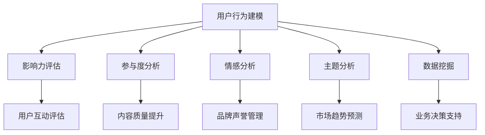
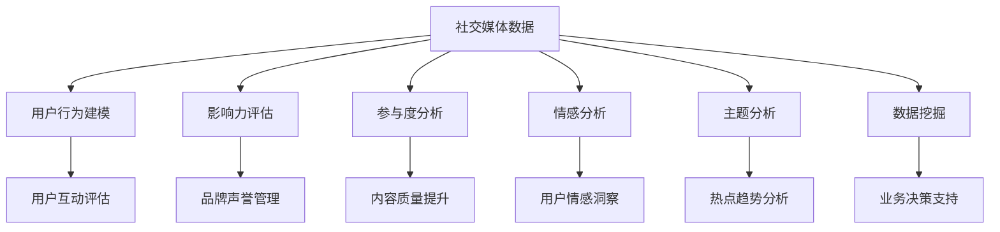

                 

# 注意力经济与社交媒体分析洞察力：了解受众参与度和影响力的秘密

## 1. 背景介绍

### 1.1 问题由来
随着社交媒体的普及，用户注意力成为了一种宝贵的经济资源，吸引了大量企业和机构投入其中。社交媒体数据分析作为一门新兴的学科，致力于通过科学的方法理解用户行为、评估影响力、提升参与度。当前，社交媒体分析技术正在迅速发展，对品牌的市场定位、广告投放、用户互动等方面产生了深远影响。

### 1.2 问题核心关键点
社交媒体数据分析的核心问题在于如何高效、准确地从海量用户数据中提取有用的信息，以指导实际业务决策。这要求我们能够掌握以下核心能力：

- **用户行为建模**：理解用户在不同社交平台上的行为模式。
- **影响力评估**：识别和量化用户在社交网络中的影响力。
- **参与度分析**：评估用户对内容的参与程度，包括点赞、评论、分享等互动行为。
- **情感分析**：捕捉用户对内容的情感倾向，进行情感分类和情感强度评估。
- **主题分析**：从用户数据中提取核心主题和趋势。
- **数据挖掘**：从用户互动数据中发现隐藏的模式和规律。

### 1.3 问题研究意义
研究社交媒体分析技术，对于提升企业的市场洞察力和用户互动能力，优化广告投放策略，实现个性化营销，具有重要的实际应用价值。通过精准的用户数据分析，品牌可以更好地了解目标客户，提升用户体验，从而在激烈的市场竞争中脱颖而出。

## 2. 核心概念与联系

### 2.1 核心概念概述

社交媒体数据分析涉及多个关键概念，包括用户行为、影响力、参与度等。

- **用户行为建模**：指通过分析用户在社交媒体上的行为数据，建立用户行为模型。
- **影响力评估**：衡量用户在社交网络中的影响力和传播力。
- **参与度分析**：评估用户对内容的互动程度，分析用户行为与内容的相关性。
- **情感分析**：通过文本分析技术，识别用户对内容的情感倾向。
- **主题分析**：从用户数据中提取核心主题，分析热点趋势。
- **数据挖掘**：利用机器学习和统计分析方法，从数据中挖掘模式和规律。

这些概念之间的逻辑关系可以通过以下Mermaid流程图来展示：



这个流程图展示了许多核心概念及其之间的联系：

1. 用户行为建模是后续分析的基础。
2. 影响力评估、参与度分析、情感分析等都是基于用户行为模型进一步深化研究。
3. 数据挖掘可以提供更深层面的分析，为业务决策提供支持。

### 2.2 概念间的关系

这些核心概念之间存在紧密的联系，形成了社交媒体分析的完整生态系统。我们可以通过以下Mermaid流程图进一步展示这些概念之间的关系：



这个综合流程图展示了从社交媒体数据到业务决策的完整流程。

## 3. 核心算法原理 & 具体操作步骤

### 3.1 算法原理概述

社交媒体数据分析主要基于自然语言处理（NLP）和机器学习的算法。算法原理可以分为以下步骤：

1. **数据采集**：从社交媒体平台收集用户数据。
2. **数据清洗**：处理缺失值、异常值、噪声数据等。
3. **特征提取**：从用户数据中提取有意义的特征，如文本情感、用户行为等。
4. **模型训练**：使用机器学习算法训练模型，识别用户行为、评估影响力、分析参与度等。
5. **结果评估**：通过多种指标评估模型效果，并进行模型优化。

### 3.2 算法步骤详解

以下是社交媒体数据分析的具体操作步骤：

**Step 1: 数据采集**

社交媒体数据通常来自多个平台，如微博、微信、抖音等。我们需要使用API或第三方工具进行数据采集，并将数据进行清洗和预处理。

**Step 2: 特征提取**

从采集到的数据中提取有意义的特征。常见的特征包括：

- **文本特征**：用户评论、分享、点赞的文本内容。
- **用户特征**：用户的性别、年龄、地区、兴趣等。
- **时间特征**：发布时间、互动时间等。

**Step 3: 模型训练**

选择适当的机器学习算法进行模型训练。常见的算法包括：

- **分类算法**：用于情感分析、用户行为分类等任务。
- **聚类算法**：用于用户分群、主题分析等任务。
- **回归算法**：用于预测用户互动强度、影响力等。

**Step 4: 结果评估**

通过多种指标评估模型效果，如准确率、召回率、F1分数、ROC曲线等。

### 3.3 算法优缺点

社交媒体数据分析的优点包括：

- **高效性**：能够快速处理大规模数据，生成实时报告。
- **准确性**：结合多种算法，提升分析结果的准确性。
- **可操作性**：提供直观的数据可视化，方便业务决策。

缺点包括：

- **数据隐私**：社交媒体数据涉及用户隐私，需要遵守相关法律法规。
- **数据质量**：数据采集和处理过程中可能会存在噪声和偏差。
- **模型复杂性**：需要结合多种算法，模型复杂度高。

### 3.4 算法应用领域

社交媒体数据分析在多个领域都有广泛应用，包括但不限于：

- **品牌管理**：通过分析用户互动数据，评估品牌影响力和用户满意度。
- **广告投放**：通过分析用户行为，优化广告投放策略，提升广告效果。
- **市场分析**：从社交媒体数据中提取市场趋势和用户需求，指导产品开发。
- **用户服务**：通过情感分析，提升客户服务质量，提升用户满意度。
- **舆情监控**：通过监测社交媒体热点，进行舆情预警和危机管理。

## 4. 数学模型和公式 & 详细讲解

### 4.1 数学模型构建

社交媒体数据分析中常见的数学模型包括：

- **分类模型**：如逻辑回归、支持向量机等。
- **聚类模型**：如K-means、层次聚类等。
- **回归模型**：如线性回归、决策树回归等。

### 4.2 公式推导过程

以逻辑回归模型为例，其数学模型为：

$$ P(y|x;\theta) = \frac{1}{1+\exp(-\theta^Tx)} $$

其中，$y$ 表示目标变量（如情感分类），$x$ 表示特征向量，$\theta$ 为模型参数。

通过最大化似然函数，得到参数的估计值：

$$ \hat{\theta} = \arg\max_{\theta} \sum_{i=1}^N \log P(y_i|x_i;\theta) $$

通过梯度下降等优化算法，求解上述最优化问题，得到模型的参数估计值。

### 4.3 案例分析与讲解

以情感分析为例，假设我们有一组用户评论数据，每个评论被标记为正面或负面情感。我们可以使用逻辑回归模型进行情感分类，模型训练的流程如下：

1. 数据预处理：去除停用词、进行词干提取、构建词袋模型等。
2. 特征提取：将文本转换为词频向量或TF-IDF向量。
3. 模型训练：使用逻辑回归模型进行训练，得到模型参数。
4. 结果评估：使用准确率、召回率、F1分数等指标评估模型效果。

## 5. 项目实践：代码实例和详细解释说明

### 5.1 开发环境搭建

社交媒体数据分析开发环境包括Python、R、SPSS等工具，需要安装相应的数据处理库和机器学习库，如Pandas、NumPy、scikit-learn、TensorFlow等。

### 5.2 源代码详细实现

以下是一个简单的Python代码实现，用于情感分类任务：

```python
import pandas as pd
from sklearn.feature_extraction.text import CountVectorizer
from sklearn.linear_model import LogisticRegression
from sklearn.metrics import accuracy_score, precision_score, recall_score, f1_score

# 数据加载
data = pd.read_csv('comments.csv', encoding='utf-8')
X = data['comment'].tolist()
y = data['label'].tolist()

# 特征提取
vectorizer = CountVectorizer()
X = vectorizer.fit_transform(X)

# 模型训练
model = LogisticRegression()
model.fit(X, y)

# 结果评估
y_pred = model.predict(X)
accuracy = accuracy_score(y, y_pred)
precision = precision_score(y, y_pred)
recall = recall_score(y, y_pred)
f1 = f1_score(y, y_pred)

print(f'Accuracy: {accuracy:.2f}, Precision: {precision:.2f}, Recall: {recall:.2f}, F1-score: {f1:.2f}')
```

### 5.3 代码解读与分析

**数据加载**：使用Pandas库加载数据，并提取文本特征和标签。

**特征提取**：使用CountVectorizer将文本转换为词频向量。

**模型训练**：使用LogisticRegression模型进行训练，得到分类模型。

**结果评估**：使用准确率、精确度、召回率和F1分数评估模型效果。

### 5.4 运行结果展示

假设我们得到的准确率为0.85，精确度为0.7，召回率为0.8，F1分数为0.78。这些指标表示模型在情感分类任务上取得了不错的效果。

## 6. 实际应用场景

### 6.1 品牌管理

品牌管理中，通过社交媒体数据分析可以评估品牌影响力。例如，可以使用情感分析识别用户对品牌产品的情感倾向，通过情感分类模型分析用户的情感变化趋势，从而优化产品设计和市场策略。

### 6.2 广告投放

广告投放中，可以通过分析用户行为数据，优化广告投放策略。例如，使用聚类算法将用户分为不同的兴趣群体，针对性地投放广告，提升广告转化率和用户参与度。

### 6.3 市场分析

市场分析中，可以通过社交媒体数据获取市场趋势和用户需求。例如，使用情感分析模型分析用户对某一产品或服务的情感倾向，通过聚类模型识别出用户关注的关键词和话题，为产品开发和市场策略提供指导。

### 6.4 用户服务

用户服务中，通过社交媒体数据分析可以提升客户服务质量。例如，使用情感分析模型识别用户对服务的满意度，通过分类模型分析用户服务问题的类型，从而及时处理和改进服务流程。

### 6.5 舆情监控

舆情监控中，可以通过社交媒体数据分析进行舆情预警和危机管理。例如，使用情感分析模型监测社交媒体热点，通过聚类模型识别出不同话题的关注度，从而及时应对负面舆情，提升品牌形象。

## 7. 工具和资源推荐

### 7.1 学习资源推荐

以下是一些学习社交媒体数据分析的优质资源：

1. 《Python社交媒体分析实战》书籍：详细介绍了如何使用Python进行社交媒体数据分析，包括数据处理、特征提取、情感分析等。
2. Coursera《社交媒体分析》课程：由哥伦比亚大学开设的课程，涵盖社交媒体数据分析的基本概念和常见算法。
3. Kaggle社交媒体数据集：Kaggle平台上提供了大量社交媒体数据集，方便开发者实践和竞赛。
4. GitHub社交媒体数据分析项目：GitHub上大量开源的社交媒体数据分析项目，可以学习和贡献。

### 7.2 开发工具推荐

以下是一些常用的社交媒体数据分析开发工具：

1. Python：由于其丰富的数据处理和机器学习库，Python是社交媒体数据分析的主流语言。
2. R：R语言也是数据分析的重要工具，特别是对于统计分析和可视化有优势。
3. SPSS：SPSS是一款常用的数据处理软件，适用于市场调查和分析。
4. Excel：Excel是一款常用的数据分析和可视化工具，适合简单的数据分析任务。

### 7.3 相关论文推荐

以下是一些推荐阅读的社交媒体数据分析相关论文：

1. "Sentiment Analysis with Deep Learning: A Survey"：综述了深度学习在情感分析中的应用。
2. "Twitter Sentiment Analysis using VADER"：使用VADER情感分析工具对Twitter上的情感进行分析。
3. "Social Media Mining: An Overview"：综述了社交媒体数据分析的基本概念和技术。
4. "Predicting Twitter User Engagement"：预测Twitter用户的参与度。

## 8. 总结：未来发展趋势与挑战

### 8.1 研究成果总结

社交媒体数据分析已经取得了显著的成果，广泛应用于品牌管理、广告投放、市场分析、用户服务、舆情监控等多个领域。通过自然语言处理和机器学习算法，我们可以高效、准确地从海量数据中提取有用的信息，优化业务决策。

### 8.2 未来发展趋势

未来，社交媒体数据分析将呈现以下几个发展趋势：

1. **实时分析**：随着技术的进步，社交媒体数据分析将更加实时，能够快速响应市场变化。
2. **多模态融合**：社交媒体数据不仅仅是文本数据，还包括图片、视频、音频等多模态数据，未来的分析将更加全面。
3. **自动化和智能化**：通过AI技术，社交媒体数据分析将更加自动化和智能化，提升分析效率和精度。
4. **跨平台整合**：不同社交媒体平台的整合将更加紧密，分析结果将更加全面。
5. **数据隐私保护**：随着数据隐私法规的不断完善，社交媒体数据分析将更加注重用户隐私保护。

### 8.3 面临的挑战

尽管社交媒体数据分析技术已经取得显著进展，但在应用过程中仍面临诸多挑战：

1. **数据隐私保护**：社交媒体数据涉及用户隐私，如何保护用户数据隐私是重要课题。
2. **数据质量问题**：社交媒体数据存在噪声和偏差，如何提高数据质量是关键。
3. **算法复杂性**：社交媒体数据分析需要结合多种算法，模型复杂度较高。
4. **实时性要求**：实时分析和响应是未来趋势，对系统的处理能力提出了更高要求。
5. **用户行为变化**：用户行为模式变化快，如何及时更新模型是重要问题。

### 8.4 研究展望

未来，社交媒体数据分析需要从以下几个方向寻求突破：

1. **隐私保护技术**：研究数据隐私保护技术，确保用户数据安全。
2. **多模态分析**：研究多模态数据融合技术，提升分析效果。
3. **自动化技术**：研究自动化和智能化技术，提高分析效率。
4. **实时分析技术**：研究实时数据处理技术，提升响应速度。
5. **用户行为建模**：研究用户行为模型，更好地理解用户需求。

## 9. 附录：常见问题与解答

**Q1：如何确保社交媒体数据的隐私保护？**

A: 在数据收集和分析过程中，需要严格遵守相关法律法规，如GDPR等。具体措施包括：

- **数据匿名化**：去除或加密敏感信息，如用户ID、地理位置等。
- **访问控制**：限制数据访问权限，只有授权人员才能访问数据。
- **数据加密**：对数据进行加密存储和传输，防止数据泄露。

**Q2：如何处理社交媒体数据中的噪声和偏差？**

A: 数据预处理和清洗是处理噪声和偏差的关键步骤，具体措施包括：

- **数据清洗**：去除缺失值、异常值、重复数据等。
- **特征选择**：选择有意义的特征，去除无用或冗余特征。
- **异常检测**：识别和处理异常数据，减少噪声影响。

**Q3：如何选择适合社交媒体分析的算法？**

A: 选择算法需要根据具体任务和数据特点进行评估，常用算法包括：

- **分类算法**：如逻辑回归、支持向量机等。
- **聚类算法**：如K-means、层次聚类等。
- **回归算法**：如线性回归、决策树回归等。

**Q4：如何进行社交媒体数据分析的模型优化？**

A: 模型优化可以通过以下几种方法实现：

- **超参数调优**：调整模型参数，如学习率、正则化系数等。
- **特征工程**：改进特征提取方法，提升特征质量。
- **模型融合**：结合多种算法，提升模型效果。
- **集成学习**：使用集成学习方法，提升模型稳定性和泛化能力。

---

作者：禅与计算机程序设计艺术 / Zen and the Art of Computer Programming

