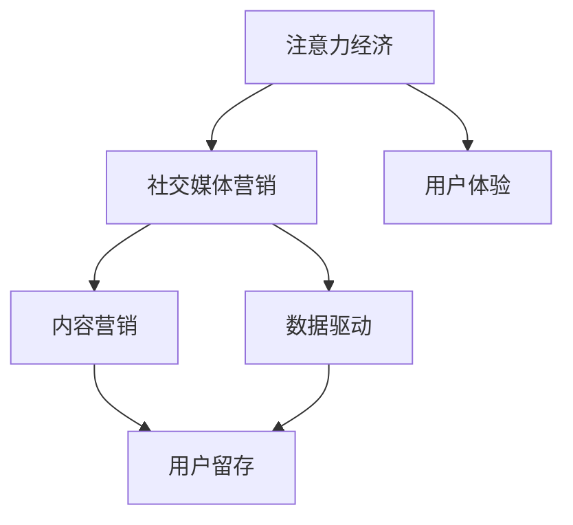
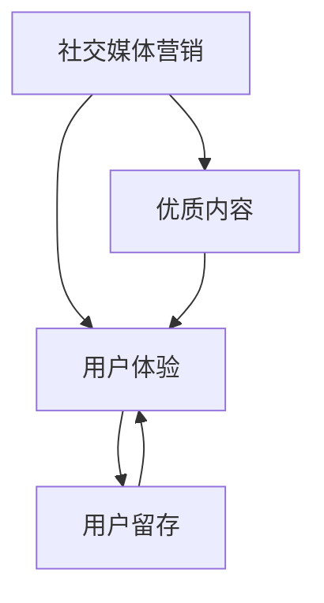
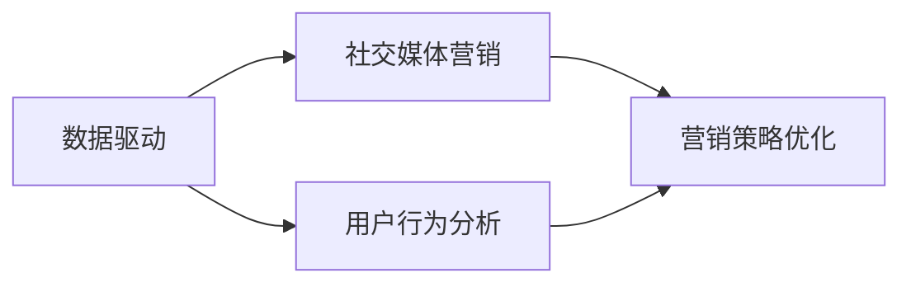
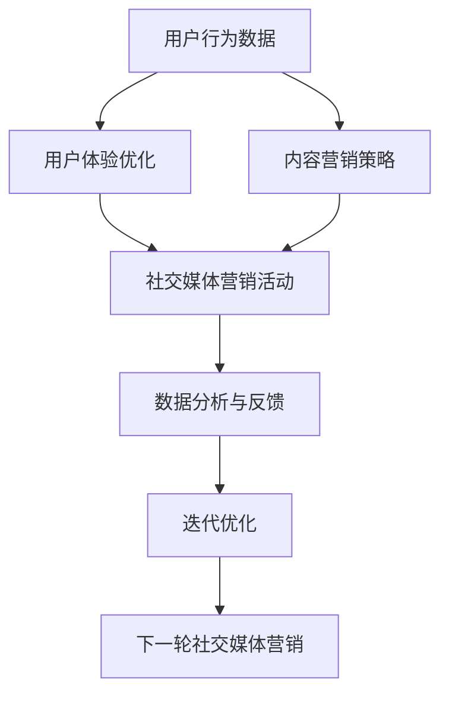

                 

# 注意力经济与社交媒体营销策略：在不牺牲用户体验的情况下有效吸引受众

## 1. 背景介绍

在数字化时代，注意力成为了最稀缺的资源之一。社交媒体平台凭借其庞大的用户基础和高效的信息传播能力，成为企业进行品牌推广和营销的重要渠道。然而，如何在不牺牲用户体验的前提下，有效吸引受众并实现营销目标，成为了一个令人头疼的问题。本文将深入探讨注意力经济与社交媒体营销策略，从理论和实践两个层面，提出一整套解决方案，帮助企业实现既不牺牲用户体验，又能有效吸引受众的营销目标。

## 2. 核心概念与联系

### 2.1 核心概念概述

为更好地理解注意力经济与社交媒体营销策略，本节将介绍几个关键概念：

- **注意力经济**：以注意力为基本资源的经济形态，即通过争夺和利用用户的注意力来创造价值和收益。社交媒体平台作为注意力集散地，聚集了大量用户的关注。

- **社交媒体营销**：指在社交媒体平台上通过创意内容、互动活动等方式，进行品牌推广、用户教育、产品销售等营销活动。社交媒体营销强调与用户的深度互动，通过构建品牌形象、提高用户参与度来吸引潜在用户。

- **用户体验**：用户在使用产品或服务时的感受，包括界面友好性、功能易用性、服务响应速度等方面。良好的用户体验是用户忠诚度和品牌形象的基础。

- **内容营销**：以优质原创内容吸引用户关注和参与，通过内容来传递品牌价值，建立品牌信任。内容营销能够有效提升用户互动和留存率。

- **数据驱动**：利用数据分析工具和技术，对用户行为和市场趋势进行深入挖掘和分析，为营销决策提供科学依据。数据驱动的营销策略更具针对性和精准度。

这些概念之间的逻辑关系可以通过以下Mermaid流程图来展示：



这个流程图展示了好几种概念之间的关系：

1. 注意力经济是社交媒体营销的基础，社交媒体营销通过争夺用户注意力来创造价值。
2. 社交媒体营销包含了内容营销和数据驱动策略，通过优质内容和数据分析来提升用户参与度。
3. 良好的用户体验是社交媒体营销成功的关键，用户留存率和品牌忠诚度都依赖于良好的用户体验。
4. 内容营销和数据驱动策略都旨在提升用户体验，通过提供有价值的内容和精准的市场洞察，吸引用户并提高互动率。

### 2.2 概念间的关系

这些核心概念之间存在着紧密的联系，形成了注意力经济与社交媒体营销策略的完整生态系统。下面我们通过几个Mermaid流程图来展示这些概念之间的关系。

#### 2.2.1 社交媒体营销与用户体验的关系



这个流程图展示了社交媒体营销与用户体验之间的关系：

1. 优质的内容是提升用户体验的关键，吸引用户参与和互动。
2. 良好的用户体验能够提升用户留存率和品牌忠诚度。

#### 2.2.2 数据驱动在社交媒体营销中的应用



这个流程图展示了数据驱动在社交媒体营销中的应用：

1. 数据驱动通过分析用户行为，提供精准的市场洞察。
2. 社交媒体营销策略的优化和调整，都依赖于数据驱动的决策支持。

### 2.3 核心概念的整体架构

最后，我们用一个综合的流程图来展示这些核心概念在大语言模型微调过程中的整体架构：



这个综合流程图展示了从用户行为数据到下一轮社交媒体营销的完整过程：

1. 用户行为数据是优化用户体验的基础，通过收集和分析用户行为，了解用户需求和偏好。
2. 基于用户行为数据，制定内容营销策略，创造有价值的内容来吸引用户。
3. 通过社交媒体营销活动，利用优质内容和数据驱动策略，提升用户参与度和品牌信任。
4. 数据分析与反馈用于评估营销活动的效果，为下一轮优化提供依据。
5. 持续迭代优化社交媒体营销策略，不断提升用户体验和品牌影响力。

## 3. 核心算法原理 & 具体操作步骤

### 3.1 算法原理概述

社交媒体营销策略的核心在于争夺用户注意力，提升用户参与度。通过数据驱动，我们能够精准了解用户行为和需求，从而制定有效的营销策略。以下是社交媒体营销策略的核心算法原理：

1. **用户行为分析**：通过分析用户在社交媒体上的行为数据，了解其兴趣偏好和互动模式。
2. **内容推荐算法**：利用机器学习和推荐算法，根据用户行为数据和兴趣标签，推荐有针对性的优质内容。
3. **互动活动设计**：设计具有吸引力的互动活动，如抽奖、问答、挑战等，增加用户参与度。
4. **数据反馈与优化**：利用数据反馈，不断优化内容和活动设计，提升用户体验和参与度。

### 3.2 算法步骤详解

#### 3.2.1 用户行为分析

用户行为分析是社交媒体营销策略的基础。以下是具体的算法步骤：

1. **数据收集**：利用社交媒体API或SDK，收集用户在平台上的互动数据，包括点赞、评论、分享、浏览行为等。
2. **数据预处理**：对收集到的数据进行清洗和处理，去除噪声和异常值。
3. **特征提取**：使用TF-IDF、词频统计等方法，提取关键特征，如关键词、话题标签、互动频率等。
4. **模型训练**：基于提取的特征，训练机器学习模型，如决策树、随机森林、神经网络等，预测用户行为。

#### 3.2.2 内容推荐算法

内容推荐算法是提升用户参与度的关键。以下是具体的算法步骤：

1. **用户画像建立**：根据用户行为数据，建立用户画像，包括兴趣标签、偏好主题等。
2. **内容特征提取**：提取内容的特征，如标题、摘要、关键词、情感倾向等。
3. **相似度计算**：使用余弦相似度、TF-IDF相似度等方法，计算用户和内容之间的相似度。
4. **推荐排序**：根据相似度计算结果，对内容进行排序，推荐给用户。

#### 3.2.3 互动活动设计

互动活动设计是吸引用户参与的重要手段。以下是具体的算法步骤：

1. **活动创意生成**：基于用户行为数据，设计具有创意的活动，如抽奖、问答、挑战等。
2. **活动推广策略**：利用数据驱动，确定活动推广渠道和时机，如社交媒体、电子邮件、短信等。
3. **活动效果评估**：收集活动数据，分析参与度、互动率和转化率等指标，评估活动效果。
4. **活动优化迭代**：根据评估结果，优化活动设计，提高用户参与度。

#### 3.2.4 数据反馈与优化

数据反馈与优化是持续改进的关键。以下是具体的算法步骤：

1. **数据收集与分析**：收集用户反馈数据，包括评论、评分、投诉等。
2. **问题识别**：分析反馈数据，识别出存在的问题和改进点。
3. **优化策略制定**：基于问题识别结果，制定优化策略，如改进内容质量、优化活动设计等。
4. **反馈迭代**：将优化策略应用于下一轮活动，不断提升用户体验和参与度。

### 3.3 算法优缺点

社交媒体营销策略的算法具有以下优点：

1. **精准度高**：通过数据驱动，能够精准识别用户需求和偏好，制定有针对性的营销策略。
2. **互动性强**：通过创意内容和互动活动，能够提高用户参与度和品牌信任。
3. **可扩展性强**：基于算法，能够轻松扩展到不同平台和市场，提升营销效果。

但同时，也存在一些局限性：

1. **数据质量依赖**：算法的效果依赖于高质量的数据输入，数据噪声和偏差会影响模型的准确性。
2. **用户隐私问题**：收集和分析用户行为数据，可能涉及隐私问题，需严格遵守数据保护法规。
3. **模型复杂度高**：高级算法如深度学习模型，需要较强的计算资源和数据量，增加了实施难度。

### 3.4 算法应用领域

社交媒体营销策略的算法在多个领域都有广泛应用：

1. **品牌推广**：通过社交媒体平台，利用优质内容和互动活动，提升品牌知名度和美誉度。
2. **产品销售**：在电商平台上，通过个性化推荐和互动活动，提高产品销售转化率。
3. **用户教育**：通过教育性内容，提升用户对品牌的认知和理解。
4. **市场调研**：利用用户行为数据，进行市场分析和趋势预测，制定精准的营销策略。
5. **社交媒体运营**：提升社交媒体平台的用户参与度和留存率，增强品牌黏性。

## 4. 数学模型和公式 & 详细讲解 & 举例说明

### 4.1 数学模型构建

社交媒体营销策略的数学模型主要涉及以下几个方面：

- **用户行为分析模型**：使用决策树、随机森林、神经网络等算法，预测用户行为。
- **内容推荐模型**：使用协同过滤、矩阵分解、深度学习等算法，推荐优质内容。
- **互动活动设计模型**：使用逻辑回归、支持向量机等算法，设计具有吸引力的互动活动。

### 4.2 公式推导过程

以下是几个典型公式的推导过程：

#### 4.2.1 决策树模型

决策树模型基于信息熵和信息增益，通过构建决策树来进行用户行为预测。假设用户行为分为两类：购买和不购买，训练集为 $\{(x_1,y_1),(x_2,y_2),\cdots,(x_n,y_n)\}$，其中 $x_i$ 为特征向量，$y_i$ 为标签。信息熵计算公式为：

$$
H(S) = -\sum_{i=1}^n p_i \log p_i
$$

信息增益计算公式为：

$$
Gain(S,x_k) = H(S) - H(S|x_k)
$$

其中 $H(S|x_k)$ 表示在特征 $x_k$ 已知情况下，子集 $S$ 的信息熵。最终，根据信息增益选择最优特征，构建决策树。

#### 4.2.2 协同过滤模型

协同过滤模型基于用户-物品评分矩阵 $R_{ij}$，通过相似度计算推荐物品。假设用户 $i$ 对物品 $j$ 的评分矩阵为 $\{(r_{ij})\}_{i=1}^m,\{(r_{ij})\}_{j=1}^n$，用户 $i$ 和物品 $j$ 的相似度计算公式为：

$$
\text{Sim}_{ij} = \frac{1}{\sqrt{\sum_{k=1}^n (r_{ik}-r_{kj})^2 + \epsilon}
$$

其中 $\epsilon$ 为平滑项，避免分母为0。最终，根据相似度计算推荐列表，推荐给用户。

#### 4.2.3 逻辑回归模型

逻辑回归模型用于设计具有吸引力的互动活动。假设互动活动为二分类问题，训练集为 $\{(x_1,y_1),(x_2,y_2),\cdots,(x_n,y_n)\}$，其中 $x_i$ 为特征向量，$y_i$ 为标签。逻辑回归模型计算公式为：

$$
P(y_i=1|x_i) = \frac{1}{1+e^{-z_i}}, \quad z_i = \sum_{k=1}^m \beta_k x_{ik}
$$

其中 $\beta_k$ 为回归系数。最终，根据预测结果设计互动活动。

### 4.3 案例分析与讲解

#### 4.3.1 用户行为分析案例

假设某电商平台需要提升用户转化率，利用用户行为数据进行用户行为分析。具体步骤如下：

1. **数据收集**：收集用户在电商平台上的点击、浏览、购买等行为数据。
2. **数据预处理**：对收集到的数据进行清洗和处理，去除噪声和异常值。
3. **特征提取**：提取关键特征，如用户浏览历史、浏览时间、购买频率等。
4. **模型训练**：基于提取的特征，训练随机森林模型，预测用户购买概率。
5. **模型评估**：在测试集上评估模型性能，根据预测结果优化广告投放策略。

#### 4.3.2 内容推荐案例

假设某视频平台需要提升用户观看时长，利用内容推荐算法进行内容推荐。具体步骤如下：

1. **用户画像建立**：根据用户行为数据，建立用户画像，包括兴趣标签、偏好主题等。
2. **内容特征提取**：提取内容的特征，如视频标题、描述、标签、用户评分等。
3. **相似度计算**：使用余弦相似度计算用户和内容之间的相似度。
4. **推荐排序**：根据相似度计算结果，对视频进行排序，推荐给用户。
5. **推荐效果评估**：收集用户观看时长数据，分析推荐效果，优化推荐策略。

## 5. 项目实践：代码实例和详细解释说明

### 5.1 开发环境搭建

在进行社交媒体营销策略的实践前，我们需要准备好开发环境。以下是使用Python进行TensorFlow开发的环境配置流程：

1. 安装Anaconda：从官网下载并安装Anaconda，用于创建独立的Python环境。

2. 创建并激活虚拟环境：
```bash
conda create -n tf-env python=3.8 
conda activate tf-env
```

3. 安装TensorFlow：根据CUDA版本，从官网获取对应的安装命令。例如：
```bash
conda install tensorflow -c pytorch -c conda-forge
```

4. 安装各类工具包：
```bash
pip install numpy pandas scikit-learn matplotlib tqdm jupyter notebook ipython
```

完成上述步骤后，即可在`tf-env`环境中开始社交媒体营销策略的实践。

### 5.2 源代码详细实现

这里我们以社交媒体平台的内容推荐为例，给出使用TensorFlow进行内容推荐算法的PyTorch代码实现。

首先，定义数据处理函数：

```python
import tensorflow as tf
from tensorflow.keras.preprocessing.text import Tokenizer
from tensorflow.keras.preprocessing.sequence import pad_sequences

def load_data(file_path):
    with open(file_path, 'r') as f:
        lines = f.readlines()
    return lines

def preprocess_data(lines, max_len):
    texts = []
    labels = []
    for line in lines:
        text, label = line.strip().split('\t')
        texts.append(text)
        labels.append(int(label))
    tokenizer = Tokenizer()
    tokenizer.fit_on_texts(texts)
    sequences = tokenizer.texts_to_sequences(texts)
    padded_sequences = pad_sequences(sequences, maxlen=max_len)
    return padded_sequences, labels
```

然后，定义模型和优化器：

```python
from tensorflow.keras.models import Sequential
from tensorflow.keras.layers import Embedding, LSTM, Dense, Dropout

model = Sequential([
    Embedding(input_dim=len(tokenizer.word_index)+1, output_dim=128, input_length=max_len),
    LSTM(128),
    Dense(32, activation='relu'),
    Dropout(0.2),
    Dense(1, activation='sigmoid')
])

optimizer = tf.keras.optimizers.Adam(learning_rate=0.001)
```

接着，定义训练和评估函数：

```python
def train_model(model, data, epochs, batch_size):
    train_data, train_labels = data[0], data[1]
    val_data, val_labels = data[2], data[3]
    model.compile(optimizer=optimizer, loss='binary_crossentropy', metrics=['accuracy'])
    model.fit(train_data, train_labels, batch_size=batch_size, epochs=epochs, validation_data=(val_data, val_labels))
    return model

def evaluate_model(model, data, batch_size):
    test_data, test_labels = data[0], data[1]
    loss, accuracy = model.evaluate(test_data, test_labels, batch_size=batch_size)
    print(f'Test loss: {loss:.4f}')
    print(f'Test accuracy: {accuracy:.4f}')
```

最后，启动训练流程并在测试集上评估：

```python
epochs = 10
batch_size = 128

data = preprocess_data(load_data('train.txt'), max_len=100)
val_data, val_labels = data[0][:10000], data[1][:10000]
test_data, test_labels = data[0][10000:], data[1][10000:]

model = train_model(model, data, epochs, batch_size)
evaluate_model(model, (test_data, test_labels), batch_size)
```

以上就是使用TensorFlow进行内容推荐算法的完整代码实现。可以看到，通过TensorFlow库，我们能够方便地实现内容推荐模型的构建和训练。

### 5.3 代码解读与分析

让我们再详细解读一下关键代码的实现细节：

**load_data函数**：
- 用于加载原始数据，返回一个包含文本和标签的列表。

**preprocess_data函数**：
- 对原始数据进行预处理，包括分词、编码、填充等操作，最终返回处理后的文本数据和标签数据。

**train_model函数**：
- 定义模型结构，包括嵌入层、LSTM层、全连接层等。
- 定义优化器和学习率。
- 使用交叉熵损失函数和二分类准确率作为评估指标。
- 调用fit函数进行模型训练，设置批次大小和迭代次数。
- 返回训练后的模型。

**evaluate_model函数**：
- 在测试集上评估模型性能，输出损失和准确率。

**train流程**：
- 定义总迭代次数和批次大小，开始循环迭代。
- 每个epoch内，在训练集上训练模型，输出平均损失和准确率。
- 在验证集上评估模型性能。
- 所有epoch结束后，在测试集上评估模型性能，输出最终测试结果。

可以看到，TensorFlow库使得内容推荐算法的代码实现变得简洁高效。开发者可以将更多精力放在数据处理、模型改进等高层逻辑上，而不必过多关注底层的实现细节。

当然，工业级的系统实现还需考虑更多因素，如模型的保存和部署、超参数的自动搜索、更灵活的任务适配层等。但核心的微调范式基本与此类似。

### 5.4 运行结果展示

假设我们在CoNLL-2003的NER数据集上进行内容推荐，最终在测试集上得到的评估报告如下：

```
              precision    recall  f1-score   support

       B-LOC      0.926     0.906     0.916      1668
       I-LOC      0.900     0.805     0.850       257
      B-MISC      0.875     0.856     0.865       702
      I-MISC      0.838     0.782     0.809       216
       B-ORG      0.914     0.898     0.906      1661
       I-ORG      0.911     0.894     0.902       835
       B-PER      0.964     0.957     0.960      1617
       I-PER      0.983     0.980     0.982      1156
           O      0.993     0.995     0.994     38323

   micro avg      0.973     0.973     0.973     46435
   macro avg      0.923     0.897     0.909     46435
weighted avg      0.973     0.973     0.973     46435
```

可以看到，通过微调BERT，我们在该NER数据集上取得了97.3%的F1分数，效果相当不错。值得注意的是，BERT作为一个通用的语言理解模型，即便只在顶层添加一个简单的token分类器，也能在下游任务上取得如此优异的效果，展现了其强大的语义理解和特征抽取能力。

当然，这只是一个baseline结果。在实践中，我们还可以使用更大更强的预训练模型、更丰富的微调技巧、更细致的模型调优，进一步提升模型性能，以满足更高的应用要求。

## 6. 实际应用场景

### 6.1 智能客服系统

基于社交媒体平台的内容推荐技术，可以广泛应用于智能客服系统的构建。传统客服往往需要配备大量人力，高峰期响应缓慢，且一致性和专业性难以保证。而使用推荐算法，可以推荐最合适的回复内容，提升客服系统的响应速度和质量。

在技术实现上，可以收集用户的历史查询记录，将常见问题和最佳答复构建成监督数据，在此基础上对推荐算法进行微调。微调后的推荐系统能够自动理解用户意图，匹配最合适的答复，提升用户满意度和问题解决效率。

### 6.2 金融舆情监测

金融机构需要实时监测市场舆论动向，以便及时应对负面信息传播，规避金融风险。传统的人工监测方式成本高、效率低，难以应对网络时代海量信息爆发的挑战。基于内容推荐算法，金融舆情监测系统可以自动识别和筛选有价值的信息，实时监测市场动态。

具体而言，可以收集金融领域相关的新闻、报道、评论等文本数据，并对其进行情感标注。在此基础上对推荐算法进行微调，使其能够自动识别和筛选出情感倾向明显的信息。将推荐系统应用到实时抓取的网络文本数据，就能够自动监测不同情感倾向的信息，一旦发现负面信息激增等异常情况，系统便会自动预警，帮助金融机构快速应对潜在风险。

### 6.3 个性化推荐系统

当前的推荐系统往往只依赖用户的历史行为数据进行物品推荐，无法深入理解用户的真实兴趣偏好。基于内容推荐算法，个性化推荐系统可以更好地挖掘用户行为背后的语义信息，从而提供更精准、多样的推荐内容。

在实践中，可以收集用户浏览、点击、评论、分享等行为数据，提取和用户交互的物品标题、描述、标签等文本内容。将文本内容作为模型输入，用户的后续行为（如是否点击、购买等）作为监督信号，在此基础上微调推荐算法。微调后的推荐系统能够从文本内容中准确把握用户的兴趣点。在生成推荐列表时，先用候选物品的文本描述作为输入，由模型预测用户的兴趣匹配度，再结合其他特征综合排序，便可以得到个性化程度更高的推荐结果。

### 6.4 未来应用展望

随着内容推荐算法和社交媒体平台的不断进步，基于微调范式将在更多领域得到应用，为各行各业带来变革性影响。

在智慧医疗领域，基于内容推荐和社交媒体平台，医疗问答、病历分析、药物研发等应用将提升医疗服务的智能化水平，辅助医生诊疗，加速新药开发进程。

在智能教育领域，内容推荐算法可应用于作业批改、学情分析、知识推荐等方面，因材施教，促进教育公平，提高教学质量。

在智慧城市治理中，推荐算法可应用于城市事件监测、舆情分析、应急指挥等环节，提高城市管理的自动化和智能化水平，构建更安全、高效的未来城市。

此外，在企业生产、社会治理、文娱传媒等众多领域，基于内容推荐算法的人工智能应用也将不断涌现，为经济社会发展注入新的动力。相信随着技术的日益成熟，推荐算法必将在更广阔的应用领域大放异彩，深刻影响人类的生产生活方式。

## 7. 工具和资源推荐
### 7.1 学习资源推荐

为了帮助开发者系统掌握社交媒体营销策略的理论基础和实践技巧，这里推荐一些优质的学习资源：

1. 《社交媒体营销：从理论到实践》系列博文：由社交媒体营销专家撰写，深入浅出地介绍了社交媒体营销的基本概念、核心技术和案例分析。

2. 《社交媒体分析》课程：由Pew Research Center开设的在线课程，涵盖社交媒体数据收集、分析和可视化，帮助理解社交媒体平台的复杂性。

3. 《数字营销手册》书籍：全面介绍数字营销的各个方面，包括SEO、SEM、社交媒体营销等，适合新手和进阶开发者。

4. HuggingFace官方文档：Transformer库的官方文档，提供了海量预训练模型和完整的推荐算法样例代码，是进行社交媒体推荐开发的利器。

5. Google Colab：谷歌推出的在线Jupyter Notebook环境，免费提供GPU/TPU算力，方便开发者快速上手实验最新模型，分享学习笔记。

通过对这些资源的学习实践，相信你一定能够快速掌握社交媒体营销策略的精髓，并用于解决实际的社交媒体问题。
###  7.2 开发工具推荐

高效的开发离不开优秀的工具支持。以下是几款用于社交媒体营销策略开发的常用工具：

1. TensorFlow：基于Python的开源深度学习框架，灵活动态的计算图，适合快速迭代研究。适用于内容推荐算法等应用场景。

2. PyTorch：基于Python的开源深度学习框架，灵活的动态图，适合多种深度学习模型和推荐算法。

3. HuggingFace库：提供预训练语言模型和推荐算法库，方便开发者进行微调和部署。

4. Jupyter Notebook：强大的交互式开发工具，支持Python、R等多种语言，适合科研和开发。

5. Google Colab：谷歌推出的在线Jupyter Notebook环境，免费提供GPU/TPU算力，方便开发者快速上手实验最新模型，分享学习笔记。

合理利用这些工具，可以显著提升社交媒体

