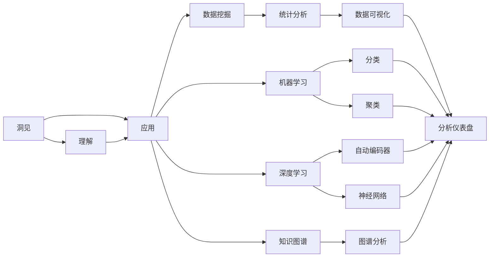
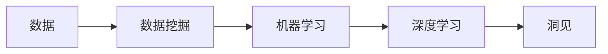
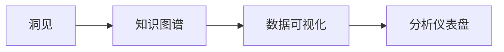
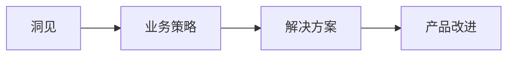
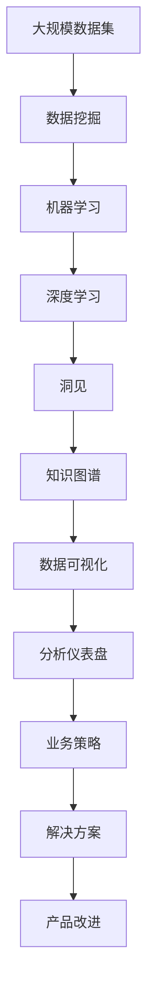

                 

# 洞见的价值：从理解到应用

> 关键词：洞见、理解、应用、深度学习、机器学习、知识图谱、数据挖掘、分析

## 1. 背景介绍

### 1.1 问题由来
在当今信息爆炸的时代，数据已经不再是稀缺资源，而如何从数据中提取有价值的洞见成为了一个核心挑战。数据挖掘、机器学习、深度学习等技术为解决这一问题提供了强大的工具。然而，尽管技术手段愈加成熟，许多企业和组织仍然难以将数据转化为洞见，从而驱动决策和改进。原因在于，缺乏对数据和模型的深刻理解，以及如何将这些洞见有效应用到实际业务中的方法。

### 1.2 问题核心关键点
本文旨在探讨如何通过理解和应用数据洞见，驱动业务决策和优化。具体而言，我们将在以下几个方面展开讨论：

1. **洞见提取**：介绍常见的数据挖掘和机器学习方法，以及如何通过这些方法从数据中提取洞见。
2. **洞见理解**：分析如何通过数据分析和数据可视化技术，深入理解这些洞见背后的逻辑和关系。
3. **洞见应用**：探讨如何将洞见转化为可行的业务策略和解决方案。

### 1.3 问题研究意义
理解并应用数据洞见，对于驱动业务决策和优化具有重要意义：

1. **数据驱动决策**：基于数据洞见的决策更具科学性和可靠性。
2. **优化业务流程**：通过洞见识别瓶颈和改进点，优化业务流程。
3. **提升客户体验**：利用洞见优化产品和服务，提升客户满意度。
4. **防范风险**：通过洞见分析潜在风险，提前采取措施。
5. **创造商业价值**：洞见可以转化为新的商业模式和创新点。

## 2. 核心概念与联系

### 2.1 核心概念概述

为更好地理解如何将数据洞见应用于实际业务，本节将介绍几个密切相关的核心概念：

- **洞见**：从数据中提取的具有较高价值的信息或知识。可以是统计规律、关联关系、趋势等。
- **理解**：对洞见背后原因、逻辑、关系等的解释和分析。理解帮助决策者更好地应用洞见。
- **应用**：将洞见转化为具体的业务策略、解决方案或产品改进措施。
- **数据挖掘**：从大规模数据集中自动发现知识、模式和关系的过程。
- **机器学习**：利用算法和模型自动分析数据，提取洞见。
- **深度学习**：一种特殊的机器学习方法，通过多层神经网络模型进行特征提取和洞见发现。
- **知识图谱**：将实体和关系表示为图形结构，用于知识表示和关系分析。
- **数据可视化**：将数据转换为图形或图表，帮助理解数据洞见。
- **分析**：对数据和洞见进行深入分析，发现更深层次的规律和关联。

这些核心概念之间的逻辑关系可以通过以下Mermaid流程图来展示：



这个流程图展示了从洞见提取、理解到应用的核心流程：

1. 通过数据挖掘、机器学习和深度学习等方法，从数据中提取洞见。
2. 对洞见进行理解和分析，通过知识图谱、数据可视化和分析仪表盘等技术，深入理解洞见的背景和逻辑。
3. 将洞见转化为具体的业务应用，通过数据挖掘、机器学习和深度学习等方法，进一步优化和改进。

### 2.2 概念间的关系

这些核心概念之间存在着紧密的联系，形成了洞见提取和应用的完整生态系统。下面我们通过几个Mermaid流程图来展示这些概念之间的关系。

#### 2.2.1 洞见提取流程



这个流程图展示了从数据挖掘、机器学习到深度学习的过程，以及最终的洞见提取。

#### 2.2.2 洞见理解流程



这个流程图展示了如何通过知识图谱、数据可视化和分析仪表盘等技术，深入理解洞见。

#### 2.2.3 洞见应用流程



这个流程图展示了如何将洞见转化为具体的业务策略、解决方案或产品改进措施。

### 2.3 核心概念的整体架构

最后，我们用一个综合的流程图来展示这些核心概念在大数据洞见提取和应用过程中的整体架构：



这个综合流程图展示了从大规模数据集挖掘洞见，到最终应用改进的完整过程。通过对这些核心概念的深入理解和灵活应用，我们可以更好地将数据洞见转化为实际业务价值。

## 3. 核心算法原理 & 具体操作步骤
### 3.1 算法原理概述

从数据中提取洞见，本质上是一个从数据到模型的过程。常见的算法包括数据挖掘、机器学习和深度学习等。这些算法通过不同的方式，从数据中自动发现知识、模式和关联关系。

具体而言，数据挖掘和机器学习算法主要基于统计分析和模型训练，通过构建数学模型来提取洞见。而深度学习算法则通过多层神经网络，自动提取数据中的高级特征和洞见。

### 3.2 算法步骤详解

以下详细讲解几种常见的洞见提取算法：

**Step 1: 数据预处理**

- 数据清洗：去除异常值、缺失值等噪声数据。
- 数据标准化：将数据转换为标准格式，如归一化、标准化等。
- 数据采样：对数据进行随机采样，处理样本不均衡问题。

**Step 2: 特征工程**

- 特征选择：选择最相关、最具有代表性和区分度的特征。
- 特征提取：通过算法自动提取高级特征，如PCA、LDA等。
- 特征转换：将原始特征转换为更适合模型处理的格式，如独热编码、one-hot编码等。

**Step 3: 模型训练**

- 选择合适的模型：根据数据类型和问题类型，选择合适的模型。
- 设定训练参数：设置学习率、迭代次数、批大小等训练参数。
- 训练模型：使用训练数据集训练模型，最小化损失函数。

**Step 4: 模型评估**

- 选择评估指标：根据问题类型，选择合适的评估指标，如准确率、召回率、F1分数等。
- 评估模型：使用验证集或测试集评估模型性能。
- 调整模型：根据评估结果，调整模型参数，提升模型性能。

**Step 5: 洞见提取**

- 提取洞见：使用训练好的模型，从数据中自动提取洞见。
- 分析洞见：对提取的洞见进行分析和理解。
- 应用洞见：将洞见转化为具体的业务策略、解决方案或产品改进措施。

### 3.3 算法优缺点

数据挖掘、机器学习和深度学习算法各有优缺点：

- **数据挖掘**：优点是易于理解和实现，处理大规模数据能力强；缺点是依赖数据质量和特征选择，难以发现复杂模式。
- **机器学习**：优点是自动化程度高，适用于各种类型的数据；缺点是对数据量和特征要求较高，容易过拟合。
- **深度学习**：优点是能够自动提取高级特征，处理非结构化数据能力强；缺点是模型复杂，计算资源要求高。

### 3.4 算法应用领域

数据挖掘、机器学习和深度学习算法在众多领域得到广泛应用，如：

- **金融**：通过分析交易数据，发现市场趋势和风险。
- **医疗**：通过分析病历数据，预测疾病发展和治疗效果。
- **电商**：通过分析用户行为数据，推荐个性化商品。
- **营销**：通过分析客户数据，制定精准营销策略。
- **物流**：通过分析运输数据，优化配送路线和提高效率。
- **安全**：通过分析网络数据，识别潜在威胁和入侵。
- **教育**：通过分析学生数据，提高教学质量和个性化学习体验。
- **社交**：通过分析用户互动数据，改进社交平台内容和算法。

## 4. 数学模型和公式 & 详细讲解 & 举例说明

### 4.1 数学模型构建

假设我们有一组数据集 $D=\{(x_i,y_i)\}_{i=1}^N$，其中 $x_i$ 为输入特征，$y_i$ 为输出标签。我们的目标是从数据中提取一个模型 $f(x)$，使得 $f(x)$ 能够最小化预测错误，即：

$$
\min_{f} \frac{1}{N} \sum_{i=1}^N \ell(f(x_i),y_i)
$$

其中 $\ell$ 为损失函数，常用的包括均方误差损失、交叉熵损失等。

### 4.2 公式推导过程

以线性回归为例，假设模型为 $f(x) = \theta^T x + b$，其中 $\theta$ 为权重向量，$b$ 为偏置项。我们的目标是找到最优的 $\theta$ 和 $b$，使得模型能够最小化均方误差损失：

$$
\ell(f(x_i),y_i) = \frac{1}{2} (y_i - f(x_i))^2
$$

带入损失函数，得到最小化问题：

$$
\min_{\theta,b} \frac{1}{N} \sum_{i=1}^N (y_i - \theta^T x_i - b)^2
$$

通过对上式求导并令导数为零，可以得到最优解：

$$
\theta = (X^TX)^{-1}X^Ty
$$

其中 $X=[x_1^T,x_2^T,...,x_N^T]$ 为输入特征矩阵，$y=[y_1,y_2,...,y_N]^T$ 为输出标签向量。

### 4.3 案例分析与讲解

假设我们有一组股票价格数据，目标是预测未来的价格走势。我们使用线性回归模型进行预测，步骤如下：

1. **数据预处理**：将股票价格数据转换为标准化格式，去除异常值和缺失值。
2. **特征工程**：选择历史价格、成交量等特征，构建特征矩阵 $X$。
3. **模型训练**：使用历史价格数据训练线性回归模型，得到最优的 $\theta$ 和 $b$。
4. **模型评估**：使用验证集评估模型性能，根据评估结果调整模型参数。
5. **洞见提取**：使用训练好的模型，对未来股票价格进行预测，得到洞见。
6. **理解洞见**：分析预测结果的分布和趋势，理解背后的市场规律。
7. **应用洞见**：根据洞见，制定投资策略和风险控制措施。

## 5. 项目实践：代码实例和详细解释说明

### 5.1 开发环境搭建

在进行洞见提取实践前，我们需要准备好开发环境。以下是使用Python进行PyTorch开发的环境配置流程：

1. 安装Anaconda：从官网下载并安装Anaconda，用于创建独立的Python环境。

2. 创建并激活虚拟环境：
```bash
conda create -n pytorch-env python=3.8 
conda activate pytorch-env
```

3. 安装PyTorch：根据CUDA版本，从官网获取对应的安装命令。例如：
```bash
conda install pytorch torchvision torchaudio cudatoolkit=11.1 -c pytorch -c conda-forge
```

4. 安装各类工具包：
```bash
pip install numpy pandas scikit-learn matplotlib tqdm jupyter notebook ipython
```

完成上述步骤后，即可在`pytorch-env`环境中开始洞见提取实践。

### 5.2 源代码详细实现

下面我们以线性回归为例，给出使用PyTorch进行线性回归模型的代码实现。

首先，定义线性回归模型：

```python
import torch
from torch import nn
import torch.optim as optim

class LinearRegression(nn.Module):
    def __init__(self, input_dim):
        super(LinearRegression, self).__init__()
        self.linear = nn.Linear(input_dim, 1)
    
    def forward(self, x):
        return self.linear(x)
```

然后，定义数据集和模型训练函数：

```python
from torch.utils.data import TensorDataset, DataLoader
import pandas as pd

# 数据预处理和标准化
data = pd.read_csv('price_data.csv')
X = data.iloc[:, :-1].values
y = data.iloc[:, -1].values
X = (X - X.mean()) / X.std()

# 定义训练集和验证集
train_X, train_y = X[:800], y[:800]
val_X, val_y = X[800:], y[800:]

# 构建数据集
train_dataset = TensorDataset(torch.Tensor(train_X), torch.Tensor(train_y))
val_dataset = TensorDataset(torch.Tensor(val_X), torch.Tensor(val_y))

# 定义模型
model = LinearRegression(X.shape[1])
optimizer = optim.SGD(model.parameters(), lr=0.01)

# 定义损失函数
loss_fn = nn.MSELoss()

# 训练函数
def train(model, train_dataset, val_dataset, epochs=100, batch_size=32):
    model.train()
    for epoch in range(epochs):
        train_loader = DataLoader(train_dataset, batch_size=batch_size, shuffle=True)
        val_loader = DataLoader(val_dataset, batch_size=batch_size)
        train_loss = 0
        val_loss = 0
        for batch in train_loader:
            inputs, labels = batch
            optimizer.zero_grad()
            outputs = model(inputs)
            loss = loss_fn(outputs, labels)
            loss.backward()
            optimizer.step()
            train_loss += loss.item()
        with torch.no_grad():
            val_loss = loss_fn(model(val_dataset[0].data), val_dataset[1].data)
        print(f'Epoch {epoch+1}, train loss: {train_loss/len(train_loader):.4f}, val loss: {val_loss:.4f}')
```

最后，启动训练流程并在验证集上评估：

```python
train(model, train_dataset, val_dataset)
```

以上就是使用PyTorch进行线性回归模型的代码实现。可以看到，通过PyTorch库，我们可以用相对简洁的代码完成线性回归模型的训练和评估。

### 5.3 代码解读与分析

让我们再详细解读一下关键代码的实现细节：

**LinearRegression类**：
- `__init__`方法：初始化模型参数。
- `forward`方法：前向传播计算输出。

**train函数**：
- 对数据进行标准化处理，构建训练集和验证集。
- 定义模型和优化器，选择均方误差损失函数。
- 定义训练循环，在每个epoch内更新模型参数。
- 使用训练集数据和验证集数据进行训练和评估，输出每个epoch的训练和验证损失。

**训练流程**：
- 定义总的epoch数和batch size，开始循环迭代
- 每个epoch内，先在训练集上训练，输出训练损失
- 在验证集上评估，输出验证损失
- 所有epoch结束后，评估模型性能

可以看到，通过PyTorch库，我们可以方便地构建和训练线性回归模型。实际应用中，我们还可以使用更复杂的模型，如神经网络、支持向量机、随机森林等，来进行洞见提取。

## 6. 实际应用场景
### 6.1 金融风险管理

金融行业需要实时监测市场动向，识别潜在风险。通过数据分析和机器学习模型，可以从历史交易数据中提取洞见，预测市场趋势和风险，提前采取措施。例如，使用线性回归模型预测股票价格走势，使用逻辑回归模型识别信用风险，使用支持向量机分类模型识别交易异常等。

### 6.2 医疗诊断和治疗优化

医疗行业需要高效利用患者数据，进行疾病诊断和治疗优化。通过数据分析和机器学习模型，可以从患者病历和基因数据中提取洞见，预测疾病发展和治疗效果，推荐个性化治疗方案。例如，使用随机森林模型预测疾病发展路径，使用神经网络模型分析基因数据，使用支持向量机分类模型识别病人类型等。

### 6.3 电商个性化推荐

电商行业需要根据用户行为数据，提供个性化推荐。通过数据分析和机器学习模型，可以从用户浏览、购买数据中提取洞见，推荐符合用户兴趣的商品。例如，使用协同过滤算法推荐商品，使用神经网络模型分析用户兴趣，使用支持向量机分类模型识别用户类型等。

### 6.4 物流路径优化

物流行业需要优化配送路径，提高运输效率。通过数据分析和机器学习模型，可以从运输数据中提取洞见，优化配送路径和提高运输效率。例如，使用神经网络模型分析交通状况，使用支持向量机分类模型识别配送区域，使用线性回归模型预测运输时间等。

## 7. 工具和资源推荐
### 7.1 学习资源推荐

为了帮助开发者系统掌握洞见提取的理论基础和实践技巧，这里推荐一些优质的学习资源：

1. 《Python机器学习》系列书籍：由知名机器学习专家撰写，深入浅出地介绍了机器学习的基本概念和经典模型，包括数据挖掘和特征工程等。

2. 《深度学习》课程：斯坦福大学开设的深度学习明星课程，有Lecture视频和配套作业，带你入门深度学习领域的基本概念和经典模型。

3. 《机器学习实战》书籍：由实战经验丰富的数据科学家撰写，介绍了机器学习在各种应用场景中的应用，包括数据挖掘、分类、聚类等。

4. 《TensorFlow实战Google深度学习》书籍：由Google官方支持，详细介绍了TensorFlow的使用方法和实战案例，包括数据预处理、模型训练和优化等。

5. Kaggle竞赛：Kaggle是全球最大的数据科学竞赛平台，参与Kaggle竞赛可以学习到前沿数据挖掘和机器学习技术，与全球数据科学家交流。

通过对这些资源的学习实践，相信你一定能够快速掌握洞见提取的精髓，并用于解决实际的业务问题。

### 7.2 开发工具推荐

高效的开发离不开优秀的工具支持。以下是几款用于洞见提取开发的常用工具：

1. PyTorch：基于Python的开源深度学习框架，灵活动态的计算图，适合快速迭代研究。大部分预训练语言模型都有PyTorch版本的实现。

2. TensorFlow：由Google主导开发的开源深度学习框架，生产部署方便，适合大规模工程应用。同样有丰富的预训练语言模型资源。

3. Scikit-learn：Python数据科学库，提供了各种常用的机器学习算法，适合快速原型开发。

4. Jupyter Notebook：基于浏览器的交互式开发环境，支持多种编程语言和数据可视化库。

5. Keras：高层次的深度学习库，提供了简单易用的API，适合快速原型开发。

合理利用这些工具，可以显著提升洞见提取任务的开发效率，加快创新迭代的步伐。

### 7.3 相关论文推荐

大语言模型和微调技术的发展源于学界的持续研究。以下是几篇奠基性的相关论文，推荐阅读：

1. "Statistical Learning"（《统计学习》）：经典机器学习教材，介绍了各种机器学习算法的原理和应用。

2. "Deep Learning"（《深度学习》）：深度学习领域的经典教材，详细介绍了神经网络、卷积神经网络、循环神经网络等。

3. "Pattern Recognition and Machine Learning"（《模式识别与机器学习》）：机器学习领域的权威教材，介绍了机器学习的各种基本概念和算法。

4. "Data Science for Business"（《商业数据科学》）：将数据科学应用到商业决策中的实用指南，适合商业数据分析应用。

5. "Understanding Machine Learning: From Theory to Algorithms"（《理解机器学习：从理论到算法》）：机器学习领域的入门书籍，介绍了机器学习的基本理论和算法。

这些论文代表了大语言模型微调技术的发展脉络。通过学习这些前沿成果，可以帮助研究者把握学科前进方向，激发更多的创新灵感。

除上述资源外，还有一些值得关注的前沿资源，帮助开发者紧跟洞见提取技术的最新进展，例如：

1. arXiv论文预印本：人工智能领域最新研究成果的发布平台，包括大量尚未发表的前沿工作，学习前沿技术的必读资源。

2. 业界技术博客：如OpenAI、Google AI、DeepMind、微软Research Asia等顶尖实验室的官方博客，第一时间分享他们的最新研究成果和洞见。

3. 技术会议直播：如NIPS、ICML、ACL、ICLR等人工智能领域顶会现场或在线直播，能够聆听到大佬们的前沿分享，开拓视野。

4. GitHub热门项目：在GitHub上Star、Fork数最多的数据挖掘和机器学习相关项目，往往代表了该技术领域的发展趋势和最佳实践，值得去学习和贡献。

5. 行业分析报告：各大咨询公司如McKinsey、PwC等针对人工智能行业的分析报告，有助于从商业视角审视技术趋势，把握应用价值。

总之，对于洞见提取技术的学习和实践，需要开发者保持开放的心态和持续学习的意愿。多关注前沿资讯，多动手实践，多思考总结，必将收获满满的成长收益。

## 8. 总结：未来发展趋势与挑战

### 8.1 总结

本文对如何通过理解和应用数据洞见，驱动业务决策和优化进行了全面系统的介绍。首先阐述了洞见提取、理解、应用的全流程，明确了洞见在驱动决策和优化中的独特价值。其次，详细讲解了数据挖掘、机器学习和深度学习等核心算法，以及具体的步骤和实现方法。同时，本文还探讨了洞见在金融、医疗、电商、物流等众多领域的实际应用，展示了洞见提取技术的广阔前景。此外，本文精选了洞见提取技术的各类学习资源，力求为读者提供全方位的技术指引。

通过本文的系统梳理，可以看到，数据洞见提取技术正在成为数据科学和人工智能的重要范式，极大地拓展了数据应用的范围和深度，为业务决策和优化提供了科学依据。未来，随着技术手段的不断进步，数据洞见提取将更加自动化、智能化，逐步成为企业核心竞争力的重要组成部分。

### 8.2 未来发展趋势

展望未来，数据洞见提取技术将呈现以下几个发展趋势：

1. **自动化程度提升**：随着机器学习算法的进步，数据洞见提取将更加自动化和智能化，需要人工干预的部分将减少。
2. **多模态融合**：将数据挖掘和机器学习应用于多模态数据，如文本、图像、语音等，提升洞见提取的全面性和准确性。
3. **实时性增强**：通过流式数据处理和大数据技术，实现实时数据洞见提取和分析。
4. **联邦学习**：通过分布式计算和隐私保护技术，在保证数据隐私的前提下，实现多源数据的洞见提取。
5. **知识图谱和语义网**：结合知识图谱和语义网技术，提升数据洞见的语义理解和知识推理能力。
6. **跨领域应用**：将数据洞见提取技术应用于更多领域，如金融、医疗、教育、政府等，推动技术落地应用。
7. **人机协同**：结合人类专家的经验和知识，提升数据洞见的可信度和应用效果。
8. **伦理和法律合规**：在数据洞见提取过程中，重视数据隐私和法律合规，确保技术应用的安全性和合法性。

### 8.3 面临的挑战

尽管数据洞见提取技术已经取得了瞩目成就，但在迈向更加智能化、普适化应用的过程中，它仍面临着诸多挑战：

1. **数据质量问题**：数据噪声、不均衡、缺失等问题严重影响洞见提取的准确性。
2. **算法复杂度**：复杂算法需要高性能计算资源，可能带来计算成本和部署难度。
3. **模型解释性**：深度学习模型通常是"黑盒"，缺乏可解释性，难以理解和调试。
4. **数据隐私问题**：数据隐私和合规性要求高，数据共享和合作难度大。
5. **多源数据整合**：多源数据整合复杂，需要处理数据异构性和不一致性问题。
6. **业务需求变化**：业务需求变化快，洞见提取模型需要快速更新和优化。

### 8.4 研究展望

面对数据洞见提取技术所面临的挑战，未来的研究需要在以下几个方面寻求新的突破：

1. **数据增强技术**：利用数据增强技术，提升数据质量，降低噪声和缺失。
2. **自动化算法设计**：设计更加自动化、智能化的算法，降低人工干预。
3. **模型可解释性**：结合符号化的知识图谱和语义网技术，提升模型的可解释性。
4. **分布式计算**：结合大数据和云计算技术，实现分布式计算和实时数据处理。
5. **隐私保护技术**：结合联邦学习和差分隐私技术，保护数据隐私和合规性。
6. **

