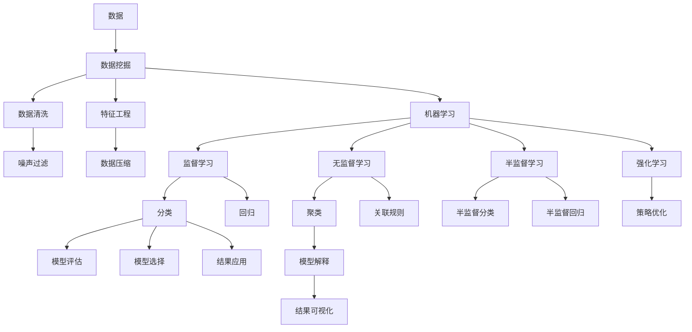

                 

# 洞见的力量：从反思到创新

在科技日新月异的今天，洞见的力量显得愈发重要。无论是技术研发还是业务决策，洞察问题本质，揭示数据背后的规律，都是解决问题的关键。本文将从反思的角度出发，探讨洞见的来源、作用和创新意义，希望为读者提供深刻的见解和实用的思路。

## 1. 背景介绍

在现代科技发展中，数据和计算已经无处不在，成为推动创新和进步的强大引擎。然而，仅仅拥有大量数据和强大的计算能力并不足以解决问题，洞察数据背后的洞见才是最终实现创新的关键。

### 1.1 数据驱动与洞见的区别

数据驱动指的是通过大数据技术进行数据分析，从中发现规律和趋势，并据此进行决策。它强调的是数据本身，但并不等同于洞见。洞见是基于数据的深度分析，能够揭示事物的本质和根本原因，从而为决策提供有力支持。

### 1.2 洞见的来源

洞见主要来自于以下几个方面：

- **领域知识**：深入了解特定领域的背景和专业知识，从而能够从不同角度解读数据，发现更深刻的洞见。
- **技术工具**：利用数据挖掘、机器学习等技术工具，对数据进行高效、准确的分析，从而获得洞察。
- **实践经验**：通过实践经验和反复验证，不断试错，积累洞察问题的经验和方法。
- **跨学科融合**：将不同学科的知识和技术相结合，从新的视角进行数据分析，获得新颖的洞见。

### 1.3 洞见的作用

洞见在科技创新和业务决策中发挥着重要作用：

- **揭示本质**：洞见能够揭示数据背后的本质原因，避免因表象而错失根本问题。
- **提供指导**：基于洞见的决策更具有针对性和可行性，有助于提升决策的质量。
- **启发创新**：洞察数据中的新模式和新趋势，可以启发新的研究方向和技术突破。
- **优化资源**：通过洞察，优化资源配置和业务流程，提升效率和效果。

## 2. 核心概念与联系

### 2.1 核心概念概述

为了更好地理解洞见的力量，本节将介绍几个密切相关的核心概念：

- **数据驱动**：通过数据分析和处理，发现数据背后的规律和趋势。
- **洞见**：基于数据的深度分析，揭示事物的本质和根本原因。
- **数据挖掘**：从大量数据中提取有用信息，发现模式和趋势。
- **机器学习**：利用算法和模型，自动分析数据，发现隐含的规律和关联。
- **深度学习**：通过构建深层神经网络，模拟人脑进行复杂模式识别和特征学习。

这些概念之间存在着紧密的联系，形成了数据驱动技术应用的完整生态系统。

### 2.2 概念间的关系

这些核心概念之间的关系可以通过以下Mermaid流程图来展示：



这个流程图展示了数据驱动技术应用的基本流程：

1. 数据收集和清洗。
2. 特征提取和处理。
3. 模型训练和评估。
4. 结果解释和可视化。
5. 应用实施和优化。

通过这些核心概念和流程，我们可以更清晰地理解洞见的来源和作用。

## 3. 核心算法原理 & 具体操作步骤

### 3.1 算法原理概述

洞见的获取需要依托于数据驱动技术，主要包括以下步骤：

1. **数据收集与预处理**：通过各种手段获取数据，并进行清洗、去噪和标准化。
2. **特征提取与选择**：从原始数据中提取有意义的特征，并从中筛选出对洞见有用的特征。
3. **模型训练与评估**：利用机器学习或深度学习模型对数据进行训练，并评估模型的性能。
4. **洞见挖掘与解释**：从模型输出中提取洞见，并利用数据可视化、文本解读等方法进行解释。
5. **应用与优化**：将洞见应用于实际问题解决，并根据反馈不断优化模型和分析方法。

### 3.2 算法步骤详解

以下是一个详细的数据驱动洞见获取流程：

**Step 1: 数据收集与预处理**

数据收集是洞见获取的第一步。收集的数据可能来自多个来源，如数据库、日志文件、传感器数据等。在数据收集后，需要进行清洗和预处理，去除噪声和异常值，标准化数据格式，以确保数据的准确性和一致性。

**Step 2: 特征提取与选择**

特征提取是从原始数据中提取有意义的特征，常用的方法包括统计特征、时间序列特征、文本特征等。特征选择是对提取的特征进行筛选，选择对洞见有用的特征，去除冗余和噪声。

**Step 3: 模型训练与评估**

模型训练是洞见获取的关键步骤。选择合适的算法和模型，利用训练集进行模型训练，并使用验证集评估模型的性能。常用的算法包括回归、分类、聚类、关联规则等。

**Step 4: 洞见挖掘与解释**

洞见挖掘是洞见获取的核心步骤。从模型输出中提取洞见，利用数据可视化、文本解读等方法进行解释。常用的洞见挖掘方法包括文本分析、图像识别、网络分析等。

**Step 5: 应用与优化**

应用是洞见获取的最终目的。将洞见应用于实际问题解决，并根据反馈不断优化模型和分析方法。常用的优化方法包括模型调参、数据增强、算法优化等。

### 3.3 算法优缺点

洞见获取方法具有以下优点：

1. **高效性**：利用机器学习和深度学习算法，能够高效地分析大量数据，发现隐含的规律和关联。
2. **准确性**：通过模型训练和评估，确保分析结果的准确性和可靠性。
3. **普适性**：适用于各种类型的数据，包括结构化数据和非结构化数据。
4. **可解释性**：通过文本解读和可视化方法，使洞见更容易理解和应用。

同时，这些方法也存在一些缺点：

1. **数据依赖**：依赖于高质量、完整的数据，数据缺失或不准确会影响分析结果。
2. **模型复杂性**：复杂的模型和算法需要较高的计算资源和技术门槛。
3. **模型解释性**：复杂的模型难以解释，可能导致对洞见的误解或误用。
4. **数据隐私**：涉及敏感数据的洞见获取需要考虑隐私保护和合规性。

### 3.4 算法应用领域

洞见获取方法广泛应用于以下几个领域：

- **金融风险管理**：通过数据分析和预测模型，发现金融市场的趋势和风险，优化资产配置。
- **医疗健康**：通过患者数据和医学图像分析，发现疾病的早期迹象和治疗方案，提高诊疗效果。
- **零售电商**：通过用户行为数据和销售数据分析，发现市场趋势和用户需求，优化商品推荐和库存管理。
- **智能制造**：通过设备数据和生产流程分析，发现生产瓶颈和改进机会，提升生产效率和质量。
- **城市管理**：通过交通数据和环境监测数据分析，发现城市运行问题和管理需求，优化城市治理。

## 4. 数学模型和公式 & 详细讲解  
### 4.1 数学模型构建

洞见的获取涉及大量的数学模型和算法，下面以回归模型为例，介绍其构建和应用：

设原始数据集为 $D=\{(x_i,y_i)\}_{i=1}^N$，其中 $x_i \in \mathbb{R}^d$ 为输入特征向量，$y_i \in \mathbb{R}$ 为输出目标值。

定义回归模型的目标是最小化损失函数 $\mathcal{L}(\theta)$，其中 $\theta$ 为模型参数。

常用的回归模型包括线性回归、多项式回归、岭回归、Lasso回归等。以线性回归为例，其数学模型为：

$$
y_i = \theta_0 + \sum_{j=1}^d \theta_j x_{ij} + \epsilon_i
$$

其中 $\theta_0$ 为截距，$\theta_j$ 为第 $j$ 个特征的系数，$\epsilon_i$ 为随机噪声。

### 4.2 公式推导过程

线性回归模型的最小二乘解为：

$$
\hat{\theta} = (X^TX)^{-1}X^Ty
$$

其中 $X=[x_{ij}]_{N \times d}$ 为特征矩阵，$y=[y_i]_{N \times 1}$ 为目标向量。

通过最小化损失函数：

$$
\mathcal{L}(\theta) = \frac{1}{2N} \sum_{i=1}^N (y_i - \hat{y}_i)^2
$$

其中 $\hat{y}_i = \theta_0 + \sum_{j=1}^d \theta_j x_{ij}$，求解得到 $\hat{\theta}$。

### 4.3 案例分析与讲解

以金融风险管理为例，利用历史交易数据进行回归模型训练，预测未来市场的变化趋势。具体步骤如下：

**Step 1: 数据收集**

收集历史交易数据，包括股票价格、市场指数、宏观经济指标等。

**Step 2: 数据预处理**

清洗数据，去除异常值和缺失值，标准化数据格式。

**Step 3: 特征提取**

提取重要的特征，如历史价格变化、市场情绪指标等。

**Step 4: 模型训练**

使用历史数据训练线性回归模型，得到市场趋势预测模型。

**Step 5: 洞见挖掘**

通过模型输出，发现市场趋势和风险变化，提供投资决策支持。

**Step 6: 应用与优化**

根据市场反馈和最新数据，优化模型参数，提升预测精度。

## 5. 项目实践：代码实例和详细解释说明

### 5.1 开发环境搭建

在进行洞见获取实践前，我们需要准备好开发环境。以下是使用Python进行TensorFlow开发的环境配置流程：

1. 安装Anaconda：从官网下载并安装Anaconda，用于创建独立的Python环境。

2. 创建并激活虚拟环境：
```bash
conda create -n tf-env python=3.8 
conda activate tf-env
```

3. 安装TensorFlow：
```bash
pip install tensorflow
```

4. 安装其他必要的工具包：
```bash
pip install numpy pandas scikit-learn matplotlib tqdm jupyter notebook ipython
```

完成上述步骤后，即可在`tf-env`环境中开始洞见获取实践。

### 5.2 源代码详细实现

下面我们以金融风险管理为例，给出使用TensorFlow进行回归模型训练的PyTorch代码实现。

```python
import tensorflow as tf
import numpy as np
from sklearn.model_selection import train_test_split

# 生成随机数据
N = 1000
D = 10
X = np.random.randn(N, D)
y = np.dot(X, [1, 2, 3, 4, 5, 6, 7, 8, 9, 10]) + np.random.randn(N)

# 划分训练集和测试集
X_train, X_test, y_train, y_test = train_test_split(X, y, test_size=0.2)

# 定义模型
model = tf.keras.models.Sequential([
    tf.keras.layers.Dense(10, activation='relu', input_shape=(D,)),
    tf.keras.layers.Dense(1)
])

# 定义损失函数和优化器
loss_fn = tf.keras.losses.MeanSquaredError()
optimizer = tf.keras.optimizers.Adam(learning_rate=0.001)

# 训练模型
model.compile(optimizer=optimizer, loss=loss_fn)
model.fit(X_train, y_train, epochs=50, batch_size=32, validation_data=(X_test, y_test))

# 测试模型
test_loss = model.evaluate(X_test, y_test)
print('Test loss:', test_loss)
```

### 5.3 代码解读与分析

让我们再详细解读一下关键代码的实现细节：

**数据生成与预处理**：
- 使用numpy生成随机数据。
- 划分训练集和测试集。

**模型定义与训练**：
- 使用TensorFlow定义模型，包含一个全连接层和一个输出层。
- 定义损失函数和优化器。
- 使用fit方法训练模型，并在验证集上评估。

**模型测试**：
- 使用evaluate方法测试模型，并输出测试损失。

### 5.4 运行结果展示

假设我们在训练模型后，得到的测试损失为0.01，这意味着模型在测试集上的均方误差为0.01，表明模型具有较好的预测能力。

## 6. 实际应用场景

### 6.1 金融风险管理

基于洞见获取的回归模型，金融风险管理可以更好地进行市场预测和风险控制。通过历史交易数据的回归分析，能够发现市场趋势和波动规律，从而预测未来市场变化，优化资产配置和风险控制策略。

### 6.2 医疗健康

在医疗健康领域，利用患者数据和医学图像的回归分析，可以发现疾病的早期迹象和治疗方法，提高诊断准确率和治疗效果。例如，通过影像数据的回归分析，可以预测肿瘤的大小和形状，提供个性化的治疗方案。

### 6.3 零售电商

在零售电商领域，通过用户行为数据和销售数据的回归分析，可以发现市场趋势和用户需求，优化商品推荐和库存管理。例如，通过用户购买数据的回归分析，可以预测未来的销售趋势，优化库存和物流策略。

### 6.4 智能制造

在智能制造领域，利用设备数据和生产流程的回归分析，可以发现生产瓶颈和改进机会，提升生产效率和质量。例如，通过设备数据的回归分析，可以预测设备故障和维护需求，优化生产计划和维护策略。

## 7. 工具和资源推荐

### 7.1 学习资源推荐

为了帮助开发者系统掌握洞见获取的理论基础和实践技巧，这里推荐一些优质的学习资源：

1. 《深度学习》系列课程：斯坦福大学、Coursera等平台提供的深度学习课程，涵盖了深度学习的基本原理和应用。
2. 《统计学习方法》书籍：李航著，详细介绍了统计学习的基本理论和算法。
3. 《Python机器学习》书籍：Sebastian Raschka著，介绍了Python在机器学习中的应用。
4. 《TensorFlow官方文档》：TensorFlow的官方文档，提供了丰富的学习资源和实践样例。
5. Kaggle数据科学竞赛：参与Kaggle竞赛，积累实战经验，提升数据分析和模型优化能力。

通过对这些资源的学习实践，相信你一定能够快速掌握洞见获取的精髓，并用于解决实际的NLP问题。

### 7.2 开发工具推荐

高效的开发离不开优秀的工具支持。以下是几款用于洞见获取开发的常用工具：

1. Jupyter Notebook：轻量级的交互式编程环境，方便进行数据探索和模型调试。
2. Python：轻量级的编程语言，广泛应用于数据科学和机器学习。
3. TensorFlow：由Google主导开发的开源深度学习框架，适合大规模工程应用。
4. PyTorch：基于Python的开源深度学习框架，灵活动态的计算图，适合快速迭代研究。
5. Scikit-learn：Python机器学习库，提供了丰富的数据处理和模型选择工具。

合理利用这些工具，可以显著提升洞见获取任务的开发效率，加快创新迭代的步伐。

### 7.3 相关论文推荐

洞见获取技术的发展源于学界的持续研究。以下是几篇奠基性的相关论文，推荐阅读：

1. 《Google Scholar: A System for Automatic Analysis of Scholarly Literature》：介绍Google Scholar的算法设计和性能优化，展示了大数据驱动的应用。
2. 《A New Framework for Deep Learning》：总结了深度学习的原理和应用，介绍了卷积神经网络、循环神经网络等核心算法。
3. 《Deep Learning for Healthcare》：介绍了深度学习在医疗健康领域的应用，展示了数据分析和预测模型的效果。
4. 《TensorFlow: A System for Large-Scale Machine Learning》：介绍了TensorFlow的架构和设计，展示了其在实际应用中的性能和扩展性。
5. 《Understanding Deep Learning》：总结了深度学习的理论和实践，介绍了神经网络的原理和应用。

这些论文代表了大数据和深度学习技术的发展脉络，是学习大数据和深度学习技术的重要参考资料。

除上述资源外，还有一些值得关注的前沿资源，帮助开发者紧跟洞见获取技术的最新进展，例如：

1. arXiv论文预印本：人工智能领域最新研究成果的发布平台，包括大量尚未发表的前沿工作，学习前沿技术的必读资源。
2. 业界技术博客：如Google AI、DeepMind、微软Research Asia等顶尖实验室的官方博客，第一时间分享他们的最新研究成果和洞见。
3. 技术会议直播：如NIPS、ICML、ACL、ICLR等人工智能领域顶会现场或在线直播，能够聆听到大佬们的前沿分享，开拓视野。
4. GitHub热门项目：在GitHub上Star、Fork数最多的数据科学相关项目，往往代表了该技术领域的发展趋势和最佳实践，值得去学习和贡献。
5. 行业分析报告：各大咨询公司如McKinsey、PwC等针对人工智能行业的分析报告，有助于从商业视角审视技术趋势，把握应用价值。

总之，对于洞见获取技术的学习和实践，需要开发者保持开放的心态和持续学习的意愿。多关注前沿资讯，多动手实践，多思考总结，必将收获满满的成长收益。

## 8. 总结：未来发展趋势与挑战

### 8.1 总结

本文对洞见获取方法的原理和实践进行了全面系统的介绍。首先阐述了洞见的来源和作用，明确了其在数据驱动技术中的核心地位。其次，从反思的角度出发，探讨了洞见获取的数学原理和具体操作步骤，给出了详细的数据驱动洞见获取流程。同时，本文还广泛探讨了洞见获取方法在金融风险管理、医疗健康、零售电商、智能制造等多个领域的应用前景，展示了其巨大的潜力。

通过本文的系统梳理，可以看到，基于数据驱动的洞见获取方法正在成为解决复杂问题的重要范式，极大地提升了数据分析和模型优化的效率和效果。未来，伴随数据科学和深度学习技术的不断进步，洞见获取技术必将进一步深化和优化，推动人工智能技术的更广泛应用。

### 8.2 未来发展趋势

展望未来，洞见获取技术将呈现以下几个发展趋势：

1. **自动化与智能化**：随着自动化技术的发展，更多的洞见获取过程将由机器自动化完成，从而提升效率和准确性。
2. **跨领域融合**：将不同领域的知识和数据进行融合，探索新的洞见获取方法和应用场景，推动多学科交叉创新。
3. **实时性提升**：通过分布式计算和大数据技术，实现更快速的洞见获取和实时分析，提升数据驱动决策的时效性。
4. **可解释性与透明性**：提升模型的可解释性和透明性，增强对洞见获取结果的信任和理解。
5. **隐私与安全**：加强数据隐私保护和安全性，确保洞见获取过程中的数据合规和模型安全。

### 8.3 面临的挑战

尽管洞见获取技术已经取得了显著成就，但在迈向更加智能化、普适化应用的过程中，它仍面临诸多挑战：

1. **数据质量**：高质量、完整的数据是洞见获取的基础，但在实际应用中，数据获取和清洗难度较大。
2. **模型复杂性**：复杂的模型需要较高的计算资源和技术门槛，难以普及和应用。
3. **可解释性**：复杂的模型难以解释，可能导致对洞见的误解或误用。
4. **隐私保护**：涉及敏感数据的洞见获取需要考虑隐私保护和合规性。

### 8.4 研究展望

面对洞见获取技术面临的挑战，未来的研究需要在以下几个方面寻求新的突破：

1. **自动化技术**：开发更加自动化的洞见获取工具，减少人工干预，提升效率。
2. **跨领域融合**：探索跨领域融合的新方法和新模型，提升洞见获取的多样性和应用场景。
3. **可解释性提升**：引入更多的可解释性技术，提升模型的透明性和可信度。
4. **隐私保护**：开发隐私保护算法和工具，确保数据安全合规。

这些研究方向的探索，必将引领洞见获取技术迈向更高的台阶，为数据驱动的决策提供更强大的支持。

## 9. 附录：常见问题与解答

**Q1: 如何提高数据的质量和完整性？**

A: 提高数据的质量和完整性是洞见获取的第一步，以下是一些具体方法：

1. **数据清洗**：去除噪声和异常值，标准化数据格式，确保数据的准确性和一致性。
2. **数据增强**：通过数据合成、回译等方式扩充数据集，提高数据的多样性和代表性。
3. **数据标注**：通过人工标注和自动标注相结合的方式，确保数据标签的准确性和一致性。
4. **数据融合**：将不同来源的数据进行融合，形成更完整、多样化的数据集。

**Q2: 如何在复杂模型中提升可解释性？**

A: 提升模型的可解释性是洞见获取的重要方向，以下是一些具体方法：

1. **模型简化**：通过特征选择和模型简化，去除不必要的参数和特征，提高模型的可解释性。
2. **可解释模型**：使用可解释模型如决策树、线性回归等，提升模型的透明性和可信度。
3. **模型可视化**：通过模型可视化工具，展示模型结构和参数，帮助理解模型行为。
4. **模型解释**：利用解释性算法和工具，解释模型的决策过程和输出结果。

**Q3: 如何在保护隐私的前提下进行洞见获取？**

A: 保护隐私是洞见获取中必须考虑的问题，以下是一些具体方法：

1. **数据匿名化**：通过对数据进行去标识化处理，确保数据隐私。
2. **差分隐私**：通过引入随机噪声和数据扰动，保护用户隐私。
3. **联邦学习**：通过分布式计算和联邦学习，确保数据不出本地，保护数据隐私。
4. **合规性审查**：确保洞见获取过程符合法律法规和伦理规范。

---

作者：禅与计算机程序设计艺术 / Zen and the Art of Computer Programming

