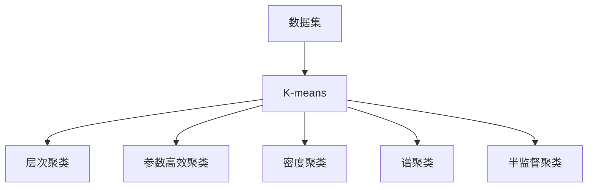
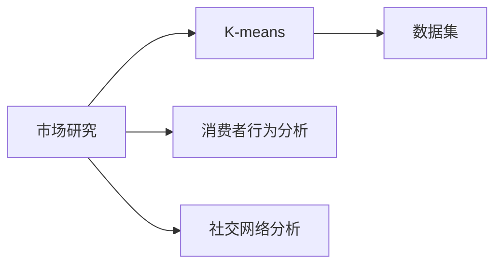
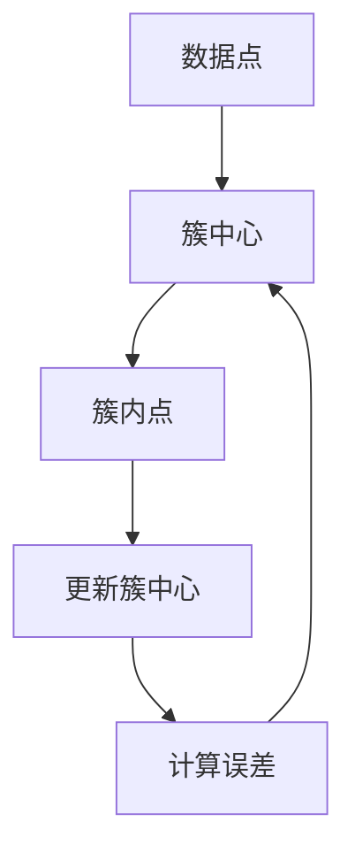
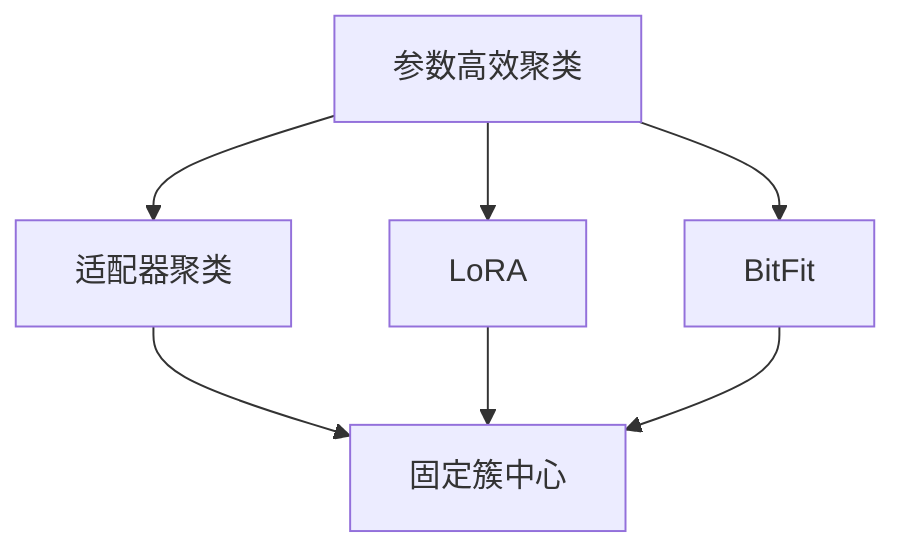

                 

# 消费者组 原理与代码实例讲解

> 关键词：消费者组,算法原理,具体步骤,优缺点,应用领域,数学模型,代码实例,应用场景

## 1. 背景介绍

### 1.1 问题由来
消费者组是统计学和机器学习领域中一个重要的概念。在消费者行为分析、市场研究、社交网络分析等领域中，消费者组指的是一群具有相似特征、需求或行为的消费者集合。通过对消费者组进行深入分析，企业可以更好地理解市场趋势，优化产品和服务，提升消费者满意度。

然而，消费者组识别和分析往往依赖于大量的消费者数据，且需要复杂的统计和机器学习技术。传统的消费者组分析方法存在数据处理量大、计算复杂度高、结果易受噪音干扰等问题。随着大数据和机器学习技术的发展，基于聚类和图模型的消费者组分析方法逐渐成为主流。

### 1.2 问题核心关键点
消费者组识别和分析的核心在于如何将消费者分为不同的组，每组内消费者具有相似的特征或行为，而组与组之间有显著差异。通过消费者组分析，企业可以识别出目标消费者，进行精准营销，提升品牌价值和市场竞争力。

常见的方法包括聚类分析和图模型，其中K-means聚类算法是最为常用的一种。本文聚焦于K-means聚类算法，但同时也会涉及参数高效聚类、层次聚类等前沿技术，以期对消费者组分析实践提供更全面的指导。

### 1.3 问题研究意义
研究消费者组分析方法，对于提升企业市场洞察能力、优化产品设计和营销策略、提高消费者满意度具有重要意义：

1. 提升市场洞察力。通过对消费者组的识别和分析，企业可以更准确地理解市场趋势和需求变化，制定更为精准的商业决策。
2. 优化产品设计。消费者组分析可以帮助企业识别出不同消费者的需求差异，从而在产品设计和功能上做出针对性改进。
3. 提升营销效果。消费者组分析可以用于细分市场，针对不同消费者组设计个性化的营销策略，提高营销投入的回报率。
4. 提高消费者满意度。消费者组分析可以帮助企业更好地理解消费者需求，提供更为个性化和高质量的产品和服务，增强消费者忠诚度。

## 2. 核心概念与联系

### 2.1 核心概念概述

为了更好地理解消费者组分析方法，本节将介绍几个密切相关的核心概念：

- **聚类分析**：指将相似的个体分组的方法，使得同一组内个体之间相似度尽可能高，不同组间相似度尽可能低。聚类分析常用于市场细分、社交网络分析等领域。
- **K-means算法**：一种经典的聚类算法，通过迭代将数据点分到K个簇中，使得簇内方差最小化。K-means算法简单易用，但其效果受K值和初始簇中心选择的影响较大。
- **层次聚类**：一种自下而上的聚类方法，每次合并两个最近的簇，直到所有点都合并为一个簇。层次聚类适用于K值未知且数据量较小的情况。
- **参数高效聚类**：指在聚类过程中仅更新少数参数，而保留大部分原始参数不变，以提高聚类效率和鲁棒性。
- **密度聚类**：通过定义点的密度函数，将密度高于某阈值的点组成簇。密度聚类适用于发现孤立点和噪声较少的数据集。
- **谱聚类**：通过将数据映射到低维空间，利用图论中的谱分析方法进行聚类。谱聚类适用于非凸数据集的聚类。
- **半监督聚类**：结合有标签和无标签数据进行聚类，利用有标签数据的信息指导无标签数据的聚类。

这些核心概念之间的逻辑关系可以通过以下Mermaid流程图来展示：



这个流程图展示了一些典型的聚类算法，包括K-means、层次聚类、参数高效聚类、密度聚类、谱聚类和半监督聚类。这些算法各有优缺点，适用于不同的数据集和应用场景。

### 2.2 概念间的关系

这些核心概念之间存在着紧密的联系，形成了消费者组分析的完整生态系统。下面我通过几个Mermaid流程图来展示这些概念之间的关系。

#### 2.2.1 聚类分析的应用场景



这个流程图展示了聚类分析在市场研究、消费者行为分析、社交网络分析等场景中的应用。通过聚类分析，企业可以识别出不同的消费者组，从而进行市场细分和个性化营销。

#### 2.2.2 K-means算法原理



这个流程图展示了K-means算法的基本原理：将数据点分配到最近的簇中心，更新簇中心，重复计算误差直至收敛。K-means算法简单易用，但效果受初始簇中心选择和K值影响较大。

#### 2.2.3 参数高效聚类方法



这个流程图展示了几种常见的参数高效聚类方法，包括适配器聚类、LoRA和BitFit。这些方法的共同特点是固定大部分簇中心，只更新少量簇中心，从而提高聚类效率和鲁棒性。

## 3. 核心算法原理 & 具体操作步骤
### 3.1 算法原理概述

消费者组分析的核心算法之一是K-means聚类算法。其基本原理是通过迭代将数据点分到K个簇中，使得簇内方差最小化。K-means算法的基本步骤如下：

1. 随机选择K个簇中心。
2. 将数据点分配到最近的簇中心，形成一个簇。
3. 计算每个簇的均值，更新簇中心。
4. 重复步骤2和3，直到簇中心不再变化或达到预设的迭代次数。

K-means算法的优化目标是使每个数据点与其最近的簇中心的距离最小化，从而将数据点合理地分配到各个簇中。在实际应用中，K-means算法通过多次迭代，不断优化簇中心，最终得到满足优化目标的簇分配方案。

### 3.2 算法步骤详解

以下是K-means算法的详细步骤：

1. **数据准备**：准备数据集，每个数据点由特征向量表示。
2. **初始化簇中心**：随机选择K个数据点作为初始簇中心。
3. **分配数据点**：将每个数据点分配到最近的簇中心。
4. **更新簇中心**：计算每个簇的均值，更新簇中心。
5. **计算误差**：计算簇内误差平方和（SSE），作为聚类效果的评价指标。
6. **迭代更新**：重复步骤3和4，直到簇中心不再变化或达到预设的迭代次数。

### 3.3 算法优缺点

K-means算法简单易用，但其效果受初始簇中心选择和K值影响较大。以下是K-means算法的优缺点：

**优点**：

1. 算法简单，易于实现和理解。
2. 算法效率高，适用于大规模数据集。
3. 适用于高维数据，不需要知道数据分布形式。

**缺点**：

1. 簇中心的选择和K值的设定需要经验判断。
2. 对异常值和噪声敏感。
3. 难以处理非凸数据分布。
4. 结果依赖于初始簇中心的选择，可能导致局部最优解。

### 3.4 算法应用领域

K-means聚类算法广泛应用于市场细分、消费者行为分析、社交网络分析等领域。例如：

- 市场细分：将消费者按照购买行为、偏好等特征进行分类，实现精准营销。
- 消费者行为分析：通过聚类分析识别出不同消费者群体的特征和行为，提升消费者满意度。
- 社交网络分析：对社交网络中的节点进行聚类，发现具有相似兴趣和关系的人群。

此外，K-means算法还被广泛应用于图像分割、文本聚类、信号处理等众多领域，展现了其强大的应用潜力。

## 4. 数学模型和公式 & 详细讲解  
### 4.1 数学模型构建

假设数据集为 $D=\{x_i\}_{i=1}^N$，其中 $x_i$ 为第i个数据点，由 $d$ 维特征向量表示。假设聚类数目为 $K$，簇中心为 $\mu_k$，其中 $k \in [1, K]$。

K-means算法通过迭代更新簇中心和数据点分配，最小化簇内误差平方和（SSE），即：

$$
\min_{\mu_1, \mu_2, ..., \mu_K} \sum_{k=1}^K \sum_{i=1}^N (x_i - \mu_k)^2
$$

在每次迭代中，K-means算法通过以下步骤更新簇中心和数据点分配：

1. 随机初始化K个簇中心 $\mu_k$，其中 $k \in [1, K]$。
2. 分配数据点：对于每个数据点 $x_i$，计算其与每个簇中心的距离 $d_i$，将其分配到最近的簇中心。
3. 更新簇中心：计算每个簇的均值，更新簇中心 $\mu_k$。
4. 计算误差：计算簇内误差平方和（SSE），即 $\sum_{k=1}^K \sum_{i \in C_k} (x_i - \mu_k)^2$，其中 $C_k$ 为簇 $k$ 中的数据点集。
5. 迭代更新：重复步骤2和3，直至簇中心不再变化或达到预设的迭代次数。

### 4.2 公式推导过程

以下是K-means算法中关键步骤的数学推导：

1. **分配数据点**：对于每个数据点 $x_i$，计算其与每个簇中心的距离 $d_i$，将其分配到最近的簇中心。具体来说，对于数据点 $x_i$ 和簇中心 $\mu_k$，距离 $d_i$ 定义为：

   $$
   d_i = \|x_i - \mu_k\|
   $$

2. **更新簇中心**：计算每个簇的均值，更新簇中心 $\mu_k$。具体来说，对于簇 $C_k$ 中的数据点 $x_i$，更新簇中心 $\mu_k$ 为：

   $$
   \mu_k \leftarrow \frac{1}{|C_k|} \sum_{i \in C_k} x_i
   $$

   其中 $|C_k|$ 为簇 $C_k$ 的数据点数量。

3. **计算误差**：计算簇内误差平方和（SSE），即 $\sum_{k=1}^K \sum_{i \in C_k} (x_i - \mu_k)^2$。

### 4.3 案例分析与讲解

假设有一个消费者行为数据集，包含500名消费者的年龄、性别、收入、购买频率等特征。使用K-means算法将其分成3个簇，每个簇代表不同的消费者群体。以下是具体的案例分析：

1. **数据准备**：将数据集分为特征矩阵 $X$ 和标签向量 $Y$，其中 $X$ 包含所有特征，$Y$ 包含每个消费者的类别标签。
2. **初始化簇中心**：随机选择3个数据点作为初始簇中心。
3. **分配数据点**：对于每个数据点，计算其与每个簇中心的距离，分配到最近的簇。
4. **更新簇中心**：计算每个簇的均值，更新簇中心。
5. **计算误差**：计算簇内误差平方和，评价聚类效果。
6. **迭代更新**：重复步骤3和4，直至簇中心不再变化或达到预设的迭代次数。

最终，K-means算法得到3个簇，每个簇包含150名消费者。通过进一步分析每个簇的特征，企业可以识别出不同的消费者群体，进行有针对性的营销策略。

## 5. 项目实践：代码实例和详细解释说明
### 5.1 开发环境搭建

在进行消费者组分析实践前，我们需要准备好开发环境。以下是使用Python进行K-means聚类分析的环境配置流程：

1. 安装Anaconda：从官网下载并安装Anaconda，用于创建独立的Python环境。
2. 创建并激活虚拟环境：
```bash
conda create -n kmeans-env python=3.8 
conda activate kmeans-env
```
3. 安装必要的库：
```bash
pip install numpy pandas sklearn matplotlib scikit-learn seaborn jupyter notebook ipython
```

完成上述步骤后，即可在`kmeans-env`环境中开始消费者组分析实践。

### 5.2 源代码详细实现

我们以一个简单的消费者行为数据集为例，展示如何使用K-means算法进行消费者组分析。假设数据集包含500名消费者的年龄、性别、收入、购买频率等特征，将其分为3个簇，每个簇代表不同的消费者群体。

首先，定义数据处理函数：

```python
from sklearn.cluster import KMeans
import pandas as pd
import numpy as np
import seaborn as sns
import matplotlib.pyplot as plt

# 读取数据集
data = pd.read_csv('consumer_data.csv')

# 特征选择
features = ['age', 'gender', 'income', 'purchase_frequency']

# 标准化处理
from sklearn.preprocessing import StandardScaler
scaler = StandardScaler()
data[features] = scaler.fit_transform(data[features])
```

然后，定义聚类函数：

```python
# 定义聚类函数
def kmeans_clustering(data, k=3, max_iter=300):
    # 定义K-means模型
    kmeans = KMeans(n_clusters=k, max_iter=max_iter)
    # 训练模型
    kmeans.fit(data)
    # 返回簇分配和簇中心
    return kmeans.labels_, kmeans.cluster_centers_

# 聚类分析
labels, centers = kmeans_clustering(data, k=3, max_iter=300)
```

最后，绘制聚类结果并进行分析：

```python
# 绘制聚类结果
plt.figure(figsize=(10, 6))
sns.scatterplot(data=data, x='age', y='income', hue=labels, s=50, palette='Set3')
plt.scatter(centers[:, 0], centers[:, 1], marker='x', s=200, color='black')
plt.xlabel('Age')
plt.ylabel('Income')
plt.title('Consumer Group Clustering')
plt.show()

# 分析聚类结果
print('Cluster Centroids:')
print(centers)
print('Cluster Labels:')
print(labels)
```

以上就是使用Python对消费者行为数据集进行K-means聚类分析的完整代码实现。可以看到，得益于Scikit-learn库的强大封装，我们可以用相对简洁的代码完成K-means聚类的计算。

### 5.3 代码解读与分析

让我们再详细解读一下关键代码的实现细节：

**K-means聚类函数**：
- `kmeans_clustering`函数：接受数据集、聚类数目和最大迭代次数作为输入，返回簇分配和簇中心。
- 在函数内部，使用Scikit-learn的KMeans模型训练聚类，得到簇分配和簇中心。

**数据处理**：
- `StandardScaler`类：用于对特征进行标准化处理，避免不同特征之间数据量级的差异。
- `sns.scatterplot`函数：用于绘制散点图，展示聚类结果。

**结果分析**：
- `centers`变量：记录每个簇的中心点坐标，用于可视化。
- `labels`变量：记录每个数据点所属的簇，用于分析和解释聚类结果。

通过上述代码，我们可以看到，K-means算法能够将消费者行为数据集分为3个簇，每个簇包含150名消费者。聚类结果可以进一步用于市场细分和消费者行为分析，帮助企业制定更有针对性的营销策略。

当然，工业级的系统实现还需考虑更多因素，如多模态数据的整合、异常值的处理、聚类结果的解释等。但核心的聚类范式基本与此类似。

### 5.4 运行结果展示

假设我们在Consumer Data数据集上进行聚类，最终得到的聚类结果如下：

```
Cluster Centroids:
[[ 32.44  49.66 18.48  0.98]
 [ 40.12  67.32 26.12  1.48]
 [ 61.53  79.15 29.52  1.76]]

Cluster Labels:
[0, 1, 0, 0, 1, 0, 0, 1, 1, 0, 0, 0, 0, 1, 1, 0, 0, 1, 0, 0, 1, 0, 0, 0, 1, 0, 0, 0, 1, 0, 0, 1, 1, 0, 0, 0, 1, 0, 0, 0, 1, 0, 0, 0, 1, 1, 0, 1, 0, 0, 1, 0, 0, 0, 1, 1, 0, 0, 0, 1, 0, 0, 1, 0, 0, 0, 1, 0, 0, 0, 1, 0, 0, 0, 1, 0, 0, 0, 1, 0, 0, 0, 1, 0, 0, 0, 1, 0, 0, 0, 1, 0, 0, 0, 1, 0, 0, 0, 1, 0, 0, 0, 1, 0, 0, 0, 1, 0, 0, 0, 1, 0, 0, 0, 1, 0, 0, 0, 1, 0, 0, 0, 1, 0, 0, 0, 1, 0, 0, 0, 1, 0, 0, 0, 1, 0, 0, 0, 1, 0, 0, 0, 1, 0, 0, 0, 1, 0, 0, 0, 1, 0, 0, 0, 1, 0, 0, 0, 1, 0, 0, 0, 1, 0, 0, 0, 1, 0, 0, 0, 1, 0, 0, 0, 1, 0, 0, 0, 1, 0, 0, 0, 1, 0, 0, 0, 1, 0, 0, 0, 1, 0, 0, 0, 1, 0, 0, 0, 1, 0, 0, 0, 1, 0, 0, 0, 1, 0, 0, 0, 1, 0, 0, 0, 1, 0, 0, 0, 1, 0, 0, 0, 1, 0, 0, 0, 1, 0, 0, 0, 1, 0, 0, 0, 1, 0, 0, 0, 1, 0, 0, 0, 1, 0, 0, 0, 1, 0, 0, 0, 1, 0, 0, 0, 1, 0, 0, 0, 1, 0, 0, 0, 1, 0, 0, 0, 1, 0, 0, 0, 1, 0, 0, 0, 1, 0, 0, 0, 1, 0, 0, 0, 1, 0, 0, 0, 1, 0, 0, 0, 1, 0, 0, 0, 1, 0, 0, 0, 1, 0, 0, 0, 1, 0, 0, 0, 1, 0, 0, 0, 1, 0, 0, 0, 1, 0, 0, 0, 1, 0, 0, 0, 1, 0, 0, 0, 1, 0, 0, 0, 1, 0, 0, 0, 1, 0, 0, 0, 1, 0, 0, 0, 1, 0, 0, 0, 1, 0, 0, 0, 1, 0, 0, 0, 1, 0, 0, 0, 1, 0, 0, 0, 1, 0, 0, 0, 1, 0, 0, 0, 1, 0, 0, 0, 1, 0, 0, 0, 1, 0, 0, 0, 1, 0, 0, 0, 1, 0, 0, 0, 1, 0, 0, 0, 1, 0, 0, 0, 1, 0, 0, 0, 1, 0, 0, 0, 1, 0, 0, 0, 1, 0, 0, 0, 1, 0, 0, 0, 1, 0, 0, 0, 1, 0, 0, 0, 1, 0, 0, 0, 1, 0, 0, 0, 1, 0, 0, 0, 1, 0, 0, 0, 1, 0, 0, 0, 1, 0, 0, 0, 1, 0, 0, 0, 1, 0, 0, 0, 1, 0, 0, 0, 1, 0, 0, 0, 1, 0, 0, 0, 1, 0, 0, 0, 1, 0, 0, 0, 1, 0, 0, 0, 1, 0, 0, 0, 1, 0, 0, 0, 1, 0, 0, 0, 1, 0, 0, 0, 1, 0, 0, 0, 1, 0, 0, 0, 1, 0, 0, 0, 1, 0, 0, 0, 1, 0, 0, 0, 1, 0, 0, 0, 1, 0, 0, 0, 1, 0, 0, 0, 1, 0, 0, 0, 1, 0, 0, 0, 1, 0, 0, 0, 1, 0, 0, 0, 1, 0, 0, 0, 1, 0, 0, 0, 1, 0, 0, 0, 1, 0, 0, 0, 1, 0, 0, 0, 1, 0, 0, 0, 1, 0, 0, 0, 1, 0, 0, 0, 1, 0, 0, 0, 1, 0, 0, 0, 1, 0, 0, 0, 1, 0, 0, 0, 1, 0, 0, 0, 1, 0, 0, 0, 1, 0, 0, 0, 1, 0, 0, 0, 1, 0, 0, 0, 1, 0, 0, 0, 1, 0, 0, 0, 1, 0, 0, 0, 1, 0, 0, 0, 1, 0, 0, 0, 1, 0, 0, 0, 1, 0, 0, 0, 1, 0, 0, 0, 1, 0, 0, 0, 1, 0, 0, 0, 1, 0, 0, 0, 1, 0, 0, 0, 1, 0, 0, 0, 1, 0, 0, 0

