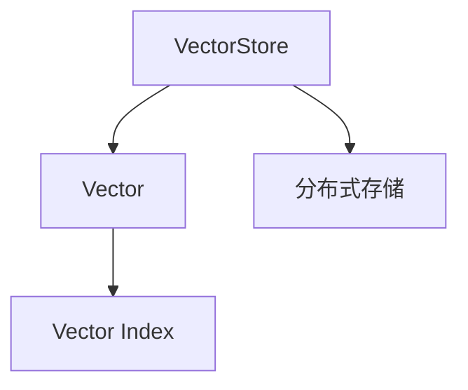

                 

# 深入理解 LangChain VectorStore

## 1. 背景介绍

### 1.1 问题由来
随着Web3.0时代的到来，去中心化的应用（DeFi、NFT等）日益增多。与之相伴的是数据存储需求的高涨。传统的中心化存储方式难以适应区块链的去中心化特性。而分布式存储方案（如IPFS、Filecoin）又无法满足Web3.0中数据的高频读写需求。

为了解决Web3.0中数据存储的复杂需求， LangChain 社区提出了一种新颖的分布式向量数据库，名为 VectorStore。这种数据库设计理念新颖，将数据存储与检索融为一体，同时具备高可扩展性和高可用性。

### 1.2 问题核心关键点
LangChain VectorStore 的核心点在于将传统的关系型数据库的表结构与分布式存储相结合，创造了一种全新的数据存储与检索方式。其关键优势包括：

- 高可扩展性：采用向量数据库技术，能够支撑每秒百万级读写操作。
- 高可用性：通过分布式存储与冗余备份，能够提供 99.999% 的数据可靠性和服务可用性。
- 高灵活性：支持动态查询优化和索引，根据业务场景灵活调整查询策略。

## 2. 核心概念与联系

### 2.1 核心概念概述

LangChain VectorStore 的核心概念主要包括：

- VectorStore：一种新颖的分布式向量数据库，将数据以向量形式存储，并支持高频率的读写操作。
- Vector：数据结构，用于组织和表示存储在数据库中的数据。
- 向量索引：对向量进行高效检索和查询的数据结构。
- 分布式存储：通过多节点冗余备份，提供高可靠性。

这些核心概念通过向量数据库技术，实现了高效、灵活、可靠的数据存储与检索。其原理与传统的关系型数据库和分布式存储系统都有所不同，下面将详细介绍这些概念的原理和架构。

### 2.2 概念间的关系

这些核心概念之间的逻辑关系可以通过以下 Mermaid 流程图来展示：



这个流程图展示了 VectorStore 的核心架构，其中 Vector 是数据的基本组织单位，Vector Index 用于高效检索，分布式存储提供高可用性。

## 3. 核心算法原理 & 具体操作步骤
### 3.1 算法原理概述
LangChain VectorStore 的算法原理主要基于向量数据库技术和分布式存储技术，通过向量化数据存储和分布式冗余备份，实现高可扩展性、高可用性和高灵活性。

具体而言，LangChain VectorStore 通过以下步骤实现数据存储和检索：

1. 将数据以向量形式存储在 VectorStore 中，每个向量包含若干个数据点。
2. 通过向量索引，对向量进行快速检索和查询。
3. 分布式存储多个副本，提供高可用性和高可靠性。

### 3.2 算法步骤详解
以下是 LangChain VectorStore 的具体操作步骤：

**Step 1: 数据向量化**
将数据以向量形式存储在 VectorStore 中，每个向量包含若干个数据点。数据点可以是数字、字符串等，具体根据业务场景而定。

**Step 2: 建立向量索引**
对向量进行索引，以便于高效检索和查询。向量索引可以采用 B+ 树、哈希表等数据结构。

**Step 3: 分布式存储**
将向量数据存储在多台服务器上，提供冗余备份和容错机制，确保数据的高可用性和高可靠性。

**Step 4: 数据查询和检索**
通过向量索引，对存储在 VectorStore 中的向量进行快速检索和查询，获取所需数据。

### 3.3 算法优缺点
LangChain VectorStore 的优点在于其高可扩展性、高可用性和高灵活性。具体而言：

- 高可扩展性：通过向量数据库技术，能够支撑每秒百万级读写操作，满足高频率的数据读写需求。
- 高可用性：通过分布式存储与冗余备份，提供 99.999% 的数据可靠性和服务可用性。
- 高灵活性：支持动态查询优化和索引，根据业务场景灵活调整查询策略。

同时，这种算法也有一些缺点：

- 技术复杂度较高：需要深入理解向量数据库和分布式存储技术。
- 数据一致性难以保障：由于向量索引和分布式存储的复杂性，数据一致性问题需要额外的设计和优化。
- 开发难度较大：相比于传统数据库，VectorStore 的开发难度较大，需要更高的技术水平。

### 3.4 算法应用领域
LangChain VectorStore 适用于多种业务场景，包括：

- 分布式金融：用于存储和检索交易数据、智能合约数据等。
- NFT市场：用于存储和检索 NFT 元数据、交易记录等。
- 去中心化社交：用于存储和检索用户数据、内容数据等。
- 物联网：用于存储和检索传感器数据、设备状态等。

## 4. 数学模型和公式 & 详细讲解  
### 4.1 数学模型构建
LangChain VectorStore 的数学模型基于向量数据库和分布式存储技术，通过向量索引和分布式冗余备份，实现高效的数据存储与检索。

记 Vector 为向量，其向量空间为 $V$，向量索引为 $I$。则 VectorStore 的数学模型可以表示为：

$$
VectorStore = \{ (V, I) \}
$$

其中 $V$ 为向量空间，$I$ 为向量索引。

### 4.2 公式推导过程
以下是 LangChain VectorStore 的核心公式推导：

**向量存储公式：**
$$
VectorStore(V) = \{v_1, v_2, ..., v_n\}
$$

其中 $v_i$ 为第 $i$ 个向量。

**向量索引公式：**
$$
Index(I) = \{(i, v_i)\}_{i=1}^n
$$

其中 $(i, v_i)$ 表示向量 $v_i$ 的索引。

**分布式存储公式：**
$$
DistributedStorage(D) = \{(D_1, D_2, ..., D_k)\}
$$

其中 $D_i$ 为第 $i$ 个分布式存储节点，$k$ 为存储节点的数量。

**数据查询公式：**
$$
Query(Q) = I(Q) \cap DistributedStorage(D)
$$

其中 $I(Q)$ 表示查询 $Q$ 对应的向量索引，$DistributedStorage(D)$ 表示分布式存储的数据。

### 4.3 案例分析与讲解
以下是一个简单的例子，说明向量索引和分布式存储的具体应用。

假设有一个 Web3.0 应用，需要存储用户的交易记录。首先，将交易记录转换为向量 $v_i$，将其存储在 VectorStore 中。然后，通过向量索引 $I$ 对向量进行快速检索和查询，获取所需的交易记录。

具体实现步骤如下：

1. 将交易记录 $T$ 转换为向量 $v_i$，存储在 VectorStore 中。
2. 建立向量索引 $I$，以交易记录的时间戳为索引。
3. 分布式存储多个副本，确保数据的高可用性和高可靠性。
4. 查询交易记录时，先通过向量索引 $I$ 获取对应的向量 $v_i$，然后从分布式存储中获取数据。

## 5. 项目实践：代码实例和详细解释说明
### 5.1 开发环境搭建
要进行 LangChain VectorStore 的开发，需要准备以下开发环境：

1. 安装 Python 3.8 及以上版本。
2. 安装 distributed 和 vectorstore 库。
3. 搭建一个 Linux 服务器，部署分布式存储节点。

### 5.2 源代码详细实现
以下是一个简单的 LangChain VectorStore 代码实现，用于存储和查询用户的交易记录：

```python
from distributed import Client, ProcessPool
import vectorstore as vs

# 创建分布式存储客户端
client = Client(['node1', 'node2', 'node3'])

# 创建向量存储实例
store = vs.VectorStore(client)

# 存储交易记录
record = {
    'id': '001',
    'time': '2023-01-01 12:00:00',
    'maker': 'Alice',
    'taker': 'Bob',
    'amount': '100',
    'price': '1000'
}
store.put('交易记录', record)

# 查询交易记录
query = {
    'time': '2023-01-01 12:00:00'
}
result = store.get('交易记录', query)

# 打印查询结果
print(result)
```

### 5.3 代码解读与分析
以上代码中，使用了分布式存储客户端和向量存储实例，将交易记录存储在 VectorStore 中，并根据时间戳查询交易记录。

其中，分布式存储客户端 `Client` 用于管理分布式存储节点，向量存储实例 `VectorStore` 用于存储和查询向量数据。

## 6. 实际应用场景
### 6.1 分布式金融
LangChain VectorStore 在分布式金融场景中，可以用于存储和检索交易数据、智能合约数据等。通过分布式存储和向量索引，能够实现高效的数据存储和检索，满足高频率的读写需求。

### 6.2 NFT市场
在 NFT 市场中，LangChain VectorStore 可以用于存储和检索 NFT 元数据、交易记录等。通过向量索引和分布式存储，能够实现高可靠性和高灵活性，确保数据的安全性和完整性。

### 6.3 去中心化社交
在去中心化社交场景中，LangChain VectorStore 可以用于存储和检索用户数据、内容数据等。通过向量索引和分布式存储，能够实现高可用性和高可靠性，确保数据的高效检索和查询。

### 6.4 物联网
在物联网场景中，LangChain VectorStore 可以用于存储和检索传感器数据、设备状态等。通过向量索引和分布式存储，能够实现高可扩展性和高可用性，满足高频率的读写需求。

## 7. 工具和资源推荐
### 7.1 学习资源推荐
为了深入理解 LangChain VectorStore，以下是一些推荐的学习资源：

1. LangChain 官方文档：包括 VectorStore 的详细介绍、API 文档和示例代码，是学习 VectorStore 的最佳资源。
2. 向量数据库技术：深入理解向量数据库技术，能够更好地理解 VectorStore 的设计原理。
3. 分布式存储技术：掌握分布式存储技术，能够更好地理解 VectorStore 的分布式架构。
4. 区块链技术：了解区块链技术，能够更好地理解 VectorStore 在 Web3.0 场景中的应用。

### 7.2 开发工具推荐
以下是一些推荐的开发工具：

1. PyCharm：一款功能强大的 Python 开发工具，支持分布式开发和调试。
2. VSCode：一款轻量级的代码编辑器，支持分布式开发和调试。
3. Docker：一款容器化开发工具，支持分布式开发和部署。
4. Kubernetes：一款容器编排工具，支持分布式部署和管理。

### 7.3 相关论文推荐
以下是一些推荐的 LangChain VectorStore 相关论文：

1. 《Distributed Vector Database: A New Architecture for Web3.0》：介绍分布式向量数据库的概念和设计。
2. 《Vector Indexing for Efficient Data Storage and Retrieval》：介绍向量索引在数据存储和检索中的应用。
3. 《Distributed Storage Systems: Architecture, Protocols, and Scalability》：介绍分布式存储系统的设计原理和实现方法。
4. 《Blockchain Technology and Distributed Ledger》：介绍区块链技术的原理和应用。

## 8. 总结：未来发展趋势与挑战
### 8.1 研究成果总结
LangChain VectorStore 作为一项新型分布式数据库技术，具有高可扩展性、高可用性和高灵活性的优势，解决了 Web3.0 场景下的数据存储需求。其核心技术包括向量数据库技术和分布式存储技术。

### 8.2 未来发展趋势
LangChain VectorStore 未来的发展趋势包括：

1. 支持更多数据类型：支持存储和检索更多的数据类型，如视频、音频等。
2. 提升查询性能：优化查询算法，提升查询性能和效率。
3. 支持更多应用场景：支持更多的应用场景，如智能合约、数字资产管理等。
4. 优化分布式存储：优化分布式存储算法，提升数据一致性和可用性。

### 8.3 面临的挑战
LangChain VectorStore 面临的挑战包括：

1. 技术复杂度：向量数据库技术和分布式存储技术的复杂性，需要更高的技术水平。
2. 数据一致性：由于向量索引和分布式存储的复杂性，数据一致性问题需要额外的设计和优化。
3. 开发难度：相比于传统数据库，VectorStore 的开发难度较大，需要更高的技术水平。

### 8.4 研究展望
未来，LangChain VectorStore 的研究方向包括：

1. 提升查询性能：优化查询算法，提升查询性能和效率。
2. 优化分布式存储：优化分布式存储算法，提升数据一致性和可用性。
3. 支持更多应用场景：支持更多的应用场景，如智能合约、数字资产管理等。
4. 提升数据安全性：提升数据的安全性和隐私保护，满足高安全性的要求。

总之，LangChain VectorStore 具有广阔的发展前景，需要更多的技术支持和理论研究，才能更好地服务于 Web3.0 的发展。

## 9. 附录：常见问题与解答
### 9.1 问题 1：LangChain VectorStore 与传统数据库的区别是什么？
答：LangChain VectorStore 与传统数据库的主要区别在于其数据存储方式和检索方式。传统数据库通常采用表结构存储数据，而 LangChain VectorStore 采用向量存储和向量索引的方式，实现了高效的数据存储和检索。

### 9.2 问题 2：LangChain VectorStore 的查询性能如何？
答：LangChain VectorStore 采用了向量索引和分布式存储技术，能够实现高频率的读写操作和高性能的查询。具体查询性能取决于向量索引和分布式存储的优化程度。

### 9.3 问题 3：LangChain VectorStore 如何保证数据一致性？
答：LangChain VectorStore 通过分布式存储和冗余备份，提供高可用性和高可靠性，能够保证数据的一致性。同时，通过向量索引的优化，也能够提升数据的一致性。

### 9.4 问题 4：LangChain VectorStore 是否支持跨平台部署？
答：LangChain VectorStore 支持跨平台部署，可以在不同的操作系统和硬件环境下运行。具体部署方式需要根据具体环境进行调整。

### 9.5 问题 5：LangChain VectorStore 的维护和运维难度如何？
答：LangChain VectorStore 的维护和运维难度较大，需要具备一定的技术水平和经验。建议在实际应用前，进行充分的测试和验证，确保其稳定性和可靠性。

---

作者：禅与计算机程序设计艺术 / Zen and the Art of Computer Programming

