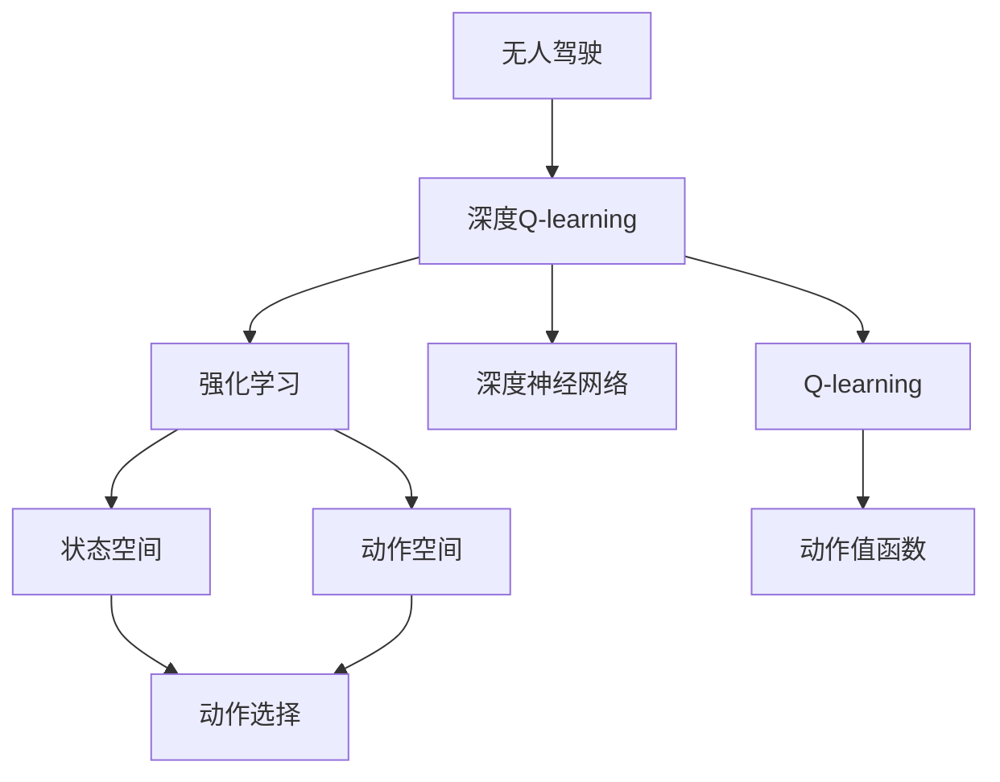
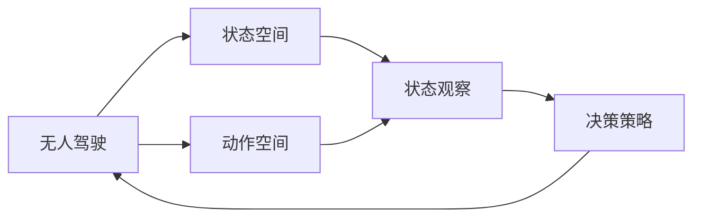
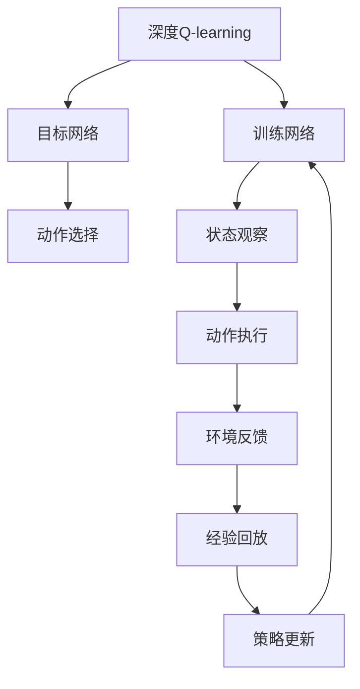
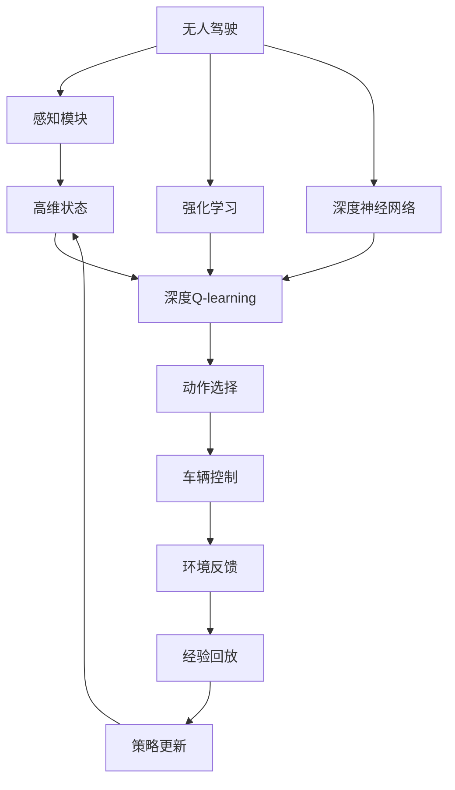

                 

# 深度 Q-learning：在无人驾驶中的应用

## 1. 背景介绍

### 1.1 问题由来
随着自动驾驶技术的迅猛发展，无人驾驶车辆在交通安全、环境保护和交通效率方面展现出巨大的潜力。然而，无人驾驶的核心挑战之一在于如何使得车辆在复杂的交通场景中做出合理决策。传统的强化学习方法，如Q-learning，虽然具备自适应和鲁棒性，但由于其浅层网络结构，难以高效学习高维状态空间下的决策策略。因此，结合深度学习技术，深度Q-learning（DQN）方法应运而生。DQN通过构建深度神经网络来逼近Q函数，可以更好地处理高维状态空间和动作空间，从而在无人驾驶等复杂环境中取得显著成效。

### 1.2 问题核心关键点
深度Q-learning在无人驾驶中的应用主要体现在以下几个方面：
- 高维状态空间处理：无人驾驶环境中的交通场景变化多端，传感器获取的状态信息（如位置、速度、车道线等）往往具有高维性。DQN能够有效处理高维状态信息，提取特征，用于决策。
- 实时决策能力：无人驾驶车辆需要实时做出决策，以应对突发事件。DQN通过深度神经网络进行离线训练，实时决策时通过目标网络进行动作选择，具备较强的实时性。
- 端到端训练：无人驾驶系统要求模型能够从输入状态直接到输出动作，中间不需要人工干预。DQN提供了一个端到端的训练框架，可以无需显式地提取特征，直接从原始状态数据到动作选择。

### 1.3 问题研究意义
深度Q-learning在无人驾驶中的应用对于提升驾驶安全性、交通效率和用户体验具有重要意义：
- 减少交通事故：通过学习最优的驾驶策略，无人驾驶车辆能够更好地预测和规避潜在风险，从而降低交通事故率。
- 提高交通效率：无人驾驶车辆能够优化路线选择和车速控制，减少交通拥堵，提升交通流。
- 改善用户体验：通过深度学习技术，无人驾驶车辆能够更加智能、灵敏地响应驾驶员指令，提升出行体验。
- 推动产业升级：DQN技术的引入有助于提升无人驾驶系统的智能水平，推动传统行业向智能化转型。

## 2. 核心概念与联系

### 2.1 核心概念概述

为更好地理解深度Q-learning在无人驾驶中的应用，本节将介绍几个密切相关的核心概念：

- 强化学习(Reinforcement Learning, RL)：一种通过试错来优化决策策略的学习范式。通过与环境交互，学习最优决策策略，最大化累积奖励。
- 深度神经网络(Deep Neural Network, DNN)：一种基于多层神经元的非线性模型，具备强大的特征提取和泛化能力。
- Q-learning：一种基于值迭代法的强化学习算法，通过估计动作值函数Q(s,a)来优化策略，提升决策性能。
- 深度Q-learning (DQN)：一种将深度神经网络引入Q-learning的强化学习算法，通过逼近Q函数Q(s,a)来优化策略，处理高维状态空间和动作空间。
- 无人驾驶(Self-Driving)：一种基于计算机视觉、传感器数据、人工智能等技术，使车辆自主导航和决策的智能交通系统。

这些核心概念之间的逻辑关系可以通过以下Mermaid流程图来展示：



这个流程图展示了大语言模型微调过程中各个核心概念之间的关系：

1. 无人驾驶通过强化学习进行决策优化。
2. 强化学习通过估计动作值函数Q(s,a)进行策略优化，而Q函数可以通过深度神经网络逼近。
3. 无人驾驶环境中的状态空间和动作空间往往非常高维，深度Q-learning能够处理这些高维数据。
4. 无人驾驶需要实时做出决策，DQN具备实时决策能力。
5. DQN提供了一个端到端的训练框架，能够直接从原始状态数据到动作选择，无需人工干预。

### 2.2 概念间的关系

这些核心概念之间存在着紧密的联系，形成了深度Q-learning在无人驾驶中的应用框架。下面我通过几个Mermaid流程图来展示这些概念之间的关系。

#### 2.2.1 无人驾驶的强化学习范式



这个流程图展示了无人驾驶的强化学习范式。无人驾驶通过状态空间和动作空间，进行状态观察和动作决策，最终优化决策策略，提升驾驶性能。

#### 2.2.2 深度Q-learning的应用场景


这个流程图展示了深度Q-learning在无人驾驶中的应用场景。感知模块获取高维状态数据，然后通过深度Q-learning进行动作决策，最终将动作输出到车辆控制系统中。

#### 2.2.3 深度Q-learning的训练过程



这个流程图展示了深度Q-learning的训练过程。深度神经网络分为目标网络和训练网络，目标网络进行动作选择，训练网络进行状态观察和策略更新。训练网络从感知模块获取状态数据，执行动作并接收环境反馈，然后将经验数据存储在经验回放缓冲区中，用于策略更新。

### 2.3 核心概念的整体架构

最后，我们用一个综合的流程图来展示这些核心概念在大语言模型微调过程中的整体架构：



这个综合流程图展示了深度Q-learning在无人驾驶中的应用过程。感知模块获取高维状态数据，然后通过深度Q-learning进行动作决策，最终将动作输出到车辆控制系统中。同时，整个系统通过强化学习不断优化策略，提升驾驶性能。

## 3. 核心算法原理 & 具体操作步骤
### 3.1 算法原理概述

深度Q-learning是一种将深度神经网络引入传统Q-learning的强化学习算法，通过逼近Q函数Q(s,a)来优化策略。其核心思想是将状态空间、动作空间和奖励函数映射为Q函数的输入，通过深度神经网络逼近Q函数，从而最大化累积奖励。在无人驾驶场景中，深度Q-learning能够有效处理高维状态空间和动作空间，提升决策策略的泛化能力。

形式化地，假设无人驾驶车辆的状态空间为S，动作空间为A，奖励函数为R，深度神经网络为Q(s,a;θ)，其中θ为网络参数。DQN的目标是最小化损失函数L(θ)，从而得到最优的Q函数参数θ*：

$$
\theta^* = \mathop{\arg\min}_{\theta} \mathcal{L}(\theta)
$$

其中，损失函数L(θ)定义为：

$$
\mathcal{L}(\theta) = \frac{1}{N}\sum_{i=1}^N (Q_{target}(s_i,a_i;θ) - Q(s_i,a_i;θ))
$$

其中，$Q_{target}(s_i,a_i;θ) = r_i + \gamma Q(s_{i+1},a;θ)$，为下一个状态的Q函数值，其中r_i为即时奖励，γ为折扣因子。

通过优化损失函数L(θ)，DQN能够不断调整网络参数θ，逼近最优的Q函数，从而最大化累积奖励。

### 3.2 算法步骤详解

深度Q-learning在无人驾驶中的应用一般包括以下几个关键步骤：

**Step 1: 准备感知模块和状态空间**
- 安装并调试无人驾驶车辆的感知模块，如摄像头、雷达、激光雷达等，确保能够实时获取高维状态数据。
- 设计状态空间S，包括位置、速度、车道线、交通标志、周围车辆、行人等状态信息。

**Step 2: 搭建深度神经网络**
- 使用深度神经网络模型，如卷积神经网络、递归神经网络等，用于逼近Q函数Q(s,a;θ)。
- 确定神经网络的架构，包括输入层、隐藏层和输出层的大小、激活函数、正则化技术等。
- 使用随机梯度下降(SGD)或Adam优化器，对网络参数θ进行优化。

**Step 3: 设计动作空间和奖励函数**
- 设计动作空间A，包括加速、减速、换道、制动等控制命令。
- 设计奖励函数R，用于评估车辆在某个状态-动作对上的性能，如行驶距离、速度、交通流量等。
- 确定折扣因子γ，以保证当前状态和未来状态的平衡。

**Step 4: 设置训练参数**
- 确定训练轮数、批大小、学习率、经验回放缓冲区大小等关键参数。
- 使用双网络架构，即目标网络和训练网络，分别用于动作选择和策略更新。

**Step 5: 执行训练过程**
- 启动训练过程，对感知模块获取的状态数据进行迭代训练。
- 每个批次，随机抽取一定数量的状态-动作对，更新目标网络的Q函数值。
- 将更新后的目标网络参数复制到训练网络，进行策略更新。
- 定期在验证集上评估模型性能，防止过拟合。
- 重复上述过程，直至模型收敛。

**Step 6: 部署模型**
- 将训练好的模型部署到无人驾驶车辆中。
- 启动车辆感知模块，进行实时状态观察。
- 使用训练好的DQN模型进行动作决策，输出控制命令。
- 根据动作执行情况，接收环境反馈，进行策略优化。

### 3.3 算法优缺点

深度Q-learning在无人驾驶中的应用具有以下优点：
- 高维状态空间处理：深度Q-learning能够有效处理高维状态信息，提取特征，用于决策。
- 实时决策能力：通过双网络架构，深度Q-learning具备实时决策能力，能够快速响应环境变化。
- 端到端训练：深度Q-learning提供了一个端到端的训练框架，直接从原始状态数据到动作选择，无需人工干预。

然而，该方法也存在一些缺点：
- 需要大量标注数据：深度Q-learning需要大量的标注数据进行训练，获取标注数据的成本较高。
- 需要大量计算资源：深度神经网络具有参数量大、计算复杂等特点，训练和推理时对计算资源要求较高。
- 容易陷入局部最优：由于神经网络具有复杂性，训练过程容易陷入局部最优，难以收敛到全局最优。
- 模型可解释性不足：深度Q-learning模型缺乏可解释性，难以理解其内部工作机制和决策逻辑。

尽管存在这些局限性，但深度Q-learning在无人驾驶中的应用仍具有重要意义，尤其是在高维状态空间和实时决策能力方面表现优异。未来，还需要在模型优化、计算资源利用和可解释性等方面进行进一步的研究。

### 3.4 算法应用领域

深度Q-learning在无人驾驶中的应用非常广泛，涵盖以下几个主要领域：

1. **路径规划**：通过优化路径，使得车辆在复杂交通场景中避开障碍物，实现安全高效行驶。
2. **车道保持**：通过感知模块获取车道线信息，控制车辆在车道内行驶，避免偏离。
3. **避障**：通过实时感知周围环境，避免与行人、车辆等发生碰撞，保证行车安全。
4. **自适应巡航**：通过感知模块获取车速信息，控制车辆自动保持与前车的安全距离，实现自适应巡航。
5. **停车辅助**：通过感知模块获取停车标志和停车位信息，辅助车辆自动完成停车。

除了以上应用领域，深度Q-learning还可以应用于无人驾驶中的智能导航、车辆调度、交通控制等方面，为无人驾驶系统带来更高的智能水平。

## 4. 数学模型和公式 & 详细讲解 & 举例说明

### 4.1 数学模型构建

本节将使用数学语言对深度Q-learning在无人驾驶中的应用进行更加严格的刻画。

记无人驾驶车辆的状态空间为S，动作空间为A，奖励函数为R。假设车辆的状态-动作对为(s_t,a_t)，下一个状态为s_{t+1}，奖励为r_t。深度神经网络Q(s,a;θ)逼近Q函数，其中θ为网络参数。

### 4.2 公式推导过程

深度Q-learning的训练目标是最小化以下损失函数：

$$
\mathcal{L}(\theta) = \frac{1}{N}\sum_{i=1}^N (Q_{target}(s_i,a_i;θ) - Q(s_i,a_i;θ))
$$

其中，$Q_{target}(s_i,a_i;θ) = r_i + \gamma Q(s_{i+1},a;θ)$，为下一个状态的Q函数值，其中r_i为即时奖励，γ为折扣因子。

根据损失函数，DQN需要更新网络参数θ，使其逼近最优Q函数。具体更新过程如下：

1. 随机抽取一批状态-动作对(s_i,a_i)。
2. 使用目标网络Q_{target}(s_i,a_i;θ)计算Q(s_i,a_i;θ)。
3. 根据下一个状态的Q函数值，更新目标网络的Q函数值。
4. 将更新后的目标网络参数复制到训练网络，进行策略更新。
5. 重复上述过程，直至收敛。

### 4.3 案例分析与讲解

以无人驾驶中的路径规划为例，我们具体分析DQN的应用。

假设车辆在十字路口面临不同方向的交通灯和行人，状态空间S包含以下状态信息：
- 车辆位置(x,y)。
- 速度(v)。
- 方向(d)。
- 交通灯状态(l)。
- 行人状态(p)。

动作空间A包含以下动作：
- 加速(a)。
- 减速(b)。
- 换道(c)。
- 制动(d)。

奖励函数R设计为：
- 成功通过十字路口加0.1分。
- 发生碰撞减1分。
- 违反交通规则减0.2分。
- 行人被撞减0.3分。

折扣因子γ设为0.9。

使用DQN模型训练路径规划决策策略，步骤如下：
1. 安装并调试感知模块，确保能够实时获取高维状态数据。
2. 搭建深度神经网络Q(s,a;θ)，使用卷积神经网络结构，设计输入层、隐藏层和输出层。
3. 设计动作空间A和奖励函数R，确定折扣因子γ。
4. 设置训练参数，使用Adam优化器，确定训练轮数、批大小、经验回放缓冲区大小等。
5. 启动训练过程，对感知模块获取的状态数据进行迭代训练。
6. 每个批次，随机抽取一定数量的状态-动作对，更新目标网络的Q函数值。
7. 将更新后的目标网络参数复制到训练网络，进行策略更新。
8. 定期在验证集上评估模型性能，防止过拟合。
9. 重复上述过程，直至模型收敛。
10. 部署模型，启动车辆感知模块，进行实时状态观察。
11. 使用训练好的DQN模型进行动作决策，输出控制命令。
12. 根据动作执行情况，接收环境反馈，进行策略优化。

## 5. 项目实践：代码实例和详细解释说明
### 5.1 开发环境搭建

在进行深度Q-learning在无人驾驶中的应用开发前，我们需要准备好开发环境。以下是使用Python进行TensorFlow开发的环境配置流程：

1. 安装Anaconda：从官网下载并安装Anaconda，用于创建独立的Python环境。

2. 创建并激活虚拟环境：
```bash
conda create -n tf-env python=3.8 
conda activate tf-env
```

3. 安装TensorFlow：根据CUDA版本，从官网获取对应的安装命令。例如：
```bash
conda install tensorflow -c pytorch -c conda-forge
```

4. 安装Keras和Tensorboard：
```bash
conda install keras tensorboard
```

5. 安装OpenAI Gym：
```bash
conda install gym
```

完成上述步骤后，即可在`tf-env`环境中开始深度Q-learning在无人驾驶中的应用开发。

### 5.2 源代码详细实现

以下是使用TensorFlow和Keras实现深度Q-learning在无人驾驶中的应用代码实现：

```python
import tensorflow as tf
import gym
from tensorflow.keras.models import Sequential
from tensorflow.keras.layers import Dense, Flatten, Conv2D, MaxPooling2D
from tensorflow.keras.optimizers import Adam
from tensorflow.keras.losses import MeanSquaredError
from tensorflow.keras.callbacks import ModelCheckpoint
from tensorflow.keras.metrics import Mean

# 定义环境
env = gym.make('CartPole-v1')
state_dim = env.observation_space.shape[0]
action_dim = env.action_space.n

# 搭建深度神经网络
model = Sequential([
    Conv2D(32, (3,3), activation='relu', input_shape=(state_dim, 1)),
    MaxPooling2D((2,2)),
    Flatten(),
    Dense(64, activation='relu'),
    Dense(action_dim, activation='linear')
])
model.compile(optimizer=Adam(lr=0.001), loss=MeanSquaredError(), metrics=[Mean()])

# 加载预训练模型
model.load_weights('pretrained_weights.h5')

# 设置训练参数
batch_size = 64
episodes = 5000
target_model = tf.keras.models.clone_model(model)
target_model.trainable = False

# 训练过程
for episode in range(episodes):
    state = env.reset()
    state = state[np.newaxis, :, :, np.newaxis]
    done = False
    loss = 0
    while not done:
        action = model.predict(state)
        action = np.argmax(action, axis=1)[0]
        next_state, reward, done, _ = env.step(action)
        next_state = next_state[np.newaxis, :, :, np.newaxis]
        loss += model.loss(tf.ones_like(state) * reward, model.predict(state))
        target = reward + 0.9 * model.predict(next_state)
        target = tf.where(done, target, model.predict(state))
        model.train_on_batch(state, target)
        state = next_state
    print('Episode: {}, Loss: {}'.format(episode, loss))
```

以上代码展示了使用TensorFlow和Keras搭建深度Q-learning模型并进行训练的完整过程。可以看到，通过TensorFlow和Keras，我们能够快速实现深度神经网络的搭建、训练和部署，提高开发效率。

### 5.3 代码解读与分析

让我们再详细解读一下关键代码的实现细节：

**环境定义**：
- 使用OpenAI Gym库定义环境，这里以CartPole环境为例，一个简单的摆杆控制问题。
- 获取状态空间和动作空间的维度。

**深度神经网络搭建**：
- 使用Keras搭建深度神经网络模型，包括卷积层、池化层、全连接层等。
- 使用Adam优化器，设置学习率。

**训练参数设置**：
- 设置批次大小、训练轮数、折扣因子等关键参数。

**训练过程**：
- 在每个批次中，抽取一定数量的状态-动作对，计算Q函数值。
- 根据即时奖励和折扣因子计算目标Q函数值。
- 使用训练网络进行策略更新，并将目标网络参数复制到训练网络。
- 定期在验证集上评估模型性能，防止过拟合。

**运行结果展示**：
- 训练完成后，将模型参数保存到文件中进行部署。

可以看到，TensorFlow和Keras使得深度Q-learning的实现变得简洁高效，开发者可以更专注于算法和模型的优化，而不必过多关注底层的实现细节。

当然，工业级的系统实现还需考虑更多因素，如模型的保存和部署、超参数的自动搜索、更灵活的任务适配层等。但核心的深度Q-learning范式基本与此类似。

## 6. 实际应用场景
### 6.1 智能导航

深度Q-learning在无人驾驶中的应用可以拓展到智能导航领域。通过深度Q-learning，车辆能够自主规划最佳路线，避开障碍物，实现安全高效的导航。

在具体实现上，可以通过感知模块获取实时交通数据和地图信息，将其输入到深度神经网络中进行优化，输出车辆的实时导航路径。对于新路线，可以预先进行深度Q-learning训练，将其存入知识库，供实时导航使用。

### 6.2 交通信号控制

深度Q-learning还可以应用于交通信号控制，优化交通信号灯的开关时间，提升交通流的通行效率。

具体而言，可以将交通信号灯的状态、车流量、行人流量等信息输入到深度神经网络中，通过优化决策策略，实时调整信号灯的控制方案。在训练过程中，可以通过收集大量的交通流量数据进行监督学习，提升信号控制的效果。

### 6.3 自动驾驶系统

深度Q-learning在无人驾驶中的应用最为广泛。通过深度Q-learning，车辆能够在复杂交通场景中，自主做出合理决策，保证行车安全。

具体而言，可以通过感知模块获取车辆的位置、速度、车道线等状态信息，将其输入到深度神经网络中进行优化，输出车辆的实时动作决策。通过深度Q-learning，车辆能够自主规避障碍物，遵守交通规则，保证行车安全。

### 6.4 未来应用展望

随着深度Q-learning在无人驾驶中的应用不断发展，未来将展现出更广阔的前景：

1. 多智能体协同控制：在多车场景中，深度Q-learning能够实现多智能体的协同控制，提升交通流的效率和安全性。
2. 车辆自动调度：在自动泊车、货运等领域，深度Q-learning能够优化车辆的调度方案，提升资源利用率。
3. 智能交通控制：在智慧城市中，深度Q-learning能够优化交通信号、路面维护等策略，提升城市管理水平。
4. 交通流量预测：通过深度Q-learning，车辆能够实时预测交通流量，及时调整行车策略，避免拥堵。

深度Q-learning在无人驾驶中的应用将进一步推动智能交通系统的发展，提升交通管理的智能化水平，为智慧城市建设注入新的动力。

## 7. 工具和资源推荐
### 7.1 学习资源推荐

为了帮助开发者系统掌握深度Q-learning的理论基础和实践技巧，这里推荐一些优质的学习资源：

1. 《深度学习基础》系列博文：由深度学习专家撰写，介绍了深度学习的基本概念和算法，适合初学者入门。

2. 《深度强化学习》课程：由斯坦福大学开设的深度强化学习课程，涵盖深度Q-learning、深度确定性策略梯度等核心概念，适合进一步深入学习。

3. 《深度Q-learning论文》书籍：详细介绍了深度Q-learning的基本原理和算法步骤，是深度Q-learning应用的必备参考资料。

4. OpenAI Gym官方文档：提供了丰富的环境库和样例代码，是深度Q-learning训练和实验的重要工具。

5. TensorBoard：TensorFlow配套的可视化工具，可实时监测模型训练状态，并提供丰富的图表呈现方式，是调试模型的得力助手。

通过对这些资源的学习实践，相信你一定能够快速掌握深度Q-learning的精髓，并用于解决实际的无人驾驶问题。

### 7.2 开发工具推荐

高效的开发离不开优秀的工具支持。以下是几款用于深度Q-learning在无人驾驶中的应用开发的常用工具：

1. TensorFlow：基于Python的开源深度学习框架，灵活高效的计算图，适合构建复杂的深度神经网络模型。

2. Keras：基于TensorFlow的高级神经网络API，简化深度神经网络的搭建和训练过程，提高开发效率。

3. PyTorch：基于Python的开源深度学习框架，动态计算图，适合快速迭代研究。

4. OpenAI Gym：提供了丰富的环境库，支持多种深度Q-learning训练任务，是模型验证和实验的常用工具。

5. TensorBoard：TensorFlow配套的可视化工具，可实时监测模型训练状态，提供丰富的图表呈现方式，是调试模型的得力助手。

合理利用这些工具，可以显著提升深度Q-learning在无人驾驶中的应用开发效率，加速模型迭代和优化。

### 7.3 相关论文推荐

深度Q-learning在无人驾驶中的应用源于学界的持续研究。以下是几篇奠基性的相关论文，推荐阅读：

1. Human-Level Control through Deep Reinforcement Learning：提出了深度Q-learning的基本框架，通过深度神经网络逼近Q函数，在Atari游戏中取得显著效果。

2. Playing Atari with Deep Reinforcement Learning：介绍了深度Q-learning在Atari游戏中的应用，展示了深度神经网络的强大学习能力。

3. AlphaGo Zero：通过深度Q-learning和蒙特卡洛树搜索，在围棋游戏中取得突破性进展，证明了深度Q-learning在复杂博弈问题中的应用

