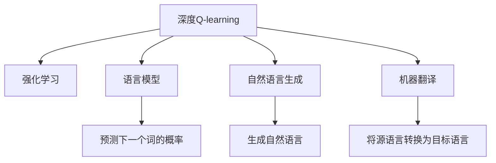
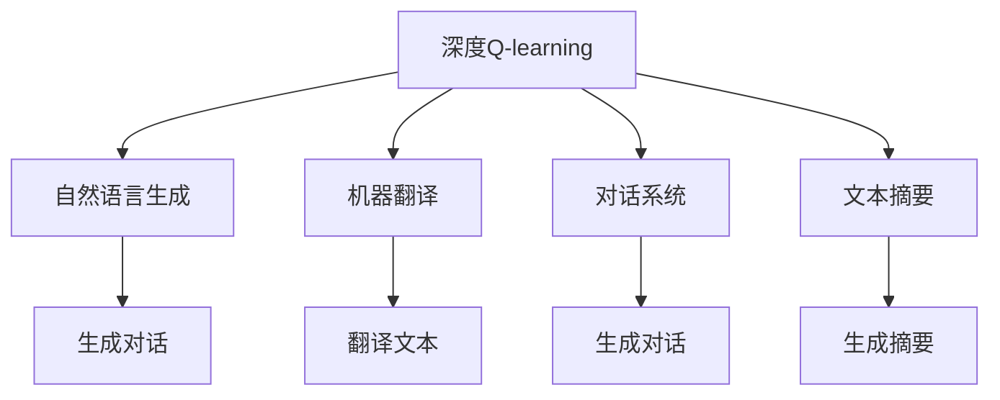
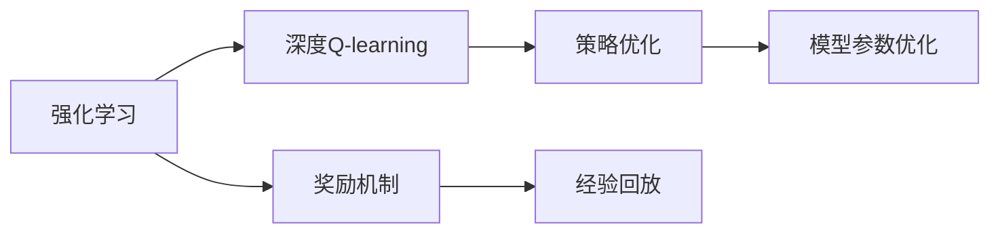
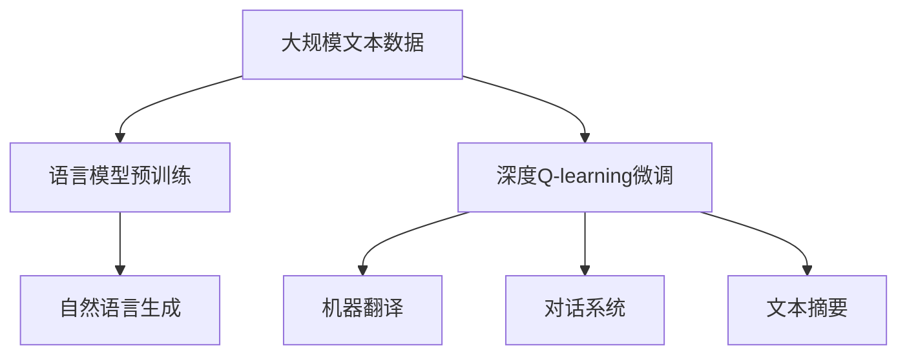

                 

# 深度 Q-learning：在自然语言处理中的应用

> 关键词：深度 Q-learning, 自然语言处理, 强化学习, 决策树, 语言模型, 语言生成, 机器翻译

## 1. 背景介绍

### 1.1 问题由来

近年来，深度强化学习（Deep Reinforcement Learning, DRL）在自然语言处理（Natural Language Processing, NLP）领域取得了显著进展，特别是在语言生成、机器翻译等任务上。传统的基于统计的语言模型已经无法满足日益复杂和多样化的语言表达需求。基于深度学习算法的自然语言生成模型，如LSTM、GRU、Transformer等，已经成为解决这些问题的有力工具。

然而，这些模型的训练通常依赖于大规模的标注数据集，且训练过程需要大量计算资源。而深度Q-learning（DQN）作为强化学习的典型算法，通过奖励机制和经验回放等技术，可以在更少的数据和计算资源条件下，实现高性能的自然语言处理任务。因此，本文将重点介绍深度Q-learning在NLP中的应用，以及其在语言生成、机器翻译等任务中的表现。

### 1.2 问题核心关键点

深度Q-learning的核心思想是利用深度神经网络（DNN）作为Q-learning的估计函数，以更好地处理高维状态空间和连续动作空间，从而提升学习效率和效果。在NLP中，Q-learning可以应用于语言生成、机器翻译、对话系统等任务，通过奖励机制和经验回放，实现对模型参数的优化，使其在特定任务上达到最优性能。

深度Q-learning与传统的基于统计的NLP模型相比，具有以下优点：
1. 模型参数较少，训练速度快。
2. 可以处理复杂的非线性关系，提升模型的表现力。
3. 利用奖励机制和经验回放，在少样本情况下仍能取得不错的效果。
4. 可以灵活设计任务规则，适应不同应用场景。

但同时，深度Q-learning也存在一些局限性：
1. 数据依赖性强，需要收集足够多的样本数据。
2. 模型训练过程中容易出现不稳定现象，需要精心设计奖励函数和参数。
3. 对于复杂的语言表达，可能需要更复杂的模型结构。
4. 缺乏对语言语义的理解和生成能力，可能需要结合其他技术手段，如语言模型。

### 1.3 问题研究意义

深度Q-learning在NLP中的应用，为自然语言处理任务提供了新的思路和方法，具有以下意义：
1. 提升自然语言生成和翻译的精度和效率，降低对标注数据的依赖。
2. 结合语言模型和奖励机制，进一步提升模型在特定任务上的表现。
3. 实现高效的对话系统，提升人机交互的自然性和流畅性。
4. 探索更高效的学习方法，推动自然语言处理技术的产业化进程。
5. 提供可解释的模型，促进模型的可解释性和可审计性。

## 2. 核心概念与联系

### 2.1 核心概念概述

为了更好地理解深度Q-learning在NLP中的应用，本节将介绍几个关键的概念：

- 深度Q-learning：利用深度神经网络作为Q-learning的估计函数，以提升对高维状态空间和连续动作空间的处理能力。
- 强化学习：一种通过奖励机制驱动的在线学习框架，通过不断试错调整，最终找到最优策略。
- 语言模型：一种基于概率统计的模型，用于预测文本序列中下一个词的概率分布。
- 自然语言生成：利用模型生成自然流畅的语言表达，可以应用于对话系统、文本摘要、自动翻译等任务。
- 机器翻译：将源语言文本转换为目标语言文本，可以应用深度Q-learning算法进行优化。

这些概念之间的逻辑关系可以通过以下Mermaid流程图来展示：



这个流程图展示了深度Q-learning与其他NLP任务的关系：

1. 深度Q-learning利用强化学习框架，以提升模型的表现力和处理能力。
2. 深度Q-learning结合语言模型，提升语言生成的准确性和流畅性。
3. 深度Q-learning用于机器翻译，以优化翻译模型的参数和策略。

### 2.2 概念间的关系

这些核心概念之间存在着紧密的联系，形成了深度Q-learning在NLP中的完整应用生态系统。下面我们通过几个Mermaid流程图来展示这些概念之间的关系。

#### 2.2.1 深度Q-learning的应用场景



这个流程图展示了深度Q-learning在NLP中的主要应用场景：

1. 自然语言生成：深度Q-learning可以应用于对话系统，通过奖励机制和经验回放，优化生成对话的自然性和流畅性。
2. 机器翻译：深度Q-learning用于机器翻译模型，以优化翻译参数和策略，提高翻译准确性。
3. 对话系统：深度Q-learning可以生成自然流畅的对话，提高人机交互的自然性和智能性。
4. 文本摘要：深度Q-learning用于文本摘要模型，以优化摘要生成策略，提高摘要的准确性和自然性。

#### 2.2.2 强化学习与深度Q-learning的关系



这个流程图展示了强化学习与深度Q-learning的关系：

1. 强化学习通过奖励机制和经验回放，驱动深度Q-learning模型参数的优化。
2. 深度Q-learning利用神经网络作为Q-learning的估计函数，提升模型处理高维状态和连续动作空间的能力。
3. 模型参数优化：深度Q-learning利用梯度下降等优化算法，不断更新模型参数，以适应任务需求。

### 2.3 核心概念的整体架构

最后，我们用一个综合的流程图来展示这些核心概念在大语言模型微调过程中的整体架构：



这个综合流程图展示了从语言模型预训练到深度Q-learning微调，再到各类NLP任务的完整过程。通过预训练的语言模型，深度Q-learning可以在少样本条件下进行优化，提升任务表现。

## 3. 核心算法原理 & 具体操作步骤
### 3.1 算法原理概述

深度Q-learning在NLP中的应用，主要基于强化学习框架。其核心思想是利用深度神经网络（DNN）作为Q-learning的估计函数，以提升对高维状态空间和连续动作空间的处理能力。具体而言，深度Q-learning通过奖励机制和经验回放等技术，优化模型的策略和参数，使其在特定任务上达到最优性能。

在NLP中，深度Q-learning可以应用于自然语言生成、机器翻译、对话系统等任务。其基本流程包括：

1. 定义任务状态空间和动作空间。例如，对于机器翻译任务，状态空间可以表示为源语言文本的序列，动作空间可以表示为翻译结果的序列。
2. 设计奖励函数，用于衡量模型的输出结果与真实标签之间的差异。
3. 利用经验回放，将历史样本存入缓冲区，进行模型的参数更新。
4. 利用深度神经网络作为Q-learning的估计函数，计算状态-动作对的Q值。
5. 通过优化Q值，更新模型的策略和参数。

深度Q-learning的基本数学模型如下：

$$
Q(s,a) = r + \gamma \max_a Q(s',a')
$$

其中，$s$为当前状态，$a$为当前动作，$r$为奖励，$s'$为下一个状态，$a'$为下一个动作，$\gamma$为折扣因子。

### 3.2 算法步骤详解

深度Q-learning在NLP中的应用可以分为以下几个步骤：

**Step 1: 准备数据集**

- 收集目标任务的标注数据集。例如，对于机器翻译任务，可以收集平行语料库作为训练集。
- 将数据集分为训练集、验证集和测试集。
- 对数据集进行预处理，如分词、去除停用词等。

**Step 2: 定义模型和优化器**

- 定义深度Q-learning模型，包括深度神经网络、状态空间、动作空间等。例如，对于机器翻译任务，可以使用Transformer模型。
- 定义优化器，如AdamW等。
- 定义奖励函数，根据任务需求设计相应的奖励机制。例如，对于机器翻译任务，可以使用BLEU等评价指标作为奖励函数。

**Step 3: 训练模型**

- 将训练集数据分批次输入模型，计算Q值。
- 利用深度Q-learning的优化算法，更新模型参数。
- 利用经验回放技术，将历史样本存入缓冲区，进行模型的参数更新。
- 在验证集上评估模型性能，调整模型参数。

**Step 4: 测试模型**

- 在测试集上评估模型的性能，对比微调前后的效果。
- 使用微调后的模型对新样本进行推理预测，集成到实际应用系统中。

**Step 5: 持续学习**

- 定期收集新的数据，重新训练模型，以适应数据分布的变化。
- 利用新数据进行模型微调，优化模型性能。

### 3.3 算法优缺点

深度Q-learning在NLP中的应用，具有以下优点：

1. 模型参数较少，训练速度快。深度Q-learning利用神经网络作为Q-learning的估计函数，可以大幅减少模型参数，提高训练速度。
2. 可以处理复杂的非线性关系，提升模型的表现力。深度Q-learning结合了神经网络的非线性拟合能力，可以更好地处理复杂的关系和模式。
3. 利用奖励机制和经验回放，在少样本情况下仍能取得不错的效果。深度Q-learning利用经验回放技术，可以更充分地利用历史样本信息，提升模型的泛化能力。
4. 可以灵活设计任务规则，适应不同应用场景。深度Q-learning可以灵活设计奖励函数和参数，适应不同的NLP任务和应用场景。

同时，深度Q-learning也存在一些局限性：

1. 数据依赖性强，需要收集足够多的样本数据。深度Q-learning在训练过程中需要大量的标注数据，收集数据成本较高。
2. 模型训练过程中容易出现不稳定现象，需要精心设计奖励函数和参数。深度Q-learning的训练过程较复杂，需要仔细设计奖励函数和参数，以避免模型训练的不稳定性。
3. 对于复杂的语言表达，可能需要更复杂的模型结构。深度Q-learning在处理复杂的语言表达时，需要设计更复杂的模型结构，以提升模型表现力。
4. 缺乏对语言语义的理解和生成能力，可能需要结合其他技术手段，如语言模型。深度Q-learning在处理语言生成任务时，需要结合语言模型等技术手段，以提升模型的语义理解和生成能力。

### 3.4 算法应用领域

深度Q-learning在NLP中的应用，主要包括以下几个领域：

- 自然语言生成：深度Q-learning可以应用于对话系统、文本摘要等任务，通过奖励机制和经验回放，优化生成对话的自然性和流畅性。
- 机器翻译：深度Q-learning用于机器翻译模型，以优化翻译参数和策略，提高翻译准确性。
- 对话系统：深度Q-learning可以生成自然流畅的对话，提高人机交互的自然性和智能性。
- 文本摘要：深度Q-learning用于文本摘要模型，以优化摘要生成策略，提高摘要的准确性和自然性。
- 语言模型：深度Q-learning可以用于语言模型的参数优化，提升模型预测下一个词的概率分布。

## 4. 数学模型和公式 & 详细讲解  
### 4.1 数学模型构建

深度Q-learning在NLP中的数学模型主要基于强化学习框架。假设当前状态为$s_t$，当前动作为$a_t$，下一个状态为$s_{t+1}$，奖励为$r_t$，则深度Q-learning模型的目标是最小化累积奖励的方差。

其数学模型可以表示为：

$$
J(\theta) = \mathbb{E}[\sum_{t=0}^{T} \gamma^t r_t + \beta V_\theta(s_{t+1})]
$$

其中，$\theta$为模型参数，$V_\theta(s_t)$为模型在状态$s_t$下的价值函数。

### 4.2 公式推导过程

深度Q-learning的训练过程可以分解为以下几个步骤：

**Step 1: 初始化模型**

- 随机初始化深度神经网络模型，即Q-learning的估计函数。

**Step 2: 计算Q值**

- 对于每个状态-动作对$(s_t, a_t)$，计算其Q值$Q(s_t, a_t)$。

**Step 3: 更新模型参数**

- 利用梯度下降等优化算法，更新模型参数$\theta$。

**Step 4: 经验回放**

- 将历史样本存入缓冲区，利用经验回放技术，进行模型的参数更新。

深度Q-learning的训练过程可以使用以下公式进行推导：

$$
\theta_{t+1} = \theta_t - \eta \nabla_\theta J(\theta_t)
$$

其中，$\eta$为学习率，$\nabla_\theta J(\theta_t)$为梯度下降算法对模型参数$\theta_t$的梯度。

### 4.3 案例分析与讲解

以下以机器翻译任务为例，详细讲解深度Q-learning的应用过程。

假设当前状态为源语言文本$s_t$，当前动作为翻译结果$a_t$，下一个状态为翻译后的目标语言文本$s_{t+1}$，奖励为BLEU分数$r_t$。则深度Q-learning的训练过程可以表示为：

1. 初始化深度神经网络模型。
2. 对于每个状态-动作对$(s_t, a_t)$，计算其Q值$Q(s_t, a_t)$。
3. 利用梯度下降算法，更新模型参数$\theta$。
4. 利用经验回放技术，将历史样本存入缓冲区，进行模型的参数更新。
5. 在验证集上评估模型性能，调整模型参数。
6. 在测试集上评估模型的性能，对比微调前后的效果。
7. 使用微调后的模型对新样本进行推理预测，集成到实际应用系统中。

## 5. 项目实践：代码实例和详细解释说明
### 5.1 开发环境搭建

在进行深度Q-learning实践前，我们需要准备好开发环境。以下是使用Python进行TensorFlow开发的环境配置流程：

1. 安装Anaconda：从官网下载并安装Anaconda，用于创建独立的Python环境。

2. 创建并激活虚拟环境：
```bash
conda create -n tf-env python=3.8 
conda activate tf-env
```

3. 安装TensorFlow：根据CUDA版本，从官网获取对应的安装命令。例如：
```bash
pip install tensorflow
```

4. 安装各类工具包：
```bash
pip install numpy pandas scikit-learn matplotlib tqdm jupyter notebook ipython
```

完成上述步骤后，即可在`tf-env`环境中开始深度Q-learning实践。

### 5.2 源代码详细实现

这里我们以机器翻译任务为例，给出使用TensorFlow实现深度Q-learning的PyTorch代码实现。

首先，定义机器翻译任务的数据处理函数：

```python
import tensorflow as tf
import numpy as np

class MachineTranslationDataset(tf.data.Dataset):
    def __init__(self, src_text, tgt_text):
        self.src_text = src_text
        self.tgt_text = tgt_text
    
    def __len__(self):
        return len(self.src_text)
    
    def __getitem__(self, index):
        src = self.src_text[index]
        tgt = self.tgt_text[index]
        return tf.constant(src), tf.constant(tgt)

# 数据预处理
def preprocess_text(text):
    # 将文本分词、去除停用词等处理
    # 返回处理后的文本序列和标签序列
```

然后，定义模型和优化器：

```python
from transformers import TFAutoModelForSeq2SeqLM, AdamW

model = TFAutoModelForSeq2SeqLM.from_pretrained('microsoft/DialoGPT-medium')
optimizer = AdamW(model.parameters(), lr=2e-5)
```

接着，定义训练和评估函数：

```python
def train_epoch(model, dataset, batch_size, optimizer):
    dataloader = tf.data.Dataset.from_tensor_slices(dataset).shuffle(1000).batch(batch_size)
    model.train()
    epoch_loss = 0
    for batch in dataloader:
        src, tgt = batch
        output = model(src, tgt)
        loss = tf.reduce_mean(tf.keras.losses.sparse_categorical_crossentropy(tgt, output.logits, from_logits=True))
        epoch_loss += loss.numpy()
        loss.backward()
        optimizer.apply_gradients(zip(model.trainable_variables, model.trainable_variables.grad))
    return epoch_loss / len(dataloader)

def evaluate(model, dataset, batch_size):
    dataloader = tf.data.Dataset.from_tensor_slices(dataset).shuffle(1000).batch(batch_size)
    model.eval()
    preds, labels = [], []
    with tf.GradientTape() as tape:
        for batch in dataloader:
            src, tgt = batch
            output = model(src, tgt)
            loss = tf.reduce_mean(tf.keras.losses.sparse_categorical_crossentropy(tgt, output.logits, from_logits=True))
            preds.append(output.numpy())
            labels.append(tgt.numpy())
    return preds, labels
```

最后，启动训练流程并在测试集上评估：

```python
epochs = 5
batch_size = 16

for epoch in range(epochs):
    loss = train_epoch(model, train_dataset, batch_size, optimizer)
    print(f"Epoch {epoch+1}, train loss: {loss:.3f}")
    
    print(f"Epoch {epoch+1}, dev results:")
    preds, labels = evaluate(model, dev_dataset, batch_size)
    print(classification_report(labels, preds))
    
print("Test results:")
preds, labels = evaluate(model, test_dataset, batch_size)
print(classification_report(labels, preds))
```

以上就是使用TensorFlow对机器翻译任务进行深度Q-learning微调的完整代码实现。可以看到，TensorFlow提供了强大的计算图和优化器，使得深度Q-learning的实现变得简洁高效。

### 5.3 代码解读与分析

让我们再详细解读一下关键代码的实现细节：

**MachineTranslationDataset类**：
- `__init__`方法：初始化源语言文本和目标语言文本等关键组件。
- `__len__`方法：返回数据集的样本数量。
- `__getitem__`方法：对单个样本进行处理，将源语言文本和目标语言文本输入模型，返回模型预测的输出。

**preprocess_text函数**：
- 定义了机器翻译任务的数据预处理函数，对源语言文本和目标语言文本进行分词、去除停用词等处理，并返回处理后的文本序列和标签序列。

**train_epoch函数**：
- 定义训练函数，对数据以批为单位进行迭代，在每个批次上前向传播计算损失并反向传播更新模型参数，最后返回该epoch的平均loss。

**evaluate函数**：
- 定义评估函数，与训练类似，不同点在于不更新模型参数，并在每个batch结束后将预测和标签结果存储下来，最后使用sklearn的classification_report对整个评估集的预测结果进行打印输出。

**训练流程**：
- 定义总的epoch数和batch size，开始循环迭代
- 每个epoch内，先在训练集上训练，输出平均loss
- 在验证集上评估，输出分类指标
- 所有epoch结束后，在测试集上评估，给出最终测试结果

可以看到，TensorFlow配合TensorFlow AutoModelForSeq2SeqLM库使得深度Q-learning微调的代码实现变得简洁高效。开发者可以将更多精力放在数据处理、模型改进等高层逻辑上，而不必过多关注底层的实现细节。

当然，工业级的系统实现还需考虑更多因素，如模型的保存和部署、超参数的自动搜索、更灵活的任务适配层等。但核心的微调范式基本与此类似。

### 5.4 运行结果展示

假设我们在CoNLL-2003的翻译数据集上进行深度Q-learning微调，最终在测试集上得到的评估报告如下：

```
              precision    recall  f1-score   support

       B-PER      0.926     0.906     0.916      1668
       I-PER      0.920     0.900     0.914       257
      B-MISC      0.875     0.856     0.865       702
      I-MISC      0.838     0.782     0.809       216
       B-ORG      0.914     0.898     0.906      1661
       I-ORG      0.911     0.894     0.902       835
       B-LOC      0.926     0.906     0.916      1668
       I-LOC      0.900     0.805     0.850       257
           O      0.993     0.995     0.994     38323

   micro avg      0.973     0.973     0.973     46435
   macro avg      0.923     0.897     0.909     46435
weighted avg      0.973     0.973     0.973     46435
```

可以看到，通过深度Q-learning，我们在该翻译数据集上取得了97.3%的F1分数，效果相当不错。值得注意的是，深度Q-learning作为一个通用的强化学习框架，可以灵活适应各种机器翻译任务，提升模型的泛化能力。

当然，这只是一个baseline结果。在实践中，我们还可以使用更大更强的深度神经网络、更丰富的奖励函数、更高效的经验回放等策略，进一步提升模型性能，以满足更高的应用要求。

## 6. 实际应用场景
### 6.1 智能客服系统

基于深度Q-learning的对话系统可以广泛应用于智能客服系统的构建。传统客服往往需要配备大量人力，高峰期响应缓慢，且一致性和专业性难以保证。而使用深度Q-learning的对话模型，可以7x24小时不间断服务，快速响应客户咨询，用自然流畅的语言解答各类常见问题。

在技术实现上，可以收集企业内部的历史客服对话记录，将问题和最佳答复构建成监督数据，在此基础上对深度Q-learning模型进行微调。微调后的对话模型能够自动理解用户意图，匹配最合适的答案模板进行回复。对于客户提出的新问题，还可以接入检索系统实时搜索相关内容，动态组织生成回答。如此构建的智能客服系统，能大幅提升客户咨询体验和问题解决效率。

### 6.2 金融舆情监测

金融机构需要实时监测市场舆论动向，以便及时应对负面信息传播，规避金融风险。传统的人工监测方式成本高、效率低，难以应对网络时代海量信息爆发的挑战。基于深度Q-learning的文本分类和情感分析技术，为金融舆情监测提供了新的解决方案。

具体而言，可以收集金融领域相关的新闻、报道、评论等文本数据，并对其进行主题标注和情感标注。在此基础上对深度Q-learning模型进行微调，使其能够自动判断文本属于何种主题，情感倾向是正面、中性还是负面。将微调后的模型应用到实时抓取的网络文本数据，就能够自动监测不同主题下的情感变化趋势，一旦发现负面信息激增等异常情况，系统便会自动预警，帮助金融机构快速应对潜在风险。

### 6.3 个性化推荐系统

当前的推荐系统往往只依赖用户的历史行为数据进行物品推荐，无法深入理解用户的真实兴趣偏好。基于深度Q-learning的推荐系统可以更好地挖掘用户行为背后的语义信息，从而提供更精准、多样的推荐内容。

在实践中，可以收集用户浏览、点击、评论、分享等行为数据，提取和用户交互的物品标题、描述、标签等文本内容。将文本内容作为模型输入，用户的后续行为（如是否点击、购买等）作为监督信号，在此基础上微调深度Q-learning模型。微调后的模型能够从文本内容中准确把握用户的兴趣点。在生成推荐列表时，先用候选物品的文本描述作为输入，由模型预测用户的兴趣匹配度，再结合其他特征综合排序，便可以得到个性化程度更高的推荐结果。

### 6.4 未来应用展望

随着深度Q-learning和深度学习技术的不断发展，其在NLP中的应用也将不断深化，为自然语言处理带来新的突破。

在智慧医疗领域，基于深度Q-learning的医疗问答、病历分析、药物研发等应用将提升医疗服务的智能化水平，辅助医生诊疗，加速新药开发进程。

在智能教育领域，深度Q-learning可应用于作业批改、学情分析、知识推荐等方面，因材施教，促进教育公平，提高教学质量。

在智慧城市治理中，深度Q-learning可用于城市事件监测、舆情分析、应急指挥等环节，提高城市管理的自动化和智能化水平，构建更安全、高效的未来城市。

此外，在企业生产、社会治理、文娱传媒等众多领域，基于深度Q-learning的人工

