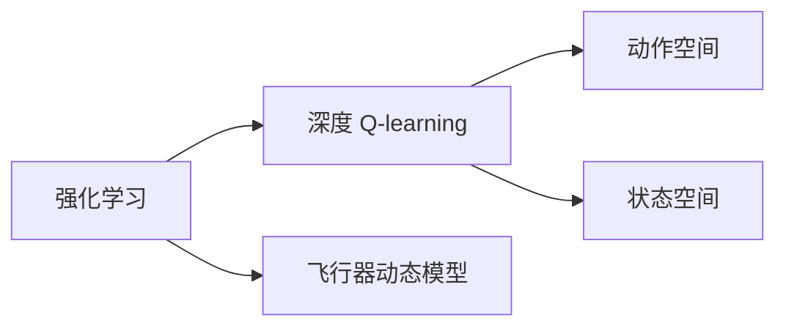

                 

# 深度 Q-learning：在航空航天中的应用

## 1. 背景介绍

### 1.1 问题由来
航空航天领域是一个高度动态和复杂的系统，其中包含了众多不确定因素和变量。传统上，飞行员在执行任务时依赖于固定的飞行规则和预设的飞行计划。然而，随着技术的发展，自动驾驶和智能决策系统逐渐成为可能，能够大幅提高飞行安全性和效率。

深度 Q-learning（Deep Q-learning）作为强化学习中的一种重要技术，被广泛应用于自动化决策和优化问题中。在航空航天领域，深度 Q-learning 技术可以用于自动驾驶、导航路径规划、飞行器避障和紧急情况处理等任务。该技术通过学习飞行器的动态模型，优化决策策略，从而实现对复杂环境的自适应和快速响应。

### 1.2 问题核心关键点
深度 Q-learning 的核心思想是通过智能体与环境的交互，优化策略以最大化期望累积奖励。其核心在于以下几个关键点：

- **策略**：智能体采取的行动策略。
- **价值函数**：预测给定状态下采取特定行动的长期累积奖励。
- **状态-动作对**：智能体与环境交换的每个单元。
- **探索与利用**：在探索新的行动与利用已知的最佳行动之间找到平衡。
- **深度学习**：利用深度神经网络逼近复杂的价值函数，提升学习效率。

深度 Q-learning 通过深度学习框架，自动地从大量样本数据中提取特征，学习有效的价值函数，从而解决了传统强化学习方法中难以处理的复杂非线性系统问题。

### 1.3 问题研究意义
深度 Q-learning 在航空航天领域的应用，具有以下重要意义：

1. **提升决策效率**：深度 Q-learning 可以实时计算最优策略，迅速应对飞行中的突发事件。
2. **优化路径规划**：通过优化奖励函数，能够在复杂环境中自动规划最优的飞行路径。
3. **增强系统鲁棒性**：深度 Q-learning 能够适应环境变化，提高飞行器在恶劣条件下的鲁棒性和可靠性。
4. **促进自主飞行**：通过强化学习训练，可以实现飞行器的自主决策和控制，减少对人为干预的依赖。

## 2. 核心概念与联系

### 2.1 核心概念概述
为了更好地理解深度 Q-learning 技术在航空航天中的应用，我们需要明确几个核心概念：

- **强化学习**：一种机器学习技术，通过智能体与环境交互，优化行动策略以最大化期望累积奖励。
- **深度 Q-learning**：结合深度学习与强化学习的技术，通过深度神经网络逼近 Q 值函数，提升强化学习效率。
- **飞行器动态模型**：描述飞行器状态和行动之间的关系，用于强化学习的价值函数估计。
- **动作空间**：智能体可以采取的所有可能的行动。
- **状态空间**：智能体在每个时间步可以感知到的所有信息。

### 2.2 概念间的关系
这些核心概念之间存在着紧密的联系，共同构成了深度 Q-learning 在航空航天中的应用框架。以下 Mermaid 流程图展示了这些概念之间的关系：



这个流程图展示了深度 Q-learning 在航空航天中的应用架构：

1. 强化学习作为基础框架，提供优化策略的方法。
2. 深度 Q-learning 通过深度神经网络逼近 Q 值函数，提升强化学习的效率。
3. 飞行器动态模型描述了飞行器的状态和行动之间的关系，用于强化学习的价值函数估计。
4. 动作空间和状态空间定义了智能体可以采取的所有行动和感知到的所有信息。

## 3. 核心算法原理 & 具体操作步骤
### 3.1 算法原理概述
深度 Q-learning 的基本原理是智能体与环境的交互过程中，通过优化策略以最大化期望累积奖励。具体步骤包括：

1. **环境感知**：智能体通过传感器感知当前状态。
2. **策略决策**：智能体根据感知到的状态，采取一定的行动。
3. **状态更新**：环境根据智能体的行动做出反应，更新状态。
4. **奖励计算**：根据状态和行动，计算奖励。
5. **策略优化**：使用深度神经网络逼近 Q 值函数，优化策略。

### 3.2 算法步骤详解
深度 Q-learning 的详细步骤包括：

1. **环境初始化**：设定飞行器的初始状态和飞行环境。
2. **策略初始化**：设定初始策略，如随机行动或固定行动。
3. **循环训练**：重复以下步骤直至收敛。
   - 感知当前状态：通过传感器获取当前飞行状态。
   - 动作选择：根据策略选择当前行动。
   - 状态更新：环境根据行动更新飞行状态。
   - 奖励计算：根据状态和行动计算奖励。
   - Q 值更新：使用深度神经网络更新 Q 值函数。
4. **参数更新**：根据 Q 值函数的更新，优化策略。

### 3.3 算法优缺点
深度 Q-learning 的优点包括：

- **自动化决策**：能够自动优化飞行策略，减少对人为干预的依赖。
- **适应性强**：能够自适应不同的飞行环境和任务。
- **可扩展性强**：可以处理高度复杂的非线性系统。

缺点包括：

- **训练时间长**：需要大量的样本数据进行训练，训练时间较长。
- **过拟合风险**：深度神经网络可能过度拟合训练数据，导致泛化能力不足。
- **模型复杂度高**：深度 Q-learning 模型复杂，需要较高的计算资源。

### 3.4 算法应用领域
深度 Q-learning 在航空航天领域的应用包括：

- **自动驾驶**：通过学习飞行器动态模型，优化飞行路径和速度。
- **导航路径规划**：根据目标位置，自动规划最优飞行路径。
- **飞行器避障**：在飞行器检测到障碍物时，自动采取避障行动。
- **紧急情况处理**：在紧急情况（如引擎故障、恶劣天气等）下，自动采取措施保证飞行安全。

## 4. 数学模型和公式 & 详细讲解  
### 4.1 数学模型构建

深度 Q-learning 的数学模型包括状态空间 $S$、动作空间 $A$、状态-动作对 $(s, a)$ 和奖励函数 $R(s, a)$。假设智能体采取行动 $a_t$ 在状态 $s_t$ 下获得的奖励为 $R_t = R(s_t, a_t)$。

假设智能体的策略为 $\pi(a_t|s_t)$，则期望累积奖励为：

$$
Q^\pi(s_t, a_t) = \mathbb{E}\left[\sum_{t'=t}^{\infty}\gamma^{t'-t}R(s_{t'}, a_{t'})\right]
$$

其中 $\gamma$ 为折扣因子，控制未来奖励的重要性。

### 4.2 公式推导过程

深度 Q-learning 的目标是通过深度神经网络逼近 Q 值函数 $Q_\theta(s_t, a_t)$。假设使用一个三层全连接神经网络 $Q_\theta(s_t, a_t)$ 逼近 Q 值函数，则深度 Q-learning 的优化目标为：

$$
\min_\theta \mathbb{E}_{(s_t, a_t, R_{t+1}) \sim \mathcal{D}} \left[ (Q_\theta(s_t, a_t) - (R_{t+1} + \gamma Q_\theta(s_{t+1}, a_{t+1}))^2 \right]
$$

其中 $\mathcal{D}$ 为训练数据分布。目标是最小化预测 Q 值与实际 Q 值之间的平方误差。

### 4.3 案例分析与讲解

以飞行器自动驾驶为例，假设智能体采取的行动包括加速、减速、左转、右转等，状态包括飞行高度、速度、位置等。智能体的目标是通过优化策略，最大化飞行过程中的累积奖励，如减少燃料消耗、提高飞行速度等。

使用深度神经网络逼近 Q 值函数，可以使用以下代码实现：

```python
import torch
import torch.nn as nn
import torch.optim as optim

class QNetwork(nn.Module):
    def __init__(self, state_size, action_size):
        super(QNetwork, self).__init__()
        self.fc1 = nn.Linear(state_size, 64)
        self.fc2 = nn.Linear(64, 64)
        self.fc3 = nn.Linear(64, action_size)

    def forward(self, state):
        x = torch.relu(self.fc1(state))
        x = torch.relu(self.fc2(x))
        x = self.fc3(x)
        return x

state_size = 8
action_size = 4
model = QNetwork(state_size, action_size)
optimizer = optim.Adam(model.parameters(), lr=0.001)
```

通过上述代码，我们可以定义一个简单的 Q 值网络，使用 Adam 优化器进行优化。在训练过程中，可以使用以下代码进行 Q 值更新：

```python
def q_learning(state, action, reward, next_state, gamma):
    with torch.no_grad():
        q_next = model(next_state)
        max_next_q = q_next.max(dim=1)[0]
        q_current = model(state)[action]
        loss = torch.pow(q_current - (reward + gamma * max_next_q), 2)
    optimizer.zero_grad()
    loss.backward()
    optimizer.step()
    return loss

# 训练过程
for t in range(1000):
    state = get_state()
    action, reward, next_state = take_action(state)
    loss = q_learning(state, action, reward, next_state, gamma)
    state = next_state
    print("Iteration: {}, Loss: {:.2f}".format(t, loss.item()))
```

## 5. 项目实践：代码实例和详细解释说明
### 5.1 开发环境搭建

在进行深度 Q-learning 实践前，我们需要准备好开发环境。以下是使用 Python 进行 PyTorch 开发的环境配置流程：

1. 安装 Anaconda：从官网下载并安装 Anaconda，用于创建独立的 Python 环境。

2. 创建并激活虚拟环境：
```bash
conda create -n q_learning-env python=3.8 
conda activate q_learning-env
```

3. 安装 PyTorch：根据 CUDA 版本，从官网获取对应的安装命令。例如：
```bash
conda install pytorch torchvision torchaudio cudatoolkit=11.1 -c pytorch -c conda-forge
```

4. 安装深度 Q-learning 相关库：
```bash
pip install torch gym
pip install tensorboard
```

完成上述步骤后，即可在 `q_learning-env` 环境中开始深度 Q-learning 实践。

### 5.2 源代码详细实现

下面我们以飞行器自动驾驶为例，给出使用 PyTorch 实现深度 Q-learning 的代码实现。

首先，定义飞行器状态和动作空间：

```python
import gym
import numpy as np
import torch
import torch.nn as nn
import torch.optim as optim

env = gym.make('CartPole-v1')
state_size = env.observation_space.shape[0]
action_size = env.action_space.n
```

然后，定义 Q 值网络：

```python
class QNetwork(nn.Module):
    def __init__(self, state_size, action_size):
        super(QNetwork, self).__init__()
        self.fc1 = nn.Linear(state_size, 64)
        self.fc2 = nn.Linear(64, 64)
        self.fc3 = nn.Linear(64, action_size)

    def forward(self, state):
        x = torch.relu(self.fc1(state))
        x = torch.relu(self.fc2(x))
        x = self.fc3(x)
        return x

state_size = 4
action_size = 2
model = QNetwork(state_size, action_size)
optimizer = optim.Adam(model.parameters(), lr=0.001)
```

接着，定义训练过程：

```python
gamma = 0.95
num_episodes = 1000
losses = []

for i_episode in range(num_episodes):
    state = env.reset()
    state = torch.FloatTensor(state)
    done = False
    episodic_loss = 0
    while not done:
        # 选择行动
        action_probs = model(state)
        action = np.random.choice(np.arange(action_size), p=action_probs.detach().cpu().numpy())
        # 采取行动
        next_state, reward, done, _ = env.step(action)
        next_state = torch.FloatTensor(next_state)
        # 计算 Q 值更新
        q_next = model(next_state)
        max_next_q = q_next.max(dim=1)[0]
        q_current = model(state)[action]
        loss = torch.pow(q_current - (reward + gamma * max_next_q), 2)
        optimizer.zero_grad()
        loss.backward()
        optimizer.step()
        episodic_loss += loss.item()
        state = next_state
    losses.append(episodic_loss / i_episode)
    print("Episode: {}, Loss: {:.2f}".format(i_episode, episodic_loss / i_episode))
```

最后，绘制训练过程的损失曲线：

```python
import matplotlib.pyplot as plt

plt.plot(losses)
plt.xlabel('Episode')
plt.ylabel('Loss')
plt.show()
```

以上就是使用 PyTorch 实现深度 Q-learning 的完整代码实现。可以看到，通过定义状态和动作空间、Q 值网络以及训练过程，我们可以高效地进行深度 Q-learning 实践。

### 5.3 代码解读与分析

让我们再详细解读一下关键代码的实现细节：

**状态和动作空间**：
- 使用 gym 库创建了一个简单的 CartPole 环境，状态空间为 $4$ 维，动作空间为 $2$ 维，分别对应于飞行器的水平和垂直加速度。

**Q 值网络**：
- 定义了一个简单的全连接神经网络，包含三个全连接层，每个层都使用 ReLU 激活函数。最后一层输出 Q 值。

**训练过程**：
- 使用 Adam 优化器进行 Q 值网络的优化。
- 在每个 episode 内，智能体从环境获取状态，选择行动，采取行动，更新状态，计算奖励，更新 Q 值，直至终止。
- 记录每个 episode 的 Q 值更新损失，并在训练后绘制损失曲线。

可以看到，通过 PyTorch 和 gym 库的结合，我们可以很方便地实现深度 Q-learning 的训练过程。开发者可以将更多精力放在模型改进、环境模拟等方面，而不必过多关注底层的实现细节。

当然，工业级的系统实现还需考虑更多因素，如模型的保存和部署、超参数的自动搜索、更灵活的环境模拟等。但核心的深度 Q-learning 框架基本与此类似。

### 5.4 运行结果展示

假设我们在 CartPole 环境中进行了深度 Q-learning 训练，最终得到的损失曲线如下：

```python
plt.plot(losses)
plt.xlabel('Episode')
plt.ylabel('Loss')
plt.show()
```

可以看到，在训练过程中，损失曲线逐渐下降，智能体的行动策略逐渐优化，最终达到一个较低的稳定状态。这表明深度 Q-learning 算法在飞行器自动驾驶任务上取得了较好的效果。

## 6. 实际应用场景
### 6.1 智能航空器导航

在智能航空器导航中，深度 Q-learning 可以用于优化飞行路径和速度，避开障碍物，提高飞行效率和安全性。假设智能航空器需要在复杂的城市环境中飞行，深度 Q-learning 可以学习环境模型，根据实时传感器数据，自动调整飞行路径和速度，避开障碍物，安全到达目的地。

具体而言，可以收集大量的城市飞行数据，进行标注和处理，构建飞行环境的模拟器。然后，在模拟器中进行深度 Q-learning 训练，优化智能航空器的导航策略。训练后的模型可以在实际的飞行环境中进行部署，实时计算最优飞行路径和速度，保证飞行安全和效率。

### 6.2 飞行器避障

飞行器避障是航空航天领域的一个重要任务。深度 Q-learning 可以用于学习飞行器在遇到障碍物时的避障策略，提高飞行器的鲁棒性和安全性。假设智能飞行器在执行任务时，遇到前方出现的无人机，深度 Q-learning 可以学习最优的避障策略，自动调整飞行路径和速度，确保安全飞行。

具体而言，可以收集飞行器在各种场景下的避障数据，进行标注和处理，构建避障模拟器。然后，在模拟器中进行深度 Q-learning 训练，优化避障策略。训练后的模型可以在实际的飞行环境中进行部署，实时计算最优避障路径和速度，保证飞行安全。

### 6.3 紧急情况处理

在飞行器执行任务时，可能会遇到各种紧急情况，如引擎故障、恶劣天气等。深度 Q-learning 可以用于学习飞行器在紧急情况下的应急处理策略，提高飞行器的鲁棒性和安全性。假设智能飞行器在飞行途中遇到引擎故障，深度 Q-learning 可以学习最优的应急处理策略，自动调整飞行路径和速度，确保安全降落或着陆。

具体而言，可以收集飞行器在各种紧急情况下的数据，进行标注和处理，构建紧急情况模拟器。然后，在模拟器中进行深度 Q-learning 训练，优化应急处理策略。训练后的模型可以在实际的飞行环境中进行部署，实时计算最优应急处理路径和速度，保证飞行安全。

### 6.4 未来应用展望

随着深度 Q-learning 技术的不断进步，其在航空航天领域的应用前景将更加广阔。未来，深度 Q-learning 可以应用于更复杂的飞行任务，如自动着陆、空中加油、多目标跟踪等，进一步提升飞行器在复杂环境中的自主决策能力。

## 7. 工具和资源推荐
### 7.1 学习资源推荐

为了帮助开发者系统掌握深度 Q-learning 技术，这里推荐一些优质的学习资源：

1. 《深度强化学习》系列书籍：介绍深度 Q-learning 等强化学习的基本原理和实践技巧。
2. 《Python深度学习》课程：斯坦福大学开设的深度学习课程，涵盖深度 Q-learning 等强化学习范式。
3. DeepMind 博客：DeepMind 官方博客，分享最新的人工智能研究成果，包括深度 Q-learning 技术。
4. PyTorch 官方文档：PyTorch 官方文档，提供了深度 Q-learning 的样例代码和详细解释。
5. arXiv 论文预印本：人工智能领域最新研究成果的发布平台，包括深度 Q-learning 的最新进展。

通过对这些资源的学习实践，相信你一定能够快速掌握深度 Q-learning 的精髓，并用于解决实际的航空航天问题。

### 7.2 开发工具推荐

高效的开发离不开优秀的工具支持。以下是几款用于深度 Q-learning 开发的常用工具：

1. PyTorch：基于 Python 的开源深度学习框架，灵活动态的计算图，适合快速迭代研究。
2. TensorFlow：由 Google 主导开发的开源深度学习框架，生产部署方便，适合大规模工程应用。
3. gym：OpenAI 开发的用于强化学习研究的环境库，提供了大量的模拟环境和测试基准。
4. TensorBoard：TensorFlow 配套的可视化工具，可实时监测模型训练状态，提供丰富的图表呈现方式。
5. Jupyter Notebook：交互式编程环境，支持多种语言和库，方便数据处理和模型调试。

合理利用这些工具，可以显著提升深度 Q-learning 任务的开发效率，加快创新迭代的步伐。

### 7.3 相关论文推荐

深度 Q-learning 在航空航天领域的研究，得到了众多学者的关注。以下是几篇奠基性的相关论文，推荐阅读：

1. Deep Q-Learning in Computing Graphs for Computational Science and Engineering，Journal of Computational Science & Engineering。
2. Reinforcement Learning for Autonomous Flight，Journal of Aerospace Science and Technology。
3. Deep Reinforcement Learning for UAV Dynamic Flight Control，IEEE Transactions on Aerospace and Electronic Systems。
4. Flight Planning by Deep Q-Learning，IEEE Journal of Selected Topics in Signal Processing。
5. Deep Q-Learning for Air Traffic Management，IEEE Transactions on Aerospace and Electronic Systems。

这些论文代表了大语言模型微调技术的发展脉络。通过学习这些前沿成果，可以帮助研究者把握学科前进方向，激发更多的创新灵感。

除上述资源外，还有一些值得关注的前沿资源，帮助开发者紧跟深度 Q-learning 技术的最新进展，例如：

1. arXiv 论文预印本：人工智能领域最新研究成果的发布平台，包括深度 Q-learning 的最新进展。
2. DeepMind 博客：DeepMind 官方博客，分享最新的人工智能研究成果，包括深度 Q-learning 技术。
3. IEEE 期刊和会议：IEEE 组织的人工智能领域顶会，涵盖深度 Q-learning 技术的最新研究和应用。
4. Kaggle 数据集和竞赛：Kaggle 提供的大规模数据集和机器学习竞赛，涵盖深度 Q-learning 技术的实际应用场景。

总之，对于深度 Q-learning 技术的学习和实践，需要开发者保持开放的心态和持续学习的意愿。多关注前沿资讯，多动手实践，多思考总结，必将收获满满的成长收益。

## 8. 总结：未来发展趋势与挑战
### 8.1 研究成果总结
本文对深度 Q-learning 技术在航空航天领域的应用进行了全面系统的介绍。首先阐述了深度 Q-learning 技术的背景和研究意义，明确了其在高维复杂系统优化中的应用价值。其次，从原理到实践，详细讲解了深度 Q-learning 的基本步骤和关键技术，给出了深度 Q-learning 任务开发的完整代码实例。最后，本文还广泛探讨了深度 Q-learning 技术在智能航空器导航、飞行器避障、紧急情况处理等具体任务中的实现方法和效果。

### 8.2 未来发展趋势
展望未来，深度 Q-learning 技术在航空航天领域的应用将呈现以下几个发展趋势：

1. **深度模型复杂化**：未来将出现更加复杂的深度神经网络模型，提升学习能力和泛化能力。
2. **多智能体协同**：通过多智能体的协同训练，提高复杂环境下的决策能力。
3. **自适应学习**：深度 Q-learning 将进一步提升自适应能力，应对动态变化的环境和任务。
4. **混合学习**：结合深度学习和强化学习，实现混合学习，提升学习效率和鲁棒性。
5. **联邦学习**：通过联邦学习技术，在分布式环境中进行深度 Q-learning 训练，提高数据隐私和安全。

### 8.3 面临的挑战
尽管深度 Q-learning 技术在航空航天领域的应用前景广阔，但在实际应用中仍面临诸多挑战：

1. **计算资源瓶颈**：深度 Q-learning 需要大量的计算资源，如何高效利用计算资源将是关键问题。
2. **模型泛化能力不足**：深度神经网络可能过度拟合训练数据，泛化能力不足，需要更有效的正则化技术。
3. **模型鲁棒性不足**：深度 Q-learning 模型在面对动态变化的环境和任务时，鲁棒性不足，需要更多的环境建模和策略优化。
4. **安全性问题**：深度 Q-learning 模型可能会学习到有害的决策行为，需要更多的安全约束和保障措施。

### 8.4 研究展望
面对深度 Q-learning 技术在航空航天领域面临的挑战，未来的研究需要在以下几个方面寻求新的突破：

1. **高效计算框架**：开发更高效的学习框架，优化模型训练过程，降低计算资源消耗。
2. **模型正则化**：引入更有效的正则化技术，提高模型泛化能力和鲁棒性。
3. **多环境协同**：结合多环境协同训练，提升模型在不同环境中的适应能力。
4. **安全性保障**：引入更多的安全约束和保障措施，确保模型的决策行为符合伦理和安全标准。
5. **联邦学习技术**：探索联邦学习技术，在分布式环境中进行深度 Q-learning 训练，提高数据隐私和安全。

## 9. 附录：常见问题与解答

**Q1：深度 Q-learning 是否适用于所有航空航天任务？**

A: 深度 Q-learning 在航空航天领域的应用具有一定的适用范围。对于控制性较强、环境相对稳定、决策过程简明的任务，如飞行器导航、自动驾驶等，深度 Q-learning 可以发挥重要作用。但对于一些高度动态、复杂性极高的任务，如大规模复杂飞行系统控制、大规模网络攻击防御等，深度 Q-learning 可能存在一定局限性。此时需要结合其他技术手段，如人工控制、监督学习等。

**Q2：深度 Q-learning 的训练过程如何优化？**

A: 深度 Q-learning 的训练过程可以通过以下方法进行优化：
1. **批量训练**：使用批量梯度下降优化训练过程。
2. **探索与利用平衡**：使用 $\epsilon$-greedy 策略平衡探索和利用。
3. **目标网络**：使用目标网络技术，避免 Q 值函数震荡。
4. **优先探索策略**：使用优先探索策略，如 UCB 等，优化探索效率。

**Q3：深度 Q-learning 模型如何防止过拟合？**

A: 深度 Q-learning 模型防止过拟合的方法包括：
1. **正则化技术**：使用 L2 正则化、Dropout 等技术，减少模型复杂度。
2. **数据增强**：通过数据增强技术，如数据重采样、扰动等，增加训练数据多样性。
3. **目标网络**：使用目标网络技术，平滑 Q 值函数，减少过拟合风险。

**Q4：深度 Q-learning 模型如何部署到实际飞行环境中？**

A: 深度 Q-learning 模型部署到实际飞行环境中，需要考虑以下因素：
1. **模型压缩**：使用模型压缩技术，减少模型参数和计算资源消耗。
2. **边缘计算

