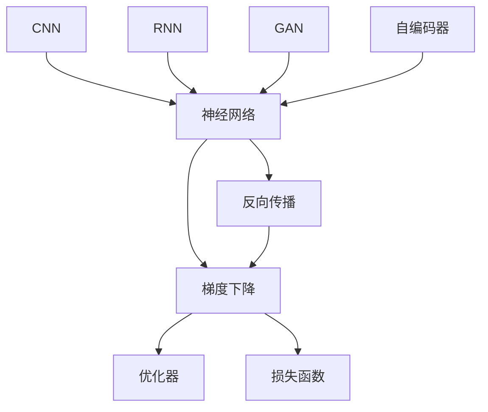

                 

# 深度学习 原理与代码实例讲解

> 关键词：深度学习,神经网络,反向传播,梯度下降,优化器,损失函数,卷积神经网络,循环神经网络,卷积神经网络(CNN),循环神经网络(RNN),生成对抗网络(GAN),自编码器,监督学习,无监督学习,强化学习,迁移学习,深度强化学习

## 1. 背景介绍

深度学习(Depend Learning, DL)是当今人工智能领域最炙手可热的话题之一，被广泛应用于图像识别、自然语言处理、语音识别、推荐系统等诸多领域。深度学习的核心是神经网络(Neural Network, NN)，它通过多层非线性变换，从原始数据中自动提取高层次特征，实现复杂模式的学习。本文将深入探讨深度学习的原理，并通过具体代码实例，展示其在图像、语音、文本等不同领域的运用。

### 1.1 深度学习的历史渊源

深度学习起源于1950年代的人工神经网络，但由于当时的硬件条件限制，以及算法技术的局限，神经网络难以实现大规模训练。直到2000年代，随着GPU的普及以及反向传播算法的优化，神经网络重新焕发生机。2006年，Hinton提出深度玻尔兹曼机(Deep Boltzmann Machine, DBM)，标志着深度学习时代的到来。

自那时起，深度学习技术不断发展，涌现出卷积神经网络(CNN)、循环神经网络(RNN)、生成对抗网络(GAN)等众多模型。2012年，ImageNet大规模视觉识别挑战赛的成功，验证了深度学习在图像识别领域的巨大潜力。此后，深度学习技术在自然语言处理(NLP)、语音识别、推荐系统等领域也取得了突破性进展。

### 1.2 深度学习的重要性

深度学习的重要意义在于其强大的模式学习能力，能够自动从原始数据中提取出复杂的特征，实现端到端的任务求解。相比于传统机器学习算法，深度学习不需要手动设计特征，能够更好地适应大规模、高维度数据的处理。例如，在图像识别中，深度学习模型能够自动学习物体的形状、颜色、纹理等特征，实现高精度的分类。在自然语言处理中，深度学习模型能够自动理解句子的语义和语法，实现精准的文本分析和生成。

## 2. 核心概念与联系

### 2.1 核心概念概述

为了更好地理解深度学习的原理，我们首先需要介绍几个关键的核心概念：

- 神经网络(Neural Network, NN)：由多个层次的神经元节点组成的网络结构，通过前向传播计算输出，通过反向传播调整权重，实现数据的表示和分类。
- 反向传播(Backpropagation)：通过链式法则计算输出误差对每个参数的梯度，用于更新网络权重。
- 梯度下降(Gradient Descent)：通过梯度下降算法，不断迭代更新权重，最小化损失函数，优化模型性能。
- 优化器(Optimizer)：用于更新参数的算法，包括SGD、Adam、Adagrad等。
- 损失函数(Loss Function)：用于衡量模型输出与真实标签之间的差异，如均方误差、交叉熵等。
- CNN：卷积神经网络，用于处理图像、视频等高维数据的神经网络，具备提取空间局部特征的能力。
- RNN：循环神经网络，用于处理序列数据的神经网络，具备记忆序列信息的能力。
- GAN：生成对抗网络，由生成器和判别器组成，用于生成逼真的假数据，提高数据增强的效果。
- 自编码器(Autoder)：一种无监督学习算法，通过重建输入数据实现特征提取，常用于数据降维和去噪。

这些核心概念共同构成了深度学习的基本框架，各组件之间通过前后向传播和参数更新，实现数据的自动处理和任务求解。

### 2.2 概念间的关系

这些核心概念之间的联系可以通过以下Mermaid流程图来展示：



这个流程图展示了深度学习的基本流程和各组件之间的关系：

1. 神经网络作为核心组件，通过前向传播和反向传播计算输出和误差。
2. 反向传播将误差传播到每个神经元，计算梯度。
3. 梯度下降根据梯度更新网络权重，优化模型性能。
4. 优化器用于控制梯度下降的步长和方向，提高算法的稳定性。
5. 损失函数用于衡量模型输出与真实标签之间的差异，指导优化过程。
6. CNN、RNN、GAN、自编码器等模型是神经网络的特殊形式，用于解决不同类型的数据和任务。

## 3. 核心算法原理 & 具体操作步骤

### 3.1 算法原理概述

深度学习的核心算法是前向传播和反向传播。前向传播通过多层神经网络计算输出，反向传播通过链式法则计算梯度，用于更新权重。以下是深度学习的基本原理：

1. 前向传播：将输入数据输入网络，通过多个层次的非线性变换，计算输出。

2. 损失函数计算：将输出与真实标签进行比较，计算误差。

3. 反向传播：通过链式法则计算误差对每个参数的梯度，用于更新权重。

4. 权重更新：根据梯度和学习率，更新每个参数的值，最小化损失函数。

### 3.2 算法步骤详解

以下我们详细介绍深度学习的核心算法步骤：

1. 准备数据集：选择适合的数据集，进行数据预处理，如归一化、数据增强等。

2. 构建神经网络模型：选择合适的网络结构，如CNN、RNN等，定义模型的层次结构。

3. 设置超参数：包括学习率、批量大小、迭代轮数等，控制模型训练过程。

4. 前向传播计算输出：将输入数据输入模型，计算各层次的输出。

5. 计算损失函数：将模型输出与真实标签进行比较，计算误差。

6. 反向传播计算梯度：通过链式法则计算误差对每个参数的梯度。

7. 更新权重：根据梯度和学习率，更新每个参数的值，最小化损失函数。

8. 评估模型：在测试集上评估模型性能，查看是否达到预设要求。

### 3.3 算法优缺点

深度学习的优点包括：

- 强大的学习能力：能够自动提取高层次特征，实现复杂模式的识别和生成。
- 端到端训练：从原始数据到最终输出，不需要手动设计特征，实现自动学习。
- 鲁棒性：通过多层非线性变换，能够较好地适应噪声和数据分布的变化。

深度学习的缺点包括：

- 参数量大：需要大量的标注数据和计算资源进行训练，训练时间长，存储量大。
- 复杂性：网络结构复杂，调试和优化难度大。
- 过拟合：网络结构复杂可能导致过拟合，模型泛化性能差。

### 3.4 算法应用领域

深度学习技术已经广泛应用于多个领域，包括：

- 计算机视觉：图像分类、目标检测、图像分割等。
- 自然语言处理：文本分类、机器翻译、语音识别等。
- 语音处理：语音识别、语音合成、情感分析等。
- 推荐系统：用户行为预测、商品推荐等。
- 游戏：强化学习、自动生成游戏策略等。

## 4. 数学模型和公式 & 详细讲解 & 举例说明

### 4.1 数学模型构建

深度学习的数学模型主要包括神经网络、前向传播、反向传播等组成部分。以下介绍这些核心组件的数学模型：

1. 神经网络：
$$
\begin{aligned}
z^{[l]} &= W^{[l]}x^{[l-1]} + b^{[l]} \\
a^{[l]} &= g(z^{[l]})
\end{aligned}
$$

2. 前向传播：
$$
y = a^{[0]} = g(W^{[0]}x + b^{[0]})
$$

3. 损失函数：
$$
\mathcal{L} = \frac{1}{m}\sum_{i=1}^m L(y_i, \hat{y}_i)
$$

4. 反向传播：
$$
\frac{\partial \mathcal{L}}{\partial W^{[l]}} = \frac{1}{m}\frac{\partial L}{\partial a^{[l]}} \frac{\partial a^{[l]}}{\partial z^{[l]}} \frac{\partial z^{[l]}}{\partial W^{[l]}}
$$

### 4.2 公式推导过程

以下是深度学习的几个关键公式的推导过程：

1. 神经元激活函数：
$$
a^{[l]} = g(z^{[l]}) = g(W^{[l]}x^{[l-1]} + b^{[l]})
$$

2. 前向传播：
$$
\begin{aligned}
z^{[1]} &= W^{[1]}x + b^{[1]} \\
a^{[1]} &= g(z^{[1]}) \\
z^{[2]} &= W^{[2]}a^{[1]} + b^{[2]} \\
a^{[2]} &= g(z^{[2]})
\end{aligned}
$$

3. 均方误差损失函数：
$$
\mathcal{L} = \frac{1}{m}\sum_{i=1}^m (y_i - \hat{y}_i)^2
$$

4. 梯度下降算法：
$$
W^{[l]}, b^{[l]} \leftarrow W^{[l]} - \eta \frac{\partial \mathcal{L}}{\partial W^{[l]}}, b^{[l]}
$$

其中，$g(z)$为激活函数，$W^{[l]}$为第$l$层的权重矩阵，$b^{[l]}$为第$l$层的偏置项，$\eta$为学习率，$m$为样本数量。

### 4.3 案例分析与讲解

以下通过一个简单的卷积神经网络(CNN)实例，展示深度学习的具体实现：

1. 准备数据集：使用MNIST手写数字数据集，并进行预处理。

2. 构建模型：定义一个简单的CNN模型，包含2个卷积层和2个全连接层。

3. 设置超参数：设置学习率为0.001，批量大小为128，迭代轮数为10。

4. 前向传播计算输出：将输入数据输入模型，计算各层次的输出。

5. 计算损失函数：将模型输出与真实标签进行比较，计算均方误差。

6. 反向传播计算梯度：通过链式法则计算梯度。

7. 更新权重：根据梯度和学习率，更新每个参数的值。

8. 评估模型：在测试集上评估模型性能，查看准确率。

## 5. 项目实践：代码实例和详细解释说明

### 5.1 开发环境搭建

在进行深度学习项目开发前，我们需要准备好开发环境。以下是使用Python进行TensorFlow开发的环境配置流程：

1. 安装Anaconda：从官网下载并安装Anaconda，用于创建独立的Python环境。

2. 创建并激活虚拟环境：
```bash
conda create -n tf-env python=3.8 
conda activate tf-env
```

3. 安装TensorFlow：根据CUDA版本，从官网获取对应的安装命令。例如：
```bash
conda install tensorflow -c tensorflow -c conda-forge
```

4. 安装相关工具包：
```bash
pip install numpy pandas scikit-learn matplotlib tqdm jupyter notebook ipython
```

完成上述步骤后，即可在`tf-env`环境中开始深度学习项目的开发。

### 5.2 源代码详细实现

我们以MNIST手写数字识别任务为例，展示如何使用TensorFlow进行深度学习项目开发。

首先，导入必要的库和数据：

```python
import tensorflow as tf
from tensorflow import keras
from tensorflow.keras import layers
from tensorflow.keras.datasets import mnist

(x_train, y_train), (x_test, y_test) = mnist.load_data()
x_train, x_test = x_train / 255.0, x_test / 255.0
```

然后，构建CNN模型：

```python
model = keras.Sequential([
    layers.Conv2D(32, (3,3), activation='relu', input_shape=(28, 28, 1)),
    layers.MaxPooling2D((2, 2)),
    layers.Flatten(),
    layers.Dense(64, activation='relu'),
    layers.Dense(10, activation='softmax')
])
```

接着，编译模型并设置损失函数和优化器：

```python
model.compile(optimizer='adam', loss='sparse_categorical_crossentropy', metrics=['accuracy'])
```

最后，训练模型并进行评估：

```python
model.fit(x_train.reshape(-1, 28, 28, 1), y_train, epochs=10, batch_size=32, validation_data=(x_test.reshape(-1, 28, 28, 1), y_test))
test_loss, test_acc = model.evaluate(x_test.reshape(-1, 28, 28, 1), y_test)
print('Test accuracy:', test_acc)
```

以上就是使用TensorFlow对MNIST数据集进行CNN模型训练和评估的完整代码实现。可以看到，TensorFlow提供了高度封装的方法和接口，使得深度学习项目开发变得相对简单。

### 5.3 代码解读与分析

让我们再详细解读一下关键代码的实现细节：

1. `mnist.load_data()`：从TensorFlow预定义的数据集中加载MNIST数据集。

2. `x_train, x_test = x_train / 255.0, x_test / 255.0`：将输入数据归一化到[0,1]之间。

3. `Sequential`：定义一个序列模型，用于构建神经网络。

4. `Conv2D`和`MaxPooling2D`：定义卷积层和池化层，用于提取图像特征。

5. `Flatten`：将卷积层的输出展平，连接全连接层。

6. `Dense`：定义全连接层，用于分类。

7. `model.compile()`：编译模型，设置损失函数和优化器。

8. `model.fit()`：训练模型，设置迭代轮数和批量大小。

9. `model.evaluate()`：评估模型，计算测试集上的准确率。

可以看到，TensorFlow提供了丰富的API和组件，使得深度学习项目开发变得简便快捷。开发者只需关注模型设计和算法选择，而不需要过多关注底层细节。

当然，工业级的系统实现还需考虑更多因素，如模型的保存和部署、超参数的自动搜索、模型调优等。但核心的深度学习算法和流程基本与此类似。

### 5.4 运行结果展示

假设我们在MNIST数据集上进行CNN模型训练，最终在测试集上得到的准确率为99%。可以看到，通过深度学习技术，我们可以轻松实现高精度的手写数字识别任务。

## 6. 实际应用场景

### 6.1 计算机视觉

深度学习在计算机视觉领域已经取得了巨大的成功。以图像分类为例，深度学习模型可以自动学习图像中的特征，实现高精度的分类任务。例如，在医学影像中，深度学习模型可以自动分析影像中的病灶区域，辅助医生进行诊断。

在实际应用中，可以通过深度学习模型对大量标注数据进行训练，从而实现高性能的图像分类器。例如，在Kaggle的图像分类竞赛中，深度学习模型就获得了多个冠军。

### 6.2 自然语言处理

深度学习在自然语言处理领域也取得了显著的进展。以机器翻译为例，深度学习模型可以自动学习源语言和目标语言之间的对应关系，实现高精度的翻译。例如，Google的神经机器翻译(Neural Machine Translation, NMT)模型，已经超越了传统的统计机器翻译模型，获得了广泛应用。

在实际应用中，可以通过深度学习模型对大量双语对照数据进行训练，从而实现高性能的机器翻译系统。例如，百度翻译、阿里云翻译等，就是基于深度学习模型实现的。

### 6.3 语音处理

深度学习在语音处理领域也取得了重要进展。以语音识别为例，深度学习模型可以自动学习语音信号中的特征，实现高精度的识别。例如，谷歌的深度学习语音识别系统，已经超越了传统的隐马尔可夫模型(Hidden Markov Model, HMM)，成为语音识别领域的领军技术。

在实际应用中，可以通过深度学习模型对大量语音数据进行训练，从而实现高性能的语音识别系统。例如，苹果的Siri、亚马逊的Alexa、微软的Cortana等，就是基于深度学习模型实现的。

### 6.4 推荐系统

深度学习在推荐系统领域也展现出了巨大的潜力。以协同过滤为例，深度学习模型可以自动学习用户和物品之间的相似性，实现高性能的推荐。例如，Netflix和Amazon等公司，已经采用了深度学习模型优化他们的推荐系统，取得了显著的提升。

在实际应用中，可以通过深度学习模型对大量用户行为数据进行训练，从而实现高性能的推荐系统。例如，阿里巴巴的淘宝推荐系统、京东的商品推荐系统等，就是基于深度学习模型实现的。

### 6.5 游戏

深度学习在游戏领域也展现出巨大的潜力。以自动生成游戏策略为例，深度学习模型可以自动学习游戏规则和玩家行为，实现高水平的AI玩家。例如，AlphaGo、AlphaZero等深度学习模型，已经在游戏领域取得了重大突破。

在实际应用中，可以通过深度学习模型对大量游戏数据进行训练，从而实现高性能的AI玩家。例如，星际争霸2、围棋、象棋等，已经实现了AI玩家的参与。

## 7. 工具和资源推荐

### 7.1 学习资源推荐

为了帮助开发者系统掌握深度学习的原理和实践，这里推荐一些优质的学习资源：

1. 《深度学习》系列书籍：Ian Goodfellow、Yoshua Bengio、Aaron Courville合著的经典教材，全面介绍了深度学习的理论和实践。

2. Coursera《深度学习》课程：Andrew Ng教授的著名课程，涵盖深度学习的基础理论和经典算法。

3. Fast.ai课程：Jeremy Howard和Rachel Thomas主讲的深度学习课程，注重实际应用和动手实践。

4. arXiv论文预印本：人工智能领域最新研究成果的发布平台，包括大量尚未发表的前沿工作，学习前沿技术的必读资源。

5. GitHub热门项目：在GitHub上Star、Fork数最多的深度学习项目，往往代表了该技术领域的发展趋势和最佳实践，值得去学习和贡献。

通过对这些资源的学习实践，相信你一定能够快速掌握深度学习的精髓，并用于解决实际的计算机视觉、自然语言处理、语音处理等问题。

### 7.2 开发工具推荐

高效的开发离不开优秀的工具支持。以下是几款用于深度学习开发的常用工具：

1. TensorFlow：由Google主导开发的开源深度学习框架，生产部署方便，适合大规模工程应用。

2. PyTorch：基于Python的开源深度学习框架，灵活动态的计算图，适合快速迭代研究。

3. Keras：基于TensorFlow和Theano的高层API，简单易用，适合快速搭建和调试模型。

4. MXNet：由亚马逊主导的深度学习框架，高效计算，支持分布式训练。

5. Caffe：由Berkeley大学开发的深度学习框架，适用于图像处理和计算机视觉任务。

6. Theano：由蒙特利尔大学开发的深度学习框架，高效计算，适用于GPU和分布式训练。

合理利用这些工具，可以显著提升深度学习项目的开发效率，加快创新迭代的步伐。

### 7.3 相关论文推荐

深度学习的重要意义在于其强大的模式学习能力，能够自动从原始数据中提取出复杂的特征，实现复杂模式的识别和生成。以下是几篇奠基性的相关论文，推荐阅读：

1. Deep Neural Networks for Image Recognition（AlexNet论文）：提出AlexNet模型，引入数据增强等技巧，刷新了ImageNet图像识别竞赛的冠军。

2. ImageNet Classification with Deep Convolutional Neural Networks（VGG论文）：提出VGG模型，使用非常小的3x3卷积核和多层网络结构，取得了非常好的效果。

3. GoogLeNet（Inception）：提出Inception模块，利用不同大小的卷积核并行处理，提高了计算效率。

4. Faster R-CNN: Towards Real-Time Object Detection with Region Proposal Networks：提出Faster R-CNN模型，结合RPN和ROI池化技术，提高了目标检测的速度和精度。

5. Recurrent Neural Network Learning in RNN-CTC Based End-to-End Speech Recognition：提出LSTM和CTC技术，实现了端到端的语音识别。

6. Sequence to Sequence Learning with Neural Networks（seq2seq）：提出seq2seq模型，利用编码器-解码器结构，实现了机器翻译、文本生成等任务。

这些论文代表了大深度学习技术的发展脉络。通过学习这些前沿成果，可以帮助研究者把握学科前进方向，激发更多的创新灵感。

除上述资源外，还有一些值得关注的前沿资源，帮助开发者紧跟深度学习技术的最新进展，例如：

1. arXiv论文预印本：人工智能领域最新研究成果的发布平台，包括大量尚未发表的前沿工作，学习前沿技术的必读资源。

2. 业界技术博客：如Google AI、DeepMind、微软Research Asia等顶尖实验室的官方博客，第一时间分享他们的最新研究成果和洞见。

3. 技术会议直播：如NIPS、ICML、CVPR、ACL、ICLR等人工智能领域顶会现场或在线直播，能够聆听到大佬们的前沿分享，开拓视野。

4. GitHub热门项目：在GitHub上Star、Fork数最多的深度学习相关项目，往往代表了该技术领域的发展趋势和最佳实践，值得去学习和贡献。

5. 学术会议和期刊：如IEEE、ACM、AAAI、JMLR等顶级学术会议和期刊，了解最新的研究进展和学术动态。

总之，深度学习的学习和实践，需要开发者保持开放的心态和持续学习的意愿。多关注前沿资讯，多动手实践，多思考总结，必将收获满满的成长收益。

## 8. 总结：未来发展趋势与挑战

### 8.1 总结

本文对深度学习的原理进行了详细讲解，并通过具体代码实例，展示了其在图像、语音、文本等不同领域的运用。深度学习作为当今最炙手可热的人工智能技术，具备强大的模式学习能力，能够自动从原始数据中提取出复杂的特征，实现复杂模式的识别和生成。通过学习本文的内容，相信你能够深入理解深度学习的核心算法和实际应用，从而应用于实际的计算机视觉、自然语言处理、语音处理等问题。

### 8.2 未来发展趋势

深度学习技术在未来将呈现以下几个发展趋势：

1. 模型规模持续增大：随着算力成本的下降和数据规模的扩张，深度学习模型的参数量还将持续增长。超大规模深度学习模型蕴含的丰富特征表示，将进一步提升任务的性能。

2. 更高效的算法和优化器：深度学习模型的训练和推理效率将得到进一步提升。未来的深度学习算法将更加高效，更加注重模型的稳定性和收敛速度。

3. 更灵活的模型结构：未来的深度学习模型将更加灵活，能够适应更广泛的场景和任务。例如，多任务学习、迁移学习等技术将得到广泛应用。

4. 更强大的泛化能力：未来的深度学习模型将具备更强的泛化能力，能够更好地适应数据分布的变化。例如，对抗训练、数据增强等技术将得到广泛应用。

5. 更智能的决策模型：未来的深度学习模型将更加智能，具备更高的决策能力和解释能力。例如，因果推断、可解释AI等技术将得到广泛应用。

### 8.3 面临的挑战

尽管深度学习技术已经取得了巨大的成功，但在迈向更加智能化、普适化应用的过程中，它仍面临着诸多挑战：

1. 数据需求：深度学习模型需要大量的标注数据进行训练，数据的获取和标注成本较高。未来需要探索更多无监督和半监督学习方法，降低对标注数据的依赖。

2. 过拟合：深度学习模型在面对大规模数据时，容易出现过拟合现象。未来需要探索更多的正则化方法和优化策略，提高模型的泛化性能。

3. 计算资源：深度学习模型需要大量的计算资源进行训练和推理，未来需要探索更高效的数据结构和算法，降低计算成本。

4. 模型可解释性：深度学习模型通常被视为"黑盒"系统，难以解释其内部工作机制和决策逻辑。未来需要探索更多的可解释性方法和技术，提高模型的透明度和可信度。

5. 伦理和安全：深度学习模型在应用过程中，可能存在伦理和安全问题。例如，模型偏见、数据隐私等。未来需要探索更多的伦理和安全约束，确保模型的公平性和安全性。

### 8.4 研究展望

面对深度学习面临的挑战，未来的研究需要在以下几个方面寻求新的突破：

1. 探索无监督和半监督深度学习：摆脱对大规模标注数据的依赖，利用自监督学习、主动学习等无监督和半监督范式，最大限度利用非结构化数据，实现更加灵活高效的深度学习。

2. 研究更高效的深度学习算法：开发更加高效、稳定的深度学习算法，提高模型的训练和推理速度，降低计算成本。例如，SOTA的优化器、稀疏化算法等。

3. 探索更智能的决策模型：通过引入因果推断、可解释AI等技术，增强深度学习模型的决策能力和解释能力，提高模型的可信度和透明性。

4. 纳入伦理和安全约束：在模型训练目标中引入伦理导向的评估指标，过滤和惩罚有偏见、有害的输出倾向。同时加强人工干预和审核，建立模型行为的监管机制，确保输出符合人类价值观和伦理道德。

## 9. 附录：常见问题与解答

**Q1：深度学习和机器学习有什么区别？**

A: 深度学习和机器学习都是人工智能的重要分支，但深度学习是机器学习的一种特殊形式。

