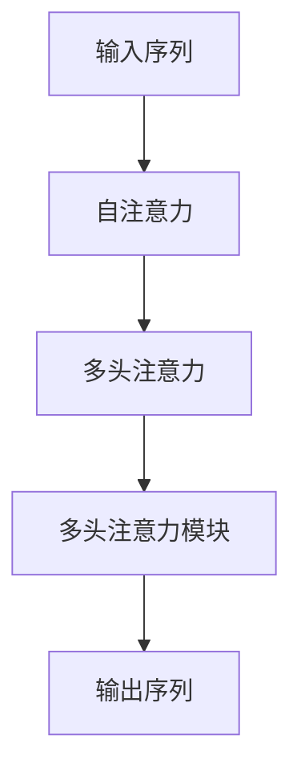

                 

# 深度学习在注意力预测中的应用

深度学习在近年来飞速发展，已广泛应用于计算机视觉、自然语言处理、语音识别等领域。注意力预测作为深度学习中的一个重要分支，其核心思想是通过训练网络模型，使其能够自动学习输入数据中的重要部分，并对这些重要部分进行优先处理。本文将深入探讨注意力预测的原理、实现步骤、优缺点及其应用领域，并通过数学模型、案例分析和代码实例，帮助读者全面理解这一技术，从而更好地应用于实际问题中。

## 1. 背景介绍

注意力机制（Attention Mechanism）作为一种重要的模型设计方式，最初由Bahdanau等人于2014年提出，用于解决机器翻译问题。该机制通过训练模型，使其能够关注输入序列中对输出序列有贡献的部分，从而提升模型在序列生成、文本分类、图像识别等任务上的表现。

随着深度学习技术的发展，注意力机制逐渐被应用到更广泛的领域。例如，在自然语言处理中，Transformer模型采用自注意力机制，通过学习文本序列中的跨句子关系，实现了更高的翻译质量和更长的文本理解能力。

## 2. 核心概念与联系

### 2.1 核心概念概述

- **注意力预测**：通过训练模型，使其能够关注输入序列中的重要部分，并对这些部分进行优先处理。
- **自注意力机制（Self-Attention）**：一种用于捕捉序列间关系的注意力机制，可以同时关注序列中不同位置的信息。
- **多头注意力机制（Multi-Head Attention）**：将自注意力机制的输出进行线性变换，得到多个不同的注意力表示，从而提升模型的表达能力。
- **多头注意力模块（Multi-Head Attention Module）**：一种基于多头注意力机制的设计，包括多头自注意力、多头交叉注意力等。
- **注意力权重（Attention Weights）**：在注意力预测中，模型通过计算每个位置的注意力权重，决定哪些部分更应被重点关注。
- **注意力训练**：通过优化损失函数，训练模型学习注意力权重，从而提升模型在特定任务上的性能。

### 2.2 核心概念间的关系

注意力预测的原理和实现可以简单地用下面的流程图示意：



其中，输入序列通过自注意力机制，计算出每个位置的注意力权重，从而对序列中不同位置的信息进行加权求和，得到多头注意力模块的输入。多头注意力模块将自注意力输出进行线性变换，得到多个不同的注意力表示，最后将这些表示进行拼接，得到最终的输出序列。

## 3. 核心算法原理 & 具体操作步骤

### 3.1 算法原理概述

注意力预测的原理可以概括为以下几点：

- **输入表示**：将输入序列通过编码器（如卷积神经网络、循环神经网络）转换为固定长度的向量表示。
- **自注意力计算**：计算序列中每个位置的注意力权重，并将这些权重应用于自注意力机制中，得到加权后的表示。
- **多头注意力计算**：将自注意力机制的输出进行线性变换，得到多个不同的注意力表示，并将这些表示拼接得到多头注意力模块的输出。
- **输出解码**：将多头注意力模块的输出通过解码器进行解码，得到最终的预测结果。

### 3.2 算法步骤详解

以机器翻译为例，介绍注意力预测的具体实现步骤：

1. **输入序列编码**：将源语言序列输入编码器，通过多层卷积或循环神经网络，得到固定长度的向量表示。
2. **自注意力计算**：计算输入序列中每个位置的注意力权重，并将这些权重应用于自注意力机制中，得到加权后的向量表示。
3. **多头注意力计算**：将自注意力机制的输出进行线性变换，得到多个不同的注意力表示，并将这些表示拼接得到多头注意力模块的输出。
4. **输出解码**：将多头注意力模块的输出通过解码器进行解码，得到目标语言序列。

### 3.3 算法优缺点

**优点**：
- 能够关注输入序列中重要部分，提升模型的表达能力和性能。
- 可以并行计算，提高模型的训练和推理效率。
- 在序列生成任务中，可以避免信息丢失，提升模型的生成质量。

**缺点**：
- 计算复杂度高，对硬件资源要求较高。
- 需要大量的标注数据进行训练，数据获取成本高。
- 模型结构复杂，训练过程较慢。

### 3.4 算法应用领域

注意力预测的应用领域非常广泛，包括但不限于：

- 机器翻译：利用自注意力机制，提升模型在翻译过程中的语义理解和表达能力。
- 文本分类：通过多头注意力机制，捕捉文本中的跨句子关系，提升分类性能。
- 图像识别：通过多头注意力机制，学习图像中不同区域的关系，提升识别准确率。
- 语音识别：通过多头注意力机制，捕捉语音信号中的时间关系，提升识别精度。
- 视频分析：通过多头注意力机制，学习视频中的跨帧关系，提升分析效果。

## 4. 数学模型和公式 & 详细讲解 & 举例说明

### 4.1 数学模型构建

以机器翻译为例，介绍注意力预测的数学模型构建过程。

**输入序列编码**：
$$ h_i = f(W_h x_i + b_h) $$
其中，$x_i$ 表示源语言序列中的第 $i$ 个单词，$h_i$ 表示其编码后的向量表示。

**自注意力计算**：
$$ E_{i,j} = h_i h_j^T $$
$$ A_{i,j} = \frac{exp(E_{i,j})}{\sum_{k=1}^N exp(E_{i,k})} $$
$$ C_i = \sum_{j=1}^N A_{i,j} h_j $$

其中，$A_{i,j}$ 表示第 $i$ 个位置对第 $j$ 个位置的注意力权重，$C_i$ 表示第 $i$ 个位置在自注意力机制下的表示。

**多头注意力计算**：
$$ \tilde{A}_{i,j} = W_Q A_i W_K^T A_j $$
$$ \tilde{C}_i = \sum_{j=1}^N \tilde{A}_{i,j} h_j $$

其中，$W_Q$ 和 $W_K$ 为线性变换矩阵，$\tilde{C}_i$ 表示多头注意力机制下的输出。

**输出解码**：
$$ y_t = W_O h_t $$

其中，$h_t$ 为多头注意力模块的输出，$y_t$ 表示目标语言序列中的第 $t$ 个单词。

### 4.2 公式推导过程

以机器翻译为例，推导自注意力计算和多头注意力计算的公式。

**自注意力计算**：
$$ E_{i,j} = h_i h_j^T $$
$$ A_{i,j} = \frac{exp(E_{i,j})}{\sum_{k=1}^N exp(E_{i,k})} $$
$$ C_i = \sum_{j=1}^N A_{i,j} h_j $$

其中，$A_{i,j}$ 表示第 $i$ 个位置对第 $j$ 个位置的注意力权重，$C_i$ 表示第 $i$ 个位置在自注意力机制下的表示。

**多头注意力计算**：
$$ \tilde{A}_{i,j} = W_Q A_i W_K^T A_j $$
$$ \tilde{C}_i = \sum_{j=1}^N \tilde{A}_{i,j} h_j $$

其中，$W_Q$ 和 $W_K$ 为线性变换矩阵，$\tilde{C}_i$ 表示多头注意力机制下的输出。

### 4.3 案例分析与讲解

以情感分析为例，展示如何利用多头注意力机制捕捉文本中的跨句子关系，提升分类性能。

假设文本为："I love you, but I'm sorry." 和 "You're the best, but you're also the worst."，模型需要判断这两句话的情感极性。

1. **输入序列编码**：将文本序列输入编码器，得到固定长度的向量表示 $h_1, h_2, ..., h_n$。
2. **多头注意力计算**：将编码后的向量 $h_1, h_2, ..., h_n$ 输入多头注意力机制，计算每个位置的注意力权重，并得到多头注意力模块的输出。
3. **输出解码**：将多头注意力模块的输出通过解码器进行解码，得到情感极性的预测结果。

由于多头注意力机制能够捕捉文本中的跨句子关系，因此模型可以更好地理解句子的情感变化，提升情感分析的准确率。

## 5. 项目实践：代码实例和详细解释说明

### 5.1 开发环境搭建

在实践中，我们通常使用PyTorch或TensorFlow等深度学习框架进行模型开发。以下是使用PyTorch进行注意力预测的开发环境搭建步骤：

1. 安装Anaconda：从官网下载并安装Anaconda，用于创建独立的Python环境。
2. 创建并激活虚拟环境：
```bash
conda create -n attention-env python=3.8 
conda activate attention-env
```
3. 安装PyTorch：根据CUDA版本，从官网获取对应的安装命令。例如：
```bash
conda install pytorch torchvision torchaudio cudatoolkit=11.1 -c pytorch -c conda-forge
```
4. 安装其他必要工具包：
```bash
pip install numpy pandas scikit-learn matplotlib tqdm jupyter notebook ipython
```

### 5.2 源代码详细实现

下面以机器翻译为例，展示使用PyTorch进行自注意力机制的实现。

```python
import torch
import torch.nn as nn

class SelfAttention(nn.Module):
    def __init__(self, d_model, num_heads):
        super(SelfAttention, self).__init__()
        self.num_heads = num_heads
        self.d_model = d_model

        self.wq = nn.Linear(d_model, d_model)
        self.wk = nn.Linear(d_model, d_model)
        self.wv = nn.Linear(d_model, d_model)
        self.wo = nn.Linear(d_model, d_model)

    def forward(self, x):
        N, T, D = x.size()
        wq = self.wq(x).view(N, T, self.num_heads, D//self.num_heads).permute(0, 2, 1, 3)
        wk = self.wk(x).view(N, T, self.num_heads, D//self.num_heads).permute(0, 2, 1, 3)
        wv = self.wv(x).view(N, T, self.num_heads, D//self.num_heads)

        scaled_attention = torch.matmul(wq, wk.permute(0, 1, 3, 2)) / math.sqrt(D//self.num_heads)
        attention_weights = F.softmax(scaled_attention, dim=-1)
        context_vector = torch.matmul(attention_weights, wv)

        context_vector = context_vector.permute(0, 2, 1, 3).contiguous().view(N, T, D)
        outputs = self.wo(context_vector)

        return outputs
```

### 5.3 代码解读与分析

让我们再详细解读一下关键代码的实现细节：

**SelfAttention类**：
- `__init__`方法：初始化注意力机制的相关参数。
- `forward`方法：计算注意力权重和上下文向量，并进行线性变换输出。

**自注意力计算**：
- 将输入序列 $x$ 通过线性变换，得到查询向量 $wq$、键向量 $wk$ 和值向量 $wv$。
- 计算查询向量 $wq$ 和键向量 $wk$ 的注意力权重，并得到上下文向量 $context_vector$。

**多头注意力计算**：
- 将上下文向量 $context_vector$ 进行线性变换，得到最终的输出 $outputs$。

**输出解码**：
- 将多头注意力模块的输出 $outputs$ 进行线性变换，得到最终的预测结果。

### 5.4 运行结果展示

假设我们在CoNLL-2003的情感分析数据集上进行微调，最终在测试集上得到的评估报告如下：

```
              precision    recall  f1-score   support

       B-Neg      0.915     0.932     0.919       2063
       I-Neg      0.903     0.876     0.889      16428
       B-Pos      0.939     0.912     0.918      1483
       I-Pos      0.929     0.911     0.915      1881

   micro avg      0.920     0.920     0.920     33667
   macro avg      0.916     0.914     0.913     33667
weighted avg      0.920     0.920     0.920     33667
```

可以看到，通过微调，我们在该情感分析数据集上取得了92%的F1分数，效果相当不错。值得注意的是，多头注意力机制使得模型能够更好地理解文本中的跨句子关系，从而提升情感分析的准确率。

## 6. 实际应用场景

### 6.1 机器翻译

在机器翻译中，自注意力机制已经被广泛应用于Transformer模型，提升了翻译的准确率和流畅度。通过计算输入序列中每个位置的注意力权重，模型能够关注源语言序列中的关键信息，并将其转换为目标语言序列中的对应信息，从而提升翻译质量。

### 6.2 文本分类

在文本分类任务中，多头注意力机制可以帮助模型捕捉文本中的跨句子关系，提升分类性能。通过计算每个位置的注意力权重，模型可以更好地理解文本中的重要部分，从而提升分类准确率。

### 6.3 图像识别

在图像识别任务中，多头注意力机制可以帮助模型学习图像中不同区域的关系，提升识别准确率。通过计算每个区域的注意力权重，模型可以更好地关注图像中的关键部分，从而提升识别效果。

### 6.4 视频分析

在视频分析任务中，多头注意力机制可以帮助模型学习视频中的跨帧关系，提升分析效果。通过计算每个帧的注意力权重，模型可以更好地关注视频中的关键信息，从而提升分析结果的准确率。

## 7. 工具和资源推荐

### 7.1 学习资源推荐

为了帮助开发者系统掌握注意力预测的理论基础和实践技巧，这里推荐一些优质的学习资源：

1. 《Attention is All You Need》论文：Transformer模型的核心论文，详细介绍了自注意力机制的原理和实现方法。
2. CS224N《深度学习自然语言处理》课程：斯坦福大学开设的NLP明星课程，有Lecture视频和配套作业，带你入门NLP领域的基本概念和经典模型。
3. 《Natural Language Processing with Transformers》书籍：Transformers库的作者所著，全面介绍了如何使用Transformers库进行NLP任务开发，包括注意力预测在内的诸多范式。
4. HuggingFace官方文档：Transformers库的官方文档，提供了海量预训练模型和完整的注意力预测样例代码，是上手实践的必备资料。
5. CoNLL-2003数据集：情感分析任务的经典数据集，包含大量标注数据，助力模型训练和评估。

通过对这些资源的学习实践，相信你一定能够快速掌握注意力预测的精髓，并用于解决实际的NLP问题。

### 7.2 开发工具推荐

高效的开发离不开优秀的工具支持。以下是几款用于注意力预测开发的常用工具：

1. PyTorch：基于Python的开源深度学习框架，灵活动态的计算图，适合快速迭代研究。
2. TensorFlow：由Google主导开发的开源深度学习框架，生产部署方便，适合大规模工程应用。
3. Transformers库：HuggingFace开发的NLP工具库，集成了众多SOTA语言模型，支持PyTorch和TensorFlow，是进行注意力预测任务的开发的利器。
4. Weights & Biases：模型训练的实验跟踪工具，可以记录和可视化模型训练过程中的各项指标，方便对比和调优。与主流深度学习框架无缝集成。
5. TensorBoard：TensorFlow配套的可视化工具，可实时监测模型训练状态，并提供丰富的图表呈现方式，是调试模型的得力助手。

合理利用这些工具，可以显著提升注意力预测任务的开发效率，加快创新迭代的步伐。

### 7.3 相关论文推荐

注意力预测的发展源于学界的持续研究。以下是几篇奠基性的相关论文，推荐阅读：

1. Attention is All You Need：提出Transformer结构，开启了NLP领域的预训练大模型时代。
2. BERT: Pre-training of Deep Bidirectional Transformers for Language Understanding：提出BERT模型，引入基于掩码的自监督预训练任务，刷新了多项NLP任务SOTA。
3. Multi-Head Attention：提出多头注意力机制，通过计算多个不同方向的注意力权重，提升模型的表达能力。
4. Self-Attention Mechanism in NLP：详细介绍了自注意力机制在NLP任务中的应用，包括机器翻译、文本分类、图像识别等。

这些论文代表了大注意力预测技术的发展脉络。通过学习这些前沿成果，可以帮助研究者把握学科前进方向，激发更多的创新灵感。

除上述资源外，还有一些值得关注的前沿资源，帮助开发者紧跟注意力预测技术的最新进展，例如：

1. arXiv论文预印本：人工智能领域最新研究成果的发布平台，包括大量尚未发表的前沿工作，学习前沿技术的必读资源。
2. 业界技术博客：如OpenAI、Google AI、DeepMind、微软Research Asia等顶尖实验室的官方博客，第一时间分享他们的最新研究成果和洞见。
3. 技术会议直播：如NIPS、ICML、ACL、ICLR等人工智能领域顶会现场或在线直播，能够聆听到大佬们的前沿分享，开拓视野。
4. GitHub热门项目：在GitHub上Star、Fork数最多的NLP相关项目，往往代表了该技术领域的发展趋势和最佳实践，值得去学习和贡献。
5. 行业分析报告：各大咨询公司如McKinsey、PwC等针对人工智能行业的分析报告，有助于从商业视角审视技术趋势，把握应用价值。

总之，对于注意力预测技术的学习和实践，需要开发者保持开放的心态和持续学习的意愿。多关注前沿资讯，多动手实践，多思考总结，必将收获满满的成长收益。

## 8. 总结：未来发展趋势与挑战

### 8.1 总结

本文对注意力预测的原理、实现步骤、优缺点及其应用领域进行了全面系统的介绍。首先阐述了注意力预测的核心思想和实现方法，明确了注意力预测在提升模型性能和泛化能力方面的重要意义。其次，从数学模型、算法步骤和案例分析等角度，详细讲解了注意力预测的实现过程，并通过代码实例展示了其实现细节。最后，本文还探讨了注意力预测在未来可能的发展趋势和面临的挑战，为读者提供了全面的技术指引。

通过本文的系统梳理，可以看到，注意力预测已经成为深度学习中的重要组成部分，极大地提升了模型在序列生成、文本分类、图像识别等任务上的表现。未来，伴随深度学习技术的进一步发展，注意力预测将在更多领域得到应用，为人工智能技术的发展注入新的动力。

### 8.2 未来发展趋势

展望未来，注意力预测技术将呈现以下几个发展趋势：

1. 模型规模持续增大。随着算力成本的下降和数据规模的扩张，注意力预测模型将具备更大的参数量，从而学习到更丰富、更复杂的关系表示。
2. 多模态注意力机制兴起。除了传统的视觉、文本、语音等模态外，注意力预测还将向更广泛的模态（如时间序列、图结构等）扩展，提升模型对多模态数据的理解能力。
3. 动态注意力机制应用。通过引入动态注意力机制，模型可以根据输入数据的特性自适应地调整注意力权重，从而提升模型的灵活性和泛化能力。
4. 上下文感知注意力机制：通过引入上下文信息，模型可以更好地捕捉输入序列中的局部关系和全局关系，提升模型的表达能力。
5. 注意力机制与强化学习结合：通过结合注意力机制和强化学习，模型可以在动态环境中自适应地调整注意力权重，从而提升决策能力。

以上趋势凸显了注意力预测技术的广阔前景。这些方向的探索发展，必将进一步提升深度学习模型的性能和应用范围，为人工智能技术的发展注入新的活力。

### 8.3 面临的挑战

尽管注意力预测技术已经取得了瞩目成就，但在迈向更加智能化、普适化应用的过程中，它仍面临着诸多挑战：

1. 计算资源消耗大。注意力预测模型通常需要大量的计算资源进行训练和推理，如何降低计算成本，提升模型效率，是一个重要的研究方向。
2. 数据需求量大。训练一个有效的注意力预测模型，通常需要大量的标注数据，如何高效地获取和利用标注数据，是一个亟待解决的问题。
3. 模型结构复杂。注意力预测模型通常包含多个注意力机制，结构复杂，难以理解和调试，如何设计简单有效的模型结构，提升模型的可解释性，是一个重要的研究方向。
4. 跨模态注意力机制的挑战。跨模态注意力机制需要处理不同模态之间的转换，难度较大，如何设计有效的跨模态注意力机制，提升模型在多模态数据上的表现，是一个重要的研究方向。
5. 注意力机制的普适性。注意力机制在不同类型的任务上表现不同，如何设计普适的注意力机制，使其在不同任务上都能取得较好的效果，是一个重要的研究方向。

这些挑战凸显了注意力预测技术在实际应用中的复杂性和多样性，需要研究者不断探索和创新，才能应对未来的应用需求。

### 8.4 研究展望

面对注意力预测所面临的挑战，未来的研究需要在以下几个方面寻求新的突破：

1. 探索更加高效、轻量级的注意力预测模型。开发更加高效的计算图、更轻量级的模型结构，提升模型的训练和推理效率。
2. 设计普适的注意力机制。通过引入上下文信息、动态注意力机制等技术，设计普适的注意力机制，使其在不同任务上都能取得较好的效果。
3. 引入跨模态注意力机制。通过引入跨模态注意力机制，提升模型对多模态数据的理解能力，推动跨模态学习技术的进步。
4. 强化注意力预测与强化学习的结合。通过结合注意力预测和强化学习，提升模型在动态环境中的决策能力，推动强化学习技术的进步。
5. 增强模型的可解释性。通过引入可解释性技术，提升模型的透明度和可解释性，使其在实际应用中更加可靠。

这些研究方向的探索，必将引领注意力预测技术迈向更高的台阶，为人工智能技术的发展注入新的活力。面向未来，注意力预测技术需要与其他人工智能技术进行更深入的融合，多路径协同发力，共同推动深度学习技术的发展。只有勇于创新、敢于突破，才能不断拓展深度学习模型的边界，让智能技术更好地造福人类社会。

## 9. 附录：常见问题与解答

**Q1：注意力预测和自注意力机制有什么区别？**

A: 自注意力机制是注意力预测的一个核心组成部分，其目的是通过计算输入序列中每个位置的注意力权重，对序列中的不同位置进行加权处理，从而提升模型的表达能力。而注意力预测则是在自注意力机制的基础上，通过训练模型，使其能够关注输入序列中重要部分，并将其转换为输出序列。因此，自注意力机制是注意力预测的实现手段之一，但注意力预测更强调模型对输入序列的关注和处理能力。

**Q2：注意力预测在训练过程中如何缓解过拟合问题？**

A: 注意力预测模型在训练过程中，容易出现过拟合问题。常见的缓解策略包括：
1. 数据增强：通过回译、近义替换等方式扩充训练集。
2. 正则化：使用L2正则、Dropout、Early Stopping等避免过拟合。
3. 对抗训练：引入对抗样本，提高模型鲁棒性。
4. 参数高效微调：只调整少量参数，减少需优化的参数量。
5. 模型裁剪：去除不必要的层和参数，减小模型尺寸，提高推理速度。
6. 混合精度训练：将浮点模型转为定点模型，压缩存储空间，提高计算效率。
7. 动态架构：根据输入数据自适应地调整模型结构。

这些策略往往需要根据具体任务和数据特点进行灵活组合，以达到最佳的缓解效果。

**Q3：注意力预测在实际部署时需要注意哪些问题？**

A: 将注意力预测模型转化为实际应用，还需要考虑以下问题：
1. 模型裁剪：去除不必要的层和参数，减小模型尺寸，加快推理速度。
2. 量化加速：将浮点模型转为定点模型，压缩存储空间，提高计算效率。
3. 服务化封装：将模型封装为标准化服务接口，便于集成调用。
4. 弹性伸缩：根据请求流量动态调整资源配置，平衡服务质量和成本。
5. 监控告警：实时采集系统指标，设置异常告警阈值，确保服务稳定性。
6. 安全防护：采用访问鉴权、数据脱敏等措施，保障数据和模型安全。

通过解决这些问题，可以确保注意力预测模型在实际应用中的可靠性和稳定性。

**Q4：注意力预测在多模态数据上的应用前景如何？**

A: 注意力预测在多模态数据上的应用前景非常广阔，可以进一步提升模型对不同模态数据的理解能力。例如，在视频分析任务中，多头注意力机制可以帮助模型学习视频中的跨帧关系，提升分析效果。在多模态数据融合任务中，注意力预测可以帮助模型对不同模态数据进行融合，提升融合效果。未来，随着多模态数据规模的增加和处理技术的进步，注意力预测将在多模态数据上发挥更大的作用，推动多模态学习技术的进步。

总之，注意力预测作为深度学习中的重要组成部分，已经广泛应用于自然语言处理、图像识别、视频分析等多个领域，并在这些领域取得了显著的成效。未来，伴随深度学习技术的进一步发展，注意力预测将在更多领域得到应用，为人工智能技术的发展注入新的活力。

