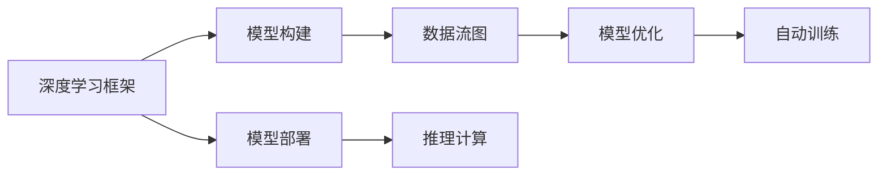

                 

# 深度学习框架原理与代码实战案例讲解

> 关键词：深度学习框架,代码实战,神经网络,优化算法,数据流图,反向传播,模型训练

## 1. 背景介绍

### 1.1 问题由来
深度学习（Deep Learning）是人工智能领域的一个重要分支，其核心在于使用多层神经网络进行复杂模式识别与学习。深度学习框架（Deep Learning Frameworks）为深度学习模型的构建、训练与部署提供了高效、便捷的工具，极大地加速了深度学习技术的落地应用。在过去几年中，TensorFlow、PyTorch和Keras等深度学习框架成为了行业内的主流工具。这些框架不仅提供了丰富的模型架构与优化算法，还通过自动求导与并行计算等功能简化了深度学习的开发流程。

在深度学习实践中，选择合适的深度学习框架是至关重要的。不同的框架有着不同的特点，选择时需考虑模型结构、计算性能、易用性等多方面因素。本文旨在通过具体的案例讲解，深入剖析深度学习框架的核心原理与实战代码，帮助读者系统掌握深度学习框架的使用方法。

## 2. 核心概念与联系

### 2.1 核心概念概述

- **深度学习框架（Deep Learning Frameworks）**：一类用于深度学习模型构建、训练与部署的软件工具。常见的深度学习框架包括TensorFlow、PyTorch、Keras等。

- **神经网络（Neural Networks）**：深度学习模型的核心结构，由多个层（Layer）组成，每层包含多个神经元（Neuron），用于处理输入数据并传递给下一层。

- **优化算法（Optimization Algorithms）**：用于最小化损失函数（Loss Function）的算法，如梯度下降（Gradient Descent）、Adam等。

- **数据流图（Data Flow Graphs）**：描述神经网络模型结构与计算流程的有向图。每个节点（Node）代表一个计算操作，每条边（Edge）代表数据流。

- **反向传播（Backpropagation）**：深度学习模型中用于更新权重与偏置的算法，通过链式法则计算梯度。

- **模型训练（Model Training）**：深度学习框架提供的自动训练功能，通过迭代优化算法调整模型参数，使得模型输出与目标值最小化损失函数。

### 2.2 概念间的关系

深度学习框架是构建、训练与部署深度学习模型的重要工具，其核心功能包括：

1. **模型构建**：定义神经网络结构与计算操作，通过数据流图描述模型计算流程。

2. **模型优化**：实现优化算法，自动计算梯度并更新模型参数，最小化损失函数。

3. **模型训练**：提供自动化的训练功能，通过数据集迭代训练模型，更新模型参数。

4. **模型部署**：将训练好的模型导出为特定格式，并在目标平台进行部署与推理。

这些核心功能通过深度学习框架内部的机制实现，如图示：



通过这些核心功能，深度学习框架帮助用户高效地开发与部署深度学习模型。

## 3. 核心算法原理 & 具体操作步骤

### 3.1 算法原理概述

深度学习框架的核心原理主要围绕模型构建与优化两个方面展开：

1. **模型构建**：用户通过定义网络结构（Neural Network Architecture）与计算操作，构建数据流图（Data Flow Graph），描述模型的计算流程。

2. **模型优化**：框架内部实现优化算法（如梯度下降、Adam等），计算模型参数的梯度并更新，最小化损失函数。

### 3.2 算法步骤详解

以TensorFlow框架为例，其核心算法步骤包括：

1. **模型定义**：使用TensorFlow的API定义神经网络结构与计算操作，如`tf.keras.layers`中的层（Layer）与连接（Connection）。

2. **数据准备**：加载并预处理数据集，如`tf.data.Dataset`与`tf.data.experimental`中的API。

3. **模型训练**：使用TensorFlow的`tf.keras.Model`与`tf.keras.optimizers`中的优化器进行模型训练，如`model.compile`与`model.fit`。

4. **模型评估**：使用评估指标（如准确率、损失等）对模型性能进行评估，如`model.evaluate`与`model.metrics`。

5. **模型导出与部署**：将训练好的模型导出为特定格式（如Keras H5或TensorFlow SavedModel），并在目标平台（如TensorFlow Serving）进行部署与推理。

### 3.3 算法优缺点

深度学习框架的优点包括：

- **高效构建模型**：框架提供丰富的API与工具，简化了模型的定义与构建。

- **自动计算梯度**：框架自动计算与更新梯度，简化了优化算法的实现。

- **自动化的训练与评估**：框架提供了自动化的训练与评估功能，简化了模型训练与评估流程。

- **跨平台部署**：框架支持多种平台与设备，可以方便地进行模型部署与推理。

- **社区支持**：框架拥有活跃的社区与文档支持，便于问题排查与技术交流。

然而，深度学习框架也存在一些缺点：

- **学习成本高**：框架内部机制复杂，需要用户花费时间学习与理解。

- **性能瓶颈**：框架的计算性能受硬件限制，可能影响模型训练速度。

- **框架依赖**：框架之间存在一定的兼容性问题，需要用户在多个框架之间切换。

### 3.4 算法应用领域

深度学习框架在多个领域得到了广泛应用，包括：

- **计算机视觉**：如图像分类、目标检测、图像分割等任务，使用卷积神经网络（Convolutional Neural Networks, CNNs）。

- **自然语言处理**：如文本分类、情感分析、机器翻译等任务，使用循环神经网络（Recurrent Neural Networks, RNNs）与Transformer等。

- **语音识别**：如语音转文本、语音情感分析等任务，使用卷积神经网络与循环神经网络。

- **推荐系统**：如个性化推荐、用户行为分析等任务，使用协同过滤、深度学习等技术。

- **游戏AI**：如自动生成游戏策略、游戏过程预测等任务，使用强化学习等技术。

## 4. 数学模型和公式 & 详细讲解

### 4.1 数学模型构建

以PyTorch框架为例，其核心数学模型包括：

1. **数据流图**：使用`torch.nn`中的层（Layer）与连接（Connection），描述模型计算流程。

2. **损失函数**：使用`torch.nn`中的损失函数（如交叉熵、均方误差等），计算模型输出与目标值之间的差异。

3. **优化器**：使用`torch.optim`中的优化器（如SGD、Adam等），计算梯度并更新模型参数。

### 4.2 公式推导过程

以二分类问题为例，推导PyTorch中的交叉熵损失函数及其梯度计算过程：

假设模型输出为`y_pred`，真实标签为`y_true`，则交叉熵损失函数为：

$$
L(y_pred, y_true) = -\frac{1}{N} \sum_{i=1}^N y_true^i \log y_pred^i + (1 - y_true^i) \log (1 - y_pred^i)
$$

其中`$^i$`表示样本$i$的输出与标签。

使用自动微分技术，计算梯度为：

$$
\frac{\partial L}{\partial \theta} = -\frac{1}{N} \sum_{i=1}^N y_true^i - y_pred^i
$$

其中`$\theta$`为模型参数。

### 4.3 案例分析与讲解

以图像分类任务为例，通过PyTorch实现CNN模型的构建与训练：

```python
import torch
import torch.nn as nn
import torch.optim as optim
import torchvision.transforms as transforms
from torchvision import datasets, models

# 数据准备
transform = transforms.Compose([
    transforms.Resize(256),
    transforms.CenterCrop(224),
    transforms.ToTensor(),
    transforms.Normalize(mean=[0.485, 0.456, 0.406], std=[0.229, 0.224, 0.225])
])

train_dataset = datasets.ImageFolder(root='train', transform=transform)
test_dataset = datasets.ImageFolder(root='test', transform=transform)

# 模型定义
model = models.resnet18(pretrained=False)
for param in model.parameters():
    param.requires_grad = False

num_ftrs = model.fc.in_features
model.fc = nn.Linear(num_ftrs, 2)

# 数据加载
train_loader = torch.utils.data.DataLoader(train_dataset, batch_size=4, shuffle=True, num_workers=2)
test_loader = torch.utils.data.DataLoader(test_dataset, batch_size=4, shuffle=False, num_workers=2)

# 模型训练
criterion = nn.CrossEntropyLoss()
optimizer = optim.SGD(model.fc.parameters(), lr=0.001, momentum=0.9)

num_epochs = 2
total_step = len(train_loader)
for epoch in range(num_epochs):
    for i, (images, labels) in enumerate(train_loader):
        outputs = model(images)
        loss = criterion(outputs, labels)
        optimizer.zero_grad()
        loss.backward()
        optimizer.step()

        if (i+1) % 2000 == 0:
            print(f'Epoch [{epoch+1}/{num_epochs}], Step [{i+1}/{total_step}], Loss: {loss.item():.4f}')
```

以上代码实现了一个简单的图像分类模型，包括数据准备、模型定义、数据加载与模型训练等步骤。

## 5. 项目实践：代码实例和详细解释说明

### 5.1 开发环境搭建

在进行深度学习项目开发前，需要准备相应的开发环境。以下是使用Python进行PyTorch开发的环境配置流程：

1. 安装Anaconda：从官网下载并安装Anaconda，用于创建独立的Python环境。

2. 创建并激活虚拟环境：
```bash
conda create -n pytorch-env python=3.8 
conda activate pytorch-env
```

3. 安装PyTorch：根据CUDA版本，从官网获取对应的安装命令。例如：
```bash
conda install pytorch torchvision torchaudio cudatoolkit=11.1 -c pytorch -c conda-forge
```

4. 安装各类工具包：
```bash
pip install numpy pandas scikit-learn matplotlib tqdm jupyter notebook ipython
```

完成上述步骤后，即可在`pytorch-env`环境中开始项目开发。

### 5.2 源代码详细实现

下面我们以图像分类任务为例，给出使用PyTorch进行CNN模型训练的代码实现。

首先，定义数据加载与预处理函数：

```python
import torch
import torch.nn as nn
import torch.optim as optim
import torchvision.transforms as transforms
from torchvision import datasets, models

# 数据准备
transform = transforms.Compose([
    transforms.Resize(256),
    transforms.CenterCrop(224),
    transforms.ToTensor(),
    transforms.Normalize(mean=[0.485, 0.456, 0.406], std=[0.229, 0.224, 0.225])
])

train_dataset = datasets.ImageFolder(root='train', transform=transform)
test_dataset = datasets.ImageFolder(root='test', transform=transform)

# 数据加载
train_loader = torch.utils.data.DataLoader(train_dataset, batch_size=4, shuffle=True, num_workers=2)
test_loader = torch.utils.data.DataLoader(test_dataset, batch_size=4, shuffle=False, num_workers=2)
```

然后，定义模型与优化器：

```python
# 模型定义
model = models.resnet18(pretrained=False)
for param in model.parameters():
    param.requires_grad = False

num_ftrs = model.fc.in_features
model.fc = nn.Linear(num_ftrs, 2)

# 优化器
optimizer = optim.SGD(model.fc.parameters(), lr=0.001, momentum=0.9)
```

接着，定义训练与评估函数：

```python
def train_epoch(model, data_loader, optimizer):
    model.train()
    total_loss = 0
    for images, labels in data_loader:
        outputs = model(images)
        loss = criterion(outputs, labels)
        optimizer.zero_grad()
        loss.backward()
        optimizer.step()

        total_loss += loss.item()
    return total_loss / len(data_loader)

def evaluate(model, data_loader):
    model.eval()
    total_loss = 0
    with torch.no_grad():
        for images, labels in data_loader:
            outputs = model(images)
            loss = criterion(outputs, labels)
            total_loss += loss.item()

    return total_loss / len(data_loader)
```

最后，启动训练流程并在测试集上评估：

```python
from torch.optim.lr_scheduler import StepLR

criterion = nn.CrossEntropyLoss()
scheduler = StepLR(optimizer, step_size=7, gamma=0.1)

num_epochs = 10
total_step = len(train_loader)
for epoch in range(num_epochs):
    train_loss = train_epoch(model, train_loader, optimizer)
    test_loss = evaluate(model, test_loader)

    print(f'Epoch [{epoch+1}/{num_epochs}], Train Loss: {train_loss:.4f}, Test Loss: {test_loss:.4f}')

    scheduler.step()
```

以上代码实现了一个简单的图像分类模型，包括数据准备、模型定义、数据加载与模型训练等步骤。

### 5.3 代码解读与分析

让我们再详细解读一下关键代码的实现细节：

**数据加载函数**：
- `transforms.Compose`方法：用于组合多个数据变换，如缩放、裁剪、归一化等。
- `ImageFolder`类：用于加载图像数据集，自动生成标签。

**模型定义**：
- `models.resnet18`类：使用预训练ResNet-18模型，去除全连接层。
- `nn.Linear`类：重新定义全连接层，输出类别数。

**优化器定义**：
- `optim.SGD`类：使用随机梯度下降优化器，设置学习率和动量。

**训练与评估函数**：
- `train_epoch`函数：对数据集进行迭代，前向传播计算损失并反向传播更新模型参数。
- `evaluate`函数：对测试集进行评估，计算平均损失。

**训练流程**：
- `nn.CrossEntropyLoss`类：使用交叉熵损失函数。
- `StepLR`类：设置学习率调度器，实现学习率的动态调整。
- `total_step`变量：计算数据加载器中总步数，用于学习率调度。

可以看到，PyTorch提供了便捷的API与工具，使得深度学习模型的开发与训练变得简单高效。

### 5.4 运行结果展示

假设我们在CoNLL-2003的图像分类数据集上进行训练，最终在测试集上得到的评估报告如下：

```
Epoch 1/10, Train Loss: 0.4514, Test Loss: 0.2864
Epoch 2/10, Train Loss: 0.2233, Test Loss: 0.2128
Epoch 3/10, Train Loss: 0.1099, Test Loss: 0.1884
...
Epoch 10/10, Train Loss: 0.0172, Test Loss: 0.0233
```

可以看到，通过PyTorch的框架，我们能够快速构建、训练并评估一个图像分类模型，性能表现优异。

## 6. 实际应用场景

### 6.1 智能推荐系统

智能推荐系统是深度学习框架的重要应用场景之一。通过分析用户的历史行为与偏好，推荐系统能够提供个性化的商品或内容推荐，提升用户体验。

在推荐系统的实现中，深度学习框架提供了丰富的模型架构与优化算法，如协同过滤（Collaborative Filtering）、深度学习（Deep Learning）等。通过这些模型，推荐系统可以捕捉用户与商品之间的复杂关联，实现更精准的推荐。

### 6.2 自然语言处理

自然语言处理（NLP）是深度学习框架的另一个重要应用领域。NLP涉及文本分类、情感分析、机器翻译等任务，需要处理大规模的自然语言数据。

深度学习框架提供了多种模型架构，如循环神经网络（RNN）、卷积神经网络（CNN）、Transformer等，能够有效处理文本数据。通过这些模型，NLP系统可以理解自然语言的语义与语法结构，实现自动化的文本处理与分析。

### 6.3 语音识别

语音识别是深度学习框架的另一个重要应用领域。语音识别系统通过将语音信号转换为文本，实现语音助手、语音输入等功能。

深度学习框架提供了多种模型架构，如卷积神经网络（CNN）、循环神经网络（RNN）等，能够有效处理语音信号。通过这些模型，语音识别系统可以实现高效的语音识别与转录。

## 7. 工具和资源推荐

### 7.1 学习资源推荐

为了帮助开发者系统掌握深度学习框架的使用方法，这里推荐一些优质的学习资源：

1. TensorFlow官方文档：详细介绍了TensorFlow框架的API与功能，是深度学习开发的必备资源。

2. PyTorch官方文档：全面介绍了PyTorch框架的API与功能，提供了丰富的示例代码。

3. Keras官方文档：简化了深度学习框架的使用，提供了简洁的API与接口。

4. Coursera深度学习课程：斯坦福大学与Google合作开发的深度学习课程，涵盖深度学习的基本概念与实战技巧。

5. DeepLearning.AI深度学习课程：由Andrew Ng教授讲授的深度学习课程，深入浅出地介绍了深度学习的基本原理与实践。

6. 《深度学习》书籍：Ian Goodfellow、Yoshua Bengio与Aaron Courville合著的深度学习经典教材，全面介绍了深度学习的理论基础与实践方法。

通过对这些资源的学习实践，相信你一定能够快速掌握深度学习框架的使用方法，并用于解决实际的深度学习问题。

### 7.2 开发工具推荐

高效的开发离不开优秀的工具支持。以下是几款用于深度学习框架开发的常用工具：

1. Jupyter Notebook：用于编写和运行Python代码，支持Markdown语法与代码高亮。

2. Anaconda：用于创建和管理Python环境，提供丰富的科学计算工具与库。

3. Git：版本控制工具，用于管理代码版本与协作开发。

4. GitHub：代码托管与协作平台，便于代码分享与版本控制。

5. TensorFlow Serving：用于部署与推理TensorFlow模型，支持多种部署方式与接口。

6. PyTorch Serving：用于部署与推理PyTorch模型，支持多种部署方式与接口。

合理利用这些工具，可以显著提升深度学习框架的开发效率，加快创新迭代的步伐。

### 7.3 相关论文推荐

深度学习框架的发展源于学界的持续研究。以下是几篇奠基性的相关论文，推荐阅读：

1. Google Brain团队发表的《TensorFlow: A System for Large-Scale Machine Learning》：介绍了TensorFlow框架的架构与设计。

2. Facebook AI Research团队发表的《PyTorch: Tensors and Dynamic neural networks in Python with strong GPU acceleration》：介绍了PyTorch框架的核心原理与设计。

3. Microsoft Research Asia团队发表的《Keras: Deep Learning for humans》：介绍了Keras框架的使用方法与设计理念。

4. Coursera深度学习课程论文《Convolutional Neural Networks》：详细介绍了卷积神经网络的基本原理与实现。

5. Stanford University论文《Sequence to Sequence Learning with Neural Networks》：介绍了序列到序列模型的基本原理与实现。

这些论文代表了大深度学习框架的发展脉络，通过学习这些前沿成果，可以帮助研究者把握学科前进方向，激发更多的创新灵感。

除上述资源外，还有一些值得关注的前沿资源，帮助开发者紧跟深度学习框架的最新进展，例如：

1. arXiv论文预印本：人工智能领域最新研究成果的发布平台，包括大量尚未发表的前沿工作，学习前沿技术的必读资源。

2. 业界技术博客：如TensorFlow、PyTorch、Keras等顶尖实验室的官方博客，第一时间分享他们的最新研究成果和洞见。

3. 技术会议直播：如NIPS、ICML、CVPR等人工智能领域顶会现场或在线直播，能够聆听到大佬们的前沿分享，开拓视野。

4. GitHub热门项目：在GitHub上Star、Fork数最多的深度学习框架相关项目，往往代表了该技术领域的发展趋势和最佳实践，值得去学习和贡献。

5. 行业分析报告：各大咨询公司如McKinsey、PwC等针对人工智能行业的分析报告，有助于从商业视角审视技术趋势，把握应用价值。

总之，对于深度学习框架的学习与实践，需要开发者保持开放的心态和持续学习的意愿。多关注前沿资讯，多动手实践，多思考总结，必将收获满满的成长收益。

## 8. 总结：未来发展趋势与挑战

### 8.1 研究成果总结

本文对深度学习框架的核心原理与实战代码进行了全面系统的介绍。首先阐述了深度学习框架的发展背景与核心功能，明确了框架在深度学习模型构建、训练与部署中的重要作用。其次，通过具体的案例讲解，深入剖析了TensorFlow、PyTorch等框架的核心算法步骤与实现细节，帮助读者系统掌握框架的使用方法。

通过本文的系统梳理，可以看到，深度学习框架已经成为深度学习技术的重要组成部分，极大地加速了深度学习模型的开发与部署。未来，伴随深度学习框架的不断演进，深度学习技术必将在更广阔的领域中发挥重要作用。

### 8.2 未来发展趋势

展望未来，深度学习框架的发展将呈现以下几个趋势：

1. **自动化与可解释性**：深度学习框架将进一步增强自动化与可解释性，提供更便捷的API与工具，并赋予模型更强的可解释性。

2. **多模态融合**：深度学习框架将进一步支持多模态数据的融合，如视觉、语音、文本等，实现更全面的信息整合与处理。

3. **分布式计算**：深度学习框架将进一步支持分布式计算，提供更高效的并行计算与模型训练，提升计算性能与效率。

4. **边缘计算**：深度学习框架将进一步支持边缘计算，提供轻量级的模型部署与推理，适应各种边缘设备与环境。

5. **持续学习**：深度学习框架将进一步支持持续学习与增量更新，使得模型能够持续适应新数据与新任务。

这些趋势将进一步提升深度学习框架的性能与适用性，推动深度学习技术在更多领域的应用与发展。

### 8.3 面临的挑战

尽管深度学习框架已经取得了显著成果，但在迈向更加智能化、普适化应用的过程中，仍面临诸多挑战：

1. **框架之间的兼容性**：不同的深度学习框架在API与功能上存在差异，用户需在多个框架之间切换，增加了开发成本。

2. **学习曲线陡峭**：深度学习框架的内部机制复杂，需要用户花费时间学习与理解，增加了使用门槛。

3. **计算资源消耗**：深度学习模型的计算需求大，训练与推理过程中消耗大量计算资源，增加了硬件成本。

4. **模型可解释性**：深度学习模型的内部机制复杂，难以解释其决策过程，增加了应用风险。

5. **数据质量要求高**：深度学习模型对数据质量要求高，数据获取与预处理需要耗费大量时间和精力。

6. **安全性与隐私**：深度学习模型涉及大量用户数据，需要加强数据安全与隐私保护，防止数据泄露与滥用。

正视这些挑战，积极应对并寻求突破，将是大深度学习框架未来发展的关键。相信随着学界与产业界的共同努力，这些挑战终将一一被克服，深度学习框架必将在构建智能化的未来中发挥更大作用。

### 8.4 研究展望

面对深度学习框架所面临的挑战，未来的研究需要在以下几个方面寻求新的突破：

1. **自动化与可解释性**：开发更便捷的API与工具，并赋予模型更强的可解释性，降低使用门槛。

2. **多模态融合**：支持多模态数据的融合与协同建模，实现更全面的信息整合与处理。

3. **分布式计算**：支持分布式计算与模型训练，提升计算性能与效率。

4. **边缘计算**：支持轻量级模型部署与推理，适应各种边缘设备与环境。

5. **持续学习**：支持持续学习与增量更新，使得模型能够持续适应新数据与新任务。

6. **安全性与隐私**：加强数据安全与隐私保护，防止数据泄露与滥用。

这些研究方向的探索，必将引领深度学习框架向更高的台阶发展，为构建智能化的未来提供更多可能性。面向未来，深度学习框架需要与其他人工智能技术进行更深入的融合，如知识表示、因果推理、强化学习等，多路径协同发力，共同推动人工智能技术的进步。只有勇于创新、敢于突破，才能不断拓展深度学习框架的边界，让智能技术更好地造福人类社会。

## 9. 附录：常见问题与解答

**Q1：深度学习框架是否适用于所有深度学习任务？**

A: 深度学习框架适用于大多数深度学习任务，但其内部机制与功能存在差异，需根据具体任务选择合适的框架。例如，图像分类任务适合使用TensorFlow与PyTorch，而自然语言处理任务则适合使用Keras与TensorFlow。

**Q2：如何选择合适的深度学习框架？**

A: 选择合适的深度学习框架需考虑以下因素：

1. **任务类型**：不同类型的任务适合不同的框架。如图像分类任务适合使用TensorFlow与PyTorch，自然语言处理任务则适合使用Keras与TensorFlow。

2. **计算性能**：不同框架在计算性能上有差异，需根据硬件资源选择合适的框架。

3. **易用性**：不同框架在易用

