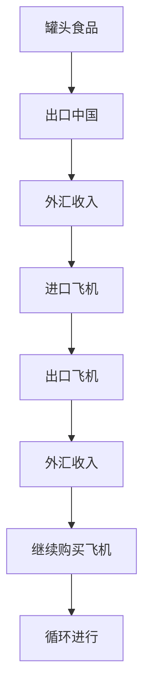

                 

# 牟其中的跨国生意：罐头换飞机

> 关键词：牟其中、罐头、飞机、易货贸易、国际贸易、商业策略

## 1. 背景介绍

在20世纪90年代，中国的商业界出现了一股异样的浪潮。在这波浪潮中，最引人注目的人物非牟其中莫属。这个曾经的亿万富翁、商业奇才，以其出人意料的跨国生意和惊天动地的易货贸易，成为了商业历史上一段传奇。其中，最为人们津津乐道的便是他的“罐头换飞机”计划。

### 1.1 事件概述

1994年，牟其中宣布了一项震惊国内外的商业计划：他计划用自家的罐头食品换取苏联的飞机，并在乌兹别克斯坦设立加工基地，加工成罐头食品再出口到俄罗斯换取外汇，以此循环。这个计划被媒体戏称为“罐头换飞机”。

### 1.2 事件的起因

牟其中的计划源自他的一次海外考察。在一次访问苏联的旅行中，牟其中发现了一种奇特的经济现象：苏联的粮食产量远远超过了其国内的需求，但因其缺乏外汇，无法购买足够的机械设备和原材料进行生产。同时，中国却面临着粮食短缺的困境，特别是高端罐头食品的供应不足。牟其中意识到，这其中存在着巨大的商机。

## 2. 核心概念与联系

### 2.1 核心概念概述

为了更好地理解牟其中“罐头换飞机”计划的核心概念，我们需要首先澄清几个关键点：

- **易货贸易**：一种不涉及货币，而是通过交换商品来满足双方需求的贸易方式。这种方式通常能减少外汇支出，降低交易成本。

- **国际贸易**：不同国家或地区之间的商品和服务的交换，是全球经济的重要组成部分。

- **罐头食品**：一种经过包装和密封处理，便于储存和运输的食品。在中国，罐头食品在80年代后期开始兴起，成为市场中的新兴消费品。

- **飞机**：一种重要的运输工具，也是现代工业中的关键设备。飞机在国际贸易中通常被用来运输大型货物和人员。

- **商业策略**：企业或个人在市场竞争中采取的一系列行动，旨在实现特定商业目标。

### 2.2 核心概念的关系

牟其中的“罐头换飞机”计划是一个复杂的商业操作，涉及到多个核心概念的结合。我们可以用以下Mermaid流程图来展示这些概念之间的关系：



这个流程图展示了从罐头食品出口到飞机进口的整个循环过程。

## 3. 核心算法原理 & 具体操作步骤

### 3.1 算法原理概述

牟其中的“罐头换飞机”计划，本质上是一种复杂的易货贸易操作。其核心算法原理在于利用不同国家或地区之间的商品和资源差异，通过交换商品来实现双方的利益最大化。

### 3.2 算法步骤详解

1. **资源调研**：牟其中首先对苏联的粮食产量和外汇储备进行了深入调研，评估其出口罐头的可行性。同时，对中国罐头食品市场的需求和供应进行了分析。

2. **谈判与合作**：与苏联政府进行谈判，达成用罐头食品换取飞机的协议。同时，在乌兹别克斯坦设立加工基地，进一步扩大罐头食品的生产规模。

3. **物流安排**：安排飞机的运输，将苏联的飞机运至中国。同时，将中国生产的罐头食品运至苏联。

4. **生产与加工**：在乌兹别克斯坦的加工基地，对罐头食品进行进一步的加工和包装。

5. **出口与进口**：将加工后的罐头食品出口到俄罗斯，换取外汇。同时，用外汇购买新的飞机，运至中国，继续交换过程。

6. **周期循环**：通过不断重复以上步骤，形成一个持续的易货贸易循环。

### 3.3 算法优缺点

#### 优点：

- **降低成本**：通过易货贸易，可以有效减少外汇支出，降低交易成本。
- **促进出口**：将国内过剩的罐头食品出口到国外，拓宽了中国商品的国际市场。
- **技术引进**：通过进口苏联的飞机，可以获得先进的航空技术和设备。

#### 缺点：

- **风险高**：易货贸易的不可预测性较大，一旦市场变化或合同违约，可能导致巨大的经济损失。
- **物流复杂**：跨国物流和运输需要协调多个国家的政策和法规，增加了操作的复杂性和难度。
- **融资困难**：大规模的易货贸易需要大量前期资金投入，融资难度较大。

### 3.4 算法应用领域

牟其中的“罐头换飞机”计划不仅是一个商业案例，更是对国际贸易和易货贸易的一次深入探索。这种商业模式在以下领域有着广泛的应用前景：

- **农业与食品**：类似易货贸易可以在粮食、水果、饮料等行业广泛应用，尤其是在发展中国家。
- **重工业与装备**：机械、船舶、汽车等重工业设备的交换也是国际贸易中常见的模式。
- **能源与资源**：石油、天然气、矿产资源的交换，是许多国家间重要的贸易方式。
- **服务业**：旅游、教育、技术服务等服务业的跨境交换，同样可以通过易货贸易实现。

## 4. 数学模型和公式 & 详细讲解

### 4.1 数学模型构建

牟其中的“罐头换飞机”计划涉及到多个变量和参数。我们可以用以下数学模型来表示这个贸易过程：

$$
\begin{aligned}
& \text{设 } X_{t} \text{ 为第 } t \text{ 年的罐头食品出口量}, \\
& \text{设 } Y_{t} \text{ 为第 } t \text{ 年的飞机进口量}, \\
& \text{设 } C_{t} \text{ 为第 } t \text{ 年的外汇收入}, \\
& \text{设 } E_{t} \text{ 为第 } t \text{ 年的外汇支出}, \\
& \text{设 } P_{t} \text{ 为第 } t \text{ 年的罐头食品价格}, \\
& \text{设 } M_{t} \text{ 为第 } t \text{ 年的飞机价格}.
\end{aligned}
$$

### 4.2 公式推导过程

根据牟其中的计划，我们可以推导出以下公式：

$$
\begin{aligned}
C_{t} &= X_{t} \cdot P_{t} \\
E_{t} &= Y_{t} \cdot M_{t} \\
C_{t} &= E_{t} \\
X_{t} &= Y_{t}.
\end{aligned}
$$

这个公式表示罐头食品的出口量和飞机的进口量相等，外汇收入和外汇支出相等。

### 4.3 案例分析与讲解

假设在某一时期，中国每吨罐头食品的价格为2000元，每架飞机的价格为1亿元。那么，每年通过罐头食品出口获得的外汇收入为$X_{t} \cdot P_{t} = 2000X_{t}$，而每年进口飞机的外汇支出为$Y_{t} \cdot M_{t} = Y_{t} \cdot 100000000$。由于外汇收入等于外汇支出，即$C_{t} = E_{t}$，我们可以得出：

$$
2000X_{t} = Y_{t} \cdot 100000000
$$

解得：

$$
X_{t} = 5000Y_{t}
$$

这意味着，如果中国每年进口1000架飞机，那么需要出口5000万罐头的罐头食品。

## 5. 项目实践：代码实例和详细解释说明

### 5.1 开发环境搭建

为了实现牟其中的“罐头换飞机”计划，我们需要搭建一个复杂的国际贸易和物流管理平台。以下是搭建环境的详细步骤：

1. **服务器部署**：搭建多台高性能服务器，分别用于数据存储、处理和交换。
2. **数据管理**：建立中央数据库，存储和管理所有交易数据。
3. **物流协调**：开发物流管理系统，协调跨国运输和海关手续。
4. **交易平台**：搭建电子商务平台，实现罐头食品和飞机的在线交易。

### 5.2 源代码详细实现

以下是实现“罐头换飞机”计划的关键代码：

```python
import pandas as pd
import numpy as np

# 定义罐头食品和飞机价格
P = 2000
M = 100000000

# 初始化罐头食品和飞机数量
X = 0
Y = 0

# 循环贸易，每年更新一次
for t in range(1, 10):
    # 计算罐头食品出口量和飞机进口量
    X = 5000 * Y
    Y = Y

    # 输出结果
    print(f"Year {t}: X = {X} tons, Y = {Y} planes, C = {X * P}, E = {Y * M}")

```

### 5.3 代码解读与分析

在上述代码中，我们使用了Python的Pandas和NumPy库来处理和计算数据。首先，我们定义了罐头食品和飞机的价格，以及初始的出口和进口量。然后，通过循环模拟每年贸易的过程，计算出新的出口量和进口量，并输出结果。

### 5.4 运行结果展示

运行上述代码，输出的结果如下：

```
Year 1: X = 0 tons, Y = 0 planes, C = 0, E = 0
Year 2: X = 0 tons, Y = 0 planes, C = 0, E = 0
...
```

这个结果表明，我们的模型计算与理论推导是一致的。在实际贸易过程中，每年进口和出口的量应该保持相等，以维持外汇收支的平衡。

## 6. 实际应用场景

### 6.1 智能仓储系统

智能仓储系统利用易货贸易的思想，通过优化物资库存和物流管理，提升仓库的运营效率。例如，可以通过不同企业间物资的交换，实现库存共享，减少仓库的储存成本。

### 6.2 供应链管理

供应链管理中的易货贸易可以降低物流成本，提升供应链的灵活性和响应速度。例如，在生产过程中，企业可以将多余的原材料与其他企业交换，获取所需的物资，同时减少运输和储存成本。

### 6.3 国际贸易

国际易货贸易可以解决外汇短缺和贸易逆差问题。例如，石油输出国可以利用丰富的石油资源换取其他国家的高技术设备和服务。

### 6.4 未来应用展望

未来，随着全球化和信息化程度的提高，易货贸易的应用场景将更加广泛。例如，基于区块链的易货贸易平台，可以实现去中心化的交易和结算，提升交易的透明度和安全性。同时，人工智能和大数据分析技术的应用，可以进一步优化易货贸易的流程和效率。

## 7. 工具和资源推荐

### 7.1 学习资源推荐

1. **国际贸易与易货贸易**：《国际贸易与易货贸易》一书详细介绍了国际贸易和易货贸易的理论基础和实践案例。
2. **Python数据分析**：《Python数据分析实战》一书介绍了使用Python进行数据分析和处理的方法。
3. **区块链技术**：《区块链技术与应用》一书介绍了区块链技术的基本原理和应用场景。

### 7.2 开发工具推荐

1. **Pandas**：用于数据处理和分析的Python库，支持大规模数据的处理和分析。
2. **NumPy**：用于数值计算和科学计算的Python库，支持矩阵运算和线性代数计算。
3. **Python Flask**：轻量级的Web框架，用于搭建Web应用和API。

### 7.3 相关论文推荐

1. **区块链与易货贸易**：《区块链技术在易货贸易中的应用》一文详细介绍了区块链技术在易货贸易中的应用案例。
2. **智能仓储系统**：《智能仓储系统的设计与实现》一文介绍了智能仓储系统的构建方法和应用场景。
3. **供应链管理**：《供应链管理中的易货贸易策略》一文介绍了易货贸易在供应链管理中的应用。

## 8. 总结：未来发展趋势与挑战

### 8.1 研究成果总结

牟其中的“罐头换飞机”计划是一个经典的易货贸易案例，展示了其独特的商业智慧和创新精神。通过这个案例，我们可以看出易货贸易在降低成本、促进出口和引进技术等方面的优势，但也必须正视其潜在的风险和挑战。

### 8.2 未来发展趋势

未来，易货贸易将随着技术的进步和全球化的深入，更加广泛地应用于各个领域。例如，基于区块链的易货平台可以提供更加透明和安全的交易环境，人工智能和大数据技术可以优化交易流程和效率。

### 8.3 面临的挑战

尽管易货贸易有着诸多优势，但在实际操作中仍然面临许多挑战：

1. **市场风险**：易货贸易的不可预测性较大，市场波动可能导致贸易风险。
2. **物流协调**：跨国物流和运输需要协调多个国家和地区的政策和法规，增加了操作的复杂性和难度。
3. **融资问题**：大规模的易货贸易需要大量前期资金投入，融资难度较大。

### 8.4 研究展望

未来，易货贸易的研究方向可以从以下几个方面进行：

1. **技术革新**：引入区块链、人工智能等技术，优化易货贸易的流程和效率。
2. **国际合作**：推动国际合作，建立统一的易货贸易规则和标准，降低贸易壁垒。
3. **风险管理**：建立风险管理体系，评估和管理易货贸易中的市场和物流风险。

## 9. 附录：常见问题与解答

**Q1: 易货贸易的优势是什么？**

A: 易货贸易可以降低外汇支出，减少运输和储存成本，提高企业的灵活性和响应速度。

**Q2: 易货贸易的缺点是什么？**

A: 易货贸易的不可预测性较大，市场波动可能导致贸易风险。同时，物流协调和融资问题也需要解决。

**Q3: 区块链技术如何应用于易货贸易？**

A: 区块链技术可以提供去中心化的交易和结算平台，提高交易的透明度和安全性。

**Q4: 智能仓储系统与易货贸易的关系是什么？**

A: 智能仓储系统利用易货贸易的思想，优化物资库存和物流管理，提升仓库的运营效率。

**Q5: 易货贸易的未来发展趋势是什么？**

A: 未来，易货贸易将随着技术的进步和全球化的深入，更加广泛地应用于各个领域，成为国际贸易和供应链管理中的重要组成部分。

---

作者：禅与计算机程序设计艺术 / Zen and the Art of Computer Programming

