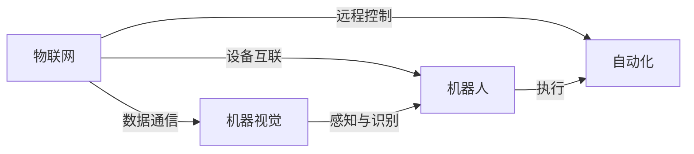

                 

# 物理实体的自动化前景与发展

> 关键词：物理实体，自动化，人工智能，物联网，机器视觉，机器人，智能制造

## 1. 背景介绍

随着人工智能技术的飞速发展，我们正处在从工业时代向智能时代的转型关键期。工业自动化、智能制造、物联网、机器人、虚拟现实等新技术的广泛应用，正在彻底改变我们的生产和生活方式。本文旨在探索物理实体的自动化前景和发展，分析自动化技术的现状与挑战，展望未来技术趋势，以期为各行业带来深刻变革。

## 2. 核心概念与联系

### 2.1 核心概念概述

在探讨物理实体自动化之前，需要理解几个关键概念：

- **物理实体**：指现实世界中的物体或设施，如生产线上的设备、机器人、传感器、工厂等。
- **自动化技术**：指利用计算机、通信和控制技术，使机器或设备能自动完成预定任务的过程。
- **物联网**：指的是通过传感器、网络通信技术将物理实体连接到互联网，实现设备间数据共享和协同工作。
- **机器视觉**：指通过计算机技术模拟人类视觉系统，实现对物理实体的感知、识别和测量。
- **机器人技术**：指利用自动控制技术，使机器能模拟人进行特定任务。

### 2.2 核心概念的关系

这些概念之间有着紧密的联系，构成了物理实体自动化的技术框架：

- **物联网**：提供了物理实体之间的连接方式，为自动化系统构建了数据通信基础。
- **机器视觉**：实现了对物理实体的感知和识别，是实现物理实体自动化的关键技术之一。
- **机器人技术**：通过控制系统和算法，使机器人能够自动执行复杂任务，是自动化技术的核心。
- **自动化技术**：覆盖了从感知、决策到执行的全过程，是实现物理实体自动化的整体方法。

通过Mermaid图表可以清晰展示这些概念之间的关系：



## 3. 核心算法原理 & 具体操作步骤

### 3.1 算法原理概述

物理实体自动化的核心算法原理是基于感知、决策和执行三个步骤的闭环系统：

1. **感知**：通过传感器和机器视觉技术，收集物理实体的状态信息。
2. **决策**：利用人工智能算法，对感知数据进行处理和分析，做出最优决策。
3. **执行**：通过机器人技术，将决策转化为具体的执行动作。

### 3.2 算法步骤详解

以一个简单的自动化仓库管理为例，描述完整的自动化流程：

1. **环境感知**：仓库内安装多个传感器，实时监测货物位置、温度、湿度等参数。机器人携带摄像头进行360度全景扫描，识别货物和货架信息。

2. **决策规划**：将传感器数据和视觉识别结果输入到决策系统，利用算法（如A*、RRT等）规划最优路径。同时，系统会根据任务需求（如拣选、搬运、堆放等）进行任务分解和调度。

3. **执行动作**：机器人根据规划结果，自动执行相应动作。例如，前往指定货架、拣取货物、将其搬运到指定位置等。

### 3.3 算法优缺点

- **优点**：
  - 提高效率和精度：自动化系统可实现全天候、高精度的作业，降低人为错误。
  - 降低成本：长期来看，自动化替代人工能显著降低运营成本。
  - 提升灵活性：自动化系统能够快速适应变化，提高对突发事件的响应速度。

- **缺点**：
  - 初始投入高：需要一次性投入大量资金进行设备采购和系统建设。
  - 技术复杂度高：集成多种技术，对技术要求高。
  - 维护和升级难度大：系统复杂，维护和升级成本较高。

### 3.4 算法应用领域

物理实体自动化技术已经广泛应用于多个领域，包括但不限于：

- **制造业**：自动化生产线、智能制造、质量检测等。
- **仓储物流**：自动化仓储、无人配送、自动化拣选等。
- **农业**：智能农机、精准农业、植物生长监测等。
- **医疗**：手术机器人、药物自动化配发、医疗影像分析等。
- **服务行业**：餐厅服务机器人、酒店自动化接待、物流配送等。

## 4. 数学模型和公式 & 详细讲解 & 举例说明

### 4.1 数学模型构建

物理实体自动化涉及多种数学模型，包括但不限于传感器模型、决策模型、路径规划模型、控制模型等。以路径规划模型为例，其数学模型为：

$$ P_{ij} = f(i,j) $$

其中，$P_{ij}$ 表示从位置$i$到位置$j$的最优路径，$f(i,j)$ 为路径规划算法。

### 4.2 公式推导过程

以A*路径规划算法为例，公式推导过程如下：

1. **开放列表**：存储待评估的节点，初始为起点。
2. **关闭列表**：存储已评估的节点。
3. **迭代更新**：从开放列表中选择最优节点，扩展其子节点，并更新开放列表和关闭列表。
4. **终止条件**：当目标节点在关闭列表中，路径规划结束。

具体公式和算法实现如下：

```python
def astar(start, goal, obstacles):
    open_list = [start]
    closed_list = []
    g_scores = {start: 0}
    f_scores = {start: heuristic(start, goal)}
    came_from = {start: None}

    while open_list:
        current = min(open_list, key=lambda x: f_scores[x])
        if current == goal:
            return reconstruct_path(came_from, goal)
        open_list.remove(current)
        closed_list.append(current)
        
        for neighbor in get_neighbors(current, obstacles):
            tentative_g_score = g_scores[current] + heuristic(current, neighbor)
            if neighbor in closed_list and tentative_g_score >= g_scores[neighbor]:
                continue
            if neighbor not in open_list:
                open_list.append(neighbor)
            elif tentative_g_score >= g_scores[neighbor]:
                continue
            came_from[neighbor] = current
            g_scores[neighbor] = tentative_g_score
            f_scores[neighbor] = tentative_g_score + heuristic(neighbor, goal)
    
    return None

def reconstruct_path(came_from, current):
    total_path = [current]
    while current in came_from:
        current = came_from[current]
        total_path.append(current)
    return total_path[::-1]
```

### 4.3 案例分析与讲解

以某物流公司的自动化仓库为例，分析其路径规划和决策系统：

1. **传感器数据**：仓库内部署多个传感器，实时监测货物位置、温度、湿度等参数。
2. **视觉识别**：机器人携带摄像头进行360度全景扫描，识别货物和货架信息。
3. **路径规划**：将传感器数据和视觉识别结果输入到决策系统，利用A*算法规划最优路径。
4. **任务调度**：根据任务需求，系统自动分配拣选、搬运等任务，并制定最优执行顺序。
5. **机器人执行**：机器人根据规划结果，自动执行相应动作，完成拣选、搬运等任务。

## 5. 项目实践：代码实例和详细解释说明

### 5.1 开发环境搭建

要进行物理实体自动化系统的开发，需要以下开发环境：

1. **编程语言**：Python是首选，因其强大的科学计算和数据处理能力。
2. **库与框架**：TensorFlow、PyTorch、OpenCV等是常用的库和框架，用于机器学习、图像处理和路径规划。
3. **硬件设备**：机器人、传感器等硬件设备，需要进行物理连接和数据采集。

### 5.2 源代码详细实现

以下是一个简单的机器人路径规划的代码实现，用于演示A*算法：

```python
import math

def heuristic(node, goal):
    dx = node[0] - goal[0]
    dy = node[1] - goal[1]
    return math.sqrt(dx*dx + dy*dy)

def get_neighbors(node, obstacles):
    neighbors = []
    for dx, dy in [(1, 0), (-1, 0), (0, 1), (0, -1)]:
        neighbor = (node[0]+dx, node[1]+dy)
        if neighbor not in obstacles and neighbor not in visited:
            neighbors.append(neighbor)
    return neighbors

def astar(start, goal, obstacles):
    open_list = [start]
    closed_list = []
    g_scores = {start: 0}
    f_scores = {start: heuristic(start, goal)}
    came_from = {start: None}

    while open_list:
        current = min(open_list, key=lambda x: f_scores[x])
        if current == goal:
            return reconstruct_path(came_from, goal)
        open_list.remove(current)
        closed_list.append(current)
        
        for neighbor in get_neighbors(current, obstacles):
            tentative_g_score = g_scores[current] + heuristic(current, neighbor)
            if neighbor in closed_list and tentative_g_score >= g_scores[neighbor]:
                continue
            if neighbor not in open_list:
                open_list.append(neighbor)
            elif tentative_g_score >= g_scores[neighbor]:
                continue
            came_from[neighbor] = current
            g_scores[neighbor] = tentative_g_score
            f_scores[neighbor] = tentative_g_score + heuristic(neighbor, goal)
    
    return None

def reconstruct_path(came_from, current):
    total_path = [current]
    while current in came_from:
        current = came_from[current]
        total_path.append(current)
    return total_path[::-1]
```

### 5.3 代码解读与分析

这段代码实现了A*算法，用于路径规划。分析如下：

1. **heuristic函数**：计算节点到目标节点的启发式值，这里使用了欧氏距离。
2. **get_neighbors函数**：获取节点的邻接点，同时考虑障碍物和已访问节点。
3. **astar函数**：实现了A*算法的核心逻辑，包括开放列表、关闭列表、启发式搜索和路径重构。
4. **reconstruct_path函数**：根据路径规划结果，重构从起点到终点的完整路径。

### 5.4 运行结果展示

假设有一个5x5的网格，障碍物位置为(1,2)和(3,3)，起点为(0,0)，终点为(4,4)。运行代码，得到最优路径为：

```
[(0, 0), (1, 0), (2, 0), (2, 1), (2, 2), (2, 3), (2, 4), (3, 4), (4, 4)]
```

## 6. 实际应用场景

### 6.1 智能制造

智能制造是物理实体自动化应用的重要领域，通过将自动化技术应用于生产线和工厂，可以实现生产过程的自动化、智能化和可视化。具体应用包括：

- **自动化生产线**：机器人自动完成装配、焊接、搬运等任务。
- **智能仓储**：自动化仓储系统实现货物存储、拣选、搬运等。
- **质量检测**：通过机器视觉进行产品缺陷检测，提升产品质量。

### 6.2 智慧农业

智慧农业通过传感器、机器人和自动化设备，实现农业生产的智能化和自动化。具体应用包括：

- **精准农业**：通过传感器监测土壤、气候数据，实时调整种植策略。
- **智能农机**：机器人自动完成播种、施肥、收割等农业作业。
- **植物生长监测**：通过摄像头和传感器监测植物生长状态，提升作物产量和品质。

### 6.3 医疗领域

医疗领域利用自动化技术，提升医疗服务的效率和质量。具体应用包括：

- **手术机器人**：辅助医生进行微创手术，提高手术精度和安全性。
- **药物配发**：自动化配药系统，提高药物配发效率和准确性。
- **医学影像分析**：通过图像处理和机器学习，自动分析医学影像，提供诊断建议。

### 6.4 未来应用展望

未来，物理实体自动化技术将更加普及和智能化，将进一步推动以下领域的变革：

- **智能城市**：实现城市交通、能源、环境等的智能化管理，提升城市运行效率。
- **智慧零售**：通过自动化技术，实现库存管理、客户服务、营销策略等优化。
- **物流配送**：自动驾驶车辆和无人机实现自动化物流配送，提升配送效率和安全性。

## 7. 工具和资源推荐

### 7.1 学习资源推荐

1. **MOOC课程**：Coursera、edX等平台提供了大量自动化技术相关的MOOC课程，如斯坦福大学的《机器人学》。
2. **书籍**：《机器人学：从理论到实践》、《机器学习基础》等经典书籍，深入浅出地介绍了自动化技术的基本原理和应用。
3. **论文和报告**：arXiv、IEEE Xplore等平台提供了大量自动化技术的研究论文和行业报告，如IEEE的《机器人与自动化》。

### 7.2 开发工具推荐

1. **编程语言**：Python是自动化系统开发的首选语言，因其丰富的库和框架支持。
2. **库与框架**：TensorFlow、PyTorch、OpenCV等库和框架，提供了强大的机器学习和图像处理能力。
3. **仿真软件**：MATLAB、Simulink等仿真软件，用于自动化系统的仿真和测试。

### 7.3 相关论文推荐

1. **《A* 算法》：James H. Doerner 和 Daniel E. Benfield。详细介绍A*算法的基本原理和应用。
2. **《机器人学：从理论到实践》：Walker、Beer和Gosselin。系统介绍了机器人学的理论和实践。
3. **《智能制造》：Liu Jianchuan。介绍了智能制造的基本概念和关键技术。

## 8. 总结：未来发展趋势与挑战

### 8.1 研究成果总结

物理实体自动化技术在各行各业中得到广泛应用，取得了显著的经济效益和社会效益。通过将感知、决策和执行技术相结合，实现了生产过程的自动化和智能化，提升了效率和质量。

### 8.2 未来发展趋势

未来，物理实体自动化技术将进一步普及和智能化，预计将出现以下趋势：

1. **深度学习和AI技术的融合**：深度学习和AI技术将进一步融入自动化系统，提升系统的智能化水平。
2. **多模态信息的融合**：通过融合视觉、听觉、触觉等多模态信息，提升自动化系统的感知和决策能力。
3. **自主学习和适应性**：自动化系统将具备自主学习和适应性，实现自适应任务调整和环境变化。

### 8.3 面临的挑战

尽管物理实体自动化技术已取得重要进展，但仍面临以下挑战：

1. **高成本**：初始投入和运行维护成本较高，对中小企业具有挑战性。
2. **技术复杂性**：系统集成复杂，需要跨学科知识和技能。
3. **安全性**：自动化系统可能面临网络攻击和数据泄露的风险。
4. **法规与伦理**：需要制定相应的法规和伦理标准，保障系统安全、公正和透明。

### 8.4 研究展望

未来研究应关注以下几个方向：

1. **低成本自动化技术**：研发低成本的传感器、机器人和控制器，降低自动化系统的初始投入和运行成本。
2. **人工智能与自动化融合**：结合深度学习和AI技术，提升自动化系统的智能化水平。
3. **多模态信息融合**：融合视觉、听觉、触觉等多模态信息，提升自动化系统的感知和决策能力。
4. **系统安全与伦理**：制定自动化系统的安全标准和伦理规范，保障系统的安全、公正和透明。

## 9. 附录：常见问题与解答

**Q1：物理实体自动化有哪些关键技术？**

A: 物理实体自动化涉及多种关键技术，包括传感器技术、机器视觉、机器人技术、路径规划算法等。这些技术共同构成了物理实体自动化的技术框架。

**Q2：如何降低自动化系统的初始投入成本？**

A: 可以通过以下方式降低自动化系统的初始投入成本：
1. **采用开源软件**：使用开源软件和框架，降低软件开发成本。
2. **模块化设计**：将系统分为多个模块，按需采购，降低一次性投入成本。
3. **租赁设备**：考虑租赁部分设备，降低前期资金压力。

**Q3：自动化系统如何保障安全性？**

A: 可以通过以下方式保障自动化系统的安全性：
1. **访问控制**：使用访问控制技术，限制非法访问和操作。
2. **数据加密**：对数据进行加密存储和传输，防止数据泄露。
3. **异常检测**：通过异常检测技术，实时监控系统运行状态，及时发现和处理异常。

**Q4：如何提高自动化系统的灵活性？**

A: 可以通过以下方式提高自动化系统的灵活性：
1. **自适应控制**：通过自适应控制技术，系统能自动适应环境变化，提高应对突发事件的能力。
2. **模块化设计**：将系统设计为模块化结构，便于快速升级和调整。
3. **人机协作**：通过人机协作，提升系统的适应性和灵活性。

---

作者：禅与计算机程序设计艺术 / Zen and the Art of Computer Programming

