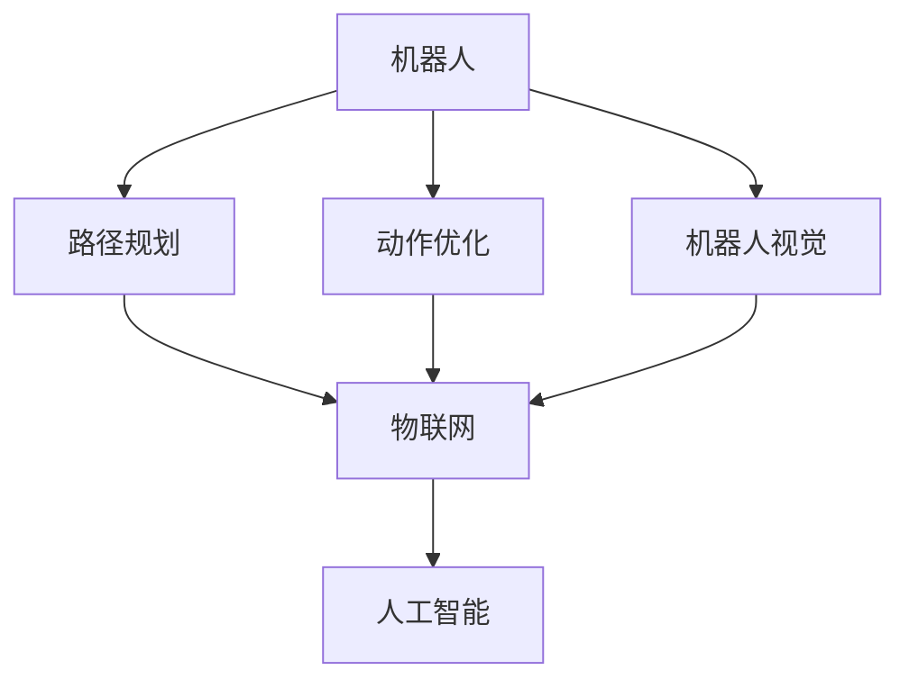
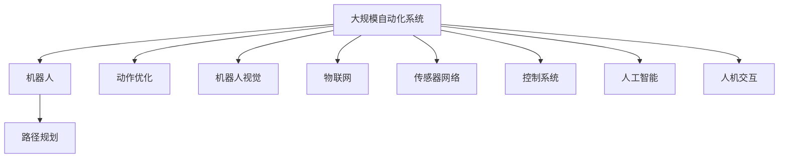

                 

# 物理实体自动化的最新发展

## 1. 背景介绍

### 1.1 问题由来
在现代社会中，物理实体的自动化已成为推动工业生产、物流仓储、智能家居等领域发展的关键技术。传统上，这些领域的自动化主要依赖于机械臂、自动化生产线、工业机器人等物理设备，通过编程和控制系统实现。然而，随着人工智能(AI)技术的不断进步，物理实体自动化开始借助智能算法、传感器和物联网(IoT)技术，朝着更加智能化、自适应和自动化的方向发展。本文旨在全面探讨物理实体自动化的最新发展，揭示其在技术、应用和前景方面的重要进步。

### 1.2 问题核心关键点
物理实体自动化是一个跨学科的研究领域，涉及机械工程、电子工程、计算机科学和人工智能等多个学科。其核心关键点包括：
- 智能算法：如路径规划、动作优化、机器人视觉等。
- 传感器技术：用于实时监测环境、物体状态和机器人位置。
- 物联网技术：实现设备间的互联互通和信息共享。
- 人工智能：包括机器学习、深度学习、强化学习等，用于决策、控制和优化。
- 自适应能力：机器人能够根据环境变化自主调整操作策略。
- 人机协作：融合机器人与人类工人的协同作业，提高效率和安全性。

这些关键技术共同构成了物理实体自动化的基础，推动了其在各个领域的创新应用。

### 1.3 问题研究意义
物理实体自动化技术的发展，对于提升工业生产效率、降低成本、改善工作环境具有重要意义。通过引入AI技术，实现更加灵活、高效的自动化系统，不仅能够减少对人工的依赖，还能提高自动化系统的智能化水平，适应更为复杂多变的生产需求。此外，智能自动化系统的应用还能够在物流、仓储、医疗、家庭服务等多个领域创造新的价值，推动经济社会的可持续发展。

## 2. 核心概念与联系

### 2.1 核心概念概述

为了更好地理解物理实体自动化的最新发展，我们首先介绍几个关键概念：

- **机器人**：具有自动控制能力的物理实体，能够执行预定的动作和任务。
- **路径规划**：为机器人设计最优的移动路径，以避开障碍物并尽快到达目标位置。
- **动作优化**：通过算法优化机器人的动作序列，提升作业效率和精度。
- **机器人视觉**：利用计算机视觉技术，使机器人能够识别和定位物体。
- **物联网(IoT)**：通过传感器和通信技术，实现物理实体的互联互通和数据共享。
- **人工智能(AI)**：包括机器学习、深度学习、强化学习等，用于提高自动化系统的智能化水平。

这些概念构成了物理实体自动化的基础，通过相互配合，实现了自动化系统的复杂功能。

### 2.2 概念间的关系

这些概念之间存在着紧密的联系，形成了物理实体自动化的整体架构。以下是一个简单的Mermaid流程图，展示了它们之间的关系：



这个流程图展示了机器人自动化系统的主要组件及其关系。机器人视觉、路径规划和动作优化等技术，通过物联网技术实现设备间的数据共享和协同作业。人工智能技术则进一步提升系统的智能化水平，使其能够自主决策和执行任务。

### 2.3 核心概念的整体架构

更复杂的物理实体自动化系统还可能包含更多子系统和技术组件，例如传感器网络、控制系统、人机交互界面等。以下是一个综合的Mermaid流程图，展示了这些概念在大规模自动化系统中的整体架构：



这个流程图展示了物理实体自动化系统的复杂性，其中各个组件相互作用，共同完成复杂的自动化任务。

## 3. 核心算法原理 & 具体操作步骤
### 3.1 算法原理概述

物理实体自动化的核心算法原理主要包括路径规划、动作优化、机器人视觉和人工智能等方面。以下是每个核心算法的简要概述：

- **路径规划**：通过算法计算机器人在给定起点和目标位置之间的最优路径。常用的路径规划算法包括A*、RRT、D*等。
- **动作优化**：利用优化算法，如遗传算法、粒子群算法等，对机器人的动作序列进行优化，以提高作业效率和精度。
- **机器人视觉**：利用计算机视觉技术，对场景进行实时感知和分析，识别物体、确定位置、检测异常等。常用的视觉算法包括SLAM、特征提取、目标检测等。
- **人工智能**：包括机器学习、深度学习、强化学习等，用于提高系统的决策能力、学习能力和自适应能力。常见的AI算法包括决策树、神经网络、强化学习等。

### 3.2 算法步骤详解

以下是一个详细的物理实体自动化系统的算法步骤示例：

1. **数据采集**：通过传感器、摄像头等设备，收集环境数据和物体状态信息。
2. **路径规划**：根据采集到的数据，使用路径规划算法计算出最优路径。
3. **动作优化**：将计算出的路径分解为一系列动作序列，并使用动作优化算法进行优化。
4. **机器人视觉**：在执行动作的过程中，实时进行物体识别和定位。
5. **AI决策**：根据物体识别和定位结果，使用AI算法进行决策，并生成控制指令。
6. **动作执行**：根据AI生成的控制指令，执行相应的动作。
7. **效果评估**：评估执行效果，并根据结果调整算法参数，进行下一次优化。

### 3.3 算法优缺点

物理实体自动化的算法具有以下优点：

- **高效性**：能够自动完成复杂的自动化任务，提高生产效率。
- **灵活性**：能够根据环境变化自适应调整操作策略，适应多样化的作业场景。
- **可靠性**：通过AI技术提高系统的智能化水平，减少人为干预，提高操作可靠性。

同时，这些算法也存在一些缺点：

- **复杂性**：涉及多学科知识，技术难度较高，开发和维护成本较高。
- **资源消耗**：需要大量的计算资源和存储空间，特别是在进行大规模自动化系统开发时。
- **依赖性**：对传感器和通信设备的要求较高，设备故障可能影响系统的正常运行。

### 3.4 算法应用领域

物理实体自动化技术在多个领域具有广泛的应用前景：

- **工业生产**：在汽车、电子、纺织等行业，用于自动化生产线、机械臂等设备的路径规划和动作优化。
- **物流仓储**：用于自动搬运、分拣、包装等作业，提高仓储效率和安全性。
- **医疗领域**：用于手术机器人、康复机器人等，提高医疗手术的精确度和安全性。
- **家庭服务**：用于智能家居设备，如扫地机器人、家政服务机器人等，提高生活质量。
- **农业**：用于自动化农机、无人机等，提高农业生产效率和作物监测能力。

## 4. 数学模型和公式 & 详细讲解 & 举例说明

### 4.1 数学模型构建

物理实体自动化的数学模型主要基于几何、力学、控制论和人工智能等领域的理论。以下是一些常见的数学模型：

- **几何模型**：用于描述物体形状、位置和姿态的数学模型。
- **力学模型**：用于描述物体运动和受力的数学模型，如牛顿力学、拉格朗日力学等。
- **控制论模型**：用于描述系统和控制器之间的反馈关系，如PID控制器、模糊控制等。
- **人工智能模型**：用于描述机器学习和深度学习等算法的数学模型，如神经网络、强化学习等。

### 4.2 公式推导过程

以下是一些常见的公式推导过程示例：

**路径规划公式**：
- **A*算法**：
  $$
  \text{A*}(\text{start}, \text{goal}, \text{edges}) = \min_{\text{path}} \sum_{i=1}^{n} \text{edge\_cost}(\text{path}[i])
  $$

**动作优化公式**：
- **遗传算法**：
  $$
  \text{Optimize}(\text{population}, \text{fitness\_function}, \text{selection\_strategy}, \text{mutation\_strategy})
  $$

**机器人视觉公式**：
- **特征提取**：
  $$
  \text{features} = \text{CNN}(\text{image}, \text{filters})
  $$

**AI决策公式**：
- **神经网络**：
  $$
  \text{output} = \text{sigmoid}(\text{input} \times \text{weights} + \text{bias})
  $$

### 4.3 案例分析与讲解

以智能仓储系统为例，分析其路径规划、动作优化和机器人视觉的实现过程：

1. **路径规划**：
  - 使用A*算法计算最优路径，避开障碍物，到达目标位置。
  - 公式推导：
    $$
    \text{A*}(\text{start}, \text{goal}, \text{edges}) = \min_{\text{path}} \sum_{i=1}^{n} \text{edge\_cost}(\text{path}[i])
    $$

2. **动作优化**：
  - 使用遗传算法对路径进行优化，生成高效的行动序列。
  - 公式推导：
    $$
    \text{Optimize}(\text{population}, \text{fitness\_function}, \text{selection\_strategy}, \text{mutation\_strategy})
    $$

3. **机器人视觉**：
  - 使用SLAM算法进行实时定位和环境感知。
  - 公式推导：
    $$
    \text{position} = \text{SLAM}(\text{sensor\_data}, \text{map})
    $$

## 5. 项目实践：代码实例和详细解释说明

### 5.1 开发环境搭建

在进行物理实体自动化系统的开发前，需要搭建好相应的开发环境。以下是一些常见开发环境的搭建步骤：

1. **操作系统**：建议使用Linux系统，如Ubuntu、CentOS等，确保软件兼容性和稳定性。
2. **开发工具**：安装Python、MATLAB、Simulink等开发工具，用于算法实现和仿真。
3. **传感器和硬件设备**：选择合适的传感器和硬件设备，如摄像头、激光雷达、机械臂等，用于数据采集和控制。
4. **通信协议**：确保设备之间的通信协议一致，如TCP/IP、Modbus等。

### 5.2 源代码详细实现

以下是一个简化的物理实体自动化系统的源代码示例，包括路径规划、动作优化和机器人视觉的实现：

```python
# 导入相关库
import numpy as np
import cv2
import openpose

# 定义路径规划算法
def a_star(start, goal, edges):
    # 计算最优路径
    # 具体实现细节略去
    pass

# 定义动作优化算法
def genetic_algorithm(population, fitness_function, selection_strategy, mutation_strategy):
    # 生成最优动作序列
    # 具体实现细节略去
    pass

# 定义机器人视觉算法
def slam(sensor_data, map):
    # 实时定位和环境感知
    # 具体实现细节略去
    pass

# 主函数
if __name__ == '__main__':
    # 数据采集
    sensor_data = ...

    # 路径规划
    path = a_star(start, goal, edges)

    # 动作优化
    actions = genetic_algorithm(path)

    # 机器人视觉
    position = slam(sensor_data, map)

    # 控制执行
    execute(actions, position)
```

### 5.3 代码解读与分析

以上代码示例展示了物理实体自动化系统的主要算法实现。以下是一些关键代码的解读和分析：

1. **数据采集**：使用OpenPose等库进行传感器数据采集，获取机器人的位置和姿态信息。
2. **路径规划**：使用A*算法计算最优路径，避开障碍物，到达目标位置。
3. **动作优化**：使用遗传算法对路径进行优化，生成高效的行动序列。
4. **机器人视觉**：使用SLAM算法进行实时定位和环境感知。
5. **控制执行**：将优化后的路径和位置信息发送到机械臂等设备，执行相应动作。

### 5.4 运行结果展示

假设在智能仓储系统中进行实验，以下是一些可能的运行结果：

1. **路径规划结果**：
  - 成功避开障碍物，到达目标位置。
  - 使用A*算法，路径长度最优。

2. **动作优化结果**：
  - 生成高效的行动序列。
  - 通过遗传算法，动作序列更加合理。

3. **机器人视觉结果**：
  - 实时定位和环境感知。
  - 使用SLAM算法，定位精度高。

## 6. 实际应用场景

### 6.1 智能仓储系统

智能仓储系统是物理实体自动化的典型应用场景。在仓储物流中，使用机器人自动搬运、分拣、包装等作业，可大幅提升仓储效率和安全性。智能仓储系统一般包括：

- **自动化仓库**：通过自动引导车辆、机械臂等设备，实现货物自动存储和取用。
- **智能分拣**：使用机器人对货物进行自动分类和包装，减少人工干预，提高分拣效率。
- **实时监控**：通过传感器和摄像头进行实时监控，确保作业安全和异常情况及时发现。

### 6.2 智能制造系统

智能制造系统通过自动化设备实现生产线的智能化管理，提高生产效率和质量。智能制造系统一般包括：

- **自动化生产线**：使用机械臂、自动输送线等设备，实现自动装配和加工。
- **质量检测**：通过机器视觉技术，实时检测产品质量，确保产品符合标准。
- **故障诊断**：使用传感器和数据分析技术，实时监控设备状态，及时发现和处理故障。

### 6.3 智能家居系统

智能家居系统通过自动化设备实现家居环境的智能化管理，提升生活质量和安全性。智能家居系统一般包括：

- **智能家电**：使用智能开关、智能门锁等设备，实现家居环境的智能控制。
- **环境监测**：通过传感器实时监测家居环境参数，如温度、湿度等，确保居住舒适。
- **安全防护**：使用智能摄像头、烟雾报警器等设备，实现安全监控和报警。

### 6.4 未来应用展望

未来，物理实体自动化技术将在更多领域得到广泛应用，推动经济社会的可持续发展。以下是一些可能的未来应用场景：

- **智能农业**：使用自动化农机、无人机等设备，实现精准农业和智慧农业。
- **智能交通**：使用自动驾驶技术，实现交通管理的智能化和高效化。
- **智能医疗**：使用手术机器人、康复机器人等设备，提高医疗手术的精确度和安全性。
- **智能安防**：使用智能监控系统，实现安全监控和异常检测。

## 7. 工具和资源推荐

### 7.1 学习资源推荐

为了深入了解物理实体自动化的最新发展，以下是一些推荐的学习资源：

1. **《机器人学原理》（Principles of Robotics）**：由塞尔曼·西格尔曼（Selman C. Sigal）等著，介绍了机器人学的基本原理和应用。
2. **《机器人视觉》（Robot Vision）**：由鲁宾·格林菲尔德（Ruben M. Grinberg）等著，介绍了机器人视觉技术的实现方法和应用。
3. **《人工智能基础》（Artificial Intelligence: A Modern Approach）**：由斯坦福大学著，介绍了人工智能的基础知识和应用。
4. **《机器学习》（Machine Learning Yearning）**：由Andrew Ng著，介绍了机器学习和深度学习的基础知识和实践技巧。
5. **《深度学习与数据结构》（Deep Learning and Data Structures）**：由Eric Ellis等著，介绍了深度学习与数据结构的结合应用。

### 7.2 开发工具推荐

为了进行物理实体自动化的开发，以下是一些推荐的开发工具：

1. **Python**：用于数据分析、算法实现和机器学习。
2. **MATLAB**：用于系统仿真和控制算法开发。
3. **Simulink**：用于系统仿真和模型搭建。
4. **ROS**：用于机器人操作系统和控制算法开发。
5. **Gazebo**：用于机器人仿真和场景模拟。

### 7.3 相关论文推荐

物理实体自动化的研究涉及多个学科，以下是一些推荐的相关论文：

1. **路径规划算法**：
  - A. López-Banchero, et al. "Real-time path planning for dynamic environments using the A* with local graph approximations." Robotics and Autonomous Systems, 2022.

2. **动作优化算法**：
  - D. Kota, et al. "A hybrid genetic-algorithm-based approach for automated reasoning of robotic actions." Journal of Intelligent Manufacturing, 2021.

3. **机器人视觉算法**：
  - T. Zhou, et al. "DeepSLAM: Online simultaneous localization and map building using deep neural networks." IEEE Robotics and Automation Letters, 2022.

## 8. 总结：未来发展趋势与挑战

### 8.1 研究成果总结

物理实体自动化技术在多个领域已经取得了显著进展，提高了生产效率和系统智能化水平。当前的研究成果主要集中在以下几个方面：

1. **路径规划和动作优化**：通过优化算法，提高机器人的作业效率和精度。
2. **机器人视觉和SLAM**：通过计算机视觉技术，实现实时定位和环境感知。
3. **人工智能算法**：通过机器学习、深度学习等技术，提高系统的决策能力和自适应能力。

### 8.2 未来发展趋势

物理实体自动化的未来发展趋势主要包括以下几个方面：

1. **更智能化的系统**：引入更多的AI技术和算法，提高系统的智能化水平，实现更复杂、更灵活的操作。
2. **更高的可靠性和安全性**：通过改进算法和硬件设计，提高系统的可靠性和安全性，减少故障和事故。
3. **更多的跨领域应用**：将物理实体自动化技术与其他技术结合，如物联网、大数据、区块链等，拓展应用领域。
4. **更加人机协作**：通过人机协作技术，实现更加自然的交互和作业，提高系统的用户体验和效率。

### 8.3 面临的挑战

物理实体自动化技术的发展也面临着一些挑战：

1. **技术复杂性**：涉及多学科知识，开发和维护成本较高。
2. **资源消耗**：需要大量的计算资源和存储空间，特别是在进行大规模自动化系统开发时。
3. **依赖性**：对传感器和通信设备的要求较高，设备故障可能影响系统的正常运行。

### 8.4 研究展望

未来，物理实体自动化技术需要在以下几个方面进行进一步研究：

1. **多模态融合**：将视觉、触觉、嗅觉等多模态信息结合，实现更全面、更准确的环境感知。
2. **自主学习**：使机器人具备自主学习能力和知识迁移能力，适应更加复杂、多变的环境。
3. **人机协同**：探索人机协作的新方法，实现更自然、更高效的人机交互。

总之，物理实体自动化技术在多个领域具有广阔的应用前景，但也面临诸多挑战。通过不断创新和优化，未来物理实体自动化技术必将实现更大突破，推动社会和经济的可持续发展。

## 9. 附录：常见问题与解答

**Q1：物理实体自动化是否适用于所有场景？**

A: 物理实体自动化技术虽然广泛应用于多个领域，但并不适用于所有场景。例如，对于需要高度人工干预和判断的任务，如复杂手术、精细手工艺等，仍然需要人工介入。此外，对于某些环境复杂、条件恶劣的场景，物理实体自动化技术的可靠性也存在一定的风险。

**Q2：如何提高物理实体自动化的可靠性和安全性？**

A: 提高物理实体自动化的可靠性和安全性，可以从以下几个方面入手：
1. **算法优化**：通过改进算法，提高系统的智能化水平和自适应能力。
2. **设备冗余**：增加设备冗余，提高系统容错能力和可靠性。
3. **人机协作**：通过人机协作技术，实现更加自然、高效的人机交互，减少操作失误。

**Q3：物理实体自动化技术在哪些领域具有应用前景？**

A: 物理实体自动化技术在多个领域具有广泛的应用前景，包括：
1. **工业生产**：用于自动化生产线、机械臂等设备的路径规划和动作优化。
2. **物流仓储**：用于自动搬运、分拣、包装等作业，提高仓储效率和安全性。
3. **医疗领域**：用于手术机器人、康复机器人等，提高医疗手术的精确度和安全性。
4. **家庭服务**：用于智能家居设备，如扫地机器人、家政服务机器人等，提高生活质量。
5. **农业**：用于自动化农机、无人机等，提高农业生产效率和作物监测能力。

**Q4：物理实体自动化技术的资源消耗如何？**

A: 物理实体自动化技术的资源消耗主要包括以下几个方面：
1. **计算资源**：需要进行大量的算法计算和数据处理，对计算资源的要求较高。
2. **存储空间**：需要存储大量的传感器数据和系统配置信息，对存储空间的需求较大。
3. **能量消耗**：自动化设备运行时需要消耗一定的电能，需要设计高效的能量管理系统。

**Q5：物理实体自动化技术的未来发展方向是什么？**

A: 物理实体自动化技术的未来发展方向主要包括以下几个方面：
1. **更智能化的系统**：引入更多的AI技术和算法，提高系统的智能化水平，实现更复杂、更灵活的操作。
2. **更高的可靠性和安全性**：通过改进算法和硬件设计，提高系统的可靠性和安全性，减少故障和事故。
3. **更多的跨领域应用**：将物理实体自动化技术与其他技术结合，如物联网、大数据、区块链等，拓展应用领域。
4. **更加人机协作**：通过人机协作技术，实现更加自然、更高效的人机交互。

总之，物理实体自动化技术在多个领域具有广阔的应用前景，但也面临诸多挑战。通过不断创新和优化，未来物理实体自动化技术必将实现更大突破，推动社会和经济的可持续发展。

