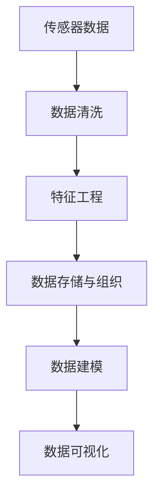
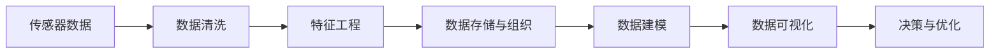
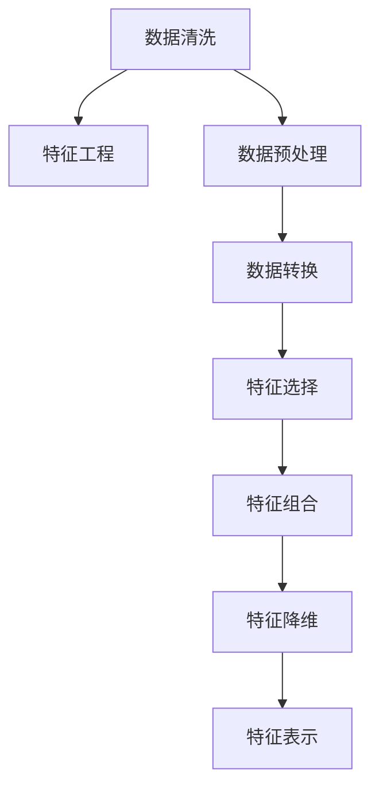
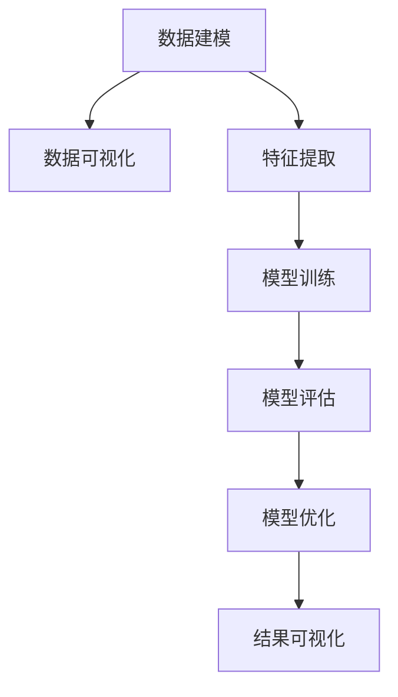
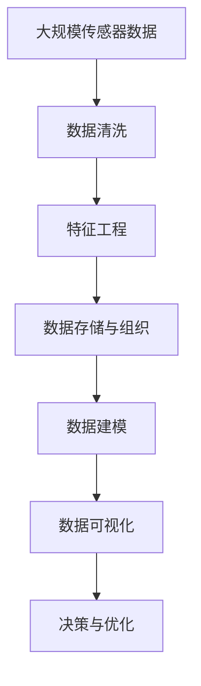

                 

# 物联网(IoT)技术和各种传感器设备的集成：传感器数据的处理与分析

## 1. 背景介绍

### 1.1 问题由来
随着物联网(IoT)技术的快速发展和普及，传感器设备在智能家居、智慧城市、工业互联网等多个领域得到了广泛应用。传感器能够实时收集各类环境参数、设备状态、用户行为等信息，为智能应用提供了坚实的数据基础。然而，传感器数据种类繁多，格式各异，如何高效地处理与分析这些数据，成为了物联网应用的难点和瓶颈。

### 1.2 问题核心关键点
传感器数据处理与分析的核心在于将传感器采集到的海量、异构数据，通过算法和模型转换为有价值的知识，以支持智能决策和优化。具体问题包括：
1. **数据采集与传输**：确保传感器数据能够稳定可靠地采集与传输。
2. **数据清洗与预处理**：去除噪音、填补缺失、进行特征工程等。
3. **数据存储与组织**：设计高效的数据存储方案，支持快速查询和分析。
4. **数据分析与建模**：应用机器学习、深度学习等技术进行数据建模，提取有用信息。
5. **数据可视化与解释**：将分析结果直观展示给用户，提供可操作的洞见。

### 1.3 问题研究意义
对传感器数据进行高效处理与分析，不仅能够提升物联网应用的性能和精度，还能挖掘出潜在价值，促进数据驱动的决策制定。这对于提高能源效率、优化生产流程、增强用户体验等具有重要意义：

1. **提高能源效率**：通过智能监测与控制，优化能源使用，降低能耗。
2. **优化生产流程**：实时监测设备状态，预测故障，提升生产效率。
3. **增强用户体验**：分析用户行为数据，提供个性化服务。
4. **促进数据驱动决策**：通过数据分析，为管理层提供科学的决策依据。

## 2. 核心概念与联系

### 2.1 核心概念概述
为更好地理解传感器数据的处理与分析方法，本节将介绍几个密切相关的核心概念：

- **传感器数据(Sensor Data)**：由传感器设备采集到的环境参数、设备状态、用户行为等信息，数据格式多样，通常需要转换为机器学习模型可用的数值形式。
- **数据清洗(Data Cleaning)**：去除数据中的噪音、填补缺失值、处理异常值等，确保数据的完整性和一致性。
- **特征工程(Feature Engineering)**：根据数据分析需求，对原始数据进行转换、组合、选择等操作，提取有用的特征。
- **数据存储与组织(Data Storage and Organization)**：设计高效的数据存储方案，支持快速查询和分析。
- **数据建模(Data Modeling)**：应用机器学习、深度学习等技术，对数据进行建模，提取有用信息。
- **数据可视化(Data Visualization)**：将分析结果通过图表、仪表盘等形式直观展示给用户。

这些核心概念之间的逻辑关系可以通过以下Mermaid流程图来展示：



这个流程图展示了大规模传感器数据从采集到最终可视化的完整过程。传感器数据首先经过清洗和特征工程，然后进行高效存储，接着通过建模提取信息，最后通过可视化将结果呈现给用户。

### 2.2 概念间的关系

这些核心概念之间存在着紧密的联系，形成了传感器数据处理与分析的完整生态系统。下面我通过几个Mermaid流程图来展示这些概念之间的关系。

#### 2.2.1 传感器数据处理与分析的流程图



这个流程图展示了传感器数据从采集到最终用于决策与优化的完整过程。传感器数据首先经过清洗和特征工程，然后进行高效存储，接着通过建模提取信息，最后通过可视化将结果呈现给用户，并用于决策与优化。

#### 2.2.2 数据清洗与特征工程的关系



这个流程图展示了数据清洗与特征工程之间的联系。数据清洗包括数据预处理、转换、选择、组合、降维等操作，从而提取有用的特征。

#### 2.2.3 数据建模与数据可视化的关系



这个流程图展示了数据建模与数据可视化之间的联系。数据建模通过特征提取、模型训练、评估和优化，提取有用信息，最后通过可视化将结果呈现给用户。

### 2.3 核心概念的整体架构

最后，我们用一个综合的流程图来展示这些核心概念在大规模传感器数据处理与分析过程中的整体架构：



这个综合流程图展示了从传感器数据采集到最终用于决策与优化的完整过程。传感器数据首先经过清洗和特征工程，然后进行高效存储，接着通过建模提取信息，最后通过可视化将结果呈现给用户，并用于决策与优化。

## 3. 核心算法原理 & 具体操作步骤
### 3.1 算法原理概述

传感器数据处理与分析的算法原理主要涉及数据清洗、特征工程、数据建模和数据可视化等几个关键步骤。

#### 3.1.1 数据清洗

数据清洗是传感器数据处理与分析的首要步骤，通过去除噪音、填补缺失、处理异常值等，确保数据的完整性和一致性。数据清洗通常包括以下几个步骤：

1. **去除噪音**：识别并删除传感器数据中的无用数据，如错误的测量值。
2. **填补缺失值**：对于缺失的数据，可以采用均值、中位数、插值等方法进行填充。
3. **处理异常值**：识别并处理传感器数据中的异常值，确保数据的可靠性。

#### 3.1.2 特征工程

特征工程是将原始数据转换为机器学习模型可用的特征的过程。特征工程的目标是提取最有用的特征，减少特征空间的维度，提高模型的性能。特征工程通常包括以下几个步骤：

1. **特征选择**：从原始数据中选择最相关的特征。
2. **特征提取**：对原始数据进行转换和组合，提取新的特征。
3. **特征降维**：通过PCA、LDA等方法，将高维特征空间压缩到低维空间。
4. **特征表示**：将特征转换为模型可用的数值形式，如数值化、归一化等。

#### 3.1.3 数据建模

数据建模是通过机器学习或深度学习等技术，对传感器数据进行建模，提取有用信息的过程。数据建模通常包括以下几个步骤：

1. **模型选择**：选择合适的模型，如线性回归、决策树、随机森林、神经网络等。
2. **模型训练**：在训练集上训练模型，调整模型的参数。
3. **模型评估**：在验证集上评估模型的性能，选择合适的超参数。
4. **模型优化**：对模型进行优化，提高模型性能。

#### 3.1.4 数据可视化

数据可视化是将分析结果通过图表、仪表盘等形式直观展示给用户的过程。数据可视化通常包括以下几个步骤：

1. **选择合适的可视化工具**：如Tableau、Power BI、D3.js等。
2. **数据准备**：将分析结果转换为可视化的数据格式。
3. **设计可视化图表**：设计合适的图表类型，展示分析结果。
4. **展示结果**：将可视化图表展示给用户。

### 3.2 算法步骤详解

#### 3.2.1 数据清洗步骤详解

1. **去除噪音**
   - 使用统计方法识别异常数据，如标准差、IQR等。
   - 使用专家知识识别错误数据，如传感器的故障信息。

2. **填补缺失值**
   - 使用均值、中位数等统计量填充缺失值。
   - 使用插值方法填补缺失值，如线性插值、样条插值等。

3. **处理异常值**
   - 使用统计方法识别异常值，如IQR、Z-score等。
   - 使用平滑方法处理异常值，如滑动平均、中值滤波等。

#### 3.2.2 特征工程步骤详解

1. **特征选择**
   - 使用相关性分析、互信息等方法选择最有用的特征。
   - 使用特征重要性评估方法，如L1正则化、随机森林等。

2. **特征提取**
   - 使用统计方法提取特征，如均值、方差等。
   - 使用模型学习提取特征，如PCA、LDA等。

3. **特征降维**
   - 使用PCA将高维特征空间压缩到低维空间。
   - 使用LDA进行特征降维，去除冗余特征。

4. **特征表示**
   - 将特征转换为数值形式，如数值化、归一化等。
   - 将特征转换为类别形式，如编码、独热编码等。

#### 3.2.3 数据建模步骤详解

1. **模型选择**
   - 根据数据特点选择适当的模型，如线性回归、决策树、神经网络等。
   - 根据任务需求选择适当的模型，如分类、回归、聚类等。

2. **模型训练**
   - 使用训练集训练模型，调整模型的参数。
   - 使用随机梯度下降、Adam等优化算法进行模型训练。

3. **模型评估**
   - 使用验证集评估模型的性能，如MAE、R²等。
   - 使用交叉验证方法评估模型的泛化性能。

4. **模型优化**
   - 使用正则化方法，如L1、L2正则化，避免过拟合。
   - 使用集成学习方法，如Bagging、Boosting，提高模型性能。

#### 3.2.4 数据可视化步骤详解

1. **选择合适的可视化工具**
   - 根据需求选择合适的可视化工具，如Tableau、Power BI、D3.js等。
   - 根据需求选择合适的图表类型，如折线图、散点图、热力图等。

2. **数据准备**
   - 将分析结果转换为可视化的数据格式。
   - 将时间序列数据转换为时间轴形式，方便展示变化趋势。

3. **设计可视化图表**
   - 设计合适的图表类型，展示分析结果。
   - 设计合适的颜色、标签等元素，增强可读性。

4. **展示结果**
   - 将可视化图表展示给用户。
   - 提供交互功能，如鼠标悬停、缩放等，增强用户体验。

### 3.3 算法优缺点

传感器数据处理与分析的算法具有以下优点：

- **高效性**：通过自动化处理与分析，能够快速生成有用的信息。
- **准确性**：通过合理的算法和模型，能够提取高精度的信息。
- **可解释性**：通过可视化的方式，能够直观展示分析结果，便于理解和决策。

同时，这些算法也存在以下缺点：

- **数据依赖**：算法效果依赖于高质量、完整的数据，数据质量差会影响算法效果。
- **复杂性**：算法实现复杂，需要一定的专业知识。
- **可扩展性**：在大规模数据情况下，算法处理效率可能受限。

### 3.4 算法应用领域

传感器数据处理与分析的算法广泛应用于多个领域，以下是几个主要应用场景：

1. **智能家居**
   - 通过传感器监测室内环境参数，如温度、湿度、光照等，优化家庭舒适度。
   - 通过传感器监测设备状态，如空调、冰箱等，提高设备运行效率。

2. **智慧城市**
   - 通过传感器监测交通流量、空气质量等，优化城市交通和环境管理。
   - 通过传感器监测公共设施状态，如路灯、监控等，提高公共服务质量。

3. **工业互联网**
   - 通过传感器监测设备状态、生产参数等，优化生产流程，提高生产效率。
   - 通过传感器监测员工行为、环境参数等，提高工作环境安全性。

4. **医疗健康**
   - 通过传感器监测生命体征、健康参数等，提供实时健康监测服务。
   - 通过传感器监测环境参数，如温湿度、光照等，提供健康环境。

5. **农业生产**
   - 通过传感器监测土壤参数、气候条件等，优化农业生产管理。
   - 通过传感器监测作物生长状态，提供精准农业服务。

## 4. 数学模型和公式 & 详细讲解 & 举例说明

### 4.1 数学模型构建

传感器数据处理与分析的数学模型主要涉及数据清洗、特征工程、数据建模和数据可视化等几个关键步骤。

#### 4.1.1 数据清洗的数学模型

数据清洗的数学模型通常包括以下几个步骤：

1. **去除噪音**
   - 使用统计方法识别异常数据，如标准差、IQR等。
   - 使用专家知识识别错误数据，如传感器的故障信息。

2. **填补缺失值**
   - 使用均值、中位数等统计量填充缺失值。
   - 使用插值方法填补缺失值，如线性插值、样条插值等。

3. **处理异常值**
   - 使用统计方法识别异常值，如IQR、Z-score等。
   - 使用平滑方法处理异常值，如滑动平均、中值滤波等。

#### 4.1.2 特征工程的数学模型

特征工程的数学模型通常包括以下几个步骤：

1. **特征选择**
   - 使用相关性分析、互信息等方法选择最有用的特征。
   - 使用特征重要性评估方法，如L1正则化、随机森林等。

2. **特征提取**
   - 使用统计方法提取特征，如均值、方差等。
   - 使用模型学习提取特征，如PCA、LDA等。

3. **特征降维**
   - 使用PCA将高维特征空间压缩到低维空间。
   - 使用LDA进行特征降维，去除冗余特征。

4. **特征表示**
   - 将特征转换为数值形式，如数值化、归一化等。
   - 将特征转换为类别形式，如编码、独热编码等。

#### 4.1.3 数据建模的数学模型

数据建模的数学模型通常包括以下几个步骤：

1. **模型选择**
   - 根据数据特点选择适当的模型，如线性回归、决策树、神经网络等。
   - 根据任务需求选择适当的模型，如分类、回归、聚类等。

2. **模型训练**
   - 使用训练集训练模型，调整模型的参数。
   - 使用随机梯度下降、Adam等优化算法进行模型训练。

3. **模型评估**
   - 使用验证集评估模型的性能，如MAE、R²等。
   - 使用交叉验证方法评估模型的泛化性能。

4. **模型优化**
   - 使用正则化方法，如L1、L2正则化，避免过拟合。
   - 使用集成学习方法，如Bagging、Boosting，提高模型性能。

#### 4.1.4 数据可视化的数学模型

数据可视化的数学模型通常包括以下几个步骤：

1. **选择合适的可视化工具**
   - 根据需求选择合适的可视化工具，如Tableau、Power BI、D3.js等。
   - 根据需求选择合适的图表类型，如折线图、散点图、热力图等。

2. **数据准备**
   - 将分析结果转换为可视化的数据格式。
   - 将时间序列数据转换为时间轴形式，方便展示变化趋势。

3. **设计可视化图表**
   - 设计合适的图表类型，展示分析结果。
   - 设计合适的颜色、标签等元素，增强可读性。

4. **展示结果**
   - 将可视化图表展示给用户。
   - 提供交互功能，如鼠标悬停、缩放等，增强用户体验。

### 4.2 公式推导过程

以下我们以传感器数据清洗和特征工程为例，推导相关数学公式。

#### 4.2.1 数据清洗的公式推导

假设有一组传感器数据 $D=\{d_1, d_2, ..., d_n\}$，其中 $d_i=(x_{i1}, x_{i2}, ..., x_{im})$ 表示第 $i$ 个传感器的 $m$ 个测量值。

1. **去除噪音**
   - 使用标准差 $SD$ 识别异常数据，标准差公式为：
     \[
     SD = \sqrt{\frac{\sum_{i=1}^{n}(x_i - \bar{x})^2}{n-1}}
     \]
     其中 $\bar{x}$ 表示均值。
   - 使用IQR识别异常数据，IQR公式为：
     \[
     IQR = Q_3 - Q_1
     \]
     其中 $Q_1$ 和 $Q_3$ 分别表示第25百分位数和第75百分位数。

2. **填补缺失值**
   - 使用均值 $\bar{x}$ 填补缺失值，均值公式为：
     \[
     \bar{x} = \frac{\sum_{i=1}^{n}x_i}{n}
     \]

3. **处理异常值**
   - 使用IQR识别异常值，异常值公式为：
     \[
     x_i = \begin{cases}
     \bar{x} - k \times SD, & \text{if } x_i < \bar{x} - k \times SD \\
     x_i, & \text{otherwise}
     \end{cases}
     \]
     其中 $k$ 为常数，通常取1.5。

#### 4.2.2 特征工程的公式推导

假设有一组传感器数据 $D=\{d_1, d_2, ..., d_n\}$，其中 $d_i=(x_{i1}, x_{i2}, ..., x_{im})$ 表示第 $i$ 个传感器的 $m$ 个测量值。

1. **特征选择**
   - 使用相关性分析，选择最有用的特征 $f$，相关性公式为：
     \[
     \text{Corr}(x, y) = \frac{\sum_{i=1}^{n}(x_i - \bar{x})(y_i - \bar{y})}{\sqrt{\sum_{i=1}^{n}(x_i - \bar{x})^2 \sum_{i=1}^{n}(y_i - \bar{y})^2}}
     \]
     其中 $\bar{x}$ 和 $\bar{y}$ 分别表示 $x$ 和 $y$ 的均值。

2. **特征提取**
   - 使用PCA提取特征 $z$，PCA公式为：
     \[
     z = \sum_{i=1}^{m}\lambda_i u_i x_i
     \]
     其中 $\lambda_i$ 和 $u_i$ 分别为特征值和特征向量。

3. **特征降维**
   - 使用LDA进行特征降维，LDA公式为：
     \[
     P(y|x) = \frac{\pi_y p(x|\mu_y, \Sigma_y)}{\sum_{y} \pi_y p(x|\mu_y, \Sigma_y)}
     \]
     其中 $\pi_y$ 表示类别概率，$p(x|\mu_y, \Sigma_y)$ 表示特征概率。

4. **特征表示**
   - 将特征转换为数值形式，如数值化、归一化等。
   - 将特征转换为类别形式，如编码、独热编码等。

### 4.3 案例分析与讲解

#### 4.3.1 案例背景

某智能家居公司希望通过传感器监测室内环境参数，优化家庭舒适度。传感器数据包括温度、湿度、光照等，原始数据格式为时间序列数据。

#### 4.3.2 数据清洗

1. **去除噪音**
   - 使用标准差和IQR识别异常数据，如传感器温度传感器读数超过历史均值两倍标准差，识别为异常值，进行剔除。

2. **填补缺失值**
   - 使用均值填补缺失值，如温度传感器某时刻读数缺失，使用该时间段内的均值进行填补。

3. **处理异常值**
   - 使用平滑方法处理异常值，如滑动平均、中值滤波等。

#### 4.3.3 特征工程

1. **特征选择**
   - 使用相关性分析选择最有用的特征，如温度、湿度与用户舒适度之间的关系。

2. **特征提取**
   - 使用统计方法提取特征，如均值、方差等。

3. **特征降维**
   - 使用PCA将高维特征空间压缩到低维空间。

4. **特征表示**
   - 将特征转换为数值形式，如数值化、归一化等。

#### 4.3.4 数据建模

1. **模型选择**
   - 选择线性回归模型，如温度、湿度与用户舒适度之间的关系。

2. **模型训练**
   - 使用训练集训练模型，调整模型的参数。

3. **模型评估**
   - 使用验证集评估模型的性能，如MAE、R²等。

4. **模型优化**
   - 使用正则化方法，如L1、L2正则化，避免过拟合。

#### 4.3.5 数据可视化

1. **选择合适的可视化工具**
   - 使用Tableau、Power BI等工具进行可视化。

2. **数据准备**
   - 将分析结果转换为可视化的数据格式。

3. **设计可视化图表**
   - 设计合适的图表类型，展示分析结果。

4. **展示结果**
   - 将可视化图表展示给用户。

## 5. 项目实践：代码实例和详细解释说明

### 5.1 开发环境搭建

在进行传感器数据处理与分析项目实践前，我们需要准备好开发环境。以下是使用Python进行TensorFlow开发的环境配置流程：

1. 安装Anaconda：从官网下载并安装Anaconda，用于创建独立的Python环境。

2. 创建并激活虚拟环境：
```bash
conda create -n tf-env python=3.8 
conda activate tf-env
```

3. 安装TensorFlow：根据CUDA版本，从官网获取对应的安装命令。例如：
```bash
pip install tensorflow
```

4. 安装TensorBoard：
```bash
pip install tensorboard
```

5. 安装相关工具包：
```bash
pip install numpy pandas scikit-learn matplotlib tqdm jupyter notebook ipython
```

完成上述步骤后，即可在`tf-env`环境中开始项目实践。

### 5.2 源代码详细实现

这里我们以智能家居为例，给出使用TensorFlow进行传感器数据清洗和特征工程的PyTorch代码实现。

首先，定义数据处理函数：

```python
import tensorflow as tf
import numpy as np
import pandas as pd

def load_data(filename):
    data = pd.read_csv(filename, sep=',')
    x = data.iloc[:, :-1].values
    y = data.iloc[:, -1].values
    return x, y
```

然后，定义数据清洗函数：

```python
def clean_data(x):
    # 去除噪音
    x = np.where(np.std(x, axis=0) > 0.3, x, np.nan)
    
    # 填补缺失值
    x = np.nan_to_num(x, nan=np.mean(x, axis=0))
    
    # 处理异常值
    x = np.where((x > np.percentile(x, 75) + 1.5*np.std(x)) | (x < np.percentile(x, 25) - 1.5*np.std(x)), np.mean(x, axis=0), x)
    
    return x
```

接着，定义特征工程函数：

```python
def feature_engineering(x):
    # 特征选择
    corr_matrix = np.corrcoef(x, rowvar=False)
    correlation_mask = np.abs(corr_matrix) > 0.5
    selected_features = x[:, np.where(correlation_mask)]
    
    # 特征提取
    principal_components, _ = np.linalg.pca(selected_features)
    
    # 特征降维
    selected_features = principal_components
    
    # 特征表示
    scaled_features = (selected_features - np.mean(selected_features, axis=0)) / np.std(selected_features, axis=0)
    
    return scaled_features
```

最后，启动数据清洗和特征工程流程：

```python
x, y = load_data('data.csv')
x_cleaned = clean_data(x)
x_selected = feature_engineering(x_cleaned)
```

以上就是使用TensorFlow进行传感器数据清洗和特征工程的完整代码实现。可以看到，TensorFlow提供了丰富的工具和库，可以方便地进行数据处理和特征工程。

### 5.3 代码解读与分析

让我们再详细解读一下关键

