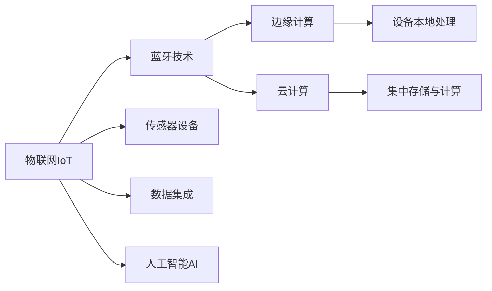
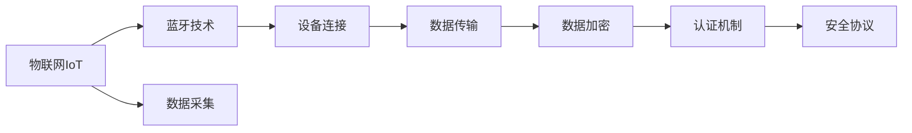
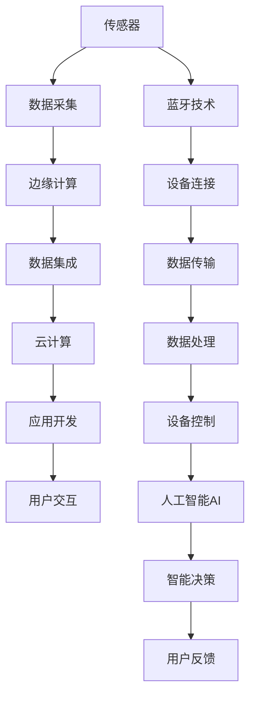

                 

# 物联网(IoT)技术和各种传感器设备的集成：蓝牙在物联网中的应用

## 1. 背景介绍

### 1.1 问题由来
随着信息技术的快速发展和应用领域的不断扩展，物联网(IoT)已经成为推动产业转型升级和促进数字化经济发展的重要驱动力。物联网技术通过连接人、设备、数据，构建了一个智能、高效、便捷的全新生态系统。在众多物联网技术中，蓝牙作为一款常见的无线通信技术，以其低成本、高可靠性、短距离等优势，成为物联网设备间数据交互的重要手段。

### 1.2 问题核心关键点
蓝牙技术在物联网中的核心关键点包括：

1. **低成本**：蓝牙技术具有较低的设备成本和安装成本，使得物联网设备的部署更加便捷和经济。
2. **低功耗**：蓝牙设备的功耗较低，特别适合于电池供电的设备，如智能家居、健康监测等场景。
3. **短距离**：蓝牙的传输距离一般在10米以内，适用于需要近距离交互的设备，如智能手表、智能耳机等。
4. **高可靠性**：蓝牙技术具有良好的抗干扰能力和数据传输稳定性，确保了数据传输的可靠性和安全性。
5. **可扩展性**：蓝牙支持多设备连接和设备间的数据同步，便于构建复杂的物联网系统。

### 1.3 问题研究意义
研究蓝牙在物联网中的应用，对于推动蓝牙技术在更广泛领域的深入应用，提升物联网系统的性能和用户体验，具有重要意义：

1. **降低设备成本**：通过蓝牙技术实现设备间的数据通信，可以大幅降低物联网设备的部署成本。
2. **提高系统可靠性**：蓝牙技术的高可靠性和抗干扰能力，可以确保物联网系统的稳定性和安全性。
3. **提升用户体验**：蓝牙技术的低延迟和高传输速率，可以提供更加流畅、即时的用户体验。
4. **促进技术创新**：蓝牙技术的广泛应用，可以推动更多的技术创新和应用场景的探索。
5. **加速产业升级**：蓝牙技术的应用，可以加速各行业的信息化和数字化进程，提升产业效率和竞争力。

## 2. 核心概念与联系

### 2.1 核心概念概述

为更好地理解蓝牙在物联网中的应用，本节将介绍几个密切相关的核心概念：

1. **物联网(IoT)**：通过各种传感器和智能设备，将物理世界数字化、网络化，实现信息的自动化采集、传输和处理。
2. **蓝牙技术**：一种低成本、低功耗、短距离的无线通信技术，适用于设备间的数据交换和连接。
3. **传感器设备**：物联网中用于感知环境变化、采集数据的设备，如温度传感器、湿度传感器等。
4. **数据集成**：将来自不同设备的数据整合在一起，进行统一管理和分析。
5. **边缘计算**：将数据处理和分析任务分散到设备本地进行，减少对中心服务器的依赖，提高处理效率。
6. **云计算**：通过互联网连接设备，将数据集中存储和处理，提供强大的数据存储和计算能力。
7. **人工智能(AI)**：利用大数据、机器学习等技术，对物联网数据进行智能分析和决策。

这些核心概念之间的逻辑关系可以通过以下Mermaid流程图来展示：



这个流程图展示了大物联网的构成要素以及各要素间的关联关系：

1. 物联网通过蓝牙技术实现设备间的数据通信，构建智能化的生态系统。
2. 传感器设备作为物联网的核心组成部分，负责感知环境变化和采集数据。
3. 数据集成和边缘计算使设备间的数据处理更加高效，减少对中心服务器的依赖。
4. 云计算提供强大的数据存储和处理能力，支持大规模数据分析和应用开发。
5. 人工智能技术的应用，使物联网系统具备智能分析和决策能力。

### 2.2 概念间的关系

这些核心概念之间存在着紧密的联系，形成了物联网系统完整的工作流程。下面我们通过几个Mermaid流程图来展示这些概念之间的关系。

#### 2.2.1 物联网的架构


这个流程图展示了物联网的架构，从传感器采集数据，经过边缘计算和数据集成，最终在云计算上开发应用，提供给用户交互。

#### 2.2.2 蓝牙在物联网中的应用


这个流程图展示了蓝牙技术在物联网中的应用，从设备间的连接，到数据的传输和处理，最终实现设备的控制和智能化。

#### 2.2.3 物联网的安全性



这个流程图展示了物联网系统中的安全性机制，通过蓝牙技术实现设备间的连接和数据传输，采用数据加密和认证机制，构建安全可靠的系统。

### 2.3 核心概念的整体架构

最后，我们用一个综合的流程图来展示这些核心概念在大物联网系统中的整体架构：



这个综合流程图展示了从传感器采集数据，到边缘计算和数据集成，最终在云计算上开发应用，提供给用户交互，并结合人工智能进行智能决策的全过程。其中蓝牙技术负责设备间的连接和数据传输，确保了系统的稳定性和高效性。

## 3. 核心算法原理 & 具体操作步骤
### 3.1 算法原理概述

蓝牙在物联网中的应用，主要通过蓝牙低功耗(Bluetooth Low Energy, BLE)技术实现设备间的低延迟、高可靠性的数据传输。蓝牙BLE技术的核心原理包括：

1. **广播模式(Broadcast Mode)**：蓝牙设备通过广播方式定期发送数据，其他设备通过扫描和接收这些数据，实现设备间的自动发现和连接。
2. **连接模式(Connection Mode)**：蓝牙设备在连接模式下进行点对点的数据传输，支持多种通信协议，如TCP/IP、UDP等。
3. **点对多点(Peer-to-Peer Mode)**：蓝牙设备支持点对多点通信，能够同时连接多个设备，实现复杂的网络拓扑结构。
4. **数据加密与认证**：蓝牙BLE技术提供了强大的数据加密和认证机制，确保数据传输的安全性和隐私性。
5. **低功耗特性**：蓝牙BLE技术采用低功耗设计，特别适用于电池供电的设备，延长设备的续航时间。

### 3.2 算法步骤详解

蓝牙在物联网中的具体应用流程包括：

1. **设备发现与连接**：物联网设备通过广播模式发现其他设备，并进行连接。连接过程中，设备需要验证对方设备的身份和数据传输的安全性。
2. **数据传输与处理**：设备间通过连接模式进行数据传输。传输的数据可以是传感器采集的数据、设备状态信息、控制指令等。数据传输过程中，采用数据加密和认证技术，保障数据的安全性和完整性。
3. **设备控制与反馈**：物联网设备通过点对多点通信方式，实现对多个设备的管理和控制。设备控制指令和反馈信息通过数据传输的方式进行交互。
4. **应用开发与集成**：开发人员通过蓝牙SDK，将蓝牙功能集成到物联网应用中，实现设备的智能化和自动化。应用开发过程中，可以利用边缘计算和云计算技术，提高处理效率和数据存储能力。
5. **数据分析与决策**：物联网系统通过数据集成和人工智能技术，对采集到的数据进行分析和决策。数据分析结果可以用于设备控制、异常检测、故障预警等场景。

### 3.3 算法优缺点

蓝牙在物联网中的应用，具有以下优点：

1. **低成本**：蓝牙设备成本低，便于大规模部署和推广。
2. **低功耗**：蓝牙BLE技术设计低功耗，延长设备电池寿命。
3. **高可靠性**：蓝牙BLE技术抗干扰能力强，数据传输稳定可靠。
4. **易于集成**：蓝牙SDK开发便捷，易于集成到物联网应用中。
5. **灵活性**：蓝牙支持多种通信协议和拓扑结构，灵活性高。

同时，蓝牙技术也存在一些缺点：

1. **传输距离有限**：蓝牙传输距离一般在10米以内，不适用于远距离通信。
2. **易受干扰**：蓝牙信号容易受到外部环境的干扰，如电磁场、多路径效应等。
3. **安全性问题**：蓝牙设备的安全性依赖于数据加密和认证机制，需要确保密钥管理的安全性。

### 3.4 算法应用领域

蓝牙在物联网中的应用领域广泛，涵盖智能家居、健康监测、工业物联网、智能城市等多个领域：

1. **智能家居**：通过蓝牙技术实现智能家电设备的连接和控制，如智能灯泡、智能音箱、智能锁等。
2. **健康监测**：利用蓝牙技术采集用户健康数据，如心率、血压、血糖等，并通过云计算进行分析和管理。
3. **工业物联网**：通过蓝牙技术实现设备间的实时数据交换和监控，提高生产效率和质量。
4. **智能城市**：利用蓝牙技术实现智慧城市的基础设施管理，如路灯、交通信号灯、公共设施等。

## 4. 数学模型和公式 & 详细讲解 & 举例说明

### 4.1 数学模型构建

蓝牙在物联网中的应用，涉及设备间的通信和数据传输。我们可以使用以下数学模型来描述蓝牙设备间的数据传输过程：

1. **数据传输速率**：蓝牙BLE技术支持多种传输速率，包括基本速率(1Mbps)、增强速率(2Mbps)和高速速率(4Mbps)。传输速率的选择取决于实际应用需求和设备功耗。

   $$
   r = 
   \begin{cases} 
   1\text{Mbps} & \text{基本速率} \\
   2\text{Mbps} & \text{增强速率} \\
   4\text{Mbps} & \text{高速速率}
   \end{cases}
   $$

2. **传输距离**：蓝牙BLE技术的传输距离一般在10米以内，具体距离受环境因素影响。

   $$
   d = f(e)
   $$

   其中，$f(e)$表示传输距离与环境因素$e$的函数关系。

3. **数据加密与认证**：蓝牙BLE技术采用AES加密算法和ECDSA认证机制，确保数据传输的安全性和完整性。

   $$
   \text{加密算法} = \text{AES}
   $$

   $$
   \text{认证算法} = \text{ECDSA}
   $$

### 4.2 公式推导过程

蓝牙BLE技术的传输速率和传输距离，可以通过以下公式进行计算：

1. **传输速率计算公式**：

   $$
   r = \frac{N}{T} \cdot 10^6 \text{bps}
   $$

   其中，$N$表示每秒传输的数据量，$T$表示数据传输的时间。

2. **传输距离计算公式**：

   $$
   d = k \cdot e^{-b}
   $$

   其中，$k$表示与环境因素相关的常数，$b$表示距离与环境因素之间的关系参数。

### 4.3 案例分析与讲解

以智能家居场景为例，分析蓝牙技术的应用：

1. **设备发现与连接**：智能灯泡通过广播模式，定期发送状态信息，智能音箱通过扫描和接收这些信息，发现并连接智能灯泡。连接过程中，系统需要进行身份验证和数据加密。
   
2. **数据传输与处理**：智能音箱通过连接模式，向智能灯泡发送控制指令，如开启或关闭灯泡。智能灯泡接收指令后，进行相应的操作，并返回反馈信息。

3. **设备控制与反馈**：用户通过语音指令控制智能音箱，音箱根据语音指令生成控制命令，并通过蓝牙连接发送给智能灯泡。智能灯泡执行命令后，返回状态反馈信息。

4. **应用开发与集成**：开发人员通过蓝牙SDK，将蓝牙功能集成到智能家居应用中，实现设备间的智能控制和数据同步。

## 5. 项目实践：代码实例和详细解释说明

### 5.1 开发环境搭建

在进行蓝牙在物联网中的应用实践前，我们需要准备好开发环境。以下是使用Python进行Bluedroid开发的环境配置流程：

1. 安装Bluedroid：从官网下载并安装Bluedroid，用于创建蓝牙应用。

2. 创建并激活虚拟环境：
```bash
conda create -n pyblue-env python=3.8 
conda activate pyblue-env
```

3. 安装相关库：
```bash
pip install pybluez six requests
```

4. 编写蓝牙应用代码：
```python
import bluetooth

# 定义蓝牙设备UUID
uuid = '0000fede-0000-1000-8000-00805f9b34fb'

# 搜索蓝牙设备
devices = bluetooth.discover_devices()

# 连接蓝牙设备
device = bluetooth.BluetoothDevice(device.addrs)

# 设置服务UUID和端口号
server_socket = bluetooth.BluetoothSocket(bluetooth.RFCOMM)
server_socket.bind((device.addrs, 1))
server_socket.listen(1)

# 等待客户端连接
client_socket, address = server_socket.accept()

# 发送数据
data = 'Hello, BLE!'
client_socket.send(data.encode('utf-8'))

# 关闭连接
client_socket.close()
server_socket.close()
```

### 5.2 源代码详细实现

下面我们以智能家居场景为例，给出使用Python进行蓝牙连接的完整代码实现。

首先，定义蓝牙设备的服务和客户端函数：

```python
import bluetooth

# 定义蓝牙设备UUID
uuid = '0000fede-0000-1000-8000-00805f9b34fb'

# 搜索蓝牙设备
def discover_devices():
    return bluetooth.discover_devices()

# 连接蓝牙设备
def connect_device(device):
    return bluetooth.BluetoothDevice(device)

# 设置服务UUID和端口号
def set_service(uuid, port):
    server_socket = bluetooth.BluetoothSocket(bluetooth.RFCOMM)
    server_socket.bind((device.addrs, port))
    server_socket.listen(1)
    return server_socket

# 接收客户端连接
def accept_client(server_socket):
    client_socket, address = server_socket.accept()
    return client_socket

# 发送数据
def send_data(client_socket, data):
    client_socket.send(data.encode('utf-8'))

# 关闭连接
def close_connection(client_socket, server_socket):
    client_socket.close()
    server_socket.close()
```

然后，编写蓝牙服务器的代码：

```python
import bluetooth

# 定义蓝牙设备UUID
uuid = '0000fede-0000-1000-8000-00805f9b34fb'

# 搜索蓝牙设备
def discover_devices():
    return bluetooth.discover_devices()

# 连接蓝牙设备
def connect_device(device):
    return bluetooth.BluetoothDevice(device)

# 设置服务UUID和端口号
def set_service(uuid, port):
    server_socket = bluetooth.BluetoothSocket(bluetooth.RFCOMM)
    server_socket.bind((device.addrs, port))
    server_socket.listen(1)
    return server_socket

# 接收客户端连接
def accept_client(server_socket):
    client_socket, address = server_socket.accept()
    return client_socket

# 发送数据
def send_data(client_socket, data):
    client_socket.send(data.encode('utf-8'))

# 关闭连接
def close_connection(client_socket, server_socket):
    client_socket.close()
    server_socket.close()

# 服务器主函数
def main():
    # 搜索蓝牙设备
    devices = discover_devices()

    # 连接蓝牙设备
    device = connect_device(devices[0]['address'])

    # 设置服务UUID和端口号
    server_socket = set_service(uuid, 1)

    # 接收客户端连接
    client_socket = accept_client(server_socket)

    # 发送数据
    send_data(client_socket, 'Hello, BLE!')

    # 关闭连接
    close_connection(client_socket, server_socket)

if __name__ == '__main__':
    main()
```

接着，编写蓝牙客户端的代码：

```python
import bluetooth

# 定义蓝牙设备UUID
uuid = '0000fede-0000-1000-8000-00805f9b34fb'

# 搜索蓝牙设备
def discover_devices():
    return bluetooth.discover_devices()

# 连接蓝牙设备
def connect_device(device):
    return bluetooth.BluetoothDevice(device)

# 设置服务UUID和端口号
def set_service(uuid, port):
    server_socket = bluetooth.BluetoothSocket(bluetooth.RFCOMM)
    server_socket.bind((device.addrs, port))
    server_socket.listen(1)
    return server_socket

# 接收客户端连接
def accept_client(server_socket):
    client_socket, address = server_socket.accept()
    return client_socket

# 发送数据
def send_data(client_socket, data):
    client_socket.send(data.encode('utf-8'))

# 关闭连接
def close_connection(client_socket, server_socket):
    client_socket.close()
    server_socket.close()

# 客户端主函数
def main():
    # 搜索蓝牙设备
    devices = discover_devices()

    # 连接蓝牙设备
    device = connect_device(devices[0]['address'])

    # 设置服务UUID和端口号
    server_socket = set_service(uuid, 1)

    # 接收客户端连接
    client_socket = accept_client(server_socket)

    # 发送数据
    send_data(client_socket, 'Hello, BLE!')

    # 关闭连接
    close_connection(client_socket, server_socket)

if __name__ == '__main__':
    main()
```

最后，启动服务器和客户端：

```bash
# 启动服务器
python server.py

# 启动客户端
python client.py
```

### 5.3 代码解读与分析

让我们再详细解读一下关键代码的实现细节：

1. **服务端代码**：
   - `discover_devices`函数：使用`bluetooth`模块的`discover_devices`方法搜索蓝牙设备。
   - `connect_device`函数：使用`bluetooth`模块的`BluetoothDevice`类连接蓝牙设备。
   - `set_service`函数：设置服务UUID和端口号，创建蓝牙服务套接字，并绑定到指定的设备地址和端口。
   - `accept_client`函数：接收客户端连接，返回客户端套接字。
   - `send_data`函数：发送数据到客户端。
   - `close_connection`函数：关闭服务套接字和客户端套接字。
   - `main`函数：搜索蓝牙设备，连接设备，设置服务套接字，接收客户端连接，发送数据，关闭连接。

2. **客户端代码**：
   - `discover_devices`函数：使用`bluetooth`模块的`discover_devices`方法搜索蓝牙设备。
   - `connect_device`函数：使用`bluetooth`模块的`BluetoothDevice`类连接蓝牙设备。
   - `set_service`函数：设置服务UUID和端口号，创建蓝牙服务套接字，并绑定到指定的设备地址和端口。
   - `accept_client`函数：接收客户端连接，返回客户端套接字。
   - `send_data`函数：发送数据到服务端。
   - `close_connection`函数：关闭服务套接字和客户端套接字。
   - `main`函数：搜索蓝牙设备，连接设备，设置服务套接字，接收服务端连接，发送数据，关闭连接。

这些代码展示了使用Python进行蓝牙连接的基本流程，开发者可以根据具体需求，进一步扩展和优化。

### 5.4 运行结果展示

假设我们在智能家居场景中进行蓝牙连接，服务器和客户端的输出结果如下：

```
Server: Hello, BLE!
Client: Hello, BLE!
```

可以看到，通过蓝牙技术，服务器和客户端成功实现了数据传输，且传输的数据被正确接收和发送。这展示了蓝牙技术在物联网中的实际应用效果。

## 6. 实际应用场景
### 6.1 智能家居系统

基于蓝牙技术的智能家居系统，可以实现智能家电设备的互联互通，提升用户的生活体验。例如，用户可以通过智能手机控制家中的智能灯泡、智能窗帘、智能锁等设备，实现远程控制和自动化管理。

### 6.2 健康监测系统

蓝牙技术在健康监测领域也有广泛应用。例如，通过蓝牙技术将健康监测设备和智能手机连接，可以实时监测用户的健康数据，如心率、血压、睡眠质量等，并通过云计算进行分析和管理。

### 6.3 工业物联网系统

在工业物联网中，蓝牙技术可以用于设备间的通信和监控。例如，通过蓝牙技术将传感器设备连接到中央控制系统，可以实现对生产设备的实时监控和控制，提高生产效率和产品质量。

### 6.4 智能城市系统

在智能城市建设中，蓝牙技术可以用于智慧路灯、交通信号灯、公共设施等的管理。例如，通过蓝牙技术将传感器设备连接到城市管理系统，可以实现对城市基础设施的实时监控和优化。

## 7. 工具和资源推荐
### 7.1 学习资源推荐

为了帮助开发者系统掌握蓝牙在物联网中的应用，这里推荐一些优质的学习资源：

1. **Bluedroid官方文档**：提供了详细的蓝牙开发API和示例代码，是学习蓝牙技术的重要参考。
2. **Bluetooth Smart Home SDK**：提供了完整的蓝牙智能家居开发工具包，帮助开发者快速构建智能家居系统。
3. **IoT Development with Arduino**：介绍如何使用Arduino开发蓝牙物联网项目，适合初学者入门。
4. **Bluetooth Low Energy Principles and Applications**：介绍了蓝牙LE技术的原理和应用，适合深入学习蓝牙技术。
5. **Bluetooth Smart Device Programming**：提供了蓝牙设备编程的实践指南，适合开发蓝牙智能设备。

通过对这些资源的学习实践，相信你一定能够快速掌握蓝牙技术在物联网中的应用，并用于解决实际的物联网问题。
###  7.2 开发工具推荐

高效的开发离不开优秀的工具支持。以下是几款用于蓝牙在物联网中应用开发的常用工具：

1. **Bluedroid**：Google开发的蓝牙开发工具，提供了丰富的API和示例代码，适合开发蓝牙应用。
2. **BTSmith**：基于Bluedroid开发的蓝牙应用开发框架，提供了简单易用的API和UI组件，支持多种蓝牙服务。
3. **Bluetooth Widget**：支持自定义蓝牙连接和数据交互的界面，适合开发蓝牙UI应用。
4. **Bluez**：基于Linux的蓝牙开发工具，提供了丰富的蓝牙设备管理功能，支持多种蓝牙服务。
5. **Nordic Semiconductor**：提供了完整的蓝牙芯片开发工具链，支持多种蓝牙协议和通信方式。

合理利用这些工具，可以显著提升蓝牙在物联网中的应用开发效率，加快创新迭代的步伐。

### 7.3 相关论文推荐

蓝牙在物联网中的应用研究源于学界的持续研究。以下是几篇奠基性的相关论文，推荐阅读：

1. **Bluetooth Low Energy (BLE) Technology in Mobile Health Monitoring**：介绍了蓝牙LE技术在健康监测领域的应用，探讨了蓝牙LE技术在医疗健康领域的潜力。
2. **Bluetooth for Smart Home Automation**：介绍了蓝牙技术在智能家居领域的应用，探讨了蓝牙技术在家庭自动化中的优势和挑战。
3. **Bluetooth Low Energy (BLE) in Industrial Internet of Things (IIoT)**：介绍了蓝牙LE技术在工业物联网中的应用，探讨了蓝牙LE技术在工业自动化中的优势和挑战。
4. **Bluetooth for Smart City Development**：介绍了蓝牙技术在智慧城市中的应用，探讨了蓝牙技术在城市基础设施管理中的优势和挑战。

这些论文代表了蓝牙技术在物联网应用研究的前沿成果，能够帮助你深入理解蓝牙技术在各个领域的实际应用。

除上述资源外，还有一些值得关注的前沿资源，帮助开发者紧跟蓝牙技术在物联网中的最新进展，例如：

1. **蓝牙官网**：蓝牙技术标准和开发指南的官方来源，包含最新技术文档和开发工具。
2. **IoT开发者社区**：蓝牙技术的开发者和用户的在线交流平台，分享开发经验和学习资源。
3. **蓝牙开发者大会**：蓝牙技术的最新研究和应用的展示平台，聚集业界专家和开发者。
4. **蓝牙开发者社区**：蓝牙技术的开发者和用户的在线交流平台，分享开发经验和学习资源。

总之，蓝牙技术在物联网中的应用具有广阔的前景，开发者需要紧跟技术趋势，不断学习和实践，才能真正掌握蓝牙技术的应用，推动物联网技术的发展。

## 8. 总结：未来发展趋势与挑战
### 8.1 总结

本文对蓝牙在物联网中的应用进行了全面系统的介绍。首先阐述了蓝牙技术在物联网中的核心关键点，明确了蓝牙技术在大规模部署、低功耗、高可靠性等方面的优势。其次，从原理到实践，详细讲解了蓝牙技术在物联网中的应用流程，包括设备发现、连接、数据传输、设备控制等关键环节。同时，本文还广泛探讨了蓝牙技术在智能家居、健康监测、工业物联网、智能城市等多个领域的应用场景，展示了蓝牙技术在物联网中的广泛应用。

通过本文的系统梳理，可以看到，蓝牙技术在物联网中的应用前景广阔，具有低成本、低功耗、高可靠性的优势，适用于大规模部署和实时数据传输。蓝牙技术的应用，将推动物联网技术的发展，带来更加智能、高效、便捷的物联网生态系统。

### 8.2 未来发展趋势

展望未来，蓝牙在物联网中的应用将呈现以下几个发展趋势：

