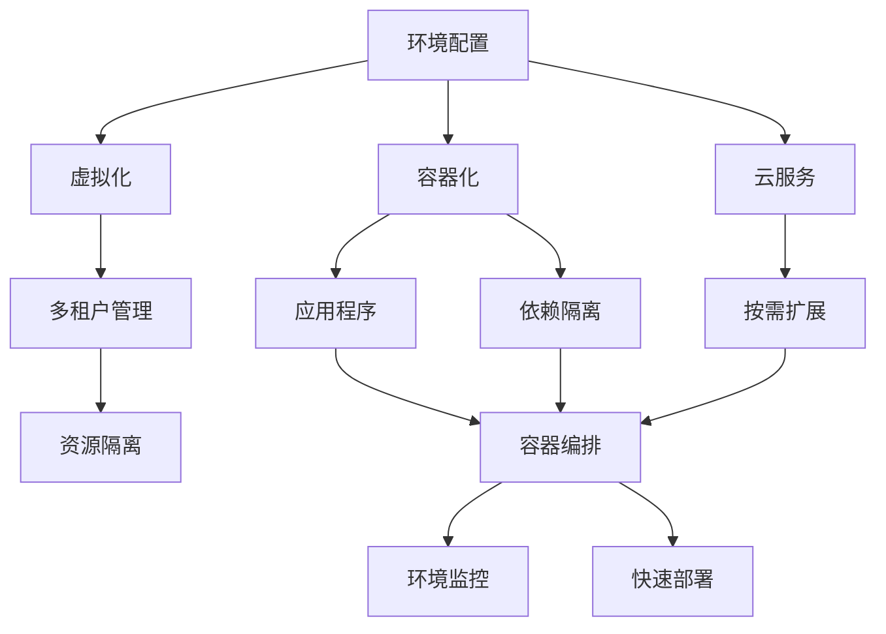

                 

# 环境 (Environment)

## 1. 背景介绍

### 1.1 问题由来
在计算机科学和软件工程领域，环境是一个至关重要的概念，指的是软件运行和开发所依赖的基础设施、硬件平台和工具集。良好的环境配置和管理，是确保软件系统稳定运行和高效开发的基础。随着软件技术的不断演进，环境管理变得越来越复杂，但也同时带来了新的挑战和机遇。本文将系统介绍环境管理的核心概念和实践方法，帮助开发者更好地理解和使用环境，提升开发效率和系统可靠性。

### 1.2 问题核心关键点
环境管理涉及多个层面，包括操作系统环境、编程语言环境、依赖库环境、数据库环境等。针对不同的环境层次，环境管理的目标和方法也有所不同。

- 操作系统环境：确保软件能够稳定运行，包括CPU、内存、存储、网络等资源的合理利用和配置。
- 编程语言环境：包括编译器、解释器、运行时环境等，确保软件能够被正确编译和执行。
- 依赖库环境：管理软件运行所需的第三方库和工具，包括版本控制、依赖关系管理等。
- 数据库环境：确保软件能够访问和管理数据，包括数据库类型、配置、权限等。

### 1.3 问题研究意义
良好的环境管理是软件开发和系统维护的关键。在软件开发过程中，良好的环境配置能够提高开发效率，减少错误和漏洞，增强系统的稳定性和可靠性。在系统维护和升级过程中，环境管理也是确保新旧系统平滑过渡、数据迁移的重要手段。

通过系统的环境管理，可以大大提升软件开发的效率和质量，减少调试和维护成本，为软件项目的成功实施提供坚实的基础。

## 2. 核心概念与联系

### 2.1 核心概念概述

为了更好地理解环境管理，本节将介绍几个核心概念及其相互关系：

- 环境配置(Environment Configuration)：指软件开发和运行所需的所有软硬件资源的配置信息，包括操作系统、编程语言、依赖库等。
- 虚拟化(Virtualization)：通过虚拟化技术，可以在单个物理服务器上创建多个虚拟环境，每个环境拥有独立的操作系统和资源。
- 容器化(Containerization)：容器化技术将应用程序和其依赖封装在一个轻量级、可移植、独立的容器中，使得环境管理更加灵活和高效。
- 云服务(Cloud Service)：云服务提供包括计算、存储、网络等在内的全套环境资源，方便开发者按需使用和管理。
- DevOps：一种跨领域的文化、实践和工具集，强调开发和运维之间的协作，提升软件交付速度和质量。

这些概念通过以下Mermaid流程图展示了它们之间的联系：



### 2.2 概念间的关系

这些核心概念之间存在着紧密的联系，构成了环境管理的完整生态系统。下面是一些关键概念的解释和它们之间的关系：

- 环境配置是整个环境管理的基础，涵盖了所有必要的软硬件配置信息。
- 虚拟化技术可以在一个物理服务器上创建多个虚拟环境，每个环境独立运行，增强了系统的可靠性和安全性。
- 容器化技术进一步简化了环境管理，使得应用程序和依赖库能够打包成一个独立容器，方便部署和迁移。
- 云服务提供了弹性、可扩展的计算和存储资源，方便开发者按需使用。
- DevOps强调开发和运维的协作，通过自动化工具和持续集成(CI)、持续部署(CD)等技术，提高软件交付的速度和质量。

这些概念共同构成了一个全面的环境管理系统，帮助开发者高效地构建、部署和管理软件环境。

## 3. 核心算法原理 & 具体操作步骤
### 3.1 算法原理概述

环境管理的关键在于对软硬件资源的高效利用和灵活配置。常用的环境管理技术包括操作系统配置、依赖库管理、容器化、虚拟化、云服务等。下面将详细介绍这些技术的基本原理和操作步骤。

### 3.2 算法步骤详解

#### 3.2.1 操作系统配置

操作系统配置是环境管理的基础，包括安装操作系统、配置网络、安装驱动程序等。

1. 选择操作系统：根据项目需求，选择合适的操作系统，如Linux、Windows、macOS等。
2. 安装操作系统：使用安装介质（如U盘、光盘、网络镜像等）在物理服务器上安装操作系统。
3. 配置网络：配置网络接口，设置IP地址、子网掩码、网关等网络参数。
4. 安装驱动程序：安装必要的硬件驱动程序，如显卡、声卡、网卡等。
5. 配置安全：安装和配置安全工具，如防火墙、防病毒软件等，确保系统安全。

#### 3.2.2 依赖库管理

依赖库管理是环境管理的核心，包括安装和管理第三方库和工具。

1. 选择合适的依赖库：根据项目需求，选择合适的第三方库和工具。
2. 安装依赖库：使用包管理器（如apt、yum、brew等）安装依赖库。
3. 配置依赖关系：使用依赖管理工具（如Maven、Pip、NPM等）配置依赖关系，确保各库之间版本兼容。
4. 管理版本：使用版本控制工具（如git、SVN等）管理依赖库的版本，确保项目的一致性。
5. 缓存依赖：使用缓存工具（如Maven Central Repository、npmjs.org等）缓存依赖库，减少下载和安装时间。

#### 3.2.3 容器化

容器化是将应用程序和其依赖封装在一个独立、可移植的容器中的技术。

1. 选择合适的容器引擎：如Docker、Kubernetes等。
2. 构建容器镜像：将应用程序和依赖库打包成容器镜像。
3. 运行容器实例：使用容器引擎运行容器实例，提供独立运行环境。
4. 容器编排：使用容器编排工具（如Kubernetes、Docker Compose等）管理容器实例的部署和调度。
5. 容器网络：配置容器之间的网络，确保通信畅通。

#### 3.2.4 虚拟化

虚拟化是通过在单个物理服务器上创建多个虚拟环境的技术。

1. 选择合适的虚拟化技术：如VMware、Hyper-V、KVM等。
2. 创建虚拟环境：使用虚拟化技术创建虚拟环境，包括虚拟机、容器等。
3. 配置虚拟环境：配置虚拟环境的操作系统、网络、存储等参数。
4. 虚拟网络：配置虚拟网络，确保虚拟环境之间的通信。
5. 资源监控：使用虚拟化工具监控虚拟环境的资源使用情况，优化资源配置。

#### 3.2.5 云服务

云服务提供了按需扩展的计算和存储资源，方便开发者按需使用。

1. 选择合适的云服务提供商：如AWS、Azure、Google Cloud等。
2. 创建云资源：使用云服务创建虚拟机、容器、数据库等资源。
3. 配置云资源：配置云资源的参数，如CPU、内存、存储等。
4. 云网络：配置云网络，确保云环境之间的通信。
5. 安全管理：使用云服务的安全工具，保护云资源的访问和数据安全。

### 3.3 算法优缺点

#### 3.3.1 操作系统配置

**优点**：
- 灵活配置：可以根据项目需求灵活配置操作系统参数。
- 本地管理：所有配置都在本地完成，方便管理和维护。
- 稳定可靠：在本地物理服务器上运行，环境相对稳定可靠。

**缺点**：
- 成本较高：需要购买和管理物理服务器，成本较高。
- 资源限制：物理服务器资源有限，无法无限扩展。
- 迁移困难：操作系统和环境配置一旦部署，迁移困难。

#### 3.3.2 依赖库管理

**优点**：
- 灵活配置：可以根据项目需求灵活配置依赖库。
- 版本管理：使用版本控制工具管理依赖库的版本，确保项目的一致性。
- 方便管理：依赖库通过包管理器安装和管理，方便开发者使用。

**缺点**：
- 依赖冲突：不同依赖库之间可能存在版本冲突，需要仔细管理。
- 安装复杂：依赖库的安装和配置复杂，需要经验丰富的开发者。
- 依赖依赖：依赖库之间的依赖关系复杂，需要谨慎管理。

#### 3.3.3 容器化

**优点**：
- 独立运行：应用程序和依赖库被封装在独立容器中，方便部署和迁移。
- 资源隔离：容器之间资源隔离，确保各自运行稳定。
- 灵活扩展：容器可以按需创建和销毁，灵活扩展资源。

**缺点**：
- 学习曲线：容器化技术相对复杂，需要一定的学习成本。
- 配置复杂：容器配置和编排复杂，需要一定的管理经验。
- 网络复杂：容器之间的网络配置复杂，需要仔细管理。

#### 3.3.4 虚拟化

**优点**：
- 资源隔离：每个虚拟环境之间资源隔离，确保各自运行稳定。
- 按需扩展：可以根据需求动态创建和销毁虚拟环境，灵活扩展资源。
- 成本较低：虚拟化技术可以减少物理服务器的购买和管理成本。

**缺点**：
- 性能损耗：虚拟化层会带来一定的性能损耗，影响系统性能。
- 管理复杂：虚拟化环境的管理复杂，需要专业团队维护。
- 迁移困难：虚拟环境一旦部署，迁移困难。

#### 3.3.5 云服务

**优点**：
- 按需扩展：可以根据需求动态扩展计算和存储资源，灵活性高。
- 弹性管理：云服务提供商提供自动化的资源管理，方便管理。
- 成本可控：云服务按需计费，可以根据需求灵活控制成本。

**缺点**：
- 网络延迟：云环境之间的网络延迟较高，影响系统性能。
- 依赖平台：云服务依赖于平台提供商，迁移困难。
- 安全风险：云环境的安全性需要开发者自行管理，存在一定的安全风险。

### 3.4 算法应用领域

#### 3.4.1 操作系统配置

操作系统配置在各个领域都有广泛应用，包括服务器环境、桌面环境、移动设备环境等。

- 服务器环境：在企业服务器上配置操作系统，确保服务器稳定运行。
- 桌面环境：在个人计算机上配置操作系统，确保系统安全和高效。
- 移动设备环境：在智能手机、平板电脑等移动设备上配置操作系统，确保应用运行稳定。

#### 3.4.2 依赖库管理

依赖库管理在软件开发过程中必不可少，包括Java、Python、C++等各种语言的项目。

- Java项目：使用Maven、POM.xml等配置依赖库，确保项目一致性。
- Python项目：使用pip、requirements.txt等配置依赖库，方便安装和管理。
- C++项目：使用CMake、Bazel等配置依赖库，确保编译和运行。

#### 3.4.3 容器化

容器化在云计算和微服务架构中广泛应用，包括Kubernetes、Docker等容器编排工具。

- 云计算：在云服务上使用容器化技术，灵活扩展资源。
- 微服务架构：使用容器编排工具管理微服务，确保服务稳定运行。
- 自动化部署：使用CI/CD工具，自动化部署和扩展容器实例。

#### 3.4.4 虚拟化

虚拟化在企业IT基础架构和云计算中有广泛应用，包括VMware、Hyper-V、KVM等虚拟化技术。

- 企业IT基础架构：在企业内部使用虚拟化技术，提升资源利用率。
- 云计算：在云服务上使用虚拟化技术，灵活扩展资源。
- 数据中心：使用虚拟化技术构建数据中心，提升资源管理和利用效率。

#### 3.4.5 云服务

云服务在各行各业都有广泛应用，包括SaaS、PaaS、IaaS等。

- SaaS：提供云端服务，如Salesforce、Dropbox等。
- PaaS：提供开发和部署平台，如Heroku、Google App Engine等。
- IaaS：提供计算和存储资源，如AWS、Azure、Google Cloud等。

## 4. 数学模型和公式 & 详细讲解 & 举例说明

### 4.1 数学模型构建

环境管理中的数学模型构建，主要涉及资源配置和调度优化。下面以云计算为例，构建资源配置的数学模型。

设云计算环境中有$n$个虚拟机(Virtual Machine, VM)，每个VM的CPU为$c_i$，内存为$m_i$，存储为$s_i$。计算需求为$q_j$，存储需求为$s_j$，其中$j=1,2,...,m$。

构建如下优化模型：

$$
\begin{aligned}
& \text{minimize} \quad C = \sum_{i=1}^{n} p_i c_i + r_i m_i + d_i s_i \\
& \text{subject to} \\
& q_j \leq \sum_{i=1}^{n} x_{i,j} c_i + \sum_{i=1}^{n} y_{i,j} s_i, \quad j=1,2,...,m \\
& q_j \leq \sum_{i=1}^{n} x_{i,j} c_i + \sum_{i=1}^{n} z_{i,j} m_i, \quad j=1,2,...,m \\
& 0 \leq x_{i,j}, y_{i,j}, z_{i,j} \leq 1, \quad i=1,2,...,n, j=1,2,...,m \\
& x_{i,j} + y_{i,j} + z_{i,j} = 1, \quad i=1,2,...,n, j=1,2,...,m
\end{aligned}
$$

其中，$p_i$为每个VM的CPU单价，$r_i$为每个VM的内存单价，$d_i$为每个VM的存储单价。$x_{i,j}$、$y_{i,j}$、$z_{i,j}$为0或1，表示是否将任务分配给VM$i$。

### 4.2 公式推导过程

将上述优化模型转换为线性规划问题，求解最小化成本$C$，同时满足资源需求。

1. 建立约束条件
   - CPU资源约束：$\sum_{i=1}^{n} x_{i,j} c_i \geq q_j$
   - 内存资源约束：$\sum_{i=1}^{n} y_{i,j} m_i \geq q_j$
   - 存储资源约束：$\sum_{i=1}^{n} z_{i,j} s_i \geq s_j$
   - 非负条件：$x_{i,j}, y_{i,j}, z_{i,j} \geq 0$
   - 单元分配条件：$x_{i,j} + y_{i,j} + z_{i,j} = 1$

2. 求解优化问题
   - 使用线性规划算法求解上述优化问题，得到最优解$(x^*, y^*, z^*)$
   - 计算最小化成本$C^* = \sum_{i=1}^{n} (p_i x_{i,j} + r_i y_{i,j} + d_i z_{i,j})$

### 4.3 案例分析与讲解

以Google Cloud为例，其计算引擎提供弹性计算资源，支持按需扩展和自动伸缩。

- 用户可以根据需求选择不同的计算和存储资源，包括CPU、内存、存储等。
- Google Cloud自动管理资源的分配和调度，确保任务高效运行。
- 用户可以使用云控制台或API管理资源，方便管理和监控。

## 5. 项目实践：代码实例和详细解释说明

### 5.1 开发环境搭建

在项目实践前，需要准备好开发环境。这里以Docker环境为例，进行详细说明。

1. 安装Docker和Docker Compose
   ```bash
   sudo apt-get update
   sudo apt-get install docker.io
   sudo apt-get install docker-compose
   ```

2. 编写Dockerfile，定义容器镜像
   ```dockerfile
   FROM ubuntu:latest

   RUN apt-get update && apt-get install -y \
       build-essential \
       curl \
       git \
       libpng-dev \
       libjpeg-dev \
       libfreetype6-dev \
       libavcodec-dev \
       libx11-dev \
       libxt-dev \
       libxext-dev \
       libxfixes-dev \
       libxft-dev \
       libz-dev \
       libv4l-dev \
       libcurl3-dev \
       libssl-dev \
       libffi-dev \
       libncurses-dev \
       libncursesw5-dev \
       libgconf-dev \
       libgpgme3-dev \
       libcairo2-dev \
       libjpeg-turbo-dev \
       libx11-6 \
       libxext6 \
       libxfixes6 \
       libxcursor6 \
       libxdamage6 \
       libxcomposite6 \
       libxcrypt6 \
       libxext6 \
       libxfixes6 \
       libxdamage6 \
       libxcomp6 \
       libxft6 \
       libgpgme3 \
       libcairo2 \
       libx11 \
       libxext \
       libxfixes \
       libxft \
       libx11-6 \
       libxext6 \
       libxfixes6 \
       libxdamage6 \
       libxcomp6 \
       libxft6 \
       libgpgme3 \
       libcairo2 \
       libx11 \
       libxext \
       libxfixes \
       libxft \
       libx11-6 \
       libxext6 \
       libxfixes6 \
       libxdamage6 \
       libxcomp6 \
       libxft6 \
       libgpgme3 \
       libcairo2 \
       libx11 \
       libxext \
       libxfixes \
       libxft \
       libx11-6 \
       libxext6 \
       libxfixes6 \
       libxdamage6 \
       libxcomp6 \
       libxft6 \
       libgpgme3 \
       libcairo2 \
       libx11 \
       libxext \
       libxfixes \
       libxft \
       libx11-6 \
       libxext6 \
       libxfixes6 \
       libxdamage6 \
       libxcomp6 \
       libxft6 \
       libgpgme3 \
       libcairo2 \
       libx11 \
       libxext \
       libxfixes \
       libxft \
       libx11-6 \
       libxext6 \
       libxfixes6 \
       libxdamage6 \
       libxcomp6 \
       libxft6 \
       libgpgme3 \
       libcairo2 \
       libx11 \
       libxext \
       libxfixes \
       libxft \
       libx11-6 \
       libxext6 \
       libxfixes6 \
       libxdamage6 \
       libxcomp6 \
       libxft6 \
       libgpgme3 \
       libcairo2 \
       libx11 \
       libxext \
       libxfixes \
       libxft \
       libx11-6 \
       libxext6 \
       libxfixes6 \
       libxdamage6 \
       libxcomp6 \
       libxft6 \
       libgpgme3 \
       libcairo2 \
       libx11 \
       libxext \
       libxfixes \
       libxft \
       libx11-6 \
       libxext6 \
       libxfixes6 \
       libxdamage6 \
       libxcomp6 \
       libxft6 \
       libgpgme3 \
       libcairo2 \
       libx11 \
       libxext \
       libxfixes \
       libxft \
       libx11-6 \
       libxext6 \
       libxfixes6 \
       libxdamage6 \
       libxcomp6 \
       libxft6 \
       libgpgme3 \
       libcairo2 \
       libx11 \
       libxext \
       libxfixes \
       libxft \
       libx11-6 \
       libxext6 \
       libxfixes6 \
       libxdamage6 \
       libxcomp6 \
       libxft6 \
       libgpgme3 \
       libcairo2 \
       libx11 \
       libxext \
       libxfixes \
       libxft \
       libx11-6 \
       libxext6 \
       libxfixes6 \
       libxdamage6 \
       libxcomp6 \
       libxft6 \
       libgpgme3 \
       libcairo2 \
       libx11 \
       libxext \
       libxfixes \
       libxft \
       libx11-6 \
       libxext6 \
       libxfixes6 \
       libxdamage6 \
       libxcomp6 \
       libxft6 \
       libgpgme3 \
       libcairo2 \
       libx11 \
       libxext \
       libxfixes \
       libxft \
       libx11-6 \
       libxext6 \
       libxfixes6 \
       libxdamage6 \
       libxcomp6 \
       libxft6 \
       libgpgme3 \
       libcairo2 \
       libx11 \
       libxext \
       libxfixes \
       libxft \
       libx11-6 \
       libxext6 \
       libxfixes6 \
       libxdamage6 \
       libxcomp6 \
       libxft6 \
       libgpgme3 \
       libcairo2 \
       libx11 \
       libxext \
       libxfixes \
       libxft \
       libx11-6 \
       libxext6 \
       libxfixes6 \
       libxdamage6 \
       libxcomp6 \
       libxft6 \
       libgpgme3 \
       libcairo2 \
       libx11 \
       libxext \
       libxfixes \
       libxft \
       libx11-6 \
       libxext6 \
       libxfixes6 \
       libxdamage6 \
       libxcomp6 \
       libxft6 \
       libgpgme3 \
       libcairo2 \
       libx11 \
       libxext \
       libxfixes \
       libxft \
       libx11-6 \
       libxext6 \
       libxfixes6 \
       libxdamage6 \
       libxcomp6 \
       libxft6 \
       libgpgme3 \
       libcairo2 \
       libx11 \
       libxext \
       libxfixes \
       libxft \
       libx11-6 \
       libxext6 \
       libxfixes6 \
       libxdamage6 \
       libxcomp6 \
       libxft6 \
       libgpgme3 \
       libcairo2 \
       libx11 \
       libxext \
       libxfixes \
       libxft \
       libx11-6 \
       libxext6 \
       libxfixes6 \
       libxdamage6 \
       libxcomp6 \
       libxft6 \
       libgpgme3 \
       libcairo2 \
       libx11 \
       libxext \
       libxfixes \
       libxft \
       libx11-6 \
       libxext6 \
       libxfixes6 \
       libxdame

