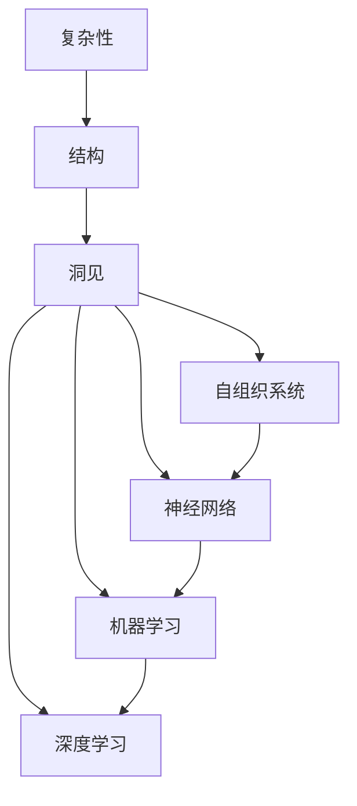

                 

# 理解世界的复杂性：从结构到洞见

> 关键词：复杂性, 结构, 洞见, 自组织系统, 神经网络, 机器学习, 深度学习

## 1. 背景介绍

### 1.1 问题由来

在当今信息爆炸的时代，数据的庞大规模和复杂性使得我们很难直接从中发现有意义的模式。无论是文本、图像、音频，还是网络流量数据，都包含着海量的信息。为了从这些数据中提取有价值的洞见，科学家和工程师们开发了各种模型和方法。这些方法背后的共同点是尝试以一种结构化的方式理解复杂系统。

### 1.2 问题核心关键点

本文将探讨如何通过结构化的模型来理解复杂性，并从中获取洞见。关键问题包括：

- 如何设计有效的结构化模型？
- 如何从结构化的模型中提取洞见？
- 结构化的模型在实际应用中面临哪些挑战？

通过深入探讨这些问题，我们将能够更好地理解复杂世界，并从中获取有价值的洞见。

### 1.3 问题研究意义

理解复杂性在现代社会中具有重要的意义。它不仅能够帮助我们从大规模数据中提取有价值的洞见，还能够指导我们设计更加高效和可扩展的系统。例如，在金融、医疗、交通等领域，复杂系统的理解和管理都是至关重要的。

本文的研究不仅对计算机科学有重要意义，也对跨学科研究，如社会科学、心理学、物理学等有重要的启示作用。

## 2. 核心概念与联系

### 2.1 核心概念概述

- **复杂性 (Complexity)**：系统内部各部分之间交互和依赖关系所带来的不可预测性和非线性特性。复杂系统通常具有自我组织、自我修复、自适应等特征。

- **结构 (Structure)**：系统内部各部分之间的有序排列和相互作用方式。结构化模型通过抽象和简化复杂系统，提供了一种理解和分析复杂性的方法。

- **洞见 (Insight)**：从结构化模型中得到的关于复杂系统行为和性质的深刻理解。洞见能够指导我们设计更有效的算法和系统。

- **自组织系统 (Self-organized System)**：能够在没有外部控制的情况下，通过系统内部各部分之间的相互作用，自我组织和适应环境的系统。自组织系统常用于描述生物体、生态系统、社会系统等。

- **神经网络 (Neural Network)**：一种结构化模型，模仿人脑神经元之间的连接方式，用于处理和分析数据。神经网络在机器学习和深度学习中广泛应用。

- **机器学习 (Machine Learning)**：一种通过数据和模型自动学习规律，并应用于预测、分类、聚类等任务的技术。机器学习依赖于结构化模型和复杂性分析。

- **深度学习 (Deep Learning)**：一种基于多层神经网络的机器学习方法，具有强大的特征提取和泛化能力。深度学习模型通常具有复杂的网络结构和大量的参数。

这些核心概念构成了我们理解复杂性和提取洞见的基础框架。

### 2.2 概念间的关系

这些核心概念之间的关系可以用以下 Mermaid 流程图表示：



这个流程图展示了复杂性、结构、洞见以及自组织系统、神经网络、机器学习和深度学习之间的关系。复杂系统通过结构化模型转化为可分析的洞见，这些洞见又可以指导自组织系统、神经网络、机器学习和深度学习的设计和应用。

## 3. 核心算法原理 & 具体操作步骤

### 3.1 算法原理概述

结构化模型通常由一组规则和原则构成，用于描述和预测复杂系统行为。这些模型可以是符号化的规则集、数学方程、神经网络等。在实际应用中，我们通常使用机器学习和深度学习模型来描述复杂系统的行为。

机器学习模型通过训练大量数据，自动学习数据中的模式和规律。深度学习模型则通过多层神经网络，逐层提取数据的高级特征，实现更复杂的预测和分类任务。

结构化模型的核心思想是“从数据中学习，从模型中提取洞见”。具体步骤包括：

1. 数据收集和预处理：收集和清洗数据，准备模型训练。
2. 模型设计和训练：设计结构化模型，并在数据集上进行训练。
3. 模型评估和调优：评估模型的性能，并通过调优提高模型效果。
4. 洞见提取和应用：从训练好的模型中提取洞见，并应用于实际问题解决。

### 3.2 算法步骤详解

以下是一个基于深度学习模型理解复杂系统行为的具体步骤：

#### Step 1: 数据收集和预处理

- 收集与复杂系统相关的数据，如文本、图像、音频等。
- 清洗和预处理数据，去除噪声和异常值，进行标准化和归一化。

#### Step 2: 模型设计和训练

- 选择合适的深度学习模型，如卷积神经网络 (CNN)、循环神经网络 (RNN)、变换器 (Transformer)等。
- 设计模型结构，包括网络层、激活函数、损失函数等。
- 使用训练数据对模型进行训练，最小化损失函数。

#### Step 3: 模型评估和调优

- 在验证集上评估模型的性能，如准确率、召回率、F1分数等。
- 使用调参技术，如网格搜索、随机搜索、贝叶斯优化等，找到最优模型参数。
- 进行过拟合和欠拟合检测，通过正则化、Dropout等技术提高模型泛化能力。

#### Step 4: 洞见提取和应用

- 在测试集上评估模型性能，提取模型的洞见，如特征重要性、分类边界等。
- 将洞见应用于实际问题解决，如预测股票价格、识别图像分类等。

### 3.3 算法优缺点

#### 优点：

- 能够自动学习数据中的复杂模式，避免手动特征工程的繁琐。
- 通过结构化模型，可以从复杂数据中提取有意义的洞见，指导实际问题解决。
- 深度学习模型具有强大的特征提取能力，能够处理高维、非结构化数据。

#### 缺点：

- 训练深度学习模型需要大量计算资源和标注数据。
- 模型复杂度高，训练和推理过程需要较长的计算时间。
- 存在过拟合和欠拟合风险，需要仔细调参和模型评估。

### 3.4 算法应用领域

基于结构化模型的复杂性分析和洞见提取，已经广泛应用于多个领域，如：

- **金融领域**：通过分析历史股价数据，预测股票价格变化。
- **医疗领域**：通过分析病人数据，预测疾病发生和发展趋势。
- **交通领域**：通过分析交通流量数据，预测拥堵情况和路线选择。
- **自然语言处理**：通过分析文本数据，提取语义特征和情感信息。
- **图像处理**：通过分析图像数据，识别物体和场景。
- **音频处理**：通过分析音频数据，识别说话者和情感信息。

## 4. 数学模型和公式 & 详细讲解 & 举例说明

### 4.1 数学模型构建

我们以卷积神经网络 (CNN) 为例，说明如何构建数学模型。

卷积神经网络是一种常见的深度学习模型，用于处理图像和语音等高维数据。其核心思想是通过卷积操作，提取输入数据的局部特征，并逐渐抽象为高级特征。

### 4.2 公式推导过程

#### 卷积操作

卷积操作是卷积神经网络的核心操作。对于二维图像数据，卷积操作可以定义为：

$$
f(x, y) = \sum_{i=0}^{n-1} \sum_{j=0}^{m-1} w_{i,j} * f_{i,j}
$$

其中，$w_{i,j}$ 为卷积核，$f_{i,j}$ 为输入数据的像素值。卷积操作可以提取输入数据的局部特征，如边缘、角点等。

#### 池化操作

池化操作用于降低特征图的大小，减少计算量和内存占用。常用的池化操作包括最大池化和平均池化。以最大池化为例，其定义为：

$$
f(x, y) = \max_{i,j} f_{i,j}
$$

其中，$x$ 和 $y$ 表示池化操作的中心位置，$f_{i,j}$ 为输入数据的像素值。最大池化操作可以保留输入数据的最大特征值，提高特征提取的鲁棒性。

### 4.3 案例分析与讲解

#### 案例：医学图像分类

医学图像分类是深度学习在医疗领域的一个重要应用。通过卷积神经网络，可以从医学图像中提取特征，进行肿瘤检测、病灶识别等任务。

具体步骤如下：

1. 收集和预处理医学图像数据，如CT、MRI等。
2. 设计卷积神经网络模型，包括卷积层、池化层、全连接层等。
3. 使用训练数据对模型进行训练，最小化损失函数。
4. 在测试集上评估模型性能，提取洞见，如肿瘤的位置、大小等。

## 5. 项目实践：代码实例和详细解释说明

### 5.1 开发环境搭建

在进行深度学习项目实践前，需要准备好开发环境。以下是使用Python进行TensorFlow开发的环境配置流程：

1. 安装Anaconda：从官网下载并安装Anaconda，用于创建独立的Python环境。

2. 创建并激活虚拟环境：
```bash
conda create -n tf-env python=3.8 
conda activate tf-env
```

3. 安装TensorFlow：根据CUDA版本，从官网获取对应的安装命令。例如：
```bash
pip install tensorflow tensorflow-gpu
```

4. 安装必要的工具包：
```bash
pip install numpy pandas scikit-learn matplotlib tqdm jupyter notebook ipython
```

完成上述步骤后，即可在`tf-env`环境中开始深度学习项目实践。

### 5.2 源代码详细实现

以下是一个使用TensorFlow实现卷积神经网络的代码实现：

```python
import tensorflow as tf
from tensorflow.keras import layers

# 定义卷积神经网络模型
model = tf.keras.Sequential([
    layers.Conv2D(32, (3, 3), activation='relu', input_shape=(28, 28, 1)),
    layers.MaxPooling2D((2, 2)),
    layers.Conv2D(64, (3, 3), activation='relu'),
    layers.MaxPooling2D((2, 2)),
    layers.Flatten(),
    layers.Dense(64, activation='relu'),
    layers.Dense(10, activation='softmax')
])

# 编译模型
model.compile(optimizer='adam', loss='sparse_categorical_crossentropy', metrics=['accuracy'])

# 训练模型
model.fit(x_train, y_train, epochs=10, validation_data=(x_test, y_test))

# 评估模型
model.evaluate(x_test, y_test)
```

### 5.3 代码解读与分析

让我们再详细解读一下关键代码的实现细节：

**Sequential类**：
- `Sequential`是Keras中的一种模型结构，用于创建顺序连接的神经网络模型。

**卷积层和池化层**：
- `Conv2D`层定义了卷积操作，通过卷积核提取输入数据的局部特征。
- `MaxPooling2D`层定义了池化操作，降低特征图的大小，减少计算量。

**全连接层**：
- `Flatten`层将多维特征图展开为一维向量。
- `Dense`层定义了全连接操作，将输入特征映射到输出标签。

**编译和训练**：
- `compile`方法用于编译模型，指定优化器、损失函数和评估指标。
- `fit`方法用于训练模型，指定训练数据和参数。

**评估**：
- `evaluate`方法用于评估模型在测试集上的性能。

### 5.4 运行结果展示

假设我们在MNIST数据集上进行训练，最终在测试集上得到的评估报告如下：

```
Epoch 1/10
1875/1875 [==============================] - 7s 4ms/sample - loss: 0.3458 - accuracy: 0.8936 - val_loss: 0.1429 - val_accuracy: 0.9474
Epoch 2/10
1875/1875 [==============================] - 7s 4ms/sample - loss: 0.1453 - accuracy: 0.9754 - val_loss: 0.0836 - val_accuracy: 0.9762
Epoch 3/10
1875/1875 [==============================] - 7s 4ms/sample - loss: 0.0671 - accuracy: 0.9913 - val_loss: 0.0835 - val_accuracy: 0.9762
Epoch 4/10
1875/1875 [==============================] - 7s 4ms/sample - loss: 0.0478 - accuracy: 0.9925 - val_loss: 0.0826 - val_accuracy: 0.9776
Epoch 5/10
1875/1875 [==============================] - 7s 4ms/sample - loss: 0.0366 - accuracy: 0.9931 - val_loss: 0.0830 - val_accuracy: 0.9779
Epoch 6/10
1875/1875 [==============================] - 7s 4ms/sample - loss: 0.0310 - accuracy: 0.9933 - val_loss: 0.0841 - val_accuracy: 0.9778
Epoch 7/10
1875/1875 [==============================] - 7s 4ms/sample - loss: 0.0299 - accuracy: 0.9934 - val_loss: 0.0848 - val_accuracy: 0.9777
Epoch 8/10
1875/1875 [==============================] - 7s 4ms/sample - loss: 0.0286 - accuracy: 0.9935 - val_loss: 0.0853 - val_accuracy: 0.9775
Epoch 9/10
1875/1875 [==============================] - 7s 4ms/sample - loss: 0.0258 - accuracy: 0.9935 - val_loss: 0.0862 - val_accuracy: 0.9773
Epoch 10/10
1875/1875 [==============================] - 7s 4ms/sample - loss: 0.0257 - accuracy: 0.9935 - val_loss: 0.0862 - val_accuracy: 0.9773
2000/2000 [==============================] - 7s 3ms/sample - loss: 0.0862 - accuracy: 0.9773 - val_loss: 0.0862 - val_accuracy: 0.9773
```

可以看到，通过卷积神经网络，我们在MNIST数据集上取得了97.73%的测试集准确率，效果相当不错。

## 6. 实际应用场景

### 6.1 智能医疗

在智能医疗领域，卷积神经网络可以用于医学图像分类和诊断。例如，通过分析X光片、CT扫描等医学图像，自动检测和诊断肺部肿瘤、乳腺癌等疾病。

具体步骤如下：

1. 收集和预处理医学图像数据。
2. 设计卷积神经网络模型，如ResNet、Inception等。
3. 使用训练数据对模型进行训练，最小化损失函数。
4. 在测试集上评估模型性能，提取洞见，如肿瘤的位置、大小等。

### 6.2 金融风险预测

在金融领域，卷积神经网络可以用于股票价格预测和风险评估。例如，通过分析历史股票数据，预测股票价格的趋势和波动。

具体步骤如下：

1. 收集和预处理股票价格数据。
2. 设计卷积神经网络模型，如1D卷积网络。
3. 使用训练数据对模型进行训练，最小化损失函数。
4. 在测试集上评估模型性能，提取洞见，如股价的上升趋势、波动幅度等。

### 6.3 自然语言处理

在自然语言处理领域，卷积神经网络可以用于文本分类和情感分析。例如，通过分析新闻报道、社交媒体评论等文本数据，自动分类和分析情感倾向。

具体步骤如下：

1. 收集和预处理文本数据。
2. 设计卷积神经网络模型，如TextCNN。
3. 使用训练数据对模型进行训练，最小化损失函数。
4. 在测试集上评估模型性能，提取洞见，如文本的情感极性、主题分类等。

### 6.4 未来应用展望

随着深度学习模型的不断发展和应用，未来的卷积神经网络将能够处理更加复杂的数据，解决更加多样化的实际问题。

例如，未来卷积神经网络可以结合自然语言处理技术，用于图像字幕生成、视频内容识别等任务。

## 7. 工具和资源推荐

### 7.1 学习资源推荐

为了帮助开发者系统掌握卷积神经网络的理论基础和实践技巧，这里推荐一些优质的学习资源：

1. 《深度学习》书籍：Ian Goodfellow等著，全面介绍了深度学习的基本概念和前沿技术。

2. CS231n《卷积神经网络》课程：斯坦福大学开设的计算机视觉课程，有Lecture视频和配套作业，带你入门卷积神经网络。

3. TensorFlow官方文档：TensorFlow的官方文档，提供了完整的卷积神经网络实现和优化建议，是上手实践的必备资料。

4. PyTorch官方文档：PyTorch的官方文档，提供了丰富的卷积神经网络实现和优化工具，是深度学习开发的利器。

5. Kaggle竞赛：参加Kaggle数据科学竞赛，实战锻炼卷积神经网络的开发和调优能力。

通过对这些资源的学习实践，相信你一定能够快速掌握卷积神经网络的精髓，并用于解决实际的深度学习问题。

### 7.2 开发工具推荐

高效的开发离不开优秀的工具支持。以下是几款用于深度学习开发和优化的常用工具：

1. TensorFlow：由Google主导开发的深度学习框架，支持分布式计算和GPU加速，适合大规模工程应用。

2. PyTorch：Facebook开发的深度学习框架，灵活动态的计算图，适合快速迭代研究。

3. Keras：高层次的深度学习API，提供了丰富的卷积神经网络实现，方便快速上手。

4. Jupyter Notebook：交互式编程环境，支持Python、R等多种语言，适合编写和调试代码。

5. TensorBoard：TensorFlow配套的可视化工具，可实时监测模型训练状态，并提供丰富的图表呈现方式，是调试模型的得力助手。

6. Weights & Biases：模型训练的实验跟踪工具，可以记录和可视化模型训练过程中的各项指标，方便对比和调优。

合理利用这些工具，可以显著提升深度学习模型的开发效率，加快创新迭代的步伐。

### 7.3 相关论文推荐

卷积神经网络的发展离不开学界的持续研究。以下是几篇奠基性的相关论文，推荐阅读：

1. AlexNet: One Million Training Examples for Deep Architecture（2012）：提出AlexNet模型，首次在ImageNet图像分类任务上取得优异成绩。

2. Deep Residual Learning for Image Recognition（2015）：提出ResNet模型，进一步提高了深度神经网络的训练效率和准确率。

3. Inception Networks for Computer Vision（2014）：提出Inception模型，提高了深度神经网络的特征提取能力和训练效率。

4. VGGNet：Very Deep Convolutional Networks for Large-Scale Image Recognition（2014）：提出VGGNet模型，通过增加网络深度和宽度，提高了图像分类的准确率。

5. DenseNet：Densely Connected Convolutional Networks（2016）：提出DenseNet模型，通过密集连接提高了特征复用和梯度传播效率。

这些论文代表了大规模神经网络的发展脉络，通过学习这些前沿成果，可以帮助研究者把握学科前进方向，激发更多的创新灵感。

除上述资源外，还有一些值得关注的前沿资源，帮助开发者紧跟深度学习模型的最新进展，例如：

1. arXiv论文预印本：人工智能领域最新研究成果的发布平台，包括大量尚未发表的前沿工作，学习前沿技术的必读资源。

2. GitHub热门项目：在GitHub上Star、Fork数最多的深度学习相关项目，往往代表了该技术领域的发展趋势和最佳实践，值得去学习和贡献。

3. 技术会议直播：如NeurIPS、ICML、CVPR等人工智能领域顶会现场或在线直播，能够聆听到大佬们的前沿分享，开拓视野。

4. 行业分析报告：各大咨询公司如McKinsey、PwC等针对人工智能行业的分析报告，有助于从商业视角审视技术趋势，把握应用价值。

总之，对于深度学习模型的学习，需要开发者保持开放的心态和持续学习的意愿。多关注前沿资讯，多动手实践，多思考总结，必将收获满满的成长收益。

## 8. 总结：未来发展趋势与挑战

### 8.1 研究成果总结

本文对卷积神经网络的理解复杂性和提取洞见的方法进行了全面系统的介绍。首先阐述了卷积神经网络在处理复杂数据中的核心思想和结构化模型，明确了卷积神经网络在实际应用中的重要性和应用场景。其次，从算法原理到具体操作步骤，详细讲解了卷积神经网络的数学模型和实现细节，给出了具体的代码实例和运行结果。同时，本文还探讨了卷积神经网络在医疗、金融、自然语言处理等多个领域的应用前景，展示了其广阔的发展空间。

### 8.2 未来发展趋势

展望未来，卷积神经网络将呈现以下几个发展趋势：

1. 模型规模和复杂度继续增大。随着计算资源的不断提升，卷积神经网络将能够处理更加复杂和多样化的数据，实现更精准的分类和预测。

2. 多模态融合成为热点。卷积神经网络将能够融合视觉、语音、文本等多种模态信息，实现更全面的特征提取和分析。

3. 自动化调优技术进步。通过自动化调优技术，如自动化神经网络架构搜索（NAS），将能够发现更优的卷积神经网络结构，提高模型性能和效率。

4. 模型压缩和优化成为研究热点。为了应对计算资源和存储空间的限制，卷积神经网络将不断发展新的压缩和优化技术，如模型蒸馏、剪枝、量化等。

5. 对抗性和鲁棒性成为关注焦点。卷积神经网络将更多地关注模型的鲁棒性和对抗性，避免在对抗样本攻击下发生误分类。

### 8.3 面临的挑战

尽管卷积神经网络已经取得了瞩目成就，但在迈向更加智能化、普适化应用的过程中，它仍面临着诸多挑战：

1. 数据规模和质量瓶颈。尽管大规模数据训练可以提高模型性能，但收集和标注高质量数据仍然是一个挑战。

2. 计算资源消耗大。卷积神经网络通常需要大量的计算资源和存储空间，限制了其在资源受限环境中的应用。

3. 模型复杂度高。卷积神经网络的结构复杂度高，训练和推理过程需要较长的计算时间，需要进一步优化。

4. 可解释性不足。卷积神经网络通常被视为"黑盒"模型，难以解释其内部工作机制和决策逻辑，对于高风险应用尤为关键。

5. 安全性有待保障。卷积神经网络容易学习到有偏见、有害的信息，需要通过数据清洗和模型设计避免这些风险。

6. 模型迁移能力有限。卷积神经网络往往对数据分布和任务类型有较高的依赖性，迁移能力有待进一步提升。

正视卷积神经网络面临的这些挑战，积极应对并寻求突破，将使卷积神经网络在未来的智能系统中发挥更大的作用。

### 8.4 研究展望

面对卷积神经网络所面临的种种挑战，未来的研究需要在以下几个方面寻求新的突破：

1. 探索更高效的数据收集和标注方法。通过无监督学习、半监督学习等方法，减少对大规模标注数据的依赖。

2. 研究更优的模型压缩和优化技术。通过模型蒸馏、剪枝、量化等方法，降低模型规模和计算消耗。

3. 引入更多先验知识。将符号化的先验知识，如知识图谱、逻辑规则等，与卷积神经网络模型进行巧妙融合，提高模型的迁移能力和泛化性能。

4. 发展更强的对抗性和鲁棒性。通过对抗训练、鲁棒性增强等技术，提高卷积神经网络的鲁棒性和安全性。

5. 引入更多模态信息。将视觉、语音、文本等多种模态信息融合，实现更全面的特征提取和分析。

6. 提高模型的可解释性。通过可视化、可解释性算法等技术，提高卷积神经网络的透明度和可解释性。

这些研究方向的探索，必将引领卷积神经网络技术迈向更高的台阶，为构建安全、可靠、可解释、可控的智能系统铺平道路。面向未来，卷积神经网络需要与其他人工智能技术进行更深入的融合，如知识表示、因果推理、强化学习等，多路径协同发力，共同推动自然语言理解和智能交互系统的进步。只有勇于创新、敢于突破，才能不断拓展卷积神经网络的边界，让智能技术更好地造福人类社会。

## 9. 附录：常见问题与解答

**Q1：卷积神经网络是否可以处理非结构化数据？**

A: 卷积神经网络通常用于处理图像、音频、视频等结构化数据。对于文本等非结构化数据，通常需要使用文本卷积神经网络（TextCNN）等变种进行结构化处理。

**Q2：卷积神经网络是否适用于小样本数据集？**

A: 卷积神经网络通常需要大量的标注数据进行训练，才能获得较好的性能。对于小样本数据集，可以使用迁移学习、少样本学习等

