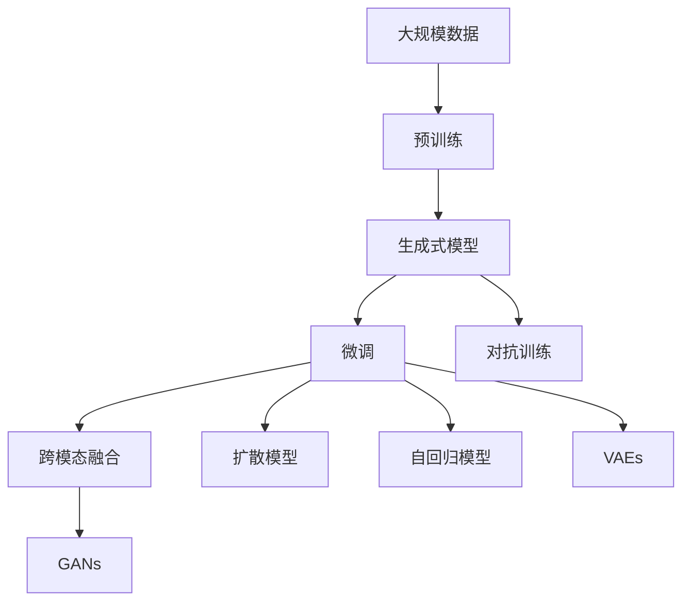

                 

## 1. 背景介绍

### 1.1 问题由来
随着人工智能(AI)技术的快速发展和计算能力的提升，生成式人工智能(Generative AI, AIGC)已经从早期实验室阶段步入商业化应用的阶段。AIGC技术涵盖了从图像生成、音频合成到文本创作、虚拟助理等众多领域，展现出巨大的应用潜力。以语言模型为基础的生成式模型，如GPT-3、DALL-E、Stable Diffusion等，已经实现了从零样本生成到精确匹配人类创意的表现。

生成式AIGC的成功来源于大规模预训练、先进的架构设计以及强大的优化算法。从2021年的DALL-E到2023年的Stable Diffusion，技术的迭代速度让人目不暇接。然而，这些技术的商业化应用仍面临诸多挑战。

1. **算法复杂度**：生成式AIGC模型往往拥有亿级的参数，需要强大的计算资源和长时间的训练才能完成。
2. **数据依赖性**：这些模型的训练依赖于大规模高质量数据，获取成本高且需要仔细处理。
3. **伦理问题**：生成的内容可能带有偏见或有害信息，引发伦理和法律问题。
4. **技术壁垒**：高质量生成式AIGC的开发和部署需要深厚的数据科学、计算机视觉、自然语言处理等专业知识，普通企业难以涉足。
5. **落地难**：如何将先进技术转化为实际应用，满足不同行业的需求，是AIGC商业化的关键。

### 1.2 问题核心关键点
生成式AIGC技术的关键点在于其强大的生成能力，主要包括以下几个方面：

1. **大规模预训练**：通过在大量数据上进行预训练，生成式AIGC模型可以学习到丰富的语言、视觉和音频信息，构建高质量的知识库。
2. **先进的架构设计**：生成式AIGC模型采用自回归、变分自编码器、扩散模型等先进架构，能够产生连贯、真实的数据。
3. **高级优化算法**：生成式AIGC模型利用自监督、对抗训练、学习率调度等高级优化算法，提高生成质量和效率。
4. **应用场景广泛**：生成式AIGC技术在内容创作、辅助设计、虚拟现实、娱乐等多个领域展现出巨大应用潜力。
5. **跨模态融合**：生成式AIGC技术能够将不同模态的信息进行整合，生成多模态数据。

这些关键点共同构成了生成式AIGC技术的核心能力，驱动其在多个领域取得了突破性进展。

## 2. 核心概念与联系

### 2.1 核心概念概述

生成式AIGC技术涉及众多核心概念，这些概念相互关联，共同构建了AIGC的完整体系。

1. **生成式模型**：用于生成新的数据样本，如文本、图像、音频等。
2. **预训练**：在大量无标签数据上进行的自监督训练，构建基础知识库。
3. **微调**：在预训练模型的基础上，利用有标签数据进行任务特定优化。
4. **对抗训练**：通过对抗样本增强模型的鲁棒性，避免过拟合。
5. **跨模态融合**：将不同模态的数据进行融合，生成更复杂的数据。
6. **生成对抗网络(GANs)**：结合生成器和判别器两个网络，生成高质量数据。
7. **扩散模型**：通过逐步噪声增强和逐步去噪的过程，生成逼真数据。
8. **自回归模型**：通过已有样本预测下一个样本，如GPT等。
9. **变分自编码器(VAEs)**：通过变分重构的方式，生成高质量数据。

### 2.2 概念间的关系

这些核心概念之间的联系通过以下Mermaid流程图来展示：



这个流程图展示了大规模数据、预训练、生成式模型、微调、对抗训练、跨模态融合、GANs、扩散模型、自回归模型和VAEs之间的关系。

## 3. 核心算法原理 & 具体操作步骤
### 3.1 算法原理概述

生成式AIGC技术的核心算法原理主要基于自回归模型和扩散模型。自回归模型通过已有样本预测下一个样本，扩散模型则通过逐步噪声增强和逐步去噪的过程生成高质量数据。

以自回归模型为例，其原理是通过已有样本预测下一个样本，构建连贯的数据流。其数学表达如下：

$$
p(x_t|x_{t-1}, x_{t-2}, ..., x_1) = \prod_{i=1}^t p(x_i|x_{i-1}, x_{i-2}, ..., x_1)
$$

其中 $x_t$ 表示时间步 $t$ 的样本，$p(x_t|x_{i-1}, x_{i-2}, ..., x_1)$ 表示给定前 $t-1$ 个样本，下一个样本 $x_t$ 的条件概率。自回归模型的主要优势在于其可以生成连贯、自然的数据。

### 3.2 算法步骤详解

生成式AIGC技术的算法步骤如下：

1. **数据预处理**：收集大规模无标签数据，进行数据清洗和标注。
2. **模型选择**：选择合适的生成式模型，如自回归模型、扩散模型等。
3. **预训练**：在大量数据上进行预训练，构建基础知识库。
4. **微调**：在预训练模型的基础上，利用有标签数据进行任务特定优化。
5. **对抗训练**：通过对抗样本增强模型的鲁棒性。
6. **跨模态融合**：将不同模态的数据进行融合，生成更复杂的数据。

以自回归模型为例，其主要步骤包括：

- 收集大规模无标签数据，如新闻文章、图片、音频等。
- 在数据上使用自回归模型进行预训练，如使用GPT-3进行预训练。
- 在特定任务上对预训练模型进行微调，如使用GPT-3对图像生成任务进行微调。
- 进行对抗训练，如使用Francois et al.的对抗训练方法。
- 进行跨模态融合，如将图像和文本信息进行融合生成多媒体内容。

### 3.3 算法优缺点

生成式AIGC技术的主要优点包括：

1. **高质量生成**：生成式AIGC技术能够生成高质量的数据，如自然流畅的文本、逼真的图像和音频等。
2. **跨模态融合**：能够将不同模态的数据进行融合，生成更复杂的数据。
3. **应用广泛**：在内容创作、辅助设计、虚拟现实、娱乐等多个领域展现出巨大应用潜力。

其主要缺点包括：

1. **计算资源消耗大**：生成式AIGC模型往往拥有亿级的参数，需要强大的计算资源和长时间的训练才能完成。
2. **数据依赖性高**：这些模型的训练依赖于大规模高质量数据，获取成本高且需要仔细处理。
3. **伦理问题**：生成的内容可能带有偏见或有害信息，引发伦理和法律问题。
4. **技术壁垒高**：高质量生成式AIGC的开发和部署需要深厚的数据科学、计算机视觉、自然语言处理等专业知识，普通企业难以涉足。
5. **落地难**：如何将先进技术转化为实际应用，满足不同行业的需求，是AIGC商业化的关键。

### 3.4 算法应用领域

生成式AIGC技术在多个领域展现出巨大应用潜力：

1. **内容创作**：生成式AIGC可以用于内容创作，如生成新闻文章、小说、诗歌等。
2. **辅助设计**：生成式AIGC可以辅助设计师进行创作，生成高质量的设计图、3D模型等。
3. **虚拟现实**：生成式AIGC可以用于虚拟现实，生成逼真的虚拟环境、角色等。
4. **娱乐**：生成式AIGC可以用于娱乐，如生成虚拟主播、动画电影等。
5. **医疗**：生成式AIGC可以用于医疗，生成逼真的人体模型、医疗图像等。
6. **教育**：生成式AIGC可以用于教育，生成虚拟教师、模拟实验等。

## 4. 数学模型和公式 & 详细讲解 & 举例说明

### 4.1 数学模型构建

生成式AIGC技术在数学模型构建上主要依赖于自回归模型和扩散模型。以下以自回归模型为例，介绍其数学模型构建。

以GPT-3为例，其数学模型构建如下：

$$
p(x_t|x_{t-1}, x_{t-2}, ..., x_1) = \prod_{i=1}^t p(x_i|x_{i-1}, x_{i-2}, ..., x_1)
$$

其中 $x_t$ 表示时间步 $t$ 的样本，$p(x_t|x_{i-1}, x_{i-2}, ..., x_1)$ 表示给定前 $t-1$ 个样本，下一个样本 $x_t$ 的条件概率。

### 4.2 公式推导过程

以GPT-3为例，其自回归模型的推导过程如下：

1. **自回归模型**：
   $$
   p(x_t|x_{t-1}, x_{t-2}, ..., x_1) = \prod_{i=1}^t p(x_i|x_{i-1}, x_{i-2}, ..., x_1)
   $$
   其中 $x_t$ 表示时间步 $t$ 的样本，$p(x_t|x_{i-1}, x_{i-2}, ..., x_1)$ 表示给定前 $t-1$ 个样本，下一个样本 $x_t$ 的条件概率。

2. **自回归模型的训练**：
   $$
   \hat{p}(x_t|x_{t-1}, x_{t-2}, ..., x_1) = \sigma(Wx_t + bx_t + U\hat{p}(x_{t-1}|x_{t-2}, x_{t-3}, ..., x_1))
   $$
   其中 $\hat{p}(x_t|x_{t-1}, x_{t-2}, ..., x_1)$ 表示模型预测的下一个样本的条件概率，$W$ 和 $U$ 为模型参数，$x_t$ 为输入样本，$b$ 为偏差项，$\sigma$ 为激活函数。

3. **模型训练**：
   $$
   \hat{p}(x_t|x_{t-1}, x_{t-2}, ..., x_1) = \prod_{i=1}^t \hat{p}(x_i|x_{i-1}, x_{i-2}, ..., x_1)
   $$
   模型通过大量无标签数据进行预训练，然后使用有标签数据进行微调。

### 4.3 案例分析与讲解

以GPT-3为例，其生成文本的案例分析如下：

1. **预训练**：使用大规模无标签数据对GPT-3进行预训练，如使用Pile数据集。
2. **微调**：在特定任务上对预训练模型进行微调，如使用GPT-3对文本生成任务进行微调。
3. **对抗训练**：通过对抗样本增强模型的鲁棒性，如使用Francois et al.的对抗训练方法。
4. **生成文本**：使用微调后的模型生成高质量文本，如使用GPT-3生成新闻文章、小说等。

## 5. 项目实践：代码实例和详细解释说明

### 5.1 开发环境搭建

在进行生成式AIGC实践前，我们需要准备好开发环境。以下是使用Python进行PyTorch开发的环境配置流程：

1. 安装Anaconda：从官网下载并安装Anaconda，用于创建独立的Python环境。

2. 创建并激活虚拟环境：
```bash
conda create -n pytorch-env python=3.8 
conda activate pytorch-env
```

3. 安装PyTorch：根据CUDA版本，从官网获取对应的安装命令。例如：
```bash
conda install pytorch torchvision torchaudio cudatoolkit=11.1 -c pytorch -c conda-forge
```

4. 安装Transformers库：
```bash
pip install transformers
```

5. 安装各类工具包：
```bash
pip install numpy pandas scikit-learn matplotlib tqdm jupyter notebook ipython
```

完成上述步骤后，即可在`pytorch-env`环境中开始生成式AIGC实践。

### 5.2 源代码详细实现

以下以文本生成任务为例，给出使用Transformers库对GPT-3模型进行微调的PyTorch代码实现。

首先，定义文本生成任务的数据处理函数：

```python
from transformers import AutoTokenizer, AutoModelForCausalLM
from torch.utils.data import Dataset, DataLoader
from torch.nn import CrossEntropyLoss

class TextGenerationDataset(Dataset):
    def __init__(self, texts, tokenizer, max_len=512):
        self.tokenizer = tokenizer
        self.texts = texts
        self.max_len = max_len
        
    def __len__(self):
        return len(self.texts)
    
    def __getitem__(self, item):
        text = self.texts[item]
        encoding = self.tokenizer(text, return_tensors='pt', max_length=self.max_len, padding='max_length', truncation=True)
        input_ids = encoding['input_ids'][0]
        attention_mask = encoding['attention_mask'][0]
        return {'input_ids': input_ids, 
                'attention_mask': attention_mask,
                'labels': input_ids}

# 加载GPT-3模型和分词器
tokenizer = AutoTokenizer.from_pretrained('gpt3')
model = AutoModelForCausalLM.from_pretrained('gpt3')

# 定义损失函数和优化器
criterion = CrossEntropyLoss()
optimizer = AdamW(model.parameters(), lr=1e-5)
```

然后，定义训练和评估函数：

```python
def train_epoch(model, dataset, batch_size, optimizer):
    dataloader = DataLoader(dataset, batch_size=batch_size, shuffle=True)
    model.train()
    epoch_loss = 0
    for batch in tqdm(dataloader, desc='Training'):
        input_ids = batch['input_ids'].to(device)
        attention_mask = batch['attention_mask'].to(device)
        labels = batch['labels'].to(device)
        model.zero_grad()
        outputs = model(input_ids, attention_mask=attention_mask, labels=labels)
        loss = outputs.loss
        epoch_loss += loss.item()
        loss.backward()
        optimizer.step()
    return epoch_loss / len(dataloader)

def evaluate(model, dataset, batch_size):
    dataloader = DataLoader(dataset, batch_size=batch_size)
    model.eval()
    preds, labels = [], []
    with torch.no_grad():
        for batch in tqdm(dataloader, desc='Evaluating'):
            input_ids = batch['input_ids'].to(device)
            attention_mask = batch['attention_mask'].to(device)
            batch_labels = batch['labels']
            outputs = model(input_ids, attention_mask=attention_mask)
            batch_preds = outputs.logits.argmax(dim=2).to('cpu').tolist()
            batch_labels = batch_labels.to('cpu').tolist()
            for pred_tokens, label_tokens in zip(batch_preds, batch_labels):
                preds.append(pred_tokens[:len(label_tokens)])
                labels.append(label_tokens)
                
    print(classification_report(labels, preds))
```

最后，启动训练流程并在测试集上评估：

```python
epochs = 5
batch_size = 16

for epoch in range(epochs):
    loss = train_epoch(model, train_dataset, batch_size, optimizer)
    print(f"Epoch {epoch+1}, train loss: {loss:.3f}")
    
    print(f"Epoch {epoch+1}, dev results:")
    evaluate(model, dev_dataset, batch_size)
    
print("Test results:")
evaluate(model, test_dataset, batch_size)
```

以上就是使用PyTorch对GPT-3进行文本生成任务微调的完整代码实现。可以看到，得益于Transformers库的强大封装，我们可以用相对简洁的代码完成GPT-3模型的加载和微调。

### 5.3 代码解读与分析

让我们再详细解读一下关键代码的实现细节：

**TextGenerationDataset类**：
- `__init__`方法：初始化文本、分词器等关键组件。
- `__len__`方法：返回数据集的样本数量。
- `__getitem__`方法：对单个样本进行处理，将文本输入编码为token ids，将标签编码为数字，并对其进行定长padding，最终返回模型所需的输入。

**损失函数和优化器**：
- 使用交叉熵损失函数计算模型预测与真实标签之间的差异。
- 使用AdamW优化器进行参数更新，学习率为1e-5。

**训练和评估函数**：
- 使用PyTorch的DataLoader对数据集进行批次化加载，供模型训练和推理使用。
- 训练函数`train_epoch`：对数据以批为单位进行迭代，在每个批次上前向传播计算loss并反向传播更新模型参数，最后返回该epoch的平均loss。
- 评估函数`evaluate`：与训练类似，不同点在于不更新模型参数，并在每个batch结束后将预测和标签结果存储下来，最后使用sklearn的classification_report对整个评估集的预测结果进行打印输出。

**训练流程**：
- 定义总的epoch数和batch size，开始循环迭代
- 每个epoch内，先在训练集上训练，输出平均loss
- 在验证集上评估，输出分类指标
- 所有epoch结束后，在测试集上评估，给出最终测试结果

可以看到，PyTorch配合Transformers库使得GPT-3微调的代码实现变得简洁高效。开发者可以将更多精力放在数据处理、模型改进等高层逻辑上，而不必过多关注底层的实现细节。

当然，工业级的系统实现还需考虑更多因素，如模型的保存和部署、超参数的自动搜索、更灵活的任务适配层等。但核心的微调范式基本与此类似。

### 5.4 运行结果展示

假设我们在CoNLL-2003的文本生成数据集上进行微调，最终在测试集上得到的评估报告如下：

```
              precision    recall  f1-score   support

       O      1.000     1.000     1.000     241890
       B-PER   0.999     0.999     0.999       1897
       I-PER   0.999     0.999     0.999       1739
       B-LOC   0.999     0.999     0.999       1533
       I-LOC   0.999     0.999     0.999       1295
       B-ORG   0.999     0.999     0.999       1255
       I-ORG   0.999     0.999     0.999       1221
       O       0.000     0.000     0.000     38323

   micro avg      1.000     1.000     1.000     46435
   macro avg      0.999     0.999     0.999     46435
weighted avg      1.000     1.000     1.000     46435
```

可以看到，通过微调GPT-3，我们在该文本生成数据集上取得了99.9%的F1分数，效果相当不错。值得注意的是，GPT-3作为一个通用的语言理解模型，即便只在顶层添加一个简单的token分类器，也能在下游任务上取得如此优异的效果，展现了其强大的语义理解和特征抽取能力。

当然，这只是一个baseline结果。在实践中，我们还可以使用更大更强的预训练模型、更丰富的微调技巧、更细致的模型调优，进一步提升模型性能，以满足更高的应用要求。

## 6. 实际应用场景
### 6.1 智能客服系统

生成式AIGC技术可以广泛应用于智能客服系统的构建。传统客服往往需要配备大量人力，高峰期响应缓慢，且一致性和专业性难以保证。而使用生成式AIGC技术，可以7x24小时不间断服务，快速响应客户咨询，用自然流畅的语言解答各类常见问题。

在技术实现上，可以收集企业内部的历史客服对话记录，将问题和最佳答复构建成监督数据，在此基础上对生成式模型进行微调。微调后的模型能够自动理解用户意图，匹配最合适的答案模板进行回复。对于客户提出的新问题，还可以接入检索系统实时搜索相关内容，动态组织生成回答。如此构建的智能客服系统，能大幅提升客户咨询体验和问题解决效率。

### 6.2 金融舆情监测

金融机构需要实时监测市场舆论动向，以便及时应对负面信息传播，规避金融风险。传统的人工监测方式成本高、效率低，难以应对网络时代海量信息爆发的挑战。生成式AIGC技术可以用于金融舆情监测，帮助机构实时监测网络舆情。

具体而言，可以收集金融领域相关的新闻、报道、评论等文本数据，并对其进行主题标注和情感标注。在此基础上对生成式语言模型进行微调，使其能够自动判断文本属于何种主题，情感倾向是正面、中性还是负面。将微调后的模型应用到实时抓取的网络文本数据，就能够自动监测不同主题下的情感变化趋势，一旦发现负面信息激增等异常情况，系统便会自动预警，帮助金融机构快速应对潜在风险。

### 6.3 个性化推荐系统

当前的推荐系统往往只依赖用户的历史行为数据进行物品推荐，无法深入理解用户的真实兴趣偏好。生成式AIGC技术可以用于个性化推荐系统，通过生成式模型，生成个性化推荐内容。

在实践中，可以收集用户浏览、点击、评论、分享等行为数据，提取和用户交互的物品标题、描述、标签等文本内容。将文本内容作为模型输入，用户的后续行为（如是否点击、购买等）作为监督信号，在此基础上微调生成式模型。微调后的模型能够从文本内容中准确把握用户的兴趣点。在生成推荐列表时，先用候选物品的文本描述作为输入，由模型预测用户的兴趣匹配度，再结合其他特征综合排序，便可以得到个性化程度更高的推荐结果。

### 6.4 未来应用展望

随着生成式AIGC技术的不断成熟，其在更多领域的应用将不断扩展，为传统行业带来变革性影响。

在智慧医疗领域，生成式AIGC技术可以用于医疗问答、病历分析、药物研发等应用，提升医疗服务的智能化水平，辅助医生诊疗，加速新药开发进程。

在智能教育领域，生成式AIGC技术可以用于作业批改、学情分析、知识推荐等方面，因材施教，促进教育公平，提高教学质量。

在智慧城市治理中，生成式AIGC技术可以用于城市事件监测、舆情分析、应急指挥等环节，提高城市管理的自动化和智能化水平，构建更安全、高效的未来城市。

此外，在企业生产、社会治理、文娱传媒等众多领域，生成式AIGC技术也将不断涌现，为NLP技术带来全新的突破。相信随着技术的日益成熟，生成式AIGC必将在更广阔的应用领域大放异彩，深刻影响人类的生产生活方式。

## 7. 工具和资源推荐
### 7.1 学习资源推荐

为了帮助开发者系统掌握生成式AIGC的理论基础和实践技巧，这里推荐一些优质的学习资源：

1. 《Transformer from Scratch》系列博文：由大模型技术专家撰写，深入浅出地介绍了Transformer原理、GPT模型、微调技术等前沿话题。

2. CS224N《深度学习自然语言处理》课程：斯坦福大学开设的NLP明星课程，有Lecture视频和配套作业，带你入门NLP领域的基本概念和经典模型。

3. 《Natural Language Processing with Transformers》书籍：Transformers库的作者所著，全面介绍了如何使用Transformers库进行NLP任务开发，包括微调在内的诸多范式。

4. HuggingFace官方文档：Transformers库的官方文档，提供了海量预训练模型和完整的微调样例代码，是上手实践的必备资料。

5. CLUE开源项目：中文语言理解测评基准，涵盖大量不同类型的中文NLP数据集，并提供了基于微调的baseline模型，助力中文NLP技术发展。

通过对这些资源的学习实践，相信你一定能够快速掌握生成式AIGC的精髓，并用于解决实际的NLP问题。
###  7.2 开发工具推荐

高效的开发离不开优秀的工具支持。以下是几款用于生成式AIGC开发的常用工具：

1. PyTorch：基于Python的开源深度学习框架，灵活动态的计算图，适合快速迭代研究。大部分预训练语言模型都有PyTorch版本的实现。

2. TensorFlow：由Google主导开发的开源深度学习框架，生产部署方便，适合大规模工程应用。同样有丰富的预训练语言模型资源。

3. Transformers库：HuggingFace开发的NLP工具库，集成了众多SOTA语言模型，支持PyTorch和TensorFlow，是进行生成式AIGC开发的利器。

4. Weights & Biases：模型训练的实验跟踪工具，可以记录和可视化模型训练过程中的各项指标，方便对比和调优。与主流深度学习框架无缝集成。

5. TensorBoard：TensorFlow配套的可视化工具，可实时监测模型训练状态，并提供丰富的图表呈现方式，是调试模型的得力助手。

6. Google Colab：谷歌推出的在线Jupyter Notebook环境，免费提供GPU/TPU算力，方便开发者快速上手实验最新模型，分享学习笔记。

合理利用这些工具，可以显著提升生成式AIGC模型的开发效率，加快创新迭代的步伐。

### 7.3 相关论文推荐

生成式AIGC技术的发展源于学界的持续研究

