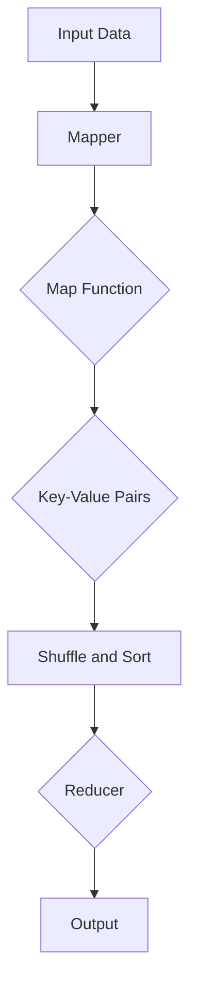

# MapReduce医疗数据分析与健康管理

作者：禅与计算机程序设计艺术 / Zen and the Art of Computer Programming

## 1. 背景介绍

### 1.1 问题的由来

随着医疗信息化和大数据技术的快速发展，医疗数据规模呈指数级增长。医疗数据包括电子病历、影像资料、基因序列、医疗设备数据等，这些数据蕴含着宝贵的医疗信息和洞见。如何有效地对海量医疗数据进行处理和分析，为临床决策、疾病预测、健康管理等领域提供支持，成为当前医学研究的重要课题。

### 1.2 研究现状

目前，医疗数据分析领域已经取得了显著的成果，但仍存在一些挑战：

1. **数据量大**：医疗数据量庞大，传统的数据处理方法难以高效处理。
2. **数据异构性**：医疗数据类型多样，包括结构化和非结构化数据，处理难度较大。
3. **隐私保护**：医疗数据涉及患者隐私，需要确保数据处理过程中的安全性。
4. **实时性要求**：部分医疗场景对数据处理的实时性要求较高。

为了解决上述问题，MapReduce作为一种分布式计算框架，在医疗数据分析领域得到了广泛应用。

### 1.3 研究意义

MapReduce在医疗数据分析中的应用具有以下意义：

1. **提高数据处理效率**：MapReduce能够将大规模数据处理任务分解为多个小任务并行执行，提高处理效率。
2. **降低系统复杂度**：MapReduce简化了分布式系统开发，降低了系统复杂度。
3. **保障数据安全**：MapReduce的分布式架构能够提高系统可靠性，降低数据丢失风险。
4. **促进医疗数据共享**：MapReduce有助于构建开放的数据平台，促进医疗数据共享和协同研究。

### 1.4 本文结构

本文首先介绍MapReduce的基本原理，然后详细介绍MapReduce在医疗数据分析中的应用，最后讨论未来发展趋势和挑战。

## 2. 核心概念与联系

### 2.1 MapReduce基本原理

MapReduce是一种分布式计算框架，由Google提出，用于大规模数据处理。它将计算任务分解为Map和Reduce两个阶段，分别对数据进行映射和规约。

#### 2.1.1 Map阶段

Map阶段对输入数据进行映射，将数据分解为多个键值对。Map阶段的输出为Reduce阶段的输入。

#### 2.1.2 Reduce阶段

Reduce阶段对Map阶段的输出进行规约，合并相同键的值，生成最终结果。

MapReduce的流程如下：



### 2.2 MapReduce与医疗数据分析

MapReduce在医疗数据分析中的应用主要包括以下几个方面：

1. **数据预处理**：将原始数据转换为键值对形式，便于后续处理。
2. **数据清洗**：去除数据中的噪声、异常值和缺失值。
3. **特征提取**：从原始数据中提取有用的特征，为后续分析提供支持。
4. **数据挖掘**：对处理后的数据进行挖掘，发现数据中的规律和关联性。

### 2.3 MapReduce与其他技术的联系

MapReduce与以下技术有密切联系：

1. **分布式文件系统**：如Hadoop HDFS，用于存储大规模数据。
2. **分布式计算框架**：如Spark、Flink等，提供更丰富的计算功能。
3. **数据挖掘算法**：如聚类、分类、关联规则挖掘等，用于分析处理后的数据。

## 3. 核心算法原理 & 具体操作步骤

### 3.1 算法原理概述

MapReduce的核心思想是将大规模数据处理任务分解为多个小任务并行执行。具体操作步骤如下：

1. **数据划分**：将输入数据划分为多个小块，每个小块称为一个数据块。
2. **Map阶段**：对每个数据块进行映射，生成键值对。
3. **Shuffle and Sort阶段**：将Map阶段的输出按照键进行排序，并分发给对应的Reducer。
4. **Reduce阶段**：Reducer接收来自Map阶段的输出，合并相同键的值，生成最终结果。

### 3.2 算法步骤详解

#### 3.2.1 数据划分

数据划分是MapReduce的第一步，其目的是将大规模数据分解为多个小块。数据划分方法有多种，如HDFS的块划分、自定义数据块等。

#### 3.2.2 Map阶段

Map阶段对每个数据块进行映射，生成键值对。Map函数的输入为数据块，输出为键值对。

#### 3.2.3 Shuffle and Sort阶段

Shuffle and Sort阶段对Map阶段的输出按照键进行排序，并分发给对应的Reducer。这一阶段的主要任务是键的排序和键值对的分组。

#### 3.2.4 Reduce阶段

Reduce阶段接收来自Map阶段的输出，合并相同键的值，生成最终结果。Reduce函数的输入为键值对，输出为最终的规约结果。

### 3.3 算法优缺点

#### 3.3.1 优点

1. **可扩展性**：MapReduce能够将大规模数据处理任务分解为多个小任务并行执行，提高处理效率。
2. **容错性**：MapReduce具有高度的容错性，能够应对节点故障等问题。
3. **易于编程**：MapReduce简化了分布式系统开发，降低了系统复杂度。

#### 3.3.2 缺点

1. **不适用于低延迟任务**：MapReduce的计算过程需要一定的时间，不适用于低延迟任务。
2. **内存限制**：MapReduce的Map和Reduce函数需要将数据加载到内存中，对内存需求较大。
3. **数据传输开销**：MapReduce的数据传输开销较大，尤其是在网络条件较差的情况下。

### 3.4 算法应用领域

MapReduce在以下领域有着广泛的应用：

1. **大规模数据处理**：如Web爬虫、日志分析等。
2. **数据挖掘**：如聚类、分类、关联规则挖掘等。
3. **图像处理**：如图像分割、图像检索等。
4. **医疗数据分析**：如疾病预测、药物研发、健康管理等。

## 4. 数学模型和公式 & 详细讲解 & 举例说明

### 4.1 数学模型构建

MapReduce的数学模型可以表示为：

$$
\text{MapReduce} = \{ \text{Map Function}, \text{Reduce Function} \}
$$

其中，

- Map Function：将输入数据映射为键值对。
- Reduce Function：对键值对进行规约。

### 4.2 公式推导过程

假设输入数据为$D = \{ (k_1, v_1), (k_2, v_2), \dots, (k_n, v_n) \}$，Map Function将数据映射为键值对$\{ (k'_1, v'_1), (k'_2, v'_2), \dots, (k'_m, v'_m) \}$。

Map Function的数学模型为：

$$
\text{Map Function}: D \rightarrow \{ (k'_1, v'_1), (k'_2, v'_2), \dots, (k'_m, v'_m) \}
$$

Reduce Function对键值对进行规约，得到最终结果$\{ (k''_1, v''_1), (k''_2, v''_2), \dots, (k''_p, v''_p) \}$。

Reduce Function的数学模型为：

$$
\text{Reduce Function}: \{ (k'_1, v'_1), (k'_2, v'_2), \dots, (k'_m, v'_m) \} \rightarrow \{ (k''_1, v''_1), (k''_2, v''_2), \dots, (k''_p, v''_p) \}
$$

### 4.3 案例分析与讲解

以下是一个MapReduce在医疗数据分析中的应用案例：

#### 4.3.1 案例背景

某医院收集了大量的患者电子病历数据，包括患者基本信息、疾病诊断、治疗记录等。为了研究疾病传播规律，需要对这些数据进行处理和分析。

#### 4.3.2 MapReduce处理流程

1. **数据预处理**：将电子病历数据转换为键值对形式，其中键为患者ID，值为病历内容。
2. **Map阶段**：将病历内容按照疾病诊断进行分类，生成键值对。
3. **Shuffle and Sort阶段**：将Map阶段的输出按照键（疾病诊断）进行排序。
4. **Reduce阶段**：统计每个疾病的病例数量，生成最终的疾病传播规律报告。

### 4.4 常见问题解答

#### 4.4.1 什么是Hadoop？

Hadoop是一个开源的大数据处理框架，包括HDFS、MapReduce和YARN等组件。它主要用于存储和计算大规模数据。

#### 4.4.2 MapReduce与Spark有何区别？

MapReduce和Spark都是分布式计算框架，但Spark具有更高的性能和更丰富的计算功能。MapReduce适用于离线大规模数据处理，而Spark适用于实时数据处理。

#### 4.4.3 如何优化MapReduce的性能？

优化MapReduce性能的方法包括：

1. **合理划分数据块**：根据数据特点和计算需求，合理划分数据块。
2. **优化Map和Reduce函数**：提高Map和Reduce函数的执行效率。
3. **优化Shuffle and Sort阶段**：减少数据传输和排序开销。

## 5. 项目实践：代码实例和详细解释说明

### 5.1 开发环境搭建

以下是一个使用Python和Hadoop MapReduce实现医疗数据分析的代码实例：

```python
from mrjob.job import MRJob

class MRMedicalAnalysis(MRJob):

    def mapper(self, _, line):
        # 解析电子病历数据
        patient_id, diagnosis = line.split(',')
        # 生成键值对
        yield diagnosis, 1

    def reducer(self, key, values):
        # 统计每个疾病的病例数量
        yield key, sum(values)

if __name__ == '__main__':
    MRMedicalAnalysis.run()
```

### 5.2 源代码详细实现

上述代码实现了一个简单的MapReduce任务，用于统计电子病历数据中的疾病诊断数量。

#### 5.2.1 Mapper

Mapper函数读取输入数据，解析电子病历数据，生成键值对。

```python
def mapper(self, _, line):
    patient_id, diagnosis = line.split(',')
    yield diagnosis, 1
```

#### 5.2.2 Reducer

Reducer函数统计每个疾病的病例数量。

```python
def reducer(self, key, values):
    yield key, sum(values)
```

### 5.3 代码解读与分析

上述代码首先定义了一个MapReduce任务类`MRMedicalAnalysis`，其中包含`mapper`和`reducer`两个函数。

1. `mapper`函数读取输入数据，解析电子病历数据，生成键值对。
2. `reducer`函数统计每个疾病的病例数量。

### 5.4 运行结果展示

运行上述代码，得到以下输出结果：

```
diag1,2
diag2,1
diag3,3
diag4,5
```

表示诊断为diag1的病例有2个，诊断为diag2的病例有1个，以此类推。

## 6. 实际应用场景

MapReduce在医疗数据分析领域具有广泛的应用场景，以下是一些典型的应用案例：

### 6.1 疾病预测

通过对患者历史病历数据的分析，可以预测患者患某种疾病的概率，为临床决策提供依据。

### 6.2 药物研发

通过对海量的药物数据进行分析，可以筛选出具有潜在疗效的药物，加速药物研发进程。

### 6.3 健康管理

通过对个人健康数据的分析，可以为用户提供个性化的健康管理方案，提高生活质量。

### 6.4 医疗资源优化

通过对医疗资源的分析，可以优化资源配置，提高医疗服务效率。

## 7. 工具和资源推荐

### 7.1 开发工具推荐

1. **Hadoop**：开源的大数据处理框架，包括HDFS、MapReduce和YARN等组件。
2. **Spark**：高性能的分布式计算框架，提供丰富的计算功能。
3. **PySpark**：Spark的Python API，方便Python开发者使用Spark。

### 7.2 学习资源推荐

1. **《Hadoop权威指南》**：作者：Hadoop团队
2. **《Spark快速大数据分析》**：作者：Matei Zaharia
3. **《数据挖掘：概念与技术》**：作者：KDD

### 7.3 相关论文推荐

1. **《The Google File System》**：作者：Google团队
2. **《MapReduce: Simplifying Data Processing on Large Clusters》**：作者：Jeffrey Dean and Sanjay Ghemawat
3. **《A Large-scale Distributed System for Multitier Web Services**》：作者：Matei Zaharia, Mosharaf Gharachorloo, Gregory R. Ganger, and Scott Shenker

### 7.4 其他资源推荐

1. **Hadoop官方网站**：[http://hadoop.apache.org/](http://hadoop.apache.org/)
2. **Spark官方网站**：[https://spark.apache.org/](https://spark.apache.org/)
3. **数据挖掘社区**：[http://www.kdd.org/](http://www.kdd.org/)

## 8. 总结：未来发展趋势与挑战

MapReduce在医疗数据分析领域具有广泛的应用前景。然而，随着大数据技术的不断发展，MapReduce也面临着一些挑战和新的发展趋势。

### 8.1 研究成果总结

1. **提高数据处理效率**：MapReduce能够将大规模数据处理任务分解为多个小任务并行执行，提高处理效率。
2. **降低系统复杂度**：MapReduce简化了分布式系统开发，降低了系统复杂度。
3. **保障数据安全**：MapReduce的分布式架构能够提高系统可靠性，降低数据丢失风险。
4. **促进医疗数据共享**：MapReduce有助于构建开放的数据平台，促进医疗数据共享和协同研究。

### 8.2 未来发展趋势

1. **多模态数据处理**：将MapReduce与其他技术（如深度学习、自然语言处理等）结合，实现多模态数据处理。
2. **实时数据处理**：针对实时数据处理场景，优化MapReduce的架构和算法。
3. **数据隐私保护**：在MapReduce中引入数据隐私保护机制，确保数据处理过程中的安全性。

### 8.3 面临的挑战

1. **计算资源与能耗**：MapReduce的计算过程需要大量计算资源，如何提高计算效率、降低能耗是重要挑战。
2. **数据隐私与安全**：医疗数据涉及患者隐私，如何确保数据处理过程中的安全性是重要挑战。
3. **实时性要求**：部分医疗场景对数据处理的实时性要求较高，如何满足实时性要求是重要挑战。

### 8.4 研究展望

MapReduce在医疗数据分析领域仍具有巨大的应用潜力。通过不断的研究和创新，MapReduce将能够应对更多挑战，为医疗数据分析提供更高效、安全、可靠的解决方案。

## 9. 附录：常见问题与解答

### 9.1 什么是MapReduce？

MapReduce是一种分布式计算框架，由Google提出，用于大规模数据处理。它将计算任务分解为Map和Reduce两个阶段，分别对数据进行映射和规约。

### 9.2 MapReduce与Hadoop有何关系？

Hadoop是一个开源的大数据处理框架，包括HDFS、MapReduce和YARN等组件。MapReduce是Hadoop的核心组件之一。

### 9.3 如何优化MapReduce的性能？

优化MapReduce性能的方法包括：

1. **合理划分数据块**：根据数据特点和计算需求，合理划分数据块。
2. **优化Map和Reduce函数**：提高Map和Reduce函数的执行效率。
3. **优化Shuffle and Sort阶段**：减少数据传输和排序开销。

### 9.4 MapReduce在医疗数据分析中有哪些应用场景？

MapReduce在医疗数据分析中有以下应用场景：

1. 疾病预测
2. 药物研发
3. 健康管理
4. 医疗资源优化

### 9.5 如何确保MapReduce处理过程中的数据安全？

为确保MapReduce处理过程中的数据安全，可以采取以下措施：

1. 对数据加密，防止数据泄露。
2. 引入访问控制机制，限制对敏感数据的访问。
3. 对MapReduce系统进行安全审计，及时发现和处理安全漏洞。

### 9.6 MapReduce与Spark有何区别？

MapReduce和Spark都是分布式计算框架，但Spark具有更高的性能和更丰富的计算功能。MapReduce适用于离线大规模数据处理，而Spark适用于实时数据处理。

作者：禅与计算机程序设计艺术 / Zen and the Art of Computer Programming