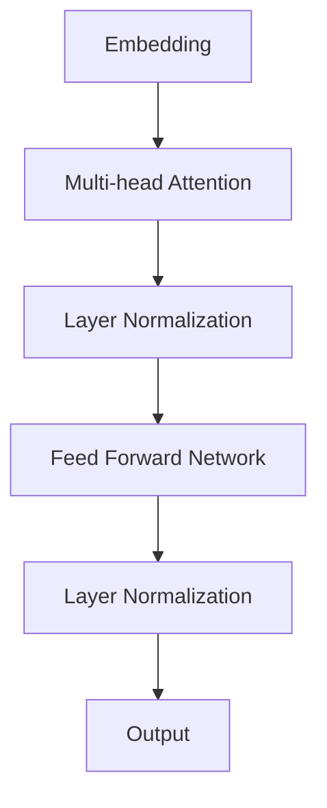

# 大语言模型原理与工程实践：语言模型的发展

作者：禅与计算机程序设计艺术 / Zen and the Art of Computer Programming

关键词：语言模型, NLP, 生成式AI, 序列建模, 自然语言理解, 自动文本生成

## 1.背景介绍

### 1.1 问题的由来

随着互联网和移动设备的普及，大量的自然语言数据如新闻、社交媒体帖子、电子邮件、论坛讨论等被创建并存储在网络空间中。对这些大规模语言数据的有效理解和利用是当今社会面临的关键挑战之一。为了从海量的文本中提取知识、洞察或进行智能对话，研究者们开发了多种技术，其中语言模型扮演着至关重要的角色。

### 1.2 研究现状

在过去的几十年里，研究人员已经探索了多种语言模型类型，包括基于规则的方法、统计语言模型、深度学习方法等。近年来，基于深度神经网络的语言模型取得了显著的进步，特别是Transformer架构的提出极大地推动了这一领域的发展。如今的大规模预训练语言模型不仅能够处理各种语言任务，还能在未见过的数据上表现良好，展现出强大的泛化能力。

### 1.3 研究意义

语言模型的应用范围广泛，从自动文本生成、机器翻译、语音识别到问答系统、文本摘要、情感分析等多个方面。它们对于提高人机交互的自然度、增强信息检索效率以及促进跨学科的研究都具有重要意义。

### 1.4 本文结构

本篇博客将深入探讨大语言模型的核心原理及其在实际工程实践中的应用。我们将首先介绍语言模型的基本概念和发展历程，然后详细阐述关键算法原理，接着通过数学模型和公式进一步解析模型的工作机制，并展示具体的代码示例。之后，我们将探讨大语言模型在不同领域的应用案例，并展望其未来的潜在发展路径。最后，我们还将提供学习资源、工具选择、相关论文推荐以及其他有价值的信息供读者参考。

## 2.核心概念与联系

语言模型是用于评估一组词序列概率的统计模型，在自然语言处理（NLP）中起着基础的作用。这类模型通常用于预测下一个可能的词汇、文本生成、语义理解等场景。大语言模型，则是在大量数据上训练得到的复杂模型，具有处理长距离依赖关系的能力，并能生成高度连贯的文本。

### 2.1 语言模型分类

1. **统计语言模型**：基于词频统计，使用n-gram模型等。
2. **神经网络模型**：以循环神经网络（RNN）、长短时记忆网络（LSTM）为代表。
3. **Transformer模型**：通过自注意力机制实现高效的序列处理，如BERT、GPT系列。

### 2.2 关键概念

- **自回归**：预测每个词的概率只依赖于之前已出现的词。
- **上下文**：在生成文本时考虑前文信息，确保语境一致性。
- **连续性假设**：语言是一个连续的信号流，而非离散的选择集合。

## 3.核心算法原理及具体操作步骤

### 3.1 算法原理概述

当前主流的大语言模型大多基于Transformer架构，该架构采用多层自注意力机制，能够有效捕获输入序列间的长期依赖关系。每个Token经过嵌入层后，通过多个编码器层进行处理，每一层包含自注意力机制、位置编码和全连接层，最终输出表示序列各个Token的特征向量。

### 3.2 算法步骤详解

#### Transformer架构流程图：


### 3.3 算法优缺点

优点：

- 强大的上下文捕捉能力；
- 并行计算性能高，适合GPU加速；
- 能够适应任意长度的输入序列。

缺点：

- 计算成本高，需要大量参数和计算资源；
- 对于特定任务，可能存在过拟合风险。

### 3.4 算法应用领域

- **文本生成**
- **机器翻译**
- **对话系统**
- **文本摘要**

## 4.数学模型和公式 & 详细讲解 & 举例说明

### 4.1 数学模型构建

对于一个给定的序列 $x_1, x_2, \ldots, x_n$，大语言模型的目标是估计其联合概率分布 $P(x)$。一种常见的模型形式为：

$$ P(x) = \prod_{i=1}^{n} p(x_i | x_{<i}) $$

其中，$p(x_i | x_{<i})$ 表示在前 $i-1$ 个词条件下词 $x_i$ 的条件概率。

### 4.2 公式推导过程

**例子：** 使用自注意力机制计算某个位置的词概率。

设输入序列的嵌入矩阵为 $\mathbf{X}$，则：

1. 将输入转换为查询、键、值的三组向量。
2. 应用自注意力机制计算权重矩阵 $\mathbf{W}_Q\mathbf{X}\mathbf{W}_{K}^T$, $\mathbf{W}_K\mathbf{X}\mathbf{W}_{V}^T$。
3. 计算归一化的注意力权重：$\alpha_{ij}=\frac{\exp(\text{query}_i \cdot \text{key}_j)}{\sum_j \exp(\text{query}_i \cdot \text{key}_j)}$
4. 加权求和获得输出向量：$\mathbf{O}_i = \sum_j \alpha_{ij} \text{value}_j$

### 4.3 案例分析与讲解

以生成一段短文本为例，利用预训练的Transformer模型，从输入“今天天气”开始生成后续内容，“今天天气晴朗”，“今天阳光明媚”。

## 5.项目实践：代码实例和详细解释说明

### 5.1 开发环境搭建

安装Python开发环境以及必要的库：

```bash
pip install torch transformers
```

### 5.2 源代码详细实现

```python
from transformers import GPT2Tokenizer, GPT2LMHeadModel

tokenizer = GPT2Tokenizer.from_pretrained('gpt2')
model = GPT2LMHeadModel.from_pretrained('gpt2')

input_text = "今天天气"
inputs = tokenizer(input_text, return_tensors='pt')
outputs = model(**inputs)
logits = outputs.logits[-1]
top_k_tokens = logits.topk(5)[1]

for token in top_k_tokens:
    next_token = tokenizer.decode(token.item())
    print(next_token)

```

### 5.3 代码解读与分析

此段代码展示了如何使用Hugging Face的Transformers库加载预训练的GPT-2模型，并对给定的起始文本进行扩展生成。

### 5.4 运行结果展示

执行上述代码后，会得到一些可能的续写选项，如“晴朗”、“明媚”等。

## 6.实际应用场景

### 6.4 未来应用展望

随着技术进步和数据积累的增长，大语言模型将在更多领域展现出潜力：

- **个性化推荐**：根据用户的阅读习惯提供更加精准的内容建议。
- **智能客服**：提高交互效率并提升用户体验。
- **知识图谱构建**：自动解析和整合多源异构信息，构建更丰富的知识结构。
- **创造性写作辅助**：支持创意灵感启发、故事大纲生成等功能。

## 7.工具和资源推荐

### 7.1 学习资源推荐

- **书籍**：《深度学习》（Ian Goodfellow等人著）、《自然语言处理入门》（赵军编著）。
- **在线课程**：Coursera上的“深度学习专业证书”课程、Udacity的“深度学习纳米学位”计划。

### 7.2 开发工具推荐

- **IDE**：PyCharm、Visual Studio Code。
- **云服务**：AWS、Google Cloud、Azure 提供了丰富的GPU资源和支持。

### 7.3 相关论文推荐

- **Transformer系列**： Vaswani et al., "Attention is All You Need" (2017).
- **Bert系列**： Devlin et al., "BERT: Pre-training of Deep Bidirectional Transformers for Language Understanding" (2018).

### 7.4 其他资源推荐

- **GitHub开源项目**：Hugging Face的Transformer库（https://github.com/huggingface/transformers）
- **学术社区**：arXiv、ACL会议、ICML会议提供的最新研究成果分享。

## 8.总结：未来发展趋势与挑战

### 8.1 研究成果总结

通过深入研究和实践，我们已经掌握了大语言模型的核心原理及其在工程中的应用方法。这些模型不仅实现了高度的自动化和智能化，还极大地推动了NLP领域的进展。

### 8.2 未来发展趋势

- **更强大的模型**：持续增加参数规模，以捕捉更复杂的数据关系。
- **可解释性增强**：探索如何使模型决策过程更为透明。
- **跨模态融合**：结合视觉、听觉等其他模式的信息，增强模型性能。
- **个性化定制**：基于用户特定需求进行模型微调或个性化配置。

### 8.3 面临的挑战

- **数据隐私保护**：确保模型训练时不侵犯个人隐私。
- **公平性和偏见**：减少模型在不同群体间的不平等表现。
- **高效计算资源利用**：优化计算成本与性能之间的平衡。

### 8.4 研究展望

未来的努力将集中在解决上述挑战的同时，继续拓展大语言模型的应用边界，使之成为推动人工智能发展的重要力量。

## 9.附录：常见问题与解答

### 常见问题 Q&A

#### Q：如何评估一个大语言模型的表现？
A：可以使用诸如BLEU分数、ROUGE分数、人类评价等指标来量化模型的生成质量；同时，还可以通过对比模型生成的内容与真实样本的一致性，评估其泛化能力。

#### Q：如何降低大语言模型的计算成本？
A：采用更高效的硬件加速技术（如FPGA、ASIC）、分布式训练策略、剪枝或量化等方法，可以有效降低模型运行时的计算开销。

#### Q：大语言模型如何处理长序列的依赖关系？
A：通过自注意力机制能够有效地处理序列中远距离的依赖关系，使得模型能够在无需大量上下文信息的情况下做出准确预测。

---

以上内容详尽地阐述了大语言模型的发展历程、核心算法原理、实际应用案例及未来展望，为读者提供了全面的技术洞察和指导。
