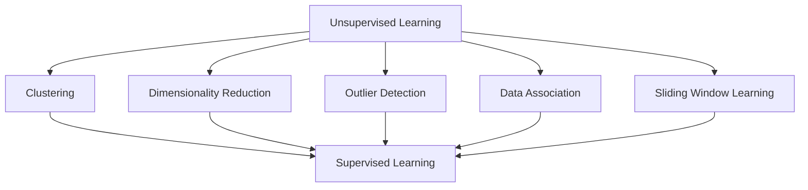

# 无监督学习 (Unsupervised Learning) 原理与代码实例讲解

作者：禅与计算机程序设计艺术 / Zen and the Art of Computer Programming

关键词：无监督学习，数据挖掘，聚类，降维，异常检测，自编码器

## 1. 背景介绍

### 1.1 问题的由来

在人工智能和机器学习领域中，数据是驱动进步的核心。然而，并非所有数据都是带有标签的。在某些情况下，我们可能只有未标记的数据集，例如社交媒体数据、网络日志、生物医学图像等。在这种情况下，我们需要一种方法来从这些数据中提取有用的信息，即使没有明确的指导或目标。

### 1.2 研究现状

无监督学习（Unsupervised Learning）作为机器学习的一个重要分支，旨在通过分析未标记数据来发现数据中的隐藏结构和模式。近年来，随着大数据和计算能力的提升，无监督学习得到了迅速发展，涌现出了许多新的算法和应用。

### 1.3 研究意义

无监督学习在数据探索、模式识别、异常检测等领域具有重要的应用价值。通过无监督学习，我们可以：

- 发现数据中的隐藏结构，例如聚类和降维。
- 进行异常检测，识别数据中的异常值。
- 分析复杂数据集，揭示潜在的模式和关联。
- 增强机器学习系统的鲁棒性和泛化能力。

### 1.4 本文结构

本文将深入探讨无监督学习的原理、算法、应用和未来发展趋势。文章结构如下：

- 第2章介绍无监督学习的核心概念和联系。
- 第3章详细讲解无监督学习的核心算法原理和操作步骤。
- 第4章探讨数学模型和公式，并提供案例分析。
- 第5章通过代码实例展示无监督学习的实际应用。
- 第6章介绍无监督学习的实际应用场景和未来展望。
- 第7章推荐相关工具和资源。
- 第8章总结无监督学习的研究成果、未来发展趋势和挑战。
- 第9章提供常见问题与解答。

## 2. 核心概念与联系

### 2.1 无监督学习的定义

无监督学习是指在没有明确指导或目标的情况下，通过分析数据来发现数据中的结构和模式的学习方法。

### 2.2 无监督学习的类型

无监督学习主要分为以下几类：

- 聚类（Clustering）：将数据点分组，使得组内数据点相似，组间数据点不同。
- 降维（Dimensionality Reduction）：减少数据集的维度，同时保留数据的重要信息。
- 异常检测（Outlier Detection）：识别数据中的异常值或异常模式。
- 数据关联（Data Association）：发现数据中的关联规则和依赖关系。
- 套索学习（Sliding Window Learning）：通过滑动窗口分析数据序列。

### 2.3 无监督学习的联系

无监督学习与其他机器学习分支之间存在着紧密的联系，如图2.1所示。



## 3. 核心算法原理 & 具体操作步骤

### 3.1 算法原理概述

无监督学习算法主要基于以下原理：

- 聚类算法：基于距离度量将数据点分组，例如K-Means、层次聚类等。
- 降维算法：通过优化目标函数减少数据维度，例如主成分分析(PCA)、线性判别分析(LDA)等。
- 异常检测算法：通过识别数据中的异常值或异常模式来检测异常，例如Isolation Forest、LOF等。

### 3.2 算法步骤详解

无监督学习算法通常包含以下步骤：

1. 数据预处理：对原始数据进行清洗、归一化等操作，提高数据质量。
2. 特征选择：从数据中提取重要特征，降低数据维度。
3. 算法选择：根据任务需求选择合适的无监督学习算法。
4. 模型训练：将数据输入到所选算法中进行训练。
5. 模型评估：评估模型的性能，如聚类结果的准确度、降维后的数据质量等。

### 3.3 算法优缺点

以下是几种常见无监督学习算法的优缺点：

#### 3.3.1 K-Means聚类

- 优点：简单易用，计算效率高。
- 缺点：对初始聚类中心敏感，可能陷入局部最优。

#### 3.3.2 主成分分析(PCA)

- 优点：能够有效降维，保留数据主要信息。
- 缺点：对噪声敏感，可能丢失部分信息。

#### 3.3.3 Isolation Forest

- 优点：对异常值检测效果好，对特征没有严格要求。
- 缺点：对异常值分布不敏感，可能误报。

### 3.4 算法应用领域

无监督学习算法在以下领域有广泛应用：

- 数据挖掘：发现数据中的潜在模式和关联。
- 文本分析：文本聚类、主题建模等。
- 图像处理：图像分割、异常检测等。
- 生物信息学：基因表达分析、蛋白质结构预测等。

## 4. 数学模型和公式 & 详细讲解 & 举例说明

### 4.1 数学模型构建

无监督学习算法通常涉及以下数学模型：

- 聚类算法：欧氏距离、K-Means目标函数等。
- 降维算法：协方差矩阵、特征值分解等。
- 异常检测算法：决策树、分类边界等。

### 4.2 公式推导过程

以下以K-Means聚类算法为例，介绍其目标函数的推导过程：

假设数据集$\mathcal{D} = \{x_1, x_2, \dots, x_n\}$，其中每个数据点$x_i$属于第$k$个聚类中心$c_k$的类，我们希望优化以下目标函数：

$$J(\mathcal{D}, c) = \sum_{i=1}^n \sum_{k=1}^K d(x_i, c_k)$$

其中，$d(x_i, c_k)$是数据点$x_i$和聚类中心$c_k$之间的距离。

为了最小化目标函数，我们选择K个聚类中心$c_1, c_2, \dots, c_K$，使得每个数据点$x_i$与其最近聚类中心$c_k$的距离最小。

### 4.3 案例分析与讲解

假设我们有一个二维数据集$\mathcal{D}$，包含以下数据点：

```
x1: (1.0, 2.0)
x2: (1.5, 1.8)
x3: (5.0, 4.0)
x4: (5.5, 3.5)
x5: (8.0, 8.0)
x6: (9.0, 9.0)
```

我们将使用K-Means聚类算法将数据集分为2个聚类。

### 4.4 常见问题解答

#### 4.4.1 什么是聚类中心？

聚类中心是聚类算法中用于代表每个聚类的一组数据点。在K-Means聚类中，聚类中心通常定义为每个聚类中所有数据点的均值。

#### 4.4.2 什么是降维？

降维是指通过减少数据集的维度来降低数据的复杂度。这有助于提高模型的性能和可解释性。

#### 4.4.3 什么是异常值？

异常值是指与数据集其他数据点显著不同的数据点。异常值可能由错误、噪声或感兴趣的数据组成。

## 5. 项目实践：代码实例和详细解释说明

### 5.1 开发环境搭建

首先，安装所需的库：

```bash
pip install numpy matplotlib scikit-learn
```

### 5.2 源代码详细实现

以下是一个使用K-Means聚类算法进行数据聚类的Python代码实例：

```python
import numpy as np
import matplotlib.pyplot as plt
from sklearn.cluster import KMeans

# 数据集
data = np.array([[1.0, 2.0], [1.5, 1.8], [5.0, 4.0], [5.5, 3.5], [8.0, 8.0], [9.0, 9.0]])

# K-Means聚类
kmeans = KMeans(n_clusters=2, random_state=42).fit(data)

# 绘制结果
plt.scatter(data[:, 0], data[:, 1], c=kmeans.labels_, cmap='viridis')
plt.scatter(kmeans.cluster_centers_[:, 0], kmeans.cluster_centers_[:, 1], s=300, c='red', marker='x')
plt.show()
```

### 5.3 代码解读与分析

1. 首先，导入必要的库和模块。
2. 加载数据集。
3. 创建K-Means聚类对象，指定聚类数量为2。
4. 使用`.fit()`方法训练模型。
5. 使用`.scatter()`方法绘制聚类结果，其中`c=kmeans.labels_`表示每个数据点的聚类标签，`cmap='viridis'`指定颜色映射，`s=300`指定标记大小，`c='red'`表示聚类中心，`marker='x'`指定标记形状。
6. 使用`.show()`方法显示图形。

### 5.4 运行结果展示

运行上述代码后，将得到一个包含2个聚类的二维散点图。其中，红色标记表示聚类中心，其他标记表示属于各个聚类的数据点。

## 6. 实际应用场景

无监督学习在以下领域有广泛应用：

### 6.1 数据挖掘

无监督学习在数据挖掘中用于发现数据中的潜在模式和关联。例如，在电子商务领域，无监督学习可以帮助商家发现顾客购买行为中的关联规则，从而推荐相关商品。

### 6.2 文本分析

无监督学习在文本分析中用于文本聚类、主题建模等。例如，在新闻推荐系统中，无监督学习可以帮助识别新闻主题，从而将相关新闻推荐给用户。

### 6.3 图像处理

无监督学习在图像处理中用于图像分割、异常检测等。例如，在医学图像分析中，无监督学习可以帮助识别图像中的异常区域，从而辅助医生进行诊断。

### 6.4 生物信息学

无监督学习在生物信息学中用于基因表达分析、蛋白质结构预测等。例如，无监督学习可以帮助科学家发现基因表达模式，从而揭示疾病机制。

## 7. 工具和资源推荐

### 7.1 学习资源推荐

- 《机器学习》（周志华著）
- 《统计学习方法》（李航著）
- 《Python机器学习》（Sean J. Phoenix、Joel Grus、Joel Grus著）

### 7.2 开发工具推荐

- NumPy：[https://numpy.org/](https://numpy.org/)
- Scikit-learn：[https://scikit-learn.org/stable/](https://scikit-learn.org/stable/)
- Matplotlib：[https://matplotlib.org/](https://matplotlib.org/)

### 7.3 相关论文推荐

- K-Means聚类算法：MacQueen, J. B. (1967). Some methods for classification and analysis of multivariate observations.
- 主成分分析：Hotelling, H. (1933). Analysis of a complex of statistical variables into principal components.
- 异常检测：Liu, H., Ting, K. M., & Zhou, Z.-H. (2008). Isolation Forest.

### 7.4 其他资源推荐

- GitHub：[https://github.com/](https://github.com/)
- Kaggle：[https://www.kaggle.com/](https://www.kaggle.com/)

## 8. 总结：未来发展趋势与挑战

无监督学习在机器学习领域扮演着重要角色，随着数据量的不断增长和计算能力的提升，无监督学习将迎来更多的发展机遇。以下是无监督学习未来发展趋势与挑战：

### 8.1 未来发展趋势

#### 8.1.1 深度学习在无监督学习中的应用

深度学习在图像、语音等领域的成功应用推动了其在无监督学习中的应用。未来，深度学习将进一步与其他无监督学习算法结合，提高模型性能。

#### 8.1.2 跨模态无监督学习

跨模态无监督学习旨在同时处理和理解多种类型的数据。随着多模态数据的不断涌现，跨模态无监督学习将成为一个重要研究方向。

#### 8.1.3 无监督学习与强化学习的结合

无监督学习与强化学习的结合有望解决某些强化学习任务中的样本效率问题，提高学习速度。

### 8.2 面临的挑战

#### 8.2.1 数据质量与可解释性

无监督学习依赖于数据质量和模型的可解释性。如何提高数据质量、降低噪声，以及提高模型的可解释性，是无监督学习面临的挑战。

#### 8.2.2 模型泛化能力

无监督学习模型在训练过程中可能学习到数据中的噪声和偏差，导致泛化能力不足。如何提高模型的泛化能力，是无监督学习需要解决的重要问题。

#### 8.2.3 隐私与安全性

随着无监督学习在更多领域的应用，数据隐私和安全性成为关注焦点。如何保护用户隐私，提高模型安全性，是无监督学习需要面对的挑战。

## 9. 附录：常见问题与解答

### 9.1 什么是无监督学习？

无监督学习是指在没有明确指导或目标的情况下，通过分析数据来发现数据中的结构和模式的学习方法。

### 9.2 无监督学习有哪些类型？

无监督学习主要包括聚类、降维、异常检测、数据关联和套索学习等类型。

### 9.3 无监督学习在实际应用中有什么价值？

无监督学习在数据挖掘、文本分析、图像处理和生物信息学等领域有广泛应用，可以用于发现数据中的潜在模式和关联，辅助决策和发现新知识。

### 9.4 如何选择合适的无监督学习算法？

选择合适的无监督学习算法需要考虑数据类型、任务需求和计算资源等因素。可以参考相关文献和在线资源，根据实际需求选择合适的算法。

### 9.5 无监督学习的挑战有哪些？

无监督学习面临的挑战包括数据质量与可解释性、模型泛化能力和隐私与安全性等。

通过不断的研究和创新，无监督学习将继续在机器学习领域发挥重要作用，并为人工智能的发展提供有力支持。