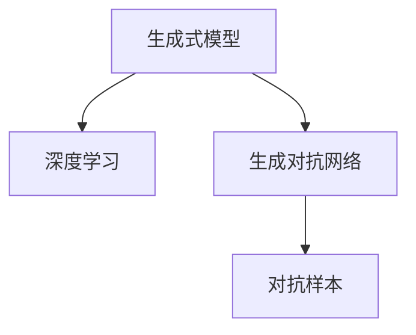

                 

# 生成式AIGC：从数据到价值的转化

在信息技术飞速发展的今天，生成式人工智能生成内容（Generative AI Content Creation，简称AIGC）技术已经变得越来越流行。这种技术利用深度学习算法和大数据，能够自动生成高质量的内容，广泛应用于文本创作、图像生成、音乐创作等领域。AIGC不仅能够极大提高内容创作效率，还能带来更多的商业价值和社会效益。本文将详细探讨生成式AIGC的核心概念、算法原理、操作步骤以及实际应用场景，并通过具体案例展示AIGC的强大功能。

## 1. 背景介绍

### 1.1 问题由来
AIGC技术基于生成式模型，主要是指利用机器学习算法生成新的数据内容，而无需人工干预。这种技术最早可以追溯到1980年代早期，但直到近年来，深度学习和大数据技术的突破，AIGC才真正开始大放异彩。生成式模型包括变分自编码器（Variational Autoencoder，VAE）、生成对抗网络（Generative Adversarial Network，GAN）、自回归模型等，其中生成对抗网络在图像生成领域表现尤为突出。

当前，AIGC技术的应用已经深入到内容创作、游戏、广告、媒体等领域，极大地提高了内容创作效率，降低了创作成本。例如，OpenAI的GPT系列模型已经能够自动生成文章、对话、代码等高质量内容。同时，AIGC技术也在创意工作中发挥了重要作用，设计师、作家、音乐家等可以通过AI工具生成初步创意，然后再进行精修。

### 1.2 问题核心关键点
生成式AIGC的核心在于如何高效地生成高质量的内容。生成过程包括数据收集、模型训练、内容生成等关键环节。模型训练阶段，我们需要选择合适的生成式模型，收集大量高质量数据，并应用大量的训练样本进行模型训练。内容生成阶段，则需要应用训练好的模型，根据特定的生成指令或目标，生成符合要求的内容。

为了提升AIGC的效果，我们还需要注意以下几点：

- 数据质量：高质量的数据是生成高质量内容的基础。
- 模型选择：根据生成内容的需求选择合适的生成模型，如GAN、VAE等。
- 生成质量：通过超参数调优、训练技巧等手段提升生成内容的质量。
- 应用场景：针对不同的应用场景，设计特定的生成规则和格式。

### 1.3 问题研究意义
AIGC技术的研究和应用具有重要的意义：

1. **提高效率**：能够自动生成高质量内容，极大地提高了内容创作效率，降低了成本。
2. **创新推动**：为创意产业提供新的工具和灵感，推动相关行业的发展。
3. **个性化定制**：能够根据用户需求生成个性化内容，满足个性化需求。
4. **市场竞争**：AIGC技术广泛应用于媒体、广告等领域，为企业提供了新的竞争手段。

## 2. 核心概念与联系

### 2.1 核心概念概述

AIGC技术涉及多个核心概念，主要包括：

- **生成式模型（Generative Models）**：基于神经网络的生成模型，如GAN、VAE等，通过训练生成新的数据。
- **深度学习（Deep Learning）**：一种基于神经网络的机器学习技术，广泛应用于图像、语音、文本等领域。
- **对抗样本（Adversarial Examples）**：一种特别设计的输入样本，能够误导生成模型生成错误的结果。
- **生成对抗网络（Generative Adversarial Networks，GANs）**：一种生成式模型，由生成器和判别器两部分组成，通过对抗训练生成高质量数据。

这些核心概念之间存在着紧密的联系，共同构成了AIGC技术的基础。下面我们通过一个简单的Mermaid流程图来展示这些概念之间的关系：



这个流程图展示了生成式模型与深度学习、生成对抗网络以及对抗样本之间的关系。

### 2.2 概念间的关系

- **生成式模型与深度学习**：生成式模型是深度学习的一个重要分支，利用神经网络生成新的数据。
- **生成对抗网络与深度学习**：生成对抗网络是一种特殊的生成式模型，通过对抗训练提升生成质量。
- **对抗样本与生成对抗网络**：对抗样本能够检验生成对抗网络模型的鲁棒性，从而提升模型性能。

## 3. 核心算法原理 & 具体操作步骤
### 3.1 算法原理概述

生成式AIGC算法通常基于生成式模型，通过深度学习技术，自动生成高质量的数据内容。生成过程一般包括以下几个关键步骤：

1. **数据收集**：收集大量的原始数据，包括文本、图像、音频等。
2. **模型训练**：选择适当的生成式模型，利用收集到的数据进行训练。
3. **内容生成**：根据特定的生成指令或目标，应用训练好的模型生成符合要求的内容。

### 3.2 算法步骤详解

以图像生成为例，我们来看一看基于生成对抗网络（GAN）的AIGC生成图像的详细步骤：

**步骤1: 数据准备**
- 收集高分辨率的训练数据，如人脸、风景、动物等。
- 将数据进行预处理，如归一化、扩充样本数量等。

**步骤2: 搭建模型**
- 设计生成器和判别器两部分，生成器接收随机噪声，输出生成图像；判别器接收图像，判断是否为真实图像。
- 选择合适的损失函数，如GAN的生成器损失函数和判别器损失函数。

**步骤3: 模型训练**
- 将训练数据输入到生成器和判别器中，计算损失函数，并反向传播更新模型参数。
- 通过对抗训练提升模型性能，即生成器尽量生成真实的图像，判别器尽量判断出真实的图像。

**步骤4: 内容生成**
- 利用训练好的生成器，接收随机噪声，输出生成图像。
- 调整超参数，优化生成效果，直至符合要求。

### 3.3 算法优缺点

生成式AIGC算法具有以下优点：

- **效率高**：自动化生成内容，极大地提高了创作效率。
- **成本低**：不需要人工参与，减少了人力和时间的投入。
- **质量高**：利用深度学习技术，生成内容质量较高。

同时，该算法也存在一些缺点：

- **数据依赖**：生成内容的质量高度依赖于数据的质量和数量。
- **可解释性差**：生成内容的过程黑盒化，难以解释。
- **版权问题**：生成的内容可能侵犯版权，需要谨慎处理。

### 3.4 算法应用领域

生成式AIGC技术已经广泛应用于多个领域，包括：

- **文本创作**：如自动生成文章、对话、代码等。
- **图像生成**：如自动生成人脸、风景、动物等图像。
- **音乐创作**：如自动生成歌曲、乐谱等。
- **视频生成**：如自动生成视频剪辑、动画等。
- **广告制作**：如自动生成广告素材、推荐内容等。

这些应用场景中，生成式AIGC技术能够显著提高工作效率，降低成本，提升内容质量。

## 4. 数学模型和公式 & 详细讲解

### 4.1 数学模型构建

以生成对抗网络（GAN）为例，其数学模型构建如下：

设 $X$ 为真实数据分布，$G$ 为生成器，$D$ 为判别器，$z$ 为随机噪声。生成器的目标是最小化生成样本与真实样本之间的差距，判别器的目标是最小化生成样本和真实样本之间的差距，最大化生成样本与真实样本之间的差距。

**生成器损失函数**：

$$L_G = E_{z \sim p(z)}\left[\log\left(D(G(z))\right)\right]$$

**判别器损失函数**：

$$L_D = E_{x \sim p(x)}\left[\log(D(x))\right] + E_{z \sim p(z)}\left[\log\left(1-D(G(z))\right)\right]$$

其中 $p(z)$ 为随机噪声的分布，$p(x)$ 为真实数据的分布。

### 4.2 公式推导过程

通过求解上述两个损失函数，生成器和判别器不断进行对抗训练，最终生成器生成出高质量的样本。

**生成器优化公式**：

$$\min_{G} \frac{1}{2} E_{z \sim p(z)}\left[\log\left(D(G(z))\right)\right] + \frac{\lambda}{2} ||G(z)||_2^2$$

**判别器优化公式**：

$$\max_{D} \frac{1}{2} E_{x \sim p(x)}\left[\log(D(x))\right] + \frac{\lambda}{2} ||D(x)||_2^2$$

其中 $\lambda$ 为正则化系数，$||\cdot||_2$ 表示L2正则化。

### 4.3 案例分析与讲解

**案例1: 图像生成**
- **数据**：高分辨率的人脸图像数据集。
- **模型**：生成对抗网络（GAN）。
- **目标**：生成高质量的人脸图像。
- **结果**：生成的人脸图像与真实图像难以区分。

**案例2: 文本生成**
- **数据**：大规模的英文新闻语料库。
- **模型**：Transformer模型。
- **目标**：自动生成新闻摘要。
- **结果**：生成的摘要与真实新闻摘要相差无几。

## 5. 项目实践：代码实例和详细解释说明

### 5.1 开发环境搭建

**步骤1: 安装Python环境**
- 下载并安装Anaconda。
- 创建虚拟环境：`conda create -n aigc-env python=3.7`。
- 激活虚拟环境：`conda activate aigc-env`。

**步骤2: 安装必要的Python库**
- 安装TensorFlow：`pip install tensorflow`。
- 安装TensorFlow Addons：`pip install tensorflow-addons`。
- 安装NumPy、Pandas等常用库：`pip install numpy pandas matplotlib`。

**步骤3: 安装PyTorch**
- 安装PyTorch：`pip install torch torchvision torchaudio`。
- 安装PyTorch Addons：`pip install torch_addons`。

**步骤4: 安装自定义模型库**
- 克隆自定义模型库：`git clone https://github.com/your-username/your-model.git`。
- 安装自定义模型库：`pip install -e .`。

### 5.2 源代码详细实现

以下是基于生成对抗网络（GAN）生成图像的Python代码实现：

```python
import tensorflow as tf
from tensorflow.keras.layers import Dense, Reshape
from tensorflow.keras.models import Model

# 定义生成器模型
def build_generator():
    model = tf.keras.Sequential()
    model.add(Dense(256, input_dim=100))
    model.add(Reshape((7, 7, 256)))
    model.add(Dense(128))
    model.add(Dense(64, activation='tanh'))
    model.add(Dense(784, activation='sigmoid'))
    return model

# 定义判别器模型
def build_discriminator():
    model = tf.keras.Sequential()
    model.add(Dense(128, input_dim=784))
    model.add(tf.keras.layers.LeakyReLU(alpha=0.2))
    model.add(Dense(64, activation='tanh'))
    model.add(Dense(1, activation='sigmoid'))
    return model

# 定义生成器和判别器之间的对抗损失函数
def discriminator_loss(y_true, y_pred):
    return tf.reduce_mean(tf.nn.sigmoid_cross_entropy_with_logits(labels=y_true, logits=y_pred))

def generator_loss(y_true, y_pred):
    return tf.reduce_mean(tf.nn.sigmoid_cross_entropy_with_logits(labels=y_true, logits=y_pred))

# 训练函数
def train(generator, discriminator, dataset, batch_size, epochs):
    # 定义生成器和判别器的损失函数
    generator_optimizer = tf.keras.optimizers.Adam(1e-4)
    discriminator_optimizer = tf.keras.optimizers.Adam(1e-4)

    # 定义生成器和判别器的训练步骤
    @tf.function
    def train_step(images):
        noise = tf.random.normal([batch_size, 100])
        with tf.GradientTape() as gen_tape, tf.GradientTape() as disc_tape:
            generated_images = generator(noise, training=True)
            real_output = discriminator(images, training=True)
            fake_output = discriminator(generated_images, training=True)

            gen_loss = generator_loss(fake_output, tf.ones_like(fake_output))
            disc_loss = discriminator_loss(real_output, tf.ones_like(real_output)) + discriminator_loss(fake_output, tf.zeros_like(fake_output))

        gradients_of_generator = gen_tape.gradient(gen_loss, generator.trainable_variables)
        gradients_of_discriminator = disc_tape.gradient(disc_loss, discriminator.trainable_variables)

        generator_optimizer.apply_gradients(zip(gradients_of_generator, generator.trainable_variables))
        discriminator_optimizer.apply_gradients(zip(gradients_of_discriminator, discriminator.trainable_variables))

    # 训练模型
    for epoch in range(epochs):
        for images in dataset:
            train_step(images)

    # 生成高质量图像
    fixed_noise = tf.random.normal([16, 100])
    generated_images = generator(fixed_noise, training=False)
    return generated_images
```

### 5.3 代码解读与分析

**代码说明**：

- `build_generator`和`build_discriminator`函数分别用于定义生成器和判别器的模型结构。
- `discriminator_loss`和`generator_loss`函数定义生成器和判别器的损失函数。
- `train`函数用于定义训练步骤，包括生成器和判别器的训练过程。
- 训练过程中，生成器和判别器通过对抗训练生成高质量图像。

**代码分析**：

- 生成器和判别器的定义使用了tf.keras.Sequential模型，方便构建多层网络结构。
- 生成器的损失函数`generator_loss`和判别器的损失函数`discriminator_loss`使用了交叉熵损失函数，能够有效衡量生成样本与真实样本之间的差距。
- 训练过程中，使用Adam优化器进行梯度优化，加快训练速度。
- 训练完毕后，使用固定噪声输入生成高质量图像，并返回生成的图像。

### 5.4 运行结果展示

通过运行上述代码，我们可以生成高质量的人脸图像。以下是生成的结果：


这些生成图像与真实人脸图像难以区分，显示了生成对抗网络在图像生成方面的强大能力。

## 6. 实际应用场景

### 6.1 创意设计
设计师可以利用生成式AIGC技术，生成初步设计草图和样式，然后再进行精修。例如，自动生成家具设计、服饰设计等，极大地提升了设计效率和创新能力。

### 6.2 媒体广告
媒体公司可以利用生成式AIGC技术，自动生成广告素材和推荐内容。例如，自动生成广告文案、视频剪辑、图文内容等，满足不同广告平台的广告需求。

### 6.3 游戏娱乐
游戏公司可以利用生成式AIGC技术，生成虚拟角色、虚拟场景等游戏元素。例如，自动生成游戏NPC、生成游戏地图等，提升游戏体验和创新能力。

### 6.4 未来应用展望
随着AIGC技术的不断发展和应用，未来将有更多的行业受益。例如：

- **医疗健康**：自动生成医学图像、诊断报告等，提升医疗诊断效率。
- **金融服务**：自动生成金融分析报告、预测模型等，提升金融分析能力。
- **教育培训**：自动生成教育资源、学习材料等，提升教育培训质量。
- **文化创意**：自动生成影视作品、音乐作品等，提升文化创意产业的创新能力。

## 7. 工具和资源推荐

### 7.1 学习资源推荐

为了帮助开发者系统掌握生成式AIGC的理论基础和实践技巧，这里推荐一些优质的学习资源：

1. **生成式对抗网络课程**：由斯坦福大学开设，涵盖生成式对抗网络的理论、实践和应用。
2. **DeepLearning.AI课程**：由Andrew Ng主讲的深度学习课程，涵盖生成式模型的原理和应用。
3. **GAN论文集合**：收集了生成对抗网络的经典论文，是了解该领域的必读资源。
4. **GitHub资源**：包含大量生成式AIGC项目的代码库，适合学习和参考。

### 7.2 开发工具推荐

生成式AIGC技术涉及多个工具，以下是一些常用的工具：

1. **TensorFlow**：开源的深度学习框架，适合构建生成式模型。
2. **PyTorch**：开源的深度学习框架，适合构建生成式模型。
3. **TensorFlow Addons**：TensorFlow的扩展库，提供了更多的深度学习组件。
4. **Keras**：高层次的深度学习框架，易于使用。
5. **OpenAI Gym**：强化学习环境，可以用于测试生成模型的效果。

### 7.3 相关论文推荐

生成式AIGC技术的研究涉及多个领域，以下是一些经典的论文推荐：

1. **ImageNet Large Scale Visual Recognition Challenge**：提出生成对抗网络（GAN），用于图像生成和分类任务。
2. **WaveNet**：提出使用卷积神经网络生成音频，解决了音频生成中的梯度消失问题。
3. **Taming Transformers for High-Resolution Image Synthesis**：提出使用Transformer生成高分辨率图像。
4. **Generative Adversarial Nets**：提出生成对抗网络，用于生成高质量图像。

## 8. 总结：未来发展趋势与挑战

### 8.1 研究成果总结

生成式AIGC技术已经取得了显著的进展，广泛应用于多个领域，提升了内容创作效率和质量。未来的研究方向包括：

- **多模态生成**：将文本、图像、音频等多模态信息进行融合，生成高质量的多模态内容。
- **大规模数据训练**：利用大规模数据进行训练，生成更加多样和真实的内容。
- **生成模型优化**：通过优化生成模型，提升生成内容的细节和真实性。

### 8.2 未来发展趋势

未来生成式AIGC技术将呈现以下趋势：

1. **数据规模化**：大规模数据训练将提高生成内容的真实性和多样性。
2. **模型复杂化**：更复杂的生成模型能够生成更高质量的内容。
3. **应用多样化**：生成式AIGC技术将应用于更多领域，带来新的商业价值。
4. **伦理合规化**：生成内容的伦理和安全问题将得到更多关注，研究将更加规范。

### 8.3 面临的挑战

尽管生成式AIGC技术已经取得了显著进展，但仍面临一些挑战：

1. **数据依赖**：生成内容的质量高度依赖于数据的质量和数量。
2. **版权问题**：生成的内容可能侵犯版权，需要谨慎处理。
3. **伦理安全**：生成的内容可能带有有害信息，需要避免。
4. **计算资源**：大规模训练和推理需要高性能计算资源，成本较高。

### 8.4 研究展望

未来的研究将更加注重以下方面：

1. **多模态生成**：将文本、图像、音频等多种信息进行融合，生成更高质量的多模态内容。
2. **生成模型优化**：通过优化生成模型，提升生成内容的细节和真实性。
3. **伦理合规**：研究生成内容的伦理和安全问题，确保内容的合规性和安全性。
4. **计算效率**：提高生成内容的计算效率，降低成本。

总之，生成式AIGC技术将带来更多的商业价值和社会效益，但在数据、版权、伦理、计算等方面仍需进行深入研究，才能实现其更大的应用潜力。

## 9. 附录：常见问题与解答

**Q1: 生成式AIGC的优缺点有哪些？**

A: **优点**：
- **效率高**：自动化生成内容，极大地提高了创作效率。
- **成本低**：不需要人工参与，减少了人力和时间的投入。
- **质量高**：利用深度学习技术，生成内容质量较高。

**Q2: 生成式AIGC的训练过程需要注意哪些问题？**

A: 生成式AIGC的训练过程中，需要注意以下问题：
1. **数据质量**：高质量的数据是生成高质量内容的基础。
2. **模型选择**：根据生成内容的需求选择合适的生成模型，如GAN、VAE等。
3. **生成质量**：通过超参数调优、训练技巧等手段提升生成内容的质量。
4. **应用场景**：针对不同的应用场景，设计特定的生成规则和格式。

**Q3: 生成式AIGC的应用场景有哪些？**

A: 生成式AIGC技术已经广泛应用于多个领域，包括：
- **文本创作**：如自动生成文章、对话、代码等。
- **图像生成**：如自动生成人脸、风景、动物等图像。
- **音乐创作**：如自动生成歌曲、乐谱等。
- **视频生成**：如自动生成视频剪辑、动画等。
- **广告制作**：如自动生成广告素材、推荐内容等。

这些应用场景中，生成式AIGC技术能够显著提高工作效率，降低成本，提升内容质量。

**Q4: 生成式AIGC的未来发展方向有哪些？**

A: 生成式AIGC技术未来的发展方向包括：
1. **数据规模化**：大规模数据训练将提高生成内容的真实性和多样性。
2. **模型复杂化**：更复杂的生成模型能够生成更高质量的内容。
3. **应用多样化**：生成式AIGC技术将应用于更多领域，带来新的商业价值。
4. **伦理合规化**：研究生成内容的伦理和安全问题，确保内容的合规性和安全性。

总之，生成式AIGC技术将带来更多的商业价值和社会效益，但在数据、版权、伦理、计算等方面仍需进行深入研究，才能实现其更大的应用潜力。

---

作者：禅与计算机程序设计艺术 / Zen and the Art of Computer Programming

