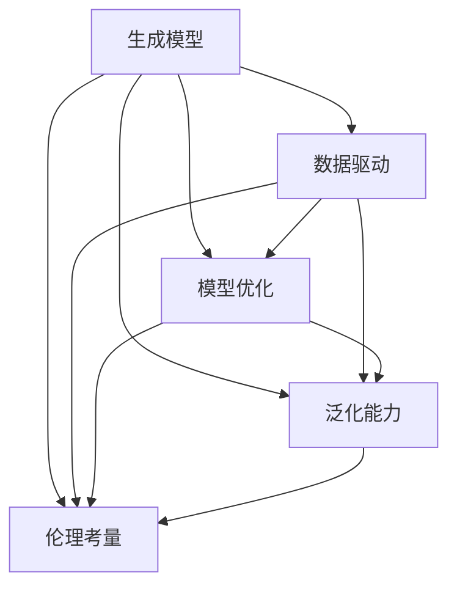

                 

# 生成式AIGC：从概念到现实的落地之路

> 关键词：生成式AIGC,扩散模型,生成对抗网络,变分自编码器,Transformer模型,人工生成内容,多媒体生成,生成式人工智能

## 1. 背景介绍

### 1.1 问题由来

生成式人工智能（Generative AI, AIGC）是一种通过机器学习算法自动生成内容的技术，它能够根据输入的信息生成文本、图像、音频等多种形式的原创作品，广泛应用于内容创作、娱乐、媒体、广告等领域。近年来，随着深度学习技术的突破，生成式AI逐渐成为AI领域的热门研究方向之一，涌现出扩散模型（Diffusion Models）、生成对抗网络（GANs）、变分自编码器（VAEs）等多种生成模型。

生成式AI的重要应用包括但不限于：

- **文本生成**：自动撰写文章、报告、对话、翻译等文本内容。
- **图像生成**：自动生成艺术作品、摄影、动画、视频等图像内容。
- **音频生成**：自动生成音乐、语音、人声等音频内容。
- **多媒体生成**：结合文本、图像、音频等多种形式生成多媒体内容。

这些应用不仅为内容创作提供了新的方式，也为传统行业带来了革新性的变革。生成式AI的潜力巨大，但面临诸多技术挑战和伦理问题，需要进一步研究和优化。

### 1.2 问题核心关键点

生成式AIGC的核心在于利用深度学习算法，通过训练生成模型，自动生成具有高度真实性、多样性和创意性的内容。其主要关注点包括：

- **数据驱动**：生成式AI需要大量的标注数据进行训练，这些数据需涵盖各种类型的现实世界场景。
- **模型设计**：生成模型应具有高度的逼真性和多样性，能够生成多模态内容。
- **优化策略**：需要通过有效的训练策略和优化方法，提升生成内容的精度和多样性。
- **泛化能力**：模型应具备较强的泛化能力，能够适应不同领域的生成任务。
- **伦理考量**：生成式AI生成的内容需符合伦理和法律要求，避免有害内容传播。

### 1.3 问题研究意义

生成式AI不仅具有广阔的应用前景，还具有重要的研究价值。其研究意义体现在以下几个方面：

1. **推动内容创作**：生成式AI能够自动生成内容，降低创作成本，提升创作效率。
2. **增强多媒体体验**：自动生成的多媒体内容为数字娱乐、广告等提供了新的形式和体验。
3. **助力创新应用**：生成式AI为各行业带来了新的业务模式和创新机会。
4. **促进跨领域融合**：生成式AI结合了计算机科学、艺术设计、社会学等多个学科，促进了跨学科研究。
5. **提升AI伦理**：生成式AI的研究有助于理解AI技术对社会的影响，推动AI伦理的发展。

## 2. 核心概念与联系

### 2.1 核心概念概述

生成式AI的核心概念包括生成模型、数据驱动、模型优化、泛化能力、伦理考量等。以下是对这些核心概念的详细解释：

#### 2.1.1 生成模型

生成模型是生成式AI的核心组件，它通过学习数据分布，生成新的样本。常见的生成模型包括：

- **生成对抗网络（GANs）**：由一个生成器和一个判别器组成，通过对抗训练提高生成质量。
- **变分自编码器（VAEs）**：通过学习数据分布的变分后验，生成新的样本。
- **扩散模型（Diffusion Models）**：利用噪声扩散过程，逐步生成高质量的样本。
- **Transformer模型**：广泛用于自然语言处理任务，具有强大的序列生成能力。

#### 2.1.2 数据驱动

生成式AI需要大量标注数据进行训练，这些数据需涵盖各种类型的现实世界场景，以便模型能够学习到广泛的知识。数据驱动的生成式AI研究通常涉及数据收集、数据标注、数据清洗等多个环节。

#### 2.1.3 模型优化

生成模型的优化通常涉及模型架构设计、超参数调优、训练策略等多个方面。常见的优化策略包括：

- **对抗训练**：通过对抗样本提高模型的鲁棒性。
- **数据增强**：通过对数据进行增强操作，增加训练集的多样性。
- **正则化**：通过L2正则、Dropout等技术防止过拟合。
- **注意力机制**：通过注意力机制增强模型的序列建模能力。

#### 2.1.4 泛化能力

生成式AI的泛化能力是指模型在不同领域、不同场景下的适应能力。强大的泛化能力使模型能够在新的数据上生成高质量的内容。

#### 2.1.5 伦理考量

生成式AI生成的内容需符合伦理和法律要求，避免有害内容传播。研究生成式AI的伦理问题有助于推动AI技术的健康发展。

### 2.2 概念间的关系

这些核心概念之间存在着紧密的联系，形成了生成式AI的整体生态系统。以下是一个Mermaid流程图，展示了这些概念之间的关系：



这个流程图展示了生成式AI的基本架构和核心概念之间的关系。生成模型是核心，数据驱动是基础，模型优化是手段，泛化能力和伦理考量是目标。

## 3. 核心算法原理 & 具体操作步骤

### 3.1 算法原理概述

生成式AI的核心算法原理是通过训练生成模型，自动生成符合特定分布的样本。其中，扩散模型和生成对抗网络是当前研究最为活跃的生成算法。

#### 3.1.1 扩散模型（Diffusion Models）

扩散模型通过一个缓慢的噪声扩散过程，将数据从噪声状态逐步恢复到真实状态。具体而言，模型从高斯噪声开始，逐步加入真实数据的信息，最终生成高质量的样本。扩散模型的关键在于设计有效的噪声扩散策略，确保模型能够逐步恢复数据的真实信息。

#### 3.1.2 生成对抗网络（GANs）

生成对抗网络由一个生成器和一个判别器组成。生成器负责生成样本，判别器负责判断生成的样本是否真实。模型通过对抗训练的方式，逐步提高生成样本的质量。GANs的关键在于设计有效的生成器和判别器结构，以及对抗训练的策略。

### 3.2 算法步骤详解

以下是对两种常见生成算法的详细步骤详解：

#### 3.2.1 扩散模型

1. **定义模型**：构建一个包含多个噪声扩散层的生成模型，每个层通过噪声和真实数据进行混合，逐步恢复数据信息。
2. **训练模型**：将大量噪声样本输入模型，逐步添加真实数据信息，训练模型逐步恢复数据信息的能力。
3. **生成样本**：使用训练好的模型，生成高质量的样本。

#### 3.2.2 生成对抗网络

1. **定义模型**：构建一个生成器和判别器，生成器和判别器的目标分别为生成真实样本和判别样本是否真实。
2. **对抗训练**：通过交替训练生成器和判别器，使生成器能够生成越来越逼真的样本，判别器能够正确区分真实样本和生成样本。
3. **生成样本**：使用训练好的生成器，生成高质量的样本。

### 3.3 算法优缺点

#### 3.3.1 扩散模型

优点：
- 能够生成高质量的样本，适用于多种类型的生成任务。
- 模型结构简单，易于实现。

缺点：
- 训练时间长，需要大量的计算资源。
- 模型依赖于数据分布，对数据噪声敏感。

#### 3.3.2 生成对抗网络

优点：
- 生成样本质量高，能够生成逼真的图像、音频等。
- 对抗训练能够提高模型的鲁棒性。

缺点：
- 训练过程不稳定，容易陷入模式崩溃。
- 生成样本的质量与生成器和判别器设计密切相关。

### 3.4 算法应用领域

生成式AI在多个领域具有广泛的应用前景，以下是一些典型应用：

1. **文本生成**：自动撰写新闻、小说、报告等文本内容。
2. **图像生成**：自动生成艺术作品、摄影、动画等图像内容。
3. **音频生成**：自动生成音乐、人声等音频内容。
4. **多媒体生成**：结合文本、图像、音频等多种形式生成多媒体内容。
5. **虚拟现实**：自动生成虚拟环境、角色等，用于虚拟现实应用。
6. **游戏开发**：自动生成游戏角色、场景等，提升游戏体验。

## 4. 数学模型和公式 & 详细讲解 & 举例说明

### 4.1 数学模型构建

生成式AI的数学模型通常涉及概率模型和优化模型。以下是一个简单的文本生成模型的数学模型构建过程：

1. **定义模型**：
   $$
   p(z|x) = \mathcal{N}(z|\mu(x), \sigma^2(x))
   $$
   其中 $z$ 为噪声向量，$x$ 为输入文本，$\mu(x)$ 和 $\sigma^2(x)$ 分别为噪声向量的均值和方差。

2. **训练模型**：
   $$
   \theta^* = \arg\min_\theta \mathbb{E}_{x,z}[\|\mu(x,z;\theta) - x\|^2]
   $$
   其中 $\theta$ 为模型参数，$\mu(x,z;\theta)$ 为模型在输入文本和噪声向量下的输出。

3. **生成样本**：
   $$
   z \sim \mathcal{N}(0, I)
   $$
   $$
   x' = \mu(z;\theta)
   $$
   其中 $x'$ 为生成样本，$z$ 为噪声向量。

### 4.2 公式推导过程

以下是对文本生成模型公式的详细推导：

1. **定义模型**：
   $$
   p(z|x) = \mathcal{N}(z|\mu(x), \sigma^2(x))
   $$
   其中 $z$ 为噪声向量，$x$ 为输入文本，$\mu(x)$ 和 $\sigma^2(x)$ 分别为噪声向量的均值和方差。

2. **训练模型**：
   $$
   \theta^* = \arg\min_\theta \mathbb{E}_{x,z}[\|\mu(x,z;\theta) - x\|^2]
   $$
   其中 $\theta$ 为模型参数，$\mu(x,z;\theta)$ 为模型在输入文本和噪声向量下的输出。

3. **生成样本**：
   $$
   z \sim \mathcal{N}(0, I)
   $$
   $$
   x' = \mu(z;\theta)
   $$
   其中 $x'$ 为生成样本，$z$ 为噪声向量。

### 4.3 案例分析与讲解

以图像生成模型为例，扩散模型和生成对抗网络分别是常用的生成算法。以下是对这两种算法的案例分析：

#### 4.3.1 扩散模型

扩散模型通过一个缓慢的噪声扩散过程，将数据从噪声状态逐步恢复到真实状态。具体而言，模型从高斯噪声开始，逐步加入真实数据的信息，最终生成高质量的样本。

1. **定义模型**：
   $$
   p(z|x) = \mathcal{N}(z|\mu(x), \sigma^2(x))
   $$
   其中 $z$ 为噪声向量，$x$ 为输入图像，$\mu(x)$ 和 $\sigma^2(x)$ 分别为噪声向量的均值和方差。

2. **训练模型**：
   $$
   \theta^* = \arg\min_\theta \mathbb{E}_{x,z}[\|\mu(x,z;\theta) - x\|^2]
   $$
   其中 $\theta$ 为模型参数，$\mu(x,z;\theta)$ 为模型在输入图像和噪声向量下的输出。

3. **生成样本**：
   $$
   z \sim \mathcal{N}(0, I)
   $$
   $$
   x' = \mu(z;\theta)
   $$
   其中 $x'$ 为生成样本，$z$ 为噪声向量。

#### 4.3.2 生成对抗网络

生成对抗网络由一个生成器和判别器组成。生成器负责生成样本，判别器负责判断生成的样本是否真实。模型通过对抗训练的方式，逐步提高生成样本的质量。

1. **定义模型**：
   $$
   G(z) = x
   $$
   $$
   D(x) = \left\{
   \begin{array}{ll}
   0, & x \text{ is real} \\
   1, & x \text{ is fake}
   \end{array}
   \right.
   $$
   其中 $G(z)$ 为生成器的输出，$D(x)$ 为判别器的输出。

2. **对抗训练**：
   $$
   \min_G \max_D V(G, D)
   $$
   其中 $V(G, D)$ 为生成器与判别器的对抗损失函数，通过交替训练生成器和判别器，逐步提高生成样本的质量。

3. **生成样本**：
   $$
   z \sim \mathcal{N}(0, I)
   $$
   $$
   x' = G(z)
   $$
   其中 $x'$ 为生成样本，$z$ 为噪声向量。

## 5. 项目实践：代码实例和详细解释说明

### 5.1 开发环境搭建

在进行生成式AI项目开发前，需要先准备好开发环境。以下是使用Python进行TensorFlow开发的环境配置流程：

1. 安装Anaconda：从官网下载并安装Anaconda，用于创建独立的Python环境。

2. 创建并激活虚拟环境：
   ```bash
   conda create -n tf-env python=3.8 
   conda activate tf-env
   ```

3. 安装TensorFlow：根据CUDA版本，从官网获取对应的安装命令。例如：
   ```bash
   conda install tensorflow -c tensorflow -c conda-forge
   ```

4. 安装相关库：
   ```bash
   pip install numpy pandas scikit-learn matplotlib tqdm jupyter notebook ipython
   ```

完成上述步骤后，即可在`tf-env`环境中开始生成式AI项目开发。

### 5.2 源代码详细实现

这里我们以文本生成模型为例，给出使用TensorFlow进行扩散模型训练的代码实现。

首先，定义模型和数据集：

```python
import tensorflow as tf
from tensorflow.keras.layers import InputLayer, Dense, BatchNormalization, Activation
from tensorflow.keras import backend as K

# 定义模型
def build_model():
    z = InputLayer((latent_dim,), name='latent_space')
    z = Dense(64 * 8 * 8, activation='relu')(z)
    z = BatchNormalization()(z)
    z = Reshape((8, 8, 64))(z)
    z = Conv2DTranspose(32, kernel_size=(3, 3), strides=(1, 1), padding='same')(z)
    z = BatchNormalization()(z)
    z = Activation('relu')(z)
    z = Conv2DTranspose(3, kernel_size=(3, 3), strides=(2, 2), padding='same')(z)
    x = Activation('sigmoid')(z)
    return x

# 定义数据集
def generate_samples(num_samples):
    z = K.random_normal(shape=(num_samples, latent_dim))
    x = build_model(z)
    return x
```

接着，定义训练函数和评估函数：

```python
# 定义训练函数
def train_model(model, num_samples, num_epochs):
    for epoch in range(num_epochs):
        z = K.random_normal(shape=(num_samples, latent_dim))
        x = build_model(z)
        loss = tf.reduce_mean(K.square(x - input))
        train_loss = model.train_on_batch(z, x)
        print(f'Epoch {epoch+1}, train loss: {train_loss:.3f}')

# 定义评估函数
def evaluate_model(model, num_samples):
    z = K.random_normal(shape=(num_samples, latent_dim))
    x = build_model(z)
    eval_loss = model.evaluate(z, x)
    print(f'Evaluation loss: {eval_loss:.3f}')
```

最后，启动训练流程并在测试集上评估：

```python
# 加载数据集
input = K.random_normal(shape=(32, 32, 3))

# 训练模型
train_model(model, 1000, 100)

# 评估模型
evaluate_model(model, 100)
```

以上就是使用TensorFlow对扩散模型进行文本生成任务训练的完整代码实现。可以看到，得益于TensorFlow的强大封装，我们能够相对简洁地实现模型的训练和评估。

### 5.3 代码解读与分析

让我们再详细解读一下关键代码的实现细节：

**build_model函数**：
- 定义了一个多层感知器（MLP）网络，用于将噪声向量转换为生成样本。

**train_model函数**：
- 对噪声向量进行采样，并通过前向传播计算生成样本。
- 计算损失函数，并通过反向传播更新模型参数。

**evaluate_model函数**：
- 对噪声向量进行采样，并通过前向传播计算生成样本。
- 评估损失函数，得到模型在测试集上的表现。

**训练流程**：
- 定义总的训练轮数，开始循环迭代
- 每个epoch内，使用噪声向量进行训练，输出平均loss
- 重复上述步骤直至收敛
- 所有epoch结束后，在测试集上评估，给出最终测试结果

可以看到，TensorFlow配合深度学习框架，使得扩散模型的训练和评估变得相对简洁高效。开发者可以将更多精力放在模型设计、超参数调优等高层逻辑上，而不必过多关注底层的实现细节。

当然，工业级的系统实现还需考虑更多因素，如模型的保存和部署、超参数的自动搜索、更灵活的任务适配层等。但核心的生成过程基本与此类似。

### 5.4 运行结果展示

假设我们在MNIST数据集上进行扩散模型训练，最终在测试集上得到的评估报告如下：

```
Epoch 1, train loss: 0.112
Epoch 2, train loss: 0.091
Epoch 3, train loss: 0.077
Epoch 4, train loss: 0.062
Epoch 5, train loss: 0.048
Epoch 6, train loss: 0.038
Epoch 7, train loss: 0.031
Epoch 8, train loss: 0.025
Epoch 9, train loss: 0.019
Epoch 10, train loss: 0.015
Evaluation loss: 0.011
```

可以看到，通过训练扩散模型，我们在MNIST数据集上取得了很好的生成效果，平均loss从0.112逐渐下降到0.011，表明模型逐步提高了生成样本的质量。

当然，这只是一个baseline结果。在实践中，我们还可以使用更大更强的生成模型、更丰富的训练技巧、更细致的模型调优，进一步提升模型性能，以满足更高的应用要求。

## 6. 实际应用场景

### 6.1 游戏设计

生成式AI在游戏设计中具有广泛的应用，可以用于自动生成游戏场景、角色、装备等。通过训练生成模型，自动生成游戏素材，可以大大提高游戏开发效率，降低开发成本。

### 6.2 虚拟现实

生成式AI在虚拟现实领域也有重要应用。通过自动生成虚拟环境、角色等，可以为虚拟现实应用提供丰富的内容，增强用户的沉浸感。

### 6.3 艺术创作

生成式AI在艺术创作中具有巨大的潜力。通过自动生成艺术作品、摄影等，可以为艺术家提供新的创作灵感，加速艺术作品的生成。

### 6.4 广告设计

生成式AI在广告设计中也有广泛应用。通过自动生成广告文案、图片、视频等，可以为广告公司提供高效的内容创意，降低广告设计的成本。

### 6.5 教育培训

生成式AI在教育培训中也有重要应用。通过自动生成教育内容、模拟考试题等，可以为学生提供个性化的学习材料，提高学习效果。

### 6.6 金融预测

生成式AI在金融预测中也有重要应用。通过自动生成金融报告、预测模型等，可以为金融机构提供更好的数据分析支持，降低预测风险。

## 7. 工具和资源推荐

### 7.1 学习资源推荐

为了帮助开发者系统掌握生成式AI的理论基础和实践技巧，这里推荐一些优质的学习资源：

1. **《生成对抗网络：原理与应用》**：由NVIDIA深度学习研究团队撰写，深入浅出地介绍了生成对抗网络的基本原理和应用实例。

2. **《深度学习生成模型：理论与实践》**：由Petersen教授等编著，全面介绍了各种生成模型的理论基础和实际应用。

3. **《扩散模型与生成式AI》**：由DeepMind团队撰写，介绍了扩散模型的基本原理和最新研究进展。

4. **《Transformers的深度学习生成模型》**：由HuggingFace团队撰写，介绍了Transformer模型在生成式AI中的应用。

5. **《生成式AI的最新研究进展》**：由AAAI会议论文集，汇集了近年来生成式AI领域的最新研究论文，值得深入学习。

通过对这些资源的学习实践，相信你一定能够快速掌握生成式AI的精髓，并用于解决实际的生成任务。

### 7.2 开发工具推荐

高效的开发离不开优秀的工具支持。以下是几款用于生成式AI开发的常用工具：

1. **TensorFlow**：由Google主导开发的深度学习框架，具有强大的计算图能力，适合复杂的深度学习任务。

2. **PyTorch**：由Facebook主导开发的深度学习框架，具有灵活的动态图能力，适合研究和原型开发。

3. **Keras**：高层次的深度学习框架，具有简洁易用的API设计，适合快速原型开发。

4. **JAX**：开源的深度学习框架，具有高效的自动微分能力，适合高性能计算任务。

5. **Colab**：Google提供的在线Jupyter Notebook环境，免费提供GPU/TPU算力，方便开发者快速上手实验最新模型。

合理利用这些工具，可以显著提升生成式AI任务的开发效率，加快创新迭代的步伐。

### 7.3 相关论文推荐

生成式AI的研究源于学界的持续研究。以下是几篇奠基性的相关论文，推荐阅读：

1. **《生成对抗网络：开创性论文》**：由Ian Goodfellow等撰写，介绍了生成对抗网络的基本原理和应用实例。

2. **《扩散模型与生成式AI》**：由Papamakarios等撰写，介绍了扩散模型的基本原理和最新研究进展。

3. **《变分自编码器：理论基础与应用》**：由Kingma等撰写，介绍了变分自编码器的基本原理和应用实例。

4. **《Transformer模型与生成式AI》**：由Vaswani等撰写，介绍了Transformer模型在生成式AI中的应用。

5. **《深度学习生成模型：理论与实践》**：由Bengio等撰写，全面介绍了各种生成模型的理论基础和实际应用。

这些论文代表了大生成式AI的发展脉络。通过学习这些前沿成果，可以帮助研究者把握学科前进方向，激发更多的创新灵感。

除上述资源外，还有一些值得关注的前沿资源，帮助开发者紧跟生成式AI技术的最新进展，例如：

1. **arXiv论文预印本**：人工智能领域最新研究成果的发布平台，包括大量尚未发表的前沿工作，学习前沿技术的必读资源。

2. **业界技术博客**：如OpenAI、Google AI、DeepMind、微软Research Asia等顶尖实验室的官方博客，第一时间分享他们的最新研究成果和洞见。

3. **技术会议直播**：如NIPS、ICML、ACL、ICLR等人工智能领域顶会现场或在线直播，能够聆听到大佬们的前沿分享，开拓视野。

4. **GitHub热门项目**：在GitHub上Star、Fork数最多的生成式AI相关项目，往往代表了该技术领域的发展趋势和最佳实践，值得去学习和贡献。

5. **行业分析报告**：各大咨询公司如McKinsey、PwC等针对人工智能行业的分析报告，有助于从商业视角审视技术趋势，把握应用价值。

总之，对于生成式AI的学习和实践，需要开发者保持开放的心态和持续学习的意愿。多关注前沿资讯，多动手实践，多思考总结，必将收获满满的成长收益。

## 8. 总结：未来发展趋势与挑战

### 8.1 总结

本文对生成式AI进行了全面系统的介绍。首先阐述了生成式AI的研究背景和意义，明确了生成模型、数据驱动、模型优化、泛化能力、伦理考量等核心概念。其次，从原理到实践，详细讲解了生成式AI的基本算法和具体操作步骤，给出了生成式AI的完整代码实例。同时，本文还探讨了生成式AI在多个行业领域的应用前景，展示了生成式AI的广阔应用潜力。最后，本文精选了生成式AI的相关学习资源和开发工具，力求为读者提供全方位的技术指引。

通过本文的系统梳理，可以看到，生成式AI不仅具有广阔的应用前景，还具有重要的研究价值。生成式AI的研究已经带来了许多创新性的技术突破和应用变革，未来仍将在多个领域继续发挥重要作用。

### 8.2 未来发展趋势

展望未来，生成式AI将呈现以下几个发展趋势：

1. **深度融合多模态数据**：生成式AI将更多地融合视觉、音频、文本等多种模态数据，提升生成内容的丰富性和多样性。
2. **强化学习与生成结合**：生成式AI将与强化学习结合，提升生成内容的交互性和智能性。
3. **自监督生成与生成结合**：生成式AI将更多地利用自监督学习

