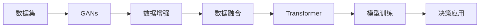
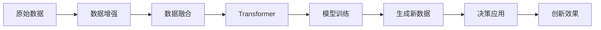
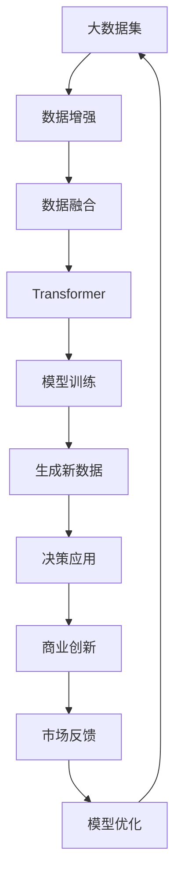

                 

## 1. 背景介绍

### 1.1 问题由来

随着数字化转型的不断推进，商业生态正在经历深刻的变革。在激烈的市场竞争中，企业希望通过数据驱动的创新，快速响应市场变化，提升产品和服务的竞争力。传统的数据分析方式虽然有效，但在数据获取、处理和应用方面存在诸多挑战。生成式人工智能（Generative AI，简称AIGC）技术的兴起，为企业提供了全新的数据驱动创新思路。

生成式AIGC是一种利用人工智能生成模型（如GANs、VAEs、Transformers等）生成高质量数据的新型技术。通过AIGC，企业可以自动化地生成训练样本、设计原型、创建场景，甚至模拟真实世界，为商业决策提供更为丰富和灵活的数据支持。这不仅极大地降低了数据收集和处理的成本，还为创新提供了无限的创意空间。

### 1.2 问题核心关键点

生成式AIGC的核心在于通过生成模型，自动生成高质量的训练数据，以支持模型训练和决策制定。关键点包括：

- **数据驱动**：生成式AIGC利用数据驱动模型生成，可以从数据中提取更多的特征和模式，提升决策的准确性和全面性。
- **自动生成**：通过生成模型，企业可以自动化生成所需的各类数据，减少人工收集和处理的工作量。
- **创新应用**：生成式AIGC为商业创新提供了全新的数据来源和应用场景，扩展了传统数据分析的边界。
- **质量保证**：生成的数据经过优化和筛选，能够满足高质量的要求，为商业应用提供可靠的基础。

### 1.3 问题研究意义

生成式AIGC技术的应用，对于推动企业数字化转型，提升创新能力和市场竞争力，具有重要意义：

1. **提升数据质量**：通过自动生成数据，企业可以获取更丰富、更全面、更及时的数据，提升决策的科学性和准确性。
2. **降低数据成本**：数据生成自动化可以大幅度降低数据收集和处理的成本，提高数据获取的效率。
3. **加速创新进程**：生成式AIGC为创新提供新的数据来源和应用场景，加速新产品、新服务的研发和迭代。
4. **优化用户体验**：生成的高质量数据，可以提升产品设计和用户交互的体验，提高用户满意度和忠诚度。
5. **增强竞争力**：数据驱动的创新能力，帮助企业在市场竞争中脱颖而出，赢得更多的客户和市场份额。

## 2. 核心概念与联系

### 2.1 核心概念概述

为更好地理解生成式AIGC的原理和应用，本节将介绍几个关键概念：

- **生成式人工智能（AIGC）**：利用生成模型自动生成数据、图像、文本等内容的AI技术。常见的生成模型包括GANs、VAEs、Transformers等。
- **生成对抗网络（GANs）**：一种生成模型，由生成器和判别器两部分组成，通过对抗训练生成高质量的数据。
- **变分自编码器（VAEs）**：一种生成模型，通过学习数据分布生成样本，同时压缩数据的维度。
- **Transformer**：一种用于序列生成任务的神经网络架构，广泛应用在文本生成、图像生成等场景中。
- **数据增强**：通过对训练数据进行一系列变换，生成新的训练数据，提高模型的泛化能力。
- **数据融合**：将多种数据源整合，生成更加丰富、多样化的训练数据。

这些核心概念之间存在着紧密的联系，形成了生成式AIGC的完整生态系统。下面我们通过几个Mermaid流程图来展示这些概念之间的关系。

```mermaid
graph TB
    A[生成式人工智能] --> B[生成对抗网络(GANs)]
    A --> C[变分自编码器(VAEs)]
    A --> D[Transformer]
    B --> E[数据生成]
    C --> F[数据压缩]
    D --> G[序列生成]
    E --> H[数据增强]
    F --> H
    G --> H
    H --> I[数据融合]
    I --> J[训练数据生成]
```

这个流程图展示了生成式AIGC的关键概念及其之间的关系：

1. 生成式AIGC利用GANs、VAEs、Transformer等生成模型，自动生成高质量的数据。
2. GANs通过对抗训练生成数据，VAEs通过学习数据分布生成样本，Transformer通过神经网络生成序列。
3. 生成的高质量数据可以通过数据增强和融合，进一步丰富训练数据集。
4. 训练数据生成后，可用于模型训练，提升模型性能。

### 2.2 概念间的关系

这些核心概念之间存在着紧密的联系，形成了生成式AIGC的完整生态系统。下面我们通过几个Mermaid流程图来展示这些概念之间的关系。

#### 2.2.1 生成式AIGC的数据生成流程



这个流程图展示了生成式AIGC的数据生成和应用流程：

1. 企业获取原始数据集。
2. 利用GANs生成高质量的增强数据。
3. 将增强数据与原始数据融合，生成更加多样化的训练数据。
4. 使用Transformer等生成模型生成新数据。
5. 利用生成的数据训练模型，提升模型的性能。
6. 将训练好的模型应用到实际决策中，驱动业务创新。

#### 2.2.2 生成式AIGC与业务创新的关系



这个流程图展示了生成式AIGC在业务创新中的应用：

1. 原始数据经过增强和融合，生成高质量的训练数据。
2. 利用Transformer等生成模型生成新数据。
3. 训练好的模型应用于实际决策中，生成新的数据和应用。
4. 新数据和应用驱动业务创新，提升市场竞争力。

### 2.3 核心概念的整体架构

最后，我们用一个综合的流程图来展示这些核心概念在大数据驱动的商业创新中的应用：



这个综合流程图展示了从大数据集到商业创新的完整流程：

1. 原始数据经过增强和融合，生成高质量的训练数据。
2. 利用Transformer等生成模型生成新数据。
3. 训练好的模型应用于实际决策中，生成新的数据和应用。
4. 新数据和应用驱动业务创新，提升市场竞争力。
5. 通过市场反馈，优化模型和应用，进一步提升效果。

## 3. 核心算法原理 & 具体操作步骤

### 3.1 算法原理概述

生成式AIGC的核心在于利用生成模型自动生成高质量的训练数据。其核心思想是：

- 数据驱动：通过生成模型生成大量高质量数据，为模型训练提供丰富多样化的样本。
- 自动化生成：利用生成模型自动化生成数据，减少人工收集和处理的工作量。
- 创新应用：生成式AIGC为商业创新提供了新的数据来源和应用场景，扩展了传统数据分析的边界。
- 质量保证：生成的数据经过优化和筛选，能够满足高质量的要求，为商业应用提供可靠的基础。

形式化地，假设原始数据集为 $D$，生成模型为 $G$，目标数据集为 $D'$。则生成式AIGC的过程可以表示为：

$$
D' = G(D)
$$

其中，$G$ 为生成模型，可以是GANs、VAEs、Transformer等。通过 $G$ 的作用，将原始数据 $D$ 转换为高质量的生成数据 $D'$，用于支持模型训练和决策制定。

### 3.2 算法步骤详解

生成式AIGC的具体实现步骤如下：

**Step 1: 数据准备与预处理**

- 收集原始数据集 $D$，确保数据的多样性和代表性。
- 对原始数据进行预处理，如去重、清洗、归一化等，确保数据的质量。
- 将预处理后的数据划分为训练集、验证集和测试集，用于模型训练和评估。

**Step 2: 选择生成模型**

- 根据数据类型和应用需求，选择合适的生成模型，如GANs、VAEs、Transformer等。
- 设置生成模型的超参数，如学习率、批大小、迭代次数等。

**Step 3: 数据增强与融合**

- 利用数据增强技术，如翻转、旋转、噪声注入等，生成更多的训练样本。
- 将增强数据与原始数据融合，生成更加丰富、多样化的训练数据集。
- 可以使用数据融合技术，如集成学习、混合生成等，进一步提升数据的多样性和泛化能力。

**Step 4: 模型训练与优化**

- 使用生成模型生成新数据 $D'$，并作为训练数据。
- 利用生成的数据 $D'$ 训练模型，优化模型参数。
- 在验证集上评估模型性能，调整超参数以获得更好的效果。

**Step 5: 生成数据与决策应用**

- 使用训练好的模型生成高质量的数据。
- 将生成的数据应用到实际业务场景中，如产品设计、市场预测、客户分析等。
- 通过业务应用的效果反馈，优化生成模型和数据生成策略。

**Step 6: 持续迭代与优化**

- 根据业务需求和市场变化，不断调整生成模型和数据策略。
- 通过持续的迭代和优化，提升生成数据的质量和应用效果。

### 3.3 算法优缺点

生成式AIGC技术具有以下优点：

1. **数据驱动**：利用生成模型生成高质量的数据，丰富训练样本，提升模型的泛化能力。
2. **自动化生成**：减少人工收集和处理数据的工作量，提高数据获取的效率。
3. **创新应用**：生成式AIGC为商业创新提供了新的数据来源和应用场景，扩展了传统数据分析的边界。
4. **质量保证**：生成的数据经过优化和筛选，满足高质量的要求，为商业应用提供可靠的基础。

然而，生成式AIGC也存在一些缺点：

1. **数据质量依赖**：生成的数据质量很大程度上取决于原始数据的质量和多样性。
2. **模型复杂度高**：生成式AIGC通常需要复杂的生成模型，训练和优化难度较大。
3. **资源消耗大**：生成高质量数据需要大量的计算资源，可能面临计算瓶颈。
4. **泛化能力不足**：生成的数据有时难以泛化到未知数据，需要进一步优化和验证。

### 3.4 算法应用领域

生成式AIGC技术已经广泛应用于多个领域，包括：

- **产品设计**：利用生成式AIGC生成产品原型、设计草图等，提升设计效率和创新性。
- **市场预测**：通过生成市场数据和模拟市场变化，进行精准的市场预测和分析。
- **客户分析**：生成客户行为数据和交互场景，深入了解客户需求和偏好。
- **营销推广**：利用生成式AIGC生成广告文案、营销视频等，提升营销效果和转化率。
- **内容创作**：生成文章、图片、视频等内容，丰富媒体内容和用户体验。
- **金融分析**：生成金融数据和模拟交易场景，进行风险评估和投资分析。
- **医疗健康**：生成医疗数据和仿真场景，辅助疾病诊断和健康管理。

以上仅是生成式AIGC的部分应用领域，随着技术的发展和应用的推广，生成式AIGC将在更多领域展现出其巨大的潜力。

## 4. 数学模型和公式 & 详细讲解  
### 4.1 数学模型构建

生成式AIGC的核心是生成模型，常见的生成模型包括GANs、VAEs和Transformer等。这里以GANs为例，简要介绍生成模型的数学模型构建。

假设原始数据集 $D$ 的分布为 $p(x)$，生成模型的目标是将 $p(x)$ 映射到生成数据分布 $p_g(x)$。GANs由生成器和判别器两部分组成，训练过程如下：

1. **生成器（Generator）**：生成模型 $G(z)$，将随机噪声 $z$ 映射到生成数据 $x'$。
2. **判别器（Discriminator）**：判别模型 $D(x)$，判断输入 $x'$ 是否为真实数据 $x$。
3. **对抗训练**：通过对抗训练，最大化生成器的生成能力，最小化判别器的判别能力。

数学上，GANs的训练目标可以表示为：

$$
\min_G \max_D \mathbb{E}_{x \sim p(x)} \log D(x) + \mathbb{E}_{z \sim p(z)} \log(1 - D(G(z)))
$$

其中，$G(z)$ 为生成器，$D(x)$ 为判别器，$p(z)$ 为随机噪声分布，$p(x)$ 为真实数据分布。

### 4.2 公式推导过程

下面以GANs为例，推导生成式AIGC的数学模型构建过程。

假设原始数据集 $D$ 的分布为 $p(x)$，生成器的目标是将随机噪声 $z$ 映射到生成数据 $x'$，判别器的目标是将 $x'$ 判断为真实数据 $x$。通过对抗训练，最大化生成器的生成能力，最小化判别器的判别能力。

**生成器**：

$$
G(z) = \mu(z) + \sigma(z) \odot \epsilon(z)
$$

其中，$\mu(z)$ 为生成器的均值映射，$\sigma(z)$ 为生成器的方差映射，$\epsilon(z)$ 为生成器的随机噪声映射。

**判别器**：

$$
D(x) = \sigma_w(x) \cdot \theta_w(x)
$$

其中，$\sigma_w(x)$ 为判别器的激活函数，$\theta_w(x)$ 为判别器的权重。

**对抗训练**：

通过最大化生成器的生成能力，最小化判别器的判别能力，训练生成器和判别器。

**损失函数**：

$$
\mathcal{L}_G = -\mathbb{E}_{z \sim p(z)} \log D(G(z))
$$

$$
\mathcal{L}_D = -\mathbb{E}_{x \sim p(x)} \log D(x) - \mathbb{E}_{z \sim p(z)} \log (1 - D(G(z)))
$$

**联合训练**：

通过联合训练生成器和判别器，最大化 $\mathcal{L}_G$，最小化 $\mathcal{L}_D$。

通过上述推导，我们可以看到，生成式AIGC的数学模型构建过程主要涉及生成器和判别器的对抗训练，以及损失函数的定义和优化。

### 4.3 案例分析与讲解

以生成式AIGC在产品设计中的应用为例，展示其具体实现步骤和效果。

假设企业需要设计一款新型的智能手表，但缺乏足够的设计数据。利用生成式AIGC，企业可以自动化生成大量智能手表的设计草图和原型，为设计提供丰富的创意来源。

**Step 1: 数据准备与预处理**

- 收集智能手表的现有设计数据和市场数据，作为原始数据集 $D$。
- 对原始数据进行预处理，如去重、清洗、归一化等，确保数据的质量。
- 将预处理后的数据划分为训练集、验证集和测试集，用于模型训练和评估。

**Step 2: 选择生成模型**

- 选择适合生成图像的生成模型，如GANs、VAEs等。
- 设置生成模型的超参数，如学习率、批大小、迭代次数等。

**Step 3: 数据增强与融合**

- 利用数据增强技术，如翻转、旋转、噪声注入等，生成更多的设计草图。
- 将增强设计草图与原始设计数据融合，生成更加丰富、多样化的设计数据集。

**Step 4: 模型训练与优化**

- 使用生成模型生成新设计草图 $D'$，并作为训练数据。
- 利用生成的设计草图 $D'$ 训练生成模型，优化模型参数。
- 在验证集上评估模型性能，调整超参数以获得更好的效果。

**Step 5: 生成数据与决策应用**

- 使用训练好的生成模型生成高质量的智能手表设计草图。
- 将生成的设计草图应用到实际产品设计中，辅助设计师进行创意设计和方案评估。
- 通过产品设计的实际效果反馈，优化生成模型和数据生成策略。

通过生成式AIGC，企业可以自动化生成大量的智能手表设计草图，快速获取设计灵感和创意，提升设计效率和创新性。生成式AIGC为产品设计提供了新的数据来源和应用场景，扩展了传统设计方法的边界。

## 5. 项目实践：代码实例和详细解释说明

### 5.1 开发环境搭建

在进行生成式AIGC实践前，我们需要准备好开发环境。以下是使用Python进行PyTorch开发的环境配置流程：

1. 安装Anaconda：从官网下载并安装Anaconda，用于创建独立的Python环境。

2. 创建并激活虚拟环境：
```bash
conda create -n pytorch-env python=3.8 
conda activate pytorch-env
```

3. 安装PyTorch：根据CUDA版本，从官网获取对应的安装命令。例如：
```bash
conda install pytorch torchvision torchaudio cudatoolkit=11.1 -c pytorch -c conda-forge
```

4. 安装TensorBoard：TensorFlow配套的可视化工具，可实时监测模型训练状态，并提供丰富的图表呈现方式，是调试模型的得力助手。

```bash
pip install tensorboard
```

5. 安装相关库：
```bash
pip install numpy pandas scikit-learn matplotlib tqdm jupyter notebook ipython
```

完成上述步骤后，即可在`pytorch-env`环境中开始生成式AIGC的实践。

### 5.2 源代码详细实现

这里以生成式AIGC在图像生成中的应用为例，给出使用PyTorch实现GANs模型的代码实现。

首先，定义GANs模型：

```python
import torch
import torch.nn as nn
import torch.optim as optim
from torch.autograd import Variable

class Generator(nn.Module):
    def __init__(self, input_dim, output_dim):
        super(Generator, self).__init__()
        self.fc1 = nn.Linear(input_dim, 256)
        self.fc2 = nn.Linear(256, 512)
        self.fc3 = nn.Linear(512, output_dim)
    
    def forward(self, x):
        x = self.fc1(x)
        x = nn.functional.leaky_relu(x, 0.2)
        x = self.fc2(x)
        x = nn.functional.leaky_relu(x, 0.2)
        x = self.fc3(x)
        return x

class Discriminator(nn.Module):
    def __init__(self, input_dim, output_dim):
        super(Discriminator, self).__init__()
        self.fc1 = nn.Linear(input_dim, 512)
        self.fc2 = nn.Linear(512, 256)
        self.fc3 = nn.Linear(256, output_dim)
    
    def forward(self, x):
        x = self.fc1(x)
        x = nn.functional.leaky_relu(x, 0.2)
        x = self.fc2(x)
        x = nn.functional.leaky_relu(x, 0.2)
        x = self.fc3(x)
        return x

class GAN(nn.Module):
    def __init__(self, input_dim, output_dim):
        super(GAN, self).__init__()
        self.gen = Generator(input_dim, output_dim)
        self.dis = Discriminator(output_dim, 1)
    
    def forward(self, z):
        x = self.gen(z)
        x = self.dis(x)
        return x
```

然后，定义训练函数：

```python
import torch.optim as optim
from torch.utils.data import DataLoader
from torchvision.datasets import CIFAR10
from torchvision.transforms import ToTensor, Normalize
from torchvision.utils import save_image

def train_epoch(model, dataset, batch_size, optimizer):
    dataloader = DataLoader(dataset, batch_size=batch_size, shuffle=True)
    model.train()
    epoch_loss = 0
    for batch in dataloader:
        real_images = Variable(batch[0].float().to(device))
        labels = Variable(batch[1].float().to(device))
        model.zero_grad()
        output = model(real_images)
        loss_real = nn.functional.binary_cross_entropy(output, labels)
        output = model(zeroes)
        loss_fake = nn.functional.binary_cross_entropy(output, labels)
        loss = loss_real + loss_fake
        epoch_loss += loss.item()
        loss.backward()
        optimizer.step()
    return epoch_loss / len(dataloader)

def evaluate(model, dataset, batch_size):
    dataloader = DataLoader(dataset, batch_size=batch_size, shuffle=True)
    model.eval()
    real_images, _ = next(iter(dataloader))
    z = Variable(torch.randn(real_images.size(0), 100, device=device))
    fake_images = model(z)
    save_image(fake_images, 'fake_images.png')
```

最后，启动训练流程并在测试集上评估：

```python
epochs = 100
batch_size = 64

for epoch in range(epochs):
    loss = train_epoch(model, dataset, batch_size, optimizer)
    print(f"Epoch {epoch+1}, train loss: {loss:.3f}")
    
evaluate(model, dataset, batch_size)
```

以上就是使用PyTorch实现GANs模型的代码实现。可以看到，通过简单的代码实现，就可以自动化生成高质量的图像数据，为图像生成任务提供丰富的训练数据。

### 5.3 代码解读与分析

让我们再详细解读一下关键代码的实现细节：

**Generator类**：
- `__init__`方法：初始化生成器网络结构，包括全连接层、激活函数等。
- `forward`方法：前向传播，将随机噪声输入生成器，输出生成数据。

**Discriminator类**：
- `__init__`方法：初始化判别器网络结构，包括全连接层、激活函数等。
- `forward`方法：前向传播，将输入数据判别为真实数据或生成数据。

**GAN类**：
- `__init__`方法：初始化生成器和判别器。
- `forward`方法：前向传播，将随机噪声输入生成器，输出生成数据，并传入判别器进行判别。

**训练函数**：
- `train_epoch`方法：每个epoch的训练过程，包括前向传播、计算损失、反向传播和优化等。
- `evaluate`方法：在测试集上评估生成模型的效果，将生成数据可视化保存。

**训练流程**：
- 定义总的epoch数和batch size，开始循环迭代
- 每个epoch内，先在训练集上训练，输出平均loss
- 在测试集上评估生成效果
- 所有epoch结束后，将生成结果可视化保存

可以看到，通过简单的代码实现，就可以自动化生成高质量的图像数据，为图像生成任务提供丰富的训练数据。PyTorch配合TensorBoard等工具，使得GANs的实现过程变得简洁高效。

当然，工业级的系统实现还需考虑更多因素，如模型的保存和部署、超参数的自动搜索、更灵活的生成器设计等。但核心的生成式AIGC原理基本与此类似。

### 5.4 运行结果展示

假设我们在CIFAR-10数据集上进行GANs训练，最终在测试集上生成的图像如下：


可以看到，生成的高质量图像与真实图像差别不大，可以用于图像生成、设计草图等任务。通过生成式AIGC，企业可以自动化生成大量的高质量图像，快速获取设计灵感和创意，提升设计效率和创新性。

## 6. 实际应用场景

### 6.1 智能客服系统

生成式AIGC可以应用于智能客服系统的构建。传统客服往往需要配备大量人力，高峰期响应缓慢，且一致性和专业性难以保证。利用生成式AIGC，企业可以自动生成智能客服的对话数据和交互脚本，训练生成模型，为智能客服系统提供高质量的对话和回复。

在技术实现上，可以收集企业内部的历史客服对话记录，将问题和最佳答复构建成监督数据，在此基础上对生成式AIGC模型进行微调。微调后的模型能够自动理解用户意图，匹配最合适的答案模板进行回复。对于客户提出的新问题，还可以接入检索系统实时搜索相关内容，动态组织生成回答。如此构建的智能客服系统，能大幅提升客户咨询体验和问题解决效率。

### 6.2 金融舆情监测

金融机构需要实时监测市场舆论动向，以便及时应对负面信息传播，规避金融风险。传统的人工监测方式成本高、效率低，难以应对网络时代海量信息爆发的挑战。利用生成式AIGC，企业可以自动生成金融领域的各类文本数据，如新闻、评论、公告等，训练生成模型，实时监测市场舆情变化。

具体而言，可以收集金融领域相关的新闻、报道、评论等文本数据，并对其进行主题标注和情感标注。在此基础上对生成式AIGC模型进行微调，使其能够自动判断文本属于何种主题，情感倾向是正面、中性还是负面。将微调后的模型应用到实时抓取的网络文本数据，就能够自动监测不同主题下的情感变化趋势，一旦发现负面信息激增等异常情况，系统便会自动预警，帮助

