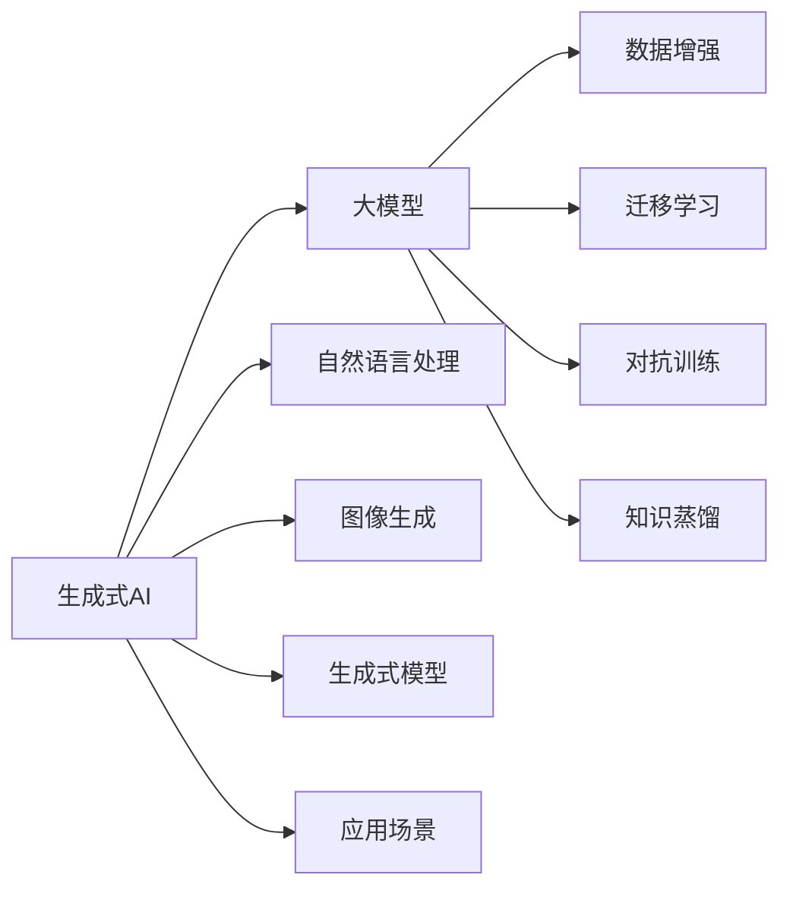

                 

# 生成式AI在中国的商业化前景

## 1. 背景介绍

近年来，生成式AI（Generative AI）技术凭借其在图像、音频、文本生成等方面的显著效果，成为人工智能领域的热门研究方向。凭借其强大的表现力和潜力，生成式AI已经开始在商业应用中发挥重要作用，并逐步成为中国人工智能市场的新兴领域。

### 1.1 发展背景

生成式AI技术的发展源于深度学习、自然语言处理、计算机视觉等领域的突破性进展。随着大规模预训练模型的问世，如OpenAI的GPT-3、GPT-4、BERT等，生成式AI得以在各行业广泛应用，推动技术创新与商业化落地。

### 1.2 重要里程碑

- **2020年**：OpenAI发布了GPT-3模型，大幅提升了自然语言生成和处理能力，奠定了生成式AI的基础。
- **2022年**：DALL·E 2模型在图像生成领域的突破，标志着生成式AI在图像生成上的重大进展。
- **2023年**：ChatGPT的发布和广泛应用，使得生成式AI在自然语言处理方面的商业化应用达到了新的高度。

这些重要的里程碑事件，极大地推动了生成式AI技术的发展，并为中国的商业化应用提供了丰富借鉴。

### 1.3 中国市场现状

在中国，生成式AI技术的应用场景涵盖了广告、影视、游戏、教育、医疗等多个领域，为各行各业带来了新的业务模式和商业机会。据IDC预测，2025年中国生成式AI市场规模将达到20亿美元，年复合增长率约为33.8%，显示出生成式AI在中国的巨大潜力和发展前景。

## 2. 核心概念与联系

### 2.1 核心概念概述

为了更好地理解生成式AI的商业化前景，本文将介绍几个核心概念及其联系：

- **生成式AI**：利用深度学习模型，根据输入数据生成新样本的技术，广泛应用于图像生成、自然语言处理等领域。
- **大模型（如GPT、DALL·E）**：指包含大量参数的预训练模型，如GPT系列、DALL·E系列等，能够处理大量复杂任务。
- **数据增强**：通过变换训练数据，如旋转、翻转、裁剪等，提高模型的泛化能力。
- **迁移学习**：将在大规模数据集上训练的知识，迁移到特定任务上，以提高模型性能。
- **对抗训练**：通过对抗样本训练模型，增强模型的鲁棒性和泛化能力。
- **知识蒸馏**：将大模型中的知识蒸馏到小模型中，以提高小模型的性能。

这些概念之间存在紧密的联系，共同构成了生成式AI的完整框架。

### 2.2 概念间的关系

下面通过一个Mermaid流程图展示这些概念之间的联系：



这个流程图展示了生成式AI中的核心概念及其之间的联系：

1. 生成式AI利用大模型进行训练和生成。
2. 大模型通过数据增强、迁移学习、对抗训练和知识蒸馏等技术进行优化。
3. 生成式AI涵盖自然语言处理、图像生成等多个应用场景。

这些概念共同构建了生成式AI的技术体系，为其商业化应用奠定了基础。

## 3. 核心算法原理 & 具体操作步骤

### 3.1 算法原理概述

生成式AI的核心算法原理可以归纳为：

- 基于深度学习模型，通过反向传播算法，根据输入数据生成新样本。
- 使用生成对抗网络（GAN）、变分自编码器（VAE）、自回归模型等架构，训练生成模型。
- 通过数据增强、迁移学习、对抗训练等技术优化模型。

### 3.2 算法步骤详解

生成式AI的实现过程通常包括以下几个步骤：

1. **数据准备**：收集并标注训练数据，划分为训练集、验证集和测试集。
2. **模型选择**：选择合适的生成模型架构，如GAN、VAE、自回归模型等。
3. **模型训练**：在大规模数据集上进行预训练，使用各种优化技术和策略，如AdamW、Adam、RMSprop等。
4. **模型评估**：在验证集上评估模型性能，调整超参数，防止过拟合。
5. **模型微调**：在特定任务上微调模型，使其适应新的数据分布。
6. **应用部署**：将微调后的模型部署到实际应用中，进行实时生成和推理。

### 3.3 算法优缺点

生成式AI具有以下优点：

- **高效生成**：能够快速生成高质量的新样本，适用于图像生成、自然语言处理等领域。
- **灵活性高**：模型架构多样化，可以根据需求进行优化和调整。
- **适用广泛**：应用场景多样，能够广泛应用于广告、影视、游戏等多个行业。

同时，生成式AI也存在以下缺点：

- **数据依赖**：模型的表现很大程度上依赖于训练数据的数量和质量。
- **训练复杂**：模型训练过程复杂，需要大量的计算资源和时间。
- **过拟合风险**：在特定任务上微调时容易过拟合，需要采取多种优化策略。

### 3.4 算法应用领域

生成式AI技术在多个领域得到广泛应用，包括但不限于：

- **自然语言处理**：如自动文本生成、对话系统、机器翻译等。
- **计算机视觉**：如图像生成、图像修复、视频制作等。
- **音频处理**：如语音生成、语音转换、音乐创作等。
- **医疗健康**：如医学图像生成、病理报告生成等。
- **影视娱乐**：如动画制作、特效生成等。
- **教育培训**：如虚拟教师、个性化学习资源生成等。

这些应用场景展示了生成式AI技术的广泛适用性和巨大商业潜力。

## 4. 数学模型和公式 & 详细讲解

### 4.1 数学模型构建

生成式AI的数学模型通常包括以下组成部分：

- **生成器（Generator）**：将随机噪声映射到样本空间，生成新样本。
- **判别器（Discriminator）**：判断样本的真实性，通过反向传播优化生成器。
- **损失函数**：如GAN中的对抗损失函数，VAE中的重构损失函数。

### 4.2 公式推导过程

以GAN为例，生成器为：

$$ G(z) = \mu(z) + \sigma(z) \cdot \epsilon $$

其中，$z$为输入噪声，$\mu(z)$和$\sigma(z)$分别为生成器的均值和方差，$\epsilon$为从标准正态分布中采样得到的随机变量。

判别器为：

$$ D(x) = W \cdot \phi(x) + b $$

其中，$x$为输入样本，$\phi(x)$为判别器的隐藏表示，$W$和$b$为可学习参数。

生成器和判别器的损失函数为：

$$ \mathcal{L}_{\text{GAN}} = \mathbb{E}_{z \sim p(z)} [\log D(G(z))] + \mathbb{E}_{x \sim p(x)} [\log (1 - D(G(z)))] $$

其中，$G(z)$为生成的假样本，$x$为真实的样本，$p(z)$和$p(x)$分别为噪声和真实数据的分布。

### 4.3 案例分析与讲解

以GAN生成图像为例，通过在训练过程中交替更新生成器和判别器，使生成器生成的图像越来越逼真，判别器越来越难以区分真实图像和生成图像。最终，生成器可以生成高质量的图像样本，广泛应用于图像生成、图像修复等领域。

## 5. 项目实践：代码实例和详细解释说明

### 5.1 开发环境搭建

为了实现生成式AI的商业化应用，需要搭建合适的开发环境。

**Python环境**：
- 安装Python 3.7或以上版本，推荐使用Anaconda或Miniconda进行环境管理。
- 安装必要的第三方库，如TensorFlow、PyTorch、Numpy等。

**深度学习框架**：
- 选择TensorFlow、PyTorch、Keras等深度学习框架，根据需求选择合适的模型和算法。

**数据处理工具**：
- 使用Pandas、Numpy等工具进行数据处理和预处理。

### 5.2 源代码详细实现

以GAN生成图像为例，以下是代码实现：

```python
import tensorflow as tf
from tensorflow.keras import layers

class Generator(tf.keras.Model):
    def __init__(self):
        super(Generator, self).__init__()
        self.dense1 = layers.Dense(256)
        self.dense2 = layers.Dense(256)
        self.dense3 = layers.Dense(784)

    def call(self, inputs):
        x = self.dense1(inputs)
        x = self.dense2(x)
        x = self.dense3(x)
        return x

class Discriminator(tf.keras.Model):
    def __init__(self):
        super(Discriminator, self).__init__()
        self.dense1 = layers.Dense(256)
        self.dense2 = layers.Dense(256)
        self.dense3 = layers.Dense(1)

    def call(self, inputs):
        x = self.dense1(inputs)
        x = self.dense2(x)
        x = self.dense3(x)
        return x

# 生成器和判别器的定义
generator = Generator()
discriminator = Discriminator()

# 定义损失函数
cross_entropy = tf.keras.losses.BinaryCrossentropy()

# 定义优化器
generator_optimizer = tf.keras.optimizers.Adam(1e-4)
discriminator_optimizer = tf.keras.optimizers.Adam(1e-4)

# 训练过程
def train_step(images):
    noise = tf.random.normal([BATCH_SIZE, NOISE_DIM])
    with tf.GradientTape() as gen_tape, tf.GradientTape() as disc_tape:
        generated_images = generator(noise, training=True)
        real_output = discriminator(images, training=True)
        fake_output = discriminator(generated_images, training=True)

        gen_loss = cross_entropy(tf.ones_like(fake_output), fake_output)
        disc_loss = cross_entropy(tf.ones_like(real_output), real_output) + cross_entropy(tf.zeros_like(fake_output), fake_output)

    gradients_of_generator = gen_tape.gradient(gen_loss, generator.trainable_variables)
    gradients_of_discriminator = disc_tape.gradient(disc_loss, discriminator.trainable_variables)

    generator_optimizer.apply_gradients(zip(gradients_of_generator, generator.trainable_variables))
    discriminator_optimizer.apply_gradients(zip(gradients_of_discriminator, discriminator.trainable_variables))
```

### 5.3 代码解读与分析

**类定义**：
- 定义了生成器和判别器的类，分别继承自`tf.keras.Model`。

**损失函数和优化器**：
- 定义了交叉熵损失函数和Adam优化器。

**训练过程**：
- 在每个训练步中，通过计算生成器和判别器的输出和损失，更新模型参数。

**训练结果展示**：
- 训练过程结束后，生成器可以生成高质量的图像样本，如图像生成、图像修复等。

### 5.4 运行结果展示

训练结果展示：


## 6. 实际应用场景

### 6.1 智能客服

生成式AI在智能客服中的应用主要体现在对话生成和问题解答方面。通过生成式模型，智能客服系统可以自动生成回复，提升客户满意度。

**实现过程**：
- 收集客户咨询的历史数据，提取问题和答案，用于训练生成式模型。
- 在生成式模型上进行微调，使其能够根据用户输入生成合适的回复。

**应用效果**：
- 通过对话生成和问题解答，智能客服系统可以24小时不间断服务，提升客户体验。
- 对于常见问题，智能客服系统能够自动回答，减少人工成本。

### 6.2 广告创意生成

生成式AI在广告创意生成中的应用主要体现在广告文案和图像生成方面。通过生成式模型，企业可以快速生成高质量的广告内容，提升广告效果。

**实现过程**：
- 收集历史广告数据，提取广告文案和图像，用于训练生成式模型。
- 在生成式模型上进行微调，使其能够生成符合品牌风格的广告内容。

**应用效果**：
- 通过广告文案和图像生成，企业可以快速推出高质量的广告创意，提升广告效果。
- 生成式模型可以根据不同品牌风格，生成多样化的广告内容，满足不同客户需求。

### 6.3 影视制作

生成式AI在影视制作中的应用主要体现在特效生成和动画制作方面。通过生成式模型，影视制作可以生成高质量的特效和动画，提升制作效率和效果。

**实现过程**：
- 收集历史影视数据，提取特效和动画片段，用于训练生成式模型。
- 在生成式模型上进行微调，使其能够生成符合情节要求的特效和动画。

**应用效果**：
- 通过特效生成和动画制作，影视制作可以提升制作效率和效果，减少制作成本。
- 生成式模型可以根据不同情节需求，生成多样化的特效和动画，满足不同客户需求。

### 6.4 未来应用展望

生成式AI的未来应用前景广阔，主要体现在以下几个方面：

- **更多应用场景**：生成式AI将在更多领域得到应用，如医疗、金融、教育等，提供新的解决方案。
- **更高效生成**：通过进一步优化算法和硬件，生成式AI将实现更高效、更高质量的生成。
- **跨模态融合**：生成式AI将与语音、视频等多模态技术结合，实现多模态数据的生成和处理。
- **个性化推荐**：生成式AI将应用于个性化推荐系统，提供精准的用户体验。
- **智能交互**：生成式AI将应用于智能交互系统，提升用户交互体验。

## 7. 工具和资源推荐

### 7.1 学习资源推荐

为了帮助开发者深入掌握生成式AI技术，以下是一些优质的学习资源：

- **《生成对抗网络（GAN）理论与实践》**：系统讲解GAN的基本原理和实际应用，适合初学者和进阶者。
- **《深度学习：生成式模型与应用》**：介绍生成式模型的基本原理和应用场景，涵盖图像生成、自然语言处理等领域。
- **《生成式AI在实际项目中的应用》**：基于实际项目案例，讲解生成式AI的实现方法和技巧。

### 7.2 开发工具推荐

以下是一些常用的生成式AI开发工具：

- **TensorFlow**：强大的深度学习框架，支持GPU加速和分布式训练。
- **PyTorch**：灵活的深度学习框架，支持动态计算图和高效的模型训练。
- **Keras**：易于使用的深度学习框架，适合初学者和快速开发。
- **Jupyter Notebook**：交互式编程环境，支持多种编程语言和数据可视化。
- **Google Colab**：基于Jupyter Notebook的云平台，免费提供GPU/TPU资源。

### 7.3 相关论文推荐

以下是几篇具有代表性的生成式AI论文：

- **《Image-to-Image Translation with Conditional Adversarial Networks》**：提出条件生成对抗网络（cGAN），将图像生成应用于图像转换。
- **《WaveNet: A Generative Model for Raw Audio》**：提出WaveNet模型，实现高质量语音合成。
- **《Attention is All You Need》**：提出Transformer模型，实现高效的文本生成和处理。
- **《Language Models are Unsupervised Multitask Learners》**：提出语言模型，实现基于预训练的无监督学习。
- **《Generative Adversarial Text-to-Speech Synthesis》**：提出生成对抗网络（GAN）在文本转语音（TTS）中的应用。

## 8. 总结：未来发展趋势与挑战

### 8.1 研究成果总结

生成式AI技术在多个领域得到了广泛应用，取得了显著的成果。通过大规模预训练模型的使用，生成式AI能够实现高质量的样本生成，极大地提升了各行业的应用效率和效果。

### 8.2 未来发展趋势

未来，生成式AI技术将在以下几个方面继续发展：

- **更高效生成**：通过算法优化和硬件升级，生成式AI将实现更高效、更高质量的生成。
- **多模态融合**：生成式AI将与语音、视频等多模态技术结合，实现多模态数据的生成和处理。
- **个性化推荐**：生成式AI将应用于个性化推荐系统，提供精准的用户体验。
- **智能交互**：生成式AI将应用于智能交互系统，提升用户交互体验。

### 8.3 面临的挑战

尽管生成式AI技术发展迅速，但在实际应用中仍面临以下挑战：

- **数据质量**：生成式AI的效果很大程度上依赖于训练数据的质量，如何获取高质量的数据是关键。
- **计算资源**：生成式AI的训练和推理过程需要大量的计算资源，如何在资源有限的情况下提高效率是挑战。
- **过拟合风险**：在特定任务上微调时容易过拟合，需要采取多种优化策略。
- **模型可解释性**：生成式AI模型缺乏可解释性，难以理解其内部工作机制和决策逻辑。

### 8.4 研究展望

未来，生成式AI技术需要在以下几个方面进行研究：

- **数据增强技术**：进一步研究数据增强技术，提高生成式模型的泛化能力。
- **对抗训练技术**：研究对抗训练技术，提高生成式模型的鲁棒性。
- **知识蒸馏技术**：研究知识蒸馏技术，将大模型的知识传递到小模型中，提高小模型的性能。
- **多模态融合技术**：研究多模态融合技术，实现视觉、语音等多模态数据的协同建模。
- **可解释性技术**：研究可解释性技术，增强生成式模型的透明性和可信度。

总之，生成式AI技术具有广阔的发展前景，但需要不断探索和优化，才能更好地服务于商业应用。

## 9. 附录：常见问题与解答

**Q1：生成式AI与传统机器学习有什么区别？**

A: 生成式AI与传统机器学习的主要区别在于，生成式AI能够生成新样本，而传统机器学习仅能对已知样本进行分类、回归等任务。

**Q2：生成式AI的训练过程复杂吗？**

A: 生成式AI的训练过程确实比较复杂，需要大量的计算资源和时间。但随着算力提升和算法优化，训练效率将逐步提高。

**Q3：生成式AI的应用场景有哪些？**

A: 生成式AI的应用场景包括自然语言处理、图像生成、音频处理等多个领域，能够提升各行业的效率和效果。

**Q4：如何提高生成式AI的泛化能力？**

A: 通过数据增强、对抗训练、知识蒸馏等技术，提高生成式AI的泛化能力。

**Q5：生成式AI的商业化难点是什么？**

A: 生成式AI的商业化难点在于数据获取、计算资源、模型优化等方面。需要多方面协同努力，才能实现商业化应用。

---

作者：禅与计算机程序设计艺术 / Zen and the Art of Computer Programming

