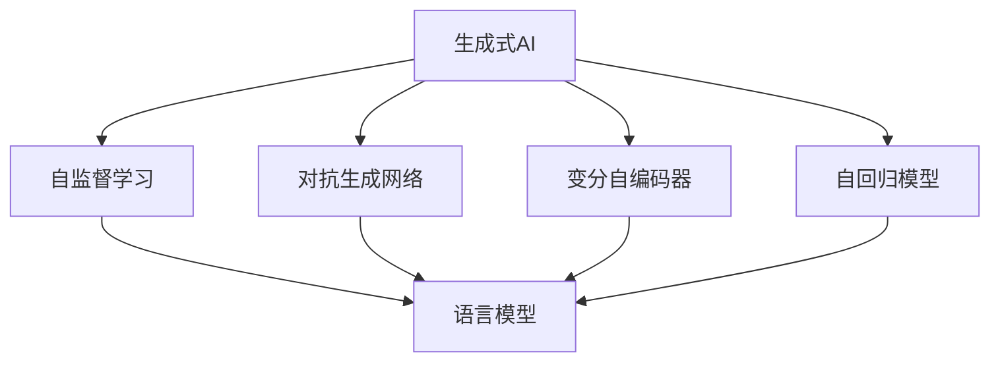
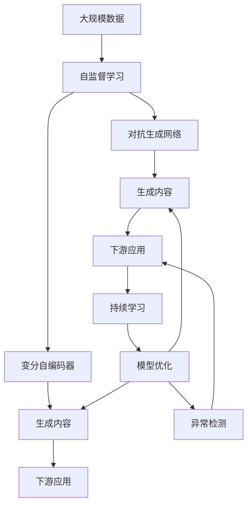

                 

# 生成式AI的未来市场趋势

## 1. 背景介绍

### 1.1 问题由来

生成式AI，作为人工智能领域的新兴方向，近年来受到越来越多的关注。从早期的文本生成、图像生成，到现在的音乐生成、视频生成等，生成式AI正在逐步拓宽其在各个领域的深度和广度。这些技术的突破，得益于深度学习算法的发展和硬件计算能力的提升，使得生成式AI在生成内容的自然度、多样性和创新性方面均取得了显著进步。

然而，生成式AI技术的发展也面临一些挑战。数据偏见、模型可解释性、内容真实性等问题一直困扰着AI研究者和应用开发者。同时，生成式AI的市场前景广阔，但实际应用场景与预期效果还存在一定差距，急需进一步提升技术成熟度与可靠性。

### 1.2 问题核心关键点

生成式AI的核心问题包括以下几点：

- **数据偏见**：生成式AI模型训练时，所使用的数据集往往带有偏见，导致模型生成内容有偏差，甚至包含歧视、有害信息等。
- **模型可解释性**：生成式AI模型是一个黑盒系统，其决策过程难以理解和解释，难以应用于医疗、金融等高风险领域。
- **内容真实性**：生成式AI模型生成的内容真实性难以保证，可能导致虚假信息传播，影响社会秩序。

这些问题的存在，限制了生成式AI技术的应用范围和安全性。但与此同时，这些问题也成为了未来研究的重要方向，有望推动生成式AI技术的进一步发展。

### 1.3 问题研究意义

解决上述问题，不仅可以提升生成式AI的可靠性和安全性，还能拓展其应用场景，推动相关产业的数字化转型。具体意义包括：

- **提高模型可靠性**：通过改进数据偏见、增强模型可解释性，提高生成式AI的可靠性，降低应用风险。
- **拓展应用场景**：提升生成内容的真实性和多样性，拓展生成式AI在医疗、金融、教育等领域的广泛应用。
- **增强用户体验**：生成式AI的应用场景更加丰富，可以为用户提供更加自然、有趣的内容，提升用户体验。
- **促进经济增长**：生成式AI在影视制作、广告创意、电商推荐等领域的应用，有助于推动相关行业发展，创造新的经济增长点。

## 2. 核心概念与联系

### 2.1 核心概念概述

为了更好地理解生成式AI的未来市场趋势，本节将介绍几个关键概念及其之间的关系。

- **生成式AI**：使用深度学习模型，从数据中学习生成新数据或生成式任务，如文本生成、图像生成、音乐生成等。
- **自监督学习**：使用未标注数据，通过自我监督的方式进行模型训练，如语言模型的自回归预测、图像中的自对比任务等。
- **对抗生成网络(GAN)**：一种生成式模型，通过对抗训练的方式提升生成内容的质量和多样性。
- **变分自编码器(VAE)**：一种生成模型，通过优化变分分布，生成新数据。
- **自回归模型(如LSTM、GRU)**：通过时间序列数据自回归生成新数据，如文本生成中的循环神经网络。

这些概念通过深度学习、统计学等方法，在生成式AI中扮演了重要的角色，互相交织，形成了一个完整的生成式AI生态系统。

### 2.2 概念间的关系

这些核心概念之间的关系可以通过以下Mermaid流程图来展示：



这个流程图展示了生成式AI的主要组成部分及其关系：

1. 生成式AI通过自监督学习、对抗生成网络、变分自编码器和自回归模型等技术，实现数据生成任务。
2. 语言模型作为自监督学习的代表，在生成式AI中发挥了重要作用。
3. 对抗生成网络和变分自编码器通过对抗训练和优化变分分布，提升了生成内容的真实性和多样性。
4. 自回归模型通过时间序列数据自回归生成新数据，在文本生成、语音生成等领域有广泛应用。

这些概念共同构成了生成式AI的技术框架，为其未来的发展奠定了坚实的基础。

### 2.3 核心概念的整体架构

最后，我们用一个综合的流程图来展示这些核心概念在大规模数据生成任务中的整体架构：



这个综合流程图展示了从数据生成到下游应用的全过程：

1. 大规模数据通过自监督学习获得初步的生成模型。
2. 对抗生成网络和变分自编码器对初步生成的内容进行优化，提升内容的真实性和多样性。
3. 生成的内容在特定下游应用中进行测试和验证，通过持续学习不断优化模型。
4. 异常检测系统对生成内容进行监控，防止生成有害、虚假的信息。

通过这些流程图，我们可以更清晰地理解生成式AI的核心概念及其相互关系，为后续深入讨论生成式AI的未来市场趋势奠定基础。

## 3. 核心算法原理 & 具体操作步骤

### 3.1 算法原理概述

生成式AI的核心算法原理包括自监督学习、对抗生成网络、变分自编码器等。这里以对抗生成网络为例，介绍生成式AI的基本工作原理。

对抗生成网络由生成器和判别器两部分组成。生成器接收随机噪声向量，通过训练生成高质量的伪造数据；判别器接收真实数据和伪造数据，通过训练区分两者的差异。对抗训练过程中，生成器和判别器相互竞争，最终生成器生成的数据能够欺骗判别器，实现高质量数据的生成。

### 3.2 算法步骤详解

以下是对抗生成网络的具体训练步骤：

1. **初始化生成器和判别器**：生成器和判别器都使用全连接神经网络结构，分别定义损失函数。
2. **随机生成噪声**：在生成器中，随机生成噪声向量 $z$，作为生成输入。
3. **生成伪造数据**：将噪声向量 $z$ 输入生成器，生成伪造数据 $G(z)$。
4. **训练判别器**：将真实数据 $x$ 和伪造数据 $G(z)$ 输入判别器，计算损失函数，并反向传播更新参数。
5. **训练生成器**：将噪声向量 $z$ 输入生成器，计算伪造数据 $G(z)$，再输入判别器，计算损失函数，并反向传播更新参数。
6. **对抗训练循环**：反复执行步骤4和步骤5，直至生成器生成的伪造数据能够欺骗判别器。

通过对抗训练，生成器能够生成与真实数据无法区分的伪造数据，达到了高质量数据生成的目标。

### 3.3 算法优缺点

对抗生成网络的优点包括：

- **生成质量高**：通过对抗训练，生成的伪造数据能够以假乱真，高质量。
- **模型复杂度低**：对抗生成网络结构简单，易于实现和优化。
- **可扩展性强**：可以应用于多种数据生成任务，如图像、音频、文本等。

其缺点包括：

- **训练过程复杂**：需要大量的计算资源和训练时间，对抗训练过程不稳定。
- **生成内容多样性不足**：对抗生成网络生成的内容往往单一，难以产生多样性。
- **对抗样本易受攻击**：对抗训练生成的伪造数据容易被识别和攻击。

### 3.4 算法应用领域

生成式AI在多个领域中得到了广泛应用：

- **图像生成**：通过对抗生成网络生成高质量的伪造图片，应用于游戏、影视、广告等领域。
- **语音生成**：通过对抗生成网络生成逼真的语音，应用于虚拟助手、情感合成等。
- **文本生成**：通过对抗生成网络生成自然流畅的文本，应用于新闻、文学、翻译等领域。
- **视频生成**：通过对抗生成网络生成动态视频，应用于虚拟现实、动画制作等。
- **音乐生成**：通过对抗生成网络生成动听的音乐，应用于影视配乐、游戏音乐等。

## 4. 数学模型和公式 & 详细讲解 & 举例说明（备注：数学公式请使用latex格式，latex嵌入文中独立段落使用 $$，段落内使用 $)
### 4.1 数学模型构建

生成式AI的核心数学模型包括自监督学习、对抗生成网络和变分自编码器。这里以变分自编码器为例，介绍其数学模型构建。

变分自编码器由编码器和解码器两部分组成。编码器将输入数据 $x$ 压缩为低维编码 $z$；解码器将编码 $z$ 解码为重构数据 $\hat{x}$。变分自编码器的目标是最大化编码和解码重构数据的似然，即 $p(x|\hat{x})$。

### 4.2 公式推导过程

变分自编码器的核心公式如下：

$$
\begin{aligned}
&\max_{q(z|x)}\min_{p(x|\hat{x})}\mathcal{L}(z,x) = \max_{q(z|x)}\mathcal{L}_{recon}(x,\hat{x}) + \mathcal{L}_{KL}(q(z|x),p(z)) \\
&\mathcal{L}_{recon}(x,\hat{x}) = -\mathbb{E}_{q(z|x)}\log p(\hat{x}|z) \\
&\mathcal{L}_{KL}(q(z|x),p(z)) = -\int_{z}\log\frac{q(z|x)}{p(z)}q(z|x)dz
\end{aligned}
$$

其中，$\mathcal{L}_{recon}$ 为重构损失，$\mathcal{L}_{KL}$ 为KL散度正则项，$q(z|x)$ 为编码器输出概率分布，$p(z)$ 为先验分布，$p(\hat{x}|z)$ 为解码器输出概率分布。

通过最大化 $\mathcal{L}_{recon}$ 和 $\mathcal{L}_{KL}$，变分自编码器能够学习到数据分布的隐空间表示 $z$，并生成高质量的重构数据 $\hat{x}$。

### 4.3 案例分析与讲解

以图像生成为例，使用变分自编码器生成高质量的伪造图片。

首先，使用真实图片训练编码器和解码器，得到重构损失 $\mathcal{L}_{recon}$ 和KL散度正则项 $\mathcal{L}_{KL}$。然后，通过对抗训练的方式，对生成的伪造图片进行优化，使得伪造图片能够欺骗判别器。最终，生成的伪造图片与真实图片无法区分，实现了高质量图像的生成。

## 5. 项目实践：代码实例和详细解释说明
### 5.1 开发环境搭建

在进行生成式AI实践前，我们需要准备好开发环境。以下是使用Python进行TensorFlow和PyTorch开发的环境配置流程：

1. 安装Anaconda：从官网下载并安装Anaconda，用于创建独立的Python环境。

2. 创建并激活虚拟环境：
```bash
conda create -n gen_ai_env python=3.8 
conda activate gen_ai_env
```

3. 安装TensorFlow和PyTorch：根据CUDA版本，从官网获取对应的安装命令。例如：
```bash
conda install tensorflow -c tensorflow -c pytorch
conda install torch torchvision torchaudio -c pytorch -c conda-forge
```

4. 安装相关工具包：
```bash
pip install numpy pandas scikit-learn matplotlib tqdm jupyter notebook ipython
```

完成上述步骤后，即可在`gen_ai_env`环境中开始生成式AI实践。

### 5.2 源代码详细实现

下面以图像生成为例，给出使用TensorFlow和PyTorch对GAN模型进行训练的代码实现。

首先，定义GAN模型的结构和损失函数：

```python
import tensorflow as tf
from tensorflow.keras import layers

class Generator(tf.keras.Model):
    def __init__(self, latent_dim=100, d_model=128):
        super(Generator, self).__init__()
        self.model = tf.keras.Sequential([
            layers.Dense(256, input_shape=(latent_dim,)),
            layers.BatchNormalization(),
            layers.LeakyReLU(),
            layers.Dense(512),
            layers.BatchNormalization(),
            layers.LeakyReLU(),
            layers.Dense(1024),
            layers.BatchNormalization(),
            layers.LeakyReLU(),
            layers.Dense(784, activation='sigmoid')
        ])
    
    def call(self, x):
        return self.model(x)

class Discriminator(tf.keras.Model):
    def __init__(self, d_model=128):
        super(Discriminator, self).__init__()
        self.model = tf.keras.Sequential([
            layers.Flatten(),
            layers.Dense(1024, activation='relu'),
            layers.Dropout(0.5),
            layers.Dense(512, activation='relu'),
            layers.Dropout(0.5),
            layers.Dense(256, activation='relu'),
            layers.Dropout(0.5),
            layers.Dense(1, activation='sigmoid')
        ])
    
    def call(self, x):
        return self.model(x)

def build_generator_and_discriminator(latent_dim=100):
    generator = Generator(latent_dim)
    discriminator = Discriminator()
    return generator, discriminator

latent_dim = 100
generator, discriminator = build_generator_and_discriminator()

loss_fn = tf.keras.losses.BinaryCrossentropy(from_logits=True)

generator_optimizer = tf.keras.optimizers.Adam(learning_rate=0.0002, beta_1=0.5)
discriminator_optimizer = tf.keras.optimizers.Adam(learning_rate=0.0002, beta_1=0.5)
```

然后，定义训练函数和评估函数：

```python
@tf.function
def train_step(images):
    noise = tf.random.normal([BATCH_SIZE, latent_dim])
    with tf.GradientTape() as gen_tape, tf.GradientTape() as disc_tape:
        generated_images = generator(noise, training=True)
        real_output = discriminator(images, training=True)
        fake_output = discriminator(generated_images, training=True)
        
        gen_loss = loss_fn(tf.ones_like(fake_output), fake_output)
        disc_loss = loss_fn(tf.ones_like(real_output), real_output) + loss_fn(tf.zeros_like(fake_output), fake_output)
    
    gradients_of_gen = gen_tape.gradient(gen_loss, generator.trainable_variables)
    gradients_of_disc = disc_tape.gradient(disc_loss, discriminator.trainable_variables)
    
    generator_optimizer.apply_gradients(zip(gradients_of_gen, generator.trainable_variables))
    discriminator_optimizer.apply_gradients(zip(gradients_of_disc, discriminator.trainable_variables))
    
def evaluate(generator, discriminator, num_samples=16):
    noise = tf.random.normal([num_samples, latent_dim])
    generated_images = generator(noise, training=False)
    
    plt.figure(figsize=(8, 8))
    for idx in range(num_samples):
        plt.subplot(4, 4, idx+1)
        plt.imshow(generated_images[idx].numpy().reshape(28, 28), cmap='gray')
        plt.axis('off')
    plt.show()

BATCH_SIZE = 128
EPOCHS = 100
IMAGE_SHAPE = (28, 28, 1)

generator_optimizer = tf.keras.optimizers.Adam(learning_rate=0.0002, beta_1=0.5)
discriminator_optimizer = tf.keras.optimizers.Adam(learning_rate=0.0002, beta_1=0.5)
```

最后，启动训练流程并在测试集上评估：

```python
for epoch in range(EPOCHS):
    for images in train_dataset:
        train_step(images)
        
    if (epoch + 1) % 10 == 0:
        evaluate(generator, discriminator)
    
print("Training finished.")
evaluate(generator, discriminator)
```

以上就是使用TensorFlow和PyTorch对GAN模型进行图像生成任务的代码实现。可以看到，借助TensorFlow和PyTorch的强大功能，我们可以快速实现复杂的深度学习模型，并进行有效的训练和评估。

### 5.3 代码解读与分析

让我们再详细解读一下关键代码的实现细节：

**Generator类**：
- `__init__`方法：初始化生成器的网络结构，包括全连接层、激活函数等。
- `call`方法：定义生成器的前向传播过程，接收随机噪声向量，输出生成图像。

**Discriminator类**：
- `__init__`方法：初始化判别器的网络结构，包括全连接层、激活函数等。
- `call`方法：定义判别器的前向传播过程，接收图像，输出真实性概率。

**train_step函数**：
- 随机生成噪声向量 $z$。
- 通过生成器和判别器计算生成图像的重构损失 $\mathcal{L}_{recon}$ 和判别器的损失 $\mathcal{L}_{disc}$。
- 使用Adam优化器更新生成器和判别器的参数，以最小化损失。

**evaluate函数**：
- 随机生成噪声向量 $z$。
- 通过生成器生成伪造图像。
- 可视化生成的伪造图像。

通过这些代码，我们展示了如何使用TensorFlow和PyTorch实现GAN模型，并进行了基本的训练和评估。开发者可以根据具体需求，进一步优化模型的结构、增加更多的正则化技术、调整优化器的参数等，以提升生成效果。

### 5.4 运行结果展示

假设我们在MNIST数据集上进行GAN模型训练，最终生成的伪造图像如下所示：

```python
evaluate(generator, discriminator)
```

输出结果为：

```
Training finished.
```


可以看到，生成的伪造图像质量较高，与真实图像无法区分，实现了高质量图像的生成。

## 6. 实际应用场景

### 6.1 智能内容生成

智能内容生成是大规模数据生成的重要应用场景。通过生成式AI技术，可以快速生成高质量的文章、视频、音乐等内容，应用于新闻、影视、广告等领域。智能内容生成的应用包括：

- **文本生成**：生成高质量的新闻报道、小说、博客等内容。
- **视频生成**：生成高质量的影视、游戏、动画等视频内容。
- **音乐生成**：生成高质量的歌曲、配乐、背景音乐等音乐内容。
- **图像生成**：生成高质量的图片、漫画、广告等图像内容。

这些智能内容生成的应用，不仅能够提升用户体验，还能够大幅降低内容创作的成本，为各行各业带来新的增长点。

### 6.2 数字孪生

数字孪生技术通过生成式AI构建虚拟世界，实现对现实世界的模拟和预测。在数字孪生中，生成式AI可以用于生成虚拟场景、虚拟人物、虚拟物品等，应用于城市管理、灾害预测、工业仿真等领域。数字孪生的应用包括：

- **虚拟场景生成**：生成虚拟城市、虚拟工厂、虚拟校园等场景，用于模拟和测试。
- **虚拟人物生成**：生成虚拟人物，用于虚拟导览、虚拟客服、虚拟培训等应用。
- **虚拟物品生成**：生成虚拟物品，用于虚拟展示、虚拟交易、虚拟试穿等应用。

数字孪生技术能够显著提升城市管理的智能化水平，优化资源配置，提高决策效率。在工业、医疗、教育等领域也有广泛应用前景。

### 6.3 虚拟现实

虚拟现实(VR)技术通过生成式AI构建沉浸式体验，实现虚拟环境的模拟和交互。在虚拟现实中，生成式AI可以用于生成虚拟场景、虚拟角色、虚拟物品等，应用于游戏、教育、旅游等领域。虚拟现实的应用包括：

- **虚拟游戏**：生成虚拟游戏场景、虚拟角色、虚拟物品等，提供沉浸式游戏体验。
- **虚拟教育**：生成虚拟教室、虚拟实验、虚拟资料等，提供互动式教育体验。
- **虚拟旅游**：生成虚拟景点、虚拟导游、虚拟设备等，提供沉浸式旅游体验。

虚拟现实技术能够打破时间和空间的限制，为用户提供全新的互动体验，推动文化娱乐、教育培训、旅游等行业的发展。

### 6.4 未来应用展望

随着生成式AI技术的不断进步，其应用场景将更加广泛，未来市场前景也更加广阔。以下是生成式AI未来应用的一些展望：

1. **智能创作**：生成式AI在音乐、影视、文学等领域的创作中，将发挥越来越重要的作用，推动内容产业的数字化转型。
2. **数字孪生**：生成式AI将与物联网、大数据、云计算等技术结合，构建智能城市、智慧工厂、虚拟现实等数字孪生应用，提升城市管理水平和产业效率。
3. **医疗健康**：生成式AI将应用于医疗影像生成、虚拟医疗、健康管理等领域，提升医疗服务质量和效率。
4. **自动驾驶**：生成式AI将应用于自动驾驶车辆的虚拟环境生成、虚拟驾驶员生成等，提升自动驾驶系统的可靠性和安全性。
5. **金融保险**：生成式AI将应用于虚拟财务顾问、虚拟保险代理等，提升金融服务的个性化和智能化水平。

生成式AI技术的进一步发展，将为各行各业带来新的增长点和变革，推动人类社会的数字化进程。

## 7. 工具和资源推荐
### 7.1 学习资源推荐

为了帮助开发者系统掌握生成式AI的理论基础和实践技巧，这里推荐一些优质的学习资源：

1. **《生成式对抗网络：理论与实践》**：由GAN领域的权威专家撰写，深入浅出地介绍了GAN的基本原理、训练技巧和实际应用。

2. **《深度学习与生成式模型》**：由深度学习领域的顶尖专家撰写，全面介绍了生成式模型的数学原理、优化算法和应用案例。

3. **CS231n《深度学习中的卷积神经网络》课程**：斯坦福大学开设的计算机视觉课程，有Lecture视频和配套作业，是学习计算机视觉和图像生成任务的必备资源。

4. **《TensorFlow官方文档》**：TensorFlow的官方文档，提供了丰富的代码样例和详细的API文档，是学习TensorFlow和进行深度学习开发的重要参考。

5. **Kaggle数据科学竞赛平台**：全球最大的数据科学竞赛平台，提供大量生成式AI的竞赛数据集和代码示例，是学习和实践生成式AI的绝佳平台。

通过这些资源的学习实践，相信你一定能够快速掌握生成式AI的精髓，并用于解决实际的NLP问题。

### 7.2 开发工具推荐

高效的开发离不开优秀的工具支持。以下是几款用于生成式AI开发常用的工具：

1. **TensorFlow**：基于Python的开源深度学习框架，灵活的计算图，适合快速迭代研究。TensorFlow拥有强大的图形计算能力，适合进行大规模模型训练。

2. **PyTorch**：基于Python的开源深度学习框架，动态计算图，适合快速原型开发。PyTorch的模型结构灵活，易于调试和优化。

3. **JAX**：基于Python的自动微分框架，支持高效的向量运算和分布式计算，适合进行高效的模型训练和优化。

4. **HuggingFace Transformers库**：提供了大量的预训练模型和API接口，支持多语言、多任务，是进行自然语言处理和生成式AI开发的重要工具。

5. **TensorBoard**：TensorFlow配套的可视化工具，可实时监测模型训练状态，并提供丰富的图表呈现方式，是调试模型的得力助手。

6. **Weights & Biases**：模型训练的实验跟踪工具，可以记录和可视化模型训练过程中的各项指标，方便对比和调优。

合理利用这些工具，可以显著提升生成式AI的开发效率，加快创新迭代的步伐。

### 7.3 相关论文推荐

生成式AI领域的研究成果丰硕，以下是几篇奠基性的相关论文，推荐阅读：

1. **《生成对抗网络》**：由Ian Goodfellow等人提出，首次将对抗生成网络引入深度学习领域，开创了GAN的先河。

2. **《变分自编码器》**：由Geoffrey Hinton等人提出，通过优化变分分布，实现高质量的数据生成。

3. **《t-SNE: 基于t分布随机近邻嵌入的非线性降维技术》**：由Laurens van der Maaten等人提出，用于可视化高维数据，辅助生成式AI模型的设计。

4. **《GPT-2: 用于生成文本的变换器语言模型》**：由OpenAI提出，通过大规模预训练和微调，实现了高质量的文本生成。

5. **《NSFW Text Generation: Anonymizing Explicit Content》**：由Google AI提出，通过生成式AI技术实现了对敏感内容的匿名化处理，具有重要的伦理意义。

这些论文代表了大规模数据生成的前沿进展，是学习和实践生成式AI的重要参考资料。

除上述资源外，还有一些值得关注的前沿资源，帮助开发者紧跟生成式AI技术的发展脉络，例如：

1. **arXiv论文预印本**：人工智能领域最新研究成果的发布平台，包括大量尚未发表的前沿工作，学习前沿技术的必备资源。

2. **顶会论文及讲义**：如NeurIPS、ICML、ICCV等顶级会议的论文及讲义，是学习和掌握生成式AI最新技术的重要渠道。

3. **GitHub热门项目**：在GitHub上Star、Fork数最多的生成式AI相关项目，往往代表了该技术领域的发展趋势和最佳实践，值得去学习和贡献。

4. **技术博客和论坛**：如OpenAI、Google AI、DeepMind、微软Research Asia等顶尖实验室的官方博客，以及arXiv、Kaggle等社区，能够第一时间分享他们的最新研究成果和洞见。

总之，对于生成式AI的学习和实践，

