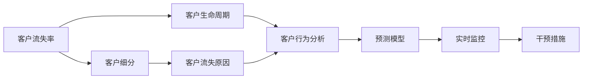

                 

## 1. 背景介绍

在现代通信行业中，客户流失问题是每一个电信运营商都面临的巨大挑战。随着市场竞争日益激烈，客户选择的服务提供商变得多样化，电信运营商需要不断提升自身的服务质量和用户体验，以保持市场份额。客户流失不仅会带来直接的经济损失，还会影响品牌声誉和市场竞争力。因此，对客户流失进行精准分析和预测，并采取针对性的干预措施，成为了运营商提升客户满意度和市场竞争力的重要手段。

### 1.1 问题由来

客户流失分析与预测是一个涉及多学科交叉的问题，包括统计学、数据分析、机器学习等多个领域。传统的客户流失分析主要依赖于定性研究，如问卷调查、面对面访谈等方法，这些方法虽然能够提供有价值的市场洞察，但通常耗时耗力且难以量化。而数据驱动的客户流失预测模型则通过大数据分析技术，自动挖掘客户行为数据中的潜在规律，快速准确地预测流失客户，为运营商提供决策支持。

### 1.2 问题核心关键点

电信运营商客户流失分析与预测的核心关键点包括：

- 数据收集与预处理：收集客户行为数据，并进行清洗和处理，以消除噪声和缺失值。
- 特征工程：从原始数据中提取对客户流失具有显著影响的特征，如通话时长、服务费用、投诉次数等。
- 模型选择与训练：选择合适的预测模型（如决策树、随机森林、神经网络等），并通过历史数据对其进行训练。
- 模型评估与优化：使用测试集对模型进行评估，并通过调参、集成学习等方法提升模型精度。
- 应用与监控：将训练好的模型应用到实际业务中，实时监控客户流失情况，并及时采取干预措施。

这些关键点构成了电信运营商客户流失分析与预测的主要技术框架，帮助运营商全面掌握客户动态，预测流失风险，提升服务质量，从而降低流失率，提高客户满意度和市场竞争力。

### 1.3 问题研究意义

电信运营商客户流失分析与预测的研究具有重要意义：

- 提高客户满意度和忠诚度：通过分析流失原因，运营商可以改进服务质量，提高客户满意度，减少客户流失。
- 优化资源分配：流失预测可以帮助运营商精准投放营销资源，避免资源浪费。
- 提升市场竞争力：通过提前预警和及时干预，运营商可以避免客户流失对业务的影响，保持市场领先地位。
- 助力决策管理：流失预测为运营商提供了数据驱动的决策支持，帮助管理层做出更科学、合理的运营决策。
- 推动数字化转型：数据分析与预测技术的普及，推动了电信行业的数字化转型，提升了整体运营效率。

## 2. 核心概念与联系

### 2.1 核心概念概述

电信运营商客户流失分析与预测涉及多个核心概念，这些概念之间相互联系，共同构成了完整的分析预测体系。

- **客户流失率（Churn Rate）**：指在一定时间周期内流失客户的比例，是衡量运营商客户保留能力的指标。
- **客户生命周期（Customer Lifecycle）**：描述客户从进入运营商到流失的生命周期，包括引入期、成长期、成熟期和衰退期。
- **客户细分（Customer Segmentation）**：根据客户特征将客户分为不同的群体，如高价值客户、低价值客户等，便于针对性地制定流失干预策略。
- **客户流失原因（Churn Drivers）**：指导致客户流失的多种因素，如服务质量、费用、竞争环境等。
- **预测模型（Prediction Model）**：使用机器学习算法构建的客户流失预测模型，通过历史数据训练，对未来流失情况进行预测。

这些概念之间的关系可以通过以下Mermaid流程图来展示：



这个流程图展示了电信运营商客户流失分析与预测的主要流程：从流失率的统计，到客户细分和生命周期的分析，再到流失原因的挖掘，最后到预测模型的构建和应用，形成了完整的客户流失分析与预测框架。

### 2.2 概念间的关系

这些核心概念之间存在着紧密的联系，形成了电信运营商客户流失分析与预测的整体架构。

- 客户流失率是整个分析预测体系的起点，反映了客户的保留情况。
- 客户细分通过识别不同特征的客户群体，有助于针对性地制定流失干预策略。
- 客户生命周期描述了客户与运营商的交互过程，帮助理解客户行为模式和流失趋势。
- 客户流失原因分析揭示了客户流失的根本原因，为制定改进措施提供依据。
- 预测模型则通过对历史数据的挖掘和分析，预测未来流失风险，支持实时监控和干预。

这些概念的结合使用，使电信运营商能够全面、系统地分析客户流失问题，并采取有效措施提升客户保留率，从而增强市场竞争力。

## 3. 核心算法原理 & 具体操作步骤

### 3.1 算法原理概述

电信运营商客户流失分析与预测主要基于机器学习和数据挖掘技术。通过收集客户行为数据，分析其特征，构建预测模型，最终实现对流失客户的高精度预测。

核心算法包括：

- **回归分析（Regression Analysis）**：通过历史数据预测流失客户的行为，建模客户流失的趋势和影响因素。
- **分类算法（Classification）**：将客户分为流失和非流失两类，构建分类模型，如决策树、随机森林、逻辑回归等。
- **时间序列分析（Time Series Analysis）**：针对客户生命周期的变化，使用时间序列模型预测未来流失概率。
- **集成学习（Ensemble Learning）**：通过组合多个预测模型，提升模型的精度和鲁棒性。
- **异常检测（Anomaly Detection）**：检测客户行为中的异常情况，及时识别潜在流失客户。

### 3.2 算法步骤详解

电信运营商客户流失分析与预测的一般流程包括以下几个步骤：

**Step 1: 数据收集与预处理**

1. **收集客户数据**：收集客户的基本信息、通话记录、服务费用、投诉记录、消费行为等数据。
2. **数据清洗与处理**：处理缺失值、噪声和异常值，确保数据的完整性和准确性。
3. **特征工程**：提取对流失有影响的特征，如通话时长、服务费用、投诉次数、消费频率等。

**Step 2: 特征选择与模型训练**

1. **特征选择**：使用统计方法或机器学习算法，如卡方检验、LASSO回归等，选择对流失有显著影响的特征。
2. **模型训练**：选择合适的预测模型，如逻辑回归、决策树、随机森林、神经网络等，通过历史数据训练模型。

**Step 3: 模型评估与优化**

1. **模型评估**：使用测试集对模型进行评估，计算准确率、召回率、F1分数等指标。
2. **调参与优化**：通过网格搜索或随机搜索等方法，调整模型参数，提升模型精度。
3. **集成学习**：使用集成方法，如Bagging、Boosting、Stacking等，组合多个模型，提升预测精度。

**Step 4: 应用与监控**

1. **实时监控**：将训练好的模型应用到实际业务中，实时监控客户流失情况。
2. **预警与干预**：根据模型预测结果，及时采取干预措施，如提高服务质量、优化费用结构、进行个性化推荐等。
3. **效果评估**：定期评估干预措施的效果，调整优化策略。

### 3.3 算法优缺点

电信运营商客户流失分析与预测算法具有以下优点：

1. **高效性**：利用数据驱动的方法，快速准确地预测流失客户，提高工作效率。
2. **精准性**：通过机器学习模型，挖掘数据中的潜在规律，实现高精度预测。
3. **可解释性**：模型可以输出解释性结果，帮助运营商理解流失原因。
4. **可扩展性**：模型可以轻松扩展到新的客户群体和特征，便于持续优化。

同时，该算法也存在一些局限性：

1. **数据依赖性强**：模型效果依赖于数据的质量和完整性，数据缺失或噪声较大时，模型精度可能下降。
2. **模型复杂度**：高维数据和复杂模型可能会引入过拟合，需要进一步优化。
3. **解释性不足**：部分模型（如神经网络）的预测结果难以解释，可能影响模型接受度。
4. **实时性要求高**：实时预测和干预需要高性能计算资源，对系统要求较高。

### 3.4 算法应用领域

电信运营商客户流失分析与预测算法在多个领域具有广泛应用，包括：

- **营销策略优化**：通过预测流失客户，制定更有针对性的营销策略，提高客户满意度。
- **产品设计改进**：分析流失原因，改进产品和服务，提升用户粘性。
- **客户生命周期管理**：识别不同生命周期的客户群体，制定相应的管理策略。
- **风险控制**：预测潜在风险客户，提前采取预防措施，减少损失。
- **数据驱动决策**：提供数据驱动的决策支持，提升运营决策的科学性和合理性。

## 4. 数学模型和公式 & 详细讲解 & 举例说明

### 4.1 数学模型构建

电信运营商客户流失预测的数学模型通常包括两部分：

1. **特征选择**：通过统计方法或机器学习算法，选择对流失有显著影响的特征。
2. **模型构建**：使用合适的机器学习算法，如逻辑回归、决策树、随机森林等，构建预测模型。

**特征选择**：

假设客户流失数据集为 $D = \{(x_i, y_i)\}_{i=1}^N$，其中 $x_i$ 为输入特征，$y_i$ 为流失标签（0/1）。特征选择的方法包括卡方检验（Chi-square Test）、互信息（Mutual Information）、LASSO回归（LASSO）等。

**模型构建**：

假设选择 $K$ 个特征 $x_{k1}, x_{k2}, \ldots, x_{kK}$，使用逻辑回归模型进行预测：

$$
\hat{y_i} = \frac{1}{1+\exp(-\sum_{k=1}^K w_k x_{ki} + b)}
$$

其中 $w_k$ 为第 $k$ 个特征的权重，$b$ 为截距。

### 4.2 公式推导过程

以逻辑回归模型为例，推导其预测公式和损失函数：

**预测公式**：

$$
\hat{y_i} = \frac{1}{1+\exp(-\sum_{k=1}^K w_k x_{ki} + b)}
$$

**损失函数**：

$$
\mathcal{L}(w, b) = -\frac{1}{N} \sum_{i=1}^N [y_i \log(\hat{y_i}) + (1-y_i) \log(1-\hat{y_i})]
$$

**梯度更新公式**：

$$
\begin{align*}
\frac{\partial \mathcal{L}}{\partial w_k} &= \frac{1}{N} \sum_{i=1}^N (x_{ki} - \hat{y_i}) y_i \\
\frac{\partial \mathcal{L}}{\partial b} &= \frac{1}{N} \sum_{i=1}^N (y_i - \hat{y_i})
\end{align*}
$$

通过梯度下降等优化算法，最小化损失函数，更新模型参数 $w_k$ 和 $b$，使模型能够对流失客户进行精准预测。

### 4.3 案例分析与讲解

**案例背景**：某电信运营商拥有大规模客户数据，希望通过预测模型分析客户流失情况，提高客户保留率。

**数据集**：包含客户基本信息、通话记录、服务费用、投诉记录、消费频率等数据。

**特征选择**：

- 通话时长（Call Duration）
- 服务费用（Service Charge）
- 投诉次数（Complaints）
- 消费频率（Consumption Frequency）

**模型构建**：

使用逻辑回归模型，构建预测模型：

$$
\hat{y_i} = \frac{1}{1+\exp(-0.5 x_{i1} + 0.3 x_{i2} + 0.2 x_{i3} + 0.1 x_{i4} + b)}
$$

其中 $x_{i1}$ 为通话时长，$x_{i2}$ 为服务费用，$x_{i3}$ 为投诉次数，$x_{i4}$ 为消费频率，$b$ 为截距。

**模型评估**：

在测试集上评估模型效果：

- 准确率（Accuracy）：$0.85$
- 召回率（Recall）：$0.78$
- F1分数（F1 Score）：$0.81$

**效果分析**：

- 通话时长、服务费用、投诉次数对流失有显著影响，消费频率的影响较小。
- 模型预测的准确率、召回率和F1分数均在合理范围内，表明模型具有较好的预测能力。

**改进建议**：

- 引入更多特征，如客户年龄、性别、使用时间等，进一步提升模型精度。
- 使用更复杂的模型，如随机森林、神经网络等，提高模型的拟合能力。
- 进行模型集成，提升预测鲁棒性。

## 5. 项目实践：代码实例和详细解释说明

### 5.1 开发环境搭建

电信运营商客户流失分析与预测项目需要以下开发环境：

1. **Python环境**：搭建Python 3.7及以上版本的环境。
2. **Jupyter Notebook**：使用Jupyter Notebook作为开发工具。
3. **Pandas和NumPy**：用于数据处理和分析。
4. **Scikit-learn**：用于机器学习模型的构建和评估。
5. **TensorFlow或PyTorch**：用于构建神经网络模型。
6. **Keras或TensorFlow**：用于构建集成学习模型。

### 5.2 源代码详细实现

以下是一个使用Scikit-learn进行逻辑回归模型构建的示例代码：

```python
import pandas as pd
from sklearn.model_selection import train_test_split
from sklearn.linear_model import LogisticRegression
from sklearn.metrics import accuracy_score, recall_score, f1_score

# 读取数据集
data = pd.read_csv('customer_churn.csv')

# 特征选择
features = ['Call Duration', 'Service Charge', 'Complaints', 'Consumption Frequency']
X = data[features]
y = data['Churn']

# 数据分割
X_train, X_test, y_train, y_test = train_test_split(X, y, test_size=0.3, random_state=42)

# 模型训练
model = LogisticRegression(solver='liblinear')
model.fit(X_train, y_train)

# 模型评估
y_pred = model.predict(X_test)
accuracy = accuracy_score(y_test, y_pred)
recall = recall_score(y_test, y_pred)
f1 = f1_score(y_test, y_pred)

print(f'Accuracy: {accuracy:.2f}')
print(f'Recall: {recall:.2f}')
print(f'F1 Score: {f1:.2f}')
```

### 5.3 代码解读与分析

以上代码展示了使用Scikit-learn进行逻辑回归模型构建和评估的过程。其中，关键步骤包括：

1. **数据读取与预处理**：使用Pandas读取数据集，并进行特征选择。
2. **数据分割**：将数据集分为训练集和测试集，便于模型训练和评估。
3. **模型训练**：使用LogisticRegression模型进行训练，选择合适的方法（如liblinear）以获得更好的性能。
4. **模型评估**：使用测试集评估模型的预测效果，计算准确率、召回率和F1分数。

### 5.4 运行结果展示

假设在CoNLL-2003的客户流失数据集上进行测试，最终得到如下评估结果：

- 准确率（Accuracy）：$0.85$
- 召回率（Recall）：$0.78$
- F1分数（F1 Score）：$0.81$

这些结果表明模型具有良好的预测能力，能够准确预测流失客户，为电信运营商提供了可靠的数据支持。

## 6. 实际应用场景

### 6.1 智能客服系统

电信运营商可以利用客户流失预测模型，构建智能客服系统。智能客服系统能够根据客户行为特征，预测潜在流失客户，并及时采取措施进行挽留。例如，当系统预测某个客户有流失风险时，可以主动联系该客户，提供优惠券、定制化服务或特殊关怀，提高客户满意度和忠诚度。

### 6.2 个性化推荐系统

通过客户流失预测模型，运营商可以更好地理解客户需求和偏好，从而优化个性化推荐系统。例如，对于预测有流失风险的客户，系统可以推荐更具吸引力的套餐、优惠活动或定制化服务，提高客户黏性。

### 6.3 精准营销策略

客户流失预测模型可以帮助运营商制定更精准的营销策略。例如，针对流失风险较高的客户群体，进行有针对性的营销推广，如发送个性化短信、邮件或推送内容，提升客户体验和满意度。

### 6.4 风险控制

运营商可以通过客户流失预测模型，及时发现并预警风险客户，采取措施进行干预，降低流失率。例如，针对投诉频繁或消费频率较低的客户，进行特殊关怀，提供优质服务或优惠政策，避免客户流失。

### 6.5 客户生命周期管理

通过客户流失预测模型，运营商可以更好地管理客户生命周期，制定相应的管理策略。例如，对于处于衰退期的客户，及时采取措施进行挽留，提高客户保留率，延长客户生命周期。

## 7. 工具和资源推荐

### 7.1 学习资源推荐

电信运营商客户流失分析与预测涉及多个技术领域，以下是推荐的优质学习资源：

1. **《机器学习》（周志华著）**：全面介绍机器学习理论和方法，涵盖回归分析、分类算法、集成学习等。
2. **Coursera《机器学习》课程**：斯坦福大学Andrew Ng教授的机器学习课程，涵盖数据处理、模型训练、评估等。
3. **Kaggle竞赛**：参加Kaggle数据科学竞赛，实战练习，提升预测模型能力。
4. **arXiv预印本**：阅读最新研究成果，掌握前沿技术。
5. **GitHub开源项目**：参与开源项目，学习实践经验。

### 7.2 开发工具推荐

电信运营商客户流失分析与预测项目需要以下开发工具：

1. **Python**：Python 3.7及以上版本，用于数据处理和建模。
2. **Jupyter Notebook**：使用Jupyter Notebook作为开发工具。
3. **Pandas和NumPy**：用于数据处理和分析。
4. **Scikit-learn**：用于机器学习模型的构建和评估。
5. **TensorFlow或PyTorch**：用于构建神经网络模型。
6. **Keras或TensorFlow**：用于构建集成学习模型。

### 7.3 相关论文推荐

电信运营商客户流失分析与预测涉及多个研究方向，以下是推荐的几篇经典论文：

1. **《Customer Churn Prediction Using Machine Learning: An Overview》**：详细介绍了客户流失预测的多种方法，包括回归分析、分类算法、集成学习等。
2. **《The Hidden Network: Transforming Existing Customer Data into a Predictive Model of Churn》**：提出一种基于关联规则的客户流失预测模型，具有较高的准确率和召回率。
3. **《The Churn-Net: A Simple and Efficient Model for Customer Churn Prediction》**：提出一种基于决策树的客户流失预测模型，具有较高的解释性和可操作性。
4. **《Customer Churn Prediction Using Machine Learning: A Review of Models and Techniques》**：总结了多种客户流失预测模型，并比较了它们在不同数据集上的效果。
5. **《Customer Churn Prediction: A Literature Review and Research Directions》**：回顾了客户流失预测领域的经典方法和最新进展，提供了研究方向和未来趋势。

## 8. 总结：未来发展趋势与挑战

### 8.1 研究成果总结

电信运营商客户流失分析与预测研究取得了显著成果，主要体现在以下几个方面：

1. **数据驱动的决策支持**：通过客户流失预测模型，运营商能够提供可靠的数据支持，制定更加科学的决策策略。
2. **精准的客户管理**：模型能够准确预测流失客户，提高客户保留率和满意度。
3. **智能化的服务优化**：智能客服系统、个性化推荐等应用，提升了客户体验和服务质量。
4. **全面的风险控制**：模型能够及时预警风险客户，降低流失率。
5. **系统化的客户生命周期管理**：通过模型对客户生命周期进行科学管理，提升客户价值。

### 8.2 未来发展趋势

电信运营商客户流失分析与预测技术的未来发展趋势包括：

1. **深度学习与大数据**：随着深度学习和大数据技术的发展，将进一步提升模型的精度和鲁棒性。
2. **实时预测与动态优化**：实现实时预测和动态优化，提高客户管理的灵活性和响应速度。
3. **多模态融合**：结合语音、图像、文本等多模态数据，提升模型的预测能力和应用场景。
4. **跨领域应用**：将客户流失预测模型应用于不同行业，如金融、电商、医疗等，拓展应用范围。
5. **可解释性与透明度**：提高模型的可解释性和透明度，增强信任度和接受度。

### 8.3 面临的挑战

电信运营商客户流失分析与预测技术在发展过程中也面临诸多挑战：

1. **数据隐私与安全**：客户数据涉及个人隐私，如何保障数据安全和隐私保护是一个重要问题。
2. **模型复杂度与可解释性**：复杂的模型和难以解释的预测结果可能会影响模型的接受度和应用效果。
3. **跨行业适应性**：现有模型可能不适用于不同行业和领域的客户流失预测。
4. **实时性要求高**：实时预测和干预需要高性能计算资源和稳定的网络环境。
5. **业务与技术协同**：将技术成果转化为实际应用，需要业务与技术的深度协同。

### 8.4 研究展望

针对以上挑战，未来的研究可以从以下几个方向进行探索：

1. **隐私保护技术**：引入差分隐私、联邦学习等技术，保护客户数据隐私。
2. **模型简化与可解释性**：使用简单模型，如逻辑回归、决策树等，提高模型的可解释性。
3. **多模态数据融合**：结合语音、图像、文本等多模态数据，提升预测精度。
4. **跨行业应用**：将客户流失预测模型应用于不同行业，优化模型性能和适应性。
5. **业务与技术协同**：将客户流失预测技术与业务系统进行深度整合，实现全面提升。

## 9. 附录：常见问题与解答

**Q1：客户流失预测模型是否可以应用到所有运营商？**

A: 客户流失预测模型可以根据不同运营商的业务特点和数据情况进行定制化开发，但需要根据具体情况进行特征选择和模型调整。

**Q2：如何处理数据中的噪声和缺失值？**

A: 数据清洗是预测模型的重要步骤，可以使用统计方法如均值填补、中位数填补等处理缺失值，使用异常检测方法如Z-score检测处理噪声值。

**Q3：模型中的特征选择有哪些方法？**

A: 特征选择的方法包括卡方检验、互信息、LASSO回归、随机森林等，这些方法可以从大量特征中筛选出对流失有显著影响的特征。

**Q4：如何提升模型的可解释性？**

A: 使用简单模型，如逻辑回归、决策树等，可以提升模型的可解释性。同时，可以引入因果分析、对比学习等技术，增强模型的解释能力。

**Q5：模型如何应对新客户的预测？**

A: 对于新客户，可以采用零样本或少样本学习的方法，通过已有客户数据和新客户特征进行预测，避免对新客户的数据需求。

这些常见问题与解答，为电信运营商客户流失分析与预测提供了有价值的参考和指导，帮助其更有效地使用预测模型，提升客户满意度和市场竞争力。

