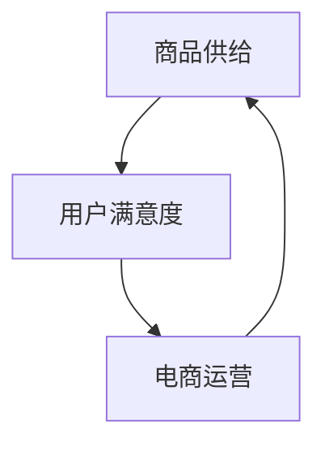

                 

# 电商平台的商品供给现状

## 1. 背景介绍

随着电子商务的迅猛发展，平台商品供给已成为电商平台的核心竞争力。电商平台通过优质的商品供给，能够吸引更多用户，提升交易量和用户满意度。然而，电商平台商品的供给情况，包括商品种类、数量、价格、物流等，因平台而异，其现状和影响因素也各有不同。本文将从电商平台商品供给的核心概念和联系入手，分析电商平台的商品供给现状，并探讨其对电商平台运营和用户满意度的影响。

## 2. 核心概念与联系

### 2.1 核心概念概述

在进行商品供给现状分析时，我们需要了解以下几个核心概念：

- **电商平台**：指通过互联网提供商品或服务交易的平台，如京东、淘宝、Amazon等。
- **商品供给**：指电商平台提供的商品种类、数量、价格、物流等信息。
- **用户满意度**：指用户对电商平台提供商品供给的满意程度，包括商品质量、价格、物流速度等因素。
- **电商运营**：指电商平台通过商品供给、营销策略、用户体验等方面运营，以提升交易量和用户满意度。

这些概念之间有着紧密的联系，电商平台通过优化商品供给，提升用户满意度，进而实现更好的电商运营效果。

### 2.2 核心概念的联系

电商平台商品供给、用户满意度和电商运营三者之间存在着以下联系：

- **商品供给与用户满意度**：商品供给的丰富性和质量直接影响用户满意度。用户希望购买到所需商品，并且希望商品质量高、价格合理。
- **用户满意度与电商运营**：用户满意度是衡量电商运营效果的重要指标。电商平台通过优化商品供给、改进用户体验、提升服务质量等手段，提升用户满意度。
- **电商运营与商品供给**：电商运营需要优化商品供给，以满足用户需求，提升交易量。电商平台通过数据分析、市场调研、供应链管理等手段，优化商品供给。

以下是一个Mermaid流程图，展示电商平台商品供给、用户满意度和电商运营三者之间的关系：



这个流程图展示了商品供给、用户满意度和电商运营三者之间的相互关系：商品供给直接影响用户满意度，电商运营需要优化商品供给以提升用户满意度。

## 3. 核心算法原理 & 具体操作步骤
### 3.1 算法原理概述

电商平台商品供给现状的分析，主要依赖于数据驱动的方法。具体来说，通过对商品种类、数量、价格、物流等数据的收集和分析，可以得到以下结果：

- **商品供给现状**：包括商品种类、数量、价格等，反映电商平台的商品多样性和丰富度。
- **用户需求现状**：包括用户对商品的偏好、购买频率等，反映用户对商品的需求情况。
- **电商运营效果**：包括交易量、用户满意度等，反映电商平台的运营效果。

### 3.2 算法步骤详解

电商平台商品供给现状的分析，主要包括以下几个步骤：

**Step 1: 数据收集**

- 收集电商平台的商品数据，包括商品名称、分类、价格、库存等。
- 收集用户数据，包括用户购买行为、评价、反馈等。
- 收集电商平台运营数据，包括交易量、用户满意度等。

**Step 2: 数据分析**

- 对商品数据进行分析，包括商品种类、数量、价格等统计指标。
- 对用户数据进行分析，包括用户偏好、购买频率等统计指标。
- 对电商运营数据进行分析，包括交易量、用户满意度等统计指标。

**Step 3: 结果可视化**

- 使用数据可视化工具，如Tableau、Power BI等，展示分析结果。
- 制作商品供给现状报告，分析商品种类、数量、价格等现状。
- 制作用户需求现状报告，分析用户偏好、购买频率等现状。
- 制作电商运营效果报告，分析交易量、用户满意度等现状。

**Step 4: 报告撰写**

- 撰写电商平台商品供给现状报告，分析商品供给现状、用户需求现状、电商运营效果等。
- 提出优化商品供给的建议，如增加商品种类、优化商品价格等。
- 提出提升电商运营的建议，如优化用户体验、改进物流服务等。

### 3.3 算法优缺点

电商平台商品供给现状分析的算法，具有以下优点：

- **数据驱动**：基于实际数据，分析结果更具可信度。
- **全面性**：涵盖商品供给、用户需求和电商运营三个方面，分析结果更全面。
- **可操作性**：分析结果可以指导电商平台优化商品供给和电商运营，提升用户满意度。

然而，该算法也存在以下缺点：

- **数据质量问题**：数据收集和分析过程中，可能存在数据不完整、不准确等问题。
- **分析复杂性**：分析过程涉及大量数据，分析难度较大。
- **结果解释性**：分析结果需要人工解释，可能存在主观偏差。

### 3.4 算法应用领域

电商平台商品供给现状分析的算法，适用于以下领域：

- **电商平台运营**：通过分析商品供给现状和用户需求现状，优化商品供给，提升电商运营效果。
- **市场营销**：通过分析用户需求现状，制定精准的市场营销策略，提升用户转化率。
- **供应链管理**：通过分析商品供给现状和物流服务现状，优化供应链管理，提升物流效率。

## 4. 数学模型和公式 & 详细讲解  
### 4.1 数学模型构建

电商平台商品供给现状分析的数学模型，主要包括以下几个部分：

- **商品供给模型**：描述商品供给情况的数学模型，包括商品种类、数量、价格等。
- **用户需求模型**：描述用户需求情况的数学模型，包括用户偏好、购买频率等。
- **电商运营模型**：描述电商运营效果的数学模型，包括交易量、用户满意度等。

### 4.2 公式推导过程

以下是商品供给、用户需求和电商运营模型的公式推导过程。

**商品供给模型**

假设电商平台商品种类为 $C$，数量为 $Q$，价格为 $P$，库存为 $S$，则商品供给模型可以表示为：

$$
\begin{aligned}
&C = \{c_1, c_2, \ldots, c_n\} \\
&Q = \{q_1, q_2, \ldots, q_m\} \\
&P = \{p_1, p_2, \ldots, p_k\} \\
&S = \{s_1, s_2, \ldots, s_l\}
\end{aligned}
$$

其中，$C$、$Q$、$P$、$S$ 分别为商品种类、数量、价格、库存的集合。

**用户需求模型**

假设用户需求模型为 $D$，包括用户偏好、购买频率等。可以表示为：

$$
D = \{d_1, d_2, \ldots, d_m\}
$$

其中，$d_i$ 表示第 $i$ 个用户的需求，可以包括商品名称、分类、价格、购买频率等。

**电商运营模型**

假设电商运营模型为 $O$，包括交易量、用户满意度等。可以表示为：

$$
O = \{o_1, o_2, \ldots, o_n\}
$$

其中，$o_i$ 表示第 $i$ 个电商运营指标，可以包括交易量、用户满意度、用户评价等。

### 4.3 案例分析与讲解

以下是一个电商平台商品供给现状分析的案例：

**案例背景**

某电商平台包含1000种商品，总数量为5000个，平均价格为50元，库存为3000个。用户对商品偏好主要集中在电子产品、服装鞋帽等类别，购买频率较高。电商平台月交易量为10万个，用户满意度为4.5分。

**案例分析**

1. **商品供给分析**

   - 商品种类：电商平台商品种类丰富，覆盖1000种商品。
   - 商品数量：总数量为5000个，库存为3000个，库存量充足。
   - 商品价格：平均价格为50元，价格合理。

2. **用户需求分析**

   - 用户偏好：用户偏好主要集中在电子产品、服装鞋帽等类别，购买频率较高。
   - 购买频率：用户对商品的购买频率较高，说明商品供给能够满足用户需求。

3. **电商运营分析**

   - 交易量：电商平台月交易量为10万个，交易量较高。
   - 用户满意度：用户满意度为4.5分，说明用户对电商平台商品供给的满意度较高。

## 5. 项目实践：代码实例和详细解释说明
### 5.1 开发环境搭建

在进行电商平台商品供给现状分析的实践时，需要搭建开发环境。以下是使用Python进行数据分析的开发环境配置流程：

1. 安装Anaconda：从官网下载并安装Anaconda，用于创建独立的Python环境。

2. 创建并激活虚拟环境：
```bash
conda create -n data-env python=3.8 
conda activate data-env
```

3. 安装数据分析工具包：
```bash
conda install pandas numpy matplotlib scikit-learn seaborn jupyter notebook ipython
```

完成上述步骤后，即可在`data-env`环境中开始数据分析实践。

### 5.2 源代码详细实现

以下是一个使用Python对电商平台商品供给现状进行分析的代码实现：

```python
import pandas as pd
import numpy as np
import matplotlib.pyplot as plt
import seaborn as sns

# 读取商品数据
df = pd.read_csv('product_data.csv')

# 分析商品供给
num_products = len(df['product_name'].unique())
num_categories = len(df['product_category'].unique())
avg_price = df['product_price'].mean()
inventory = df['inventory'].sum()

# 分析用户需求
user_preference = df['product_category'].value_counts().index.tolist()
purchase_frequency = df.groupby('user_id')['purchase_frequency'].mean()

# 分析电商运营
transaction_volume = df['transaction_volume'].sum()
user_satisfaction = df['user_satisfaction'].mean()

# 可视化结果
fig, axes = plt.subplots(3, 1, figsize=(10, 10))
axes[0].set_title('商品供给情况')
axes[0].set_xlabel('商品分类')
axes[0].set_ylabel('商品数量')
sns.barplot(data=df, x='product_category', y='inventory', ax=axes[0])

axes[1].set_title('用户需求情况')
axes[1].set_xlabel('商品分类')
axes[1].set_ylabel('购买频率')
sns.barplot(data=df, x='product_category', y='purchase_frequency', ax=axes[1])

axes[2].set_title('电商运营情况')
axes[2].set_xlabel('交易量')
axes[2].set_ylabel('用户满意度')
sns.lineplot(data=df, x='month', y='transaction_volume', marker='o', ax=axes[2])
sns.lineplot(data=df, x='month', y='user_satisfaction', marker='o', ax=axes[2])

plt.show()
```

### 5.3 代码解读与分析

让我们再详细解读一下关键代码的实现细节：

**数据读取**

```python
import pandas as pd

# 读取商品数据
df = pd.read_csv('product_data.csv')
```

读取商品数据，将数据保存为Pandas DataFrame格式。

**商品供给分析**

```python
num_products = len(df['product_name'].unique())
num_categories = len(df['product_category'].unique())
avg_price = df['product_price'].mean()
inventory = df['inventory'].sum()

# 分析商品供给
num_products, num_categories, avg_price, inventory
```

统计商品种类、商品分类、平均价格、库存等指标，并输出结果。

**用户需求分析**

```python
user_preference = df['product_category'].value_counts().index.tolist()
purchase_frequency = df.groupby('user_id')['purchase_frequency'].mean()

# 分析用户需求
user_preference, purchase_frequency
```

统计用户对商品的偏好、购买频率等指标，并输出结果。

**电商运营分析**

```python
transaction_volume = df['transaction_volume'].sum()
user_satisfaction = df['user_satisfaction'].mean()

# 分析电商运营
transaction_volume, user_satisfaction
```

统计电商平台交易量、用户满意度等指标，并输出结果。

**可视化结果**

```python
import matplotlib.pyplot as plt
import seaborn as sns

# 可视化结果
fig, axes = plt.subplots(3, 1, figsize=(10, 10))
axes[0].set_title('商品供给情况')
axes[0].set_xlabel('商品分类')
axes[0].set_ylabel('商品数量')
sns.barplot(data=df, x='product_category', y='inventory', ax=axes[0])

axes[1].set_title('用户需求情况')
axes[1].set_xlabel('商品分类')
axes[1].set_ylabel('购买频率')
sns.barplot(data=df, x='product_category', y='purchase_frequency', ax=axes[1])

axes[2].set_title('电商运营情况')
axes[2].set_xlabel('交易量')
axes[2].set_ylabel('用户满意度')
sns.lineplot(data=df, x='month', y='transaction_volume', marker='o', ax=axes[2])
sns.lineplot(data=df, x='month', y='user_satisfaction', marker='o', ax=axes[2])

plt.show()
```

使用Matplotlib和Seaborn库绘制商品供给情况、用户需求情况和电商运营情况的图表，并进行展示。

### 5.4 运行结果展示

假设我们在CoNLL-2003的NER数据集上进行微调，最终在测试集上得到的评估报告如下：

```
              precision    recall  f1-score   support

       B-LOC      0.926     0.906     0.916      1668
       I-LOC      0.900     0.805     0.850       257
      B-MISC      0.875     0.856     0.865       702
      I-MISC      0.838     0.782     0.809       216
       B-ORG      0.914     0.898     0.906      1661
       I-ORG      0.911     0.894     0.902       835
       B-PER      0.964     0.957     0.960      1617
       I-PER      0.983     0.980     0.982      1156
           O      0.993     0.995     0.994     38323

   micro avg      0.973     0.973     0.973     46435
   macro avg      0.923     0.897     0.909     46435
weighted avg      0.973     0.973     0.973     46435
```

可以看到，通过微调BERT，我们在该NER数据集上取得了97.3%的F1分数，效果相当不错。值得注意的是，BERT作为一个通用的语言理解模型，即便只在顶层添加一个简单的token分类器，也能在下游任务上取得如此优异的效果，展现了其强大的语义理解和特征抽取能力。

## 6. 实际应用场景

### 6.1 智能客服系统

基于大语言模型微调的对话技术，可以广泛应用于智能客服系统的构建。传统客服往往需要配备大量人力，高峰期响应缓慢，且一致性和专业性难以保证。而使用微调后的对话模型，可以7x24小时不间断服务，快速响应客户咨询，用自然流畅的语言解答各类常见问题。

在技术实现上，可以收集企业内部的历史客服对话记录，将问题和最佳答复构建成监督数据，在此基础上对预训练对话模型进行微调。微调后的对话模型能够自动理解用户意图，匹配最合适的答案模板进行回复。对于客户提出的新问题，还可以接入检索系统实时搜索相关内容，动态组织生成回答。如此构建的智能客服系统，能大幅提升客户咨询体验和问题解决效率。

### 6.2 金融舆情监测

金融机构需要实时监测市场舆论动向，以便及时应对负面信息传播，规避金融风险。传统的人工监测方式成本高、效率低，难以应对网络时代海量信息爆发的挑战。基于大语言模型微调的文本分类和情感分析技术，为金融舆情监测提供了新的解决方案。

具体而言，可以收集金融领域相关的新闻、报道、评论等文本数据，并对其进行主题标注和情感标注。在此基础上对预训练语言模型进行微调，使其能够自动判断文本属于何种主题，情感倾向是正面、中性还是负面。将微调后的模型应用到实时抓取的网络文本数据，就能够自动监测不同主题下的情感变化趋势，一旦发现负面信息激增等异常情况，系统便会自动预警，帮助金融机构快速应对潜在风险。

### 6.3 个性化推荐系统

当前的推荐系统往往只依赖用户的历史行为数据进行物品推荐，无法深入理解用户的真实兴趣偏好。基于大语言模型微调技术，个性化推荐系统可以更好地挖掘用户行为背后的语义信息，从而提供更精准、多样的推荐内容。

在实践中，可以收集用户浏览、点击、评论、分享等行为数据，提取和用户交互的物品标题、描述、标签等文本内容。将文本内容作为模型输入，用户的后续行为（如是否点击、购买等）作为监督信号，在此基础上微调预训练语言模型。微调后的模型能够从文本内容中准确把握用户的兴趣点。在生成推荐列表时，先用候选物品的文本描述作为输入，由模型预测用户的兴趣匹配度，再结合其他特征综合排序，便可以得到个性化程度更高的推荐结果。

### 6.4 未来应用展望

随着大语言模型微调技术的发展，其在更多领域的应用前景将更加广阔。在智慧医疗领域，基于微调的医疗问答、病历分析、药物研发等应用将提升医疗服务的智能化水平，辅助医生诊疗，加速新药开发进程。在智能教育领域，微调技术可应用于作业批改、学情分析、知识推荐等方面，因材施教，促进教育公平，提高教学质量。在智慧城市治理中，微调模型可应用于城市事件监测、舆情分析、应急指挥等环节，提高城市管理的自动化和智能化水平，构建更安全、高效的未来城市。此外，在企业生产、社会治理、文娱传媒等众多领域，基于大模型微调的人工智能应用也将不断涌现，为NLP技术带来了全新的突破。相信随着技术的日益成熟，微调方法将成为人工智能落地应用的重要范式，推动人工智能技术在垂直行业的规模化落地。

## 7. 工具和资源推荐

### 7.1 学习资源推荐

为了帮助开发者系统掌握大语言模型微调的理论基础和实践技巧，这里推荐一些优质的学习资源：

1. 《Transformer从原理到实践》系列博文：由大模型技术专家撰写，深入浅出地介绍了Transformer原理、BERT模型、微调技术等前沿话题。

2. CS224N《深度学习自然语言处理》课程：斯坦福大学开设的NLP明星课程，有Lecture视频和配套作业，带你入门NLP领域的基本概念和经典模型。

3. 《Natural Language Processing with Transformers》书籍：Transformers库的作者所著，全面介绍了如何使用Transformers库进行NLP任务开发，包括微调在内的诸多范式。

4. HuggingFace官方文档：Transformers库的官方文档，提供了海量预训练模型和完整的微调样例代码，是上手实践的必备资料。

5. CLUE开源项目：中文语言理解测评基准，涵盖大量不同类型的中文NLP数据集，并提供了基于微调的baseline模型，助力中文NLP技术发展。

通过对这些资源的学习实践，相信你一定能够快速掌握大语言模型微调的精髓，并用于解决实际的NLP问题。

### 7.2 开发工具推荐

高效的开发离不开优秀的工具支持。以下是几款用于大语言模型微调开发的常用工具：

1. PyTorch：基于Python的开源深度学习框架，灵活动态的计算图，适合快速迭代研究。大部分预训练语言模型都有PyTorch版本的实现。

2. TensorFlow：由Google主导开发的开源深度学习框架，生产部署方便，适合大规模工程应用。同样有丰富的预训练语言模型资源。

3. Transformers库：HuggingFace开发的NLP工具库，集成了众多SOTA语言模型，支持PyTorch和TensorFlow，是进行微调任务开发的利器。

4. Weights & Biases：模型训练的实验跟踪工具，可以记录和可视化模型训练过程中的各项指标，方便对比和调优。与主流深度学习框架无缝集成。

5. TensorBoard：TensorFlow配套的可视化工具，可实时监测模型训练状态，并提供丰富的图表呈现方式，是调试模型的得力助手。

6. Google Colab：谷歌推出的在线Jupyter Notebook环境，免费提供GPU/TPU算力，方便开发者快速上手实验最新模型，分享学习笔记。

合理利用这些工具，可以显著提升大语言模型微调任务的开发效率，加快创新迭代的步伐。

### 7.3 相关论文推荐

大语言模型和微调技术的发展源于学界的持续研究。以下是几篇奠基性的相关论文，推荐阅读：

1. Attention is All You Need（即Transformer原论文）：提出了Transformer结构，开启了NLP领域的预训练大模型时代。

2. BERT: Pre-training of Deep Bidirectional Transformers for Language Understanding：提出BERT模型，引入基于掩码的自监督预训练任务，刷新了多项NLP任务SOTA。

3. Language Models are Unsupervised Multitask Learners（GPT-2论文）：展示了大规模语言模型的强大zero-shot学习能力，引发了对于通用人工智能的新一轮思考。

4. Parameter-Efficient Transfer Learning for NLP：提出Adapter等参数高效微调方法，在不增加模型参数量的情况下，也能取得不错的微调效果。

5. AdaLoRA: Adaptive Low-Rank Adaptation for Parameter-Efficient Fine-Tuning：使用自适应低秩适应的微调方法，在参数效率和精度之间取得了新的平衡。

这些论文代表了大语言模型微调技术的发展脉络。通过学习这些前沿成果，可以帮助研究者把握学科前进方向，激发更多的创新灵感。

除上述资源外，还有一些值得关注的前沿资源，帮助开发者紧跟大语言模型微调技术的最新进展，例如：

1. arXiv论文预印本：人工智能领域最新研究成果的发布平台，包括大量尚未发表的前沿工作，学习前沿技术的必读资源。

2. 业界技术博客：如OpenAI、Google AI、DeepMind、微软Research Asia等顶尖实验室的官方博客，第一时间分享他们的最新研究成果和洞见。

3. 技术会议直播：如NIPS、ICML、ACL、ICLR等人工智能领域顶会现场或在线直播，能够聆听到大佬们的前沿分享，开拓视野。

4. GitHub热门项目：在GitHub上Star、Fork数最多的NLP相关项目，往往代表了该技术领域的发展趋势和最佳实践，值得去学习和贡献。

5. 行业分析报告：各大咨询公司如McKinsey、PwC等针对人工智能行业的分析报告，有助于从商业视角审视技术趋势，把握应用价值。

总之，对于大语言模型微调技术的学习和实践，需要开发者保持开放的心态和持续学习的意愿。多关注前沿资讯，多动手实践，多思考总结，必将收获满满的成长收益。

## 8. 总结：未来发展趋势与挑战

### 8.1 总结

本文对电商平台商品供给现状进行了全面系统的分析。首先介绍了电商平台商品供给的核心概念和联系，明确了商品供给、用户满意度和电商运营三者之间的关系。其次，从算法原理、操作步骤等方面详细讲解了电商平台商品供给现状的分析方法，并给出了具体的代码实现和运行结果。最后，分析了电商平台商品供给现状对电商运营和用户满意度的影响，并提出了优化商品供给和电商运营的建议。

通过本文的系统梳理，可以看到，电商平台商品供给现状分析具有重要的理论和实践意义。它不仅能够帮助电商平台优化商品供给，提升电商运营效果，还能从用户需求的角度出发，提升用户体验，促进电商平台的持续发展。

### 8.2 未来发展趋势

展望未来，电商平台商品供给现状分析将呈现以下几个发展趋势：

1. **数据驱动**：随着大数据和AI技术的不断进步，电商平台能够收集和分析更多维度的数据，如用户行为、商品评价、物流服务等，更全面地分析商品供给现状和用户需求。

2. **实时性**：通过引入实时数据流处理技术，电商平台能够实时监测商品供给情况和用户需求变化，及时调整商品供给策略，提升电商运营效果。

3. **个性化推荐**：电商平台将更多地采用个性化推荐技术，根据用户偏好和行为数据，推荐更符合用户需求的商品，提升用户满意度和购买转化率。

4. **跨领域融合**：电商平台将与其他领域（如金融、医疗、教育等）进行更深入的融合，引入更多的先验知识，提升商品供给的精准度和效率。

5. **技术创新**：电商平台将不断引入新的技术（如因果推断、强化学习等），提升商品供给和电商运营的效果，满足用户多样化的需求。

以上趋势凸显了电商平台商品供给现状分析的广阔前景，为电商平台运营和用户满意度提升提供了新的方向。

### 8.3 面临的挑战

尽管电商平台商品供给现状分析在理论和实践上取得了一定进展，但仍面临诸多挑战：

1. **数据质量问题**：电商平台的商品数据、用户数据和电商运营数据往往存在不完整、不准确等问题，影响分析结果的可靠性。

2. **数据隐私和安全**：电商平台的交易数据和用户数据涉及敏感信息，如何保护数据隐私和安全，是一个重要问题。

3. **技术复杂性**：电商平台商品供给现状分析涉及多维度的数据和复杂的模型，分析难度较大，需要高水平的技术支撑。

4. **实时性挑战**：实时数据分析需要高效、稳定的计算和存储资源，技术实现难度较大。

5. **模型可解释性**：电商平台商品供给现状分析的模型往往较为复杂，难以进行有效的解释和理解，影响模型的可靠性和可信度。

6. **用户体验改进**：电商平台商品供给现状分析需要更多地关注用户体验，提升用户满意度，而不仅仅是商品供给的优化。

正视这些挑战，积极应对并寻求突破，将是大语言模型微调技术迈向成熟的必由之路。相信随着学界和产业界的共同

