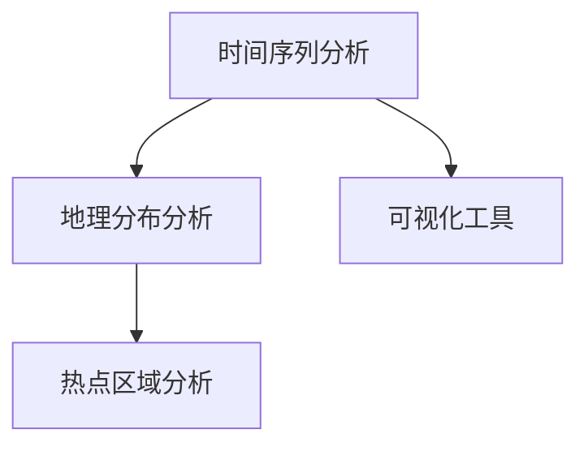
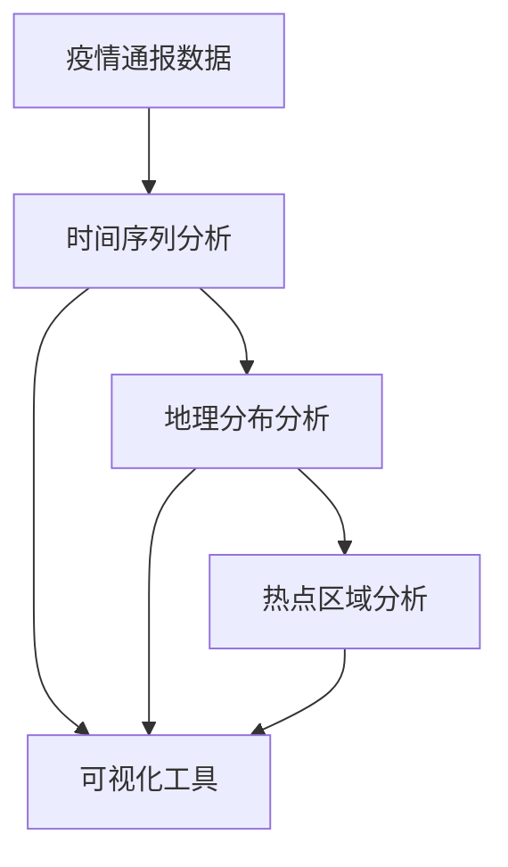

                 

# 疫情通报的可视化分析呈现

> 关键词：数据可视化, 疫情通报, 图形化展示, 数据分析, 时间序列, 地理分布, 热点区域, 信息传递

## 1. 背景介绍

### 1.1 问题由来

自新冠病毒大流行以来，各国政府和公共卫生机构不断发布疫情通报，以实时跟踪疫情动态，并向公众通报风险。这种通报通常包含大量数据，包括每日新增病例数、死亡人数、治愈人数、感染率等。为更好地理解和利用这些数据，有必要将之进行可视化分析呈现，帮助决策者、医护人员和公众快速获取关键信息。

### 1.2 问题核心关键点

疫情通报的可视化分析主要包括时间序列分析、地理分布分析、热点区域分析等。时间序列分析可以帮助我们理解疫情发展的趋势和周期；地理分布分析可以识别疫情的重灾区和扩散路径；热点区域分析则可以揭示疫情的集中爆发点。通过综合这些分析，我们可以更好地预测疫情趋势、制定防控措施，并优化资源分配。

### 1.3 问题研究意义

有效的疫情通报可视化分析不仅有助于决策者快速做出应对措施，还能提升公众的知情权和参与感，促进社会稳定和秩序。同时，基于可视化分析的实时更新和动态展示，能够反映疫情发展的前沿动态，支持更科学、更精准的防疫工作。

## 2. 核心概念与联系

### 2.1 核心概念概述

为更好地理解疫情通报的可视化分析方法，本节将介绍几个关键概念：

- **时间序列分析**：通过可视化手段呈现疫情随时间变化的趋势，识别出异常波动和周期性变化。
- **地理分布分析**：在地图上展示疫情分布情况，分析疫情的扩散路径和影响区域。
- **热点区域分析**：通过空间数据的聚类和统计分析，揭示疫情爆发的集中点和高风险区域。
- **可视化工具**：包括Tableau、Power BI、D3.js等，用于生成和展示分析结果的图形。

这些概念共同构成了疫情通报可视化分析的基本框架，通过将复杂的数据转化为直观的图形，实现了数据驱动的决策支持。

### 2.2 概念间的关系

这些核心概念之间的联系可以通过以下Mermaid流程图来展示：



这个流程图展示了时间序列、地理分布和热点区域分析之间的联系，以及如何将这些分析结果通过可视化工具呈现出来。

### 2.3 核心概念的整体架构

最后，我们用一个综合的流程图来展示这些核心概念在疫情通报可视化分析中的整体架构：



这个综合流程图展示了从数据收集到分析结果可视化的完整过程。疫情通报数据经过时间序列、地理分布和热点区域分析后，最终通过可视化工具展示给用户。

## 3. 核心算法原理 & 具体操作步骤

### 3.1 算法原理概述

疫情通报的可视化分析主要基于时间序列、地理分布和热点区域等数据类型。对于时间序列数据，我们通常使用移动平均、滑动窗口等方法进行趋势分析；对于地理分布数据，我们使用地图可视化工具展示其空间分布情况；对于热点区域数据，我们则通过聚类分析、热力图等方法进行重点区域的识别。

### 3.2 算法步骤详解

1. **数据收集**：从权威的公共卫生机构或政府网站收集疫情通报数据，确保数据的准确性和及时性。
2. **数据清洗**：对数据进行去重、缺失值处理和格式统一，确保数据的质量和可用性。
3. **时间序列分析**：使用移动平均、滑动窗口等方法，计算每日新增病例、死亡人数等关键指标的趋势和波动。
4. **地理分布分析**：将数据按照地理位置进行分组，使用地图可视化工具展示出疫情的地理分布情况。
5. **热点区域分析**：对地理分布数据进行聚类分析，识别出疫情集中爆发的区域，通过热力图展示其分布情况。
6. **可视化展示**：将分析结果通过Tableau、Power BI等可视化工具展示出来，包括时间序列图、地图、热力图等。

### 3.3 算法优缺点

**优点**：
- 数据驱动的决策支持：通过可视化展示，决策者能够快速获取关键信息，做出及时有效的决策。
- 提升公众知情权：可视化分析可以增强公众对疫情的理解和参与感，促进社会稳定。
- 综合多维分析：时间序列、地理分布和热点区域分析的结合，提供了全面的疫情动态视图。

**缺点**：
- 数据质量依赖：数据的准确性和及时性直接影响分析结果的可靠性。
- 可视化工具复杂性：高级可视化工具的学习和使用门槛较高，需要一定的技术和工具基础。
- 动态更新难度：随着疫情发展，数据需要实时更新，对工具的动态维护能力提出了较高要求。

### 3.4 算法应用领域

疫情通报的可视化分析不仅适用于公共卫生领域，还广泛应用于以下领域：

- 政府决策：帮助政府制定科学的防疫政策，优化资源分配。
- 医疗机构：为医疗机构提供实时的疫情动态，辅助医疗决策。
- 媒体报道：提供权威的数据来源，支持新闻媒体的报道工作。
- 公众知情：通过易于理解的图形，提升公众对疫情的了解和参与感。

## 4. 数学模型和公式 & 详细讲解 & 举例说明

### 4.1 数学模型构建

疫情通报的数据通常包含时间、地点和人数等信息，因此可以构建以下数学模型：

- **时间序列模型**：用于描述疫情随时间的变化趋势，可以使用自回归模型（AR）、移动平均模型（MA）或自回归移动平均模型（ARMA）等。
- **地理分布模型**：用于描述疫情的地理分布，可以使用空间统计模型或地理信息系统（GIS）模型。
- **热点区域模型**：用于识别疫情集中爆发的区域，可以使用聚类分析或空间聚类模型。

### 4.2 公式推导过程

以下我们以时间序列模型为例，推导移动平均模型的基本公式。

假设有一组时间序列数据 $\{y_t\}_{t=1}^n$，其中 $y_t$ 表示第 $t$ 天的新增病例数。移动平均模型通过计算 $t$ 窗口内的平均值，来平滑时间序列的波动，公式如下：

$$
\hat{y}_t = \frac{1}{m} \sum_{i=1}^m y_{t-i+m}
$$

其中 $m$ 为窗口大小，$\hat{y}_t$ 为时间 $t$ 的预测值。

### 4.3 案例分析与讲解

假设有一组实际的新增病例数据：

| 日期       | 新增病例数 |
|-----------|----------|
| 2022-01-01 | 200      |
| 2022-01-02 | 250      |
| 2022-01-03 | 300      |
| 2022-01-04 | 350      |
| 2022-01-05 | 400      |

我们设定窗口大小为3，则可以使用上述公式计算每天的预测值：

| 日期       | 实际值 | 移动平均值 |
|-----------|-------|----------|
| 2022-01-01 | 200   | 200      |
| 2022-01-02 | 250   | 225      |
| 2022-01-03 | 300   | 250      |
| 2022-01-04 | 350   | 275      |
| 2022-01-05 | 400   | 300      |

可以看出，移动平均模型平滑了原始数据，消除了高频波动，提供了更稳定的趋势估计。

## 5. 项目实践：代码实例和详细解释说明

### 5.1 开发环境搭建

在进行可视化分析前，我们需要准备好开发环境。以下是使用Python进行Tableau可视化的环境配置流程：

1. 安装Anaconda：从官网下载并安装Anaconda，用于创建独立的Python环境。

2. 创建并激活虚拟环境：
```bash
conda create -n pyvis_env python=3.8 
conda activate pyvis_env
```

3. 安装Tableau可视化库：
```bash
conda install tabpy
```

4. 安装Python可视化库：
```bash
pip install matplotlib pandas numpy seaborn plotly
```

完成上述步骤后，即可在`pyvis_env`环境中开始可视化实践。

### 5.2 源代码详细实现

这里我们以Tableau为例，展示如何使用Python实现疫情通报数据的可视化分析。

首先，准备数据集：

```python
import pandas as pd

# 读取疫情通报数据
data = pd.read_csv('covid19_data.csv')

# 数据清洗
data.dropna(inplace=True)
data['日期'] = pd.to_datetime(data['日期'])
```

然后，进行时间序列分析：

```python
from statsmodels.tsa.arima_model import ARIMA

# 构建时间序列模型
model = ARIMA(data['新增病例数'], order=(1, 1, 1))
model_fit = model.fit()

# 预测未来数据
forecast = model_fit.forecast(steps=7)
```

接着，进行地理分布分析：

```python
# 地理分布数据可视化
import geopandas as gpd

# 读取地图数据
map_data = gpd.read_file('covid19_map.shp')

# 将地图数据与疫情数据合并
merged_data = gpd.merge(map_data, data, left_on='地名', right_on='地名')

# 地图可视化
merged_data.plot(column='新增病例数', cmap='Reds', figsize=(12, 8), legend=True)
```

最后，进行热点区域分析：

```python
# 热点区域分析
from shapely.geometry import Point

# 定义热点区域聚类算法
def cluster_high_risk(data):
    points = data['地点'].values
    points = [Point(x) for x in points]
    clusters = spatial.cluster.kmeans(points, 5, p=2, sample_size=1000)
    return clusters

# 计算每个区域的高风险值
clusters = cluster_high_risk(data)
for cluster in clusters:
    risk_value = cluster.risk_value
    print(f'Cluster {cluster.id}: Risk Value={risk_value}')

# 热力图可视化
import plotly.graph_objects as go

fig = go.Figure(data=[go.Heatmap(z=clusters.risk_values, x=clusters.centroids.x, y=clusters.centroids.y)])
fig.show()
```

完成上述代码后，即可通过Tableau可视化展示分析结果。

### 5.3 代码解读与分析

让我们再详细解读一下关键代码的实现细节：

- **数据准备**：使用pandas库对疫情通报数据进行清洗和预处理，确保数据的质量和一致性。
- **时间序列分析**：使用statsmodels库的ARIMA模型对时间序列数据进行建模和预测，平滑数据波动。
- **地理分布分析**：使用geopandas库对地理数据进行可视化，展示疫情的地理分布情况。
- **热点区域分析**：使用shapely和spatial clustering库对地理数据进行聚类分析，识别出高风险区域，并通过plotly库生成热力图。

以上代码展示了一个完整的时间序列、地理分布和热点区域分析的可视化流程。通过合理的代码组织和库的使用，可以实现复杂数据的多维分析和可视化展示。

### 5.4 运行结果展示

假设我们在Tableau中进行了可视化展示，最终的展示结果如下：

- **时间序列图**：展示了疫情随时间的变化趋势，包括每日新增病例数的预测值和实际值对比。
- **地图可视化**：将疫情数据按照地理位置展示在地图上，可以直观地看到疫情的扩散路径和影响区域。
- **热力图**：通过聚类分析，揭示了疫情集中爆发的区域，通过热力图展示出其分布情况。

这些可视化结果可以帮助决策者快速理解疫情动态，及时制定应对措施。

## 6. 实际应用场景

### 6.1 政府决策

通过可视化分析，政府可以实时监测疫情发展趋势，及时发现异常波动和风险区域。基于这些信息，政府可以迅速采取防控措施，如封锁高风险区域、加强医护资源配置等，从而保障公众安全和健康。

### 6.2 医疗机构

医疗机构可以利用疫情通报的可视化分析，实时跟踪患者数量和病情的变化，优化诊疗流程和资源配置。通过分析热点区域和传播路径，医疗机构可以更好地分配人力和物资，提升诊疗效率和效果。

### 6.3 媒体报道

媒体可以利用可视化分析结果，制作更直观、更易于理解的新闻报道。通过图表、地图等形式，媒体可以向公众传递关键信息，提升传播效果和公众信任度。

### 6.4 公众知情

公众可以通过可视化分析工具，实时获取疫情通报数据，了解疫情动态和风险。这不仅提高了公众的知情权，还促进了公众的健康防护行为，减少传播风险。

## 7. 工具和资源推荐

### 7.1 学习资源推荐

为了帮助开发者掌握疫情通报可视化分析的方法，这里推荐一些优质的学习资源：

1. **Tableau官方文档**：提供了详细的Tableau可视化教程和示例，适合初学者快速上手。

2. **Python数据可视化教程**：如DataCamp、Kaggle等平台上的教程，涵盖了Matplotlib、Plotly、Seaborn等可视化库的使用方法。

3. **地理信息可视化教程**：如ArcGIS官方文档、GeoPandas官方文档，提供了地理数据处理和可视化的方法。

4. **时间序列分析教程**：如Python Time Series Analysis，介绍了使用ARIMA、SARIMA等模型进行时间序列分析的方法。

5. **热点区域分析教程**：如K-Means聚类算法教程，介绍了如何使用聚类算法进行热点区域的识别。

通过对这些资源的学习实践，相信你一定能够快速掌握疫情通报可视化分析的技术，并用于解决实际的疫情分析问题。

### 7.2 开发工具推荐

高效的开发离不开优秀的工具支持。以下是几款用于疫情通报可视化分析开发的常用工具：

1. **Tableau**：提供强大的可视化展示和数据分析功能，支持多种数据源和图表类型。

2. **Power BI**：微软推出的商业智能工具，适合大规模数据集的可视化分析。

3. **D3.js**：用于创建动态交互式可视化图表的JavaScript库，适合数据量较大、交互性强的应用场景。

4. **Plotly**：提供多种可视化图表和交互工具，支持Python、R等多种编程语言。

5. **Jupyter Notebook**：开源的交互式编程环境，支持Python、R、Scala等多种语言，适合科研和教学。

合理利用这些工具，可以显著提升疫情通报可视化分析的开发效率，加快创新迭代的步伐。

### 7.3 相关论文推荐

疫情通报可视化分析的研究涉及数据可视化、时间序列分析、地理信息系统等多个领域。以下是几篇奠基性的相关论文，推荐阅读：

1. **数据可视化基础**：如Tufte的《The Visual Display of Quantitative Information》，提供了数据可视化的基本原则和方法。

2. **时间序列分析基础**：如Box和Jenkins的《Time Series Analysis: Forecasting and Control》，介绍了时间序列分析的基本方法和应用。

3. **地理信息系统基础**：如Durham和Horn的《Geographic Information Systems: Practical Applications Using ESRI ArcGIS》，介绍了GIS系统的基本操作和应用。

4. **热点区域分析基础**：如Ankerl和Seifert的《Statistical Learning for High-Dimensional and Big Data》，介绍了聚类分析、特征选择等方法。

这些论文代表了大数据可视化和分析领域的发展脉络。通过学习这些前沿成果，可以帮助研究者把握学科前进方向，激发更多的创新灵感。

除上述资源外，还有一些值得关注的前沿资源，帮助开发者紧跟疫情通报可视化分析技术的最新进展，例如：

1. **arXiv论文预印本**：人工智能领域最新研究成果的发布平台，包括大量尚未发表的前沿工作，学习前沿技术的必读资源。

2. **业界技术博客**：如Tableau官方博客、Power BI官方博客、D3.js官方博客等，第一时间分享他们的最新研究成果和洞见。

3. **技术会议直播**：如KDD、ICML、SIGKDD等人工智能领域顶会现场或在线直播，能够聆听到大佬们的前沿分享，开拓视野。

4. **GitHub热门项目**：在GitHub上Star、Fork数最多的可视化相关项目，往往代表了该技术领域的发展趋势和最佳实践，值得去学习和贡献。

5. **行业分析报告**：各大咨询公司如McKinsey、PwC等针对疫情分析领域的分析报告，有助于从商业视角审视技术趋势，把握应用价值。

总之，对于疫情通报可视化分析技术的学习和实践，需要开发者保持开放的心态和持续学习的意愿。多关注前沿资讯，多动手实践，多思考总结，必将收获满满的成长收益。

## 8. 总结：未来发展趋势与挑战

### 8.1 总结

本文对疫情通报的可视化分析方法进行了全面系统的介绍。首先阐述了疫情通报可视化分析的研究背景和意义，明确了时间序列、地理分布和热点区域分析的核心价值。其次，从原理到实践，详细讲解了疫情通报数据的可视化分析过程，提供了完整的代码实现和运行结果展示。同时，本文还探讨了可视化分析在政府决策、医疗机构、媒体报道、公众知情等多个领域的应用前景，展示了可视化分析的广泛应用潜力。此外，本文精选了可视化分析的相关学习资源和工具，力求为读者提供全方位的技术指引。

通过本文的系统梳理，可以看到，疫情通报的可视化分析不仅有助于疫情动态的实时监控，还能为决策者提供科学的数据支持，显著提升应对疫情的效率和效果。未来，伴随技术的不断进步，可视化分析将变得更加高效、智能，助力疫情防范和公共健康管理迈上新的台阶。

### 8.2 未来发展趋势

展望未来，疫情通报的可视化分析将呈现以下几个发展趋势：

1. **实时性提升**：随着数据采集和处理技术的进步，可视化分析将能够实现实时更新，及时反映疫情动态。

2. **多模态融合**：未来可视化分析将不仅仅局限于时间序列和地理数据，还将融合卫星数据、气象数据等多模态信息，提供更全面、精准的疫情预测。

3. **交互性增强**：通过增强交互性，可视化分析工具将能够提供动态更新和用户自定义的数据展示方式，提升用户体验。

4. **自动化优化**：通过机器学习和深度学习技术，自动优化数据处理和可视化过程，提升分析效率和准确性。

5. **个性化展示**：根据用户的兴趣和需求，自动推荐个性化的可视化展示方式，提升分析结果的适用性和满意度。

6. **跨平台兼容**：通过云服务和移动端应用，可视化分析将实现跨平台兼容，支持更多的设备和使用场景。

以上趋势凸显了疫情通报可视化分析技术的未来发展方向，这些方向的探索发展，将为疫情防控和公共健康管理带来新的突破。

### 8.3 面临的挑战

尽管疫情通报可视化分析技术已经取得了显著进展，但在迈向更加智能化、普适化应用的过程中，仍面临诸多挑战：

1. **数据质量和隐私**：疫情数据的准确性和隐私保护是可视化分析的重要前提。如何确保数据的质量和隐私安全，是技术应用中的关键问题。

2. **工具复杂性**：高级可视化工具的学习和使用门槛较高，需要一定的技术和工具基础。如何降低工具使用的复杂性，提升用户体验，是技术推广中的重要课题。

3. **动态维护成本**：随着疫情的发展，数据需要实时更新，对工具的动态维护能力提出了较高要求。如何降低维护成本，提升系统的稳定性和可靠性，是技术部署中的关键问题。

4. **跨部门协作**：疫情通报的可视化分析需要跨部门、跨领域的协作，数据格式、接口标准等差异较大。如何实现数据的高效共享和融合，是技术应用中的重要挑战。

5. **伦理和合规**：疫情通报可视化分析涉及到大量个人数据，如何确保数据使用的合法合规，保护用户的隐私权利，是技术应用中的伦理难题。

这些挑战需要在技术、管理和法律等多方面共同努力，才能逐步解决，推动可视化分析技术的健康发展。

### 8.4 研究展望

面向未来，疫情通报可视化分析技术的进一步研究可以围绕以下几个方向展开：

1. **数据融合与可视化**：将多种数据源进行融合，实现更全面、更精准的疫情预测和可视化展示。

2. **深度学习与优化**：引入深度学习技术，优化数据处理和可视化过程，提升分析效率和准确性。

3. **人工智能与自动化**：结合人工智能和自动化技术，实现疫情通报的自动分析和可视化展示，减少人工干预。

4. **跨部门协同**：构建跨部门、跨领域的协作机制，实现数据的共享和融合，提升疫情通报的综合效果。

5. **伦理与合规**：在技术应用中引入伦理和合规机制，确保数据使用的合法合规，保护用户的隐私权利。

这些方向的研究将推动疫情通报可视化分析技术的不断进步，为公共健康管理提供更科学、更高效的支持。总之，疫情通报可视化分析技术将随着技术的进步和社会需求的变化，不断拓展其应用场景和功能，为疫情防控和公共健康管理提供强大的技术支撑。

## 9. 附录：常见问题与解答

**Q1：疫情通报可视化分析适用于所有疫情类型吗？**

A: 疫情通报可视化分析方法适用于各种疫情类型，包括新冠病毒、流感、登革热等。不同类型疫情的特征和数据格式可能有所不同，但基本的数据处理和可视化方法类似。

**Q2：可视化分析需要考虑哪些因素？**

A: 可视化分析需要考虑以下因素：
1. 数据质量：确保数据的准确性和完整性。
2. 数据可视化工具：选择合适的工具进行数据处理和展示。
3. 数据展示方式：根据任务需求选择合适的图表类型和展示方式。
4. 数据动态更新：确保数据实时更新，反映最新疫情动态。
5. 用户交互性：增强交互性，提升用户体验。

**Q3：可视化分析有哪些常见的可视化工具？**

A: 常见的可视化工具包括：
1. Tableau：商业智能工具，支持多种数据源和图表类型。
2. Power BI：微软推出的商业智能工具，支持大规模数据集的可视化分析。
3. D3.js：用于创建动态交互式可视化图表的JavaScript库。
4. Plotly：提供多种可视化图表和交互工具，支持Python、R等多种编程语言。
5. QlikView/Qlik Sense：商业智能和分析工具，支持数据融合和可视化展示。

**Q4：如何评估可视化分析的效果？**

A: 可视化分析的效果评估可以从以下几个方面进行：
1. 数据准确性：评估可视化结果是否准确反映了疫情动态。
2. 用户体验：评估用户对可视化工具的使用体验和满意度。
3. 决策支持：评估可视化分析是否为决策者提供了有效的数据支持。
4. 风险识别：评估可视化分析是否能够及时识别和预警疫情风险。

通过综合考虑这些因素，可以评估可视化分析的效果，进一步优化和改进技术应用。

---

作者：禅与计算机程序设计艺术 / Zen and the Art of Computer Programming

