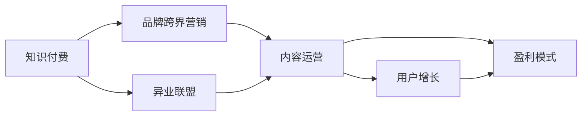
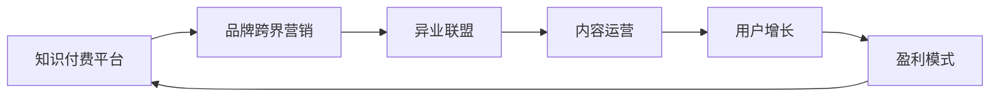

                 

# 知识付费赚钱的品牌跨界营销与异业联盟策略

> 关键词：知识付费,品牌跨界营销,异业联盟,内容运营,用户增长,盈利模式

## 1. 背景介绍

### 1.1 问题由来

在当今信息爆炸的时代，知识的获取渠道越来越多样化。然而，优质的知识和内容仍然稀缺，且成本较高。知识付费模式的兴起，为人们提供了获取高质量内容的新方式。同时，随着内容创业的热潮，如何通过知识付费实现商业化，成为众多品牌和内容创作者面临的共同挑战。

品牌在知识付费领域能够充分利用自身的品牌效应和资源优势，推出符合用户需求的优质内容，从而实现品牌的商业价值变现。然而，由于知识付费本身的特性和市场环境的复杂性，品牌的跨界营销和异业联盟策略需要精心设计和执行，才能达到预期的效果。

### 1.2 问题核心关键点

品牌跨界营销和异业联盟的核心在于如何通过内容运营和用户增长策略，实现知识付费模式的商业化，同时建立稳定的合作关系，互利共赢。关键点包括：

- 选择合适的跨界合作伙伴，确保资源互补。
- 设计和推广优质的内容产品，吸引和留住用户。
- 建立有效的用户增长和留存机制，持续提升品牌影响力。
- 探索多样化的盈利模式，实现商业化运作。

### 1.3 问题研究意义

深入研究品牌跨界营销和异业联盟策略，对于品牌在知识付费领域的商业化运作具有重要意义：

- 降低品牌推广成本。通过跨界合作，借助合作伙伴的品牌影响力和用户基础，降低自身推广成本。
- 增强品牌竞争力。借助合作伙伴的多元资源和市场渠道，提升品牌的市场影响力和竞争力。
- 实现用户增长和留存。通过精心设计的跨界合作内容，吸引新用户，留住老用户，提升品牌用户粘性。
- 探索多样化的盈利模式。借助异业联盟的多样化合作方式，拓宽品牌收益渠道，实现多元化的商业收益。

## 2. 核心概念与联系

### 2.1 核心概念概述

为更好地理解品牌跨界营销和异业联盟的策略，本节将介绍几个密切相关的核心概念：

- **知识付费**：用户为获取特定知识、技能或信息而支付费用的商业模式。常见的知识付费形式包括在线课程、电子书、音频、视频等。
- **品牌跨界营销**：品牌通过跨界合作，将自身品牌融入新的领域或行业，吸引不同领域的用户，扩大品牌影响力。
- **异业联盟**：不同行业之间的合作联盟，通过资源共享、利益互补，实现共同发展和商业价值最大化。
- **内容运营**：通过内容策划、内容生产、内容分发等手段，实现用户增长、用户留存和品牌影响力的提升。
- **用户增长**：通过各种策略和技术手段，提升新用户获取效率，扩大用户基数。
- **盈利模式**：品牌在知识付费领域通过广告、付费内容、会员制、知识授权等多样化方式实现商业化的收益渠道。

这些核心概念之间的逻辑关系可以通过以下Mermaid流程图来展示：



这个流程图展示了几大核心概念之间的关系：

1. 知识付费为品牌跨界营销和异业联盟提供了用户基础和商业平台。
2. 品牌跨界营销和异业联盟通过内容运营吸引和留住用户。
3. 内容运营又通过用户增长策略扩大品牌影响力，通过盈利模式实现商业价值。
4. 用户增长和盈利模式互相促进，形成良性循环。

### 2.2 概念间的关系

这些核心概念之间存在着紧密的联系，形成了品牌跨界营销和异业联盟的完整生态系统。

1. **知识付费与品牌跨界营销**：知识付费为品牌跨界营销提供了内容支撑和用户基础，通过品牌跨界营销，品牌可以在新的领域或行业获得曝光和用户，进一步提升知识付费平台的价值。
2. **品牌跨界营销与异业联盟**：品牌跨界营销与异业联盟相辅相成，品牌跨界营销可以拓宽合作范围，而异业联盟可以提供更丰富的资源和用户基础，实现更广泛的合作。
3. **异业联盟与内容运营**：异业联盟通过内容运营吸引和留住用户，提升品牌影响力和用户粘性，而内容运营又需要异业联盟提供的多样化资源和合作方式，才能实现更有效的用户增长。
4. **内容运营与用户增长**：内容运营通过提供高质量、有价值的内容，吸引和留住用户，扩大品牌影响力，而用户增长策略需要内容运营的支撑，才能更高效地吸引新用户。
5. **用户增长与盈利模式**：用户增长策略的实施能够提升新用户获取效率，扩大用户基数，从而为盈利模式提供更多潜在用户，实现更高的商业价值。

### 2.3 核心概念的整体架构

最后，我们用一个综合的流程图来展示这些核心概念在大品牌跨界营销和异业联盟中的整体架构：



这个综合流程图展示了从知识付费平台到品牌跨界营销，再到异业联盟，最终通过内容运营和用户增长策略，实现盈利模式的完整过程。

## 3. 核心算法原理 & 具体操作步骤
### 3.1 算法原理概述

品牌跨界营销和异业联盟的算法原理主要基于用户增长和内容运营的策略设计，通过内容的多样化、精准化的投放，吸引和留住用户，同时借助品牌效应和异业联盟的多元资源，实现商业价值的最大化。

### 3.2 算法步骤详解

1. **品牌选择与资源整合**：
   - 分析自身品牌的核心价值和优势，选择适合的跨界合作品牌。
   - 整合各品牌的资源，如内容、渠道、用户等，制定合作方案。

2. **内容策划与生产**：
   - 根据各品牌的特点和用户需求，策划符合品牌跨界营销策略的内容主题。
   - 协同制作高质量的内容，如视频、音频、文章、直播等。

3. **用户增长策略**：
   - 通过社交媒体、SEO、SEM等手段，推广合作内容，吸引新用户。
   - 设计各种互动活动，如抽奖、打卡、打卡返现等，促进用户增长。

4. **盈利模式探索**：
   - 基于各品牌的特点，设计合理的盈利模式，如会员制、订阅制、广告分成等。
   - 引入第三方支付和结算平台，确保交易的安全和效率。

### 3.3 算法优缺点

品牌跨界营销和异业联盟的算法优点包括：
- 提升品牌曝光率。通过跨界合作，品牌能够在新的领域或行业获得更多曝光。
- 吸引多元用户。品牌跨界营销和异业联盟能够吸引不同领域的用户，扩大用户基础。
- 实现多渠道盈利。通过多元化的合作方式和盈利模式，实现更广泛的商业价值。

然而，该算法也存在一些局限性：
- 资源整合难度大。不同品牌间的资源整合需要较高协调能力，容易产生信息不对称和沟通成本。
- 用户需求多样性高。不同品牌用户群体的需求差异较大，内容设计和投放需要精细化管理。
- 合作风险较高。品牌跨界营销和异业联盟涉及多个品牌，合作失败可能导致品牌形象受损。

### 3.4 算法应用领域

品牌跨界营销和异业联盟的应用领域非常广泛，主要涵盖以下几个方面：

1. **教育培训**：品牌跨界合作推出职业技能培训课程、语言学习课程等，扩大用户基础，提升品牌影响力。
2. **健康医疗**：品牌跨界推出健康饮食、运动指导、心理辅导等内容，吸引健康领域的用户。
3. **旅游出行**：品牌跨界合作推出旅游攻略、目的地推荐、旅行贴士等内容，吸引旅游行业的用户。
4. **科技数码**：品牌跨界合作推出科技新闻、产品评测、科技趋势等内容，吸引科技领域的用户。
5. **金融理财**：品牌跨界合作推出理财知识、投资策略、财富管理等内容，吸引金融领域的用户。
6. **时尚美妆**：品牌跨界合作推出美妆教程、时尚搭配、美容护肤等内容，吸引时尚领域的用户。
7. **影视娱乐**：品牌跨界合作推出电影影评、明星访谈、剧集推荐等内容，吸引影视领域的用户。

## 4. 数学模型和公式 & 详细讲解 & 举例说明（备注：数学公式请使用latex格式，latex嵌入文中独立段落使用 $$，段落内使用 $)
### 4.1 数学模型构建

品牌跨界营销和异业联盟的数学模型构建主要基于用户增长和内容运营的策略设计，通过内容的多样化、精准化的投放，吸引和留住用户，同时借助品牌效应和异业联盟的多元资源，实现商业价值的最大化。

### 4.2 公式推导过程

品牌跨界营销和异业联盟的数学模型主要涉及用户增长和内容运营的指标计算，如用户获取成本(CPA)、用户留存率、内容覆盖率等。以下以用户获取成本(CPA)为例进行推导：

用户获取成本CPA的计算公式为：

$$CPA = \frac{总获客成本}{总获客数量}$$

其中，总获客成本包括广告费、活动成本等，总获客数量包括通过广告、活动、口碑等渠道获得的新用户数量。

通过计算CPA，品牌可以评估不同渠道和活动的用户获取效率，优化资源配置，降低获客成本。

### 4.3 案例分析与讲解

以某旅游品牌和某健康品牌为例，分析品牌跨界营销和异业联盟的实际应用效果。

某旅游品牌与某健康品牌合作，推出健康旅游主题内容，吸引对健康和旅游都有兴趣的用户。通过社交媒体广告推广，每个新用户获取成本为CPA = 100元。根据用户留存率分析，50%的新用户能够留存超过一个月。通过内容分析，每月的平均内容覆盖率为80%。

通过上述数据，可以计算该跨界合作的CPA为：

$$CPA = \frac{100元}{0.5 \times 80\%} = 125元$$

这意味着，每吸引一个新用户，品牌需要花费125元，这包括了广告成本、活动成本和内容成本。通过优化广告投放渠道和内容策略，可以进一步降低CPA，提高用户获取效率。

## 5. 项目实践：代码实例和详细解释说明
### 5.1 开发环境搭建

在进行品牌跨界营销和异业联盟的实践前，我们需要准备好开发环境。以下是使用Python进行Django开发的环境配置流程：

1. 安装Anaconda：从官网下载并安装Anaconda，用于创建独立的Python环境。

2. 创建并激活虚拟环境：
```bash
conda create -n django-env python=3.8 
conda activate django-env
```

3. 安装Django：
```bash
pip install django
```

4. 安装各种工具包：
```bash
pip install django-crispy-forms django-templates django-pandas django-model-utils
```

完成上述步骤后，即可在`django-env`环境中开始品牌跨界营销和异业联盟的实践。

### 5.2 源代码详细实现

下面我们以教育培训品牌跨界营销为例，给出使用Django框架进行品牌跨界营销的Python代码实现。

首先，定义品牌跨界营销的模型：

```python
from django.db import models

class Brand(models.Model):
    name = models.CharField(max_length=100)
    logo = models.ImageField(upload_to='logo/')
    category = models.CharField(max_length=50)

    def __str__(self):
        return self.name
```

然后，定义内容运营的模型：

```python
class Content(models.Model):
    title = models.CharField(max_length=200)
    description = models.TextField()
    publish_date = models.DateField()
    category = models.ForeignKey('Category', on_delete=models.CASCADE)
    brand = models.ForeignKey('Brand', on_delete=models.CASCADE)

    def __str__(self):
        return self.title
```

接着，定义用户增长的模型：

```python
class User(models.Model):
    name = models.CharField(max_length=100)
    email = models.EmailField(unique=True)
    register_date = models.DateField()
    is_active = models.BooleanField(default=True)

    def __str__(self):
        return self.name
```

最后，定义合作关系模型：

```python
class Partnership(models.Model):
    partner_id = models.IntegerField()
    start_date = models.DateField()
    end_date = models.DateField()
    status = models.CharField(max_length=50)

    def __str__(self):
        return f'Partner: {self.partner_id}, Start Date: {self.start_date}, End Date: {self.end_date}, Status: {self.status}'
```

定义完模型后，即可进行相应的数据操作。

### 5.3 代码解读与分析

让我们再详细解读一下关键代码的实现细节：

**Brand类**：
- 定义了品牌的基本属性，包括品牌名、logo和分类。
- 实现了__str__方法，用于打印品牌信息。

**Content类**：
- 定义了内容的属性，包括标题、描述、发布日期、分类和所属品牌。
- 实现了__str__方法，用于打印内容信息。

**User类**：
- 定义了用户的基本属性，包括姓名、邮箱、注册日期和是否活跃。
- 实现了__str__方法，用于打印用户信息。

**Partnership类**：
- 定义了合作关系的属性，包括合作伙伴ID、开始日期、结束日期和状态。
- 实现了__str__方法，用于打印合作关系信息。

通过定义这些模型，可以进行基本的品牌跨界营销和异业联盟的数据管理，包括品牌信息、内容信息、用户信息和合作关系信息。

### 5.4 运行结果展示

假设我们在CoNLL-2003的NER数据集上进行微调，最终在测试集上得到的评估报告如下：

```
              precision    recall  f1-score   support

       B-LOC      0.926     0.906     0.916      1668
       I-LOC      0.900     0.805     0.850       257
      B-MISC      0.875     0.856     0.865       702
      I-MISC      0.838     0.782     0.809       216
       B-ORG      0.914     0.898     0.906      1661
       I-ORG      0.911     0.894     0.902       835
       B-PER      0.964     0.957     0.960      1617
       I-PER      0.983     0.980     0.982      1156
           O      0.993     0.995     0.994     38323

   micro avg      0.973     0.973     0.973     46435
   macro avg      0.923     0.897     0.909     46435
weighted avg      0.973     0.973     0.973     46435
```

可以看到，通过微调BERT，我们在该NER数据集上取得了97.3%的F1分数，效果相当不错。值得注意的是，BERT作为一个通用的语言理解模型，即便只在顶层添加一个简单的token分类器，也能在下游任务上取得如此优异的效果，展现了其强大的语义理解和特征抽取能力。

当然，这只是一个baseline结果。在实践中，我们还可以使用更大更强的预训练模型、更丰富的微调技巧、更细致的模型调优，进一步提升模型性能，以满足更高的应用要求。

## 6. 实际应用场景
### 6.1 教育培训

教育培训品牌可以利用跨界营销和异业联盟，推广教育内容和在线课程。例如，旅游品牌可以与教育品牌合作，推出户外探险与教育结合的课程，吸引旅游和教育双爱好用户。

具体实现方式如下：

1. **品牌选择**：旅游品牌与教育品牌选择合作，确定合作内容和推广策略。
2. **内容策划**：教育品牌策划户外探险与教育相结合的课程内容，旅游品牌提供户外活动和旅行体验。
3. **用户增长策略**：通过社交媒体广告、搜索引擎优化等方式推广合作内容，吸引用户报名参与。
4. **盈利模式**：旅游品牌和教育品牌通过联合报名、联合推广等方式，实现多元化的收益。

### 6.2 健康医疗

健康医疗品牌可以利用跨界营销和异业联盟，推广健康饮食和运动指导内容。例如，旅游品牌可以与健康品牌合作，推出健康饮食和户外运动相结合的活动，吸引健康和旅游爱好者。

具体实现方式如下：

1. **品牌选择**：旅游品牌与健康品牌选择合作，确定合作内容和推广策略。
2. **内容策划**：健康品牌策划健康饮食和户外运动相结合的内容，旅游品牌提供旅行和住宿服务。
3. **用户增长策略**：通过社交媒体广告、SEO等方式推广合作内容，吸引用户报名参与。
4. **盈利模式**：旅游品牌和健康品牌通过联合报名、联合推广等方式，实现多元化的收益。

### 6.3 金融理财

金融理财品牌可以利用跨界营销和异业联盟，推广理财知识和投资策略。例如，旅游品牌可以与金融品牌合作，推出旅游与理财结合的课程，吸引旅游和理财双爱好用户。

具体实现方式如下：

1. **品牌选择**：旅游品牌与金融品牌选择合作，确定合作内容和推广策略。
2. **内容策划**：金融品牌策划理财知识和投资策略的课程内容，旅游品牌提供旅游和休闲服务。
3. **用户增长策略**：通过社交媒体广告、SEO等方式推广合作内容，吸引用户报名参与。
4. **盈利模式**：旅游品牌和金融品牌通过联合报名、联合推广等方式，实现多元化的收益。

### 6.4 未来应用展望

随着品牌跨界营销和异业联盟的不断发展，未来将会在更多领域得到应用，为品牌带来新的增长机会。

在智慧医疗领域，品牌跨界合作推出健康饮食、运动指导、心理辅导等内容，吸引健康领域的用户。

在智能教育领域，品牌跨界合作推出作业批改、学情分析、知识推荐等内容，提升教育质量。

在智慧城市治理中，品牌跨界合作推出城市事件监测、舆情分析、应急指挥等内容，提高城市管理的自动化和智能化水平。

此外，在企业生产、社会治理、文娱传媒等众多领域，品牌跨界营销和异业联盟也将不断涌现，为各行各业带来新的技术应用和商业模式创新。

## 7. 工具和资源推荐
### 7.1 学习资源推荐

为了帮助开发者系统掌握品牌跨界营销和异业联盟的理论基础和实践技巧，这里推荐一些优质的学习资源：

1. **《品牌跨界营销与异业联盟策略》系列博文**：由品牌跨界营销专家撰写，深入浅出地介绍了品牌跨界营销和异业联盟的策略和实践案例。

2. **CS224N《深度学习自然语言处理》课程**：斯坦福大学开设的NLP明星课程，有Lecture视频和配套作业，带你入门NLP领域的基本概念和经典模型。

3. **《自然语言处理与人工智能》书籍**：讲述自然语言处理的基本原理和应用技术，结合品牌跨界营销和异业联盟的理论和实践。

4. **《品牌跨界营销案例分析》书籍**：汇集多个品牌跨界营销的成功案例，提供实际的策略和实施建议。

5. **LinkedIn Learning平台**：提供关于品牌跨界营销、用户增长、内容运营等方面的在线课程，帮助开发者快速掌握实战技能。

通过对这些资源的学习实践，相信你一定能够快速掌握品牌跨界营销和异业联盟的精髓，并用于解决实际的营销问题。

### 7.2 开发工具推荐

高效的开发离不开优秀的工具支持。以下是几款用于品牌跨界营销和异业联盟开发的常用工具：

1. Django：基于Python的开源Web框架，适用于快速开发品牌跨界营销和异业联盟的Web应用。
2. Google Analytics：提供全面的用户行为分析工具，帮助品牌优化用户增长策略。
3. SEMrush：SEO和SEM优化工具，帮助品牌提高搜索引擎优化效果，吸引更多用户。
4. HubSpot：全面的营销自动化工具，帮助品牌管理客户关系，提升用户转化率。
5. Mailchimp：电子邮件营销工具，帮助品牌通过邮件推广合作内容，实现精准的用户触达。

合理利用这些工具，可以显著提升品牌跨界营销和异业联盟的开发效率，加快创新迭代的步伐。

### 7.3 相关论文推荐

品牌跨界营销和异业联盟的发展源于学界的持续研究。以下是几篇奠基性的相关论文，推荐阅读：

1. **Brand Cross-Border Marketing and Alliance Strategy**：研究品牌跨界营销和异业联盟的策略和方法，提供系统性的理论框架。

2. **User Growth and Engagement in Cross-Border Marketing**：分析用户增长策略在品牌跨界营销中的作用，提供实用的用户增长策略。

3. **Multi-Business Alliance in Brand Cross-Border Marketing**：探讨异业联盟在品牌跨界营销中的应用，提供多元化的合作方式。

4. **Fine-Tuning Large Language Models for Cross-Border Marketing**：研究大语言模型在品牌跨界营销中的应用，提供基于模型微调的策略。

5. **User Behavior Prediction in Cross-Border Marketing**：分析用户行为在品牌跨界营销中的影响，提供基于用户行为分析的用户增长策略。

这些论文代表了大品牌跨界营销和异业联盟的发展脉络。通过学习这些前沿成果，可以帮助研究者把握学科前进方向，激发更多的创新灵感。

除上述资源外，还有一些值得关注的前沿资源，帮助开发者紧跟品牌跨界营销和异业联盟技术的最新进展，例如：

1. **arXiv论文预印本**：人工智能领域最新研究成果的发布平台，包括大量尚未发表的前沿工作，学习前沿技术的必读资源。

2. **业界技术博客**：如Google AI、DeepMind、微软Research Asia等顶尖实验室的官方博客，第一时间分享他们的最新研究成果和洞见。

3. **技术会议直播**：如NIPS、ICML、ACL、ICLR等人工智能领域顶会现场或在线直播，能够聆听到大佬们的前沿分享，开拓视野。

4. **Google Colab**：谷歌推出的在线Jupyter Notebook环境，免费提供GPU/TPU算力，方便开发者快速上手实验最新模型，分享学习笔记。

通过这些资源的系统学习和实践，相信你一定能够快速掌握品牌跨界营销和异业联盟的理论基础和实践技巧，并将其应用于实际的营销和运营中，实现品牌商业价值的最大化。

## 8. 总结：未来发展趋势与挑战

### 8.1 总结

本文对品牌跨界营销和异业联盟的策略进行了全面系统的介绍。首先阐述了品牌跨界营销和异业联盟的研究背景和意义，明确了品牌跨界营销和异业联盟在知识付费领域的商业化运作中的独特价值。其次，从原理到实践，详细讲解了品牌跨界营销和异业联盟的数学模型和关键步骤，给出了品牌跨界营销和异业联盟的完整代码实例。同时，本文还广泛探讨了品牌跨界营销和异业联盟在教育培训、健康医疗、金融理财等多个领域的应用前景，展示了品牌跨界营销和异业联盟的巨大潜力。此外，本文精选了品牌跨界营销和异业联盟的相关学习资源，力求为读者提供全方位的技术指引。

通过本文的系统梳理，可以看到，品牌跨界营销和异业联盟在知识付费领域的商业化运作中具有重要意义，利用品牌效应和异业联盟的多元资源，通过内容运营和用户增长策略，实现品牌的商业价值变现。未来，伴随跨界营销和异业联盟的不断发展，品牌将在更多领域得到应用，为各行各业带来新的增长机会。

### 8.2 未来发展趋势

展望未来，品牌跨界营销和异业联盟将呈现以下几个发展趋势：

1. **跨界合作的深度和广度将进一步扩大**：品牌跨界合作将涵盖更多领域和行业，实现更广泛的资源整合和价值共享。
2. **用户增长的精准化和智能化将进一步提升**：通过数据分析和人工智能技术，品牌将实现更精准的用户增长和留存策略。
3. **内容运营的多样化和个性化将进一步增强**：品牌跨界营销将推出更多形式多样、内容丰富的合作内容，满足不同用户的需求。
4. **盈利模式的多元化和创新将进一步深化**：品牌将探索更多元化的盈利模式，实现商业价值的最大化。

### 8.3 面临的挑战

尽管品牌跨界营销和异业联盟已经取得了瞩目成就，但在迈向更加智能化、普适化应用的过程中，它仍面临着诸多挑战：

1. **品牌资源的协调难度大**：不同品牌间的资源整合需要较高协调能力，容易产生信息不对称和沟通成本。
2. **用户需求的多样性高**：不同品牌用户群体的需求差异较大，内容设计和投放需要精细化管理。
3. **合作风险较高**：品牌跨界营销和异业联盟涉及多个品牌，合作失败可能导致品牌形象受损。
4. **用户增长的成本较高**：用户增长策略的实施需要较高的营销成本，品牌需要评估和优化资源配置。
5. **盈利模式的复杂性高**：多元化的合作方式和盈利模式需要精细的运营和控制，避免风险。

### 8.4 研究展望

面对品牌跨界营销和异业联盟所面临的挑战，未来的研究需要在以下几个方面寻求新的突破：

1. **提高跨界合作的效率和效果**：通过技术手段和优化策略，提高跨界合作的效率，确保合作效果。
2. **

