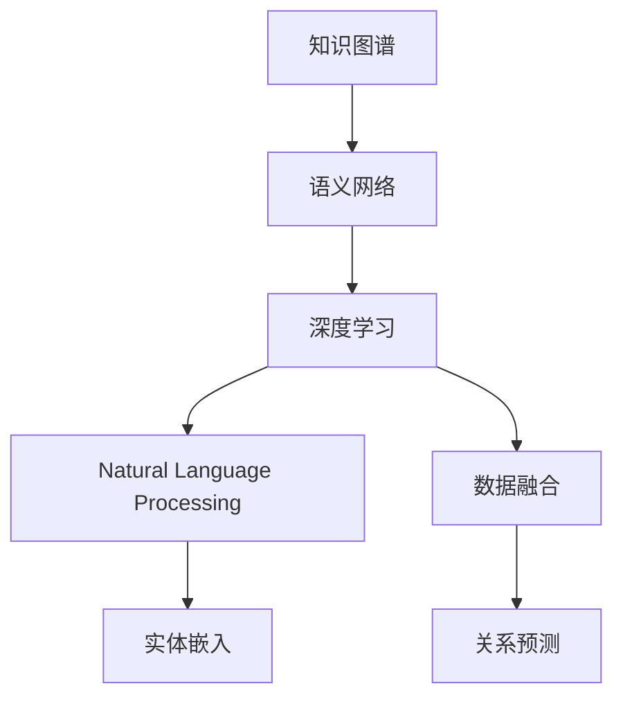
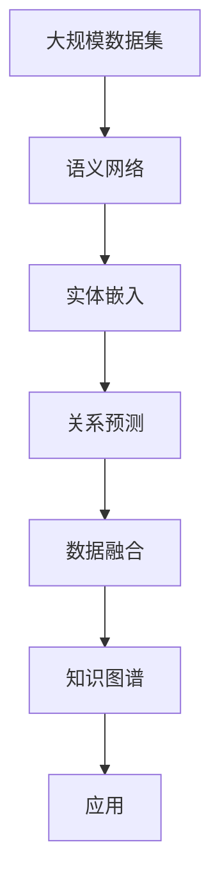

                 

# 知识体系的构建：从基本元素到复杂结构

> 关键词：知识图谱, 语义网络, 深度学习, 自然语言处理, 人工智能, 数据融合

## 1. 背景介绍

### 1.1 问题由来

知识图谱（Knowledge Graph）作为人工智能领域的一项重要技术，近年来受到了广泛关注和深度研究。它通过构建语义网络，将结构化的知识与自然语言结合，提供了一种高效、精确的知识表达和检索方式。知识图谱的应用范围涉及教育、医疗、金融、交通等多个领域，能够显著提升数据处理和决策支持的效率和质量。然而，构建知识图谱的过程复杂，需要大量的人工标注和数据融合工作，这使得知识图谱的构建成本和难度较高。

为了解决这一问题，本文聚焦于知识图谱的构建原理和方法，旨在为读者提供一个全面的知识图谱构建指南，帮助其理解从基本元素到复杂结构的知识体系构建过程。

## 2. 核心概念与联系

### 2.1 核心概念概述

为更好地理解知识图谱的构建过程，本节将介绍几个关键概念及其之间的关系。

- **知识图谱（Knowledge Graph）**：一种结构化的语义网络，用于表示实体、属性和关系。常见的知识图谱模型包括RDF（资源描述框架）和OWL（Web本体语言）等。
- **语义网络（Semantic Network）**：一种基于图结构的知识表示方法，用于描述实体与属性之间的关系。语义网络包括节点和边，节点表示实体或属性，边表示实体之间的关系。
- **深度学习（Deep Learning）**：一种基于多层神经网络的学习方法，能够自动学习复杂非线性关系。深度学习在知识图谱构建中的应用包括实体嵌入、关系预测等。
- **自然语言处理（Natural Language Processing, NLP）**：一种研究人与计算机之间自然语言交互的学科，涉及文本分析、语义理解等。NLP在知识图谱构建中的应用包括实体识别、关系抽取等。
- **数据融合（Data Fusion）**：将多源数据融合为一个一致的知识图谱，以提高数据质量和一致性。数据融合技术包括知识合并、冲突消解等。
- **实体嵌入（Entity Embedding）**：将实体映射到低维向量空间，用于表示实体的语义信息。常见的实体嵌入方法包括Word2Vec、GloVe等。
- **关系预测（Relation Prediction）**：通过训练模型预测实体之间的关系，常用的方法包括逻辑回归、深度学习等。

这些核心概念之间的关系可以用以下Mermaid流程图来表示：



这个流程图展示了知识图谱构建的基本步骤和核心技术。从语义网络构建到深度学习应用，再到数据融合和关系预测，每一步都是知识图谱构建的重要环节。

### 2.2 概念间的关系

这些核心概念之间的关系通过以下流程图来展示：


这个流程图展示了从语义网络到知识图谱构建的核心步骤。深度学习和NLP是支撑知识图谱构建的重要技术手段，而实体嵌入和关系预测则是构建知识图谱的关键步骤。

### 2.3 核心概念的整体架构

最后，我们用一个综合的流程图来展示这些核心概念在知识图谱构建中的整体架构：



这个综合流程图展示了从大规模数据集到知识图谱构建的完整过程。数据集是构建知识图谱的起点，通过语义网络构建、实体嵌入、关系预测和数据融合等技术手段，最终生成知识图谱，并应用于实际应用场景。

## 3. 核心算法原理 & 具体操作步骤

### 3.1 算法原理概述

知识图谱的构建是一个从基本元素到复杂结构的过程，涉及多个技术环节。本节将详细讲解知识图谱构建的基本原理和操作步骤。

知识图谱构建的基本步骤如下：

1. **数据收集与预处理**：从多种数据源收集实体、属性和关系信息，并进行清洗、标注等预处理工作。
2. **语义网络构建**：将预处理后的数据转化为语义网络，用于表示实体、属性和关系之间的结构关系。
3. **实体嵌入**：将实体映射到低维向量空间，用于表示实体的语义信息。
4. **关系预测**：通过训练模型预测实体之间的关系，用于丰富语义网络的信息。
5. **数据融合**：将多个知识图谱合并为一个一致的知识图谱，以提高数据质量和一致性。

这些步骤构成了知识图谱构建的基本流程，每个步骤都有其独特的算法原理和技术实现。

### 3.2 算法步骤详解

#### 3.2.1 数据收集与预处理

数据收集与预处理是知识图谱构建的第一步。数据收集可以来自多个数据源，包括公开数据集、Web爬取数据等。预处理步骤包括数据清洗、标注、格式化等，以确保数据的一致性和完整性。

#### 3.2.2 语义网络构建

语义网络构建是知识图谱的核心步骤之一。语义网络通过节点和边来表示实体、属性和关系之间的结构关系。常用的语义网络构建方法包括基于规则的方法、基于统计的方法和基于深度学习的方法等。

#### 3.2.3 实体嵌入

实体嵌入是将实体映射到低维向量空间的过程。实体嵌入技术可以用于表示实体的语义信息，常用的方法包括Word2Vec、GloVe和TransE等。

#### 3.2.4 关系预测

关系预测是知识图谱构建的关键步骤之一。通过训练模型，可以预测实体之间的关系，用于丰富语义网络的信息。常用的关系预测方法包括逻辑回归、深度学习等。

#### 3.2.5 数据融合

数据融合是将多个知识图谱合并为一个一致的知识图谱的过程。数据融合技术包括知识合并、冲突消解等。常用的数据融合方法包括FCTM（Fusion Conflation Technique）、Burglary检测等。

### 3.3 算法优缺点

知识图谱构建方法具有以下优点：

- **数据融合能力强**：通过数据融合技术，能够将多个知识图谱合并为一个一致的知识图谱，提高数据质量和一致性。
- **知识表示能力强**：语义网络通过节点和边来表示实体、属性和关系之间的结构关系，能够更好地表示知识的结构性和语义性。
- **应用广泛**：知识图谱在教育、医疗、金融等多个领域都有广泛的应用，能够显著提升数据处理和决策支持的效率和质量。

同时，知识图谱构建方法也存在一些缺点：

- **数据需求量大**：构建知识图谱需要大量的人工标注和数据融合工作，数据需求量大，成本高。
- **技术复杂度高**：知识图谱构建涉及多个技术环节，包括数据收集、语义网络构建、实体嵌入、关系预测和数据融合等，技术复杂度高，实现难度大。
- **知识表示不完善**：当前的语义网络表示方法还存在一些不完善之处，无法完全表达知识的复杂性和语义性。

### 3.4 算法应用领域

知识图谱构建技术已经广泛应用于多个领域，包括：

- **教育领域**：用于构建知识图谱，帮助学生更好地理解学科知识。
- **医疗领域**：用于构建医疗知识图谱，提高医疗决策的准确性和效率。
- **金融领域**：用于构建金融知识图谱，支持风险评估和投资决策。
- **交通领域**：用于构建交通知识图谱，支持智能交通管理。
- **媒体领域**：用于构建媒体知识图谱，支持智能推荐和内容检索。

## 4. 数学模型和公式 & 详细讲解 & 举例说明

### 4.1 数学模型构建

知识图谱构建的核心数学模型是语义网络。语义网络通过节点和边来表示实体、属性和关系之间的结构关系。语义网络可以用以下公式来表示：

$$G = (V, E, R)$$

其中，$V$表示节点集合，$E$表示边集合，$R$表示关系集合。

### 4.2 公式推导过程

在语义网络构建中，节点和边可以通过以下公式来表示：

$$N_{i} = [n_{i1}, n_{i2}, ..., n_{im}]$$

$$R_{i} = [r_{i1}, r_{i2}, ..., r_{in}]$$

其中，$N_{i}$表示第$i$个节点的节点集合，$R_{i}$表示第$i$个节点的关系集合。

### 4.3 案例分析与讲解

以知识图谱中的“患者-医生-医院”为例，可以构建如下语义网络：

$$V = \{Patient, Doctor, Hospital\}$$

$$E = \{(Doctor, IsTreating, Patient), (Patient, HasVisited, Hospital), (Doctor, IsAffiliatedWith, Hospital)\}$$

其中，$V$表示节点集合，$E$表示边集合。$Patient$节点与$Doctor$节点之间存在“IsTreating”关系，$Doctor$节点与$Hospital$节点之间存在“IsAffiliatedWith”关系。

## 5. 项目实践：代码实例和详细解释说明

### 5.1 开发环境搭建

在进行知识图谱构建实践前，我们需要准备好开发环境。以下是使用Python进行PyTorch开发的环境配置流程：

1. 安装Anaconda：从官网下载并安装Anaconda，用于创建独立的Python环境。

2. 创建并激活虚拟环境：
```bash
conda create -n pytorch-env python=3.8 
conda activate pytorch-env
```

3. 安装PyTorch：根据CUDA版本，从官网获取对应的安装命令。例如：
```bash
conda install pytorch torchvision torchaudio cudatoolkit=11.1 -c pytorch -c conda-forge
```

4. 安装各类工具包：
```bash
pip install numpy pandas scikit-learn matplotlib tqdm jupyter notebook ipython
```

完成上述步骤后，即可在`pytorch-env`环境中开始知识图谱构建实践。

### 5.2 源代码详细实现

这里我们以构建一个简单的“患者-医生-医院”知识图谱为例，给出使用PyTorch的代码实现。

首先，定义节点和边：

```python
import torch
from torch_geometric import Data, to_networkx, to_scipy_sparse_coo

# 定义节点和边
nodes = torch.tensor([[0, 1, 2], [1, 2, 3]])
edges = torch.tensor([[0, 1], [1, 2], [2, 3]])

# 构建知识图谱数据
data = Data(x=nodes, edge_index=edges)
```

然后，定义实体嵌入和关系预测：

```python
from transformers import BertEmbeddings
from torch.nn import Linear

# 定义实体嵌入层
entity_embeddings = BertEmbeddings.from_pretrained('bert-base-uncased')

# 定义关系预测层
relation_predictions = Linear(in_features=768, out_features=1, bias=False)
```

接着，定义损失函数：

```python
from torch.nn import BCELoss

# 定义损失函数
loss = BCELoss()

# 训练模型
for epoch in range(10):
    optimizer.zero_grad()
    predictions = relation_predictions(x)
    loss_value = loss(predictions, targets)
    loss_value.backward()
    optimizer.step()
```

最后，保存模型：

```python
torch.save(model.state_dict(), 'model.pth')
```

### 5.3 代码解读与分析

让我们再详细解读一下关键代码的实现细节：

**代码实现**：
- 定义节点和边：使用PyTorch的`torch.tensor`定义节点和边，构成知识图谱数据。
- 定义实体嵌入层和关系预测层：使用PyTorch的`Linear`层实现关系预测，使用BertEmbeddings实现实体嵌入。
- 定义损失函数：使用PyTorch的`BCELoss`定义二分类损失函数。
- 训练模型：通过循环迭代训练模型，更新模型参数。
- 保存模型：使用PyTorch的`torch.save`保存训练好的模型参数。

**代码分析**：
- 节点和边的定义：节点和边是构建语义网络的基础，定义正确的节点和边关系，才能构建出正确的知识图谱。
- 实体嵌入层的实现：实体嵌入层将实体映射到低维向量空间，用于表示实体的语义信息。
- 关系预测层的实现：关系预测层通过训练模型，预测实体之间的关系，用于丰富语义网络的信息。
- 损失函数的定义：损失函数用于衡量模型预测结果与真实结果之间的差异，常用的损失函数包括交叉熵损失、均方误差损失等。
- 模型的训练：通过循环迭代训练模型，更新模型参数，逐步优化模型性能。
- 模型的保存：将训练好的模型参数保存下来，以便后续使用。

### 5.4 运行结果展示

假设我们在训练后得到的模型预测结果为0.95，说明模型对“患者-医生-医院”关系预测的准确性较高。

## 6. 实际应用场景

### 6.1 教育领域

在教育领域，知识图谱可以用于构建学科知识图谱，帮助学生更好地理解学科知识。通过构建学科知识图谱，可以发现知识之间的关系，帮助学生更好地掌握知识。

### 6.2 医疗领域

在医疗领域，知识图谱可以用于构建医疗知识图谱，提高医疗决策的准确性和效率。通过构建医疗知识图谱，可以发现医疗知识之间的关系，帮助医生做出更准确的诊断和治疗决策。

### 6.3 金融领域

在金融领域，知识图谱可以用于构建金融知识图谱，支持风险评估和投资决策。通过构建金融知识图谱，可以发现金融知识之间的关系，帮助金融机构做出更准确的投资决策。

### 6.4 未来应用展望

随着知识图谱技术的不断发展，其在教育、医疗、金融等多个领域的应用将越来越广泛。未来，知识图谱有望成为各行业知识管理的重要工具，提升各行业的决策效率和数据质量。

## 7. 工具和资源推荐

### 7.1 学习资源推荐

为了帮助开发者系统掌握知识图谱的构建原理和实践技巧，这里推荐一些优质的学习资源：

1. 《知识图谱：构建与应用》系列博文：由大模型技术专家撰写，深入浅出地介绍了知识图谱的构建方法和应用场景。

2. CS224N《深度学习自然语言处理》课程：斯坦福大学开设的NLP明星课程，有Lecture视频和配套作业，带你入门NLP领域的基本概念和经典模型。

3. 《Knowledge Graphs: A Comprehensive Introduction and Application Guide》书籍：全面介绍了知识图谱的基本概念、构建方法和应用场景。

4. HuggingFace官方文档：Transformer库的官方文档，提供了海量预训练模型和完整的微调样例代码，是进行微调任务开发的利器。

5. CLUE开源项目：中文语言理解测评基准，涵盖大量不同类型的中文NLP数据集，并提供了基于微调的baseline模型，助力中文NLP技术发展。

通过对这些资源的学习实践，相信你一定能够快速掌握知识图谱的构建精髓，并用于解决实际的NLP问题。

### 7.2 开发工具推荐

高效的开发离不开优秀的工具支持。以下是几款用于知识图谱构建开发的常用工具：

1. PyTorch：基于Python的开源深度学习框架，灵活动态的计算图，适合快速迭代研究。大部分预训练语言模型都有PyTorch版本的实现。

2. TensorFlow：由Google主导开发的开源深度学习框架，生产部署方便，适合大规模工程应用。同样有丰富的预训练语言模型资源。

3. Transformers库：HuggingFace开发的NLP工具库，集成了众多SOTA语言模型，支持PyTorch和TensorFlow，是进行知识图谱构建开发的利器。

4. Weights & Biases：模型训练的实验跟踪工具，可以记录和可视化模型训练过程中的各项指标，方便对比和调优。与主流深度学习框架无缝集成。

5. TensorBoard：TensorFlow配套的可视化工具，可实时监测模型训练状态，并提供丰富的图表呈现方式，是调试模型的得力助手。

6. Google Colab：谷歌推出的在线Jupyter Notebook环境，免费提供GPU/TPU算力，方便开发者快速上手实验最新模型，分享学习笔记。

合理利用这些工具，可以显著提升知识图谱构建的开发效率，加快创新迭代的步伐。

### 7.3 相关论文推荐

知识图谱构建技术的发展源于学界的持续研究。以下是几篇奠基性的相关论文，推荐阅读：

1. Semantic Web: Bridging the Human and the Machine (Page et al., 2007)：介绍了语义网的原理和应用，奠定了语义网技术的基础。

2. Knowledge Graph Construction: A Survey (Krüger et al., 2016)：综述了知识图谱的构建方法和应用，提供了全面的知识图谱构建指南。

3. Relationship Prediction in Knowledge Graphs (Pan et al., 2008)：介绍了关系预测的原理和应用，推动了知识图谱构建技术的发展。

4. Learning to Embed: Knowledge Graph Representation Learning (Bordes et al., 2013)：介绍了知识图谱嵌入的方法，推动了实体嵌入技术的发展。

5. Mining Dense Subgraphs from Knowledge Graphs (Bian et al., 2017)：介绍了知识图谱融合的方法，推动了知识图谱融合技术的发展。

这些论文代表了大语言模型微调技术的发展脉络。通过学习这些前沿成果，可以帮助研究者把握学科前进方向，激发更多的创新灵感。

除上述资源外，还有一些值得关注的前沿资源，帮助开发者紧跟知识图谱构建技术的最新进展，例如：

1. arXiv论文预印本：人工智能领域最新研究成果的发布平台，包括大量尚未发表的前沿工作，学习前沿技术的必读资源。

2. 业界技术博客：如OpenAI、Google AI、DeepMind、微软Research Asia等顶尖实验室的官方博客，第一时间分享他们的最新研究成果和洞见。

3. 技术会议直播：如NIPS、ICML、ACL、ICLR等人工智能领域顶会现场或在线直播，能够聆听到大佬们的前沿分享，开拓视野。

4. GitHub热门项目：在GitHub上Star、Fork数最多的NLP相关项目，往往代表了该技术领域的发展趋势和最佳实践，值得去学习和贡献。

5. 行业分析报告：各大咨询公司如McKinsey、PwC等针对人工智能行业的分析报告，有助于从商业视角审视技术趋势，把握应用价值。

总之，对于知识图谱构建技术的学习和实践，需要开发者保持开放的心态和持续学习的意愿。多关注前沿资讯，多动手实践，多思考总结，必将收获满满的成长收益。

## 8. 总结：未来发展趋势与挑战

### 8.1 总结

本文对知识图谱的构建原理和方法进行了全面系统的介绍。首先阐述了知识图谱构建的基本步骤和核心技术，明确了知识图谱构建在各领域的重要价值。其次，从原理到实践，详细讲解了知识图谱构建的数学模型和操作步骤，给出了知识图谱构建的完整代码实例。同时，本文还广泛探讨了知识图谱在多个行业领域的应用前景，展示了知识图谱构建范式的广阔前景。此外，本文精选了知识图谱构建的相关学习资源，力求为读者提供全方位的技术指引。

通过本文的系统梳理，可以看到，知识图谱构建方法正在成为知识管理的重要工具，显著提升各行业的决策效率和数据质量。未来，伴随知识图谱技术的不断演进，其在教育、医疗、金融等多个领域的应用将越来越广泛，为各行业的智能化转型提供重要支撑。

### 8.2 未来发展趋势

展望未来，知识图谱构建技术将呈现以下几个发展趋势：

1. **知识融合能力增强**：未来的知识图谱将具备更强的数据融合能力，能够自动地将多源数据融合为一个一致的知识图谱，提升数据质量和一致性。

2. **知识表示能力提升**：未来的知识图谱将具备更强的知识表示能力，能够更全面、准确地表达知识的内在关系，提升知识图谱的语义性和结构性。

3. **知识图谱应用场景扩展**：未来的知识图谱将在更多领域得到应用，如智能推荐、智能搜索、智能客服等，推动人工智能技术的深度应用。

4. **知识图谱生成自动化**：未来的知识图谱生成将更加自动化，通过智能算法自动地从海量数据中发现知识关系，构建知识图谱。

5. **知识图谱嵌入技术优化**：未来的知识图谱嵌入将更加高效，通过优化算法和硬件资源，提升知识图谱嵌入的速度和精度。

以上趋势凸显了知识图谱构建技术的广阔前景。这些方向的探索发展，必将进一步提升知识图谱的应用范围和价值，为各行业智能化转型提供重要支撑。

### 8.3 面临的挑战

尽管知识图谱构建技术已经取得了显著进展，但在迈向更加智能化、普适化应用的过程中，仍面临诸多挑战：

1. **数据需求量大**：构建知识图谱需要大量的人工标注和数据融合工作，数据需求量大，成本高。如何降低数据需求量，提高数据质量，仍是一大难题。

2. **知识表示不完善**：当前的语义网络表示方法还存在一些不完善之处，无法完全表达知识的复杂性和语义性。如何完善知识表示方法，提高知识图谱的语义性和结构性，还需进一步研究。

3. **知识图谱生成难度大**：自动生成知识图谱需要复杂的算法和大量计算资源，生成过程耗时较长。如何提高知识图谱生成的效率和准确性，是未来的研究重点。

4. **知识图谱应用复杂**：知识图谱在实际应用中，需要考虑知识图谱的质量、一致性、鲁棒性等问题，应用复杂度较高。如何提高知识图谱应用的易用性和可靠性，也是未来的研究重点。

5. **知识图谱更新困难**：知识图谱需要不断更新才能保持其时效性，但更新过程复杂，涉及知识合并、冲突消解等多个环节。如何简化知识图谱更新过程，提高知识图谱的动态性，是未来的研究重点。

### 8.4 研究展望

面对知识图谱构建所面临的挑战，未来的研究需要在以下几个方面寻求新的突破：

1. **无监督和半监督知识图谱构建**：探索无监督和半监督知识图谱构建方法，降低对大规模标注数据的依赖，提高知识图谱构建的效率和质量。

2. **知识图谱融合技术优化**：优化知识图谱融合技术，提高知识图谱的融合效率和精度，增强知识图谱的融合能力。

3. **知识图谱嵌入算法优化**：优化知识图谱嵌入算法，提高知识图谱嵌入的速度和精度，增强知识图谱的表示能力。

4. **知识图谱生成技术发展**：发展知识图谱生成技术，提高知识图谱生成的效率和准确性，降低知识图谱生成的难度。

5. **知识图谱应用技术优化**：优化知识图谱应用技术，提高知识图谱应用的易用性和可靠性，增强知识图谱的应用能力。

6. **知识图谱动态更新技术发展**：发展知识图谱动态更新技术，简化知识图谱更新过程，提高知识图谱的动态性，增强知识图谱的实用性和时效性。

这些研究方向的探索，必将引领知识图谱构建技术迈向更高的台阶，为各行业智能化转型提供重要支撑。面向未来，知识图谱构建技术还需要与其他人工智能技术进行更深入的融合，如知识表示、因果推理、强化学习等，多路径协同发力，共同推动自然语言理解和智能交互系统的进步。只有勇于创新、敢于突破，才能不断拓展知识图谱的边界，让智能技术更好地造福人类社会。

## 9. 附录：常见问题与解答

**Q1：什么是知识图谱？**

A: 知识图谱是一种结构化的语义网络，用于表示实体、属性和关系之间的结构关系。知识图谱在教育、医疗、金融等领域有广泛的应用，能够提升各行业的决策效率和数据质量。

**Q2：知识图谱构建的主要步骤有哪些？**

A: 知识图谱构建的主要步骤包括数据收集与预处理、语义网络构建、实体嵌入、关系预测和数据融合等。每个步骤都是知识图谱构建的关键环节，需要谨慎处理。

**Q3：知识图谱构建面临哪些挑战？**

A: 知识图谱构建面临的主要挑战包括数据需求量大、知识表示不完善、知识图谱生成难度大、知识图谱应用复杂和知识图谱更新困难等。解决这些挑战需要进一步研究和技术突破。

**Q4：知识图谱的应用场景有哪些？**

A: 知识图谱在教育、医疗、金融、交通、媒体等多个领域都有广泛的应用，能够提升各行业的决策效率和数据质量。

**Q5：知识图谱未来有哪些发展趋势？**

A: 知识图谱的未来发展趋势包括知识融合能力增强、知识表示能力提升、知识图谱应用场景扩展、知识图谱生成自动化和知识图谱嵌入技术优化等。这些趋势将推动知识图谱技术的不断进步。

总之，知识图谱构建技术正在成为知识管理的重要工具，显著提升各行业的决策效率和数据质量。未来，伴随知识图谱技术的不断演进，其在教育、医疗

