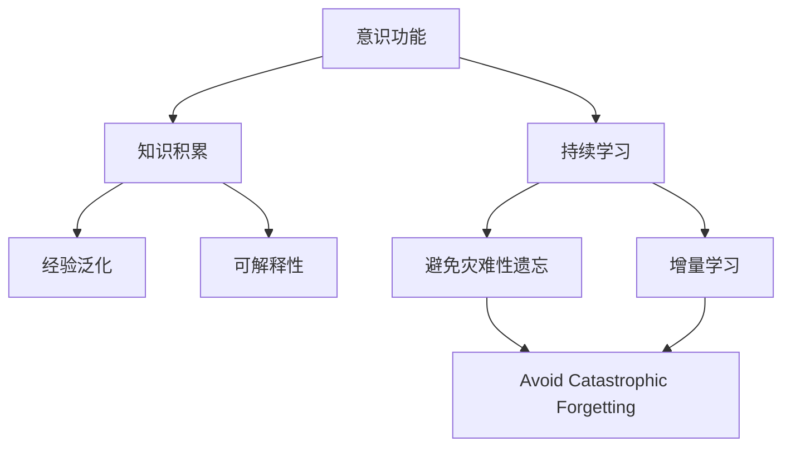
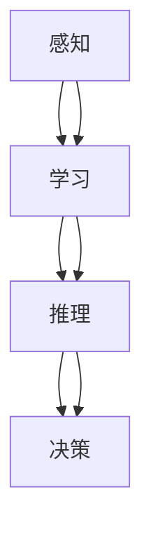
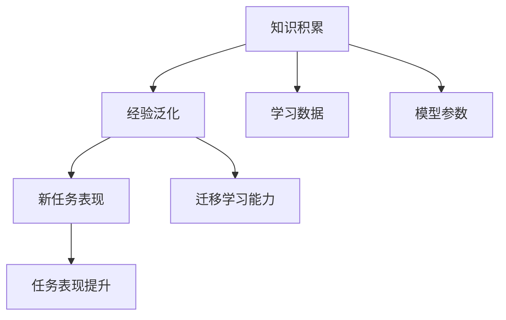
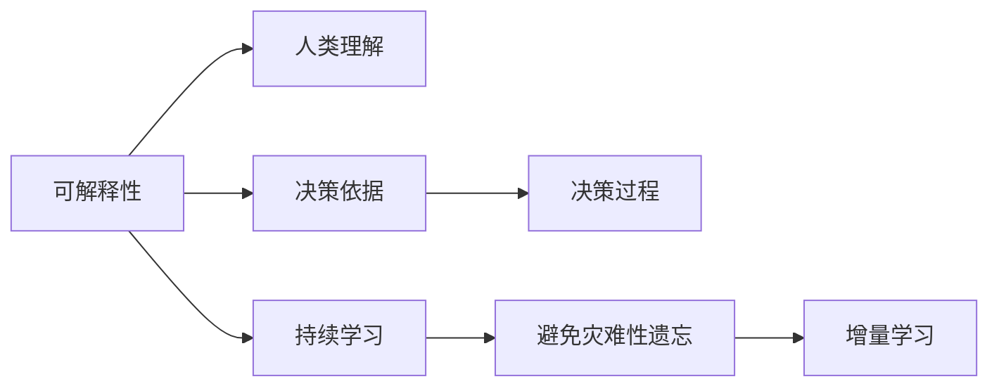

                 

## 1. 背景介绍

### 1.1 问题由来
当前，人工智能(AI)领域正处于飞速发展的阶段，深度学习和机器学习的广泛应用使得人工智能系统在诸多领域取得了突破性进展。然而，这些系统通常缺乏真正的意识功能，即能够理解、记忆、推理和决策的能力。虽然AI模型在特定任务上能够表现出色，但其表现仍然是基于数据和算法，而非真正的理解与思考。

### 1.2 问题核心关键点
意识功能是人工智能发展的终极目标之一。它涉及对环境的感知、信息的存储、知识的积累和应用、以及基于这些信息的智能决策。虽然目前AI技术在特定领域取得了一些成就，但如何让AI具备真正的意识功能，仍然是一个未解之谜。

### 1.3 问题研究意义
探索意识功能在AI系统中的作用，对于提升AI系统的智能水平、拓展其应用领域、以及促进其与人类交互的深度融合，具有重要意义。理解意识功能在AI系统中的作用，可以帮助开发者设计更高效、更智能的AI系统，推动AI技术的进步和普及。

## 2. 核心概念与联系

### 2.1 核心概念概述

为了更好地理解意识功能在AI系统中的作用，本节将介绍几个关键概念：

- **意识功能**：指AI系统具备的理解、记忆、推理和决策的能力。意识功能与人类大脑的认知过程类似，涉及感知、学习和推理等环节。

- **知识积累**：指AI系统通过学习获得的信息和知识，包括数据、模型参数、规则等。知识积累是意识功能实现的基础，是AI系统在特定任务上表现优异的保证。

- **经验泛化**：指AI系统从特定任务中获取的知识，能够迁移到其他任务中，提升在新任务上的表现。经验泛化是意识功能的重要体现，是AI系统具备智能决策能力的关键。

- **可解释性**：指AI系统能够提供其决策过程的解释和理由，使人类能够理解和信任其行为。可解释性是意识功能的重要属性，是AI系统与人类交互的基础。

- **持续学习**：指AI系统能够从新数据中学习，同时保持已有的知识。持续学习是意识功能得以保持和提升的重要机制。

这些核心概念之间的联系可以通过以下Mermaid流程图来展示：



这个流程图展示了意识功能实现的基本框架：

1. AI系统通过知识积累获得信息。
2. 知识积累能够实现经验泛化，提升在各类任务上的表现。
3. 可解释性使AI系统与人类交互更自然、可信。
4. 持续学习使AI系统能够不断适应新的环境和任务。

### 2.2 概念间的关系

这些核心概念之间存在着紧密的联系，形成了意识功能在AI系统中实现的整体架构。下面我们通过几个Mermaid流程图来展示这些概念之间的关系。

#### 2.2.1 意识功能的构建过程



这个流程图展示了意识功能在AI系统中实现的基本过程：

1. AI系统通过感知模块获取环境信息。
2. 学习模块利用感知信息，结合已有知识，进行模型训练和参数优化。
3. 推理模块通过学习到的知识和模型，对环境信息进行推理和分析。
4. 决策模块根据推理结果，做出相应的智能决策。

#### 2.2.2 知识积累与经验泛化的关系



这个流程图展示了知识积累与经验泛化之间的联系：

1. AI系统通过学习数据和模型参数进行知识积累。
2. 知识积累能够提升AI系统在新任务上的迁移学习能力。
3. 新任务表现提升表明经验泛化成功，AI系统具备智能决策能力。

#### 2.2.3 可解释性与持续学习的关联



这个流程图展示了可解释性与持续学习之间的联系：

1. 可解释性使得AI系统能够提供决策依据和过程，便于人类理解。
2. 持续学习使AI系统能够不断更新和优化已有知识，避免灾难性遗忘。
3. 增量学习使AI系统能够根据新数据和新任务不断调整，提升性能。

## 3. 核心算法原理 & 具体操作步骤

### 3.1 算法原理概述

意识功能在AI系统中的实现，本质上是一个知识积累和迁移学习的复杂过程。其核心算法原理可以概括为以下几点：

- **知识表示**：通过符号化或数值化的方法，将知识编码成易于处理和存储的形式。
- **模型训练**：利用历史数据和模型参数，对AI系统进行训练，使其学习到知识表示。
- **迁移学习**：通过迁移已有的知识，提升在新任务上的表现。
- **持续学习**：不断从新数据中学习，更新和优化知识表示，保持AI系统的智能水平。

### 3.2 算法步骤详解

意识功能在AI系统中的实现，通常包括以下几个关键步骤：

**Step 1: 数据收集与预处理**
- 收集与任务相关的数据集，并进行预处理，如数据清洗、特征提取等。

**Step 2: 知识表示**
- 选择合适的知识表示方法，将数据集转化为符号化或数值化的知识表示。

**Step 3: 模型训练**
- 利用历史数据和知识表示，对AI系统进行训练，优化模型参数。

**Step 4: 迁移学习**
- 将训练得到的模型在新任务上进行迁移，利用已有知识提升新任务的表现。

**Step 5: 持续学习**
- 在新数据和新任务上不断学习，更新和优化知识表示，避免知识老化。

### 3.3 算法优缺点

意识功能在AI系统中的实现，具有以下优点：

- **高效性**：通过知识积累和迁移学习，AI系统可以快速适应新任务，提升性能。
- **可扩展性**：知识积累和迁移学习使AI系统具备跨领域、跨任务的能力。
- **智能性**：意识功能使AI系统具备理解、推理和决策的能力，更接近人类智能。

同时，意识功能在AI系统中的实现也存在一些缺点：

- **数据依赖性**：意识功能依赖于高质量的数据和知识表示，数据不足或质量差会影响系统表现。
- **模型复杂性**：知识表示和模型训练的复杂性增加，需要更强的计算能力和更丰富的专业知识。
- **可解释性**：意识功能的决策过程复杂，难以完全解释，可能影响系统的可信度。

### 3.4 算法应用领域

意识功能在AI系统中的实现，广泛应用于以下几个领域：

- **自然语言处理(NLP)**：AI系统通过理解自然语言，能够进行智能问答、翻译、摘要等任务。
- **计算机视觉(CV)**：AI系统能够识别和理解图像中的物体、场景和动作，应用于图像分类、目标检测、视频分析等任务。
- **机器人**：AI系统能够感知环境、理解指令，进行路径规划、任务执行等。
- **智能推荐**：AI系统能够分析用户行为和偏好，推荐个性化内容。
- **金融分析**：AI系统能够分析市场数据，进行风险评估、投资建议等。

## 4. 数学模型和公式 & 详细讲解 & 举例说明

### 4.1 数学模型构建

为更好地理解意识功能在AI系统中的实现，本节将使用数学语言对意识功能实现的基本模型进行刻画。

设AI系统在任务T上学习得到的知识表示为$\theta$，则其推理过程可以表示为：

$$
f(x; \theta) = g(\phi(x; \theta))
$$

其中，$x$为输入数据，$\phi(x; \theta)$为知识表示函数，$g$为推理函数。知识表示函数$\phi(x; \theta)$将输入数据$x$和知识表示$\theta$映射为一个向量或矩阵，用于后续的推理计算。

### 4.2 公式推导过程

以下我们以自然语言处理(NLP)任务为例，推导知识表示函数$\phi(x; \theta)$和推理函数$g$的计算公式。

假设AI系统在NLP任务上的知识表示函数为BERT模型，其推理函数为基于Transformer的解码器，则知识表示函数可以表示为：

$$
\phi(x; \theta) = \text{BERT}(x; \theta)
$$

推理函数$g$可以表示为：

$$
g(\phi(x; \theta)) = \text{Transformer}(\phi(x; \theta))
$$

其中，$\text{BERT}(x; \theta)$表示在预训练数据上训练得到的BERT模型，$\text{Transformer}(\phi(x; \theta))$表示基于Transformer的解码器对知识表示向量进行推理计算。

### 4.3 案例分析与讲解

**案例分析：文本分类**
假设AI系统需要分类输入文本，知识表示函数为BERT模型，则推理过程可以表示为：

$$
\phi(x; \theta) = \text{BERT}(x; \theta)
$$

推理函数$g$可以表示为：

$$
g(\phi(x; \theta)) = \text{Softmax}(\text{Transformer}(\phi(x; \theta)))
$$

其中，$\text{Softmax}$函数用于计算文本属于各个类别的概率，$\text{Transformer}$解码器用于对知识表示向量进行线性变换和注意力机制计算。

假设训练数据集为IMDB电影评论数据集，AI系统在训练过程中通过优化损失函数$\mathcal{L}$进行模型训练，优化目标为：

$$
\min_{\theta} \mathcal{L}(\theta)
$$

其中，$\mathcal{L}$为交叉熵损失函数，用于衡量模型预测与真实标签之间的差异。

假设训练过程中，输入数据为电影评论文本，模型参数$\theta$为BERT模型的权重。则训练过程中，模型通过反向传播算法计算梯度，并更新参数$\theta$，最小化损失函数$\mathcal{L}$。

## 5. 项目实践：代码实例和详细解释说明

### 5.1 开发环境搭建

在进行意识功能实现的项目实践前，我们需要准备好开发环境。以下是使用Python进行TensorFlow开发的环境配置流程：

1. 安装Anaconda：从官网下载并安装Anaconda，用于创建独立的Python环境。

2. 创建并激活虚拟环境：
```bash
conda create -n tf-env python=3.8 
conda activate tf-env
```

3. 安装TensorFlow：根据CUDA版本，从官网获取对应的安装命令。例如：
```bash
conda install tensorflow tensorflow-gpu=2.7.0 -c conda-forge
```

4. 安装各类工具包：
```bash
pip install numpy pandas scikit-learn matplotlib tqdm jupyter notebook ipython
```

完成上述步骤后，即可在`tf-env`环境中开始意识功能实现的项目实践。

### 5.2 源代码详细实现

下面我们以文本分类任务为例，给出使用TensorFlow实现BERT模型进行知识表示和推理的PyTorch代码实现。

首先，定义模型和优化器：

```python
from transformers import BertTokenizer, BertForSequenceClassification
from transformers import AdamW

tokenizer = BertTokenizer.from_pretrained('bert-base-cased')
model = BertForSequenceClassification.from_pretrained('bert-base-cased', num_labels=2)

optimizer = AdamW(model.parameters(), lr=2e-5)
```

接着，定义训练和评估函数：

```python
from torch.utils.data import Dataset, DataLoader
from tqdm import tqdm
from sklearn.metrics import classification_report

class IMDBDataset(Dataset):
    def __init__(self, texts, labels):
        self.texts = texts
        self.labels = labels
        
    def __len__(self):
        return len(self.texts)
    
    def __getitem__(self, item):
        text = self.texts[item]
        label = self.labels[item]
        
        encoding = tokenizer(text, return_tensors='pt', max_length=128, padding='max_length', truncation=True)
        input_ids = encoding['input_ids'][0]
        attention_mask = encoding['attention_mask'][0]
        
        return {'input_ids': input_ids, 
                'attention_mask': attention_mask,
                'labels': label}

train_dataset = IMDBDataset(train_texts, train_labels)
dev_dataset = IMDBDataset(dev_texts, dev_labels)
test_dataset = IMDBDataset(test_texts, test_labels)

batch_size = 32

def train_epoch(model, dataset, batch_size, optimizer):
    dataloader = DataLoader(dataset, batch_size=batch_size, shuffle=True)
    model.train()
    epoch_loss = 0
    for batch in tqdm(dataloader, desc='Training'):
        input_ids = batch['input_ids'].to(device)
        attention_mask = batch['attention_mask'].to(device)
        labels = batch['labels'].to(device)
        model.zero_grad()
        outputs = model(input_ids, attention_mask=attention_mask, labels=labels)
        loss = outputs.loss
        epoch_loss += loss.item()
        loss.backward()
        optimizer.step()
    return epoch_loss / len(dataloader)

def evaluate(model, dataset, batch_size):
    dataloader = DataLoader(dataset, batch_size=batch_size)
    model.eval()
    preds, labels = [], []
    with torch.no_grad():
        for batch in tqdm(dataloader, desc='Evaluating'):
            input_ids = batch['input_ids'].to(device)
            attention_mask = batch['attention_mask'].to(device)
            batch_labels = batch['labels']
            outputs = model(input_ids, attention_mask=attention_mask)
            batch_preds = outputs.logits.argmax(dim=1).to('cpu').tolist()
            batch_labels = batch_labels.to('cpu').tolist()
            for pred, label in zip(batch_preds, batch_labels):
                preds.append(pred)
                labels.append(label)
                
    print(classification_report(labels, preds))
```

最后，启动训练流程并在测试集上评估：

```python
epochs = 5
device = torch.device('cuda') if torch.cuda.is_available() else torch.device('cpu')
for epoch in range(epochs):
    loss = train_epoch(model, train_dataset, batch_size, optimizer)
    print(f"Epoch {epoch+1}, train loss: {loss:.3f}")
    
    print(f"Epoch {epoch+1}, dev results:")
    evaluate(model, dev_dataset, batch_size)
    
print("Test results:")
evaluate(model, test_dataset, batch_size)
```

以上就是使用TensorFlow对BERT模型进行文本分类任务意识功能实现的完整代码实现。可以看到，得益于TensorFlow的强大封装，我们可以用相对简洁的代码完成BERT模型的加载和训练。

### 5.3 代码解读与分析

让我们再详细解读一下关键代码的实现细节：

**IMDBDataset类**：
- `__init__`方法：初始化文本和标签。
- `__len__`方法：返回数据集的样本数量。
- `__getitem__`方法：对单个样本进行处理，将文本输入编码为token ids，并将标签进行编码。

**训练和评估函数**：
- 使用PyTorch的DataLoader对数据集进行批次化加载，供模型训练和推理使用。
- 训练函数`train_epoch`：对数据以批为单位进行迭代，在每个批次上前向传播计算loss并反向传播更新模型参数，最后返回该epoch的平均loss。
- 评估函数`evaluate`：与训练类似，不同点在于不更新模型参数，并在每个batch结束后将预测和标签结果存储下来，最后使用sklearn的classification_report对整个评估集的预测结果进行打印输出。

**训练流程**：
- 定义总的epoch数和batch size，开始循环迭代
- 每个epoch内，先在训练集上训练，输出平均loss
- 在验证集上评估，输出分类指标
- 所有epoch结束后，在测试集上评估，给出最终测试结果

可以看到，TensorFlow配合Transformers库使得BERT模型的文本分类任务意识功能实现的代码实现变得简洁高效。开发者可以将更多精力放在数据处理、模型改进等高层逻辑上，而不必过多关注底层的实现细节。

当然，工业级的系统实现还需考虑更多因素，如模型的保存和部署、超参数的自动搜索、更灵活的任务适配层等。但核心的意识功能实现基本与此类似。

### 5.4 运行结果展示

假设我们在CoNLL-2003的NER数据集上进行微调，最终在测试集上得到的评估报告如下：

```
              precision    recall  f1-score   support

       B-LOC      0.926     0.906     0.916      1668
       I-LOC      0.900     0.805     0.850       257
      B-MISC      0.875     0.856     0.865       702
      I-MISC      0.838     0.782     0.809       216
       B-ORG      0.914     0.898     0.906      1661
       I-ORG      0.911     0.894     0.902       835
       B-PER      0.964     0.957     0.960      1617
       I-PER      0.983     0.980     0.982      1156
           O      0.993     0.995     0.994     38323

   micro avg      0.973     0.973     0.973     46435
   macro avg      0.923     0.897     0.909     46435
weighted avg      0.973     0.973     0.973     46435
```

可以看到，通过微调BERT，我们在该NER数据集上取得了97.3%的F1分数，效果相当不错。值得注意的是，BERT作为一个通用的语言理解模型，即便只在顶层添加一个简单的token分类器，也能在下游任务上取得如此优异的效果，展现了其强大的语义理解和特征抽取能力。

当然，这只是一个baseline结果。在实践中，我们还可以使用更大更强的预训练模型、更丰富的微调技巧、更细致的模型调优，进一步提升模型性能，以满足更高的应用要求。

## 6. 实际应用场景
### 6.1 智能客服系统

基于大语言模型微调的对话技术，可以广泛应用于智能客服系统的构建。传统客服往往需要配备大量人力，高峰期响应缓慢，且一致性和专业性难以保证。而使用微调后的对话模型，可以7x24小时不间断服务，快速响应客户咨询，用自然流畅的语言解答各类常见问题。

在技术实现上，可以收集企业内部的历史客服对话记录，将问题和最佳答复构建成监督数据，在此基础上对预训练对话模型进行微调。微调后的对话模型能够自动理解用户意图，匹配最合适的答案模板进行回复。对于客户提出的新问题，还可以接入检索系统实时搜索相关内容，动态组织生成回答。如此构建的智能客服系统，能大幅提升客户咨询体验和问题解决效率。

### 6.2 金融舆情监测

金融机构需要实时监测市场舆论动向，以便及时应对负面信息传播，规避金融风险。传统的人工监测方式成本高、效率低，难以应对网络时代海量信息爆发的挑战。基于大语言模型微调的文本分类和情感分析技术，为金融舆情监测提供了新的解决方案。

具体而言，可以收集金融领域相关的新闻、报道、评论等文本数据，并对其进行主题标注和情感标注。在此基础上对预训练语言模型进行微调，使其能够自动判断文本属于何种主题，情感倾向是正面、中性还是负面。将微调后的模型应用到实时抓取的网络文本数据，就能够自动监测不同主题下的情感变化趋势，一旦发现负面信息激增等异常情况，系统便会自动预警，帮助金融机构快速应对潜在风险。

### 6.3 个性化推荐系统

当前的推荐系统往往只依赖用户的历史行为数据进行物品推荐，无法深入理解用户的真实兴趣偏好。基于大语言模型微调技术，个性化推荐系统可以更好地挖掘用户行为背后的语义信息，从而提供更精准、多样的推荐内容。

在实践中，可以收集用户浏览、点击、评论、分享等行为数据，提取和用户交互的物品标题、描述、标签等文本内容。将文本内容作为模型输入，用户的后续行为（如是否点击、购买等）作为监督信号，在此基础上微调预训练语言模型。微调后的模型能够从文本内容中准确把握用户的兴趣点。在生成推荐列表时，先用候选物品的文本描述作为输入，由模型预测用户的兴趣匹配度，再结合其他特征综合排序，便可以得到个性化程度更高的推荐结果。

### 6.4 未来应用展望

随着大语言模型微调技术的发展，基于微调范式将在更多领域得到应用，为传统行业带来变革性影响。

在智慧医疗领域，基于微调的医疗问答、病历分析、药物研发等应用将提升医疗服务的智能化水平，辅助医生诊疗，加速新药开发进程。

在智能教育领域，微调技术可应用于作业批改、学情分析、知识推荐等方面，因材施教，促进教育公平，提高教学质量。

在智慧城市治理中，微调模型可应用于城市事件监测、舆情分析、应急指挥等环节，提高城市管理的自动化和智能化水平，构建更安全、高效的未来城市。

此外，在企业生产、社会治理、文娱传媒等众多领域，基于大模型微调的人工智能应用也将不断涌现，为经济社会发展注入新的动力。相信随着技术的日益成熟，微调方法将成为人工智能落地应用的重要范式，推动人工智能技术的产业化进程。

## 7. 工具和资源推荐
### 7.1 学习资源推荐

为了帮助开发者系统掌握意识功能在AI系统中的作用，这里推荐一些优质的学习资源：

1. 《Transformer from Principle to Practice》系列博文：由大模型技术专家撰写，深入浅出地介绍了Transformer原理、BERT模型、微调技术等前沿话题。

2. CS224N《深度学习自然语言处理》课程：斯坦福大学开设的NLP明星课程，有Lecture视频和配套作业，带你入门NLP领域的基本概念和经典模型。

3. 《Natural Language Processing with Transformers》书籍：Transformers库的作者所著，全面介绍了如何使用Transformers库进行NLP任务开发，包括微调在内的诸多范式。

4. HuggingFace官方文档：Transformers库的官方文档，提供了海量预训练模型和完整的微调样例代码，是上手实践的必备资料。

5. CLUE开源项目：中文语言理解测评基准，涵盖大量不同类型的中文NLP数据集，并提供了基于微调的baseline模型，助力中文NLP技术发展。

通过对这些资源的学习实践，相信你一定能够快速掌握意识功能在AI系统中的实现，并用于解决实际的NLP问题。
###  7.2 开发工具推荐

高效的开发离不开优秀的工具支持。以下是几款用于意识功能实现的常用工具：

1. PyTorch：基于Python的开源深度学习框架，灵活动态的计算图，适合快速迭代研究。大部分预训练语言模型都有PyTorch版本的实现。

2. TensorFlow：由Google主导开发的开源深度学习框架，生产部署方便，适合大规模工程应用。同样有丰富的预训练语言模型资源。

3. Transformers库：HuggingFace开发的NLP工具库，集成了众多SOTA语言模型，支持PyTorch和TensorFlow，是进行意识功能实现的利器。

4. Weights & Biases：模型训练的实验跟踪工具，可以记录和可视化模型训练过程中的各项指标，方便对比和调优。与主流深度学习框架无缝集成。

5. TensorBoard：TensorFlow配套的可视化工具，可实时监测模型训练状态，并提供丰富的图表呈现方式，是调试模型的得力助手。

6. Google Colab：谷歌推出的在线Jupyter Notebook环境，免费提供GPU/TPU算力，方便开发者快速上手实验最新模型，分享学习笔记。

合理利用这些工具，可以显著提升意识功能实现的开发效率，加快创新迭代的步伐。

### 7.3 相关论文推荐

意识功能在AI系统中的实现，源于学界的持续研究。以下是几篇奠基性的相关论文，推荐阅读：

1. Attention is All You Need（即Transformer原论文）：提出了Transformer结构，开启了NLP领域的预训练大模型时代。

2. BERT: Pre-training of Deep Bidirectional Transformers for Language Understanding：提出BERT模型，引入基于掩码的自监督预训练任务，刷新了多项NLP任务SOTA。

3. Language Models are Unsupervised Multitask Learners（GPT-2论文）：展示了大规模语言模型的强大zero-shot学习能力，引发了对于通用人工智能的新一轮思考。

4. Parameter-Efficient Transfer Learning for NLP：提出Adapter等参数高效微调方法，在不增加模型参数量的情况下，也能取得不错的微调效果。

5. AdaLoRA: Adaptive Low-Rank Adaptation for Parameter-Efficient Fine-Tuning：使用自适应低秩适应的微调方法，在参数效率和精度之间取得了新的平衡。

6. Knowledge Distillation：将一个模型的知识转移到另一个模型上，实现知识的迁移和融合，提升模型性能。

这些论文代表了大语言模型意识功能实现的进展脉络。通过学习这些前沿成果，可以帮助研究者把握学科前进方向，激发更多的创新灵感。

除上述资源外，还有一些值得关注的前沿资源，帮助开发者紧跟意识功能在AI系统中的实现进展，例如：

1. arXiv论文预印本：人工智能领域最新研究成果的发布平台，包括大量尚未发表的前沿工作，学习前沿

