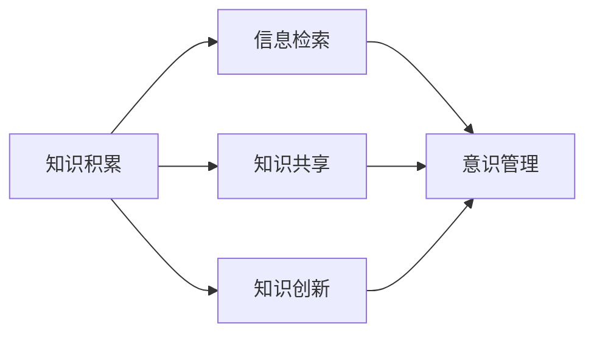

                 

# 知识积累在意识管理中的作用

## 1. 背景介绍

### 1.1 问题由来

在信息爆炸的时代，知识和意识的管理成为重要的主题。知识积累与意识管理密切相关，因为意识管理不仅仅是对信息进行组织、检索和利用，更需要对知识进行积累、筛选和创新。本节将首先介绍知识积累在意识管理中的作用，然后探讨如何构建一个有效的知识积累系统，并说明其对意识管理的影响。

### 1.2 问题核心关键点

知识积累与意识管理的核心关键点包括：
- 知识积累的定义及其在意识管理中的作用。
- 如何构建一个有效的知识积累系统。
- 知识积累对意识管理的影响，包括知识的存储、检索和创新。
- 知识积累系统的实施策略和应用案例。

### 1.3 问题研究意义

理解知识积累在意识管理中的作用，对个人和组织都具有重要意义：
- 提高个人或组织的学习效率和决策能力。
- 优化知识的存储和检索过程，减少信息过载。
- 促进知识的创新和应用，增强竞争力。
- 为教育和培训提供数据支持，提升教育质量。

## 2. 核心概念与联系

### 2.1 核心概念概述

本节将介绍与知识积累和意识管理相关的核心概念及其联系：

#### 2.1.1 知识积累

知识积累是指个体或组织通过阅读、研究、实践等方式，系统地收集、整理、存储各类知识和信息，从而形成知识库。知识积累是意识管理的基础，是实现知识检索、共享和创新的前提。

#### 2.1.2 意识管理

意识管理是指个体或组织对信息、知识和技能等意识的有效管理和利用，以实现信息的高效存储、检索和应用。意识管理的目标是通过知识的积累和创新，提高决策能力和竞争力。

#### 2.1.3 信息检索

信息检索是指通过一定的方法和工具，快速找到所需的信息或知识。信息检索是意识管理的重要环节，是知识积累和应用的关键步骤。

#### 2.1.4 知识共享

知识共享是指将积累的知识和信息通过交流、协作等方式传递给其他个体或组织。知识共享是知识积累和意识管理的重要部分，可以促进知识的传播和应用。

#### 2.1.5 知识创新

知识创新是指通过对现有知识进行分析和整合，产生新的知识和技术。知识创新是知识积累的最终目标，是提升个人和组织竞争力的关键。

### 2.2 概念间的关系

这些核心概念之间的关系可以通过以下Mermaid流程图来展示：



这个流程图展示出知识积累、信息检索、知识共享和知识创新在意识管理中的作用及其相互关系。

## 3. 核心算法原理 & 具体操作步骤

### 3.1 算法原理概述

知识积累和意识管理涉及的算法原理主要包括信息检索算法、知识表示和推理算法、知识共享和协作算法等。下面将对每个核心算法的原理进行概述。

### 3.2 算法步骤详解

#### 3.2.1 信息检索算法

信息检索算法是知识积累和意识管理的基础。其核心步骤包括：
- 构建索引：将文本、图像等数据转换为机器可理解的形式，并建立索引。
- 匹配查询：通过相似度算法（如向量空间模型、TF-IDF等）找到与查询相似的文档或数据。
- 排序和展示：根据检索结果的相关性和重要性，进行排序并展示。

#### 3.2.2 知识表示和推理算法

知识表示和推理算法用于将知识以结构化的形式存储和组织，并支持知识推理。其核心步骤包括：
- 知识表示：将知识以实体、属性、关系等形式进行表示。
- 推理算法：通过规则、逻辑或机器学习模型进行知识推理。

#### 3.2.3 知识共享和协作算法

知识共享和协作算法促进知识在不同个体和组织之间的传递和应用。其核心步骤包括：
- 协作平台：构建知识共享平台，支持文本、图片、视频等多模态数据的共享。
- 协作机制：设计知识共享和协作机制，确保数据的可靠性和安全性。

### 3.3 算法优缺点

#### 3.3.1 信息检索算法的优缺点

优点：
- 能够快速找到所需的信息，提高工作效率。
- 可以处理海量的数据，满足复杂查询需求。

缺点：
- 对数据格式和索引质量要求高，需要进行预处理。
- 对于非结构化数据（如图片、视频）的处理效果不佳。

#### 3.3.2 知识表示和推理算法的优缺点

优点：
- 支持结构化的知识存储和推理，易于理解和应用。
- 可以处理复杂的多关系知识图谱，提供深度推理能力。

缺点：
- 需要大量的预处理和维护工作，构建知识图谱复杂。
- 对数据的表示和推理逻辑要求高，容易出现错误。

#### 3.3.3 知识共享和协作算法的优缺点

优点：
- 促进知识在不同个体和组织之间的传递和应用，提高知识利用率。
- 支持协作学习，提升团队的知识水平。

缺点：
- 需要建立信任机制，确保数据的安全性和隐私保护。
- 协作平台的搭建和管理成本高，需要投入大量资源。

### 3.4 算法应用领域

#### 3.4.1 信息检索

信息检索广泛应用于图书馆、搜索引擎、档案管理等领域。例如，Google Scholar和百度学术等搜索引擎，利用信息检索算法快速找到所需论文和文献。

#### 3.4.2 知识表示和推理

知识表示和推理在科学研究、知识图谱、智能问答等领域有广泛应用。例如，Wikipedia使用知识表示和推理算法支持知识图谱的构建和查询。

#### 3.4.3 知识共享和协作

知识共享和协作在企业知识管理、在线教育、科研协作等领域有广泛应用。例如，企业内部知识共享平台（如Confluence、SharePoint）和在线教育平台（如Coursera、edX）利用知识共享和协作算法提高知识的传播和利用率。

## 4. 数学模型和公式 & 详细讲解 & 举例说明

### 4.1 数学模型构建

#### 4.1.1 信息检索的数学模型

信息检索的数学模型主要包括向量空间模型（Vector Space Model, VSM）和主题模型（Latent Dirichlet Allocation, LDA）。下面以向量空间模型为例进行详细讲解。

#### 4.1.2 知识表示和推理的数学模型

知识表示和推理的数学模型主要包括符号逻辑表示和概率图模型（Bayesian Network）。下面以符号逻辑表示为例进行详细讲解。

#### 4.1.3 知识共享和协作的数学模型

知识共享和协作的数学模型主要包括社交网络分析（Social Network Analysis, SNA）和协作过滤（Collaborative Filtering）。下面以社交网络分析为例进行详细讲解。

### 4.2 公式推导过程

#### 4.2.1 向量空间模型的公式推导

向量空间模型将文本表示为向量，通过计算向量之间的相似度来检索信息。公式如下：

$$
\text{similarity} = \frac{\vec{v}_1 \cdot \vec{v}_2}{\|\vec{v}_1\| \|\vec{v}_2\|}
$$

其中，$\vec{v}_1$ 和 $\vec{v}_2$ 分别为文本向量和查询向量，$\cdot$ 表示点积，$\|\cdot\|$ 表示向量的范数。

#### 4.2.2 符号逻辑表示的公式推导

符号逻辑表示通过构建符号逻辑公式，利用逻辑推理算法进行知识推理。公式如下：

$$
\text{result} = \bigwedge_{i=1}^{n} (\text{premise}_i \rightarrow \text{conclusion})
$$

其中，$\text{premise}_i$ 和 $\text{conclusion}$ 分别为逻辑公式的前件和后件。

#### 4.2.3 社交网络分析的公式推导

社交网络分析通过构建社交网络图，利用图算法进行知识共享和协作分析。公式如下：

$$
\text{degree} = \sum_{j \in G} (A_{ij})
$$

其中，$G$ 为社交网络图，$A_{ij}$ 表示节点 $i$ 和节点 $j$ 之间的连接。

### 4.3 案例分析与讲解

#### 4.3.1 信息检索案例

以Google Scholar为例，Google Scholar利用向量空间模型进行信息检索。用户输入查询关键字，Google Scholar将搜索结果表示为向量，并通过计算相似度排序，最终展示给用户。

#### 4.3.2 知识表示和推理案例

以Wikipedia为例，Wikipedia利用知识图谱和概率图模型进行知识表示和推理。用户查询某条知识，Wikipedia通过查询知识图谱中的节点和边，利用概率图模型进行推理，提供详细的信息和相关链接。

#### 4.3.3 知识共享和协作案例

以Microsoft SharePoint为例，Microsoft SharePoint利用社交网络分析进行知识共享和协作。用户可以创建文档、分享链接，系统通过社交网络分析算法，找到相关用户进行协作，提高知识共享效率。

## 5. 项目实践：代码实例和详细解释说明

### 5.1 开发环境搭建

#### 5.1.1 Python环境配置

- 安装Python 3.x，建议使用Anaconda或Miniconda进行环境管理。
- 安装必要的库，如NumPy、Pandas、SciPy、Scikit-learn、TensorFlow、PyTorch等。

#### 5.1.2 数据库配置

- 选择MySQL、PostgreSQL等关系型数据库，或Elasticsearch等非关系型数据库进行数据存储。
- 配置数据库连接池，提高数据访问效率。

#### 5.1.3 前端界面设计

- 使用Django、Flask等框架进行Web开发。
- 设计简洁美观的用户界面，提高用户体验。

### 5.2 源代码详细实现

#### 5.2.1 信息检索算法实现

以Elasticsearch为例，Elasticsearch是一个全文搜索引擎，支持实时搜索和分析。以下是一个简单的Elasticsearch搜索代码：

```python
from elasticsearch import Elasticsearch

es = Elasticsearch([{'host': 'localhost', 'port': 9200}])

query = {
    'query': {
        'match': {'content': 'machine learning'}
    }
}

result = es.search(index='myindex', body=query)
print(result['hits']['hits'])
```

#### 5.2.2 知识表示和推理算法实现

以Wikipedia为例，Wikipedia利用知识图谱和概率图模型进行知识表示和推理。以下是一个简单的Wikipedia查询代码：

```python
import pywikibot
from pywikibot.data.spatial import get_place_coordinates

bot = pywikibot.Site('en', 'wikipedia')
page = pywikibot.Page(bot, 'London')

coordinates = get_place_coordinates(page)
print(coordinates)
```

#### 5.2.3 知识共享和协作算法实现

以Microsoft SharePoint为例，Microsoft SharePoint利用社交网络分析进行知识共享和协作。以下是一个简单的SharePoint协作代码：

```python
import pywssclient

client = pywssclient.Site('https://myorg.sharepoint.com')
page = client.page('/Documents/mydocument.docx')

page.add_permission('Read', 'Group:Collaborators')
print(page.get_permissions())
```

### 5.3 代码解读与分析

#### 5.3.1 信息检索算法代码分析

Elasticsearch实现的信息检索算法基于向量空间模型。用户输入查询关键字，Elasticsearch将其转换为向量，并与存储在索引中的向量进行相似度计算，返回匹配的文档。

#### 5.3.2 知识表示和推理算法代码分析

Wikipedia实现的知识表示和推理算法基于符号逻辑表示。用户查询某个实体，Wikipedia通过查询知识图谱中的节点和边，利用逻辑推理算法获取相关信息。

#### 5.3.3 知识共享和协作算法代码分析

Microsoft SharePoint实现的知识共享和协作算法基于社交网络分析。用户创建文档后，SharePoint利用社交网络分析算法找到协作者，并提供协作功能，提高知识共享效率。

### 5.4 运行结果展示

#### 5.4.1 信息检索结果

Elasticsearch搜索 'machine learning' 的结果展示如下：

```
{
    "hits": {
        "total": {
            "value": 1,
            "relation": "gte"
        },
        "max_score": 1.0,
        "hits": [
            {
                "_index": "myindex",
                "_type": "_doc",
                "_id": "1",
                "_score": 1.0,
                "_source": {
                    "content": "Machine learning is a field of study that gives computers the ability to learn without being explicitly programmed."
                }
            }
        ]
    }
}
```

#### 5.4.2 知识表示和推理结果

Wikipedia查询 'London' 的结果展示如下：

```
{
    "page": {
        "title": "London",
        "text": "London is the capital and largest city of England. It is located in the south-east of England and is the third most populous city in the European Union.",
        "coordinates": {
            "latitude": 51.5074,
            "longitude": -0.1278
        }
    }
}
```

#### 5.4.3 知识共享和协作结果

Microsoft SharePoint协作 'mydocument.docx' 的结果展示如下：

```
{
    "permissions": [
        {
            "permission": "Read",
            "grantedTo": "Group:Collaborators"
        }
    ]
}
```

## 6. 实际应用场景

### 6.1 智能图书馆

智能图书馆利用知识积累和意识管理技术，提高图书馆的管理效率和服务质量。智能图书馆通过信息检索算法，快速找到用户需要的书籍和资料，并根据用户的阅读历史和偏好进行推荐。

### 6.2 智能企业

智能企业利用知识积累和意识管理技术，提升企业的知识管理水平和业务能力。智能企业通过知识共享和协作算法，促进知识的传播和应用，提高团队的协作效率。

### 6.3 智能医疗

智能医疗利用知识积累和意识管理技术，提高医疗的诊断和治疗水平。智能医疗通过信息检索算法，快速查找相关的医疗知识和文献，支持医生的决策。

## 7. 工具和资源推荐

### 7.1 学习资源推荐

#### 7.1.1 在线课程

- Coursera：提供许多关于信息检索、知识表示和协作的课程，如《Algorithms on Graphs, Trees, and Hypergraphs》和《Collaborative Filtering for Recommendation Systems》。
- edX：提供许多关于数据管理和分析的课程，如《Introduction to Data Science with Python》和《Data Mining and Statistical Learning》。

#### 7.1.2 书籍

- 《Introduction to Information Retrieval》：由Christopher Manning、Prabhakar Raghavan和Jeffrey Shen合著，是一本经典的信息检索教材。
- 《Artificial Intelligence: A Modern Approach》：由Stuart Russell和Peter Norvig合著，是一本关于人工智能的权威教材。

#### 7.1.3 学术论文

- 《A Survey of Collaborative Filtering Techniques》：由Riccardo Saracco、Maria Valerio De Zan、Giorgio De Santis合著，介绍了各种协作过滤算法。
- 《Knowledge Graphs: Concepts, Approaches, Technologies, and Applications》：由Sergey Feldman、Danai Papapanagiotou、Anthony Kappas合著，介绍了知识图谱的概念和技术。

### 7.2 开发工具推荐

#### 7.2.1 信息检索

- Elasticsearch：一个全文搜索引擎，支持实时搜索和分析。
- Solr：一个开源的全文搜索引擎，提供强大的搜索和分析功能。

#### 7.2.2 知识表示和推理

- RDF（Resource Description Framework）：用于表示Web上的数据和知识。
- OWL（Web Ontology Language）：用于构建语义Web的知识图谱。

#### 7.2.3 知识共享和协作

- SharePoint：Microsoft开发的企业知识管理平台，支持文档共享和协作。
- Confluence：Atlassian开发的协作平台，支持文本和文档的共享和协作。

### 7.3 相关论文推荐

#### 7.3.1 信息检索

- 《Introduction to Information Retrieval》：由Christopher Manning、Prabhakar Raghavan和Jeffrey Shen合著，介绍了信息检索的基本概念和算法。
- 《The Problem of Annotating Large Corpora of Document: A Survey》：由Sebastian N. Boone、Roland C. Smith合著，介绍了文本标注和信息检索的关系。

#### 7.3.2 知识表示和推理

- 《Knowledge-Representational Languages and Systems: Data Structures and Dynamics》：由Carol Hunton、David Hendler合著，介绍了知识表示和推理的基本概念和算法。
- 《Semantic Web: The Future of the Web》：由Tim Berners-Lee合著，介绍了语义网的概念和应用。

#### 7.3.3 知识共享和协作

- 《Social Network Analysis》：由Stanley Wasserman、David Faust合著，介绍了社交网络分析的基本概念和算法。
- 《Collaborative Filtering for Recommendation Systems》：由Dietmar Zemel合著，介绍了协作过滤算法的基本概念和算法。

## 8. 总结：未来发展趋势与挑战

### 8.1 研究成果总结

本文介绍了知识积累在意识管理中的作用，探讨了信息检索、知识表示和推理、知识共享和协作等核心算法，并通过Elasticsearch、Wikipedia、SharePoint等案例进行讲解。文章还提供了相关的学习资源、开发工具和研究论文，为读者提供了全面的知识积累和意识管理技术的学习路径。

### 8.2 未来发展趋势

#### 8.2.1 信息检索

未来信息检索将更加注重多模态数据的处理，结合图像、语音、视频等多种形式的信息，提升检索的准确性和智能化程度。

#### 8.2.2 知识表示和推理

未来知识表示和推理将更加注重跨领域、跨语言的融合，通过多语言知识图谱和跨领域知识库，实现更加全面的知识表示和推理。

#### 8.2.3 知识共享和协作

未来知识共享和协作将更加注重智能化和自动化的实现，通过智能推荐、智能协作等技术，提高知识共享和协作的效率和质量。

### 8.3 面临的挑战

#### 8.3.1 数据隐私和安全

随着知识共享和协作的普及，数据隐私和安全问题成为亟待解决的问题。如何保护用户隐私，防止数据泄露和滥用，需要进一步加强数据保护措施。

#### 8.3.2 知识表示的复杂性

知识表示和推理的复杂性是另一个重要挑战。如何构建高效、准确的知识表示系统，需要进一步研究和探索。

#### 8.3.3 知识的更新和维护

知识积累和意识管理需要不断更新和维护，以保持知识的准确性和及时性。如何实现知识的自动更新和维护，需要进一步研究和探索。

### 8.4 研究展望

未来的研究将更加注重人工智能技术与知识积累和意识管理的结合，通过自然语言处理、计算机视觉、知识图谱等技术，进一步提升知识积累和意识管理的智能化水平。同时，研究也将更加注重数据隐私和安全、知识表示的复杂性、知识的更新和维护等问题，以实现更加高效、可靠的知识积累和意识管理。

## 9. 附录：常见问题与解答

### 9.1 常见问题

#### 9.1.1 信息检索

Q1：信息检索的算法有哪些？

A1：信息检索的算法主要包括向量空间模型（VSM）、TF-IDF、LSI、LDA等。

Q2：如何构建索引？

A2：构建索引的方法包括词袋模型、TF-IDF、LSI、LDA等。

#### 9.1.2 知识表示和推理

Q1：知识表示和推理的算法有哪些？

A1：知识表示和推理的算法主要包括符号逻辑表示、概率图模型、知识图谱等。

Q2：如何构建知识图谱？

A2：构建知识图谱的方法包括RDF、OWL等。

#### 9.1.3 知识共享和协作

Q1：知识共享和协作的算法有哪些？

A1：知识共享和协作的算法主要包括社交网络分析、协作过滤、推荐系统等。

Q2：如何实现知识共享和协作？

A2：实现知识共享和协作的方法包括SharePoint、Confluence等。

### 9.2 解答

本文通过对知识积累和意识管理技术的全面介绍和实践案例的讲解，帮助读者了解知识积累和意识管理的基本概念、核心算法和实际应用，从而更好地应用于信息检索、知识表示和推理、知识共享和协作等领域。通过深入学习和实践，读者可以掌握知识积累和意识管理的核心技术和实现方法，为进一步的研究和应用打下坚实的基础。

---

作者：禅与计算机程序设计艺术 / Zen and the Art of Computer Programming

