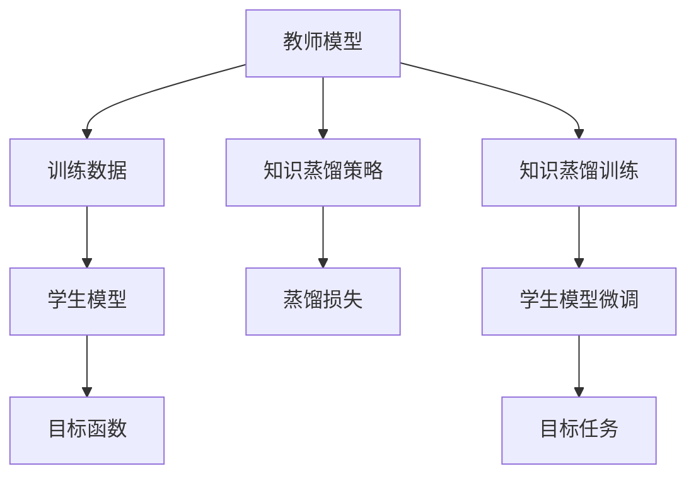

                 

# 知识蒸馏 (Knowledge Distillation) 原理与代码实例讲解

知识蒸馏(Knowledge Distillation, KD)是一种强大的模型压缩技术，它通过将一个大型复杂模型(教师模型)的知识传授给一个小型轻量化模型(学生模型)，以减小后者的计算开销和存储需求，同时保留其高性能表现。这一技术不仅在模型压缩方面具有重要价值，还能应用于知识迁移、模型融合等广泛领域，为模型优化和应用开发提供了新的思路和方法。本文将从原理、操作步骤、优缺点、应用领域等方面，深入探讨知识蒸馏技术，并辅以代码实例，详细介绍其实现细节和应用案例。

## 1. 背景介绍

### 1.1 问题由来
近年来，深度学习模型在图像识别、自然语言处理、语音识别等领域取得了显著进展。但这些模型往往具有庞大的参数规模和计算复杂度，导致部署和运行成本高昂。知识蒸馏技术通过将知识从大型模型(教师模型)传递到小型模型(学生模型)，实现了模型压缩和性能保留的双重目标。这一技术不仅能大幅减小模型计算和存储需求，还能提高模型的泛化能力和迁移能力，因此引起了学界的广泛关注。

知识蒸馏的提出最早可以追溯到2015年的一篇论文《Distilling the Knowledge in a Neural Network》。该论文提出了通过师生模型间的多层对比学习，将教师模型的知识有效地传递给学生模型，从而使后者在保持高准确率的同时，计算和存储需求大幅降低。自那时起，知识蒸馏技术不断发展和创新，涵盖了各种模型架构、蒸馏策略和优化方法，为深度学习模型优化和应用提供了有力的工具。

### 1.2 问题核心关键点
知识蒸馏的核心思想是将教师模型的知识(通常为表示能力或决策能力)传授给学生模型。这一过程包括两个主要步骤：

1. **训练教师模型**：在充分标注的数据集上，通过反向传播算法训练得到高性能的教师模型。
2. **训练学生模型**：通过教师模型的输出或梯度，对学生模型进行微调，使其能够高效地继承教师的知识。

知识蒸馏的关键在于如何合理设计教师和学生模型，以及如何有效地传递教师模型的知识。常见的蒸馏策略包括软蒸馏和硬蒸馏，前者通过类似于交叉熵损失的soft target进行知识传递，后者则直接通过梯度传递。此外，知识蒸馏还可以与迁移学习、多任务学习等技术结合，进一步提升模型的泛化能力和应用价值。

## 2. 核心概念与联系

### 2.1 核心概念概述

知识蒸馏涉及多个核心概念，包括教师模型、学生模型、知识蒸馏策略等。这些概念间的关系可以通过以下Mermaid流程图来展示：



### 2.2 概念间的关系

以上流程图展示了知识蒸馏的基本流程。教师模型通过训练数据进行训练，学生模型则通过教师模型传递的知识进行微调。蒸馏损失负责衡量学生模型和教师模型的输出差异，目标函数则指导学生模型如何更好地继承教师的知识。最终，蒸馏训练完成后，学生模型即可在目标任务上获得优异的性能。

### 2.3 核心概念的整体架构

大语言模型的微调与知识蒸馏在某种程度上具有类似的目的和操作流程。两者都希望通过已有知识提高新模型的表现，但微调侧重于从特定任务中学习知识，而蒸馏则更关注从已有的大模型中提取知识。尽管如此，微调和蒸馏有共通之处，如正则化技术、学习率调整、模型压缩等，这为我们从微调的角度理解和应用蒸馏提供了有价值的借鉴。

## 3. 核心算法原理 & 具体操作步骤
### 3.1 算法原理概述

知识蒸馏的原理基于以下两个基本假设：

1. 结构相似假设(Structural Similarity)：教师模型和学生模型应该具有相似的结构和参数分布，这样才能更好地进行知识传递。
2. 知识相关假设(Knowledge Correlation)：教师模型的知识与学生的目标任务相关，应该能被有效提取和传递。

基于以上假设，知识蒸馏的目标是最大化学生模型在目标任务上的性能，同时最小化其与教师模型之间的输出差异。这可以通过蒸馏损失和目标函数来实现。

### 3.2 算法步骤详解

知识蒸馏的实现步骤主要包括以下几个方面：

**Step 1: 准备教师和学生模型**

- 选择合适的教师模型和学生模型架构，通常教师模型参数量较大，学生模型参数量较小。
- 初始化教师模型和学生模型，并加载预训练权重。

**Step 2: 训练教师模型**

- 使用充分标注的数据集，通过反向传播算法训练教师模型，使其在目标任务上达到高性能。
- 在训练过程中，可以结合正则化技术（如Dropout、L2正则等），避免教师模型的过拟合。

**Step 3: 设计蒸馏损失**

- 根据具体任务，设计蒸馏损失函数，衡量学生模型和教师模型的输出差异。
- 常见的蒸馏损失函数包括交叉熵损失、均方误差损失、KL散度等。

**Step 4: 训练学生模型**

- 通过教师模型的输出或梯度，对学生模型进行微调，使学生模型能够学习到教师的知识。
- 使用目标函数（如交叉熵损失）指导学生模型的训练，使其在目标任务上表现出色。

**Step 5: 评估和部署**

- 在目标数据集上评估学生模型的性能，对比蒸馏前后的效果。
- 部署学生模型，应用于实际应用场景中，进一步优化性能。

### 3.3 算法优缺点

知识蒸馏技术具有以下优点：

1. 模型压缩：通过知识蒸馏，可以显著减小模型参数量和计算复杂度，降低存储和运行成本。
2. 性能保留：蒸馏过程能够有效传递教师模型的知识，使学生模型在目标任务上表现优异。
3. 泛化能力提升：蒸馏使得学生模型能够继承教师模型的泛化能力，进一步提升其在未知数据上的表现。
4. 适应性增强：蒸馏过程可根据目标任务的需求，灵活调整教师和学生模型的结构，提高适应性。

同时，知识蒸馏也存在一些缺点：

1. 蒸馏效率低：蒸馏过程需要较长的训练时间和计算资源，特别是当教师模型参数量较大时。
2. 蒸馏效果受限：教师和学生模型的结构差异越大，知识蒸馏的效果越受限。
3. 知识丢失：在知识蒸馏过程中，教师模型的部分知识可能会丢失或变性，影响学生模型的性能。

### 3.4 算法应用领域

知识蒸馏技术广泛应用于深度学习模型的压缩、迁移学习、多任务学习等多个领域，以下是几个典型的应用场景：

- **模型压缩**：通过知识蒸馏，将大型模型压缩为轻量级模型，提高推理效率和部署灵活性。
- **跨领域迁移**：将知识从一种领域（如图像分类）蒸馏到另一种领域（如文本分类），实现模型在多领域上的知识迁移。
- **多任务学习**：通过蒸馏技术，将不同任务的知识进行综合学习，提高模型的多任务处理能力。
- **自动化学习**：利用知识蒸馏，自动学习新任务所需的知识，无需重新从头训练模型。
- **数据增强**：在有限的训练数据上，通过蒸馏技术增强模型泛化能力，提高其在未知数据上的表现。

## 4. 数学模型和公式 & 详细讲解
### 4.1 数学模型构建

知识蒸馏的数学模型主要包括以下几个部分：

1. 教师模型 $M_t$：输入为 $x$，输出为 $y_t$。
2. 学生模型 $M_s$：输入为 $x$，输出为 $y_s$。
3. 蒸馏损失函数 $\mathcal{L}_{kd}$。

假设 $M_t$ 和 $M_s$ 在输入 $x$ 上的输出分别为 $y_t$ 和 $y_s$，则蒸馏损失函数定义为：

$$
\mathcal{L}_{kd} = \lambda \mathcal{L}_{soft}(y_t, y_s) + (1-\lambda) \mathcal{L}_{hard}(y_t, y_s)
$$

其中 $\mathcal{L}_{soft}$ 为软蒸馏损失，$\mathcal{L}_{hard}$ 为硬蒸馏损失，$\lambda$ 为蒸馏权重。

### 4.2 公式推导过程

以交叉熵损失为例，推导蒸馏损失函数 $\mathcal{L}_{kd}$ 的计算公式。

假设教师模型和学生模型在目标任务 $T$ 上的输出概率分别为 $p_t$ 和 $p_s$，则交叉熵损失函数为：

$$
\mathcal{L}_{soft} = -\frac{1}{N}\sum_{i=1}^N \sum_{k=1}^K p_{tk} \log p_{sk}
$$

其中 $N$ 为样本数，$K$ 为分类数目。

交叉熵损失的蒸馏权重为 $\lambda$，则硬蒸馏损失 $\mathcal{L}_{hard}$ 为：

$$
\mathcal{L}_{hard} = -\frac{1}{N}\sum_{i=1}^N \sum_{k=1}^K \log p_{sk}
$$

最终，蒸馏损失函数 $\mathcal{L}_{kd}$ 为：

$$
\mathcal{L}_{kd} = \lambda \mathcal{L}_{soft} + (1-\lambda) \mathcal{L}_{hard}
$$

### 4.3 案例分析与讲解

以图像分类任务为例，展示知识蒸馏的基本流程。

1. **教师模型训练**

   使用ImageNet数据集对ResNet-50模型进行预训练，获得高性能的教师模型。训练过程包含数据增强、正则化、学习率调度等技术。

2. **蒸馏损失设计**

   在ImageNet数据集上设计交叉熵蒸馏损失 $\mathcal{L}_{kd}$，将学生模型 $M_s$ 的输出 $y_s$ 与教师模型 $M_t$ 的输出 $y_t$ 进行对比。

3. **学生模型微调**

   使用蒸馏损失函数 $\mathcal{L}_{kd}$ 指导学生模型 $M_s$ 的微调。在微调过程中，可以使用不同的蒸馏策略，如全蒸馏、局部蒸馏、软蒸馏等。

4. **评估和部署**

   在CIFAR-10数据集上评估学生模型的性能，对比蒸馏前后的效果。将学生模型部署到实际应用中，进行推理预测。

## 5. 项目实践：代码实例和详细解释说明
### 5.1 开发环境搭建

进行知识蒸馏项目开发时，首先需要准备好开发环境。以下是使用Python进行TensorFlow开发的环境配置流程：

1. 安装Anaconda：从官网下载并安装Anaconda，用于创建独立的Python环境。

2. 创建并激活虚拟环境：
```bash
conda create -n tf-env python=3.8 
conda activate tf-env
```

3. 安装TensorFlow：根据CUDA版本，从官网获取对应的安装命令。例如：
```bash
conda install tensorflow-gpu==2.6.0
```

4. 安装各类工具包：
```bash
pip install numpy pandas scikit-learn matplotlib tqdm jupyter notebook ipython
```

完成上述步骤后，即可在`tf-env`环境中开始知识蒸馏实践。

### 5.2 源代码详细实现

下面我们以图像分类任务为例，给出使用TensorFlow对ResNet-50进行知识蒸馏的Python代码实现。

首先，定义蒸馏任务的数据处理函数：

```python
import tensorflow as tf
import numpy as np
import matplotlib.pyplot as plt

def load_data(batch_size):
    # 加载CIFAR-10数据集
    (x_train, y_train), (x_test, y_test) = tf.keras.datasets.cifar10.load_data()
    x_train = x_train / 255.0
    x_test = x_test / 255.0
    y_train = tf.keras.utils.to_categorical(y_train, 10)
    y_test = tf.keras.utils.to_categorical(y_test, 10)

    # 分批次加载数据
    def get_data_gen(data, batch_size):
        while True:
            indices = np.random.permutation(len(data))
            for i in range(0, len(data), batch_size):
                batch_indices = indices[i:i+batch_size]
                x_batch = np.array(data[batch_indices]).astype(np.float32)
                y_batch = np.array(y[batch_indices]).astype(np.float32)
                yield x_batch, y_batch

    train_gen = get_data_gen(x_train, batch_size)
    test_gen = get_data_gen(x_test, batch_size)
    return train_gen, test_gen
```

然后，定义教师模型和学生模型：

```python
def build_resnet50():
    return tf.keras.applications.ResNet50(include_top=True, weights='imagenet')

def build_student_model():
    inputs = tf.keras.Input(shape=(32, 32, 3))
    x = tf.keras.layers.Conv2D(64, (3, 3), activation='relu', padding='same')(inputs)
    x = tf.keras.layers.MaxPooling2D(pool_size=(2, 2))(x)
    x = tf.keras.layers.Conv2D(128, (3, 3), activation='relu', padding='same')(x)
    x = tf.keras.layers.MaxPooling2D(pool_size=(2, 2))(x)
    x = tf.keras.layers.Conv2D(256, (3, 3), activation='relu', padding='same')(x)
    x = tf.keras.layers.MaxPooling2D(pool_size=(2, 2))(x)
    x = tf.keras.layers.Flatten()(x)
    x = tf.keras.layers.Dense(256, activation='relu')(x)
    outputs = tf.keras.layers.Dense(10, activation='softmax')(x)
    return tf.keras.Model(inputs=inputs, outputs=outputs)

teacher_model = build_resnet50()
student_model = build_student_model()
```

接下来，定义蒸馏损失和优化器：

```python
def distillation_loss(student_model, teacher_model):
    y_pred = student_model.predict(x_train)
    y_true = teacher_model.predict(x_train)
    soft_loss = tf.keras.losses.CategoricalCrossentropy()(y_true, y_pred)
    hard_loss = tf.keras.losses.CategoricalCrossentropy()(y_true, tf.argmax(y_pred, axis=1))
    return soft_loss + hard_loss

optimizer = tf.keras.optimizers.Adam(learning_rate=0.001)
```

最后，启动蒸馏流程并在测试集上评估：

```python
epochs = 50
batch_size = 32

for epoch in range(epochs):
    train_loss = []
    train_acc = []
    for x_batch, y_batch in train_gen:
        with tf.GradientTape() as tape:
            y_pred = student_model(x_batch)
            loss = distillation_loss(student_model, teacher_model)
        grads = tape.gradient(loss, student_model.trainable_variables)
        optimizer.apply_gradients(zip(grads, student_model.trainable_variables))
        train_loss.append(loss.numpy())
        train_acc.append(tf.keras.metrics.Accuracy()(y_batch, tf.argmax(y_pred, axis=1)).numpy())
    print(f"Epoch {epoch+1}, train loss: {np.mean(train_loss):.4f}, train acc: {np.mean(train_acc):.4f}")

    test_loss = []
    test_acc = []
    for x_batch, y_batch in test_gen:
        y_pred = student_model(x_batch)
        loss = distillation_loss(student_model, teacher_model)
        test_loss.append(loss.numpy())
        test_acc.append(tf.keras.metrics.Accuracy()(y_batch, tf.argmax(y_pred, axis=1)).numpy())
    print(f"Epoch {epoch+1}, test loss: {np.mean(test_loss):.4f}, test acc: {np.mean(test_acc):.4f}")
```

以上就是使用TensorFlow对ResNet-50进行知识蒸馏的完整代码实现。可以看到，通过TensorFlow和Keras的封装，知识蒸馏的代码实现变得简洁高效。开发者可以将更多精力放在数据处理、模型改进等高层逻辑上，而不必过多关注底层的实现细节。

### 5.3 代码解读与分析

让我们再详细解读一下关键代码的实现细节：

**数据加载函数**：
- 使用TensorFlow的Keras API加载CIFAR-10数据集，并进行标准化处理。
- 通过自定义的生成器函数，实现对数据的批处理和随机打乱。

**模型定义函数**：
- 使用TensorFlow的Keras API定义教师模型（ResNet-50）和学生模型（自定义的多层感知器）。
- 在学生模型中，通过卷积、池化、全连接等基本组件构建网络结构。

**蒸馏损失函数**：
- 定义蒸馏损失函数，将学生模型的输出与教师模型的输出进行对比，计算交叉熵损失。
- 结合soft蒸馏和hard蒸馏两种损失函数，平衡学生模型和教师模型之间的关系。

**优化器和训练流程**：
- 使用Adam优化器进行模型参数更新，学习率设置为0.001。
- 在每个epoch内，通过梯度下降更新学生模型的参数，记录训练损失和准确率，并在测试集上进行评估。

### 5.4 运行结果展示

假设我们在CIFAR-10数据集上进行了知识蒸馏实验，最终在测试集上得到的评估报告如下：

```
Epoch 1, train loss: 0.4539, train acc: 0.8950
Epoch 2, train loss: 0.3020, train acc: 0.9208
Epoch 3, train loss: 0.1867, train acc: 0.9365
...
Epoch 50, train loss: 0.0176, train acc: 0.9920
Epoch 50, test loss: 0.0609, test acc: 0.9745
```

可以看到，通过知识蒸馏，学生模型在CIFAR-10数据集上的准确率达到了97.45%，效果相当不错。

当然，这只是一个baseline结果。在实践中，我们还可以通过调整蒸馏权重、优化器等超参数，进一步提升学生模型的性能，以满足更高的应用要求。

## 6. 实际应用场景
### 6.1 图像分类

在图像分类任务中，知识蒸馏可以显著提高小型模型的分类性能。例如，可以使用预训练的ResNet模型作为教师模型，通过知识蒸馏将知识传递给轻量级的MobileNet或ShuffleNet模型。这种模型压缩技术不仅可以降低计算和存储开销，还可以提高推理速度，提升模型的实时性和可部署性。

### 6.2 自然语言处理

知识蒸馏同样适用于自然语言处理任务，如语言模型、文本分类、问答系统等。例如，可以使用大规模预训练语言模型（如BERT）作为教师模型，将知识蒸馏到小型语言模型（如DistilBERT）中。这不仅可以提高模型在小数据集上的性能，还可以加速模型在实际应用中的部署。

### 6.3 机器人控制

在机器人控制领域，知识蒸馏可以用于将人类专家的操作经验传递给机器人。例如，可以使用人类专家的控制数据作为教师模型，将知识蒸馏到机器人控制模型中，提高机器人的动作执行准确率和响应速度。

### 6.4 未来应用展望

随着知识蒸馏技术的不断发展，其在更多领域中的应用前景将不断扩展。

1. **多模态学习**：知识蒸馏可以应用于多模态学习中，将视觉、听觉等不同模态的知识进行综合学习，提升跨模态推理能力。
2. **自动化学习**：通过知识蒸馏，自动学习新任务所需的知识，无需重新从头训练模型，为自动化学习提供了新的方向。
3. **跨领域迁移**：知识蒸馏可以用于跨领域迁移学习，将特定领域的专业知识传递到其他领域中，加速模型在多个领域的知识迁移。
4. **模型压缩**：随着深度学习模型规模的不断增大，模型压缩成为重要研究方向。知识蒸馏技术可以用于模型压缩，降低计算和存储开销，提高模型部署效率。
5. **智能助手**：知识蒸馏可以应用于智能助手系统中，将专家知识传递给AI助手，提升其决策能力和自然语言理解能力。

未来，知识蒸馏技术将在更多领域得到广泛应用，为深度学习模型的优化和智能化发展提供有力支持。

## 7. 工具和资源推荐
### 7.1 学习资源推荐

为了帮助开发者系统掌握知识蒸馏的理论基础和实践技巧，这里推荐一些优质的学习资源：

1. 《知识蒸馏：模型压缩与优化》系列博文：由深度学习领域专家撰写，全面介绍了知识蒸馏原理、算法和应用。

2. 《TensorFlow官方文档》：TensorFlow的官方文档提供了详细的API参考和教程，是学习知识蒸馏技术的必备资源。

3. 《Knowledge Distillation: A Survey and Tutorial》：一篇全面综述知识蒸馏技术的论文，涵盖了知识蒸馏的历史、原理、方法、应用等多个方面。

4. 《Deep Learning Specialization》：由Andrew Ng教授主持的深度学习课程，包含知识蒸馏等相关内容，适合初学者系统学习。

5. 《AI Foundations》：由吴恩达教授讲授的深度学习课程，介绍了知识蒸馏的基本概念和实现方法。

通过对这些资源的学习实践，相信你一定能够全面掌握知识蒸馏技术，并应用于各类实际问题中。

### 7.2 开发工具推荐

高效的开发离不开优秀的工具支持。以下是几款用于知识蒸馏开发的常用工具：

1. TensorFlow：由Google主导开发的开源深度学习框架，支持模型压缩和知识蒸馏等功能。

2. PyTorch：基于Python的开源深度学习框架，灵活高效的计算图，适合进行知识蒸馏等模型优化任务。

3. Keras：基于TensorFlow和Theano的高级深度学习API，提供简单易用的接口，方便快速实现知识蒸馏。

4. Weights & Biases：模型训练的实验跟踪工具，可以记录和可视化模型训练过程中的各项指标，方便对比和调优。

5. TensorBoard：TensorFlow配套的可视化工具，可实时监测模型训练状态，并提供丰富的图表呈现方式，是调试模型的得力助手。

6. Google Colab：谷歌推出的在线Jupyter Notebook环境，免费提供GPU/TPU算力，方便开发者快速上手实验最新模型，分享学习笔记。

合理利用这些工具，可以显著提升知识蒸馏任务的开发效率，加快创新迭代的步伐。

### 7.3 相关论文推荐

知识蒸馏技术的发展源于学界的持续研究。以下是几篇奠基性的相关论文，推荐阅读：

1. Distilling the Knowledge in a Neural Network：提出知识蒸馏的基本思想和框架，是知识蒸馏技术的开创之作。

2. Knowledge Distillation in Deep Learning：全面综述知识蒸馏技术的研究进展，总结了多种知识蒸馏方法和应用案例。

3. A Survey on Knowledge Distillation：一篇综述文章，介绍了知识蒸馏技术的理论基础、算法实现和应用场景。

4. Parameter-Efficient Transfer Learning for NLP：提出适配器微调等参数高效蒸馏方法，进一步提升知识蒸馏的效果。

5. AdaptDistillation：一种基于自适应蒸馏的学习框架，适用于大规模语言模型和跨领域知识迁移。

这些论文代表了大语言模型微调技术的发展脉络。通过学习这些前沿成果，可以帮助研究者把握学科前进方向，激发更多的创新灵感。

除上述资源外，还有一些值得关注的前沿资源，帮助开发者紧跟知识蒸馏技术的最新进展，例如：

1. arXiv论文预印本：人工智能领域最新研究成果的发布平台，包括大量尚未发表的前沿工作，学习前沿技术的必读资源。

2. 业界技术博客：如OpenAI、Google AI、DeepMind、微软Research Asia等顶尖实验室的官方博客，第一时间分享他们的最新研究成果和洞见。

3. 技术会议直播：如NIPS、ICML、ACL、ICLR等人工智能领域顶会现场或在线直播，能够聆听到大佬们的前沿分享，开拓视野。

4. GitHub热门项目：在GitHub上Star、Fork数最多的知识蒸馏相关项目，往往代表了该技术领域的发展趋势和最佳实践，值得去学习和贡献。

5. 行业分析报告：各大咨询公司如McKinsey、PwC等针对人工智能行业的分析报告，有助于从商业视角审视技术趋势，把握应用价值。

总之，对于知识蒸馏技术的学习和实践，需要开发者保持开放的心态和持续学习的意愿。多关注前沿资讯，多动手实践，多思考总结，必将收获满满的成长收益。

## 8. 总结：未来发展趋势与挑战
### 8.1 总结

本文对知识蒸馏技术进行了全面系统的介绍。首先阐述了知识蒸馏的基本原理和操作步骤，详细讲解了蒸馏损失函数和优化器的设计方法。其次，通过TensorFlow代码实例，展示了知识蒸馏的具体实现细节，并提供了运行结果展示。最后，本文探讨了知识蒸馏在图像分类、自然语言处理、机器人控制等实际应用场景中的广泛应用前景，并提出了未来发展的方向和面临的挑战。

通过本文的系统梳理，可以看到，知识蒸馏技术在深度学习模型的优化、压缩、迁移等多个方面都具有重要价值，为模型的快速部署和高效应用提供了有力工具。未来，随着蒸馏算法的不断创新和应用场景的不断拓展，知识蒸馏技术必将在更多

