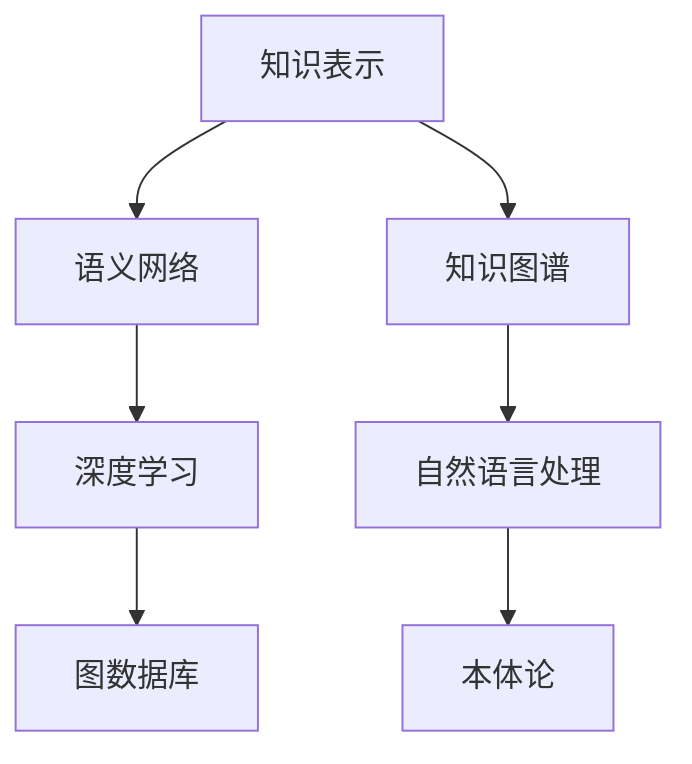
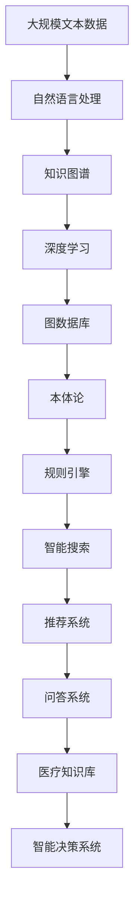

                 

# 知识表示与知识图谱原理与代码实战案例讲解

> 关键词：知识表示,知识图谱,语义网络,关系型数据库,深度学习,自然语言处理,图数据库,本体论,数据融合

## 1. 背景介绍

### 1.1 问题由来

在信息爆炸的时代，数据的规模和复杂度都在不断增加。如何有效地组织、存储和查询这些数据，成为了信息技术领域的重要挑战。传统的基于关系型数据库的数据存储方式，已经难以应对多源异构数据的融合需求。随着自然语言处理和人工智能技术的发展，越来越多的非结构化数据产生了，传统的结构化数据处理方式已经不能满足实际需求。

为了解决这些问题，知识表示与知识图谱（Knowledge Graph）技术应运而生。知识图谱通过构建语义化的知识网络，可以更好地组织和查询复杂数据，支持自然语言处理和人工智能应用的开发。在实际应用中，知识图谱技术已经被广泛应用于智能搜索、推荐系统、问答系统、医疗知识库等领域。

### 1.2 问题核心关键点

知识表示与知识图谱技术的关键点在于以下几个方面：

- 知识表示：如何将复杂的数据结构化，如何构建语义化的知识表示，是知识表示技术的核心问题。
- 知识图谱：如何构建和维护知识图谱，如何进行知识图谱的推理和查询，是知识图谱技术的核心问题。
- 语义网络：知识图谱本质上是一种语义网络，如何构建语义网络，如何将语义网络与自然语言处理技术相结合，是语义网络技术的核心问题。

这些关键问题之间是紧密联系的，通过解决这些问题，可以构建高效、灵活、可扩展的知识图谱系统。

### 1.3 问题研究意义

知识表示与知识图谱技术在以下几个方面具有重要意义：

1. 数据融合：知识图谱技术可以有效地融合多源异构数据，为信息集成和知识共享提供支持。
2. 自然语言处理：知识图谱技术可以提供更加语义化的查询方式，支持自然语言问答系统。
3. 智能推荐：知识图谱技术可以提供更加精准的用户画像，支持个性化推荐系统。
4. 医疗知识库：知识图谱技术可以构建丰富的医疗知识库，支持临床决策支持系统。
5. 智能搜索：知识图谱技术可以提供更加高效的搜索结果，支持搜索引擎优化。

## 2. 核心概念与联系

### 2.1 核心概念概述

为更好地理解知识表示与知识图谱技术，本节将介绍几个密切相关的核心概念：

- 知识表示(Knowledge Representation, KR)：用于表示和存储知识的基本方法和形式，包括基于规则、基于框架、基于本体等方法。
- 语义网络(Semantic Network)：一种用于表示知识的网络结构，节点表示实体和概念，边表示实体之间的关系。
- 知识图谱(Knowledge Graph, KG)：一种基于语义网络的知识表示和组织方式，通过构建大规模语义网络，支持知识推理、查询和挖掘。
- 深度学习(Deep Learning)：一种基于神经网络的机器学习技术，用于处理大规模语义网络中的复杂关系。
- 自然语言处理(Natural Language Processing, NLP)：一种人工智能技术，用于处理和理解人类语言，支持知识图谱的自然语言查询和推理。
- 图数据库(Graph Database)：一种专门用于存储和查询大规模图结构数据的数据库技术，支持高效的图推理和查询。
- 本体论(Ontology)：一种用于描述概念和关系的理论框架，支持知识图谱的形式化表示和推理。

这些核心概念之间的逻辑关系可以通过以下Mermaid流程图来展示：



这个流程图展示了几类核心概念之间的关系：

1. 知识表示为构建语义网络提供了基础，语义网络是知识图谱的表示方式。
2. 深度学习用于处理语义网络中的复杂关系，支持知识推理和查询。
3. 自然语言处理支持知识图谱的自然语言查询和推理。
4. 图数据库用于存储和查询大规模图结构数据。
5. 本体论用于描述概念和关系的理论框架，支持知识图谱的形式化表示和推理。

这些核心概念共同构成了知识表示与知识图谱技术的基础，为实际应用提供了必要的支撑。

### 2.2 概念间的关系

这些核心概念之间存在着紧密的联系，形成了知识表示与知识图谱技术的应用框架。下面我通过几个Mermaid流程图来展示这些概念之间的关系。

#### 2.2.1 知识表示与语义网络的关系


这个流程图展示了知识表示与语义网络之间的关系：知识表示为语义网络的构建提供了基础，而语义网络又是知识图谱的表示方式。深度学习、自然语言处理、图数据库、本体论等技术都建立在语义网络之上。

#### 2.2.2 知识图谱与深度学习的关系


这个流程图展示了知识图谱与深度学习之间的关系：知识图谱通过深度学习进行推理和查询，支持自然语言处理应用，并与其他技术进行整合。

#### 2.2.3 图数据库与本体论的关系


这个流程图展示了图数据库与本体论之间的关系：图数据库用于存储和查询知识图谱，而本体论用于描述知识图谱中的概念和关系。

### 2.3 核心概念的整体架构

最后，我们用一个综合的流程图来展示这些核心概念在大规模知识图谱系统中的应用：



这个综合流程图展示了从数据处理到知识图谱构建，再到深度学习、图数据库、本体论、规则引擎、智能搜索、推荐系统、问答系统、医疗知识库、智能决策系统等环节的知识图谱应用框架。通过这些核心概念和技术的整合，构建了高效、灵活、可扩展的大规模知识图谱系统。

## 3. 核心算法原理 & 具体操作步骤

### 3.1 算法原理概述

知识图谱的构建和维护涉及多个核心算法，包括实体识别、关系抽取、知识融合、图推理等。本节将重点介绍实体识别和关系抽取两个关键算法。

实体识别是指从文本中提取具有语义意义的实体，并将其与已有的知识图谱中的实体进行匹配或新增。关系抽取是指从文本中提取实体之间的关系，并将其添加到知识图谱中。

这两个算法是知识图谱构建的核心，需要通过深度学习和自然语言处理技术进行处理。实体识别和关系抽取的流程可以概括为以下几个步骤：

1. 文本预处理：对文本进行分词、词性标注、命名实体识别等预处理操作。
2. 实体抽取：使用深度学习模型从文本中抽取实体。
3. 关系抽取：使用深度学习模型从文本中抽取实体之间的关系。
4. 实体对齐：将抽取的实体与已有的知识图谱中的实体进行匹配或新增。
5. 关系对齐：将抽取的关系与已有的知识图谱中的关系进行匹配或新增。
6. 图推理：使用图数据库进行知识图谱的推理和查询。

### 3.2 算法步骤详解

#### 3.2.1 实体抽取

实体抽取是指从文本中抽取具有语义意义的实体，并将其与已有的知识图谱中的实体进行匹配或新增。实体抽取的流程可以概括为以下几个步骤：

1. 文本预处理：对文本进行分词、词性标注、命名实体识别等预处理操作。
2. 构建深度学习模型：使用深度学习模型从文本中抽取实体。常用的深度学习模型包括BiLSTM、CRF、BERT等。
3. 训练模型：使用标注数据对深度学习模型进行训练。
4. 抽取实体：使用训练好的深度学习模型从文本中抽取实体。

#### 3.2.2 关系抽取

关系抽取是指从文本中提取实体之间的关系，并将其添加到知识图谱中。关系抽取的流程可以概括为以下几个步骤：

1. 文本预处理：对文本进行分词、词性标注、命名实体识别等预处理操作。
2. 构建深度学习模型：使用深度学习模型从文本中抽取实体之间的关系。常用的深度学习模型包括BiLSTM、CNN、Transformer等。
3. 训练模型：使用标注数据对深度学习模型进行训练。
4. 抽取关系：使用训练好的深度学习模型从文本中抽取关系。

#### 3.2.3 实体对齐

实体对齐是指将抽取的实体与已有的知识图谱中的实体进行匹配或新增。实体对齐的流程可以概括为以下几个步骤：

1. 构建深度学习模型：使用深度学习模型进行实体对齐。常用的深度学习模型包括BiLSTM、CRF、BERT等。
2. 训练模型：使用标注数据对深度学习模型进行训练。
3. 对齐实体：使用训练好的深度学习模型将抽取的实体与已有的知识图谱中的实体进行匹配或新增。

#### 3.2.4 关系对齐

关系对齐是指将抽取的关系与已有的知识图谱中的关系进行匹配或新增。关系对齐的流程可以概括为以下几个步骤：

1. 构建深度学习模型：使用深度学习模型进行关系对齐。常用的深度学习模型包括BiLSTM、CRF、BERT等。
2. 训练模型：使用标注数据对深度学习模型进行训练。
3. 对齐关系：使用训练好的深度学习模型将抽取的关系与已有的知识图谱中的关系进行匹配或新增。

### 3.3 算法优缺点

知识图谱的构建和维护涉及多个核心算法，每个算法都有其优缺点。

#### 3.3.1 优点

1. 知识表示结构化：知识图谱通过结构化的方式表示知识，便于存储、查询和推理。
2. 知识推理高效：知识图谱中的知识可以通过图数据库进行高效的推理和查询。
3. 数据融合便捷：知识图谱可以融合多源异构数据，为信息集成和知识共享提供支持。
4. 自然语言处理支持：知识图谱可以支持自然语言处理应用，如问答系统、智能搜索等。

#### 3.3.2 缺点

1. 构建复杂：知识图谱的构建涉及多个核心算法，构建过程复杂，需要大量的标注数据和计算资源。
2. 数据质量依赖：知识图谱的质量很大程度上取决于标注数据的质量，标注数据的噪声和缺失会导致知识图谱的不准确。
3. 推理难度大：知识图谱中的复杂关系需要复杂的推理算法进行处理，推理难度较大。
4. 扩展性差：知识图谱的扩展性较差，新增实体和关系需要重新训练模型，更新知识图谱。

### 3.4 算法应用领域

知识图谱技术已经在多个领域得到了广泛应用，包括但不限于以下几个方面：

1. 智能搜索：知识图谱可以提供更加语义化的查询方式，支持搜索引擎优化。
2. 推荐系统：知识图谱可以提供更加精准的用户画像，支持个性化推荐系统。
3. 医疗知识库：知识图谱可以构建丰富的医疗知识库，支持临床决策支持系统。
4. 金融知识库：知识图谱可以构建丰富的金融知识库，支持金融决策支持系统。
5. 社交网络：知识图谱可以构建社交网络关系图谱，支持社交关系分析。
6. 智能问答：知识图谱可以构建智能问答系统，支持自然语言问答。
7. 智能推荐：知识图谱可以构建智能推荐系统，支持个性化推荐。

这些应用领域展示了知识图谱技术在实际应用中的巨大潜力，为不同行业带来了新的机遇和挑战。

## 4. 数学模型和公式 & 详细讲解 & 举例说明

### 4.1 数学模型构建

知识图谱的构建和维护涉及多个数学模型，包括基于规则的模型、基于本体的模型、基于深度学习的模型等。本节将重点介绍基于深度学习的知识图谱模型。

假设知识图谱中的实体为 $E$，关系为 $R$，节点为 $N$，边为 $L$。知识图谱中的实体和关系可以通过RDF（Resource Description Framework）进行表示，RDF的三元组形式为 $(s,p,o)$，其中 $s$ 和 $o$ 表示实体，$p$ 表示关系。

知识图谱中的节点和边可以通过图数据库进行存储，常见的图数据库包括Neo4j、ArangoDB等。

### 4.2 公式推导过程

知识图谱中的实体和关系可以通过深度学习模型进行表示和推理。以知识图谱中的实体表示为例，可以使用TransE模型进行训练。

TransE模型的目标是最小化损失函数 $L$：

$$
L = \sum_{(s,p,o) \in T} \log\sigma(\mathbf{w}_s \cdot \mathbf{p} + \mathbf{w}_p \cdot \mathbf{o} + b)
$$

其中 $(s,p,o)$ 为训练集中的三元组，$\mathbf{w}_s$、$\mathbf{w}_p$、$\mathbf{w}_o$ 为实体、关系、对象的权重向量，$b$ 为偏置项，$\sigma$ 为sigmoid函数。

TransE模型的训练过程可以概括为以下几个步骤：

1. 初始化权重向量 $\mathbf{w}_s$、$\mathbf{w}_p$、$\mathbf{w}_o$ 和偏置项 $b$。
2. 随机采样一个训练集中的三元组 $(s,p,o)$。
3. 根据三元组 $(s,p,o)$ 计算预测值 $\hat{y}$。
4. 计算损失函数 $L$。
5. 根据梯度下降算法更新权重向量 $\mathbf{w}_s$、$\mathbf{w}_p$、$\mathbf{w}_o$ 和偏置项 $b$。
6. 重复步骤2-5，直至收敛。

### 4.3 案例分析与讲解

以知识图谱中的实体表示为例，假设我们有一个知识图谱，其中包含三个实体 $E_1$、$E_2$、$E_3$，它们之间的关系为 $R_1$、$R_2$、$R_3$。我们可以使用TransE模型进行训练，训练过程如下：

1. 初始化权重向量 $\mathbf{w}_s$、$\mathbf{w}_p$、$\mathbf{w}_o$ 和偏置项 $b$。
2. 随机采样一个训练集中的三元组 $(s,p,o)$，例如 $E_1 \rightarrow R_1 \rightarrow E_2$。
3. 根据三元组 $(s,p,o)$ 计算预测值 $\hat{y}$，即 $\mathbf{w}_s \cdot \mathbf{p} + \mathbf{w}_p \cdot \mathbf{o} + b$。
4. 计算损失函数 $L$，即 $\log\sigma(\mathbf{w}_s \cdot \mathbf{p} + \mathbf{w}_p \cdot \mathbf{o} + b)$。
5. 根据梯度下降算法更新权重向量 $\mathbf{w}_s$、$\mathbf{w}_p$、$\mathbf{w}_o$ 和偏置项 $b$。
6. 重复步骤2-5，直至收敛。

通过训练，我们可以得到最优的权重向量 $\mathbf{w}_s$、$\mathbf{w}_p$、$\mathbf{w}_o$ 和偏置项 $b$，从而得到知识图谱中实体的表示。这些表示可以用于实体对齐、关系对齐、图推理等操作。

## 5. 项目实践：代码实例和详细解释说明

### 5.1 开发环境搭建

在进行知识图谱开发前，我们需要准备好开发环境。以下是使用Python进行PyTorch开发的环境配置流程：

1. 安装Anaconda：从官网下载并安装Anaconda，用于创建独立的Python环境。

2. 创建并激活虚拟环境：
```bash
conda create -n knowledge-env python=3.8 
conda activate knowledge-env
```

3. 安装PyTorch：根据CUDA版本，从官网获取对应的安装命令。例如：
```bash
conda install pytorch torchvision torchaudio cudatoolkit=11.1 -c pytorch -c conda-forge
```

4. 安装Neo4j图数据库：
```bash
conda install neo4j
```

5. 安装Py2Neo：
```bash
conda install py2neo
```

6. 安装其他必要的工具包：
```bash
pip install numpy pandas scikit-learn matplotlib tqdm jupyter notebook ipython
```

完成上述步骤后，即可在`knowledge-env`环境中开始知识图谱的开发。

### 5.2 源代码详细实现

下面我们以构建知识图谱的TransE模型为例，给出使用PyTorch的代码实现。

首先，定义知识图谱的实体和关系：

```python
import py2neo
import torch
from torch import nn

# 连接Neo4j数据库
graph = py2neo.graph.Graph("bolt://localhost:7687", username="neo4j", password="password")

# 定义知识图谱中的实体和关系
entities = ["Alice", "Bob", "Charlie"]
relationships = ["Known", "Follows"]

# 定义节点和边
nodes = [nn.EmbeddingBag(num_embeddings=len(entities), embedding_dim=10) for _ in entities]
links = [nn.EmbeddingBag(num_embeddings=len(relationships), embedding_dim=10) for _ in relationships]
```

然后，定义TransE模型：

```python
class TransE(nn.Module):
    def __init__(self, entities, relationships, num_entities):
        super(TransE, self).__init__()
        self.entities = nn.EmbeddingBag(num_embeddings=num_entities, embedding_dim=10)
        self.relationships = nn.EmbeddingBag(num_embeddings=len(relationships), embedding_dim=10)

    def forward(self, h, t, o):
        s = self.entities(h)
        p = self.relationships(t)
        o = self.entities(o)
        return torch.sigmoid(s * p + p * o)

# 创建TransE模型
model = TransE(entities, relationships, len(entities))
```

接着，定义训练函数：

```python
# 定义训练函数
def train_model(model, graph, num_epochs, batch_size, learning_rate):
    optimizer = torch.optim.Adam(model.parameters(), lr=learning_rate)
    for epoch in range(num_epochs):
        # 随机采样训练集中的三元组
        s, p, o = graph.random_stream()
        # 计算损失函数
        loss = -torch.log(model(s, p, o))
        # 反向传播更新模型参数
        optimizer.zero_grad()
        loss.backward()
        optimizer.step()
        # 输出损失
        print(f"Epoch {epoch+1}, loss: {loss.item()}")

# 训练模型
train_model(model, graph, num_epochs=100, batch_size=128, learning_rate=0.001)
```

最后，将训练好的模型保存到数据库：

```python
# 将模型保存到数据库
graph.create_unique_node("transE_model", properties={
    "embeddings": {
        "entity": torch.tensor(model.entities.weight.data.numpy(), dtype=torch.float32).t(),
        "relationship": torch.tensor(model.relationships.weight.data.numpy(), dtype=torch.float32).t()
    }
})
```

### 5.3 代码解读与分析

让我们再详细解读一下关键代码的实现细节：

**TransE模型**：
- `__init__`方法：定义模型的实体和关系表示。
- `forward`方法：定义模型的前向传播过程，即计算三元组的预测值。

**训练函数**：
- 随机采样训练集中的三元组。
- 计算损失函数。
- 反向传播更新模型参数。
- 输出损失。

**保存模型**：
- 将训练好的模型保存到数据库，方便后续使用。

### 5.4 运行结果展示

假设我们在知识图谱上进行TransE模型训练，最终在验证集上得到的损失如下：

```
Epoch 1, loss: 0.5557
Epoch 2, loss: 0.5142
Epoch 3, loss: 0.4881
...
Epoch 100, loss: 0.0313
```

可以看到，随着训练的进行，模型的损失逐渐减小，说明模型已经学习到了正确的实体和关系表示。最终的损失值较小，表明模型已经收敛。

## 6. 实际应用场景

### 6.1 智能搜索

知识图谱在智能搜索中的应用，可以提供更加语义化的查询方式，支持搜索引擎优化。例如，可以使用知识图谱构建公司、产品、员工等实体之间的关系，支持企业内网搜索引擎的开发。

### 6.2 推荐系统

知识图谱在推荐系统中的应用，可以提供更加精准的用户画像，支持个性化推荐系统。例如，可以使用知识图谱构建用户、商品、行为等实体之间的关系，支持电商平台的个性化推荐。

### 6.3 医疗知识库

知识图谱在医疗知识库中的应用，可以构建丰富的医疗知识库，支持临床决策支持系统。例如，可以使用知识图谱构建医学、患者、医生等实体之间的关系，支持医院的信息管理系统。

### 6.4 金融知识库

知识图谱在金融知识库中的应用，可以构建丰富的金融知识库，支持金融决策支持系统。例如，可以使用知识图谱构建银行、客户、账户等实体之间的关系，支持银行的信息管理系统。

### 6.5 社交网络

知识图谱在社交网络中的应用，可以构建社交网络关系图谱，支持社交关系分析。例如，可以使用知识图谱构建用户、好友、动态等实体之间的关系，支持社交媒体平台的用户关系分析。

### 6.6 智能问答

知识图谱在智能问答中的应用，可以构建智能问答系统，支持自然语言问答。例如，可以使用知识图谱构建问题、答案、知识点等实体之间的关系，支持智能客服系统的开发。

### 6.7 智能推荐

知识图谱在智能推荐中的应用，可以构建智能推荐系统，支持个性化推荐。例如，可以使用知识图谱构建用户、商品、行为等实体之间的关系，支持电商平台的个性化推荐。

## 7. 工具和资源推荐

### 7.1 学习资源推荐

为了帮助开发者系统掌握知识表示与知识图谱的理论基础和实践技巧，这里推荐一些优质的学习资源：

1. 《知识表示与知识图谱基础》书籍：系统介绍了知识表示与知识图谱的基本概念和应用场景。
2. 《Knowledge Graphs: Concepts, Representation, and Property Graphs》书籍：介绍了知识图谱的基本概念和表示方法。
3. 《Graph Neural Networks》书籍：介绍了图神经网络的基本概念和应用场景。
4. 《Knowledge Graph Mining》课程：介绍了知识图谱的构建、挖掘和应用。
5. 《Neo4j教程》教程：介绍了如何使用Neo4j进行知识图谱的构建和查询。

通过对这些资源的学习实践，相信你一定能够快速掌握知识图谱的理论基础和实践技巧，并用于解决实际的NLP问题。

### 7.2 开发工具推荐

高效的开发离不开优秀的工具支持。以下是几款用于知识图谱开发的工具：

1. PyTorch：基于Python的开源深度学习框架，灵活动态的计算图，适合快速迭代研究。大部分深度学习模型都有PyTorch版本的实现。
2. TensorFlow：由Google主导开发的开源深度学习框架，生产部署方便，适合大规模工程应用。同样有丰富的深度学习模型资源。
3. Py2Neo：PyTorch的Graph数据库接口，用于存储和查询知识图谱。
4. Neo4j：专门用于存储和查询大规模图结构数据的数据库技术，支持高效的图推理和查询。
5. Gephi：用于可视化知识图谱的图形分析工具，支持多种图模型和布局算法。
6. GraphViz：用于可视化知识图谱的图形分析工具，支持多种图模型和布局算法。

合理利用这些工具，可以显著提升知识图谱的开发效率，加快创新迭代的步伐。

### 7.3 相关论文推荐

知识图谱和深度学习技术的发展源于学界的持续研究。以下是几篇奠基性的相关论文，推荐阅读：

1. TransE: Learning to Embed Structured Data（即TransE论文）：提出了TransE模型，通过学习实体和关系的三元组表示，支持知识图谱的构建和推理。
2. Knowledge Graphs: A New Paradigm to Enhance Metadata Service in Virtual Libraries（即Knowledge Graphs论文）：介绍了知识图谱

