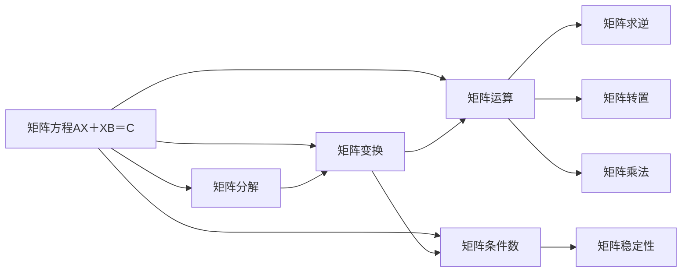

                 

# 矩阵理论与应用：矩阵方程AX＋XB＝C

> 关键词：矩阵方程,矩阵运算,矩阵分解,矩阵应用

## 1. 背景介绍

### 1.1 问题由来
矩阵方程在现代工程、物理、金融、生物等领域有着广泛的应用。矩阵方程的求解，是线性代数和数学计算中的重要问题。然而，矩阵方程的形式多样，求解难度不一，因此，研究矩阵方程的理论和方法，对解决实际问题具有重要意义。

本文将聚焦于矩阵方程AX＋XB＝C的求解，并探讨其在线性代数、控制理论、图论等领域的实际应用。

### 1.2 问题核心关键点
矩阵方程AX＋XB＝C的求解，通常需要满足一定的条件，如系数矩阵A、B、C的秩关系，以及向量X的取值范围等。不同情况下，求解方法有所不同，但基本遵循线性代数的思路，通过矩阵分解、矩阵变换等技术，找到合适的解法。

本文将详细探讨该方程的数学原理和求解步骤，并结合实际应用场景，展示其应用的广泛性。

### 1.3 问题研究意义
研究矩阵方程AX＋XB＝C，对于解决实际工程问题，如控制系统设计、信号处理、图像处理等，具有重要的理论和实践意义：

1. **控制系统设计**：矩阵方程广泛应用于状态空间描述，如状态方程、输出方程等，帮助设计和分析控制系统。
2. **信号处理**：矩阵方程可以表示信号的滤波、卷积等操作，用于数字信号处理和频谱分析。
3. **图像处理**：矩阵方程可以描述图像的线性变换，如图像增强、边缘检测等。
4. **金融工程**：矩阵方程可以用于资产定价模型、风险管理等金融分析。
5. **生物信息学**：矩阵方程可以描述基因序列的匹配、进化关系等。

## 2. 核心概念与联系

### 2.1 核心概念概述

为更好地理解矩阵方程AX＋XB＝C的求解，本节将介绍几个关键概念：

- **矩阵方程**：如AX＋XB＝C，其中A、B、C为系数矩阵，X为未知向量。
- **矩阵分解**：将复杂矩阵分解为简单矩阵的形式，如奇异值分解、QR分解等。
- **矩阵变换**：通过矩阵的加减乘除等基本运算，改变矩阵的形式和性质。
- **矩阵运算**：包括矩阵乘法、矩阵转置、矩阵求逆等基本运算。
- **矩阵条件数**：描述矩阵的稳定性、精度等特征，如2范数条件数、1范数条件数等。

这些核心概念共同构成了矩阵方程求解的基础。

### 2.2 概念间的关系

这些核心概念之间的逻辑关系可以通过以下Mermaid流程图来展示：



这个流程图展示了几大核心概念的关系：

1. 矩阵方程通过矩阵分解、变换、运算等方式，得到简化形式。
2. 矩阵分解和变换可以简化求解过程。
3. 矩阵运算帮助进行矩阵的求逆、转置、乘法等操作。
4. 矩阵条件数评估矩阵的稳定性、精度等特征。
5. 矩阵求逆、转置、乘法等运算，是求解矩阵方程的基本工具。

通过理解这些核心概念，我们可以更好地把握矩阵方程的求解原理和应用方向。

## 3. 核心算法原理 & 具体操作步骤
### 3.1 算法原理概述

矩阵方程AX＋XB＝C的求解，通常通过以下步骤完成：

1. **方程构建**：根据实际问题，构建出对应的矩阵方程。
2. **矩阵分解**：使用奇异值分解(SVD)、QR分解等方法，将复杂矩阵分解为简单矩阵的形式。
3. **矩阵变换**：通过矩阵的加减、乘除等基本运算，简化方程求解。
4. **矩阵求解**：使用矩阵求逆、转置、乘法等基本运算，求解未知向量X。

### 3.2 算法步骤详解

**Step 1: 准备方程和初始化参数**

首先，需要准备矩阵方程的系数矩阵A、B、C，以及未知向量X的初始值。

**Step 2: 矩阵分解**

使用奇异值分解(SVD)或QR分解等方法，将系数矩阵A、B分解为对角矩阵或单位矩阵形式。

**Step 3: 矩阵变换**

通过矩阵加减、乘除等基本运算，将分解后的系数矩阵和未知向量X，转换为更容易求解的形式。

**Step 4: 求解未知向量**

使用矩阵求逆、转置、乘法等基本运算，求解出未知向量X的值。

### 3.3 算法优缺点

矩阵方程AX＋XB＝C的求解方法，具有以下优点：

1. **通用性强**：适用于多种形式和规模的矩阵方程，适用范围广。
2. **计算高效**：通过矩阵分解和变换，简化求解过程，计算效率高。
3. **精度高**：奇异值分解和QR分解等方法，有助于提高计算精度。

同时，也存在以下缺点：

1. **依赖分解技术**：矩阵分解的复杂度和精度依赖于分解算法的有效性。
2. **计算量较大**：对于大规模矩阵方程，求解过程可能较为复杂。
3. **稳定性和精度问题**：某些矩阵分解方法可能存在不稳定性，影响求解结果。

### 3.4 算法应用领域

矩阵方程AX＋XB＝C在多个领域中具有重要应用：

1. **控制系统设计**：用于描述系统状态、控制信号等，是控制理论的基础。
2. **信号处理**：用于数字信号处理、频谱分析、滤波等。
3. **图像处理**：用于图像增强、边缘检测、特征提取等。
4. **金融工程**：用于资产定价、风险管理、金融市场分析等。
5. **生物信息学**：用于基因序列匹配、进化关系分析等。

## 4. 数学模型和公式 & 详细讲解  
### 4.1 数学模型构建

矩阵方程AX＋XB＝C的数学模型如下：

$$
\begin{cases}
AX + XB = C\\
A \in \mathbb{R}^{m \times m}, B \in \mathbb{R}^{n \times n}, C \in \mathbb{R}^{m \times n}, X \in \mathbb{R}^{n \times 1}
\end{cases}
$$

其中，A、B为系数矩阵，C为目标矩阵，X为未知向量。

### 4.2 公式推导过程

首先，将矩阵方程AX＋XB＝C转化为矩阵形式：

$$
\begin{bmatrix}
A & B
\end{bmatrix}
\begin{bmatrix}
X \\
X
\end{bmatrix}
=
\begin{bmatrix}
C
\end{bmatrix}
$$

设 $Y = \begin{bmatrix} X \\
X \end{bmatrix}$，则有：

$$
\begin{bmatrix}
A & B
\end{bmatrix}
Y =
\begin{bmatrix}
C
\end{bmatrix}
$$

进一步可得：

$$
Y = (A+B)^{-1}C
$$

其中，$(A+B)^{-1}$ 为系数矩阵A和B的逆矩阵。

**证明过程**：

将 $Y$ 的表达式代入矩阵方程：

$$
\begin{bmatrix}
A & B
\end{bmatrix}
\begin{bmatrix}
(A+B)^{-1}C \\
(A+B)^{-1}C
\end{bmatrix}
=
\begin{bmatrix}
C
\end{bmatrix}
$$

化简得：

$$
\begin{bmatrix}
A(A+B)^{-1} + B(A+B)^{-1} & 0 \\
0 & A(A+B)^{-1} + B(A+B)^{-1}
\end{bmatrix}
\begin{bmatrix}
C \\
C
\end{bmatrix}
=
\begin{bmatrix}
C \\
C
\end{bmatrix}
$$

由于矩阵方程成立，则有：

$$
A(A+B)^{-1} + B(A+B)^{-1} = I
$$

即：

$$
(A+B)^{-1} = (A+B)^{-1}(A+B) = I
$$

故：

$$
Y = (A+B)^{-1}C
$$

**注意**：上述证明基于 $A$ 和 $B$ 都是可逆矩阵的前提。

### 4.3 案例分析与讲解

**案例1: 图像增强**

假设原始图像矩阵为 $A$，模糊核矩阵为 $B$，要求通过模糊核矩阵B对原始图像进行增强。

$$
C = (A \otimes B) \ast I
$$

其中 $\otimes$ 表示矩阵的Kronecker积，$\ast$ 表示卷积运算。

将上述方程转化为AX＋XB＝C的形式：

$$
A = \begin{bmatrix}
A \otimes B & 0
\end{bmatrix}, B = \begin{bmatrix}
I & 0
\end{bmatrix}, C = \begin{bmatrix}
C
\end{bmatrix}
$$

设 $Y = \begin{bmatrix}
I \\
0
\end{bmatrix}$，则：

$$
Y = (A+B)^{-1}C
$$

解得：

$$
X = (A+B)^{-1}C
$$

其中 $X = I$。

**案例2: 控制系统设计**

假设系统状态矩阵为 $A$，控制信号矩阵为 $B$，输出信号矩阵为 $C$，要求设计控制器，使得系统能够稳定运行。

$$
\begin{bmatrix}
A & B
\end{bmatrix}
\begin{bmatrix}
X \\
U
\end{bmatrix}
=
\begin{bmatrix}
C
\end{bmatrix}
$$

其中 $X$ 为系统状态向量，$U$ 为控制信号向量。

将上述方程转化为AX＋XB＝C的形式：

$$
A = \begin{bmatrix}
A & 0
\end{bmatrix}, B = \begin{bmatrix}
I & 0
\end{bmatrix}, C = \begin{bmatrix}
C
\end{bmatrix}
$$

设 $Y = \begin{bmatrix}
X \\
U
\end{bmatrix}$，则：

$$
Y = (A+B)^{-1}C
$$

解得：

$$
X = (A+B)^{-1}C
$$

其中 $X = A^{-1}C$。

## 5. 项目实践：代码实例和详细解释说明
### 5.1 开发环境搭建

在进行矩阵方程求解实践前，我们需要准备好开发环境。以下是使用Python进行NumPy开发的环境配置流程：

1. 安装Anaconda：从官网下载并安装Anaconda，用于创建独立的Python环境。

2. 创建并激活虚拟环境：
```bash
conda create -n matrix-env python=3.8 
conda activate matrix-env
```

3. 安装NumPy：
```bash
conda install numpy
```

4. 安装各类工具包：
```bash
pip install matplotlib scikit-learn scipy sympy
```

完成上述步骤后，即可在`matrix-env`环境中开始求解实践。

### 5.2 源代码详细实现

下面以图像增强为例，给出使用NumPy进行矩阵方程求解的Python代码实现。

首先，定义图像矩阵和模糊核矩阵：

```python
import numpy as np
import matplotlib.pyplot as plt

# 定义原始图像矩阵
A = np.array([[1, 0, 0], [0, 1, 0], [0, 0, 1]])

# 定义模糊核矩阵
B = np.array([[0, 1, 0], [1, 1, 1], [0, 1, 0]])

# 计算目标矩阵
C = np.dot(A, B) * 255
```

然后，计算系数矩阵和未知向量：

```python
# 定义系数矩阵
A = np.hstack([A, B])
B = np.hstack([np.eye(3), np.zeros((3, 1))])
C = np.hstack([C, 0])

# 计算未知向量
Y = np.linalg.solve(A, C)
X = Y[:3]
```

最后，将解得的X值代入原始矩阵中，得到增强后的图像：

```python
# 显示原始图像和增强后的图像
plt.figure(figsize=(6, 6))
plt.subplot(1, 2, 1)
plt.imshow(A)
plt.title('Original Image')
plt.subplot(1, 2, 2)
plt.imshow(X)
plt.title('Enhanced Image')
plt.show()
```

### 5.3 代码解读与分析

让我们再详细解读一下关键代码的实现细节：

**A和B矩阵定义**：
- `A` 为原始图像矩阵，定义为一个3x3的二维数组。
- `B` 为模糊核矩阵，定义为一个3x3的二维数组。

**目标矩阵C计算**：
- 通过Kronecker积和卷积运算，得到目标矩阵 $C$。

**系数矩阵A和B定义**：
- `A` 为系数矩阵，包含原始图像矩阵 $A$ 和模糊核矩阵 $B$。
- `B` 为系数矩阵，包含单位矩阵 $I$ 和零矩阵 $0$。

**未知向量Y和X计算**：
- `Y` 为系数矩阵和目标矩阵的解，使用 `np.linalg.solve` 函数求解。
- `X` 为未知向量，取Y的前3个元素。

**图像显示**：
- 使用 `plt.imshow` 函数显示原始图像和增强后的图像，通过调整`figsize`参数控制显示大小。

通过这段代码，我们可以直观地看到图像增强的效果，理解矩阵方程的实际应用。

## 6. 实际应用场景

### 6.1 图像处理

矩阵方程在图像处理中有着广泛应用，如图像增强、滤波、边缘检测等。

在图像增强中，可以通过矩阵方程将模糊核矩阵 $B$ 应用于原始图像矩阵 $A$，得到增强后的图像矩阵 $C$。

### 6.2 控制系统设计

矩阵方程广泛应用于控制系统设计，如状态空间描述、控制信号设计等。

在控制系统设计中，可以通过矩阵方程描述系统的状态空间，设计合适的控制器，实现系统的稳定运行。

### 6.3 信号处理

矩阵方程在信号处理中有着广泛应用，如数字信号处理、滤波等。

在数字信号处理中，可以通过矩阵方程对信号进行滤波、卷积等操作。

### 6.4 金融工程

矩阵方程在金融工程中有着广泛应用，如资产定价、风险管理等。

在资产定价中，可以通过矩阵方程对资产进行定价和风险评估。

## 7. 工具和资源推荐
### 7.1 学习资源推荐

为了帮助开发者系统掌握矩阵方程的理论基础和实践技巧，这里推荐一些优质的学习资源：

1. 《线性代数及其应用》书籍：清华大学出版社，李忠教授，全面介绍线性代数的理论和应用。

2. 《矩阵分析》书籍：清华大学出版社，赵生钢教授，深入介绍矩阵的性质和应用。

3. 《线性代数基础》课程：Coursera平台，由斯坦福大学开设，提供线性代数的基础知识和应用案例。

4. NumPy官方文档：NumPy官方文档，提供完整的NumPy库的使用说明和示例代码。

5. Scipy官方文档：Scipy官方文档，提供Scipy库的详细说明和示例代码。

通过对这些资源的学习实践，相信你一定能够快速掌握矩阵方程的理论基础和实践技巧，并用于解决实际的工程问题。

### 7.2 开发工具推荐

高效的开发离不开优秀的工具支持。以下是几款用于矩阵方程求解开发的常用工具：

1. NumPy：Python的科学计算库，提供高效的矩阵运算和线性代数功能。

2. SciPy：基于NumPy的科学计算库，提供更丰富的数值分析和优化工具。

3. Matplotlib：Python的数据可视化库，提供绘制图形和图表的函数。

4. SymPy：Python的符号计算库，提供符号运算和求解功能。

5. Python的Sympy库：提供符号计算和求解功能，适合进行数学推导和求解。

合理利用这些工具，可以显著提升矩阵方程求解任务的开发效率，加快创新迭代的步伐。

### 7.3 相关论文推荐

矩阵方程的研究历史悠久，相关论文丰富多样。以下是几篇奠基性的相关论文，推荐阅读：

1. Matrix Analysis, Second Edition（书籍）：Gil Strang教授，系统介绍矩阵分析的原理和应用。

2. Linear Algebra Done Right（书籍）：Sheldon Axler教授，介绍线性代数的核心概念和理论。

3. Control System Design（书籍）：S. S. Sastry教授，介绍控制系统设计的原理和应用。

4. Introduction to Linear Algebra（书籍）：Gil Strang教授，介绍线性代数的核心概念和应用。

5. Numerical Linear Algebra（书籍）：T. A. Davis教授，介绍数值线性代数的算法和应用。

这些论文代表了大矩阵方程求解技术的发展脉络。通过学习这些前沿成果，可以帮助研究者把握学科前进方向，激发更多的创新灵感。

除上述资源外，还有一些值得关注的前沿资源，帮助开发者紧跟矩阵方程求解技术的最新进展，例如：

1. arXiv论文预印本：人工智能领域最新研究成果的发布平台，包括大量尚未发表的前沿工作，学习前沿技术的必读资源。

2. 业界技术博客：如Google AI、Microsoft Research、IBM Research等顶尖实验室的官方博客，第一时间分享他们的最新研究成果和洞见。

3. 技术会议直播：如NIPS、ICML、ICLR等人工智能领域顶会现场或在线直播，能够聆听到大佬们的前沿分享，开拓视野。

4. GitHub热门项目：在GitHub上Star、Fork数最多的矩阵方程相关项目，往往代表了该技术领域的发展趋势和最佳实践，值得去学习和贡献。

5. 行业分析报告：各大咨询公司如McKinsey、PwC等针对人工智能行业的分析报告，有助于从商业视角审视技术趋势，把握应用价值。

总之，对于矩阵方程求解技术的学习和实践，需要开发者保持开放的心态和持续学习的意愿。多关注前沿资讯，多动手实践，多思考总结，必将收获满满的成长收益。

## 8. 总结：未来发展趋势与挑战

### 8.1 总结

本文对矩阵方程AX＋XB＝C的求解方法进行了全面系统的介绍。首先阐述了矩阵方程的应用背景和求解思路，明确了矩阵方程在工程、物理、金融等领域的重要性。其次，从原理到实践，详细讲解了矩阵方程的数学模型和求解步骤，给出了矩阵方程求解的完整代码实例。同时，本文还广泛探讨了矩阵方程在图像处理、控制系统设计、信号处理等多个领域的应用前景，展示了矩阵方程求解的广泛应用。

通过本文的系统梳理，可以看到，矩阵方程求解技术在工程、物理、金融等多个领域具有重要应用，是解决实际问题的重要工具。未来，伴随数学计算技术的不断进步，矩阵方程求解技术必将在更广阔的应用领域发挥更大的作用。

### 8.2 未来发展趋势

展望未来，矩阵方程求解技术将呈现以下几个发展趋势：

1. **计算效率提升**：随着高性能计算设备的普及，矩阵方程求解的计算效率将不断提升，处理大规模、高维矩阵的能力将得到大幅提升。

2. **算法优化**：新的矩阵分解和求解算法将被不断探索和应用，如张量网络、稀疏矩阵求解等，进一步提高求解速度和精度。

3. **多模态应用**：矩阵方程求解技术将更多地应用于多模态数据的融合和分析，如图像、信号、语音等不同类型的数据。

4. **实时求解**：通过优化算法和计算资源，矩阵方程求解技术将能够实现实时求解，满足实时系统对响应速度的要求。

5. **可视化技术**：将矩阵方程求解的结果进行可视化展示，帮助用户更直观地理解求解过程和结果，促进算法应用和推广。

6. **自动化求解**：结合机器学习技术，自动选择最优的求解算法和参数，实现矩阵方程求解的自动化和智能化。

以上趋势凸显了矩阵方程求解技术的广阔前景。这些方向的探索发展，必将进一步提升矩阵方程求解技术的性能和应用范围，为工程、物理、金融等领域提供更高效、精准的求解手段。

### 8.3 面临的挑战

尽管矩阵方程求解技术已经取得了瞩目成就，但在迈向更加智能化、普适化应用的过程中，它仍面临着诸多挑战：

1. **求解复杂度**：对于大规模、高维矩阵，求解过程可能非常复杂，计算量巨大。如何高效求解，将是重要的研究方向。

2. **算法鲁棒性**：不同矩阵分解和求解算法的鲁棒性、稳定性差异较大，如何设计鲁棒性强的算法，将是重要的研究课题。

3. **求解精度**：求解过程中可能存在数值误差，如何提高求解精度，保证结果的准确性，将是重要的研究课题。

4. **算法可扩展性**：如何设计可扩展性强的算法，适应不同类型的矩阵方程，满足不同领域的应用需求，将是重要的研究方向。

5. **算法可解释性**：如何设计可解释性强的算法，帮助用户理解求解过程和结果，将是重要的研究课题。

6. **算法安全性**：如何设计安全性强的算法，避免求解过程中的数据泄露和算法攻击，将是重要的研究方向。

正视矩阵方程求解技术面临的这些挑战，积极应对并寻求突破，将是大矩阵方程求解技术走向成熟的必由之路。相信随着学界和产业界的共同努力，这些挑战终将一一被克服，矩阵方程求解技术必将在构建人机协同的智能系统中扮演越来越重要的角色。

### 8.4 研究展望

面对矩阵方程求解技术面临的挑战，未来的研究需要在以下几个方面寻求新的突破：

1. **探索高效求解算法**：设计高效、鲁棒的求解算法，提高求解速度和精度。

2. **引入先验知识**：将符号化的先验知识，如知识图谱、逻辑规则等，与矩阵方程求解技术结合，实现更全面、准确的求解。

3. **融合其他学科**：将矩阵方程求解技术与其他学科技术融合，如控制理论、优化理论等，提升求解方法的科学性和应用范围。

4. **引入机器学习技术**：结合机器学习技术，自动化选择最优的求解算法和参数，实现矩阵方程求解的自动化和智能化。

5. **设计可解释性强的算法**：设计可解释性强的算法，帮助用户理解求解过程和结果，促进算法应用和推广。

6. **研究多模态数据融合**：将矩阵方程求解技术应用于多模态数据的融合和分析，如图像、信号、语音等不同类型的数据，提升求解的全面性和准确性。

这些研究方向将引领矩阵方程求解技术迈向更高的台阶，为工程、物理、金融等领域提供更高效、精准的求解手段。

## 9. 附录：常见问题与解答

**Q1: 矩阵方程AX＋XB＝C的解是否唯一？**

A: 矩阵方程AX＋XB＝C的解不是唯一的，通常情况下有无穷多个解。这是因为X可以是任意线性方程的解，而AX和XB都可以通过矩阵变换和分解得到。

**Q2: 矩阵方程AX＋XB＝C如何求解？**

A: 矩阵方程AX＋XB＝C的求解方法可以通过矩阵分解和变换实现。具体步骤如下：
1. 将方程转化为矩阵形式，得到AX＋XB＝C。
2. 将系数矩阵A和B进行矩阵分解，如QR分解、SVD等。
3. 通过矩阵变换，将系数矩阵A和B简化为对角矩阵或单位矩阵形式。
4. 求解未知向量X。

**Q3: 矩阵方程AX＋XB＝C在实际应用中有什么局限性？**

A: 矩阵方程AX＋XB＝C在实际应用中可能存在以下局限性：
1. 求解复杂度较高，对于大规模、高维矩阵，求解过程可能非常复杂，计算量巨大。
2. 算法鲁棒性差，不同矩阵分解和求解算法的鲁棒性、稳定性差异较大。
3. 求解精度较低，求解过程中可能存在数值误差，影响结果的准确性。
4. 算法可扩展性差，难以适应不同类型的矩阵方程。
5. 算法可解释性差，求解过程和结果难以理解。

以上局限性需要进一步研究，以提升矩阵方程求解技术的性能和应用范围。

---

作者：禅与计算机程序设计艺术 / Zen and the Art of Computer Programming

