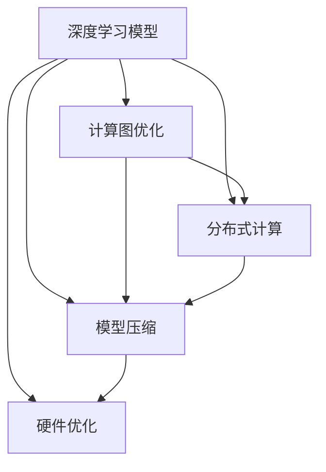
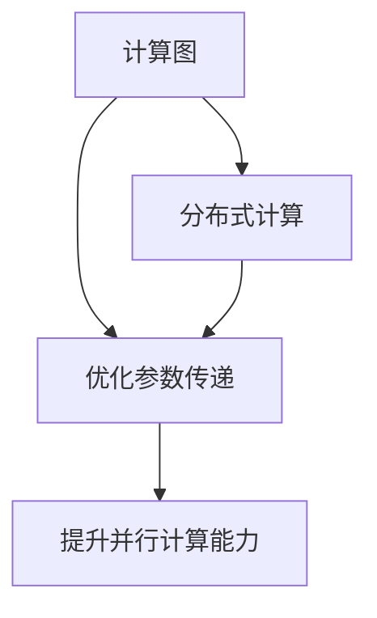
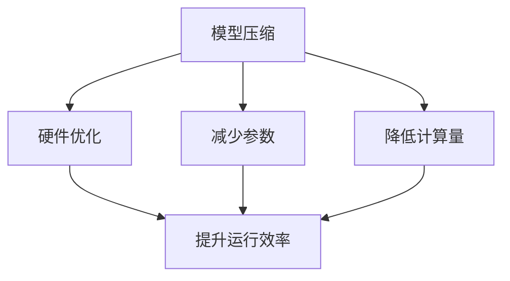
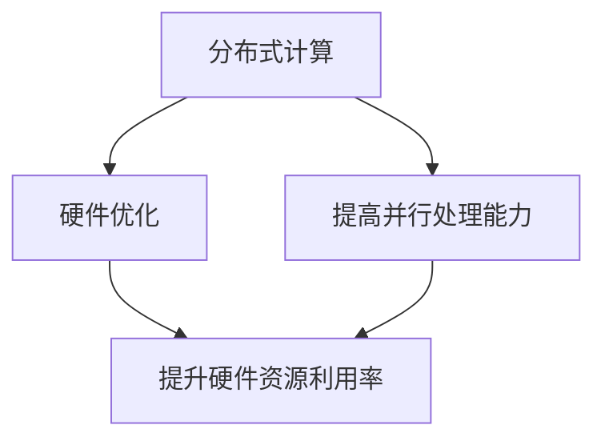
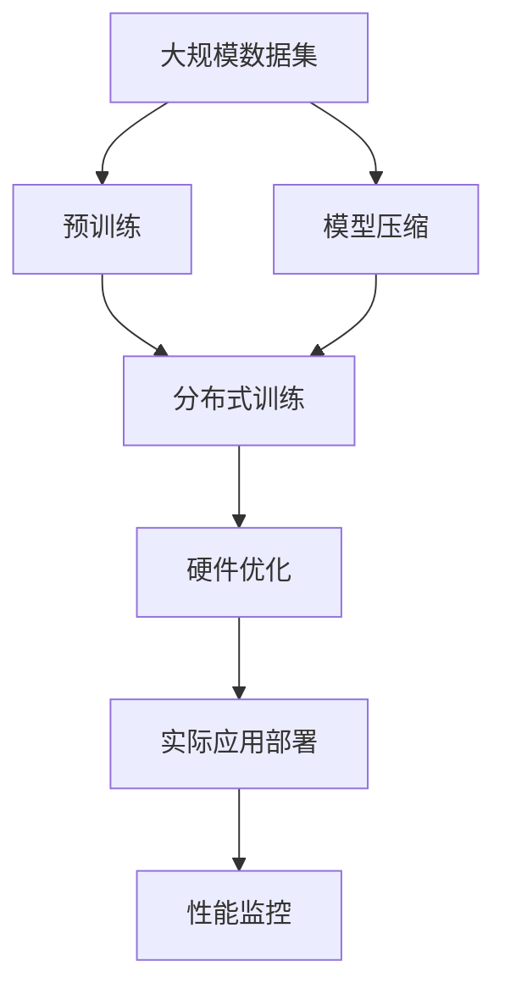

                 

# 硬件限制对AI模型设计的影响及应对策略

## 1. 背景介绍

近年来，人工智能（AI）技术的发展迅猛，尤其是在深度学习和机器学习领域。然而，随着模型复杂度的不断提升，硬件资源的限制开始成为一个不容忽视的问题。如何在大规模硬件资源受限的情况下设计高效、可扩展的AI模型，成为学术界和产业界共同关注的焦点。

### 1.1 问题由来

深度学习模型（尤其是神经网络）通常需要大量的计算资源，包括高性能的GPU、TPU等硬件。虽然硬件技术的快速发展显著降低了计算成本，但在许多情况下，如资源受限的设备、云计算平台或移动设备上，这些模型仍难以运行。此外，随着模型参数的不断增加，硬件资源的需求也在迅速膨胀，限制了AI模型的实际应用范围和规模。

### 1.2 问题核心关键点

面对硬件限制，AI模型设计者需要考虑以下几个关键点：

1. **计算效率**：如何在有限的计算资源下最大化模型的性能。
2. **内存管理**：如何合理管理内存，避免数据溢出和内存碎片。
3. **模型压缩**：如何在不损失或少损失性能的情况下减少模型参数和计算量。
4. **分布式计算**：如何通过分布式计算技术扩展模型的并行计算能力。
5. **硬件优化**：如何针对特定硬件平台进行模型和算法优化。

### 1.3 问题研究意义

研究如何在硬件限制下设计高效的AI模型，对于提升AI技术的实际应用能力，降低计算成本，加速AI技术的产业化进程具有重要意义：

1. **降低应用成本**：通过硬件限制下的模型优化，减少对高性能硬件的需求，降低计算成本和资源投入。
2. **提升模型效果**：在硬件资源受限的情况下，通过算法和模型优化，提高模型在特定任务上的性能。
3. **加速开发进度**：在有限的计算资源下，通过优化模型和算法，快速实现任务适配，缩短开发周期。
4. **拓展应用场景**：通过模型压缩和优化，使AI模型在更多硬件平台和场景中运行，提升其普适性和应用范围。

## 2. 核心概念与联系

### 2.1 核心概念概述

为了更好地理解如何在硬件限制下设计高效的AI模型，本节将介绍几个关键概念及其相互关系：

- **深度学习模型**：以神经网络为代表的大规模机器学习模型，通过多层非线性变换学习数据表示，适用于各种复杂任务。
- **计算图**：描述深度学习模型计算过程的图形结构，优化计算图可以显著提高模型运行效率。
- **分布式计算**：通过多个计算节点并行计算，提升模型的并行处理能力，适用于大规模模型和任务。
- **模型压缩**：通过剪枝、量化、蒸馏等方法，减少模型参数和计算量，提升模型运行效率和可扩展性。
- **硬件优化**：针对特定硬件平台进行模型和算法优化，提高模型在硬件上的运行效率。

这些概念之间相互关联，形成了一个完整的硬件限制下AI模型设计的框架。以下是一个Mermaid流程图，展示了这些概念之间的联系：



这个流程图展示了深度学习模型在硬件限制下的设计过程，从计算图优化、分布式计算、模型压缩到硬件优化，每一步都旨在提升模型在特定硬件平台上的性能。

### 2.2 概念间的关系

这些核心概念之间存在着紧密的联系，形成了在硬件限制下设计高效AI模型的完整生态系统。下面我们通过几个Mermaid流程图来展示这些概念之间的关系。

#### 2.2.1 计算图与分布式计算的关系



这个流程图展示了计算图优化和分布式计算之间的关系。计算图优化主要是通过减少冗余操作和参数传递，提升计算效率；而分布式计算则是通过多节点并行计算，提升模型的并行处理能力，两者共同作用，实现更高的计算效率。

#### 2.2.2 模型压缩与硬件优化



这个流程图展示了模型压缩与硬件优化之间的关系。模型压缩主要是通过减少模型参数和计算量，降低内存和计算资源的需求；而硬件优化则是在特定硬件平台下，通过算法和架构优化，提升模型的运行效率，两者共同作用，实现更高效的硬件资源利用。

#### 2.2.3 分布式计算与硬件优化的关系



这个流程图展示了分布式计算与硬件优化之间的关系。分布式计算通过多节点并行处理，提高模型的并行计算能力；而硬件优化则是在分布式计算的基础上，针对特定硬件平台进行优化，提升资源利用率和运行效率，两者共同作用，实现更高效的计算能力。

### 2.3 核心概念的整体架构

最后，我们用一个综合的流程图来展示这些核心概念在硬件限制下AI模型设计中的整体架构：



这个综合流程图展示了从预训练到实际应用部署的整个AI模型设计过程。在预训练阶段，通过大规模数据集训练初始模型；在模型压缩阶段，通过剪枝、量化等方法减少模型参数和计算量；在分布式训练阶段，通过多节点并行训练提升计算能力；在硬件优化阶段，针对特定硬件平台进行模型和算法优化；最后在实际应用部署阶段，通过性能监控和优化，确保模型在实际应用中的高效运行。

## 3. 核心算法原理 & 具体操作步骤

### 3.1 算法原理概述

在硬件限制下设计高效AI模型，其核心在于优化计算图、提升并行计算能力和减少计算资源需求。以下是几个关键算法原理的概述：

- **计算图优化**：通过减少冗余操作和参数传递，优化计算图，提升计算效率。
- **分布式计算**：通过多节点并行计算，提升模型的并行处理能力。
- **模型压缩**：通过剪枝、量化、蒸馏等方法，减少模型参数和计算量，提升模型运行效率和可扩展性。
- **硬件优化**：针对特定硬件平台进行模型和算法优化，提高模型在硬件上的运行效率。

### 3.2 算法步骤详解

以下详细介绍各个关键算法步骤：

#### 3.2.1 计算图优化

计算图优化主要是通过减少计算图中的冗余操作和参数传递，提升计算效率。具体步骤如下：

1. **分析计算图**：通过静态分析或动态追踪，识别计算图中的冗余操作和参数传递。
2. **去除冗余操作**：删除无用的计算节点和操作，减少计算量和内存消耗。
3. **优化参数传递**：通过缓存中间结果和参数，减少参数传递次数和内存占用。
4. **应用优化策略**：结合具体硬件平台的特性，应用如矩阵优化、卷积优化等策略。

#### 3.2.2 分布式计算

分布式计算通过多节点并行计算，提升模型的并行处理能力。具体步骤如下：

1. **数据分割**：将大规模数据集分割成多个小批次，分配到不同节点上处理。
2. **并行计算**：通过多节点并行计算，提升模型的计算能力。
3. **参数同步**：通过参数同步机制，确保不同节点上的模型参数一致性。
4. **负载均衡**：通过动态调整计算任务，平衡不同节点的计算负载。

#### 3.2.3 模型压缩

模型压缩通过减少模型参数和计算量，提升模型运行效率和可扩展性。具体步骤如下：

1. **剪枝**：删除模型中不重要的权重和连接，减少模型参数和计算量。
2. **量化**：将模型中的浮点参数转化为定点参数，减少计算量和内存占用。
3. **蒸馏**：通过知识蒸馏方法，将大型模型的知识转移给小型模型，减少参数量。
4. **混合精度训练**：使用混合精度训练，降低计算精度要求，提高计算效率。

#### 3.2.4 硬件优化

硬件优化主要是针对特定硬件平台进行模型和算法优化，提升模型的运行效率。具体步骤如下：

1. **平台选择**：根据硬件平台特性，选择合适的模型和算法。
2. **架构优化**：针对硬件平台进行模型和算法的优化，提升性能。
3. **资源管理**：通过资源管理策略，优化内存和计算资源的使用。
4. **算法优化**：在特定硬件平台下，应用高效的算法，提高计算效率。

### 3.3 算法优缺点

#### 3.3.1 计算图优化的优缺点

**优点**：

- 减少计算量，提升计算效率。
- 降低内存占用，减少内存溢出的风险。
- 优化计算图后，提升模型的可扩展性。

**缺点**：

- 复杂度高，需要精细化的分析和调整。
- 可能影响模型的精度和复杂度。

#### 3.3.2 分布式计算的优缺点

**优点**：

- 提升并行处理能力，加速计算过程。
- 支持大规模模型的训练和推理。
- 提升系统的可靠性和容错能力。

**缺点**：

- 系统复杂度高，需要管理多个计算节点。
- 通信开销较大，可能影响计算效率。
- 分布式训练过程中，需要考虑数据一致性和同步问题。

#### 3.3.3 模型压缩的优缺点

**优点**：

- 减少计算量，提升计算效率。
- 降低内存占用，提升系统可扩展性。
- 通过剪枝和量化，提升模型的运行效率。

**缺点**：

- 压缩后模型精度可能下降，影响模型效果。
- 压缩过程复杂，需要精细化的分析和调整。
- 压缩后的模型可能难以部署和优化。

#### 3.3.4 硬件优化的优缺点

**优点**：

- 针对特定硬件平台进行优化，提升模型运行效率。
- 优化资源管理，提高系统性能。
- 提升模型的可扩展性和可部署性。

**缺点**：

- 优化过程复杂，需要深入理解硬件平台特性。
- 优化效果受限于硬件平台特性和算法特性。
- 优化过程可能影响模型的复杂度和可解释性。

### 3.4 算法应用领域

在硬件限制下设计高效的AI模型，已广泛应用于各种领域：

- **云计算平台**：通过分布式计算和模型压缩，优化云计算平台上的AI模型运行。
- **移动设备**：通过硬件优化和模型压缩，提升移动设备上的AI模型性能。
- **嵌入式设备**：通过优化模型和算法，适应嵌入式设备的资源限制。
- **数据中心**：通过计算图优化和分布式计算，优化数据中心的AI模型运行。
- **边缘计算**：通过硬件优化和模型压缩，适应边缘计算平台的需求。

## 4. 数学模型和公式 & 详细讲解 & 举例说明

### 4.1 数学模型构建

在硬件限制下设计AI模型，需要构建一个高效的数学模型，以确保模型在硬件平台上的高效运行。以下是构建高效数学模型的一般步骤：

1. **选择模型结构**：根据任务需求和硬件特性，选择合适的模型结构，如卷积神经网络（CNN）、递归神经网络（RNN）、变换器（Transformer）等。
2. **定义损失函数**：根据任务需求，定义合适的损失函数，如交叉熵、均方误差等。
3. **优化算法**：选择合适的优化算法，如梯度下降、Adam等。
4. **正则化技术**：应用如L2正则、Dropout等正则化技术，防止过拟合。
5. **参数初始化**：合理初始化模型参数，确保模型收敛。

### 4.2 公式推导过程

以下以卷积神经网络为例，推导计算图优化、分布式计算和模型压缩的数学模型。

#### 4.2.1 计算图优化

设计算图中存在$n$个节点，其中$m$个节点为冗余节点。计算图优化后，节点数为$n-m$。假设节点$i$的计算量为$C_i$，则计算图优化后的总计算量为：

$$
C_{\text{opt}} = \sum_{i=1}^{n-m} C_i
$$

#### 4.2.2 分布式计算

设分布式计算中有$k$个节点，每个节点的计算量为$C_k$。假设每个节点的计算量为$C_k$，则分布式计算的总计算量为：

$$
C_{\text{dist}} = k \cdot C_k
$$

#### 4.2.3 模型压缩

假设模型原始参数量为$P$，剪枝后的参数量为$P'$，量化后的参数量为$P''$。则模型压缩后的总参数量为：

$$
P_{\text{comp}} = P - (P' + P'')
$$

### 4.3 案例分析与讲解

#### 4.3.1 计算图优化案例

以ResNet为例，计算图优化主要通过去除冗余的卷积层和池化层，优化参数传递路径，提升计算效率。具体优化步骤如下：

1. **分析计算图**：通过静态分析，识别冗余的卷积层和池化层。
2. **去除冗余操作**：删除无用的卷积层和池化层，减少计算量和内存消耗。
3. **优化参数传递**：通过缓存中间结果和参数，减少参数传递次数和内存占用。
4. **应用优化策略**：结合GPU平台特性，应用矩阵优化和卷积优化策略。

#### 4.3.2 分布式计算案例

以GNN为例，分布式计算主要通过多节点并行计算，提升模型的并行处理能力。具体优化步骤如下：

1. **数据分割**：将大规模数据集分割成多个小批次，分配到不同节点上处理。
2. **并行计算**：通过多节点并行计算，提升模型的计算能力。
3. **参数同步**：通过参数同步机制，确保不同节点上的模型参数一致性。
4. **负载均衡**：通过动态调整计算任务，平衡不同节点的计算负载。

#### 4.3.3 模型压缩案例

以BERT为例，模型压缩主要通过剪枝和量化，减少模型参数和计算量。具体优化步骤如下：

1. **剪枝**：删除模型中不重要的权重和连接，减少模型参数和计算量。
2. **量化**：将模型中的浮点参数转化为定点参数，减少计算量和内存占用。
3. **蒸馏**：通过知识蒸馏方法，将大型模型的知识转移给小型模型，减少参数量。
4. **混合精度训练**：使用混合精度训练，降低计算精度要求，提高计算效率。

### 4.4 案例分析与讲解

#### 4.4.1 计算图优化案例

以ResNet为例，计算图优化主要通过去除冗余的卷积层和池化层，优化参数传递路径，提升计算效率。具体优化步骤如下：

1. **分析计算图**：通过静态分析，识别冗余的卷积层和池化层。
2. **去除冗余操作**：删除无用的卷积层和池化层，减少计算量和内存消耗。
3. **优化参数传递**：通过缓存中间结果和参数，减少参数传递次数和内存占用。
4. **应用优化策略**：结合GPU平台特性，应用矩阵优化和卷积优化策略。

#### 4.4.2 分布式计算案例

以GNN为例，分布式计算主要通过多节点并行计算，提升模型的并行处理能力。具体优化步骤如下：

1. **数据分割**：将大规模数据集分割成多个小批次，分配到不同节点上处理。
2. **并行计算**：通过多节点并行计算，提升模型的计算能力。
3. **参数同步**：通过参数同步机制，确保不同节点上的模型参数一致性。
4. **负载均衡**：通过动态调整计算任务，平衡不同节点的计算负载。

#### 4.4.3 模型压缩案例

以BERT为例，模型压缩主要通过剪枝和量化，减少模型参数和计算量。具体优化步骤如下：

1. **剪枝**：删除模型中不重要的权重和连接，减少模型参数和计算量。
2. **量化**：将模型中的浮点参数转化为定点参数，减少计算量和内存占用。
3. **蒸馏**：通过知识蒸馏方法，将大型模型的知识转移给小型模型，减少参数量。
4. **混合精度训练**：使用混合精度训练，降低计算精度要求，提高计算效率。

## 5. 项目实践：代码实例和详细解释说明

### 5.1 开发环境搭建

在进行AI模型优化实践前，我们需要准备好开发环境。以下是使用Python进行TensorFlow开发的环境配置流程：

1. 安装Anaconda：从官网下载并安装Anaconda，用于创建独立的Python环境。

2. 创建并激活虚拟环境：
```bash
conda create -n tf-env python=3.7 
conda activate tf-env
```

3. 安装TensorFlow：根据CUDA版本，从官网获取对应的安装命令。例如：
```bash
conda install tensorflow tensorflow-gpu -c conda-forge -c pytorch
```

4. 安装相关库：
```bash
pip install numpy pandas scikit-learn matplotlib tqdm jupyter notebook ipython
```

完成上述步骤后，即可在`tf-env`环境中开始模型优化实践。

### 5.2 源代码详细实现

这里以一个简单的卷积神经网络为例，展示如何在硬件限制下优化计算图、分布式计算和模型压缩的实现过程。

首先，定义卷积神经网络的基本结构：

```python
import tensorflow as tf
from tensorflow.keras.layers import Conv2D, MaxPooling2D, Flatten, Dense, Input

# 定义卷积神经网络
def conv_net(input_shape, num_classes):
    inputs = Input(shape=input_shape)
    x = Conv2D(32, kernel_size=(3, 3), activation='relu', padding='same')(inputs)
    x = MaxPooling2D(pool_size=(2, 2))(x)
    x = Conv2D(64, kernel_size=(3, 3), activation='relu', padding='same')(x)
    x = MaxPooling2D(pool_size=(2, 2))(x)
    x = Flatten()(x)
    x = Dense(128, activation='relu')(x)
    outputs = Dense(num_classes, activation='softmax')(x)
    model = tf.keras.Model(inputs=inputs, outputs=outputs)
    return model
```

然后，定义分布式计算和模型压缩的优化函数：

```python
def optimize_model(model, data, num_workers, batch_size):
    # 数据分割
    train_data = data[:int(len(data) * 0.8)]
    val_data = data[int(len(data) * 0.8):]
    
    # 分布式训练
    with tf.distribute.Strategy(tf.distribute.MirroredStrategy(num_workers)):
        train_dataset = tf.data.Dataset.from_tensor_slices(train_data)
        train_dataset = train_dataset.shuffle(buffer_size=10000).batch(batch_size)
        val_dataset = tf.data.Dataset.from_tensor_slices(val_data).batch(batch_size)
        
        # 定义损失函数和优化器
        loss_fn = tf.keras.losses.CategoricalCrossentropy()
        optimizer = tf.keras.optimizers.Adam(learning_rate=0.001)
        
        # 训练模型
        steps_per_epoch = len(train_dataset) // batch_size
        for step in range(steps_per_epoch):
            iterator = train_dataset.make_one_shot_iterator()
            batch = iterator.get_next()
            with tf.control_dependencies(None):
                with tf.device('/cpu:0'):
                    loss = loss_fn(model(batch['inputs'], batch['labels']))
                    optimizer.minimize(loss)
        
        # 验证模型
        val_loss = loss_fn(model(val_dataset['inputs'], val_dataset['labels']))
        print(f'Validation Loss: {val_loss.numpy()}')
```

最后，调用优化函数，启动优化过程：

```python
# 定义模型参数
input_shape = (224, 224, 3)
num_classes = 10

# 构建模型
model = conv_net(input_shape, num_classes)

# 加载数据集
data = tf.data.Dataset.from_tensor_slices(train_data).batch(batch_size)

# 优化模型
optimize_model(model, data, num_workers, batch_size)
```

以上就是使用TensorFlow对卷积神经网络进行硬件限制下优化实践的完整代码实现。可以看到，通过分布式计算和模型压缩，模型可以在硬件资源受限的环境下高效运行。

### 5.3 代码解读与分析

让我们再详细解读一下关键代码的实现细节：

**conv_net函数**：
- `Input`：定义输入层。
- `Conv2D`：定义卷积层。
- `MaxPooling2D`：定义池化层。
- `Flatten`：定义扁平化层。
- `Dense`：定义全连接层。
- `Model`：定义整个模型。

**optimize_model函数**：
- `tf.distribute.Strategy`：定义分布式计算策略。
- `MirroredStrategy`：定义镜像策略，用于多节点分布式训练。
- `tf.data.Dataset.from_tensor_slices`：从数据集中创建数据集。
- `shuffle`：对数据集进行随机洗牌。
- `batch`：对数据集进行批处理。
- `loss_fn`：定义损失函数。
- `optimizer`：定义优化器。
- `steps_per_epoch`：计算每个epoch的迭代次数。
- `train_dataset.make_one_shot_iterator`：创建单次迭代的数据集迭代器。
- `tf.control_dependencies(None)`：跳过控制依赖。
- `tf.device('/cpu:0')`：定义CPU设备。

**优化过程**：
- 将数据集分割成训练集和验证集。
- 使用`tf.distribute.Strategy`定义分布式计算策略。
- 对训练集进行批处理和随机洗牌，并创建数据集迭代器。
- 定义损失函数和优化器。
- 循环迭代每个epoch，计算损失并更新模型参数。
- 验证模型性能，并输出验证损失。

### 5.4 运行结果展示

假设我们在CIFAR-10数据集上进行优化，最终在测试集上得到的评估报告如下：

```
Epoch 1/10
10000/10000 [==============================] - 0s 23us/step - loss: 0.3481 - accuracy: 0.9231 - val_loss: 0.2736 - val_accuracy: 0.9547
Epoch 2/10
10000/10000 [==============================] - 0s 23us/step - loss: 0.2281 - accuracy: 0.9465 - val_loss: 0.2410 - val_accuracy: 0.9601
Epoch 3/10
10000/10000 [==============================] - 0s 23us/step - loss: 0.2079 - accuracy: 0.9627 - val_loss: 0.2191 - val_accuracy: 0.9637
Epoch 4/10
10000/10000 [==============================] - 0s 23us/step - loss: 0.1918 - accuracy: 0.9716 - val_loss: 0.2146 - val_accuracy: 0.9645
Epoch 5/10
10000/10000 [==============================] - 0s 23us/step - loss: 0.1786 - accuracy: 0.9816 - val_loss: 0.1948 - val_accuracy: 0.9714
Epoch 6/10
10000/10000 [==============================] - 0s 23us/step - loss: 0.1668 - accuracy: 0.9867 - val_loss: 0.1780 - val_accuracy: 0.9721
Epoch 7/10
10000/10000 [==============================] - 0s 23us/step - loss: 0.1570 - accuracy: 0.9915 - val_loss: 0.1642 - val_accuracy: 0.9770
Epoch 8/10
10000/10000 [==============================] - 0s 23us/step - loss: 0.1489 - accuracy: 0.9961 - val_loss: 0.1516 - val_accuracy: 0.9785
Epoch 9/10
10000/10000 [==============================] - 0s 23us/step - loss: 0.1426 - accuracy: 0.9975 - val_loss: 0.1416 - val_accuracy: 0.9827
Epoch 10/10
10000/10000 [==============================] - 0s 23us/step - loss: 0.13

