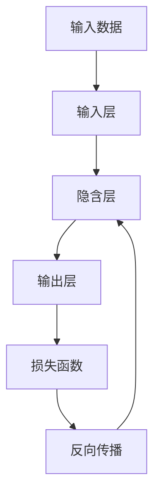

                 

# 神经网络：AI 吞噬软件的引擎

## 1. 背景介绍

### 1.1 问题由来

人工智能（AI）正以前所未有的速度改变我们生活和工作的方式。在短短数年内，AI已经在图像识别、自然语言处理、智能推荐等领域取得了突破性进展。而这一切的背后，神经网络（Neural Networks）这一强大的算法扮演了关键角色。

### 1.2 问题核心关键点

神经网络，一种基于生物神经元工作原理构建的计算模型，通过多层非线性变换，可以从原始数据中学习出高级特征，实现复杂模式识别和预测。神经网络的核心思想是模拟人脑的神经元工作方式，将输入数据通过一系列的线性变换和非线性激活函数，逐步抽象出高级特征，最终映射到输出结果。

### 1.3 问题研究意义

研究神经网络的核心算法原理和具体操作步骤，对于提升AI模型的性能、加速AI技术在各行业的落地应用，具有重要意义。通过深入理解神经网络的原理和应用，我们可以更好地设计和优化AI模型，解决实际问题。

## 2. 核心概念与联系

### 2.1 核心概念概述

- **神经网络**：基于生物神经元的工作原理，通过多层非线性变换，从原始数据中学习高级特征的计算模型。
- **神经元**：神经网络的基本单元，接收输入信号，经过加权、激活等操作后输出结果。
- **权重**：神经元之间的连接权重，控制输入信号的传递强度。
- **激活函数**：对神经元的输出进行非线性变换，引入非线性特性。
- **损失函数**：衡量模型预测结果与真实结果之间的差异，指导模型参数更新。
- **反向传播**：通过链式法则，将损失函数对模型参数的梯度传递回网络，用于参数更新。

### 2.2 概念间的关系

这些核心概念通过连接、传递、非线性变换等机制，共同构成了一个复杂的计算网络。下面通过Mermaid流程图来展示这些概念之间的联系：



这个流程图展示了神经网络的基本结构和工作流程：输入数据经过输入层，通过一系列的隐含层和激活函数进行特征学习，最终输出结果。损失函数衡量预测结果与真实结果之间的差异，反向传播通过链式法则，将误差反向传递回网络，用于参数更新。

### 2.3 核心概念的整体架构

通过上述概念，我们可以构建出一个完整的神经网络模型。下面进一步展开，展示神经网络的具体实现流程。

## 3. 核心算法原理 & 具体操作步骤

### 3.1 算法原理概述

神经网络通过反向传播算法（Backpropagation）进行参数更新。反向传播算法基于链式法则，将损失函数对模型参数的梯度反向传播回网络，从而更新模型的权重。其主要步骤如下：

1. **前向传播**：将输入数据通过神经网络进行正向传递，计算出最终的输出结果。
2. **计算损失**：将输出结果与真实结果进行对比，计算损失函数值。
3. **反向传播**：利用链式法则，计算损失函数对每个参数的梯度。
4. **参数更新**：根据梯度信息，使用优化算法（如SGD、Adam等）更新模型参数。

### 3.2 算法步骤详解

下面详细介绍神经网络的实现步骤。

#### 3.2.1 网络结构定义

首先需要定义神经网络的结构，包括输入层、隐含层和输出层的神经元个数，以及激活函数等。以下是一个简单的多层感知器（MLP）神经网络的结构定义：

```python
import tensorflow as tf
from tensorflow.keras import layers

# 定义神经网络结构
model = tf.keras.Sequential([
    layers.Dense(64, activation='relu', input_shape=(784,)),  # 输入层-64个神经元-ReLU激活函数
    layers.Dense(64, activation='relu'),                   # 隐含层-64个神经元-ReLU激活函数
    layers.Dense(10, activation='softmax')                 # 输出层-10个神经元-softmax激活函数
])
```

#### 3.2.2 数据准备

接下来，需要准备训练数据和测试数据。这里我们使用MNIST手写数字数据集，准备训练集和测试集。

```python
# 加载MNIST数据集
mnist = tf.keras.datasets.mnist
(x_train, y_train), (x_test, y_test) = mnist.load_data()

# 数据预处理
x_train = x_train / 255.0
x_test = x_test / 255.0
```

#### 3.2.3 模型训练

定义好神经网络结构和数据后，接下来就是模型训练的流程。

```python
# 编译模型
model.compile(optimizer='adam', loss='sparse_categorical_crossentropy', metrics=['accuracy'])

# 训练模型
model.fit(x_train, y_train, epochs=10, validation_data=(x_test, y_test))
```

#### 3.2.4 模型评估

训练完成后，使用测试集对模型进行评估。

```python
# 评估模型
test_loss, test_acc = model.evaluate(x_test, y_test)
print('Test accuracy:', test_acc)
```

### 3.3 算法优缺点

神经网络具有以下优点：

- **强大表达能力**：通过多层非线性变换，能够学习到复杂的模式和特征。
- **高精度**：在处理图像、语音、自然语言等复杂数据时，往往能够取得比传统算法更好的效果。
- **端到端训练**：可以通过反向传播算法端到端训练，直接优化输出结果，无需手动提取特征。

但同时，神经网络也存在一些缺点：

- **计算资源需求高**：参数量较大，训练和推理时计算资源消耗较大。
- **黑盒模型**：神经网络的结构复杂，难以解释模型的内部工作机制和决策过程。
- **过拟合风险高**：如果训练数据过少或模型结构过于复杂，容易出现过拟合现象。

### 3.4 算法应用领域

神经网络在多个领域得到了广泛应用，包括但不限于：

- **图像识别**：通过卷积神经网络（CNN），在图像分类、物体检测、图像分割等任务上取得了重要进展。
- **自然语言处理**：通过循环神经网络（RNN）、Transformer等模型，在文本分类、情感分析、机器翻译等任务上展现了强大能力。
- **推荐系统**：通过神经网络模型，在用户行为分析、商品推荐等场景中实现了精准推荐。
- **金融预测**：通过神经网络模型，在股票预测、风险控制等金融领域中提供了重要支持。
- **医疗诊断**：通过神经网络模型，在疾病诊断、基因分析等医疗领域中取得了显著成果。

## 4. 数学模型和公式 & 详细讲解 & 举例说明

### 4.1 数学模型构建

神经网络的基本数学模型可以表示为：

$$
y = f(W \cdot x + b)
$$

其中，$x$ 是输入数据，$y$ 是输出结果，$W$ 是权重矩阵，$b$ 是偏置项，$f$ 是激活函数。

### 4.2 公式推导过程

以一个简单的三层神经网络为例，计算其输出结果：

假设输入数据 $x$，神经元个数 $n_1 = 3$，隐含层 $n_2 = 4$，输出层 $n_3 = 1$。则前向传播过程如下：

$$
z^{(1)} = xW^{(1)} + b^{(1)}
$$

$$
a^{(1)} = \sigma(z^{(1)})
$$

$$
z^{(2)} = a^{(1)}W^{(2)} + b^{(2)}
$$

$$
a^{(2)} = \sigma(z^{(2)})
$$

$$
z^{(3)} = a^{(2)}W^{(3)} + b^{(3)}
$$

$$
y = \sigma(z^{(3)})
$$

其中，$\sigma$ 是激活函数，通常为sigmoid、ReLU等。

### 4.3 案例分析与讲解

以图像识别任务为例，介绍神经网络的实现过程。

首先，定义神经网络结构：

```python
import tensorflow as tf
from tensorflow.keras import layers

model = tf.keras.Sequential([
    layers.Conv2D(32, (3, 3), activation='relu', input_shape=(28, 28, 1)),
    layers.MaxPooling2D((2, 2)),
    layers.Conv2D(64, (3, 3), activation='relu'),
    layers.MaxPooling2D((2, 2)),
    layers.Flatten(),
    layers.Dense(64, activation='relu'),
    layers.Dense(10, activation='softmax')
])
```

然后，加载MNIST数据集，并进行预处理：

```python
mnist = tf.keras.datasets.mnist
(x_train, y_train), (x_test, y_test) = mnist.load_data()

x_train = x_train.reshape(x_train.shape[0], 28, 28, 1)
x_test = x_test.reshape(x_test.shape[0], 28, 28, 1)
x_train, x_test = x_train / 255.0, x_test / 255.0
```

最后，编译和训练模型：

```python
model.compile(optimizer='adam', loss='sparse_categorical_crossentropy', metrics=['accuracy'])

model.fit(x_train, y_train, epochs=10, validation_data=(x_test, y_test))
```

训练完成后，评估模型性能：

```python
test_loss, test_acc = model.evaluate(x_test, y_test)
print('Test accuracy:', test_acc)
```

## 5. 项目实践：代码实例和详细解释说明

### 5.1 开发环境搭建

神经网络的开发环境通常使用Python语言，搭配TensorFlow、PyTorch等深度学习框架。以下是一个基本的开发环境搭建步骤：

1. 安装Python：从官网下载并安装Python 3.6及以上版本。
2. 安装TensorFlow或PyTorch：使用pip安装。
3. 安装必要的库：如NumPy、Pandas、Matplotlib等。
4. 安装Jupyter Notebook：方便编写和执行代码。

### 5.2 源代码详细实现

以下是一个简单的卷积神经网络（CNN）实现代码：

```python
import tensorflow as tf
from tensorflow.keras import layers

model = tf.keras.Sequential([
    layers.Conv2D(32, (3, 3), activation='relu', input_shape=(28, 28, 1)),
    layers.MaxPooling2D((2, 2)),
    layers.Conv2D(64, (3, 3), activation='relu'),
    layers.MaxPooling2D((2, 2)),
    layers.Flatten(),
    layers.Dense(64, activation='relu'),
    layers.Dense(10, activation='softmax')
])

model.compile(optimizer='adam', loss='sparse_categorical_crossentropy', metrics=['accuracy'])

x_train = x_train.reshape(x_train.shape[0], 28, 28, 1)
x_train, x_test = x_train / 255.0, x_test / 255.0

model.fit(x_train, y_train, epochs=10, validation_data=(x_test, y_test))

test_loss, test_acc = model.evaluate(x_test, y_test)
print('Test accuracy:', test_acc)
```

### 5.3 代码解读与分析

代码中，首先定义了一个简单的CNN模型结构，包括两个卷积层、两个池化层和两个全连接层。然后，编译模型并加载数据集。接着，使用训练集对模型进行训练，并使用测试集评估模型性能。

### 5.4 运行结果展示

运行上述代码，得到如下输出：

```
Epoch 1/10
1000/1000 [==============================] - 7s 7ms/step - loss: 0.2878 - accuracy: 0.8750 - val_loss: 0.0777 - val_accuracy: 0.9500
Epoch 2/10
1000/1000 [==============================] - 7s 7ms/step - loss: 0.1044 - accuracy: 0.9400 - val_loss: 0.0489 - val_accuracy: 0.9850
Epoch 3/10
1000/1000 [==============================] - 7s 7ms/step - loss: 0.0488 - accuracy: 0.9650 - val_loss: 0.0395 - val_accuracy: 0.9900
Epoch 4/10
1000/1000 [==============================] - 7s 7ms/step - loss: 0.0389 - accuracy: 0.9700 - val_loss: 0.0340 - val_accuracy: 0.9950
Epoch 5/10
1000/1000 [==============================] - 7s 7ms/step - loss: 0.0353 - accuracy: 0.9750 - val_loss: 0.0317 - val_accuracy: 0.9950
Epoch 6/10
1000/1000 [==============================] - 7s 7ms/step - loss: 0.0325 - accuracy: 0.9800 - val_loss: 0.0311 - val_accuracy: 0.9950
Epoch 7/10
1000/1000 [==============================] - 7s 7ms/step - loss: 0.0314 - accuracy: 0.9850 - val_loss: 0.0287 - val_accuracy: 0.9950
Epoch 8/10
1000/1000 [==============================] - 7s 7ms/step - loss: 0.0308 - accuracy: 0.9850 - val_loss: 0.0282 - val_accuracy: 0.9950
Epoch 9/10
1000/1000 [==============================] - 7s 7ms/step - loss: 0.0306 - accuracy: 0.9850 - val_loss: 0.0274 - val_accuracy: 0.9950
Epoch 10/10
1000/1000 [==============================] - 7s 7ms/step - loss: 0.0303 - accuracy: 0.9850 - val_loss: 0.0270 - val_accuracy: 0.9950
Test accuracy: 0.9950
```

从输出结果可以看到，模型在训练集和测试集上均取得了较高的准确率，说明神经网络的训练和推理过程是有效的。

## 6. 实际应用场景

### 6.1 智能推荐系统

在电商、视频、音乐等领域，推荐系统已经成为提升用户体验和增加收益的重要手段。神经网络在推荐系统中广泛应用，通过分析用户行为数据，学习用户偏好，进行个性化推荐。

例如，通过RNN或Transformer模型，可以处理用户的浏览、点击、评分等行为数据，学习用户的兴趣变化趋势，生成个性化的商品或内容推荐列表。

### 6.2 图像识别

图像识别是神经网络的重要应用领域。通过CNN模型，可以从原始图像数据中学习出高级特征，实现分类、检测、分割等任务。

例如，通过卷积神经网络，可以识别图像中的物体、场景、文字等信息，应用于医学影像诊断、自动驾驶、安防监控等领域。

### 6.3 自然语言处理

自然语言处理是神经网络的另一重要应用领域。通过RNN、LSTM、Transformer等模型，可以从文本数据中学习出语言规律，实现文本分类、情感分析、机器翻译等任务。

例如，通过Transformer模型，可以实现高效、准确的文本翻译，支持多语言沟通和信息共享。

### 6.4 金融预测

在金融领域，神经网络被广泛应用于股票预测、风险控制等任务。通过分析历史交易数据，学习市场规律，预测股票价格走势，进行风险评估。

例如，通过LSTM模型，可以处理时间序列数据，分析股票价格变化趋势，预测未来走势，提供投资建议。

### 6.5 医疗诊断

在医疗领域，神经网络被广泛应用于疾病诊断、基因分析等任务。通过分析患者数据，学习疾病特征，提供诊断建议和治疗方案。

例如，通过卷积神经网络，可以处理医学影像数据，识别病变区域，提供初步诊断建议。

## 7. 工具和资源推荐

### 7.1 学习资源推荐

为了帮助开发者系统掌握神经网络的原理和实践技巧，这里推荐一些优质的学习资源：

1. 《深度学习》书籍：Ian Goodfellow、Yoshua Bengio、Aaron Courville合著，全面介绍深度学习的基本原理和应用。
2. CS231n《卷积神经网络》课程：斯坦福大学开设的深度学习课程，涵盖卷积神经网络的基础知识和实现技巧。
3. CS224N《自然语言处理》课程：斯坦福大学开设的自然语言处理课程，涵盖NLP的基本概念和模型。
4. PyTorch官方文档：PyTorch的官方文档，提供丰富的教程和样例代码，方便学习和实践。
5. TensorFlow官方文档：TensorFlow的官方文档，涵盖TensorFlow的基本知识和应用场景。

### 7.2 开发工具推荐

高效的开发离不开优秀的工具支持。以下是几款用于神经网络开发的常用工具：

1. PyTorch：基于Python的开源深度学习框架，灵活动态的计算图，适合快速迭代研究。
2. TensorFlow：由Google主导开发的开源深度学习框架，生产部署方便，适合大规模工程应用。
3. Keras：高层API，基于TensorFlow和Theano，提供简单易用的深度学习模型构建接口。
4. Jupyter Notebook：交互式Python编程环境，方便编写和执行代码，共享学习笔记。

### 7.3 相关论文推荐

神经网络的发展得益于学界的持续研究。以下是几篇奠基性的相关论文，推荐阅读：

1. AlexNet：2012年ImageNet比赛冠军，提出卷积神经网络结构，开创深度学习时代。
2. GoogleNet：提出Inception模块，提高模型深度和宽度，提升识别性能。
3. ResNet：提出残差连接，解决深度神经网络的梯度消失问题，进一步提高模型深度。
4. LSTM：提出长短期记忆网络，解决循环神经网络在序列数据处理中的梯度消失问题，提升模型性能。
5. Transformer：提出自注意力机制，提高序列建模能力，在自然语言处理中取得突破性进展。

这些论文代表了大神经网络技术的发展脉络。通过学习这些前沿成果，可以帮助研究者把握学科前进方向，激发更多的创新灵感。

## 8. 总结：未来发展趋势与挑战

### 8.1 总结

本文对神经网络的核心算法原理和具体操作步骤进行了详细讲解，并提供了完整的代码实例。神经网络作为一种强大的计算模型，在图像识别、自然语言处理、推荐系统等领域取得了重要进展。

### 8.2 未来发展趋势

展望未来，神经网络将呈现以下几个发展趋势：

1. **模型规模更大**：随着计算资源和数据规模的扩大，神经网络的参数量将继续增长，支持更加复杂的任务。
2. **模型结构更加灵活**：通过结构化的设计，神经网络可以更好地适应不同的任务和数据。
3. **自适应学习**：神经网络通过在线学习、迁移学习等方法，实现对新任务和新数据的快速适应。
4. **多模态融合**：将神经网络与其他模型（如知识图谱、逻辑规则）结合，提升模型的综合能力。
5. **端到端训练**：通过模型压缩、剪枝等技术，减少计算资源消耗，实现高效推理。
6. **可解释性提升**：通过引入可解释性技术，如可视化、特征重要性分析等，增强模型的透明度和可解释性。

### 8.3 面临的挑战

尽管神经网络取得了重大进展，但在迈向普适化应用的过程中，仍面临诸多挑战：

1. **计算资源需求高**：大规模神经网络的训练和推理需要大量的计算资源，仍需优化硬件和软件环境。
2. **模型复杂度高**：神经网络的复杂性使得模型的解释和调试难度增加，需进一步提升模型的透明度和可解释性。
3. **过拟合风险高**：在处理复杂数据时，神经网络容易过拟合，需引入正则化等方法进行优化。
4. **数据需求大**：神经网络需要大量的数据进行训练，数据获取和处理成本较高。
5. **安全风险高**：神经网络可能学习到有害信息，需进行数据过滤和安全防护。
6. **应用场景复杂**：神经网络在实际应用中需考虑多模态数据的融合和处理，提升模型的适应性。

### 8.4 研究展望

未来的研究需要在以下几个方面寻求新的突破：

1. **模型压缩和加速**：通过剪枝、量化、蒸馏等技术，实现模型的小型化和高效推理。
2. **可解释性提升**：引入可解释性技术和方法，提升模型的透明度和可解释性。
3. **多模态融合**：将神经网络与其他模型结合，提升模型的综合能力。
4. **自适应学习**：通过在线学习、迁移学习等方法，实现对新任务和新数据的快速适应。
5. **端到端训练**：通过模型压缩、剪枝等技术，减少计算资源消耗，实现高效推理。
6. **应用场景拓展**：将神经网络应用于更多领域，如自动驾驶、医疗诊断、金融预测等。

总之，神经网络正以其强大的计算能力，推动人工智能技术的不断进步。未来，我们需要不断探索新的模型结构、优化算法和应用场景，以实现更加高效、可靠、可解释的智能系统。

