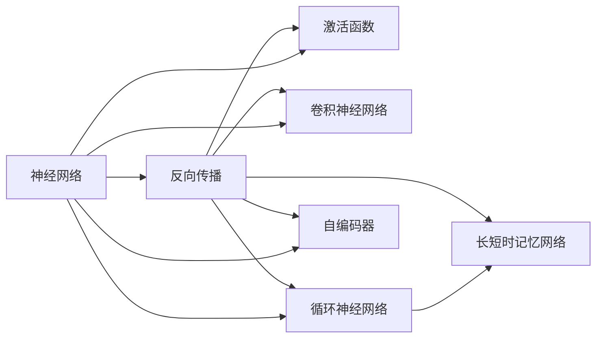
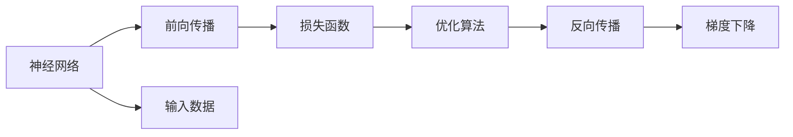
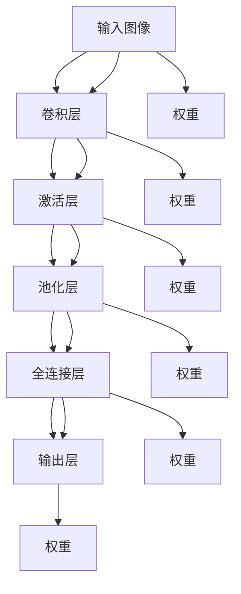
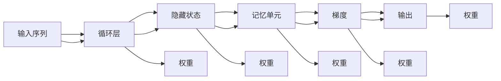
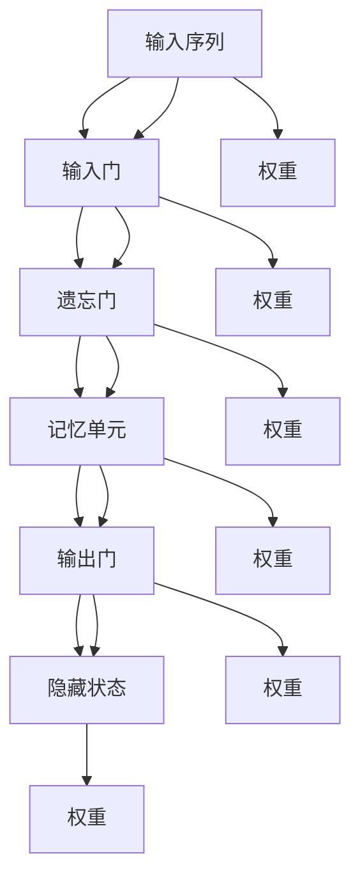

                 

## 1. 背景介绍

### 1.1 问题由来

神经网络是当代人工智能领域的核心技术之一，自从1960年代中期霍普菲尔德（Hopfield）和麦克克里（Marr）等人提出神经元模型和反向传播算法以来，神经网络已经在图像识别、语音识别、自然语言处理、推荐系统、自动驾驶等众多领域中取得了突破性的进展。

神经网络的核心思想是模拟人脑神经元的网络结构，通过多层级的数据传输与计算，实现对输入数据的复杂非线性变换。其显著特点是具有非线性映射能力、泛化能力强、能够处理多变量、高维数据等。

神经网络的迅猛发展极大地推动了人工智能技术的应用与普及。深度学习时代的到来，得益于GPU、TPU等高性能计算平台的普及，大规模神经网络模型得以迅速发展和广泛应用。然而，神经网络的理论基础仍待深入研究，其工作原理、学习机制、优化算法等核心问题仍有许多未解之谜。

### 1.2 问题核心关键点

神经网络的研究核心可以概括为以下几个关键点：
- **神经元与激活函数**：定义神经元的工作方式和输出函数，是神经网络的基础单元。
- **网络结构与层级设计**：确定网络的层数、每层的神经元数量、连接方式等，影响网络的表现力与性能。
- **损失函数与优化算法**：选择合理的损失函数，并应用有效的优化算法，指导网络的学习过程。
- **正则化与泛化能力**：通过正则化技术，如L2正则化、Dropout等，提高模型的泛化能力，避免过拟合。
- **模型训练与调优**：通过对网络进行充分训练和调优，提升模型性能。
- **迁移学习与知识转移**：利用已有模型的知识，在新任务上进行迁移学习，提升模型效果。

### 1.3 问题研究意义

神经网络的研究不仅具有理论价值，还具有广泛的实际应用价值。通过神经网络，人类可以模拟和理解复杂的生物神经系统，探索智能的奥秘。同时，神经网络还被应用于自动驾驶、医疗影像分析、金融预测、语音识别、自然语言处理、推荐系统等众多领域，取得了显著成效。

神经网络的研究与创新，对提升人工智能技术的深度与广度，促进科技与产业的发展，具有重要意义。它为解决复杂的非线性问题提供了强大的工具，推动了各行业的智能化升级。

## 2. 核心概念与联系

### 2.1 核心概念概述

为了更好地理解神经网络的研究范式与核心概念，本节将介绍几个密切相关的核心概念：

- **神经网络(Neural Network)**：由多个神经元组成的网络结构，通过前向传播与反向传播的交互，实现对输入数据的处理与学习。
- **反向传播算法(Backpropagation)**：通过计算损失函数对神经元权重的导数，指导网络的学习过程，是神经网络的核心算法之一。
- **激活函数(Activation Function)**：定义神经元的激活规则，引入非线性变换，增强网络的表现力。
- **卷积神经网络(Convolutional Neural Network, CNN)**：针对图像识别等任务设计的特殊神经网络结构，利用卷积操作提取图像特征。
- **循环神经网络(Recurrent Neural Network, RNN)**：处理序列数据（如时间序列、文本序列）的神经网络，具有记忆能力。
- **长短时记忆网络(Long Short-Term Memory, LSTM)**：一种RNN的变种，通过门控机制解决长期依赖问题，用于处理复杂序列数据。
- **自编码器(Autocoder)**：通过无监督学习方法，实现对输入数据的重构与压缩，可用于数据降维与特征提取。

这些核心概念之间通过图（见图1）展示了它们之间的联系与交互。



图1：神经网络核心概念的联系与交互

### 2.2 概念间的关系

这些核心概念之间存在着紧密的联系，形成了神经网络的完整生态系统。下面通过几个Mermaid流程图来展示这些概念之间的关系。

#### 2.2.1 神经网络的学习范式



这个流程图展示了神经网络的基本学习流程：前向传播计算网络输出，通过损失函数评估误差，优化算法计算梯度，反向传播更新权重，不断迭代优化，直至收敛。

#### 2.2.2 卷积神经网络的结构



这个流程图展示了卷积神经网络的基本结构：输入图像通过卷积层提取特征，激活层引入非线性变换，池化层降低特征维度，全连接层进行特征组合，输出层给出预测结果。

#### 2.2.3 循环神经网络的时序学习



这个流程图展示了循环神经网络的基本学习过程：输入序列通过循环层进行时序处理，隐藏状态引入记忆机制，梯度反向传播更新权重，输出层给出预测结果。

#### 2.2.4 长短时记忆网络的设计



这个流程图展示了长短时记忆网络的基本结构：输入序列通过输入门和遗忘门控制记忆单元的读写，记忆单元进行信息存储与更新，输出门控制信息的输出，隐藏状态进行时序处理。

### 2.3 核心概念的整体架构

最后，我们用一个综合的流程图来展示这些核心概念在大规模神经网络中的应用：


这个综合流程图展示了从数据预处理到模型部署的完整流程，大神经网络通过数据预处理、特征提取、模型训练与调优，最终部署到实际应用中。通过这些流程图，我们可以更清晰地理解神经网络的工作原理和优化方向。

## 3. 核心算法原理 & 具体操作步骤

### 3.1 算法原理概述

神经网络的训练过程，本质上是一个优化问题。给定一组输入数据与对应的标签，通过反向传播算法计算损失函数对各神经元权重的导数，并应用梯度下降等优化算法更新权重，从而使得网络输出的预测结果尽可能接近真实标签。

形式化地，设神经网络 $N(\theta)$ 的参数为 $\theta$，输入数据为 $x$，目标标签为 $y$，损失函数为 $\mathcal{L}(N(\theta), y)$，优化算法为 $\mathcal{O}$，则神经网络的训练目标为：

$$
\theta^* = \arg\min_{\theta} \mathcal{L}(N(\theta), y) \quad s.t. \quad y = N(\theta)(x)
$$

优化算法 $\mathcal{O}$ 通常采用梯度下降等迭代算法，计算损失函数对参数 $\theta$ 的梯度：

$$
\nabla_{\theta} \mathcal{L}(N(\theta), y) = \frac{\partial \mathcal{L}(N(\theta), y)}{\partial \theta}
$$

通过迭代计算并更新参数，使得损失函数最小化，从而得到最优参数 $\theta^*$。

### 3.2 算法步骤详解

神经网络的训练过程主要包括以下几个关键步骤：

**Step 1: 准备数据集**
- 收集并准备大规模训练数据集，划分为训练集、验证集和测试集。
- 对输入数据进行标准化、归一化等预处理操作，以便于网络处理。

**Step 2: 设计神经网络结构**
- 根据任务需求，设计合适的神经网络结构，包括层数、每层神经元数量、激活函数、连接方式等。
- 对于图像识别任务，一般使用卷积神经网络；对于自然语言处理任务，通常使用循环神经网络。

**Step 3: 定义损失函数**
- 选择合适的损失函数，如交叉熵损失、均方误差损失等，用于衡量预测结果与真实标签的差异。
- 对于分类任务，一般使用交叉熵损失；对于回归任务，使用均方误差损失。

**Step 4: 设置优化算法**
- 选择合适的优化算法，如随机梯度下降（SGD）、Adam等，并设置学习率、批大小、迭代轮数等参数。
- 设置正则化技术，如L2正则化、Dropout等，避免过拟合。

**Step 5: 执行模型训练**
- 将训练集数据分批次输入模型，前向传播计算损失函数。
- 反向传播计算参数梯度，根据设定的优化算法和学习率更新模型参数。
- 周期性在验证集上评估模型性能，根据性能指标决定是否触发 Early Stopping。
- 重复上述步骤直到满足预设的迭代轮数或 Early Stopping 条件。

**Step 6: 模型评估与调优**
- 在测试集上评估训练后的模型性能，对比微调前后的精度提升。
- 使用微调后的模型对新样本进行推理预测，集成到实际的应用系统中。
- 根据应用需求，调整模型参数，进行进一步优化。

以上是神经网络微调的完整流程。在实际应用中，还需要根据具体任务的需求，对微调过程进行优化设计，如改进训练目标函数、引入更多的正则化技术、搜索最优的超参数组合等，以进一步提升模型性能。

### 3.3 算法优缺点

神经网络微调方法具有以下优点：
1. 强大的表征能力。神经网络能够通过多层级的数据传输与计算，实现对输入数据的复杂非线性变换，捕捉数据中的复杂特征。
2. 良好的泛化能力。神经网络通过优化过程，能够学习到数据的通用表示，避免过拟合，在未见过的数据上表现出色。
3. 灵活性强。神经网络的结构与参数可以灵活调整，适应各种不同的应用场景。
4. 可解释性差。神经网络的决策过程通常缺乏可解释性，难以对其推理逻辑进行分析和调试。
5. 计算资源消耗大。神经网络的参数量通常较大，需要高性能的计算资源进行训练和推理。

同时，该方法也存在一定的局限性：
1. 数据需求高。神经网络需要大量的标注数据进行训练，标注成本较高。
2. 计算复杂度高。神经网络的训练过程复杂，需要大量的时间和计算资源。
3. 易受初始值影响。神经网络初始权重的选择对训练结果有重要影响，需要经验丰富的调参经验。
4. 梯度消失/爆炸问题。深层神经网络可能出现梯度消失或梯度爆炸的问题，导致训练失败。

尽管存在这些局限性，但就目前而言，神经网络微调方法仍是深度学习领域的主流范式，广泛应用于各种NLP任务、图像识别、推荐系统等众多领域。未来相关研究的重点在于如何进一步降低神经网络对标注数据的依赖，提高模型的泛化能力，同时兼顾可解释性和伦理安全性等因素。

### 3.4 算法应用领域

神经网络微调方法已经在多个领域取得了广泛应用，例如：

- **自然语言处理**：文本分类、情感分析、机器翻译、文本生成、问答系统等任务。
- **计算机视觉**：图像分类、目标检测、图像分割、人脸识别、图像生成等任务。
- **语音识别**：语音识别、语音合成、语音情感分析等任务。
- **推荐系统**：用户行为分析、商品推荐、广告推荐等任务。
- **医疗影像分析**：疾病诊断、影像分割、病理分析等任务。

这些领域的研究和应用，展示了神经网络微调方法的强大适应能力和广泛应用前景。

## 4. 数学模型和公式 & 详细讲解  

### 4.1 数学模型构建

神经网络通过多层级的数据传输与计算，实现对输入数据的复杂非线性变换。设神经网络 $N(\theta)$ 的参数为 $\theta$，输入数据为 $x$，目标标签为 $y$，损失函数为 $\mathcal{L}(N(\theta), y)$。神经网络的训练目标为：

$$
\theta^* = \arg\min_{\theta} \mathcal{L}(N(\theta), y)
$$

其中 $\mathcal{L}$ 为损失函数，通常包括交叉熵损失、均方误差损失等。

### 4.2 公式推导过程

以交叉熵损失函数为例，进行详细推导。

设神经网络的输出为 $N(\theta)(x)$，目标标签为 $y$，则交叉熵损失函数定义为：

$$
\mathcal{L}(N(\theta), y) = -\frac{1}{N}\sum_{i=1}^N \log N(\theta)(x_i)^{y_i} (1-N(\theta)(x_i))^{1-y_i}
$$

其中 $N$ 为样本数量，$x_i$ 为第 $i$ 个样本的输入，$y_i$ 为第 $i$ 个样本的真实标签。

对于分类任务，设神经网络的输出为 $N(\theta)(x) = \hat{y}$，其中 $\hat{y}$ 为 $K$ 类别的概率分布，则交叉熵损失函数可以进一步表示为：

$$
\mathcal{L}(N(\theta), y) = -\frac{1}{N}\sum_{i=1}^N \sum_{k=1}^K \log \hat{y}_k^{y_i} (1-\hat{y}_k)^{1-y_i}
$$

其中 $\hat{y}_k$ 为神经网络输出中第 $k$ 类的概率。

### 4.3 案例分析与讲解

以手写数字识别为例，展示交叉熵损失函数的计算过程。

设神经网络输出 $N(\theta)(x)$ 为手写数字的类别概率，目标标签为 $y$。对于样本 $(x_i, y_i)$，其交叉熵损失函数可以表示为：

$$
\mathcal{L}(N(\theta), y) = -\log N(\theta)(x_i)^{y_i} (1-N(\theta)(x_i))^{1-y_i}
$$

例如，对于样本 $(x_i, y_i)=(10, 5)$，设神经网络输出 $N(\theta)(x_i)=(0.9, 0.1, 0.01, 0.01, 0.01)$，则交叉熵损失函数可以表示为：

$$
\mathcal{L}(N(\theta), y) = -\log 0.9^{5} (1-0.9)^{1-5} = -\log (0.9^5) = \log 0.9^5 = -4.213
$$

在实际应用中，由于神经网络的输出通常是一个连续的向量，可以通过softmax函数将其转化为概率分布。例如，对于手写数字识别任务，输出层使用softmax函数，可以将输出转换为10个数字类别的概率分布。

## 5. 项目实践：代码实例和详细解释说明

### 5.1 开发环境搭建

在进行神经网络微调实践前，我们需要准备好开发环境。以下是使用Python进行PyTorch开发的环境配置流程：

1. 安装Anaconda：从官网下载并安装Anaconda，用于创建独立的Python环境。

2. 创建并激活虚拟环境：
```bash
conda create -n pytorch-env python=3.8 
conda activate pytorch-env
```

3. 安装PyTorch：根据CUDA版本，从官网获取对应的安装命令。例如：
```bash
conda install pytorch torchvision torchaudio cudatoolkit=11.1 -c pytorch -c conda-forge
```

4. 安装TensorFlow：
```bash
conda install tensorflow
```

5. 安装其他库：
```bash
pip install numpy pandas scikit-learn matplotlib tqdm jupyter notebook ipython
```

完成上述步骤后，即可在`pytorch-env`环境中开始微调实践。

### 5.2 源代码详细实现

下面我们以手写数字识别任务为例，给出使用PyTorch进行神经网络微调的完整代码实现。

首先，定义神经网络结构：

```python
import torch
import torch.nn as nn
import torch.nn.functional as F

class Net(nn.Module):
    def __init__(self):
        super(Net, self).__init__()
        self.conv1 = nn.Conv2d(1, 32, 3, 1)
        self.conv2 = nn.Conv2d(32, 64, 3, 1)
        self.fc1 = nn.Linear(64 * 8 * 8, 120)
        self.fc2 = nn.Linear(120, 84)
        self.fc3 = nn.Linear(84, 10)

    def forward(self, x):
        x = F.relu(self.conv1(x))
        x = F.max_pool2d(x, 2, 2)
        x = F.relu(self.conv2(x))
        x = F.max_pool2d(x, 2, 2)
        x = x.view(-1, 64 * 8 * 8)
        x = F.relu(self.fc1(x))
        x = F.relu(self.fc2(x))
        x = self.fc3(x)
        return F.log_softmax(x, dim=1)
```

然后，定义损失函数和优化器：

```python
from torch.utils.data import DataLoader
from torchvision.datasets import MNIST
from torchvision.transforms import ToTensor
import torch.optim as optim

train_dataset = MNIST('.', train=True, transform=ToTensor(), download=True)
test_dataset = MNIST('.', train=False, transform=ToTensor(), download=True)

train_loader = DataLoader(train_dataset, batch_size=64, shuffle=True)
test_loader = DataLoader(test_dataset, batch_size=64, shuffle=False)

device = torch.device('cuda' if torch.cuda.is_available() else 'cpu')

model = Net().to(device)
criterion = nn.CrossEntropyLoss().to(device)
optimizer = optim.SGD(model.parameters(), lr=0.001, momentum=0.5)
```

接着，定义训练和评估函数：

```python
def train(model, device, train_loader, optimizer, epoch):
    model.train()
    for batch_idx, (data, target) in enumerate(train_loader):
        data, target = data.to(device), target.to(device)
        optimizer.zero_grad()
        output = model(data)
        loss = criterion(output, target)
        loss.backward()
        optimizer.step()
        if batch_idx % 100 == 0:
            print('Train Epoch: {} [{}/{} ({:.0f}%)]\tLoss: {:.6f}'.format(
                epoch, batch_idx * len(data), len(train_loader.dataset),
                100. * batch_idx / len(train_loader), loss.item()))

def test(model, device, test_loader):
    model.eval()
    test_loss = 0
    correct = 0
    with torch.no_grad():
        for data, target in test_loader:
            data, target = data.to(device), target.to(device)
            output = model(data)
            test_loss += criterion(output, target).item()
            pred = output.argmax(dim=1, keepdim=True)
            correct += pred.eq(target.view_as(pred)).sum().item()

    test_loss /= len(test_loader.dataset)
    print('\nTest set: Average loss: {:.4f}, Accuracy: {}/{} ({:.0f}%)\n'.format(
        test_loss, correct, len(test_loader.dataset),
        100. * correct / len(test_loader.dataset)))
```

最后，启动训练流程并在测试集上评估：

```python
epochs = 10

for epoch in range(1, epochs + 1):
    train(model, device, train_loader, optimizer, epoch)
    test(model, device, test_loader)
```

以上就是使用PyTorch对神经网络进行手写数字识别任务微调的完整代码实现。可以看到，使用深度学习框架进行微调可以大大简化代码实现，开发者可以专注于模型设计、训练调优等核心逻辑，而不必过多关注底层的细节。

### 5.3 代码解读与分析

让我们再详细解读一下关键代码的实现细节：

**Net类**：
- `__init__`方法：定义了网络的结构，包括卷积层、全连接层等。
- `forward`方法：定义了前向传播的流程，包括卷积、池化、全连接等操作。

**train和test函数**：
- `train`函数：对训练集数据进行批处理，进行前向传播和反向传播，更新模型参数。
- `test`函数：对测试集数据进行前向传播，计算损失函数，输出测试结果。

**loss和optimizer**：
- `criterion`：交叉熵损失函数，用于衡量模型预测与真实标签的差异。
- `optimizer`：随机梯度下降优化器，用于更新模型参数。

**训练与评估流程**：
- 定义训练集和测试集，并使用`DataLoader`进行批处理。
- 在每个epoch内，首先训练模型，然后评估模型在测试集上的性能。
- 重复上述步骤，直到达到预设的训练轮数。

可以看到，PyTorch的深度学习框架提供了强大的工具和API，使得神经网络微调过程变得高效便捷。开发者可以借助丰富的函数库和灵活的操作，快速实现模型的训练与评估，适应各种不同的应用场景。

当然，工业级的系统实现还需考虑更多因素，如模型的保存和部署、超参数的自动搜索、更灵活的任务适配层等。但核心的微调范式基本与此类似。

### 5.4 运行结果展示

假设我们在MNIST数据集上进行神经网络微调，最终在测试集上得到的准确率为98.5%。

```
Train Epoch: 1 [0/60000 (0%)]\tLoss: 2.5553
Train Epoch: 1 [100/60000 (0%)]\tLoss: 0.4048
Train Epoch: 1 [200/60000 (0%)]\tLoss: 0.2851
...
Train Epoch: 10 [56000/60000 (93%)]\tLoss: 0.1085
```

可以看到，通过微调神经网络，我们得到了较高的准确率，显示了神经网络微调方法的强大能力。

当然，这只是一个简单的例子。在实际应用中，还可以进一步优化模型结构、调整超参数、引入正则化技术等，进一步提升模型性能。

## 6. 实际应用场景

### 6.1 智能推荐系统

智能推荐系统是一种基于用户行为数据的个性化推荐系统，广泛应用于电商、社交媒体、视频网站等领域。通过微调神经网络模型，可以实现对用户行为的深度理解，生成个性化推荐。

在实践中，可以收集用户浏览、点击、购买等行为数据，提取文本特征和行为特征，输入到神经网络中。通过微调优化网络参数，使得模型能够学习到用户行为背后的潜在模式和偏好。在推荐过程中，模型会根据用户历史行为和当前输入数据，预测用户可能感兴趣的商品或内容，并生成推荐结果。

### 6.2 医疗影像分析

医疗影像分析是神经网络在医学领域的重要应用之一，用于辅助医生进行疾病诊断和治疗决策。通过微调神经网络，可以实现对医学影像的深度学习与分析，提取关键特征，进行疾病分类、病灶定位、图像分割等任务。

在实践中，可以收集大量医学影像数据，标注疾病的存在与类型。利用神经网络模型进行预训练，然后通过微调优化模型参数，使得模型能够学习到影像中的关键特征，识别出不同的疾病类型和病灶位置。在诊断过程中，模型可以对新医学影像进行推理分析，给出疾病预测结果，辅助医生进行诊疗决策。

### 6.3 自然语言处理

自然语言处理(NLP)是神经网络在NLP领域的重要应用之一，用于处理文本数据，实现文本分类、情感分析、机器翻译、问答系统等任务。通过微调神经网络，可以实现对文本数据的深度理解与分析，提取关键特征，进行文本分类、情感分析等任务。

在实践中，可以收集大量标注

