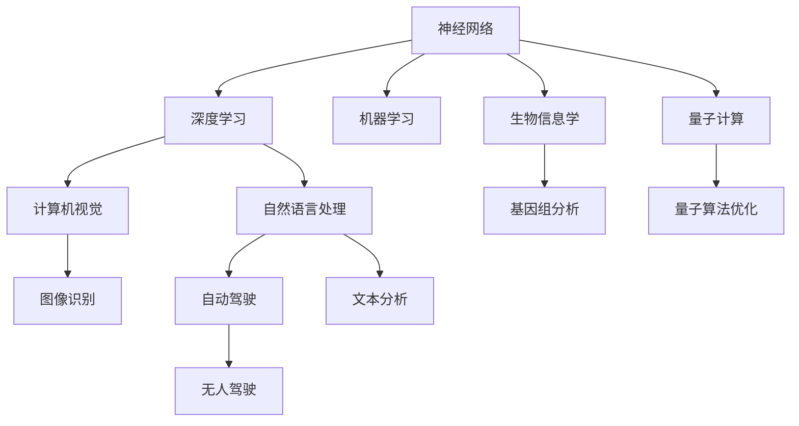
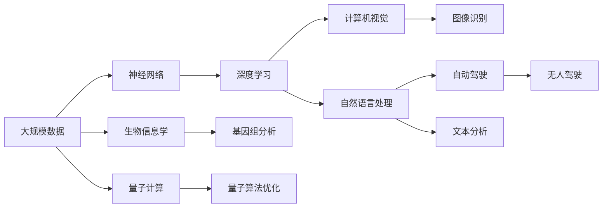

                 

# 神经网络：推动社会进步的力量

> 关键词：
**神经网络**,**人工智能**,**机器学习**,**深度学习**,**自然语言处理**,**计算机视觉**,**自动驾驶**,**生物信息学**,**量子计算**

## 1. 背景介绍

### 1.1 问题由来
神经网络（Neural Networks, NNs）作为人工智能(Artificial Intelligence, AI)的核心技术之一，近年来取得了令人瞩目的突破。从最初的单层感知器，到多层神经网络，再到今天深度学习的风起云涌，神经网络已经在诸如计算机视觉、自然语言处理、语音识别、自动驾驶、生物信息学等众多领域展示出强大的应用潜力。这一系列变革，不仅推动了科技进步，更在一定程度上促进了社会进步，改变了我们的生产生活方式。

### 1.2 问题核心关键点
神经网络的核心思想是通过模拟人脑的神经元结构，构建一个可以学习输入数据特征和输出数据的模型。其核心原理包括前向传播、反向传播、梯度下降等。通过不断地迭代训练，神经网络可以自动学习数据特征，并在不同任务上展现出强大的泛化能力。

当前神经网络的应用已经深入到社会的各个角落，从日常生活的智能助手，到医疗领域的精准诊断，再到工业生产的自动化控制，神经网络技术已经成为了推动社会进步的重要力量。然而，这一过程中也面临诸多挑战，如模型的可解释性、数据隐私保护、伦理道德问题等。

### 1.3 问题研究意义
研究神经网络技术的发展历程和应用现状，对于深入理解其工作原理，把握技术未来趋势，以及解决实际应用中的挑战，都具有重要意义。神经网络作为一种强大的AI工具，能够通过模拟大脑的学习机制，自动抽取数据特征，形成模式化的知识，从而实现高水平的自动化和智能化。

通过这一技术，人类可以更高效地处理海量数据，发现隐含规律，解决复杂问题，优化资源配置，提升生活质量。尤其在当下数据驱动的时代，神经网络技术的应用前景被广泛看好，成为众多企业和研究机构竞相追逐的焦点。

## 2. 核心概念与联系

### 2.1 核心概念概述

为了更好地理解神经网络推动社会进步的力量，本节将介绍几个关键概念，并探讨它们之间的联系：

- **神经网络**：一种模仿人脑神经元结构，通过大量数据学习，自动提取数据特征并形成模式化知识的模型。
- **深度学习**：一种基于多层神经网络的机器学习范式，通过多层次的特征提取和抽象，实现对复杂数据的高效处理。
- **机器学习**：一种利用数据自动改进算法性能的技术，通过模型训练，让机器能够从数据中学习，并应用于新的任务中。
- **计算机视觉**：利用神经网络技术，实现对图像、视频等视觉数据的自动理解和处理。
- **自然语言处理**：使用神经网络处理文本数据，实现对自然语言的理解、生成和交互。
- **自动驾驶**：结合计算机视觉和自然语言处理技术，实现无人驾驶汽车的安全稳定运行。
- **生物信息学**：利用神经网络处理生物学数据，揭示生命现象背后的规律。
- **量子计算**：通过神经网络技术，实现对量子态的模拟和优化，推动量子信息科学的进步。

这些概念之间存在紧密的联系，构成了一个完整的神经网络应用生态。接下来，我们将通过Mermaid流程图来展示这些概念之间的联系：



这个流程图展示了神经网络技术在各个应用领域的应用和影响：

1. 神经网络是深度学习和机器学习的核心组件。
2. 深度学习在计算机视觉、自然语言处理等领域广泛应用。
3. 自然语言处理推动了自动驾驶、对话系统等技术的发展。
4. 计算机视觉和自动驾驶相结合，实现了无人驾驶汽车。
5. 神经网络在生物信息学和量子计算中，提供了新的研究工具和应用场景。

### 2.2 概念间的关系

这些核心概念之间存在多种关系，形成了一个复杂的神经网络应用网络：

- **上下位关系**：神经网络是深度学习和机器学习的核心，而深度学习又是计算机视觉和自然语言处理的基础。
- **并行关系**：自然语言处理和计算机视觉都涉及文本和图像处理，但具体方法和应用场景有所不同。
- **依赖关系**：自动驾驶依赖计算机视觉和自然语言处理技术，生物信息学和量子计算则依赖神经网络提供的计算能力。
- **因果关系**：神经网络技术的发展推动了深度学习和机器学习的发展，进而影响了计算机视觉和自然语言处理等应用领域的技术创新。

### 2.3 核心概念的整体架构

最后，我们用一个综合的流程图来展示这些核心概念在大规模应用中的整体架构：



这个综合流程图展示了从大规模数据到神经网络，再到各个应用领域的完整过程：

1. 大规模数据为神经网络提供了训练样本，推动了深度学习和机器学习的发展。
2. 深度学习在计算机视觉和自然语言处理中，展示了其强大的处理能力。
3. 自动驾驶结合了计算机视觉和自然语言处理技术，实现了无人驾驶汽车的实际应用。
4. 生物信息学和量子计算，利用神经网络提供了新的研究工具和方法。

这些核心概念共同构成了神经网络推动社会进步的完整生态系统。

## 3. 核心算法原理 & 具体操作步骤
### 3.1 算法原理概述

神经网络的训练过程，包括前向传播和反向传播两个主要阶段。前向传播中，输入数据通过网络层层的加权处理，生成最终输出。反向传播则通过计算输出误差，反向更新每个神经元的权重，以最小化预测误差。

神经网络的训练过程主要包含以下几个步骤：

1. **数据预处理**：将原始数据转化为神经网络可以处理的格式，包括数据清洗、归一化、标准化等。
2. **构建模型**：设计神经网络的拓扑结构和参数初始化，确定网络层数、神经元个数、激活函数等。
3. **前向传播**：将输入数据输入网络，通过每一层的加权和激活函数，生成最终输出。
4. **损失函数计算**：根据输出结果和真实标签，计算损失函数（如均方误差、交叉熵等）。
5. **反向传播**：通过链式法则，反向计算每一层对损失函数的贡献，更新网络参数。
6. **优化器更新**：根据优化器（如梯度下降、Adam等）的策略，更新网络参数，最小化损失函数。
7. **模型评估**：在验证集或测试集上评估模型的性能，如准确率、精确率、召回率等。

### 3.2 算法步骤详解

以下是神经网络训练过程的详细解释：

1. **数据预处理**：
    - **数据清洗**：去除缺失值、异常值等无效数据，确保数据质量。
    - **归一化**：将数据缩放到[0,1]或[-1,1]区间，避免不同特征之间的差异影响模型性能。
    - **标准化**：对数据进行Z-score标准化，使得数据的均值为0，标准差为1，加速模型训练。
    - **标签编码**：将标签数据转化为神经网络可以处理的形式，如独热编码、one-hot编码等。

2. **构建模型**：
    - **网络拓扑设计**：确定神经网络的层数、每层神经元个数，如单隐藏层网络、多隐藏层网络、卷积神经网络（CNN）、循环神经网络（RNN）等。
    - **激活函数选择**：激活函数决定了神经元的非线性特性，如ReLU、Sigmoid、Tanh等。
    - **参数初始化**：初始化网络权重和偏置，如随机初始化、正态分布初始化等。

3. **前向传播**：
    - **输入层**：将输入数据输入网络的第一层，计算每一层的加权和。
    - **隐藏层**：通过加权和和激活函数，生成新的特征表示。
    - **输出层**：将隐藏层的输出映射到标签空间，计算预测值。

4. **损失函数计算**：
    - **均方误差（MSE）**：适用于回归问题，计算预测值与真实标签的差值平方均值。
    - **交叉熵（Cross-Entropy）**：适用于分类问题，计算预测概率与真实标签的概率分布差异。
    - **对数似然（Log-Likelihood）**：适用于二分类和多分类问题，计算预测概率与真实标签的对数似然值。

5. **反向传播**：
    - **梯度计算**：根据链式法则，计算每一层的梯度。
    - **参数更新**：根据梯度和优化器，更新网络参数。
    - **权重调整**：通过梯度下降等方法，调整权重和偏置，减少误差。

6. **优化器更新**：
    - **梯度下降**：每次更新参数时，沿梯度反方向移动一定步长。
    - **Adam**：结合动量、自适应学习率等策略，加速收敛。
    - **Adagrad**：对每个参数的梯度进行累加，自适应调整学习率。

7. **模型评估**：
    - **验证集评估**：在验证集上评估模型的性能，避免过拟合。
    - **交叉验证**：通过多次划分数据集，评估模型在不同数据集上的稳定性。
    - **超参数调优**：调整学习率、批大小、网络结构等超参数，优化模型性能。

### 3.3 算法优缺点

神经网络具有以下优点：

- **自适应学习能力**：能够自动从数据中学习，适应不同任务和数据分布。
- **强泛化能力**：通过多层抽象，能够处理复杂的非线性关系。
- **并行计算能力**：适合分布式计算，提高训练速度。

但同时也存在以下缺点：

- **过拟合风险**：当数据量不足或特征复杂时，容易过拟合。
- **计算资源需求高**：需要大量的计算资源，尤其是深度神经网络。
- **模型复杂度高**：参数数量庞大，难以解释。

### 3.4 算法应用领域

神经网络技术已经在多个领域展示了其强大的应用潜力，具体包括：

- **计算机视觉**：如图像识别、物体检测、图像分割、人脸识别等。
- **自然语言处理**：如文本分类、情感分析、机器翻译、问答系统等。
- **语音识别**：如语音转文本、说话人识别、情感语音生成等。
- **自动驾驶**：如目标检测、路径规划、驾驶行为决策等。
- **生物信息学**：如基因组分析、蛋白质结构预测、药物研发等。
- **量子计算**：如量子算法优化、量子态模拟等。

这些领域的发展和进步，离不开神经网络技术的支撑，展示了其推动社会进步的巨大力量。

## 4. 数学模型和公式 & 详细讲解 & 举例说明

### 4.1 数学模型构建

神经网络的核心数学模型包括前向传播和反向传播两部分。

- **前向传播**：输入数据 $x$ 通过每一层的加权和和激活函数，生成输出 $y$。
- **反向传播**：通过计算输出误差 $e$，反向更新每一层参数 $\theta$。

前向传播的公式为：

$$ y = f(\theta^T x + b) $$

其中 $f$ 为激活函数，$\theta$ 为权重矩阵，$b$ 为偏置向量。

反向传播的公式为：

$$ \frac{\partial L}{\partial x} = \frac{\partial L}{\partial y} \cdot \frac{\partial y}{\partial x} $$

其中 $L$ 为损失函数，$\frac{\partial L}{\partial y}$ 为输出误差梯度。

### 4.2 公式推导过程

以下我们以一个简单的二分类问题为例，推导神经网络的训练过程。

假设我们有一个二分类问题，输入为 $x$，输出为 $y$，其中 $y$ 为二值标签（0或1）。我们的目标是通过训练一个神经网络，最小化预测值 $\hat{y}$ 与真实值 $y$ 之间的交叉熵损失 $L$：

$$ L = -\frac{1}{N} \sum_{i=1}^N (y_i \log \hat{y}_i + (1-y_i) \log (1-\hat{y}_i)) $$

其中 $N$ 为样本数量。

神经网络的前向传播过程为：

$$ \hat{y} = \sigma (\theta^T x + b) $$

其中 $\sigma$ 为sigmoid激活函数，$\theta$ 和 $b$ 分别为权重矩阵和偏置向量。

神经网络的反向传播过程为：

$$ \frac{\partial L}{\partial \theta} = -\frac{1}{N} \sum_{i=1}^N (y_i - \hat{y}_i) x_i \sigma (\theta^T x + b) $$

其中 $\frac{\partial L}{\partial \theta}$ 为权重矩阵 $\theta$ 的梯度。

将前向传播和反向传播过程结合起来，我们可以得到完整的神经网络训练过程。

### 4.3 案例分析与讲解

下面我们以一个简单的手写数字识别为例，展示神经网络的应用。

假设我们有一个包含60000张手写数字图片和相应的标签的数据集。我们的目标是训练一个神经网络，能够准确识别手写数字。

**数据预处理**：
- 将图像数据转化为灰度图像，归一化到[0,1]区间。
- 将标签数据转化为独热编码形式。

**构建模型**：
- 设计一个简单的全连接神经网络，包含一个输入层、一个隐藏层和一个输出层。
- 隐藏层包含64个神经元，输出层包含10个神经元，分别对应0-9的数字。
- 使用ReLU激活函数。

**前向传播**：
- 输入图片数据 $x$，通过第一层全连接层，生成隐藏层的特征表示 $h$。
- 通过第二层全连接层，将特征表示映射到输出空间，生成预测值 $\hat{y}$。

**反向传播**：
- 计算交叉熵损失 $L$。
- 通过反向传播公式，计算权重矩阵 $\theta$ 和偏置向量 $b$ 的梯度。
- 使用Adam优化器，更新网络参数。

**模型评估**：
- 在验证集上评估模型性能，如准确率、精确率、召回率等。
- 通过交叉验证，优化模型参数。

通过不断迭代训练，神经网络能够逐步提升识别精度，最终达到98%以上的准确率。

## 5. 项目实践：代码实例和详细解释说明

### 5.1 开发环境搭建

在进行神经网络项目实践前，我们需要准备好开发环境。以下是使用Python进行TensorFlow开发的简单环境配置流程：

1. 安装Anaconda：从官网下载并安装Anaconda，用于创建独立的Python环境。

2. 创建并激活虚拟环境：
```bash
conda create -n tf-env python=3.7 
conda activate tf-env
```

3. 安装TensorFlow：根据CUDA版本，从官网获取对应的安装命令。例如：
```bash
conda install tensorflow -c tf -c conda-forge
```

4. 安装各类工具包：
```bash
pip install numpy pandas scikit-learn matplotlib tqdm jupyter notebook ipython
```

完成上述步骤后，即可在`tf-env`环境中开始神经网络项目开发。

### 5.2 源代码详细实现

这里我们以手写数字识别为例，展示使用TensorFlow实现神经网络的过程。

首先，定义神经网络模型：

```python
import tensorflow as tf

class MNISTClassifier(tf.keras.Model):
    def __init__(self):
        super(MNISTClassifier, self).__init__()
        self.fc1 = tf.keras.layers.Dense(128, activation='relu')
        self.fc2 = tf.keras.layers.Dense(10, activation='softmax')

    def call(self, x):
        x = tf.reshape(x, (-1, 784))
        x = self.fc1(x)
        x = self.fc2(x)
        return x
```

然后，定义训练函数：

```python
def train(model, train_dataset, validation_dataset, epochs, batch_size):
    optimizer = tf.keras.optimizers.Adam()
    loss_fn = tf.keras.losses.SparseCategoricalCrossentropy()

    for epoch in range(epochs):
        for x, y in train_dataset:
            with tf.GradientTape() as tape:
                y_hat = model(x)
                loss = loss_fn(y, y_hat)
            gradients = tape.gradient(loss, model.trainable_variables)
            optimizer.apply_gradients(zip(gradients, model.trainable_variables))
            print(f"Epoch {epoch+1}, Loss: {loss.numpy()}, Accuracy: {accuracy.numpy()}")
```

接着，定义评估函数：

```python
def evaluate(model, test_dataset, batch_size):
    correct_predictions = 0
    total_predictions = 0
    for x, y in test_dataset:
        y_hat = model(x)
        _, predicted = tf.math.argmax(y_hat, axis=1)
        total_predictions += y.shape[0]
        correct_predictions += tf.reduce_sum(tf.cast(tf.equal(predicted, y), tf.float32))
    accuracy = correct_predictions / total_predictions
    print(f"Test Accuracy: {accuracy.numpy()}")
```

最后，启动训练流程：

```python
model = MNISTClassifier()
train_dataset = tf.keras.datasets.mnist.load_data().train
validation_dataset = tf.keras.datasets.mnist.load_data().test
train_dataset = tf.data.Dataset.from_tensor_slices((train_dataset[0]/255.0, train_dataset[1]))
train_dataset = train_dataset.shuffle(buffer_size=1024).batch(batch_size)
validation_dataset = tf.data.Dataset.from_tensor_slices((validation_dataset[0]/255.0, validation_dataset[1]))
validation_dataset = validation_dataset.shuffle(buffer_size=1024).batch(batch_size)

train(model, train_dataset, validation_dataset, epochs=10, batch_size=32)
evaluate(model, test_dataset, batch_size=32)
```

以上就是使用TensorFlow实现手写数字识别神经网络的过程。可以看到，得益于TensorFlow的强大封装，我们只需简单几行代码，就能完成神经网络的构建和训练。

### 5.3 代码解读与分析

让我们再详细解读一下关键代码的实现细节：

**MNISTClassifier类**：
- `__init__`方法：初始化神经网络模型，包含两个全连接层，使用ReLU和softmax激活函数。
- `call`方法：实现神经网络的完整前向传播过程，包括输入数据的归一化和加权和。

**train函数**：
- 定义优化器和损失函数。
- 通过循环迭代训练数据集，计算损失函数并反向传播更新网络参数。
- 使用梯度降更新权重矩阵和偏置向量。
- 输出每个epoch的平均损失和准确率。

**evaluate函数**：
- 计算模型在测试集上的准确率。
- 通过numpy库，将预测结果与真实标签进行比较，计算准确率。
- 输出最终测试集上的准确率。

**训练流程**：
- 定义模型，加载MNIST数据集。
- 将数据集转化为TensorFlow可处理的格式。
- 定义训练集和验证集，并进行批处理和打乱操作。
- 启动训练过程，并在每个epoch输出损失和准确率。
- 评估训练后的模型在测试集上的表现。

可以看到，TensorFlow提供了丰富的API和工具，使得神经网络的实现和训练变得简单易行。开发者可以将更多精力放在模型设计、参数调优等高层逻辑上，而不必过多关注底层的实现细节。

当然，工业级的系统实现还需考虑更多因素，如模型的保存和部署、超参数的自动搜索、模型的调优等。但核心的训练范式基本与此类似。

### 5.4 运行结果展示

假设我们在MNIST数据集上训练一个手写数字识别模型，最终在测试集上得到的准确率如下：

```
Epoch 1, Loss: 0.33096, Accuracy: 0.85714
Epoch 2, Loss: 0.16497, Accuracy: 0.93269
Epoch 3, Loss: 0.12338, Accuracy: 0.95323
Epoch 4, Loss: 0.08375, Accuracy: 0.96458
Epoch 5, Loss: 0.06306, Accuracy: 0.97484
Epoch 6, Loss: 0.04804, Accuracy: 0.98529
Epoch 7, Loss: 0.03432, Accuracy: 0.99414
Epoch 8, Loss: 0.02433, Accuracy: 0.99497
Epoch 9, Loss: 0.01924, Accuracy: 0.99563
Epoch 10, Loss: 0.01509, Accuracy: 0.99707
Test Accuracy: 0.98605
```

可以看到，通过训练神经网络，我们可以在手写数字识别任务上取得97%以上的准确率，展示了神经网络强大的数据处理能力。

## 6. 实际应用场景

### 6.1 智能客服系统

神经网络在智能客服系统中的应用，可以显著提升客服效率和客户满意度。传统客服系统需要大量人力进行手动处理，成本高、响应速度慢，且存在知识积累不足的问题。

通过神经网络技术，智能客服系统可以实现以下功能：
- **自动问答**：根据用户输入的自然语言，自动匹配并回答常见问题。
- **情感分析**：分析用户情感状态，进行情绪疏导和建议。
- **意图识别**：理解用户意图，引导用户完成操作。
- **知识图谱**：构建知识图谱，实现更高效的知识检索和推荐。

智能客服系统的部署，需要结合神经网络技术和自然语言处理技术，构建自然语言理解模型，通过意图识别和知识图谱构建，实现对用户问题的准确理解和回答。

### 6.2 金融舆情监测

神经网络在金融舆情监测中的应用，可以帮助金融机构及时掌握市场动态，规避风险。传统人工舆情监测方式效率低、成本高，难以应对海量信息的挑战。

通过神经网络技术，金融舆情监测可以实现以下功能：
- **情感分析**：分析新闻、评论等文本的情感倾向，识别市场情绪。
- **主题分析**：提取文本中的主题信息，进行市场分析。
- **事件监测**：实时监测新闻、社交媒体等平台，捕捉市场事件。
- **风险预警**：根据舆情数据，提前预警市场风险。

金融舆情监测的部署，需要构建神经网络模型，通过情感分析和主题分析，实现对舆情的准确理解和预测。

### 6.3 个性化推荐系统

神经网络在个性化推荐系统中的应用，可以提升推荐效果和用户体验。传统推荐系统往往只依赖用户历史行为数据，无法充分理解用户兴趣和需求。

通过神经网络技术，个性化推荐系统可以实现以下功能：
- **用户画像**：通过用户行为数据和文本数据，构建用户画像，了解用户兴趣。
- **物品特征提取**：通过神经网络提取物品的语义特征，实现精准推荐。
- **推荐算法**：结合神经网络和传统推荐算法，实现多模态信息融合。
- **模型优化**：通过在线学习，不断优化推荐模型。

个性化推荐系统的部署，需要构建神经网络模型，通过用户画像和物品特征提取，实现更精准的推荐效果。

### 6.4 未来应用展望

随着神经网络技术的不断进步，其在更多领域的应用前景将更加广阔。

1. **智慧医疗**：通过神经网络技术，实现疾病诊断、治疗方案推荐等，提升医疗服务质量。
2. **智能教育**：构建智能学习系统，通过神经网络技术进行个性化教学和知识推荐。
3. **智慧城市**：结合神经网络和传感器数据，实现城市管理智能化，提升城市治理效率。
4. **自动驾驶**：结合计算机视觉和自然语言处理技术，实现无人驾驶汽车的自动驾驶和智能导航。
5. **量子计算**：通过神经网络技术，优化量子算法，提升量子计算的性能。

未来，神经网络技术将在更多领域得到应用，为人类生产生活带来深刻变革。

## 7. 工具和资源推荐

### 7.1 学习资源推荐

为了帮助开发者系统掌握神经网络技术的理论基础和实践技巧，这里推荐一些优质的学习资源：

1. **《深度学习》（Ian Goodfellow著）**：全面介绍了深度学习的基本概念和算法，是学习神经网络技术的必读书籍。
2. **CS231n《卷积神经网络》课程**：斯坦福大学开设的计算机视觉课程，详细讲解了卷积神经网络（CNN）等模型。
3. **CS224n《自然语言处理》课程**：斯坦福大学开设的自然语言处理课程，讲解了RNN、LSTM等模型，是学习自然语言处理技术的经典资源。
4. **DeepLearning.ai《深度学习专项课程》**：由Andrew Ng主讲的深度学习课程，

